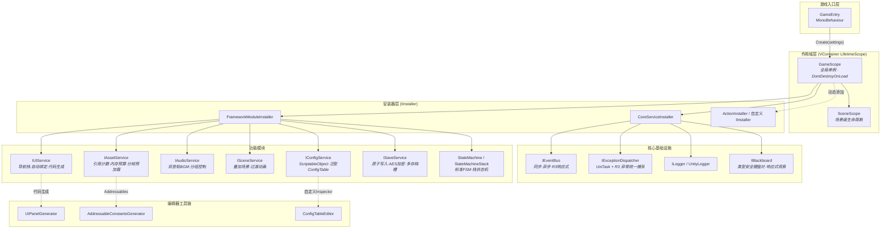

CFramework 是一款基于 **VContainer、UniTask、R3、Odin Inspector 和 Addressables** 五大核心库构建的 Unity 游戏开发框架，版本号 1.4.2，最低支持 Unity 2021.3。它的设计哲学可以概括为一句话：**用依赖注入驱动一切，用接口隔离一切，用响应式连接一切**。框架将游戏开发中最常见的基础设施——资源加载、UI 管理、音频播放、场景切换、配置读取、数据存档和状态管理——封装为 9 个独立的功能模块，每个模块均以 `IXxxService` 接口对外暴露，通过 VContainer 的 `LifetimeScope` 机制完成自动注册与注入。这意味着你在业务代码中永远只与接口打交道，底层实现可以在测试时用 Mock 替换、在运行时用动态安装器热插拔，而无需修改任何调用方代码。

Sources: [package.json](package.json#L1-L30), [README.md](README.md#L1-L21)

## 架构全貌

在深入任何模块细节之前，理解框架的整体分层至关重要。下图展示了 CFramework 从入口到各功能模块的依赖关系与数据流向：



这张图揭示了 CFramework 最核心的架构决策：**所有服务都通过安装器注册到 DI 容器，由 GameScope 统一管理生命周期**。游戏入口只需调用 `GameScope.Create(settings)` 一行代码，框架便会按照 `CoreServiceInstaller → FrameworkModuleInstaller → 动态 IInstaller` 的顺序自动完成所有服务的注册与初始化。服务之间的协作则通过 `IEventBus` 事件总线和 `IBlackboard` 黑板系统实现松耦合通信，而非直接的类型引用。

Sources: [GameScope.cs](Runtime/Core/DI/GameScope.cs#L16-L50), [CoreServiceInstaller.cs](Runtime/Core/DI/CoreServiceInstaller.cs#L10-L22), [FrameworkModuleInstaller.cs](Runtime/Core/DI/FrameworkModuleInstaller.cs#L11-L25)

## 技术栈与依赖

CFramework 站在五个成熟开源库的肩膀上，每一个都解决了 Unity 开发中的一个根本性问题：

| 依赖库 | 版本要求 | 解决的核心问题 | 在框架中的角色 |
|--------|---------|--------------|--------------|
| **VContainer** | 1.17.0+ | Unity 原生缺乏轻量级 DI 容器 | GameScope / SceneScope 作用域管理，所有服务的注册与注入 |
| **UniTask** | 2.5.0+ | Unity 异步编程的零 GC 解决方案 | 所有异步操作（资源加载、场景切换、存档读写）的基础类型 |
| **R3** | 1.3.0+ | Unity 生态的响应式编程库 | EventBus 响应式订阅、UI 数据绑定、黑板观察、存档脏状态监听 |
| **Odin Inspector** | 3.0+ | Unity Inspector 功能增强 | UIBinder 组件编辑器、ConfigTable 可视化编辑 |
| **Addressables** | 1.21+ | Unity 官方资源管理系统 | 资源加载的底层实现，通过 IAssetProvider 接口封装 |

这些依赖并非随意堆砌，而是形成了一条连贯的技术链路：**VContainer 负责组装 → UniTask 负责异步 → R3 负责响应 → Addressables 负责资源 → Odin 负责编辑体验**。理解这条链路，就能理解框架中几乎所有设计决策的来龙去脉。

Sources: [package.json](package.json#L17-L22), [README.md](README.md#L22-L29)

## 模块全景

CFramework 的 9 大模块按职责可以分为三层：**核心基础设施**（Core）、**功能服务**（Asset / UI / Audio / Scene / Config / Save / State）和**编辑器工具链**（Editor）。下表汇总了每个模块的核心能力与关键类型：

| 模块 | 核心接口 / 类 | 关键能力 | 适用场景 |
|------|-------------|---------|---------|
| **Core·DI** | `GameScope`, `SceneScope`, `IInstaller` | 全局/场景两级作用域，动态安装器热插拔 | 游戏入口初始化、跨场景服务共享 |
| **Core·Event** | `IEventBus`, `IEvent`, `IAsyncEvent` | 同步/异步发布订阅，优先级调度，R3 响应式流 | 模块间解耦通信 |
| **Core·Exception** | `IExceptionDispatcher` | 统一捕获 UniTask 和 R3 未处理异常 | 全局错误兜底与日志上报 |
| **Core·Blackboard** | `IBlackboard`, `BlackboardKey<T>` | 类型安全的键值对存储，响应式值变化观察 | 跨系统数据共享（如玩家状态、关卡进度） |
| **Core·Log** | `ILogger`, `UnityLogger`, `LogLevel` | 分级日志控制，运行时热更新级别 | 开发期调试与发布期日志裁剪 |
| **Asset** | `IAssetService`, `AssetHandle`, `IAssetProvider` | 引用计数，内存预算管理，分帧预加载，GameObject 生命周期绑定 | 游戏资源加载与内存管控 |
| **UI** | `IUIService`, `IUI`, `UIBinder` | 面板导航栈，自动组件绑定，代码生成，R3 响应式数据绑定 | UI 界面管理与交互逻辑 |
| **Audio** | `IAudioService`, `AudioGroup` | 双音轨 BGM 交叉淡入淡出，四分组独立音量控制 | 背景音乐无缝切换、音效管理 |
| **Scene** | `ISceneService`, `ISceneTransition` | 场景加载进度回调，叠加场景，FadeTransition 过渡动画 | 关卡切换与多场景协作 |
| **Config** | `IConfigService`, `ConfigTable<TKey, TValue>` | ScriptableObject 数据源，泛型类型安全访问，热重载 | 游戏配置数据读取 |
| **Save** | `ISaveService`, `SaveDataBase` | 原子写入（临时文件+重命名），AES 加密，脏状态追踪，多存档槽 | 玩家存档读写 |
| **State** | `IStateMachine<TKey>`, `IStateMachineStack<TKey>` | 标准 FSM 与栈状态机（Push/Pop），细粒度状态接口按需实现 | 角色状态、游戏流程、菜单层级 |

Sources: [CoreServiceInstaller.cs](Runtime/Core/DI/CoreServiceInstaller.cs#L15-L21), [FrameworkModuleInstaller.cs](Runtime/Core/DI/FrameworkModuleInstaller.cs#L16-L24), [README.md](README.md#L8-L20)

## 项目目录结构

CFramework 的源码组织遵循 Unity Package 的标准布局，逻辑上分为 Runtime（运行时）、Editor（编辑器扩展）和 Tests（单元测试）三个程序集：

```
CFramework/
├── Runtime/                         # 运行时代码 (CFramework.Runtime.asmdef)
│   ├── Core/                        # 核心基础设施
│   │   ├── Blackboard/              #   黑板系统：类型安全键值对 + 响应式观察
│   │   ├── DI/                      #   依赖注入：GameScope、SceneScope、安装器
│   │   ├── Event/                   #   事件系统：同步/异步/R3 响应式
│   │   ├── Exception/               #   全局异常分发器
│   │   └── Log/                     #   分级日志系统
│   ├── Asset/                       # 资源管理：AssetHandle、内存预算、生命周期绑定
│   ├── Audio/                       # 音频系统：双音轨 BGM、分组音量控制
│   ├── Config/                      # 配置表：泛型 ConfigTable、多数据源
│   ├── Extensions/                  # 扩展方法：数值类型扩展
│   ├── Save/                        # 存档系统：原子写入、AES 加密、多存档槽
│   ├── Scene/                       # 场景管理：加载/卸载、叠加场景、过渡动画
│   ├── State/FSM/                   # 状态机：标准 FSM + 栈状态机
│   ├── UI/                          # UI 面板：生命周期、UIBinder 组件注入
│   └── Utility/                     # 通用工具：字符串、随机数、日志
├── Editor/                          # 编辑器工具 (CFramework.Editor.asmdef)
│   ├── Configs/                     #   编辑器配置资产定义
│   ├── Generators/                  #   代码生成器（UI 面板绑定、Addressable 常量）
│   ├── Inspectors/                  #   自定义 Inspector（FrameworkSettings、ConfigTable）
│   ├── Utilities/                   #   编辑器工具（资源后处理器、配置资产创建器）
│   └── Windows/                     #   编辑器窗口（异常查看器、配置创建器等）
├── Tests/                           # 单元测试
│   ├── Editor/                      #   EditMode 测试
│   └── Runtime/                     #   PlayMode 测试（覆盖所有模块）
├── package.json                     # Unity Package 定义
├── README.md                        # 框架文档
└── CHANGELOG.md                     # 版本更新日志
```

这一目录结构体现了**单一职责原则**：每个 `.cs` 文件只包含一个类型定义，每个子目录对应一个独立的功能领域。1.4.1 版本的重构特意将复合文件拆分为单一职责文件（如 `IConfigService.cs` 拆为 `ConfigDataSource.cs`、`ConfigTableBase.cs`、`ConfigTable.cs`、`IConfigService.cs`），使得开发者可以通过文件名快速定位到目标代码。

Sources: [CHANGELOG.md](CHANGELOG.md#L39-L44), [README.md](README.md#L380-L399)

## 核心设计原则

CFramework 的每一行代码都遵循以下四条设计原则，理解它们就能理解框架中那些看似"过度设计"的决策背后的逻辑：

**接口驱动一切**：框架中的 9 大服务全部以 `IXxxService` 接口注册到 DI 容器，业务代码通过构造函数注入或 `Container.Resolve<T>()` 获取服务实例。这意味着你可以为任何服务编写 Mock 实现，在不加载 Unity 场景的情况下完成单元测试。CoreServiceInstaller 注册了 `IExceptionDispatcher → DefaultExceptionDispatcher`、`IEventBus → EventBus`、`ILogger → UnityLogger`、`IAssetProvider → AddressableAssetProvider` 四个核心服务，而 FrameworkModuleInstaller 在此基础上注册了 `IAssetService → AssetService`、`IUIService → UIService` 等 6 个功能模块服务。

Sources: [CoreServiceInstaller.cs](Runtime/Core/DI/CoreServiceInstaller.cs#L15-L21), [FrameworkModuleInstaller.cs](Runtime/Core/DI/FrameworkModuleInstaller.cs#L16-L24), [InstallerExtensions.cs](Runtime/Core/DI/InstallerExtensions.cs#L30-L37)

**作用域控制生命周期**：`GameScope` 继承自 VContainer 的 `LifetimeScope`，作为全局单例持有 DI 容器，标记 `DontDestroyOnLoad` 确保跨场景存活；`SceneScope` 则在场景级别管理局部依赖。这种两级作用域设计使得全局服务（如音频、事件总线）与场景专属服务（如特定关卡的配置加载器）各得其所，不会互相干扰。

Sources: [GameScope.cs](Runtime/Core/DI/GameScope.cs#L16-L50), [SceneScope.cs](Runtime/Core/DI/SceneScope.cs#L1-L16)

**动态安装器热插拔**：`GameScope.AddInstaller()` 方法允许你在游戏运行期间的任何时刻注册新的服务模块。如果 GameScope 尚未构建，安装器会排队等待首次构建；如果已经构建完成，则会自动触发 `RebuildContainer()` 重建 DI 容器。`ActionInstaller` 提供了一种无需创建独立 Installer 类的快捷方式，适合少量服务的临时注册。框架还通过 `[RuntimeInitializeOnLoadMethod]` 标记的 `ResetStaticState()` 方法确保 Domain Reload 时自动清理静态安装器列表，防止残留导致重复注册。

Sources: [GameScope.cs](Runtime/Core/DI/GameScope.cs#L71-L160), [ActionInstaller.cs](Runtime/Core/DI/ActionInstaller.cs#L1-L31)

**响应式数据流**：R3 作为响应式编程库贯穿框架的多个模块——EventBus 的 `Receive<T>()` 方法将事件转化为 `Observable<T>` 流，支持过滤、组合、节流等 Rx 操作符；Blackboard 的 `Observe<T>()` 方法让任何值变化都可以被订阅；SaveService 的 `OnDirtyChanged` 属性暴露脏状态的响应式通知；UIService 的 `OnPanelOpened` / `OnPanelClosed` 同样是 R3 Observable。这种统一的响应式范式使得数据流向清晰可追踪，避免了传统回调地狱。

Sources: [IEventBus.cs](Runtime/Core/Event/IEventBus.cs#L42-L43), [IBlackboard.cs](Runtime/Core/Blackboard/IBlackboard.cs#L86-L92), [ISaveService.cs](Runtime/Save/ISaveService.cs#L37-L38)

## 为什么选择 CFramework

在 Unity 生态中已经存在诸多框架（如 GameFramework、QFramework、ET 等），CFramework 的差异化价值体现在以下四个维度：

**轻量且完整**：框架不试图提供"万能解决方案"，而是精确覆盖游戏开发中最常用的 9 个基础设施领域。每个模块的接口设计精炼——`IAssetService` 只有 7 个方法，`IUIService` 只有 8 个方法——开发者可以在半小时内掌握任何一个模块的全部 API。这种克制避免了学习曲线陡峭和心智负担过重的问题。

**现代异步栈**：框架全面拥抱 UniTask + R3 的异步编程模型。所有耗时操作（资源加载、场景切换、存档读写、配置热重载）均返回 `UniTask`，支持 `await` 和 `CancellationToken` 取消；所有事件和数据变化均支持 R3 响应式订阅，配合 `.AddTo(disposables)` 实现自动生命周期管理。相比传统基于回调或协程的框架，CFramework 的异步代码更清晰、更不容易产生内存泄漏。

**可测试性优先**：从目录结构中可以看到，Tests/Runtime 下覆盖了 Asset、Audio、Config、Core、Log、Save、Scene、State、UI 全部模块的单元测试。框架在 1.4.1 版本将测试覆盖率提升到了 **100%**。这得益于接口驱动设计——每个服务的实现都可以通过替换 Mock 来独立测试，无需加载真实的 Addressables 资源或创建 UI 预制体。

**开发者体验**：编辑器工具链覆盖了日常开发的高频操作——UI 面板代码生成器从预制体命名规范（`btn_`、`txt_`、`img_` 前缀）自动生成组件绑定代码，Addressable 常量生成器将资源 Key 编译为类型安全的静态字段，ConfigTable 自定义 Inspector 提供了可视化配置编辑体验。这些工具的目标是消除"样板代码编写"这项最枯燥的开发工作。

Sources: [CHANGELOG.md](CHANGELOG.md#L34-L36), [README.md](README.md#L147-L189), [README.md](README.md#L345-L357)

## 接下来读什么

CFramework 的文档按照 **Diátaxis 方法论** 组织为「入门指南」和「深入理解」两大板块。建议按照以下顺序阅读：

**第一步：跑起来** —— 掌握框架的基本使用流程：
- [快速上手：安装、配置与运行第一个游戏场景](2-kuai-su-shang-shou-an-zhuang-pei-zhi-yu-yun-xing-di-ge-you-xi-chang-jing) — 从安装到运行，最快 10 分钟上手
- [FrameworkSettings 全局配置详解](3-frameworksettings-quan-ju-pei-zhi-xiang-jie) — 理解框架的每一个配置项
- [游戏入口与生命周期：GameScope 创建与服务初始化流程](4-you-xi-ru-kou-yu-sheng-ming-zhou-qi-gamescope-chuang-jian-yu-fu-wu-chu-shi-hua-liu-cheng) — 深入理解游戏启动的全过程

**第二步：深入核心** —— 按需阅读你正在使用的模块：
- [依赖注入体系：GameScope、SceneScope 与动态安装器机制](5-yi-lai-zhu-ru-ti-xi-gamescope-scenescope-yu-dong-tai-an-zhuang-qi-ji-zhi) — 理解 DI 如何驱动整个框架
- [事件总线：同步/异步发布订阅与 R3 响应式集成](6-shi-jian-zong-xian-tong-bu-yi-bu-fa-bu-ding-yue-yu-r3-xiang-ying-shi-ji-cheng) — 模块间通信的核心机制

**第三步：按需选读** —— 根据项目需求阅读对应的功能模块文档，每篇都包含架构说明、使用示例和最佳实践。