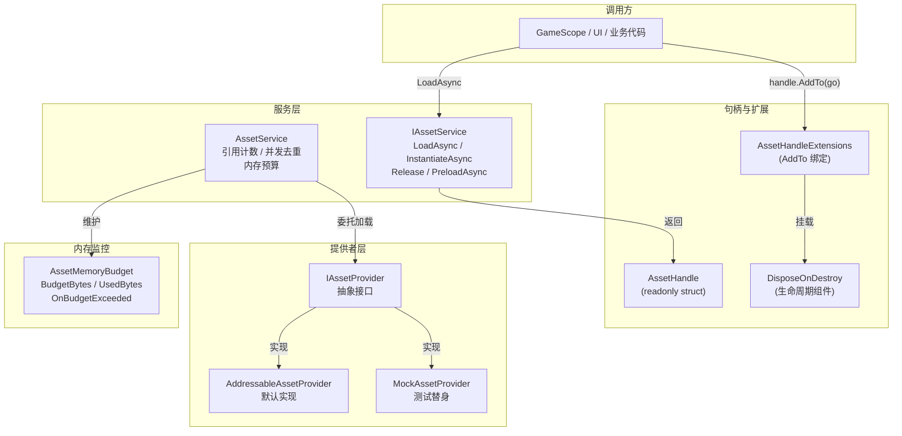
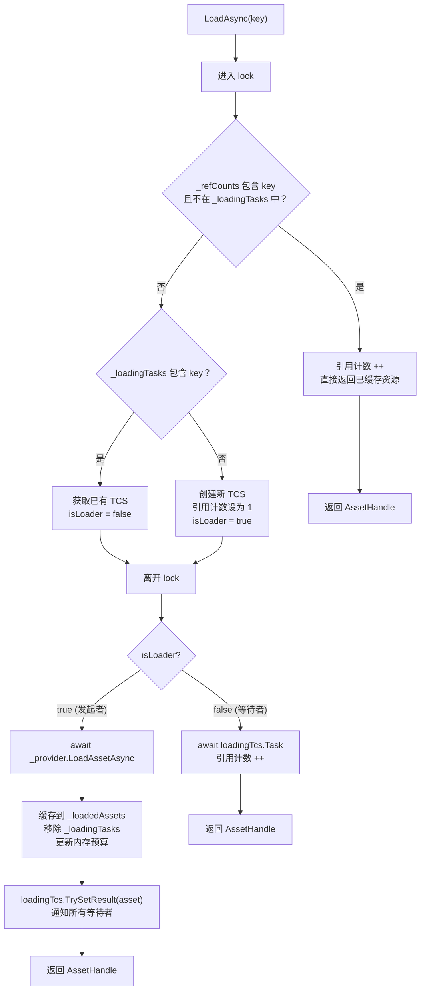
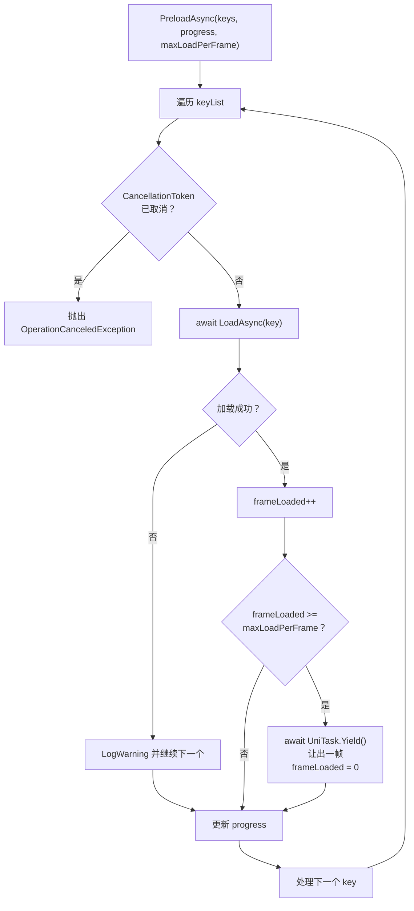
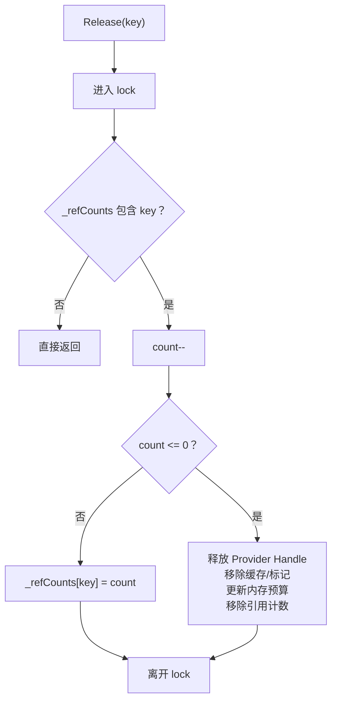

**AssetHandle** 是 CFramework 资源管理子系统的核心数据载体。它以一个轻量级的 `readonly struct` 包装了底层的 Unity 资源引用，并携带了与 `IAssetService` 之间的引用计数契约。本文将从句柄本身的设计出发，逐步展开引用计数机制、实例化流程、内存预算监控、分帧预加载策略以及生命周期绑定等关键主题，帮助开发者理解"加载即持有、释放即归还"的资源生命周期模型。

Sources: [AssetHandle.cs](Runtime/Asset/AssetHandle.cs#L1-L36), [IAssetService.cs](Runtime/Asset/IAssetService.cs#L1-L84)

## 整体架构概览

资源句柄并非孤立存在，它嵌入在一个三层架构中：**服务接口层**（`IAssetService`）定义了加载、实例化、释放等公共契约；**服务实现层**（`AssetService`）管理引用计数字典、并发去重和内存预算；**提供者层**（`IAssetProvider` / `AddressableAssetProvider`）封装了底层 Addressables 调用。AssetHandle 作为服务层返回给调用方的值类型凭证，持有资源的弱引用与服务回调，是连接调用方与框架内部的唯一纽带。



Sources: [AssetHandle.cs](Runtime/Asset/AssetHandle.cs#L1-L36), [AssetService.cs](Runtime/Asset/AssetService.cs#L1-L307), [IAssetService.cs](Runtime/Asset/IAssetService.cs#L1-L84), [AddressableAssetProvider.cs](Runtime/Asset/AddressableAssetProvider.cs#L1-L72)

## AssetHandle：不可变的资源凭证

AssetHandle 被设计为 `readonly struct`，这意味着它是一个值类型，赋值时产生完整拷贝而非引用共享。它的三个内部字段——`Asset`（Unity Object 引用）、`_service`（资源服务实例）和 `_key`（资源标识符）——在构造后不可变。这种设计带来的核心收益是：**句柄本身就是引用计数的唯一入口**，调用方通过 `Dispose()` 归还计数，框架无需追踪外部对象的生命周期。

```csharp
// 典型使用：using 语句确保函数退出时自动释放
using var handle = await assetService.LoadAsync<GameObject>("UIPanel_Login");
var prefab = handle.As<GameObject>();
Instantiate(prefab);
```

`As<T>()` 方法提供了类型安全的资源获取，内部就是一次标准的 `as` 转换。由于 `Asset` 属性是公开的，你也可以直接访问它，但 `As<T>()` 在语义上更清晰——它明确表达了"我需要将这个资源视为特定类型"的意图。

Sources: [AssetHandle.cs](Runtime/Asset/AssetHandle.cs#L1-L35)

### Dispose 语义：归还而非销毁

调用 `handle.Dispose()` 不会销毁资源本身，它只是通知 `IAssetService.Release(key)` 将引用计数减一。当计数归零时，服务层才会委托 Provider 执行实际的 Addressables 句柄释放。这意味着多个句柄可以安全地持有同一资源的引用，只要最后一个持有者执行了 `Dispose`，资源就会被正确回收。

Sources: [AssetHandle.cs](Runtime/Asset/AssetHandle.cs#L23-L26), [AssetService.cs](Runtime/Asset/AssetService.cs#L136-L163)

## 引用计数与并发去重

`AssetService` 内部维护了四个核心字典来追踪资源状态：

| 字典 | 类型 | 职责 |
|------|------|------|
| `_refCounts` | `Dictionary<object, int>` | 每个 key 的当前引用计数 |
| `_loadedAssets` | `Dictionary<object, Object>` | 已加载完成的资源缓存 |
| `_loadingTasks` | `Dictionary<object, UniTaskCompletionSource<Object>>` | 正在加载中的任务占位 |
| `_instanceFlags` | `Dictionary<object, bool>` | 标记某个 key 是否为实例化操作 |

Sources: [AssetService.cs](Runtime/Asset/AssetService.cs#L15-L21)

### 三路分支加载模型

`LoadAsync<T>` 的实现采用了一个精巧的三路分支结构，在一次 `lock` 块内完成所有状态判断：



这个设计确保了：**同一资源在任意时刻最多只有一个实际加载请求被发送到 Provider**。并发请求通过 `UniTaskCompletionSource` 实现类似"barrier"的等待模式，第一个到达的请求成为"发起者"执行加载，后续请求作为"等待者"共享同一个结果。所有对字典的读写操作都被 `lock (_lock)` 保护，保证了线程安全。

Sources: [AssetService.cs](Runtime/Asset/AssetService.cs#L33-L92)

## 实例化与 Key 隔离

`InstantiateAsync` 是一个独立于 `LoadAsync` 的操作。它直接委托给 Provider 执行 Addressables 的 `InstantiateAsync`，但使用了一个关键的 key 隔离策略：在原始 key 前添加 `"$inst_"` 前缀，确保实例化操作的引用计数与普通加载操作互不干扰。

| 操作 | Provider 调用 | 内部 Key | 资源缓存 |
|------|--------------|----------|---------|
| `LoadAsync` | `LoadAssetAsync` | 原始 key | 存入 `_loadedAssets` |
| `InstantiateAsync` | `InstantiateAsync` | `"$inst_" + key` | 仅存入 `_instanceFlags` |

这种隔离意味着：加载一个 Prefab 资源（`LoadAsync`）和实例化它（`InstantiateAsync`）是两个完全独立的引用计数通道。调用方需要分别管理它们的释放——`LoadAsync` 返回的 `AssetHandle` 通过 `Dispose` 释放，而 `InstantiateAsync` 创建的实例需要通过 `Release("$inst_" + key)` 归还计数。

Sources: [AssetService.cs](Runtime/Asset/AssetService.cs#L94-L109), [AddressableAssetProvider.cs](Runtime/Asset/AddressableAssetProvider.cs#L37-L53)

## 内存预算监控

`AssetMemoryBudget` 是一个轻量级的内存监控组件，由 `AssetService` 在构造时根据 `FrameworkSettings.MemoryBudgetMB` 初始化：

```csharp
MemoryBudget = new AssetMemoryBudget
{
    BudgetBytes = settings.MemoryBudgetMB * 1024L * 1024L  // MB → Bytes 转换
};
```

Sources: [AssetService.cs](Runtime/Asset/AssetService.cs#L25-L28)

### 核心属性与事件

| 成员 | 类型 | 说明 |
|------|------|------|
| `BudgetBytes` | `long` | 预算上限（字节），可在运行时修改 |
| `UsedBytes` | `long` | 当前已使用字节，由 `AssetService` 内部维护 |
| `UsageRatio` | `float` | 使用率（`UsedBytes / BudgetBytes`），预算为 0 时返回 0 |
| `OnBudgetExceeded` | `event Action<float>` | 当 `UsedBytes > BudgetBytes` 时触发，参数为当前使用率 |

Sources: [AssetMemoryBudget.cs](Runtime/Asset/AssetMemoryBudget.cs#L1-L22)

预算检查发生在每次资源加载完成后——`AssetService.LoadAsync` 将新资源的内存大小累加到 `UsedBytes`，然后调用 `CheckBudget()`。如果超出阈值，`OnBudgetExceeded` 事件就会被触发。框架本身不会主动卸载资源，这个事件的设计意图是让上层业务（如自定义的内存管理策略）决定如何响应预算超限——是释放低优先级缓存、弹出警告、还是延迟后续加载。

值得注意的是，当前 `AddressableAssetProvider.GetAssetMemorySize` 返回固定值 `1024L`。在生产环境中，你可能需要替换为基于 `Profiling.Profiler.GetRuntimeMemorySizeLong` 的精确统计，或者通过自定义 `IAssetProvider` 实现更精确的内存追踪。

Sources: [AssetMemoryBudget.cs](Runtime/Asset/AssetMemoryBudget.cs#L17-L20), [AddressableAssetProvider.cs](Runtime/Asset/AddressableAssetProvider.cs#L67-L70)

## 分帧预加载：PreloadAsync

批量预加载是资源密集型操作，如果不加控制地在单帧内完成，会导致明显的帧率卡顿。`PreloadAsync` 通过一个简洁的"帧配额"机制解决这个问题：

```csharp
await assetService.PreloadAsync(
    keys: preloadKeys,
    progress: new Progress<float>(p => loadingBar.value = p),
    maxLoadPerFrame: 3,   // 每帧最多加载 3 个资源
    ct: cancellationToken
);
```

Sources: [IAssetService.cs](Runtime/Asset/IAssetService.cs#L78-L82)

### 参数说明

| 参数 | 类型 | 默认值 | 说明 |
|------|------|--------|------|
| `keys` | `IEnumerable<object>` | — | 需要预加载的资源 key 列表 |
| `progress` | `IProgress<float>` | `null` | 进度回调，值域 [0, 1]，每处理一个资源报告一次 |
| `maxLoadPerFrame` | `int` | `5` | 每帧最大加载数量，由 `FrameworkSettings.MaxLoadPerFrame` 推荐默认值 |
| `ct` | `CancellationToken` | `default` | 取消令牌，支持随时中断预加载 |

Sources: [IAssetService.cs](Runtime/Asset/IAssetService.cs#L78-L82)

### 执行流程



这个流程的设计要点在于：**每个资源独立 try-catch**，单个资源的加载失败不会中断整个批处理流程，只会打印一条警告日志后继续。`UniTask.Yield()` 在达到帧配额时让出当前协程的执行权，使得下一帧再继续加载。`progress` 回调在每个资源处理完成后触发，UI 层可以据此更新加载进度条。

Sources: [AssetService.cs](Runtime/Asset/AssetService.cs#L182-L217)

## 生命周期绑定：两种机制

CFramework 提供了两种将资源引用计数与外部对象生命周期绑定的机制，它们适用于不同的场景。

### 机制一：AssetHandle.AddTo 扩展方法

```csharp
// 绑定到 GameObject
var handle = await assetService.LoadAsync<GameObject>("EnemyPrefab");
handle.AddTo(gameObject);  // gameObject 销毁时自动 Dispose handle

// 绑定到 MonoBehaviour
handle.AddTo(monoBehaviour);
```

这个扩展方法在目标 GameObject 上挂载一个 `DisposeOnDestroy` 组件，该组件在 `OnDestroy` 回调中批量释放所有注册的 AssetHandle。它使用 `lock` 保护内部的 `List<AssetHandle>`，即使在主线程和销毁回调并发时也是安全的。如果 GameObject 已经被销毁（`_destroyed = true`），后续的 `Add` 操作会被静默忽略。

Sources: [AssetHandleExtensions.cs](Runtime/Asset/AssetHandleExtensions.cs#L1-L69)

### 机制二：AssetService.LinkToScope 服务方法

```csharp
// 绑定到 GameObject（通过 AssetLifetimeTracker 组件）
assetService.LinkToScope("UIPanel_Login", lifetimeGameObject);

// 绑定到 IDisposable scope
var scope = new CancellationTokenSource();
assetService.LinkToScope("LargeTexture", scope);
```

`LinkToScope` 是 `IAssetService` 接口定义的方法，支持两种 scope 类型：

| Scope 类型 | 实现方式 | 触发时机 |
|-----------|---------|---------|
| `GameObject` | 挂载 `AssetLifetimeTracker` 组件 | GameObject 的 `OnDestroy` 回调 |
| `IDisposable` | 创建 `ScopeLink` 包装器 | 手动调用 `Dispose()` 时 |

`LinkToScope` 与 `AddTo` 的核心区别在于：**`LinkToScope` 通过 key 操作而非 AssetHandle**，它不会创建新的句柄，而是在现有引用计数上增加一个，然后绑定到 scope 的生命周期。这意味着它适用于"我有一个已经被加载的资源，想让它跟随某个对象的生命周期"的场景。

Sources: [AssetService.cs](Runtime/Asset/AssetService.cs#L111-L134)

### 内部组件对比

| 组件 | 使用场景 | 触发方式 | 线程安全 |
|------|---------|---------|---------|
| `DisposeOnDestroy` | `AddTo` 扩展方法 | `OnDestroy` 回调 | ✅ `lock` 保护 |
| `AssetLifetimeTracker` | `LinkToScope(GameObject)` | `OnDestroy` 回调 | ❌ 主线程专用 |
| `ScopeLink` | `LinkToScope(IDisposable)` | 手动 `Dispose()` | ❌ 主线程专用 |
| `GameObjectBinding` | `LinkToScope` 返回值 | 手动 `Dispose()`（销毁 tracker） | ❌ 主线程专用 |

Sources: [AssetHandleExtensions.cs](Runtime/Asset/AssetHandleExtensions.cs#L44-L68), [AssetService.cs](Runtime/Asset/AssetService.cs#L227-L304)

## 资源释放策略

`Release` 方法实现了标准的引用计数递减逻辑：每次调用将计数减一，当计数归零时执行实际释放——从 Provider 释放 Addressables 句柄、从 `_loadedAssets` 移除缓存、从 `_instanceFlags` 移除标记、更新内存预算。所有操作在 `lock` 块内完成，保证原子性。

`ReleaseAll` 则是强制性的全量释放，它会遍历所有已加载资源和实例化标记，逐一调用 Provider 的 `ReleaseHandle`，然后清空所有字典并将 `UsedBytes` 归零。这通常用于场景切换或应用暂停时的资源清理。



Sources: [AssetService.cs](Runtime/Asset/AssetService.cs#L136-L180)

## 实战指南：典型使用模式

### 模式一：using 语句管理单次加载

最简单的模式，适用于资源仅在当前函数作用域内使用的场景：

```csharp
public async UniTask ShowWeaponDetail(string weaponId, CancellationToken ct)
{
    using var handle = await _assetService.LoadAsync<Sprite>(weaponId);
    weaponImage.sprite = handle.As<Sprite>();
    // 函数退出时自动 Dispose，引用计数减一
}
```

### 模式二：绑定到 UI 面板生命周期

UI 面板需要在显示期间持续持有资源，面板关闭时自动释放：

```csharp
public async UniTask OpenPanel(string panelKey, CancellationToken ct)
{
    var handle = await _assetService.LoadAsync<GameObject>(panelKey);
    var instance = Instantiate(handle.As<GameObject>(), panelContainer);
    handle.AddTo(instance);  // instance 销毁时自动释放
}
```

### 模式三：场景预加载

在场景切换时批量预加载资源，带进度反馈：

```csharp
public async UniTask EnterBattleScene(CancellationToken ct)
{
    var preloadKeys = new object[] { "Hero", "Enemy_A", "Enemy_B", "BattleBGM", "VFX_Explosion" };
    
    _assetService.MemoryBudget.OnBudgetExceeded += ratio =>
    {
        Debug.LogWarning($"[Battle] 内存预算超限，使用率: {ratio:P0}");
    };
    
    await _assetService.PreloadAsync(
        preloadKeys,
        progress: new Progress<float>(p => loadingSlider.value = p),
        maxLoadPerFrame: 3,
        ct: ct
    );
}
```

### 模式四：LinkToScope 绑定到自定义作用域

当资源的生命周期需要与业务对象（而非 GameObject）绑定时：

```csharp
var cts = new CancellationTokenSource();
var binding = _assetService.LinkToScope("WorldMap_Texture", cts);

// 业务逻辑完成后手动释放
cts.Cancel();
binding.Dispose();  // 触发资源引用计数减一
```

Sources: [AssetHandle.cs](Runtime/Asset/AssetHandle.cs#L1-L36), [AssetHandleExtensions.cs](Runtime/Asset/AssetHandleExtensions.cs#L1-L39), [IAssetService.cs](Runtime/Asset/IAssetService.cs#L40-L83)

## 设计决策与权衡

**为什么 AssetHandle 是 struct 而非 class？** 作为 `readonly struct`，AssetHandle 在赋值时产生完整拷贝，避免了引用语义带来的"谁持有真正的句柄"的歧义。每个拷贝都可以独立调用 `Dispose`，而引用计数机制确保只有最后一个 `Dispose` 才触发实际释放。值类型还避免了 GC 压力，对于资源加载这种高频操作尤为重要。

**为什么实例化使用独立的 key 前缀？** `$inst_` 前缀将"加载资源"和"实例化资源"的引用计数通道完全隔离。这意味着同一个 Prefab 可以被加载一次（作为模板引用）并被实例化多次（作为场景对象），两者的释放互不干扰。没有这个隔离，释放一个实例可能会意外卸载掉被其他代码引用的模板资源。

**为什么 OnBudgetExceeded 是事件而非自动卸载？** 内存管理策略因项目而异——某些项目希望在超限时立即释放低优先级缓存，某些项目希望记录日志并在下次加载前手动干预，还有些项目希望根据平台动态调整策略。事件模式将"检测"与"响应"解耦，最大程度保留了灵活性。

Sources: [AssetHandle.cs](Runtime/Asset/AssetHandle.cs#L1-L36), [AssetService.cs](Runtime/Asset/AssetService.cs#L94-L109), [AssetMemoryBudget.cs](Runtime/Asset/AssetMemoryBudget.cs#L15-L20)

## 延伸阅读

- 了解 `IAssetProvider` 的抽象设计与 `AddressableAssetProvider` 的具体实现，请参阅 [资源管理服务：Addressables 封装、引用计数与生命周期绑定](10-zi-yuan-guan-li-fu-wu-addressables-feng-zhuang-yin-yong-ji-shu-yu-sheng-ming-zhou-qi-bang-ding)
- 了解 `FrameworkSettings` 中 `MemoryBudgetMB` 和 `MaxLoadPerFrame` 的配置方式，请参阅 [FrameworkSettings 全局配置详解](3-frameworksettings-quan-ju-pei-zhi-xiang-jie)
- 了解如何通过自定义 `IAssetProvider` 替换底层资源加载实现，请参阅 [框架扩展指南：自定义 IInstaller、IAssetProvider 与 ISceneTransition](23-kuang-jia-kuo-zhan-zhi-nan-zi-ding-yi-iinstaller-iassetprovider-yu-iscenetransition)
- 了解 `AssetService` 的单元测试策略与 `MockAssetProvider` 的使用方式，请参阅 [单元测试指南：测试覆盖策略与 Mock 替换模式](22-dan-yuan-ce-shi-zhi-nan-ce-shi-fu-gai-ce-lue-yu-mock-ti-huan-mo-shi)