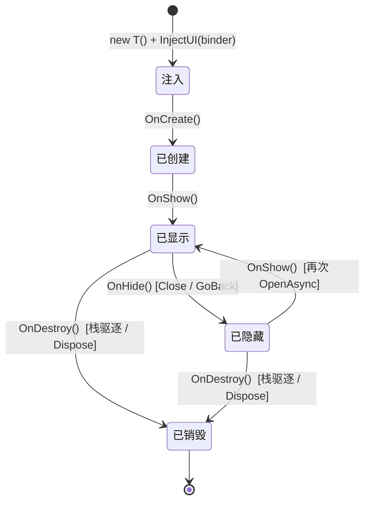
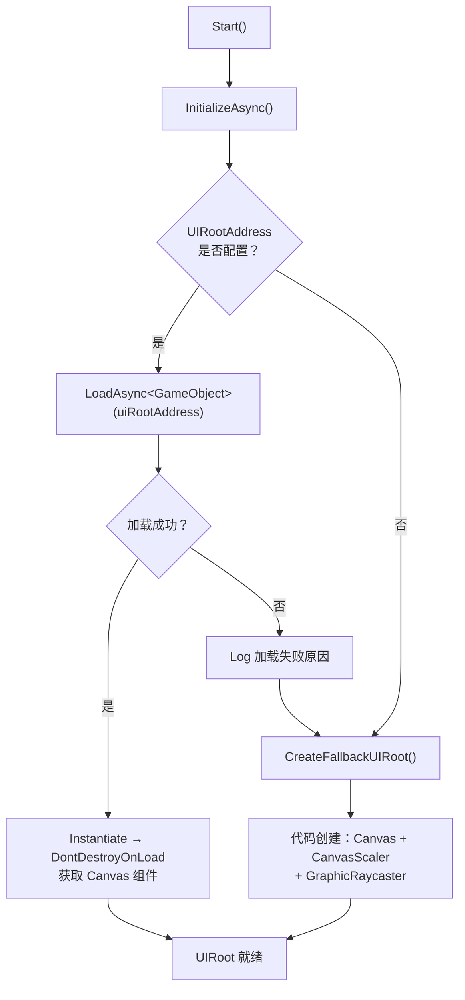
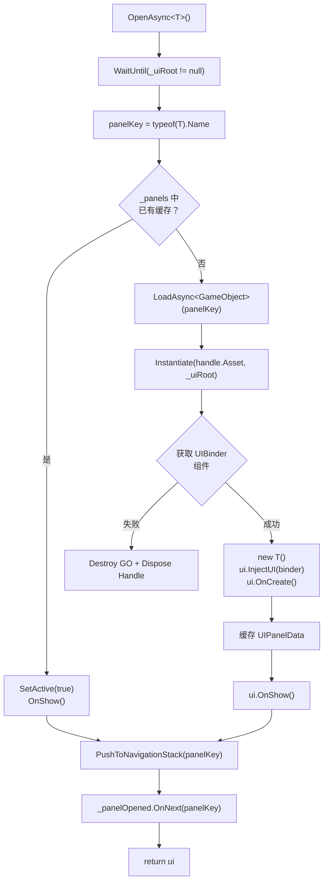

CFramework 的 UI 面板系统围绕三个核心抽象构建：**IUI 生命周期接口**定义面板从创建到销毁的完整状态机；**UIBinder 组件绑定器**作为 Prefab 与逻辑代码之间的桥接层，以声明式方式解耦视图引用；**UIService 导航栈**则提供面板缓存、栈式导航与自动驱逐策略。三者协作，让 UI 面板在无需手动管理 GameObject 生命周期的前提下，实现「打开即用、关闭即藏、超限即毁」的资源友好型运行模式。整个系统通过 VContainer 以 Entry Point 单例注册，在 [FrameworkModuleInstaller](Runtime/Core/DI/FrameworkModuleInstaller.cs) 中完成依赖注入。

Sources: [IUI.cs](Runtime/UI/IUI.cs#L1-L31), [IUIService.cs](Runtime/UI/IUIService.cs#L1-L62), [UIBinder.cs](Runtime/UI/UIBinder.cs#L1-L178), [UIService.cs](Runtime/UI/UIService.cs#L1-L331), [FrameworkModuleInstaller.cs](Runtime/Core/DI/FrameworkModuleInstaller.cs#L1-L26)

## 架构总览：四层协作模型

在深入各组件之前，先建立整体认知。UI 面板系统的数据流和控制流可以用以下四层模型描述：

```mermaid
graph TD
    subgraph "1. DI 注册层"
        FMI["FrameworkModuleInstaller<br/>InstallModule&lt;IUIService, UIService&gt;"]
    end

    subgraph "2. 服务控制层"
        UIS["UIService<br/>(Entry Point Singleton)"]
        NAV["LinkedList 导航栈"]
        CACHE["Dictionary 面板缓存"]
        EVT["R3 Subject 事件流"]
    end

    subgraph "3. 组件桥接层"
        UB["UIBinder (MonoBehaviour)<br/>挂载于 Prefab 根节点"]
        UC["UIComponent[]<br/>声明式组件引用列表"]
    end

    subgraph "4. 逻辑实现层"
        IUI["IUI 接口实现<br/>(partial class)"]
        INJ["InjectUI → 字段赋值"]
        LC["OnCreate → OnShow → OnHide → OnDestroy"]
    end

    FMI -->|VContainer 注册| UIS
    UIS --> NAV
    UIS --> CACHE
    UIS --> EVT
    UIS -->|OpenAsync 加载 & 注入| UB
    UB --> UC
    UC -->|Get&lt;T&gt;(index)| INJ
    INJ --> IUI
    IUI --> LC
    LC -->|状态回调| UIS
```

**核心约定**贯穿四层：Prefab 名称必须与 `IUI` 实现类的类名完全一致（`typeof(T).Name`），该名称同时充当 Addressable Key、缓存字典键和导航栈标识。这一约定使得 `OpenAsync<T>()` 的泛型参数足以驱动整个加载-实例化-注入-显示流程，无需任何额外配置。

Sources: [UIService.cs](Runtime/UI/UIService.cs#L138-L202), [IUIService.cs](Runtime/UI/IUIService.cs#L39-L44), [UIBinder.cs](Runtime/UI/UIBinder.cs#L13-L17)

## IUI 生命周期接口

`IUI` 是一个纯粹的 C# 接口，不继承 MonoBehaviour，不依赖 UnityEngine 实例——面板逻辑类是一个 **POCO（Plain Old CLR Object）**。这意味着所有 UI 逻辑可以在完全不触碰 Transform 层级的前提下编写和测试。UIService 在运行时通过 `new T()` 创建实例，并通过严格的四阶段生命周期回调管理其状态。

### 生命周期四阶段

| 阶段 | 方法 | 触发时机 | 典型用途 |
|------|------|----------|----------|
| **注入** | `InjectUI(UIBinder binder)` | 实例创建后立即调用，仅一次 | 接收 UIBinder 中的组件引用，赋值到私有字段 |
| **创建** | `OnCreate()` | InjectUI 完成后调用，仅一次 | 初始化内部状态、绑定事件监听、配置初始 UI 表现 |
| **显示** | `OnShow()` | 每次 `OpenAsync` 或从缓存恢复时调用 | 刷新动态数据、启动动画、注册帧更新逻辑 |
| **隐藏** | `OnHide()` | 每次 `Close` 或 `GoBack` 时调用 | 暂停交互、停止动画、取消正在进行的异步操作 |
| **销毁** | `OnDestroy()` | 导航栈驱逐或服务 Dispose 时调用 | 释放资源引用、移除事件监听、清理托管资源 |

Sources: [IUI.cs](Runtime/UI/IUI.cs#L1-L31)

关键细节：`InjectUI` 与 `OnCreate` 在面板的整个生命周期中**各只调用一次**，而 `OnShow` 与 `OnHide` 可能交替调用多次——这对应了「关闭 = 隐藏并缓存」的设计决策。只有当面板被导航栈驱逐（超出 `MaxStackCapacity`）或服务整体 Dispose 时，`OnDestroy` 才会被触发，此时 GameObject 真正销毁、AssetHandle 真正释放。

Sources: [UIService.cs](Runtime/UI/UIService.cs#L141-L202), [UIService.cs](Runtime/UI/UIService.cs#L285-L299)

### 生命周期状态转换图



注意状态机中不存在从「已销毁」回到任何状态的路径。一旦面板被驱逐，其 GameObject 已被 `Object.Destroy` 销毁，AssetHandle 已被 `Dispose` 释放。若再次调用 `OpenAsync<T>()`，将重新走完整条加载-实例化-注入链路。

Sources: [UIService.cs](Runtime/UI/UIService.cs#L285-L299), [UIService.cs](Runtime/UI/UIService.cs#L96-L118)

## UIBinder 组件绑定器

UIBinder 是挂载在 UI Prefab 根节点上的 MonoBehaviour，充当**声明式组件引用容器**。它的职责极其单一：在编辑器阶段收集需要绑定的子物体组件信息，在运行时通过 `Get<T>()` 方法按索引或名称提供组件查询服务。UIService 在 `OpenAsync` 流程中完成注入后，UIBinder 就不再被主动使用。

### UIComponent 数据结构

每个 `UIComponent` 实例描述一个需要绑定的子物体组件：

| 字段 | 类型 | 说明 |
|------|------|------|
| `gameObject` | `GameObject` | 目标子物体引用（Required） |
| `Name` | `string`（只读） | 自动取自 `gameObject.name`，用于名称查询 |
| `ComponentType` | `Type` | 目标组件类型，通过下拉菜单选择 |
| `_typeName` | `string` | 序列化存储的程序集限定名，运行时从中解析 Type |

Sources: [UIBinder.cs](Runtime/UI/UIBinder.cs#L129-L177)

`ComponentType` 的 `set` 访问器将 `Type.AssemblyQualifiedName` 写入 `_typeName`，`get` 访问器则通过 `Type.GetType(_typeName)` 反向解析。这种「序列化用字符串、运行时用 Type」的双轨设计确保了 Unity 序列化系统的兼容性。编辑器阶段的 `AvailableComponentTypes` 属性利用 `ValueDropdown` 特性，自动列出目标 GameObject 上所有已挂载组件的类型供选择。

Sources: [UIBinder.cs](Runtime/UI/UIBinder.cs#L153-L176)

### 组件查询 API

UIBinder 提供三种查询方式，覆盖代码生成器的高性能路径和手动编码的灵活路径：

| 方法 | 签名 | 使用场景 | 复杂度 |
|------|------|----------|--------|
| 索引查询 | `Get<T>(int index)` | 代码生成器生成的 `InjectUI` 实现 | O(1) |
| 名称查询 | `Get<T>(string name)` | 手动编码、动态查询 | O(n) |
| GameObject 查询 | `GetGameObject(int index)` | 仅需 GameObject 而非组件时 | O(1) |

索引查询的 O(1) 特性使其成为代码生成器的首选——生成器在编译期即可确定每个组件在数组中的确切位置，运行时无需遍历或字典查找。

Sources: [UIBinder.cs](Runtime/UI/UIBinder.cs#L26-L65)

### 编辑器集成：反射调用代码生成器

UIBinder 的编辑器按钮「生成绑定代码」展示了 Runtime 与 Editor 程序集解耦的精巧设计。由于 Runtime 程序集无法直接引用 Editor 程序集，UIBinder 通过反射定位 `CFramework.Editor.Generators.UIPanelGenerator` 类型并调用其 `Generate` 静态方法。这种「Runtime 定义入口、Editor 提供实现」的模式保证了打包构建时不会引入编辑器依赖。

Sources: [UIBinder.cs](Runtime/UI/UIBinder.cs#L75-L111)

## UIService 服务实现

UIService 是 UI 面板系统的核心控制器，实现 `IUIService`、`IStartable` 和 `IDisposable` 三个接口。它通过 VContainer 以 Entry Point Singleton 注册，在容器初始化后自动调用 `Start()` 方法完成异步初始化。

### DI 注册与初始化

在 `FrameworkModuleInstaller.Install()` 中，`UIService` 通过 `InstallModule<IUIService, UIService>()` 注册为全局单例。`InstallModule` 内部调用 `RegisterEntryPoint<TImplementation>(Lifetime.Singleton).As<TInterface>()`，将 UIService 同时注册为 Entry Point（触发 `IStartable.Start()`）和服务接口（可供其他类注入 `IUIService`）。

Sources: [FrameworkModuleInstaller.cs](Runtime/Core/DI/FrameworkModuleInstaller.cs#L16-L24), [InstallerExtensions.cs](Runtime/Core/DI/InstallerExtensions.cs#L30-L37)

### UIRoot 初始化：双路径策略

UIService 的 `Start()` 方法触发异步初始化，尝试建立 UI 渲染根节点。初始化遵循**优先 Addressable、兜底代码创建**的双路径策略：



**Addressable 路径**：当 `FrameworkSettings.UIRootAddress` 配置了有效的 Addressable Key（默认值 `"UIRoot"`）时，通过 `IAssetService.LoadAsync<GameObject>()` 加载 Prefab 并实例化，随后执行 `DontDestroyOnLoad` 使其跨场景存活。

**兜底路径**：若 Addressable 加载失败或未配置，`CreateFallbackUIRoot()` 在代码中创建一个包含 Canvas（ScreenSpaceOverlay）、CanvasScaler（1920×1080 参考分辨率、matchWidthOrHeight = 0.5）和 GraphicRaycaster 的完整 UI 根节点。

Sources: [UIService.cs](Runtime/UI/UIService.cs#L44-L94), [UIService.cs](Runtime/UI/UIService.cs#L241-L265), [FrameworkSettings.cs](Runtime/Core/FrameworkSettings.cs#L18-L21)

### OpenAsync\<T\> 完整流程

`OpenAsync<T>()` 是系统最核心的方法，其内部流程体现了「缓存优先、按需加载、一次注入」的设计哲学：



**缓存命中路径**：若 `_panels` 字典中已存在该类型，直接将 GameObject 设为 active、标记 `IsOpen = true`、调用 `OnShow()`。此处**不会**再次调用 `InjectUI` 或 `OnCreate`——组件引用在首次注入时已绑定到 IUI 实例的字段上，缓存恢复无需重复操作。

**首次加载路径**：通过 `IAssetService.LoadAsync` 以 `panelKey`（即类名）作为 Addressable Key 加载 Prefab。实例化后必须检测 UIBinder 组件，缺失则视为 Prefab 配置错误，直接销毁并释放句柄。成功后依次执行 `new T()` → `InjectUI(binder)` → `OnCreate()` → `OnShow()`，并将完整面板数据（IUI 实例、GameObject、UIBinder、AssetHandle、IsOpen 状态）缓存到 `_panels` 字典。

Sources: [UIService.cs](Runtime/UI/UIService.cs#L141-L202)

### 导航栈管理

导航栈基于 `LinkedList<string>` 实现，以面板的 `panelKey`（类名）作为唯一标识。这一数据结构选择使得「移除中间节点」和「移到栈顶」操作均为 O(1)——`LinkedList.Remove(node)` 不需像 List 那样移动后续元素。

#### 核心操作

| 操作 | 方法 | 行为 |
|------|------|------|
| **入栈** | `PushToNavigationStack(panelKey)` | 若已在栈中则移至栈顶；超限时从栈底驱逐最旧面板 |
| **出栈** | `ClosePanel(panelKey)` | 调用 OnHide、SetActive(false)、从栈中移除、触发 Closed 事件 |
| **回退** | `GoBack()` | 关闭栈顶（最后一个）面板，暴露其下一层面板 |
| **清空** | `CloseAll()` | 对所有打开面板调用 OnHide 并隐藏，清空导航栈 |

Sources: [UIService.cs](Runtime/UI/UIService.cs#L230-L239), [UIService.cs](Runtime/UI/UIService.cs#L269-L317)

#### 容量驱逐策略

`PushToNavigationStack` 实现了自动驱逐机制。当栈大小达到 `MaxStackCapacity`（默认 10，可通过 `FrameworkSettings.MaxNavigationStack` 配置）时，从栈底开始销毁最旧的面板。销毁操作调用 `DestroyPanel()`，它会依次执行：`OnDestroy()` → 从缓存字典移除 → `Object.Destroy(GameObject)` → `AssetHandle.Dispose()`。这是一种 **LRU（Least Recently Used）** 策略的简化实现——最近打开的面板保留在栈顶，最久未访问的面板在栈底被优先驱逐。

Sources: [UIService.cs](Runtime/UI/UIService.cs#L301-L317), [FrameworkSettings.cs](Runtime/Core/FrameworkSettings.cs#L18)

#### GoBack 的守卫逻辑

`GoBack()` 的实现包含一个关键守卫：`if (_navigationStack.Count <= 1) return;`。当栈中只有一个面板时，GoBack 不执行任何操作。这是一个有意的设计决策——防止意外关闭最后一个面板导致界面完全空白。若需关闭所有面板（包括最后一个），应使用 `CloseAll()`。

Sources: [UIService.cs](Runtime/UI/UIService.cs#L233-L239)

### R3 事件流

UIService 通过 R3 的 `Subject<string>` 暴露两个响应式事件流：

| 事件 | 类型 | 触发时机 | 典型订阅场景 |
|------|------|----------|-------------|
| `OnPanelOpened` | `Observable<string>` | 面板完成 OnShow 后 | 日志追踪、Analytics 打点、BGM 切换 |
| `OnPanelClosed` | `Observable<string>` | 面板完成 OnHide 后 | 资源释放检查、UI 状态同步 |

这两个事件在 `UIService.Dispose()` 时随 Subject 一起被 Dispose，遵循 R3 的生命周期管理约定，避免订阅泄漏。

Sources: [IUIService.cs](Runtime/UI/IUIService.cs#L24-L31), [UIService.cs](Runtime/UI/UIService.cs#L23-L25), [UIService.cs](Runtime/UI/UIService.cs#L128-L130)

### 服务销毁流程

当 `UIService.Dispose()` 被调用（通常在 GameScope 或 LifetimeScope 销毁时），执行完整的清理链路：

1. 取消所有进行中的异步操作（Dispose CancellationTokenSource）
2. 调用 `CloseAll()` 隐藏所有面板
3. 遍历 `_panels` 字典，对每个面板执行 `OnDestroy()` → `Object.Destroy(GameObject)` → `AssetHandle.Dispose()`
4. 清空 `_panels` 字典
5. Dispose 两个 R3 Subject
6. 销毁 UIRoot GameObject
7. 释放 UIRoot 的 AssetHandle

Sources: [UIService.cs](Runtime/UI/UIService.cs#L96-L118)

## 代码生成与 partial class 模式

UI 面板的组件注入代码通过 [UI 代码生成器](13-ui-dai-ma-sheng-cheng-qi-cong-yu-zhi-ti-ming-ming-gui-fan-zi-dong-sheng-cheng-zu-jian-bang-ding-dai-ma) 自动生成。生成的代码遵循 **partial class** 模式，将「自动生成的绑定代码」与「手写的业务逻辑代码」分离到不同文件中。以下是一个生成的面板类 `MainMenuPanel` 的完整结构示意：

**自动生成文件** `MainMenuPanel.Bindings.cs`（由 UIPanelGenerator 生成，每次重新生成会覆盖）：

```csharp
// <auto-generated>
//     此代码由 CFramework UIPanelGenerator 自动生成。
//     对此文件的更改可能导致错误的行为，并且会在重新生成时丢失。
// </auto-generated>

using CFramework.Runtime.UI;
using UnityEngine;
using UnityEngine.UI;

namespace UI
{
    public partial class MainMenuPanel
    {
        /// <summary>
        /// btn_start
        /// </summary>
        private Button _startButton;

        /// <summary>
        /// txt_title
        /// </summary>
        private Text _title;

        void IUI.InjectUI(UIBinder binder)
        {
            _startButton = binder.Get<Button>(0);
            _title = binder.Get<Text>(1);
        }
    }
}
```

**用户逻辑文件** `MainMenuPanel.cs`（仅首次生成，不会被覆盖）：

```csharp
using CFramework.Runtime.UI;
using UnityEngine;

namespace UI
{
    public partial class MainMenuPanel : IUI
    {
        public void OnCreate()
        {
            _startButton.onClick.AddListener(OnStartClicked);
        }

        public void OnShow() { /* 刷新标题文本等 */ }
        public void OnHide() { /* 暂停动画等 */ }
        public void OnDestroy()
        {
            _startButton.onClick.RemoveAllListeners();
        }

        private void OnStartClicked() { /* 业务逻辑 */ }
    }
}
```

生成器的 `ToFieldName` 方法会自动移除常见的 UI 前缀（`m_`、`btn_`、`txt_`、`img_`、`go_`、`obj_`）并将下划线分隔转为驼峰命名。例如 `btn_start_game` → `_startGame`（带 `FieldPrefix = "_"` 前缀）。所有配置项（命名空间、输出路径、字段前缀、是否生成 XML 注释和骨架文件）集中在 [UIPanelGeneratorConfig](Editor/Configs/UIPanelGeneratorConfig.cs) 中管理。

Sources: [UIPanelGenerator.cs](Editor/Generators/UIPanelGenerator.cs#L49-L77), [UIPanelGenerator.cs](Editor/Generators/UIPanelGenerator.cs#L129-L205), [UIPanelGenerator.cs](Editor/Generators/UIPanelGenerator.cs#L207-L244), [UIPanelGeneratorConfig.cs](Editor/Configs/UIPanelGeneratorConfig.cs#L1-L43)

## UIPanelData 内部数据模型

`UIPanelData` 是 UIService 的私有密封类，承载单个面板的完整运行时状态：

| 字段 | 类型 | 用途 |
|------|------|------|
| `UI` | `IUI` | 面板逻辑实例（POCO，由 `new T()` 创建） |
| `GameObject` | `GameObject` | 实例化的 Prefab 根节点，挂载 UIBinder |
| `Binder` | `UIBinder` | 组件绑定器引用（注入后保留用于调试） |
| `Handle` | `AssetHandle` | Addressable 资源句柄，Dispose 时释放底层资源 |
| `IsOpen` | `bool` | 当前可见状态标记，驱动 CloseAll 的条件过滤 |

Sources: [UIService.cs](Runtime/UI/UIService.cs#L319-L329)

## 约定与约束速查

| 约定项 | 规则 | 违反后果 |
|--------|------|----------|
| Prefab 命名 | 必须与 `IUI` 实现类名完全一致 | Addressable 加载失败 |
| Prefab 结构 | 根节点必须挂载 `UIBinder` 组件 | 运行时报错，Prefab 被销毁 |
| 泛型约束 | `T : IUI, new()` | 编译期检查 |
| UIComponent 配置 | 目标物体和组件类型均不能为空 | 生成器跳过该条目 |
| 导航栈容量 | 最小值为 1（`Mathf.Max(1, value)`） | 设置小于 1 自动修正 |
| UIRoot 配置 | `FrameworkSettings.UIRootAddress` 可为空 | 触发代码兜底创建 |

Sources: [UIService.cs](Runtime/UI/UIService.cs#L122-L126), [UIService.cs](Runtime/UI/UIService.cs#L159-L177)

## 与其他系统的交互

- **[资源管理服务](10-zi-yuan-guan-li-fu-wu-addressables-feng-zhuang-yin-yong-ji-shu-yu-sheng-ming-zhou-qi-bang-ding)**：UIService 通过注入的 `IAssetService` 加载 UI Prefab 和 UIRoot，每个面板持有一个 `AssetHandle` 在销毁时释放。
- **[依赖注入体系](5-yi-lai-zhu-ru-ti-xi-gamescope-scenescope-yu-dong-tai-an-zhuang-qi-ji-zhi)**：UIService 通过 `FrameworkModuleInstaller` 注册为全局 Entry Point Singleton，`ILogger` 通过 `[Inject]` 特性注入。
- **[UI 代码生成器](13-ui-dai-ma-sheng-cheng-qi-cong-yu-zhi-ti-ming-ming-gui-fan-zi-dong-sheng-cheng-zu-jian-bang-ding-dai-ma)**：在编辑器阶段从 UIBinder 配置自动生成 partial class 的绑定代码，运行时通过 `IUI.InjectUI` 桥接。
- **[FrameworkSettings 全局配置](3-frameworksettings-quan-ju-pei-zhi-xiang-jie)**：提供 `MaxNavigationStack` 和 `UIRootAddress` 两项 UI 相关配置。