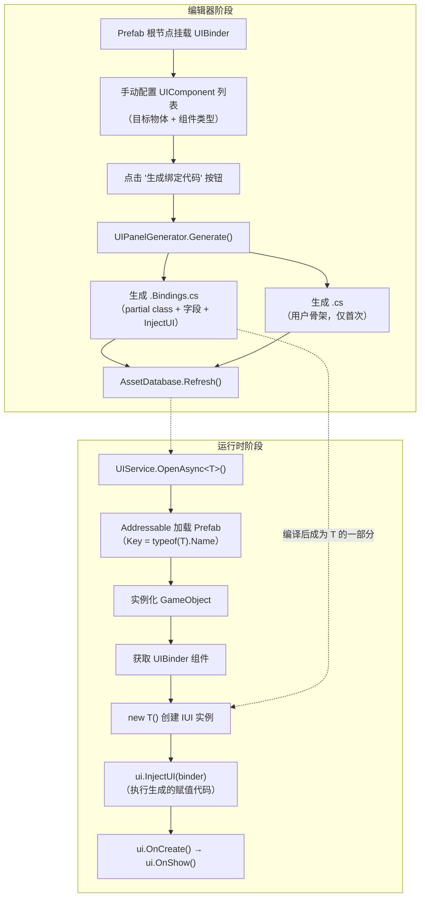
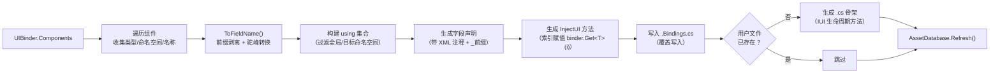

CFramework 的 UI 代码生成器是一套 **"配置驱动 + 双文件 partial class"** 的编辑器工具链，其核心思路是：开发者在 Prefab 上通过 `UIBinder` 组件手动标注需要绑定的子物体及其组件类型，点击按钮后自动生成 `.Bindings.cs`（自动绑定代码）和 `.cs`（用户逻辑骨架）。运行时 `UIService` 通过 `IUI.InjectUI(UIBinder)` 将预制体上的组件引用注入到生成的字段中，彻底消除手写 `transform.Find` + `GetComponent` 的样板代码。

Sources: [UIBinder.cs](Runtime/UI/UIBinder.cs#L13-L24), [UIPanelGenerator.cs](Editor/Generators/UIPanelGenerator.cs#L14-L45), [IUI.cs](Runtime/UI/IUI.cs#L1-L31)

## 整体架构与数据流

代码生成器的运作涉及三个层次的协作：**编辑器层**（UIPanelGenerator）负责读取配置并生成 C# 源文件，**运行时数据层**（UIBinder + UIComponent）作为组件引用的序列化容器，**运行时注入层**（UIService + IUI.InjectUI）在面板打开时执行实际的组件赋值。以下流程图展示了从编辑器配置到运行时注入的完整生命周期：



**partial class 双文件模式** 是整个设计的基石。生成的 `.Bindings.cs` 文件包含所有组件字段和 `InjectUI` 方法实现，每次重新生成都会完整覆盖；用户编写的 `.cs` 文件实现 `IUI` 接口的生命周期方法（`OnCreate`/`OnShow`/`OnHide`/`OnDestroy`），生成器检测到文件已存在时**跳过不覆盖**。两个文件编译后合并为同一个类，字段与方法天然互通，无需任何手动桥接。

Sources: [UIPanelGenerator.cs](Editor/Generators/UIPanelGenerator.cs#L27-L45), [UIPanelGenerator.cs](Editor/Generators/UIPanelGenerator.cs#L207-L244), [UIService.cs](Runtime/UI/UIService.cs#L179-L182)

## 配置体系：UIPanelGeneratorConfig

代码生成器的所有行为由 `UIPanelGeneratorConfig` 静态配置类驱动，采用 `const` 常量定义，编译期即确定，零运行时开销。以下是完整的配置项说明：

| 配置项 | 类型 | 默认值 | 说明 |
|--------|------|--------|------|
| `Namespace` | `string` | `"UI"` | 生成代码的目标命名空间 |
| `OutputPath` | `string` | `"Assets/Scripts/UI"` | 绑定代码输出目录（Assets 相对路径） |
| `BindingsFileSuffix` | `string` | `".Bindings.cs"` | 自动生成文件的命名后缀 |
| `UserFileSuffix` | `string` | `".cs"` | 用户骨架文件的命名后缀 |
| `FieldPrefix` | `string` | `"_"` | 生成字段的统一前缀 |
| `GenerateXmlComments` | `bool` | `true` | 是否为字段生成 XML 文档注释 |
| `GenerateUserFile` | `bool` | `true` | 是否同时生成用户骨架文件 |

以 Prefab 名称为 `SettingsPanel` 为例，生成的文件布局为：

```
Assets/Scripts/UI/
├── SettingsPanel.Bindings.cs    ← 自动生成，每次覆盖
└── SettingsPanel.cs             ← 用户逻辑，仅首次生成
```

Sources: [UIPanelGeneratorConfig.cs](Editor/Configs/UIPanelGeneratorConfig.cs#L1-L43), [EditorPaths.cs](Editor/EditorPaths.cs#L57-L73)

## UIBinder：组件引用的序列化容器

`UIBinder` 是挂载在 UI Prefab 根节点上的 `MonoBehaviour`，其核心职责是**作为组件引用的有序容器**——在编辑器阶段收集绑定数据，在运行时 `InjectUI` 时被消费后即不再使用。它的设计遵循"数据与行为分离"的原则：数据通过 `UIComponent[]` 序列化存储在 Prefab 中，行为通过 `Get<T>()` 系列方法提供索引访问。

### UIComponent 数据结构

每个 `UIComponent` 记录了一个子物体的绑定信息：

| 字段 | 类型 | 说明 |
|------|------|------|
| `gameObject` | `GameObject` | 目标子物体引用（Required，Odin 校验） |
| `Name` | `string`（只读） | 自动取 `gameObject.name`，用于生成字段注释 |
| `ComponentType` | `Type` | 通过下拉菜单选择目标物体上已挂载的组件类型 |
| `_typeName` | `string`（序列化） | `ComponentType` 的 `AssemblyQualifiedName` 持久化形式 |

`ComponentType` 的下拉选项通过 `AvailableComponentTypes` 属性动态获取——它枚举目标 GameObject 上所有已挂载的 `Component` 并去重，确保开发者只能选择实际存在的组件类型。类型信息通过 `AssemblyQualifiedName` 进行序列化/反序列化，保证跨域加载时的类型解析准确性。

Sources: [UIBinder.cs](Runtime/UI/UIBinder.cs#L129-L177)

### UIBinder 的反射桥接设计

`UIBinder` 驻留在 `CFramework.Runtime` 程序集中，而 `UIPanelGenerator` 驻留在 `CFramework.Editor` 程序集中。由于 Runtime 程序集**不能直接引用** Editor 程序集，`UIBinder.GenerateBindingCode()` 方法通过反射机制桥接这一依赖鸿沟：

```csharp
// UIBinder.cs (Runtime) → 通过反射调用 → UIPanelGenerator.Generate() (Editor)
var type = Type.GetType("CFramework.Editor.Generators.UIPanelGenerator, CFramework.Editor");
// 回退：遍历所有已加载程序集查找
var method = type.GetMethod("Generate", BindingFlags.Public | BindingFlags.Static, ...);
method?.Invoke(null, new object[] { this, prefabName });
```

这个反射调用的触发入口是 Odin Inspector 的 `[Button]` 特性标注的 `GenerateBindingCode()` 方法，仅在 Prefab 编辑模式下且 `HasValidComponents()` 返回 `true` 时可见，保证了编辑器 UI 的干净呈现。

Sources: [UIBinder.cs](Runtime/UI/UIBinder.cs#L75-L126)

## 命名转换引擎：ToFieldName

`UIPanelGenerator.ToFieldName()` 是字段命名的核心转换逻辑，负责将 Unity 场景中的物体名称转换为符合 C# 命名规范的字段标识符。转换规则分为两个阶段：

**阶段一：前缀剥离**

使用正则表达式 `^(m_|btn_|txt_|img_|go_|obj_)`（大小写不敏感）移除常见的 UI 命名前缀。这些前缀在 Unity 编辑器中有良好的视觉分类作用，但在 C# 代码中属于冗余信息——类型系统本身已提供了类型信息。

**阶段二：下划线转驼峰**

若剥离前缀后名称仍包含下划线，则按下划线分割并将各段拼接为 camelCase 形式（首段首字母小写，后续各段首字母大写、其余小写）。最终统一加上 `FieldPrefix`（默认 `_`）生成完整的字段名。

| 物体名称 | 剥离前缀后 | 最终字段名 |
|----------|-----------|-----------|
| `btn_Start` | `Start` | `_start` |
| `txt_PlayerName` | `PlayerName` | `_playerName` |
| `img_Background` | `Background` | `_background` |
| `m_CloseButton` | `CloseButton` | `_closeButton` |
| `go_Panel_Root` | `Panel_Root` | `_panelRoot` |
| `obj_Item_List` | `Item_List` | `_itemList` |

Sources: [UIPanelGenerator.cs](Editor/Generators/UIPanelGenerator.cs#L49-L79)

## 代码生成全流程详解

### 第一步：收集组件信息与构建 using 集合

`GenerateBindingCode()` 遍历 `UIBinder.Components` 数组，对每个有效的 `UIComponent`（`ComponentType` 和 `gameObject` 均非空）提取三项关键信息：**类型名**（用于字段声明和 `Get<T>` 调用）、**命名空间**（用于自动收集 `using` 指令）、**转换后的字段名**。命名空间收集时会跳过全局命名空间和目标命名空间自身（`"UI"`），避免生成冗余的 `using` 语句。

Sources: [UIPanelGenerator.cs](Editor/Generators/UIPanelGenerator.cs#L129-L157)

### 第二步：生成绑定文件（.Bindings.cs）

以下是 `SettingsPanel` Prefab 包含一个 `Button`（btn_Close）和一个 `Text`（txt_Title）时的完整生成示例：

```csharp
// <auto-generated>
//     此代码由 CFramework UIPanelGenerator 自动生成。
//     对此文件的更改可能导致错误的行为，并且会在重新生成时丢失。
// </auto-generated>

using CFramework.Runtime.UI;
using UnityEngine.UI;

namespace UI
{
    public partial class SettingsPanel
    {
        /// <summary>
        /// btn_Close
        /// </summary>
        private Button _close;

        /// <summary>
        /// txt_Title
        /// </summary>
        private Text _title;

        void IUI.InjectUI(UIBinder binder)
        {
            _close = binder.Get<Button>(0);
            _title = binder.Get<Text>(1);
        }
    }
}
```

**关键技术决策**：`InjectUI` 使用 `binder.Get<T>(int index)` 按索引取组件，而非按名称查找。这意味着赋值操作的时间复杂度为 **O(1)**——直接通过数组索引访问，无需字符串匹配。这个设计要求组件数组的顺序在生成和运行时之间保持稳定（由 Prefab 序列化保证）。

Sources: [UIPanelGenerator.cs](Editor/Generators/UIPanelGenerator.cs#L158-L205)

### 第三步：生成用户骨架文件（.cs）

用户骨架文件**仅在目标路径不存在同名文件时生成**，这是防止覆盖用户已有逻辑的关键保护机制：

```csharp
// SettingsPanel.cs — 仅首次生成，后续永不覆盖
using CFramework.Runtime.UI;
using UnityEngine;

namespace UI
{
    public partial class SettingsPanel : IUI
    {
        public void OnCreate() { }
        public void OnShow() { }
        public void OnHide() { }
        public void OnDestroy() { }
    }
}
```

骨架文件中类声明为 `partial class SettingsPanel : IUI`，而绑定文件中声明为 `partial class SettingsPanel`（不带接口列表）。两者编译后合并为一个完整的类，该类既实现了 `IUI` 接口的所有生命周期方法，又拥有自动注入的组件字段。用户只需在骨架文件的方法体中编写业务逻辑即可。

Sources: [UIPanelGenerator.cs](Editor/Generators/UIPanelGenerator.cs#L207-L244)

### 完整生成流程图



Sources: [UIPanelGenerator.cs](Editor/Generators/UIPanelGenerator.cs#L124-L244)

## 运行时注入：UIService 如何消费生成代码

代码生成的最终目的是为 `UIService.OpenAsync<T>()` 提供类型安全的组件注入。以下是运行时的关键执行路径：

```csharp
// UIService.OpenAsync<T>() 核心流程（简化）
var handle = await _assetService.LoadAsync<GameObject>(panelKey, token);  // panelKey = typeof(T).Name
var go = Object.Instantiate(handle.Asset, _uiRoot);
var binder = go.GetComponent<UIBinder>();

var ui = new T();           // 创建 IUI 实例（无参构造）
ui.InjectUI(binder);        // ← 执行生成的绑定代码，填充所有 _ 字段
ui.OnCreate();              // 生命周期：创建
ui.OnShow();                // 生命周期：显示
```

**三重约定保证**了这套机制的正确运作：(1) Prefab 名称 = `typeof(T).Name` 作为 Addressable Key；(2) Prefab 根节点必须挂载 `UIBinder`；(3) 生成的 partial class 名称 = Prefab 名称。这三个名称的一致性是整个系统运转的基石，任何不一致都会导致加载失败或注入缺失。

Sources: [UIService.cs](Runtime/UI/UIService.cs#L141-L199), [IUIService.cs](Runtime/UI/IUIService.cs#L1-L61)

## 实战操作：从零生成一个 UI 面板

以下操作步骤展示从创建 Prefab 到编写业务逻辑的完整流程：

| 步骤 | 操作 | 说明 |
|------|------|------|
| 1 | 创建 Prefab | 在 `Assets/Prefabs` 下创建名为 `ShopPanel` 的 UI 预制体 |
| 2 | 搭建子物体 | 添加 `btn_Close`、`txt_Title`、`img_Bg` 等子节点 |
| 3 | 挂载 UIBinder | 在 Prefab 根节点添加 `UIBinder` 组件 |
| 4 | 配置组件列表 | 在 UIBinder Inspector 中添加条目，为每个子物体选择目标组件类型 |
| 5 | 生成代码 | 点击 UIBinder Inspector 上的 **"生成绑定代码"** 按钮 |
| 6 | 编写逻辑 | 在生成的 `ShopPanel.cs` 中的 `OnCreate()` 等方法内编写业务代码 |
| 7 | 注册 Addressable | 将 Prefab 标记为 Addressable，Key 设为 `ShopPanel` |
| 8 | 打开面板 | 运行时调用 `await uiService.OpenAsync<ShopPanel>()` |

Sources: [UIBinder.cs](Runtime/UI/UIBinder.cs#L75-L111), [UIPanelGenerator.cs](Editor/Generators/UIPanelGenerator.cs#L22-L45)

## NamingConvention 枚举与扩展性

框架定义了 `NamingConvention` 枚举，提供四种命名策略的抽象：`PascalCase`（帕斯卡命名）、`CamelCase`（驼峰命名）、`LowerCase`（全小写）和 `Original`（保持原样）。当前 `UIPanelGenerator` 内部硬编码使用 camelCase + 下划线前缀剥离的转换策略，`NamingConvention` 枚举为未来的可配置化扩展预留了标准化的选项空间。

Sources: [NamingConvention.cs](Editor/Generators/NamingConvention.cs#L1-L28)

## 设计权衡与最佳实践

**索引绑定 vs 名称绑定**：生成代码使用 `binder.Get<T>(index)` 而非 `binder.Get<T>(name)`。索引绑定的优势是 O(1) 访问且无字符串分配，劣势是对组件列表顺序敏感——如果在 UIBinder 中间插入或删除一个条目，必须重新生成绑定代码。实践中推荐**完成 UI 布局后再执行代码生成**，避免频繁重生成。

**partial class 的边界**：自动生成的 `.Bindings.cs` 只包含字段和 `InjectUI`，不包含任何业务逻辑。这意味着即使组件列表变化导致重新生成，用户在 `.cs` 中编写的代码完全不受影响。但如果用户误将逻辑写在 `.Bindings.cs` 中，重新生成时将被覆盖——这也是文件头部添加 `<auto-generated>` 警告注释的原因。

**命名空间过滤策略**：生成器通过 `IgnoredNamespaces` 静态集合跳过全局命名空间（`""`）和目标命名空间（`"UI"`），其余命名空间按字母序排列生成 `using` 指令。如果修改了 `UIPanelGeneratorConfig.Namespace` 为非 `"UI"` 值，需同步更新 `IgnoredNamespaces` 集合以避免生成冗余的 `using` 语句。

Sources: [UIPanelGenerator.cs](Editor/Generators/UIPanelGenerator.cs#L105-L121), [UIBinder.cs](Runtime/UI/UIBinder.cs#L29-L38)

## 延伸阅读

- 要理解 `UIService` 如何管理面板的缓存、导航栈和生命周期，请参阅 [UI 面板系统：IUI 生命周期、UIBinder 组件注入与导航栈管理](12-ui-mian-ban-xi-tong-iui-sheng-ming-zhou-qi-uibinder-zu-jian-zhu-ru-yu-dao-hang-zhan-guan-li)
- 若需要了解 Addressable 资源加载的底层机制，请参阅 [资源管理服务：Addressables 封装、引用计数与生命周期绑定](10-zi-yuan-guan-li-fu-wu-addressables-feng-zhuang-yin-yong-ji-shu-yu-sheng-ming-zhou-qi-bang-ding)
- 同类型的编辑器代码生成工具还有 [Addressable 常量代码生成器与资源后处理器](20-addressable-chang-liang-dai-ma-sheng-cheng-qi-yu-zi-yuan-hou-chu-li-qi)，其架构模式与本生成器高度一致