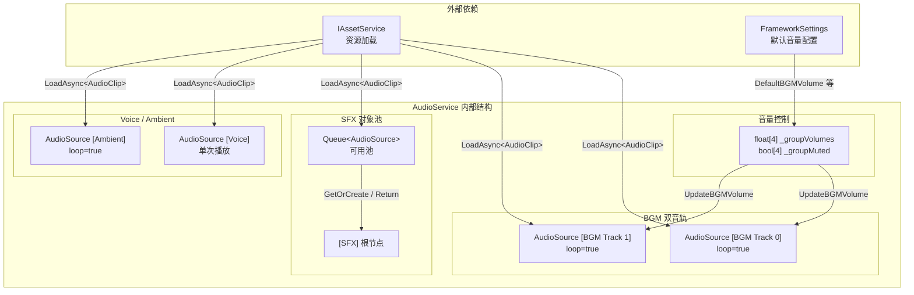
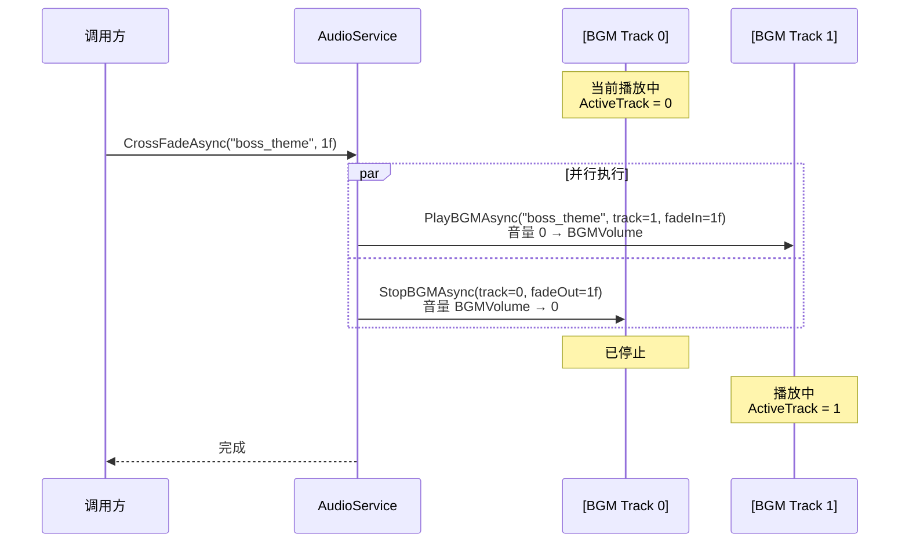
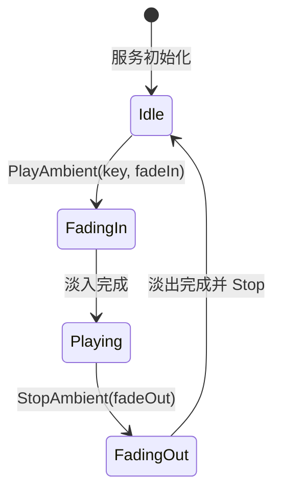

游戏音频管理看似简单——播放、停止、调音量——但一旦涉及 BGM 无缝切换、多通道音量隔离、音效对象池回收，事情就会变得棘手。CFramework 的 `AudioService` 采用 **双音轨 BGM 交替播放 + 四组独立音量控制 + SFX 对象池** 的架构，用不到 400 行代码完整覆盖了游戏音频的核心需求。本文将从架构设计到实现细节，逐层拆解这套音频系统的每一个设计决策。

Sources: [AudioService.cs](Runtime/Audio/AudioService.cs#L1-L388), [IAudioService.cs](Runtime/Audio/IAudioService.cs#L1-L58), [AudioGroup.cs](Runtime/Audio/AudioGroup.cs#L1-L13)

## 架构总览：四通道分离与双轨 BGM

`AudioService` 实现了三个接口：`IAudioService`（业务契约）、`IDisposable`（生命周期清理）和 `IStartable`（VContainer 初始化回调）。系统将全部音频分为四个独立通道（`AudioGroup` 枚举），每个通道拥有独立的音量控制与静音状态：

| 通道 | 枚举值 | AudioSource 数量 | 播放特性 | 典型用途 |
|------|--------|-----------------|---------|---------|
| **BGM** | `AudioGroup.BGM` | 2（双轨） | 循环、淡入淡出、交叉切换 | 背景音乐 |
| **SFX** | `AudioGroup.SFX` | 对象池（按需创建） | 一次性播放、支持 3D 空间 | 音效 |
| **Voice** | `AudioGroup.Voice` | 1 | 播放等待完成、不可叠加 | 角色语音/旁白 |
| **Ambient** | `AudioGroup.Ambient` | 1 | 循环、淡入淡出 | 环境音 |

下面的 Mermaid 图展示了 `AudioService` 的内部组成与外部依赖关系：



所有 AudioSource 所挂载的 GameObject 均通过 `Object.DontDestroyOnLoad()` 标记为场景无关对象，确保音频不会因场景切换而中断。

Sources: [AudioService.cs](Runtime/Audio/AudioService.cs#L14-L52), [AudioGroup.cs](Runtime/Audio/AudioGroup.cs#L1-L13)

## 双音轨 BGM 与交叉淡入淡出

**为什么需要双音轨？** 当 BGM 从一首曲子切换到另一首时，如果先停旧的再播新的，中间会出现静音间隙；如果直接叠播，两首 BGM 同时全音量播放会产生听觉混乱。双音轨方案让新旧 BGM 在两个独立的 `AudioSource` 上同时存在，通过 **交叉淡入淡出（CrossFade）** 实现无缝过渡。

`Start()` 方法在 VContainer 初始化时创建两个 BGM 音轨，均配置为 `loop = true`、`playOnAwake = false`：

```csharp
for (var i = 0; i < 2; i++)
{
    var go = new GameObject($"[BGM Track {i}]");
    Object.DontDestroyOnLoad(go);
    _bgmTracks[i] = go.AddComponent<AudioSource>();
    _bgmTracks[i].loop = true;
    _bgmTracks[i].playOnAwake = false;
}
```

Sources: [AudioService.cs](Runtime/Audio/AudioService.cs#L107-L132)

### PlayBGMAsync — 指定音轨播放

`PlayBGMAsync` 的核心流程：通过 `IAssetService` 异步加载 `AudioClip` → 设置到指定音轨的 `AudioSource` → 初始音量置零并开始播放 → 调用 `FadeVolumeAsync` 线性淡入到目标音量。`track` 参数接受 `0` 或 `1`，越界时自动回退到 `0` 号轨。

```csharp
public async UniTask PlayBGMAsync(string key, int track = 0, float fadeIn = 1f,
    CancellationToken ct = default)
{
    if (track < 0 || track > 1) track = 0;
    var handle = await _assetService.LoadAsync<AudioClip>(key, ct);
    var clip = handle.As<AudioClip>();
    // ... 加载校验 ...
    _bgmTracks[track].clip = clip;
    _bgmTracks[track].volume = 0f;
    _bgmTracks[track].Play();
    if (fadeIn > 0)
        await FadeVolumeAsync(_bgmTracks[track], BGMVolume, fadeIn, ct);
    else
        _bgmTracks[track].volume = BGMVolume;
    ActiveTrack = track;
}
```

Sources: [AudioService.cs](Runtime/Audio/AudioService.cs#L137-L163)

### CrossFadeAsync — 交叉淡入淡出

`CrossFadeAsync` 是双音轨架构的核心价值所在。它计算出下一个空闲音轨（`1 - ActiveTrack`），然后使用 `UniTask.WhenAll` **并行执行**两个操作：新 BGM 淡入播放、旧 BGM 淡出停止。`duration` 参数同时控制淡入和淡出的时长：



实现代码极为简洁，`UniTask.WhenAll` 让两个异步操作自然汇合：

```csharp
public async UniTask CrossFadeAsync(string newBGM, float duration = 1f,
    CancellationToken ct = default)
{
    var nextTrack = 1 - ActiveTrack;
    await UniTask.WhenAll(
        PlayBGMAsync(newBGM, nextTrack, duration, ct),
        StopBGMAsync(ActiveTrack, duration, ct)
    );
    ActiveTrack = nextTrack;
}
```

Sources: [AudioService.cs](Runtime/Audio/AudioService.cs#L188-L210)

### StopBGM — 带淡出的停止

`StopBGM` 提供同步 API（返回 `void`），内部将淡出操作"发射后不管"（Fire-and-Forget）：淡出完成后才真正调用 `source.Stop()` 并清空 key 记录。与之对应，`StopBGMAsync` 是异步版本，被 `CrossFadeAsync` 内部调用以支持 `await` 汇合。

| 方法 | 返回类型 | 适用场景 |
|------|---------|---------|
| `StopBGM(track, fadeOut)` | `void` | 手动停止某条音轨，不需要等待完成 |
| `StopBGMAsync(track, fadeOut, ct)` | `UniTask` | 交叉淡出内部使用，需等待淡出完成 |

Sources: [AudioService.cs](Runtime/Audio/AudioService.cs#L165-L210)

## 分组音量控制与静音

`AudioService` 为四个 `AudioGroup` 维护两个平行的数组：`_groupVolumes[4]` 存储音量值，`_groupMuted[4]` 存储静音状态。初始值来源于 `FrameworkSettings` 中配置的默认音量：

```csharp
// 构造函数中初始化
_groupVolumes[(int)AudioGroup.BGM]    = settings.DefaultBGMVolume;    // 0.8f
_groupVolumes[(int)AudioGroup.SFX]    = settings.DefaultSFXVolume;    // 1.0f
_groupVolumes[(int)AudioGroup.Voice]  = settings.DefaultVoiceVolume;  // 1.0f
_groupVolumes[(int)AudioGroup.Ambient]= settings.DefaultAmbientVolume; // 0.5f
```

Sources: [AudioService.cs](Runtime/Audio/AudioService.cs#L39-L52), [FrameworkSettings.cs](Runtime/Core/FrameworkSettings.cs#L23-L30)

### 属性访问器与即时生效

四个音量属性（`BGMVolume`、`SFXVolume`、`VoiceVolume`、`AmbientVolume`）的 `set` 访问器遵循 **立即同步** 原则——赋值后立刻更新对应的 `AudioSource.volume`。其中 BGM 通道比较特殊：由于存在两条音轨，`UpdateBGMVolume()` 会遍历 `_bgmTracks` 数组，同时更新两条音轨的音量，并且会检查静音状态：

```csharp
private void UpdateBGMVolume()
{
    foreach (var track in _bgmTracks)
        if (track != null)
            track.volume = _groupMuted[(int)AudioGroup.BGM] ? 0f : BGMVolume;
}
```

Voice 和 Ambient 通道只有一个 AudioSource，直接在 setter 中同步更新。

### MuteGroup — 静音控制

`MuteGroup` 的实现根据通道类型采用不同策略：BGM 通道通过 `UpdateBGMVolume()` 将音量压零（而非设置 `AudioSource.mute`），这样当取消静音时能恢复到之前的音量值；Voice 和 Ambient 通道直接设置 `AudioSource.mute` 属性。值得注意的是，**SFX 通道没有独立的静音处理逻辑**——SFX 的实际音量在 `PlaySFXInternal` 中通过 `volume * SFXVolume` 计算，静音 SFX 可以通过 `SetGroupVolume(AudioGroup.SFX, 0f)` 实现。

Sources: [AudioService.cs](Runtime/Audio/AudioService.cs#L214-L258)

### SetGroupVolume — 音量归一化

`SetGroupVolume` 在赋值前调用 `Mathf.Clamp01(volume)` 确保音量值始终在 `[0, 1]` 区间内，然后根据通道类型同步更新到对应的 AudioSource。与属性 setter 相比，`SetGroupVolume` 通过枚举参数提供了**运行时动态切换目标通道**的能力，适合在设置界面中使用：

```csharp
// 在设置面板中调整滑块
_audioService.SetGroupVolume(AudioGroup.BGM, bgmSlider.value);
_audioService.SetGroupVolume(AudioGroup.SFX, sfxSlider.value);
```

Sources: [AudioService.cs](Runtime/Audio/AudioService.cs#L234-L250)

## SFX 对象池机制

音效（SFX）的特点是**短促、高频、并发量大**——一次战斗可能同时触发数十个音效。如果每次播放都创建新的 GameObject 和 AudioSource，GC 压力会急剧上升。`AudioService` 使用 `Queue<AudioSource>` 实现了一个简洁的对象池：

| 操作 | 方法 | 行为 |
|------|------|------|
| 获取 | `GetOrCreateSFXSource()` | 池中有则出队，否则创建新实例 |
| 回收 | `ReturnSFXSource(source)` | 停止播放、清空 clip、入队 |

`PlaySFX` 提供两种模式：`PlaySFX` 为 2D 音效（`spatialBlend = 0`），`PlaySFXAt` 为 3D 空间音效（`spatialBlend = 1`），后者需传入世界坐标。实际播放使用 `AudioSource.PlayOneShot`，该方法支持同一 AudioSource 上的多音叠加。回收时，系统根据 `clip.length / pitch * 1000 + 100` 计算延迟时间——pitch 越高播放越快，延迟越短，最后附加 100ms 缓冲确保播放完毕：

```csharp
var delayMs = (int)(clip.length / pitch * 1000) + 100;
UniTask.Delay(delayMs)
    .ContinueWith(() => ReturnSFXSource(source))
    .Forget();
```

Sources: [AudioService.cs](Runtime/Audio/AudioService.cs#L263-L299), [AudioService.cs](Runtime/Audio/AudioService.cs#L353-L367)

## Voice 与 Ambient 通道

**Voice 通道**设计为独占模式——只有一个 `AudioSource`，新语音会替换旧语音。`PlayVoiceAsync` 返回的 `UniTask` 会等待播放完成（通过 `UniTask.WaitWhile(() => _voiceSource.isPlaying)` 轮询），这使其天然适合 **对话系统的顺序播放**：`await` 当前语音结束后再播放下一句。

**Ambient 通道**与 BGM 类似使用循环播放和淡入淡出，但只有一条音轨，不支持交叉淡出。`PlayAmbient` 和 `StopAmbient` 分别支持 `fadeIn` / `fadeOut` 参数，通过 `FadeVolumeAsync` 实现平滑过渡。



Sources: [AudioService.cs](Runtime/Audio/AudioService.cs#L301-L347)

## FadeVolumeAsync — 通用音量渐变引擎

`FadeVolumeAsync` 是整个音频系统的**核心工具方法**，被 BGM 淡入/淡出和 Ambient 淡入/淡出共用。其实现是一个标准的逐帧线性插值循环：

```csharp
private async UniTask FadeVolumeAsync(AudioSource source, float targetVolume,
    float duration, CancellationToken ct = default)
{
    var startVolume = source.volume;
    var elapsed = 0f;
    while (elapsed < duration)
    {
        elapsed += Time.deltaTime;
        var t = elapsed / duration;
        source.volume = Mathf.Lerp(startVolume, targetVolume, t);
        await UniTask.Yield(ct);
    }
    source.volume = targetVolume;
}
```

关键设计点：**使用 `Time.deltaTime` 累积而非帧计数**，这意味着渐变时长不受帧率波动影响；`UniTask.Yield(ct)` 每帧让出执行权，确保渐变过程不会阻塞主线程；循环结束后强制设置 `targetVolume`，消除浮点精度导致的终端值偏差。

Sources: [AudioService.cs](Runtime/Audio/AudioService.cs#L369-L385)

## 依赖注入与生命周期

`AudioService` 通过 `FrameworkModuleInstaller` 以 **EntryPoint Singleton** 模式注册到 VContainer 容器中。`InstallModule` 扩展方法调用 `RegisterEntryPoint<TImplementation>(Lifetime.Singleton).As<TInterface>()`，这意味着 `AudioService` 既作为入口点（自动触发 `Start()` 回调），又可通过 `IAudioService` 接口注入到其他服务中：

```csharp
// FrameworkModuleInstaller.cs
builder.InstallModule<IAudioService, AudioService>();
```

构造函数注入 `IAssetService`（资源加载）和 `FrameworkSettings`（默认配置）。`IStartable.Start()` 在 VContainer 解析完成后自动调用，负责创建所有 AudioSource 和 GameObject。`IDisposable.Dispose()` 由 VContainer 容器销毁时调用，取消所有进行中的异步操作并销毁全部 GameObject。

Sources: [FrameworkModuleInstaller.cs](Runtime/Core/DI/FrameworkModuleInstaller.cs#L16-L24), [InstallerExtensions.cs](Runtime/Core/DI/InstallerExtensions.cs#L30-L37), [AudioService.cs](Runtime/Audio/AudioService.cs#L92-L132)

## 典型使用场景

### 场景一：游戏启动时播放主菜单 BGM

```csharp
public class MainMenuPresenter
{
    private readonly IAudioService _audio;

    public MainMenuPresenter(IAudioService audio)
    {
        _audio = audio;
    }

    public async UniTask InitializeAsync(CancellationToken ct)
    {
        await _audio.PlayBGMAsync("bgm_main_menu", track: 0, fadeIn: 2f, ct: ct);
    }
}
```

### 场景二：进入战斗时交叉淡入淡出

```csharp
public class BattleEntrance
{
    private readonly IAudioService _audio;

    public async UniTask EnterBattleAsync(CancellationToken ct)
    {
        // 从主菜单 BGM 1 秒交叉淡入到战斗 BGM
        await _audio.CrossFadeAsync("bgm_boss_fight", duration: 1f, ct: ct);
    }
}
```

### 场景三：设置界面调整音量

```csharp
// 静音 BGM
_audio.MuteGroup(AudioGroup.BGM, true);

// 恢复 BGM 并设置音量
_audio.MuteGroup(AudioGroup.BGM, false);
_audio.SetGroupVolume(AudioGroup.BGM, 0.5f);
```

### 场景四：播放 3D 空间音效与对话语音

```csharp
// 在爆炸位置播放音效
_audio.PlaySFXAt("explosion", explosionPos, volume: 0.8f);

// 顺序播放角色对话
await _audio.PlayVoiceAsync("voice_hero_line_01", ct);
await _audio.PlayVoiceAsync("voice_npc_response", ct);
```

Sources: [IAudioService.cs](Runtime/Audio/IAudioService.cs#L12-L56)

## 设计权衡与注意事项

| 设计决策 | 优势 | 局限 |
|---------|------|------|
| 双音轨 BGM（固定 2 条） | 交叉淡入淡出零额外开销 | 不支持三层以上同时叠加 |
| SFX 使用 Queue 对象池 | 减少 GameObject 创建/销毁开销 | 池大小无上限，极端场景可能膨胀 |
| Voice 单通道独占 | 简单可靠，适合对话序列 | 不支持多人同时说话 |
| FadeVolumeAsync 线性插值 | 实现简洁，行为可预测 | 不支持非线性曲线（如 Ease-In-Out） |
| BGM 静音通过音量压零 | 取消静音能恢复原音量 | 淡入过程中的静音会中断渐变 |
| CancellationToken 贯穿 BGM/Voice | 场景切换时可安全取消 | Ambient 使用 Fire-and-Forget，无取消支持 |

Sources: [AudioService.cs](Runtime/Audio/AudioService.cs#L1-L388)

## 下一步阅读

- 了解 BGM 如何在场景切换时保持不中断：[场景管理服务：场景加载、叠加场景与过渡动画（FadeTransition）](15-chang-jing-guan-li-fu-wu-chang-jing-jia-zai-die-jia-chang-jing-yu-guo-du-dong-hua-fadetransition)
- 了解音频资源如何通过 Addressables 加载与管理：[资源管理服务：Addressables 封装、引用计数与生命周期绑定](10-zi-yuan-guan-li-fu-wu-addressables-feng-zhuang-yin-yong-ji-shu-yu-sheng-ming-zhou-qi-bang-ding)
- 了解 AudioService 的 DI 注册机制：[依赖注入体系：GameScope、SceneScope 与动态安装器机制](5-yi-lai-zhu-ru-ti-xi-gamescope-scenescope-yu-dong-tai-an-zhuang-qi-ji-zhi)
- 了解默认音量在哪里配置：[FrameworkSettings 全局配置详解](3-frameworksettings-quan-ju-pei-zhi-xiang-jie)