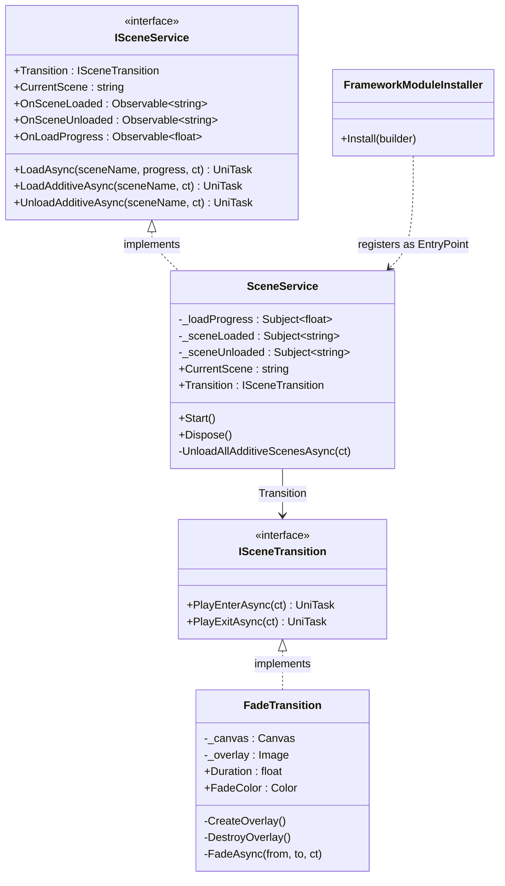
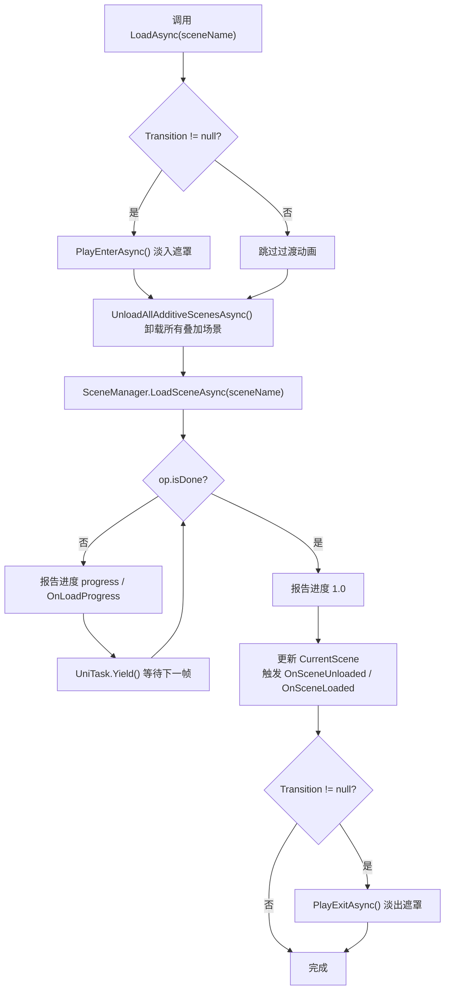
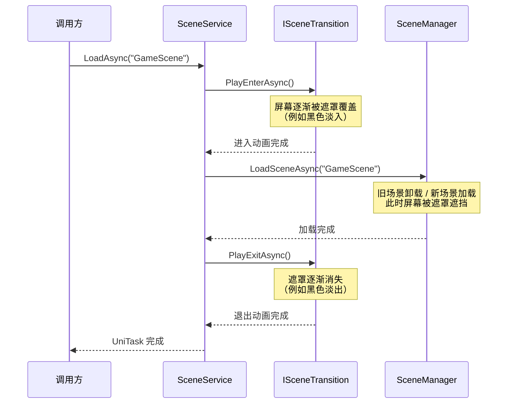

CFramework 的场景管理服务将 Unity 原生 `SceneManager` 封装为**接口驱动的异步服务**，在提供单场景切换、叠加场景加载/卸载等基础能力的同时，通过 `ISceneTransition` 过渡动画接口实现了**加载过程与视觉表现的解耦**。框架内置了 `FadeTransition`（淡入淡出）过渡方案，开发者也可通过实现 `ISceneTransition` 接口自定义任意过渡效果。本页将深入剖析场景服务的接口设计、加载流程、叠加场景机制、过渡动画架构以及测试策略。

Sources: [ISceneService.cs](Runtime/Scene/ISceneService.cs#L1-L53), [SceneService.cs](Runtime/Scene/SceneService.cs#L1-L113), [ISceneTransition.cs](Runtime/Scene/ISceneTransition.cs#L1-L21), [FadeTransition.cs](Runtime/Scene/FadeTransition.cs#L1-L74)

## 架构总览

场景管理服务遵循 CFramework 一贯的**接口-实现分离**设计原则。`ISceneService` 定义了场景操作的契约，`SceneService` 提供具体实现并通过 `FrameworkModuleInstaller` 以入口点（EntryPoint）方式注册到 VContainer 容器。过渡动画则通过独立的 `ISceneTransition` 接口抽象，默认注入 `FadeTransition` 实现，支持运行时替换。以下类图展示了核心类型之间的静态关系：



`SceneService` 同时实现了 `IStartable` 和 `IDisposable` 接口——前者使 VContainer 在场景启动时自动调用 `Start()` 以初始化 `CurrentScene`，后者确保 Subject 资源在容器销毁时被正确释放。

Sources: [ISceneService.cs](Runtime/Scene/ISceneService.cs#L11-L52), [SceneService.cs](Runtime/Scene/SceneService.cs#L13-L15), [ISceneTransition.cs](Runtime/Scene/ISceneTransition.cs#L9-L20), [FadeTransition.cs](Runtime/Scene/FadeTransition.cs#L11-L16), [FrameworkModuleInstaller.cs](Runtime/Core/DI/FrameworkModuleInstaller.cs#L16-L25)

## ISceneService 接口契约

`ISceneService` 接口是场景管理服务的公共契约，包含三类成员：**属性**、**事件流**和**异步操作方法**。下表完整列出了接口成员及其职责：

| 成员 | 类型 | 说明 |
|---|---|---|
| `Transition` | 属性 `ISceneTransition` | 获取或设置过渡动画实例，默认为 `FadeTransition` |
| `CurrentScene` | 属性 `string` | 当前活跃场景名称（只读） |
| `OnSceneLoaded` | `Observable<string>` | 场景加载完成事件流，携带场景名称 |
| `OnSceneUnloaded` | `Observable<string>` | 场景卸载完成事件流，携带场景名称 |
| `OnLoadProgress` | `Observable<float>` | 加载进度事件流，值域 `[0, 1]` |
| `LoadAsync` | 方法 | 单场景加载（替换当前场景），支持进度回调与取消 |
| `LoadAdditiveAsync` | 方法 | 叠加场景加载，不卸载当前场景 |
| `UnloadAdditiveAsync` | 方法 | 卸载指定的叠加场景 |

三个事件流均基于 R3 的 `Observable<T>` 实现，可配合 LINQ 操作符进行过滤、组合与订阅。`LoadAsync` 额外接受一个 `IProgress<float>` 参数，适用于需要将进度映射到 UI 进度条的场景——该方法同时通过 `OnLoadProgress` Subject 推送进度，确保两种监听方式都能获取实时数据。

Sources: [ISceneService.cs](Runtime/Scene/ISceneService.cs#L11-L52)

## 主场景加载流程（LoadAsync）

`LoadAsync` 是场景服务的核心方法，执行一次完整的**场景切换周期**。该方法严格按照"过渡进入 → 清理叠加 → 加载场景 → 事件通知 → 过渡退出"的顺序执行，确保状态一致性和视觉连贯性。



**关键实现细节**：

- **叠加场景自动清理**：在加载新主场景前，`UnloadAllAdditiveScenesAsync` 以倒序遍历所有已加载场景，将非当前主场景的叠加场景逐一卸载。这避免了叠加场景在新主场景中残留导致的冲突。`CurrentScene` 为 null 时会回退到 `SceneManager.GetActiveScene().name` 作为安全兜底。 [SceneService.cs](Runtime/Scene/SceneService.cs#L101-L111)
- **双重进度报告**：加载循环中每帧同时调用 `IProgress<float>.Report()` 和 `_loadProgress.OnNext()`，前者适合调用方的局部监听，后者适合全局订阅。 [SceneService.cs](Runtime/Scene/SceneService.cs#L46-L58)
- **取消令牌传递**：每帧检查 `ct.ThrowIfCancellationRequested()`，在取消时立即抛出 `OperationCanceledException`，由 UniTask 的异常管道传播。 [SceneService.cs](Runtime/Scene/SceneService.cs#L48)
- **事件顺序保证**：先触发 `OnSceneUnloaded(oldScene)` 再触发 `OnSceneLoaded(sceneName)`，下游订阅者可以据此执行旧场景清理与新场景初始化的顺序逻辑。 [SceneService.cs](Runtime/Scene/SceneService.cs#L60-L64)

Sources: [SceneService.cs](Runtime/Scene/SceneService.cs#L34-L68), [SceneService.cs](Runtime/Scene/SceneService.cs#L101-L111)

## 叠加场景机制

叠加场景（Additive Scene）是 Unity 场景管理的核心特性之一，允许将多个场景同时加载到层级中共享同一物理世界和渲染管线。CFramework 通过 `LoadAdditiveAsync` 和 `UnloadAdditiveAsync` 两个方法封装了这一能力。

**LoadAdditiveAsync** 以 `LoadSceneMode.Additive` 模式加载指定场景，加载完成后触发 `OnSceneLoaded` 事件。与 `LoadAsync` 不同，叠加场景加载**不触发过渡动画**，也不报告加载进度——这符合叠加场景通常用于动态追加内容（如 UI 层、环境装饰层、子关卡）的轻量化定位。 [SceneService.cs](Runtime/Scene/SceneService.cs#L70-L81)

**UnloadAdditiveAsync** 卸载指定叠加场景并触发 `OnSceneUnloaded` 事件。两个方法都内置了取消令牌检查，确保在异步等待过程中响应取消请求。 [SceneService.cs](Runtime/Scene/SceneService.cs#L83-L94)

| 特性 | `LoadAsync`（主场景） | `LoadAdditiveAsync`（叠加场景） |
|---|---|---|
| 加载模式 | `LoadSceneMode.Single`（替换） | `LoadSceneMode.Additive`（追加） |
| 过渡动画 | ✅ 播放进入/退出动画 | ❌ 无过渡动画 |
| 进度报告 | ✅ `IProgress<float>` + `OnLoadProgress` | ❌ 无进度报告 |
| 叠加场景清理 | ✅ 自动卸载所有叠加场景 | ❌ 不影响其他场景 |
| `CurrentScene` 更新 | ✅ 更新为新场景名 | ❌ 不改变 |
| `OnSceneUnloaded` 触发 | ✅ 触发（旧场景名） | ❌ 不触发 |
| `OnSceneLoaded` 触发 | ✅ 触发 | ✅ 触发 |

典型使用场景包括：将大厅 UI 以叠加场景加载、在开放世界中动态加载/卸载区域块、在主玩法上叠加一层 Cutscene 场景等。

Sources: [SceneService.cs](Runtime/Scene/SceneService.cs#L34-L94), [ISceneService.cs](Runtime/Scene/ISceneService.cs#L39-L51)

## 过渡动画架构（ISceneTransition）

过渡动画的设计是场景服务中最具扩展性的部分。`ISceneTransition` 接口仅定义两个方法——`PlayEnterAsync`（进入动画，在场景加载前播放）和 `PlayExitAsync`（退出动画，在场景加载后播放），将过渡效果的实现细节完全交由具体类决定。

这种"接口两方法"的极简设计背后隐藏着一个精心考虑的**时间线契约**：



这个序列确保了一个关键的视觉不变量：**场景切换的实际操作（卸载旧场景、加载新场景）始终发生在遮罩完全覆盖屏幕之后**。用户永远不会看到场景卸载时的空白帧或资源闪烁。

`SceneService` 中 `Transition` 属性的默认值是 `new FadeTransition()`，即框架自带淡入淡出效果。开发者可以在注入后通过 `sceneService.Transition = new CustomTransition()` 替换，或将 `Transition` 设为 `null` 完全禁用过渡动画。 [SceneService.cs](Runtime/Scene/SceneService.cs#L28)

Sources: [ISceneTransition.cs](Runtime/Scene/ISceneTransition.cs#L9-L20), [SceneService.cs](Runtime/Scene/SceneService.cs#L28), [SceneService.cs](Runtime/Scene/SceneService.cs#L37-L67)

## FadeTransition 内置实现

`FadeTransition` 是框架内置的淡入淡出过渡效果，通过动态创建一个全屏 `Canvas` + `Image` 遮罩实现视觉过渡。它的工作机制清晰且自包含：

**遮罩创建（CreateOverlay）**：首次调用 `PlayEnterAsync` 时，动态实例化一个名为 `[FadeTransition]` 的 GameObject，挂载 `Canvas`（`RenderMode.ScreenSpaceOverlay`、`sortingOrder = 9999`）和 `Image` 组件。通过 `DontDestroyOnLoad` 确保遮罩在场景切换时不会被销毁。 [FadeTransition.cs](Runtime/Scene/FadeTransition.cs#L32-L45)

**淡入（PlayEnterAsync）**：将遮罩的 alpha 从 `0` 渐变到 `1`，使屏幕逐渐被 `FadeColor` 覆盖。 [FadeTransition.cs](Runtime/Scene/FadeTransition.cs#L18-L24)

**淡出（PlayExitAsync）**：将遮罩的 alpha 从 `1` 渐变到 `0`，随后调用 `DestroyOverlay` 销毁遮罩 GameObject，释放所有资源。 [FadeTransition.cs](Runtime/Scene/FadeTransition.cs#L26-L30)

**核心渐变方法（FadeAsync）**：通过 `Time.deltaTime` 累计时间，使用 `Mathf.Lerp` 在 `from` 和 `to` 之间线性插值 alpha 值，每帧更新 `_overlay.color` 并通过 `UniTask.Yield` 让出执行权。结束时确保 alpha 精确到达目标值。 [FadeTransition.cs](Runtime/Scene/FadeTransition.cs#L57-L72)

`FadeTransition` 提供两个可配置属性：

| 属性 | 类型 | 默认值 | 说明 |
|---|---|---|---|
| `Duration` | `float` | `0.5f` | 单次淡入或淡出的持续时间（秒） |
| `FadeColor` | `Color` | `Color.black` | 遮罩颜色（alpha 通道由动画控制，设置时忽略） |

开发者可以通过直接构造并配置这些属性来自定义过渡效果：

```csharp
var fade = new FadeTransition
{
    Duration = 0.8f,
    FadeColor = new Color(0.1f, 0.1f, 0.2f)  // 深蓝色过渡
};
sceneService.Transition = fade;
```

Sources: [FadeTransition.cs](Runtime/Scene/FadeTransition.cs#L11-L73)

## 服务注册与生命周期

`SceneService` 通过 `FrameworkModuleInstaller` 注册到 VContainer 容器。安装器中使用 `InstallModule` 扩展方法，将 `SceneService` 注册为**入口点**并映射到 `ISceneService` 接口。这意味着 `SceneService` 的生命周期由 VContainer 的单例容器管理，其 `IStartable.Start()` 和 `IDisposable.Dispose()` 方法会被自动调用。 [FrameworkModuleInstaller.cs](Runtime/Core/DI/FrameworkModuleInstaller.cs#L18-L24), [InstallerExtensions.cs](Runtime/Core/DI/InstallerExtensions.cs#L30-L37)

**生命周期关键节点**：

1. **构造阶段**：VContainer 创建 `SceneService` 实例，`Transition` 属性初始化为默认的 `new FadeTransition()`，三个 R3 Subject 被创建。 [SceneService.cs](Runtime/Scene/SceneService.cs#L15-L28)
2. **启动阶段**：VContainer 调用 `Start()` 方法，通过 `SceneManager.GetActiveScene().name` 初始化 `CurrentScene`。这确保了服务在任何 `LoadAsync` 调用之前就拥有正确的当前场景引用。 [SceneService.cs](Runtime/Scene/SceneService.cs#L96-L99)
3. **运行阶段**：响应外部调用执行场景加载/卸载操作，推送事件流。
4. **销毁阶段**：VContainer 调用 `Dispose()`，释放三个 Subject 防止内存泄漏。 [SceneService.cs](Runtime/Scene/SceneService.cs#L19-L24)

`GameScope` 在 `ResolveFrameworkServices()` 中解析 `ISceneService` 并暴露为 `SceneService` 公共属性，使得全局范围内的代码可以通过 `GameScope.Instance.SceneService` 直接访问。 [GameScope.cs](Runtime/Core/DI/GameScope.cs#L106-L107)

Sources: [FrameworkModuleInstaller.cs](Runtime/Core/DI/FrameworkModuleInstaller.cs#L18-L24), [InstallerExtensions.cs](Runtime/Core/DI/InstallerExtensions.cs#L30-L37), [SceneService.cs](Runtime/Scene/SceneService.cs#L15-L99), [GameScope.cs](Runtime/Core/DI/GameScope.cs#L106-L107)

## 测试策略

场景服务的测试文件 `SceneServiceTests.cs` 展示了针对场景服务的测试设计思路。由于场景加载依赖于 Unity 的场景管理基础设施（需要实际存在的场景资产），测试分为两类：

**可独立运行的单元测试**：`FadeTransition` 的实例化测试（S004）验证了属性配置的正确性，不依赖场景资产。该测试确认 `Duration` 和 `FadeColor` 属性在构造后能正确保持赋值。 [SceneServiceTests.cs](Tests/Runtime/Scene/SceneServiceTests.cs#L55-L68)

**需要场景基础设施的集成测试**：`LoadAsync`、`LoadAdditiveAsync`、`UnloadAdditiveAsync` 等方法被标记为 `Assert.Pass("需要创建测试场景进行实际测试")`，表明这些测试需要预构建测试场景才能执行。S005 是一个使用 `[UnityTest]` 标注的过渡动画集成测试，配合 `CancellationTokenSource.CancelAfter(TimeSpan.FromSeconds(3))` 作为超时保护，验证 `PlayEnterAsync` → `PlayExitAsync` 完整周期在 `Duration = 0.1f` 配置下能正常完成。 [SceneServiceTests.cs](Tests/Runtime/Scene/SceneServiceTests.cs#L70-L101)

| 测试编号 | 测试内容 | 类型 | 依赖 |
|---|---|---|---|
| S001 | `LoadAsync` 场景加载 | 集成测试 | 测试场景资产 |
| S002 | `LoadAdditiveAsync` 叠加加载 | 集成测试 | 测试场景资产 |
| S003 | `UnloadAdditiveAsync` 叠载卸载 | 集成测试 | 测试场景资产 |
| S004 | `FadeTransition` 属性实例化 | 单元测试 | 无 |
| S005 | `FadeTransition` 动画完整周期 | 集成测试 | Unity 运行时 |
| S006 | 事件订阅 `OnSceneLoaded` | 集成测试 | SceneService 实例 |
| S007 | `Dispose` 生命周期 | 集成测试 | SceneService 实例 |

Sources: [SceneServiceTests.cs](Tests/Runtime/Scene/SceneServiceTests.cs#L1-L117)

## 设计要点总结

场景管理服务的设计体现了几个关键的架构决策：

**接口与实现分离**：`ISceneService` 和 `ISceneTransition` 两个接口将场景操作和过渡效果解耦，使得测试时可以用 Mock 替换真实服务，扩展时可以实现自定义过渡效果而无需修改框架代码。这一点在 [框架扩展指南：自定义 IInstaller、IAssetProvider 与 ISceneTransition](23-kuang-jia-kuo-zhan-zhi-nan-zi-ding-yi-iinstaller-iassetprovider-yu-iscenetransition) 中有详细说明。

**事件驱动架构**：三个 R3 `Observable` 事件流使得场景状态变化可以被任意数量的订阅者响应，无需场景服务了解下游消费者的存在。这与 [事件总线：同步/异步发布订阅与 R3 响应式集成](6-shi-jian-zong-xian-tong-bu-yi-bu-fa-bu-ding-yue-yu-r3-xiang-ying-shi-ji-cheng) 中描述的响应式编程范式一脉相承。

**安全优先的叠加场景管理**：`UnloadAllAdditiveScenesAsync` 的倒序遍历和 `CurrentScene` 空值兜底，确保即使在服务初始化早期也能安全执行清理操作。

**下一步建议阅读**：理解场景服务的过渡动画扩展机制后，推荐阅读 [配置表系统：ScriptableObject 数据源、泛型 ConfigTable 与热重载](16-pei-zhi-biao-xi-tong-scriptableobject-shu-ju-yuan-fan-xing-configtable-yu-re-zhong-zai) 了解场景配置数据如何通过配置表驱动，或直接跳转 [框架扩展指南](23-kuang-jia-kuo-zhan-zhi-nan-zi-ding-yi-iinstaller-iassetprovider-yu-iscenetransition) 学习如何实现自定义 `ISceneTransition`。