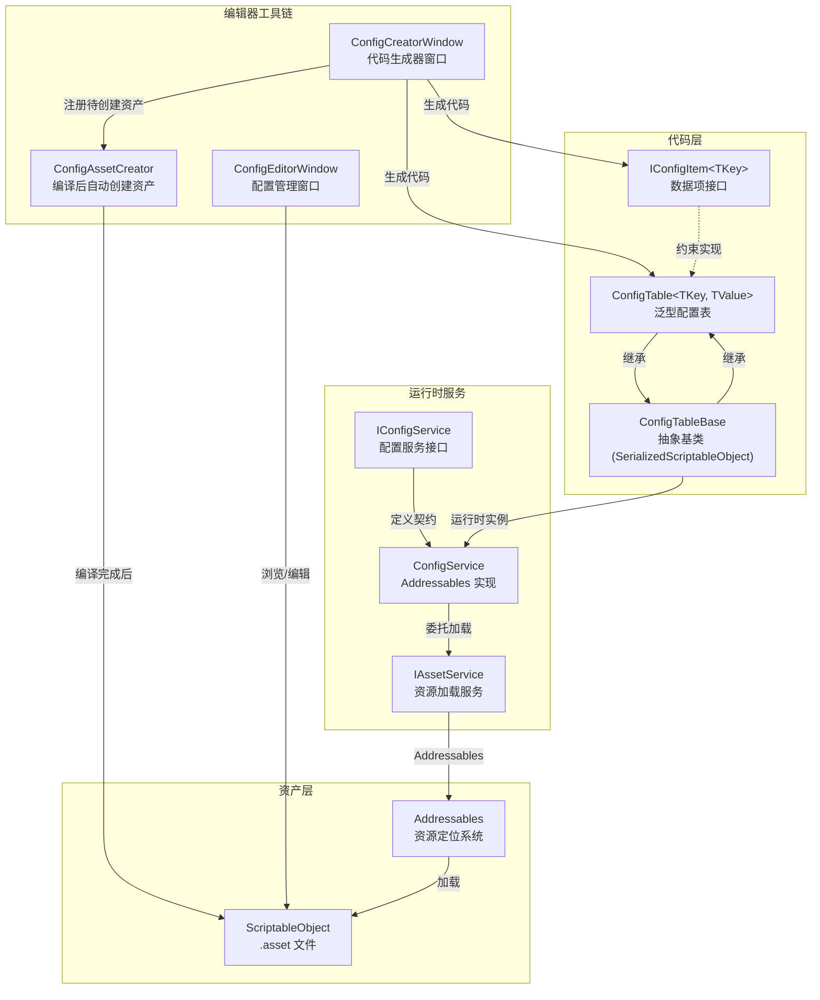
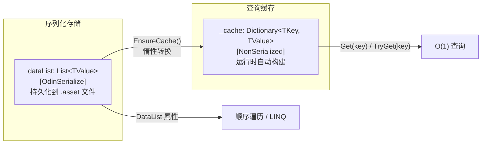
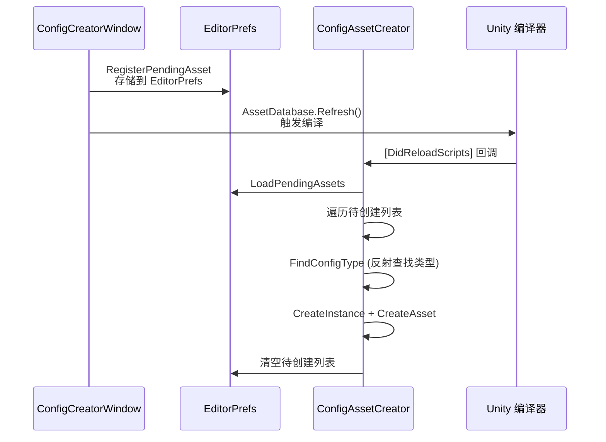

配置表系统是 CFramework 的数据驱动基础设施——它将游戏中的静态配置（道具属性、关卡参数、角色数值等）从代码硬编码中剥离，统一到类型安全的 ScriptableObject 资产中管理。该系统围绕三个核心概念构建：**IConfigItem 数据契约**定义单条配置的结构与主键，**泛型 ConfigTable** 提供序列化存储与 O(1) 字典查找的双引擎查询能力，**ConfigService** 则基于 Addressables 实现异步加载、生命周期管理与运行时热重载。配合编辑器端的代码生成器与配置管理窗口，开发者可以零样板代码地创建、编辑和部署配置表。本文将从底层数据模型出发，逐层剖析存储机制、查询优化、服务层架构，最终覆盖编辑器工具链的完整工作流。

## 系统架构总览

在深入每个组件之前，先建立对整个配置表系统的结构化认知。下图展示了从数据定义到运行时查询的完整数据流，以及编辑器工具链如何参与其中：



Sources: [IConfigItem.cs](Runtime/Config/IConfigItem.cs#L1-L15), [ConfigTableBase.cs](Runtime/Config/ConfigTableBase.cs#L1-L25), [ConfigTable.cs](Runtime/Config/ConfigTable.cs#L1-L101), [ConfigService.cs](Runtime/Config/ConfigService.cs#L1-L138)

## 数据契约：IConfigItem\<TKey\>

一切配置数据的起点是 `IConfigItem<TKey>` 接口。它只要求实现一个只读属性 `Key`，作为该配置项的**唯一标识符**。这种最小化契约设计意味着你的数据类不需要继承任何特定基类，只需声明"我用什么类型作为主键"即可。

```csharp
// 定义道具配置数据
[Serializable]
public class ItemData : IConfigItem<int>
{
    public int id;
    public string name;
    public string description;
    public int maxStack;

    public int Key => id;  // 主键指向 id 字段
}
```

`TKey` 的泛型参数支持任意类型，实际项目中常用的选择包括 `int`（自增 ID）、`string`（语义化标识符如 `"sword_iron"`）、`long`（与服务器对齐的 64 位 ID）等。泛型的灵活性确保系统不会对业务数据做不必要的假设。

Sources: [IConfigItem.cs](Runtime/Config/IConfigItem.cs#L1-L15)

## 配置表基类：ConfigTableBase

`ConfigTableBase` 是所有配置表的抽象基类，继承自 Odin Inspector 的 `SerializedScriptableObject`。选择 Odin 的序列化 ScriptableObject 而非 Unity 原生的，是为了获得 **Odin 序列化器**对复杂类型（字典、多态对象、 nullable 值类型等）的完整支持——这在配置数据中是常见需求。

基类维护三个关键状态：`IsLoaded` 标记运行时加载完成状态，`Source` 记录当前数据的来源类型，`OnDataLoaded` 事件则在数据加载完成后通知外部订阅者。`Count` 作为抽象属性由子类实现，用于在编辑器窗口中显示配置记录数量。

| 属性 | 类型 | 用途 |
|---|---|---|
| `IsLoaded` | `bool` | 标记配置表是否已完成运行时加载 |
| `Source` | `ConfigDataSource` | 数据来源（ScriptableObject / Binary / Json / Network / External） |
| `Count` | `int`（抽象） | 配置数据条目数 |
| `OnDataLoaded` | `event Action` | 数据加载完成事件通知 |

Sources: [ConfigTableBase.cs](Runtime/Config/ConfigTableBase.cs#L1-L25), [ConfigDataSource.cs](Runtime/Config/ConfigDataSource.cs#L1-L14)

## 泛型配置表：ConfigTable\<TKey, TValue\>

`ConfigTable<TKey, TValue>` 是系统的核心数据容器，它同时承担两种职责：作为 **ScriptableObject 的序列化载体**（编辑器中可视化编辑），以及作为**运行时的高效查询引擎**（O(1) 字典查找）。这两种职责通过**双存储架构**实现。

### 双存储架构

序列化侧使用 `List<TValue> dataList`，标记了 `[OdinSerialize]` 以启用 Odin 序列化器。在 Inspector 中，该列表以 `[TableList]`（表格视图）和 `[Searchable]`（可搜索）展示，使得大量配置项的管理变得直观。查询侧使用 `Dictionary<TKey, TValue> _cache`，标记为 `[NonSerialized]`，不在序列化时写入，而是通过**惰性构建**策略在首次查询时自动生成。



`EnsureCache()` 方法实现了惰性初始化：当 `_cache` 为 `null` 时遍历 `dataList` 构建字典，否则直接返回已有缓存。这意味着配置表在被加载后首次查询时会有一笔一次性开销，此后所有查询都是 O(1) 常数时间。

Sources: [ConfigTable.cs](Runtime/Config/ConfigTable.cs#L1-L101)

### 查询 API 一览

`ConfigTable<TKey, TValue>` 提供了一套完整的查询接口，覆盖主键查找、安全查找和全量枚举三种模式：

| 方法 | 返回值 | 说明 |
|---|---|---|
| `Get(TKey key)` | `TValue` | 按主键获取，找不到返回 `null` |
| `TryGet(TKey key, out TValue)` | `bool` | 安全获取模式，通过 out 参数返回值 |
| `Keys()` | `IEnumerable<TKey>` | 获取所有主键的集合 |
| `DataList` | `IReadOnlyList<TValue>` | 只读列表，用于遍历或 LINQ 查询 |
| `Count` | `int` | 配置数据总条数 |

所有涉及查询的方法内部都会调用 `EnsureCache()`，因此无论何时何地调用，缓存都保证可用。

Sources: [ConfigTable.cs](Runtime/Config/ConfigTable.cs#L43-L99)

### 外部数据注入：SetData

除了通过 Inspector 手动编辑数据外，`SetData` 方法提供了一条**编程式数据注入**通道。这在以下场景中特别有用：从远程服务器拉取热更配置后注入、从二进制/JSON 文件反序列化后替换数据、或者单元测试中构建内存数据。

```csharp
public void SetData(List<TValue> newData, ConfigDataSource source = ConfigDataSource.External)
{
    dataList = newData ?? throw new ArgumentNullException(nameof(newData));
    _cache = null; // 清除缓存，下次访问时重建
    Source = source;
    IsLoaded = true;
    NotifyDataLoaded();
}
```

调用 `SetData` 后，`_cache` 被置空以触发惰性重建，`Source` 记录数据来源，`IsLoaded` 被标记为 `true`，同时触发 `OnDataLoaded` 事件通知订阅者。

Sources: [ConfigTable.cs](Runtime/Config/ConfigTable.cs#L71-L78)

### 定义一张配置表

开发者只需创建两个类——数据类和配置表类——无需编写任何序列化或查询代码：

```csharp
// 1. 定义数据类
[Serializable]
public sealed class WeaponData : IConfigItem<int>
{
    public int id;
    public string name;
    public int attackPower;
    public float attackSpeed;

    public int Key => id;
}

// 2. 定义配置表类（只需一行声明）
[CreateAssetMenu(fileName = "WeaponConfig", menuName = "Game/Config/WeaponConfig")]
public sealed class WeaponConfig : ConfigTable<int, WeaponData>
{
    // 数据在 Inspector 中配置，无需额外代码
}
```

配置表类本身是一张空表，所有序列化、查询、缓存逻辑都由泛型基类提供。`[CreateAssetMenu]` 特性使得你可以在 Unity 编辑器的 Assets 菜单中直接创建对应的 `.asset` 文件。

Sources: [ConfigTable.cs](Runtime/Config/ConfigTable.cs#L11-L26), [IConfigItem.cs](Runtime/Config/IConfigItem.cs#L8-L14)

## 配置服务：ConfigService 与 Addressables 集成

`ConfigService` 是配置表的**运行时服务层**，实现了 `IConfigService` 接口并通过 `IAssetService`（Addressables 封装）完成异步加载。它的职责包括：按需加载配置表资产、维护加载状态、提供类型安全的查询入口、以及支持热重载。该服务在 `GameScope` 初始化时通过依赖注入注册。

### 异步加载流程

`LoadAsync<TKey>` 是核心加载方法，它根据 `FrameworkSettings.ConfigAddressPrefix` 和类型名拼接 Addressable 地址，然后委托 `IAssetService` 完成实际加载。加载后的配置表被缓存在 `_tables` 字典中（以配置表类型为键），对应的资源句柄被保存在 `_handles` 字典中用于后续释放。

```mermaid
sequenceDiagram
    participant Game as 游戏业务代码
    participant CS as ConfigService
    participant AS as IAssetService
    participant Addr as Addressables

    Game->>CS: LoadAsync&lt;WeaponConfig&gt;(ct)
    CS->>CS: 检查 _tables 是否已缓存
    alt 已缓存
        CS-->>Game: 直接返回
    else 未缓存
        CS->>CS: 拼接地址: "Config/WeaponConfig"
        CS->>AS: LoadAsync&lt;ConfigTableBase&gt;(address, ct)
        AS->>Addr: Addressables.LoadAssetAsync
        Addr-->>AS: AssetHandle
        AS-->>CS: AssetHandle
        CS->>CS: _tables[type] = table<br/>_handles[type] = handle<br/>table.IsLoaded = true
        CS-->>Game: UniTask 完成
    end
```

加载地址的构建规则是：若 `ConfigAddressPrefix` 非空则为 `{前缀}/{类型名}`，否则直接使用类型名。例如 `ConfigAddressPrefix = "Config"` 且类型为 `WeaponConfig`，则地址为 `"Config/WeaponConfig"`。这意味着在 Addressables Group 中，你需要将配置表资产标记为 Addressable 并使用对应的地址标签。

Sources: [ConfigService.cs](Runtime/Config/ConfigService.cs#L26-L68), [IConfigService.cs](Runtime/Config/IConfigService.cs#L1-L20), [FrameworkSettings.cs](Runtime/Core/FrameworkSettings.cs#L39-L40)

### 反射委托缓存优化

`ConfigService.Get<TKey, TValue>()` 方法需要调用 `ConfigTable<TKey, TValue>.Get(TKey)`，但由于泛型参数在编译时不确定（调用者可能传入任意类型组合），必须通过反射 `MakeGenericType` 构造封闭类型再调用方法。反射调用的性能开销远高于直接调用，因此 `ConfigService` 使用 `ConcurrentDictionary<Type, Func<ConfigTableBase, object, object>>` **缓存编译后的委托**，确保每个封闭类型只承受一次反射开销：

```csharp
var del = _getDelegates.GetOrAdd(tableType, t =>
{
    var getMethod = t.GetMethod("Get");
    return (tbl, k) => getMethod.Invoke(tbl, new[] { k });
});
return (TValue)del(table, key);
```

这一优化使得后续相同类型组合的查询走缓存的委托调用路径，避免了重复的 `MakeGenericType` + `GetMethod` 开销。

Sources: [ConfigService.cs](Runtime/Config/ConfigService.cs#L94-L109)

### 服务层 API 总览

| 方法 | 返回值 | 说明 |
|---|---|---|
| `LoadAsync<TKey>(ct)` | `UniTask` | 异步加载指定类型的配置表 |
| `LoadAllAsync(ct)` | `UniTask` | 批量加载（当前版本未实现，建议逐个加载） |
| `GetTable<T>()` | `T` | 获取已加载的配置表实例 |
| `TryGetTable<T>(out T)` | `bool` | 安全获取配置表实例 |
| `Get<TKey, TValue>(key)` | `TValue` | 直接通过主键查询配置值（反射委托缓存） |
| `ReloadAsync<TKey>(ct)` | `UniTask` | 热重载：释放旧资产并重新加载 |

Sources: [IConfigService.cs](Runtime/Config/IConfigService.cs#L1-L20), [ConfigService.cs](Runtime/Config/ConfigService.cs#L76-L137)

## 热重载机制

配置表的热重载通过 `ReloadAsync<TKey>` 实现，其核心流程是**释放旧资源 → 清除缓存 → 重新加载**：

```csharp
public async UniTask ReloadAsync<TKey>(CancellationToken ct = default)
{
    var type = typeof(TKey);

    // 1. 移除已加载的配置
    if (_tables.ContainsKey(type)) _tables.Remove(type);

    // 2. 释放资源句柄（触发 Addressables 引用计数递减）
    if (_handles.TryGetValue(type, out var handle))
    {
        handle.Dispose();
        _handles.Remove(type);
    }

    // 3. 重新加载（从 Addressables 获取最新版本）
    await LoadAsync<TKey>(ct);
}
```

这一机制在以下场景中发挥关键作用：**开发阶段**迭代配置数据后无需重启游戏即可验证修改效果；**运营阶段**从远程下载热更新配置后，替换内存中的旧数据。由于旧资源通过 `AssetHandle.Dispose()` 正确释放（递减 Addressables 引用计数），不会造成内存泄漏。

值得注意的是，如果业务代码持有旧的配置表引用，热重载后这些引用将指向已被替换的旧实例。建议通过 `IConfigService.GetTable<T>()` 重新获取最新引用，或订阅 `ConfigTableBase.OnDataLoaded` 事件感知数据变更。

Sources: [ConfigService.cs](Runtime/Config/ConfigService.cs#L111-L127)

## 编辑器工具链：从代码生成到资产管理

CFramework 为配置表提供了完整的编辑器工具链，覆盖从**创建**到**浏览编辑**的全流程，目标是消除手动编写样板代码的负担。

### 配置创建器窗口：ConfigCreatorWindow

通过 `CFramework > 创建配置表` 菜单打开，这是一个基于 Odin 的可视化代码生成器。开发者通过表单配置以下信息：

| 配置项 | 默认值 | 说明 |
|---|---|---|
| 配置表名称 | `NewConfig` | 类名，如 `ItemConfig` |
| 命名空间 | `Game.Configs` | 生成的命名空间 |
| 键类型 | `int` | 支持 int/string/long/byte/short/uint/ulong/ushort |
| 值类型名称 | 自动推导 | 配置表名去掉 `Config` 后缀加 `Data`，如 `ItemData` |
| 值类型字段 | id + name | 可视化编辑字段列表，支持标记主键字段 |
| 输出目录 | `Assets/Scripts/Config` | 代码文件输出路径 |
| 资产输出目录 | `Assets/EditorRes/Configs` | .asset 文件输出路径 |
| 自动创建资产 | `true` | 编译后自动创建 .asset 文件 |

点击「生成代码」后，窗口生成两个文件：数据类（实现 `IConfigItem<TKey>`，包含所有字段、`Key` 属性和 `Clone` 方法）和配置表类（继承 `ConfigTable<TKey, TValue>`，附带 `[CreateAssetMenu]` 特性）。如果开启了「自动创建资产」，生成器会通过 `ConfigAssetCreator` 注册一个待创建资产，在 Unity 编译完成后自动创建对应的 `.asset` 文件。

Sources: [ConfigCreatorWindow.cs](Editor/Windows/Config/ConfigCreatorWindow.cs#L1-L519), [ConfigAssetCreator.cs](Editor/Utilities/ConfigAssetCreator.cs#L1-L218)

### 配置管理窗口：ConfigEditorWindow

通过 `CFramework > 配置管理` 菜单打开，提供项目所有配置表的**统一浏览和编辑**界面。左侧列出所有继承自 `ConfigTableBase` 的 ScriptableObject 资产（通过 `AssetDatabase.FindAssets` 扫描），右侧展示选中配置表的详细内容（利用 Odin 的 PropertyTree 进行动态编辑）。窗口顶部显示配置表总数，并提供「新建配置」和「刷新」快捷操作。

Sources: [ConfigEditorWindow.cs](Editor/Windows/Config/ConfigEditorWindow.cs#L1-L257)

### 自动资产创建流水线

`ConfigAssetCreator` 解决了一个编辑器开发中的经典时序问题：**代码刚生成时尚未编译，对应的类型还不存在，无法 `ScriptableObject.CreateInstance`**。其解决方案是**延迟创建**模式：



待创建资产信息以 JSON 序列化存储在 `EditorPrefs` 中，通过 `[DidReloadScripts]` 回调在编译完成后触发处理。`FindConfigType` 方法采用**两轮查找策略**：优先使用完整命名空间名称查找，如果失败则退化为不带命名空间的类名查找，覆盖跨程序集类型查找的常见场景。

Sources: [ConfigAssetCreator.cs](Editor/Utilities/ConfigAssetCreator.cs#L14-L63), [ConfigAssetCreator.cs](Editor/Utilities/ConfigAssetCreator.cs#L104-L167), [ConfigAssetCreator.cs](Editor/Utilities/ConfigAssetCreator.cs#L169-L202)

## 典型工作流：从创建到查询

以下是将配置表系统投入实际使用的完整步骤，涵盖了从编辑器操作到运行时代码的全部环节：

**步骤 1 — 创建配置表**：打开 `CFramework > 创建配置表`，填写配置表名称（如 `LevelConfig`）、字段定义，点击「生成代码」。系统自动生成 `LevelData.cs` 和 `LevelConfig.cs`，并在编译完成后创建 `LevelConfig.asset`。

**步骤 2 — 配置 Addressable**：将生成的 `.asset` 文件标记为 Addressable，设置地址为 `{ConfigAddressPrefix}/{配置表名}`（如 `Config/LevelConfig`）。

**步骤 3 — 编辑数据**：通过 `CFramework > 配置管理` 或直接在 Inspector 中选中 `.asset` 文件，以表格形式编辑配置数据。

**步骤 4 — 注册服务**：确保 `ConfigService` 在 `GameScope` 中通过安装器注册（参见 [依赖注入体系：GameScope、SceneScope 与动态安装器机制](5-yi-lai-zhu-ru-ti-xi-gamescope-scenescope-yu-dong-tai-an-zhuang-qi-ji-zhi)）。

**步骤 5 — 运行时加载与查询**：

```csharp
public class GameEntryPoint : MonoBehaviour
{
    private IConfigService _configService;

    private async UniTaskVoid Start()
    {
        // 加载配置表
        await _configService.LoadAsync<LevelConfig>();

        // 方式一：通过服务直接查询
        var levelData = _configService.Get<int, LevelData>(1001);

        // 方式二：获取配置表实例后查询（推荐，避免反射开销）
        if (_configService.TryGetTable<LevelConfig>(out var levelConfig))
        {
            var data = levelConfig.Get(1001);
            Debug.Log($"关卡名称: {data.name}");
        }
    }
}
```

**步骤 6 — 热重载**（可选）：在需要更新配置时调用 `await _configService.ReloadAsync<LevelConfig>()`，系统释放旧资产并重新加载最新版本。

Sources: [IConfigService.cs](Runtime/Config/IConfigService.cs#L1-L20), [ConfigService.cs](Runtime/Config/ConfigService.cs#L32-L68)

## 设计决策与注意事项

**惰性缓存策略**：字典缓存通过 `EnsureCache()` 延迟到首次查询时构建，这意味着加载操作本身是 O(n) 的（遍历列表构建字典），但这个开销被分摊到整个生命周期中。如果业务场景对首帧延迟敏感，可以在加载后主动调用一次 `Get` 或 `Keys` 触发缓存预热。

**查询方式选择**：`ConfigService.Get<TKey, TValue>()` 使用反射委托缓存，适合需要高度动态性的场景；`ConfigService.GetTable<T>()` 返回强类型的 `ConfigTable` 实例，后续查询走直接方法调用路径，性能更优。**在性能敏感代码中，推荐先 `GetTable` 再调用 `ConfigTable.Get`**。

**线程安全**：`_getDelegates` 使用 `ConcurrentDictionary` 保证多线程安全，但 `ConfigTable` 内部的 `_cache` 构建没有加锁。在 Unity 的单线程主循环模型下这不是问题，但如果在后台线程访问配置表，需要注意潜在的竞态条件。

**资源生命周期**：`ConfigService` 实现了 `IDisposable`，在 `Dispose` 时释放所有持有的 `AssetHandle`。确保在场景切换或游戏退出时正确清理，避免 Addressables 引用泄漏。更多信息请参阅 [资源管理服务：Addressables 封装、引用计数与生命周期绑定](10-zi-yuan-guan-li-fu-wu-addressables-feng-zhuang-yin-yong-ji-shu-yu-sheng-ming-zhou-qi-bang-ding)。

Sources: [ConfigService.cs](Runtime/Config/ConfigService.cs#L129-L137), [ConfigTable.cs](Runtime/Config/ConfigTable.cs#L83-L91)

## 延伸阅读

- [ConfigTable 自定义 Inspector 与配置资产编辑器](21-configtable-zi-ding-yi-inspector-yu-pei-zhi-zi-chan-bian-ji-qi) — 深入了解编辑器端的 Inspector 定制和配置资产管理窗口
- [资源管理服务：Addressables 封装、引用计数与生命周期绑定](10-zi-yuan-guan-li-fu-wu-addressables-feng-zhuang-yin-yong-ji-shu-yu-sheng-ming-zhou-qi-bang-ding) — 理解 ConfigService 依赖的 Addressables 封装层
- [依赖注入体系：GameScope、SceneScope 与动态安装器机制](5-yi-lai-zhu-ru-ti-xi-gamescope-scenescope-yu-dong-tai-an-zhuang-qi-ji-zhi) — 了解 ConfigService 如何注册到 DI 容器
- [单元测试指南：测试覆盖策略与 Mock 替换模式](22-dan-yuan-ce-shi-zhi-nan-ce-shi-fu-gai-ce-lue-yu-mock-ti-huan-mo-shi) — 查看配置表的单元测试策略与 Mock 模式