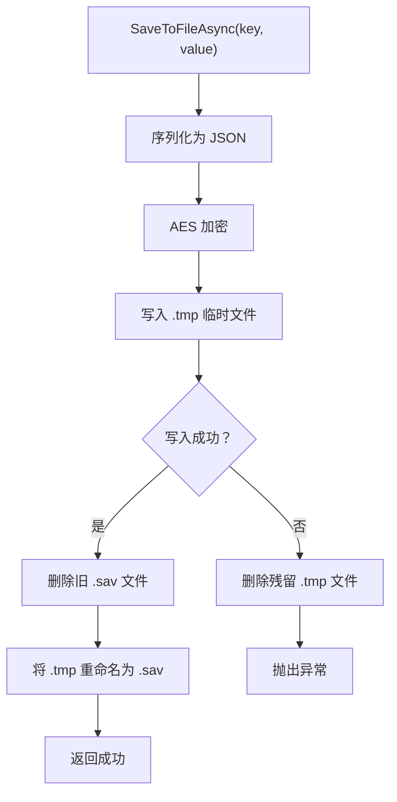
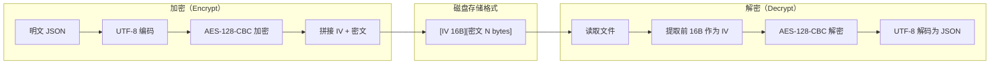

存档系统是 CFramework 中负责游戏数据持久化的核心模块，它提供了一套完整的解决方案，覆盖了从数据写入安全到多存档槽隔离的全部需求。该系统以 `ISaveService` 接口为契约，由 `SaveService` 实现类提供四大核心能力：**原子写入**保证断电/崩溃场景下存档文件的完整性；**脏状态追踪**通过 R3 响应式流通知 UI 层存档状态变化；**AES 对称加密**确保磁盘上的存档数据不被轻易篡改或阅读；**多存档槽管理**支持玩家在多个独立存档之间自由切换。整个系统通过 `FrameworkModuleInstaller` 以单例形式注册到 VContainer 依赖注入容器中，任何注入了 `ISaveService` 的服务均可直接使用。

Sources: [ISaveService.cs](Runtime/Save/ISaveService.cs#L1-L48), [SaveService.cs](Runtime/Save/SaveService.cs#L1-L351), [FrameworkModuleInstaller.cs](Runtime/Core/DI/FrameworkModuleInstaller.cs#L18-L24)

## 架构总览

存档系统由四个类型组成，各自承担明确的职责边界。下方 Mermaid 图展示了它们的静态关系与数据流方向——在阅读图示之前需要理解一个前提：**所有存档操作都经过内存缓存层**，缓存命中时直接返回，未命中时才从磁盘加载并解密。

```mermaid
classDiagram
    direction TB

    class ISaveService {
        <<interface>>
        +CurrentSlot : int
        +IsDirty : bool
        +OnDirtyChanged : Observable~bool~
        +SaveAsync(ct) UniTask
        +SaveAsync~T~(key, value, ct) UniTask
        +LoadAsync~T~(key, defaultValue) UniTask~T~
        +HasKey(key) bool
        +DeleteAsync(key, ct) UniTask~bool~
        +DeleteAllAsync(ct) UniTask
        +SetSlot(slotIndex)
        +GetSlotNames() string[]
        +GetSlotInfos() SaveSlotInfo[]
        +MarkDirty()
        +ClearDirty()
        +EnableAutoSave(intervalSeconds)
        +DisableAutoSave()
    }

    class SaveService {
        -_cache : Dictionary~string, object~
        -_dirtyChanged : Subject~bool~
        -_settings : FrameworkSettings
        -_autoSaveCts : CancellationTokenSource
        -Encrypt(data) byte[]
        -Decrypt(data) string
        -SaveToFileAsync(key, value, ct) UniTask
        -AutoSaveLoop(interval, ct) UniTaskVoid
        +Dispose()
    }

    class SaveSlotInfo {
        +Index : int
        +Name : string
        +LastModified : DateTime
        +HasData : bool
    }

    class SaveDataBase {
        <<abstract>>
        +Version : int
        +LastSaveTime : DateTime
    }

    class FrameworkSettings {
        +EncryptionKey : string
        +AutoSaveInterval : int
    }

    ISaveService <|.. SaveService : implements
    SaveService --> FrameworkSettings : 读取加密密钥
    SaveService --> SaveSlotInfo : 返回槽位元信息
    SaveDataBase <|-- "用户存档类" : 继承
```

`SaveService` 是整个系统的唯一实现类，它同时实现了 `ISaveService` 和 `IDisposable` 两个接口。构造函数接收 `FrameworkSettings` 以获取加密密钥和自动保存间隔配置。内部维护三个核心状态：`_cache` 字典作为内存缓存层减少磁盘 I/O；`_dirtyChanged`（R3 的 `Subject<bool>`）驱动脏状态变化事件流；`_autoSaveCts` 控制自动保存协程的生命周期。`SaveDataBase` 是一个可选的抽象基类，为用户自定义的存档数据结构提供 `Version` 和 `LastSaveTime` 两个通用字段，但它不是必须继承的——任何可序列化的类型都可以直接存取。

Sources: [SaveService.cs](Runtime/Save/SaveService.cs#L16-L36), [SaveSlotInfo.cs](Runtime/Save/SaveSlotInfo.cs#L1-L15), [SaveDataBase.cs](Runtime/Save/SaveDataBase.cs#L1-L14), [FrameworkSettings.cs](Runtime/Core/FrameworkSettings.cs#L32-L35)

## 存档槽管理：目录隔离与元信息查询

存档系统通过 **目录命名约定** 实现多槽位隔离。每个槽位对应 `Application.persistentDataPath/Save/slot_{index}/` 目录下的独立文件空间。`SetSlot` 方法切换当前槽位索引并立即清空内存缓存，确保不同槽位的数据不会互相污染。槽位索引从 0 开始，传入负值时会被自动修正为 0。

```csharp
// 切换到槽位 1（第二个存档）
saveService.SetSlot(1);

// 此时所有读写操作都作用于 persistentDataPath/Save/slot_1/ 目录
await saveService.SaveAsync("player", playerData);
```

`GetSlotInfos` 方法扫描 `Save/` 根目录下的所有子目录，解析 `slot_` 前缀后面的数字作为索引，检查每个目录中是否存在 `.sav` 文件来判断 `HasData`，并读取目录的最后修改时间作为 `LastModified`。返回的 `SaveSlotInfo` 数组可直接用于 UI 层展示存档选择界面。值得注意的是，如果目录访问失败（权限问题等），`LastModified` 会被设为 `DateTime.MinValue` 而非抛出异常。

Sources: [SaveService.cs](Runtime/Save/SaveService.cs#L43-L98), [SaveSlotInfo.cs](Runtime/Save/SaveSlotInfo.cs#L1-L15)

## 原子写入：防止崩溃导致的数据损坏

游戏运行时存在不可控的中断风险——进程崩溃、设备断电、操作系统强制终止等。如果在写入存档文件的过程中发生中断，半写的文件将处于不可用状态，导致存档数据永久丢失。`SaveService` 采用经典的 **临时文件 + 原子重命名** 模式来解决这个问题。



具体流程如上方图示：`SaveToFileAsync` 首先将数据序列化为 JSON 并加密，写入到 `{key}.sav.tmp` 临时文件。只有当临时文件完整写入后，才会删除旧的目标文件并将临时文件重命名为最终的 `.sav` 文件。由于文件重命名在大多数文件系统上是原子操作，因此在任何时刻——即使进程在步骤 D 和 G 之间被杀死——磁盘上要么存在完整的旧版本文件，要么存在完整的新版本文件，不会出现半写状态。异常路径上，代码会主动删除可能残留的临时文件以保持磁盘整洁。

当调用无参数的 `SaveAsync()` 时，系统会复制当前缓存快照（避免遍历-修改冲突），逐个调用 `SaveToFileAsync` 将所有缓存条目写入磁盘，完成后清除脏标志。而调用 `SaveAsync<T>(key, value)` 时，则同时更新缓存并立即写入单个文件，然后标记脏状态。

Sources: [SaveService.cs](Runtime/Save/SaveService.cs#L103-L183)

## 脏状态追踪：响应式通知机制

脏状态（Dirty State）是存档系统中用于追踪"数据已修改但尚未保存到磁盘"这一语义的核心标志。`SaveService` 的脏状态管理遵循 **去重触发** 原则：只有在状态实际发生变化时才发出通知。连续调用 `MarkDirty()` 多次只会触发一次 `OnDirtyChanged` 事件，`ClearDirty()` 在已经干净的状态下调用也不会产生冗余通知。这种设计避免了 UI 层不必要的刷新。

```csharp
// 注入 ISaveService 后，订阅脏状态变化
saveService.OnDirtyChanged
    .Subscribe(isDirty =>
    {
        saveIndicator.SetActive(isDirty); // 显示"未保存"提示
    })
    .AddTo(disposables);
```

脏状态在以下时机被设置或清除：

| 操作 | 脏状态影响 | 说明 |
|------|-----------|------|
| `SaveAsync<T>(key, value)` | 标记为脏 | 单条数据保存后触发 |
| `MarkDirty()` | 标记为脏 | 手动标记，供外部系统使用 |
| `SaveAsync()`（无参数） | 清除脏状态 | 全量保存完成后自动清除 |
| `ClearDirty()` | 清除脏状态 | 手动清除 |
| `DeleteAllAsync()` | 清除脏状态 | 清空所有数据后自动清除 |

`OnDirtyChanged` 是 R3 的 `Observable<bool>` 类型，底层由 `Subject<bool>` 驱动，支持多个订阅者同时监听。这对于实现"存档提示图标"、"离开场景前的未保存警告"等 UI 功能非常便利——只需订阅一次，状态变化会自动推送。

Sources: [SaveService.cs](Runtime/Save/SaveService.cs#L249-L267), [ISaveService.cs](Runtime/Save/ISaveService.cs#L33-L38)

## AES 加密：透明数据保护

存档系统在磁盘 I/O 层内置了 AES 对称加密，对上层调用者完全透明。开发者只需正常调用 `SaveAsync` / `LoadAsync`，序列化和加密在内部自动完成。加密密钥来源于 `FrameworkSettings.EncryptionKey` 字段，默认值为 `"CFramework"`。

加密流程的核心实现是 `Encrypt` 方法：密钥字符串通过 `PadRight(16)` 补齐到 16 字节（AES-128 要求），然后使用 `Aes.Create()` 创建 AES 实例并生成随机 IV（Initialization Vector）。加密后的输出格式为 `[IV 16字节][密文]`——IV 以明文形式拼接在密文头部。这种 **IV 前置** 方案是业界标准做法，它确保即使相同的明文在不同时刻加密，产生的密文也不同，有效防御模式分析攻击。`Decrypt` 方法则逆向操作：从前 16 字节提取 IV，用相同密钥解密剩余部分。



需要注意的是，当前实现使用 AES 默认模式（CBC）且未附加 HMAC 验证标签，这意味着密文在理论上可能遭受 bit-flipping 攻击。对于大多数单机游戏的防篡改需求，这个安全级别是足够的；如果对安全性有更高要求，建议在框架扩展层添加 HMAC-SHA256 签名验证。

Sources: [SaveService.cs](Runtime/Save/SaveService.cs#L309-L348), [FrameworkSettings.cs](Runtime/Core/FrameworkSettings.cs#L35)

## 自动保存：基于时间间隔的后台持久化

自动保存机制允许游戏在运行期间定期将脏数据刷入磁盘，减少因意外退出导致的数据丢失。`EnableAutoSave` 方法启动一个 `UniTaskVoid` 异步循环，每经过指定秒数检查脏标志——只有 `IsDirty` 为 `true` 时才执行实际保存，避免无意义的磁盘写入。`DisableAutoSave` 通过取消 `CancellationTokenSource` 优雅终止循环。

```csharp
// 在 GameScope 或游戏管理器中启用自动保存（间隔 60 秒）
saveService.EnableAutoSave(60f);

// 游戏退出时禁用
saveService.DisableAutoSave();
```

自动保存间隔的默认值由 `FrameworkSettings.AutoSaveInterval` 字段控制，默认 60 秒。`AutoSaveLoop` 内部使用 `UniTask.Delay` 实现非阻塞等待，并且在保存失败时仅输出警告日志而不中断循环，确保自动保存服务的持续性。`EnableAutoSave` 在启动新循环前会先调用 `DisableAutoSave()` 取消已有的循环，防止重复启动。

`SaveService.Dispose` 方法会自动调用 `DisableAutoSave` 并清空缓存、释放 `Subject`，确保资源不泄漏。因此在自定义游戏生命周期中，建议将 `SaveService` 的 `Dispose` 调用放在游戏退出流程中。

Sources: [SaveService.cs](Runtime/Save/SaveService.cs#L271-L351), [FrameworkSettings.cs](Runtime/Core/FrameworkSettings.cs#L33)

## 内存缓存层：减少磁盘 I/O

`SaveService` 内部维护一个 `Dictionary<string, object>` 作为一级缓存。所有写入操作（`SaveAsync<T>(key, value)`）会先更新缓存，再执行文件写入；所有读取操作（`LoadAsync<T>`）优先从缓存查找，命中则直接返回，未命中才从磁盘加载、解密并存入缓存。`HasKey` 方法同样先查缓存再查文件，确保缓存中的条目即使文件被外部删除也能正确返回。

缓存在以下场景会被清空：`SetSlot` 切换槽位时（保证槽位隔离）、`DeleteAllAsync` 清空全部数据时、`Dispose` 释放资源时。这种设计意味着缓存是 **无过期的**——一旦数据被加载到内存，后续读取不会再访问磁盘，直到缓存被显式清除。对于大多数游戏场景（数据量可控、单次游戏会话时间有限），这是性能和一致性的最佳平衡。

Sources: [SaveService.cs](Runtime/Save/SaveService.cs#L18-L19), [SaveService.cs](Runtime/Save/SaveService.cs#L117-L139), [SaveService.cs](Runtime/Save/SaveService.cs#L185-L192)

## API 一览

下方表格汇总了 `ISaveService` 接口的全部公开方法，可作为日常开发的快速查阅参考。

| 方法 / 属性 | 返回类型 | 说明 |
|-------------|---------|------|
| `CurrentSlot` | `int` | 当前激活的存档槽索引 |
| `SaveAsync(ct)` | `UniTask` | 将缓存中所有条目写入磁盘，完成后清除脏标志 |
| `SaveAsync<T>(key, value, ct)` | `UniTask` | 保存单条数据（更新缓存 + 立即写文件 + 标记脏） |
| `LoadAsync<T>(key, defaultValue)` | `UniTask<T>` | 加载数据，优先从缓存读取，未命中则从磁盘加载 |
| `HasKey(key)` | `bool` | 检查指定键是否存在（缓存或文件） |
| `DeleteAsync(key, ct)` | `UniTask<bool>` | 删除指定键的数据，返回是否成功 |
| `DeleteAllAsync(ct)` | `UniTask` | 清空当前槽位的全部数据和缓存 |
| `SetSlot(slotIndex)` | `void` | 切换存档槽，清空缓存 |
| `GetSlotNames()` | `string[]` | 获取所有已存在的槽位目录名 |
| `GetSlotInfos()` | `SaveSlotInfo[]` | 获取所有槽位的详细元信息 |
| `IsDirty` | `bool` | 当前是否有未保存的数据变更 |
| `MarkDirty()` | `void` | 手动标记脏状态 |
| `ClearDirty()` | `void` | 手动清除脏状态 |
| `OnDirtyChanged` | `Observable<bool>` | 脏状态变化的 R3 响应式流 |
| `EnableAutoSave(interval)` | `void` | 启用自动保存（默认 60 秒间隔） |
| `DisableAutoSave()` | `void` | 停止自动保存循环 |

Sources: [ISaveService.cs](Runtime/Save/ISaveService.cs#L1-L48)

## 实战使用模式

### 基本存取流程

```csharp
public class GameController : IDisposable
{
    private readonly ISaveService _saveService;
    private readonly CompositeDisposable _disposables = new();

    public GameController(ISaveService saveService)
    {
        _saveService = saveService;

        // 监听脏状态，更新 UI 提示
        _saveService.OnDirtyChanged
            .Subscribe(isDirty => hud.ShowUnsavedIndicator(isDirty))
            .AddTo(_disposables);
    }

    public async UniTask SavePlayerData(Player player)
    {
        var data = new PlayerSaveData
        {
            Level = player.Level,
            Gold = player.Gold,
            Position = player.transform.position
        };
        await _saveService.SaveAsync("player", data);
    }

    public async UniTask<PlayerSaveData> LoadPlayerData()
    {
        return await _saveService.LoadAsync<PlayerSaveData>(
            "player",
            new PlayerSaveData { Level = 1, Gold = 0 });
    }

    public void Dispose()
    {
        _disposables.Dispose();
    }
}
```

### 多存档槽的切换与查询

```csharp
// 显示存档选择界面
var slotInfos = saveService.GetSlotInfos();
foreach (var info in slotInfos)
{
    Debug.Log($"Slot {info.Index}: " +
              $"HasData={info.HasData}, " +
              $"LastModified={info.LastModified:yyyy-MM-dd HH:mm}");
}

// 玩家选择了槽位 2
saveService.SetSlot(2);
var playerData = await saveService.LoadAsync<PlayerSaveData>("player");
```

### 错误处理与容错

存档系统在设计上对读取失败保持 **优雅降级** 策略。当文件损坏、加密密钥不匹配或反序列化失败时，`LoadAsync` 不会抛出异常，而是返回调用者提供的 `defaultValue`，并输出一条警告日志。这使得游戏在遇到存档损坏时可以自动回退到默认初始状态继续运行，而非直接崩溃。

```csharp
// 文件损坏时自动返回默认值
var data = await saveService.LoadAsync<PlayerSaveData>(
    "player",
    new PlayerSaveData { Level = 1, Gold = 0 }); // 安全的默认值
```

对于写入操作，`SaveToFileAsync` 在失败时会清理临时文件并向上抛出异常。调用者可以通过 `CancellationToken` 取消正在进行的写入，取消时会抛出 `OperationCanceledException`——这与 UniTask 的标准取消模式一致。

Sources: [SaveService.cs](Runtime/Save/SaveService.cs#L117-L183), [SaveServiceTests.cs](Tests/Runtime/Save/SaveServiceTests.cs#L624-L700)

## 测试覆盖策略

存档系统的单元测试位于 `Tests/Runtime/Save/SaveServiceTests.cs`，覆盖了以下关键场景：

| 测试分类 | 测试用例 | 验证要点 |
|---------|---------|---------|
| 原子写入 | `S001_AtomicWrite_ProcessKillDoesNotCorrupt` | 临时文件写入后被正确重命名，无残留 |
| 原子写入 | `S001_AtomicWrite_TempFileCleanedOnError` | 异常路径下临时文件被清理 |
| 脏状态 | `S002_DirtyStateEvent_MarkDirtyTriggersOnDirtyChanged` | MarkDirty 触发事件流 |
| 脏状态 | `S002_DirtyState_ClearDirtyDoesNotTriggerEventIfNotDirty` | 非脏状态下 ClearDirty 不触发事件 |
| 脏状态 | `S002_DirtyState_MarkDirtyDoesNotTriggerEventIfAlreadyDirty` | 重复 MarkDirty 只触发一次事件 |
| 读写往返 | `SaveAndLoad_RoundTrip_Success` | 加密 → 解密完整往返正确性 |
| 键管理 | `DeleteAsync_RemovesKeyAndFile` | 缓存和文件同时被清除 |
| 多槽位 | `Slot_DifferentSlots_HaveSeparateData` | 不同槽位数据完全隔离 |
| 多槽位 | `Slot_SwitchClearsCache` | 切换槽位清空缓存 |
| 自动保存 | `AutoSave_TriggersAfterInterval` | 间隔后自动保存并清除脏标志 |
| 自动保存 | `AutoSave_OnlySavesWhenDirty` | 无脏数据时不触发保存 |
| 错误处理 | `ErrorHandling_CorruptedFile_ReturnsDefault` | 损坏文件返回默认值 |
| 错误处理 | `ErrorHandling_Cancellation_ThrowsOperationCanceledException` | 取消令牌正确传播 |

Sources: [SaveServiceTests.cs](Tests/Runtime/Save/SaveServiceTests.cs#L1-L727)

## 与依赖注入体系的集成

`SaveService` 通过 `FrameworkModuleInstaller` 以单例生命周期注册到 VContainer 容器中。`InstallModule` 扩展方法将 `SaveService` 同时注册为 **EntryPoint**（使其能够参与容器初始化生命周期）和 `ISaveService` 接口映射。`FrameworkSettings` 作为 `ScriptableObject` 资产，在 `GameScope` 初始化时被加载并注入到容器中，`SaveService` 的构造函数自动接收它。

```csharp
// 在任意通过 DI 创建的类中直接注入
public class GameInstaller : MonoInstaller
{
    public override void Install(IContainerBuilder builder)
    {
        // FrameworkModuleInstaller 已包含 ISaveService -> SaveService 注册
        // 无需额外配置
    }
}
```

Sources: [FrameworkModuleInstaller.cs](Runtime/Core/DI/FrameworkModuleInstaller.cs#L18-L24), [InstallerExtensions.cs](Runtime/Core/DI/InstallerExtensions.cs#L30-L37)

## 延伸阅读

- 了解存档服务如何作为单例注册到全局容器，参见 [依赖注入体系：GameScope、SceneScope 与动态安装器机制](5-yi-lai-zhu-ru-ti-xi-gamescope-scenescope-yu-dong-tai-an-zhuang-qi-ji-zhi)
- 了解 `FrameworkSettings` 中所有配置项的含义，参见 [FrameworkSettings 全局配置详解](3-frameworksettings-quan-ju-pei-zhi-xiang-jie)
- 了解如何编写覆盖存档系统的单元测试，参见 [单元测试指南：测试覆盖策略与 Mock 替换模式](22-dan-yuan-ce-shi-zhi-nan-ce-shi-fu-gai-ce-lue-yu-mock-ti-huan-mo-shi)