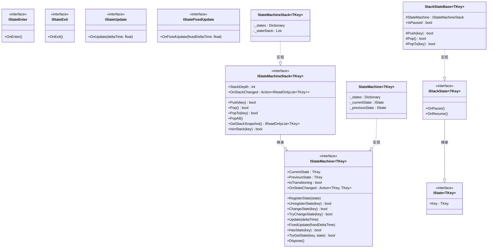
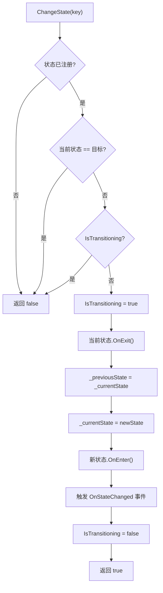
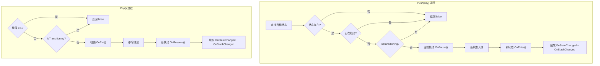

CFramework 的状态机系统提供两种互补的有限状态机实现——**标准状态机** `StateMachine<TKey>` 与**栈状态机** `StateMachineStack<TKey>`。标准状态机采用经典的"替换式"状态切换模型，适用于角色行为控制、AI 状态管理等平铺式场景；栈状态机在此基础上引入 **Push/Pop** 语义，允许状态被暂停而非销毁，完美匹配游戏中的菜单导航、弹窗叠加等层次化交互。两者共享统一的生命周期接口体系，通过接口组合（Interface Composition）让开发者按需选择关心的回调，而非被迫实现不需要的方法。

## 接口体系：组合式生命周期设计

状态机的核心设计原则是**接口隔离**（Interface Segregation）。框架没有将所有回调塞进一个臃肿的基类，而是将每个生命周期阶段拆分为独立接口，状态类只需实现自己关心的那几个。

| 接口 | 方法 | 用途 |
|------|------|------|
| `IState<TKey>` | `Key` (属性) | 状态身份标识，泛型键类型 |
| `IStateEnter` | `OnEnter()` | 进入状态时触发 |
| `IStateExit` | `OnExit()` | 退出状态时触发 |
| `IStateUpdate` | `OnUpdate(float deltaTime)` | 每帧更新 |
| `IStateFixedUpdate` | `OnFixedUpdate(float fixedDeltaTime)` | 物理固定帧更新 |
| `IStackState<TKey>` | `OnPause()` / `OnResume()` | 栈操作时的暂停/恢复（继承 `IState<TKey>`） |

这种设计意味着一个"静止"状态可能只实现 `IStateEnter` 和 `IStateExit`，而一个"巡逻"状态则额外实现 `IStateUpdate` 来驱动移动逻辑——运行时通过 `is` 模式匹配动态分派，未实现的接口不会产生任何虚调用开销。

Sources: [IState.cs](Runtime/State/FSM/IState.cs#L1-L14), [IStateEnter.cs](Runtime/State/FSM/IStateEnter.cs#L1-L10), [IStateExit.cs](Runtime/State/FSM/IStateExit.cs#L1-L10), [IStateUpdate.cs](Runtime/State/FSM/IStateUpdate.cs#L1-L11), [IStateFixedUpdate.cs](Runtime/State/FSM/IStateFixedUpdate.cs#L1-L11), [IStackState.cs](Runtime/State/FSM/IStackState.cs#L1-L19)

## 接口关系与类继承图

下面的 Mermaid 图展示了完整的状态机类型体系。先理解两个核心继承链：**标准状态机** 以 `IStateMachine<TKey>` 为契约，**栈状态机** 通过 `IStateMachineStack<TKey>` 扩展该契约，新增栈操作方法。状态侧的继承链则从 `IState<TKey>` 出发，`IStackState<TKey>` 在其基础上增加了 `OnPause`/`OnResume` 两个栈特有的生命周期回调。



Sources: [IStateMachine.cs](Runtime/State/FSM/IStateMachine.cs#L1-L83), [IStateMachineStack.cs](Runtime/State/FSM/IStateMachineStack.cs#L1-L58), [StateMachine.cs](Runtime/State/FSM/StateMachine.cs#L1-L197), [StateMachineStack.cs](Runtime/State/FSM/StateMachineStack.cs#L1-L412), [StackStateBase.cs](Runtime/State/FSM/StackStateBase.cs#L1-L112)

## 标准状态机：StateMachine\<TKey\>

标准状态机是最直接的有限状态机实现，维护一个 `Dictionary<TKey, IState<TKey>>` 存储所有已注册状态，以及 `_currentState` 和 `_previousState` 两个引用追踪状态变迁。它的核心行为是 `ChangeState`——退出当前状态，进入新状态，始终只保持一个活跃状态。

### ChangeState 切换流程

`ChangeState` 是标准状态机最核心的方法，其执行流程包含三重防护和一个 try/finally 安全网：



**重入保护**通过 `IsTransitioning` 标志实现——如果 `OnExit` 或 `OnEnter` 回调中代码试图再次调用 `ChangeState`，第二次调用会被静默拒绝（返回 `false`），避免状态栈错乱。而 `TryChangeState` 是 `ChangeState` 的安全封装版本，用 try/catch 包裹并将异常转为 `Debug.LogWarning`，适合在不确定目标状态是否存在时使用。

Sources: [StateMachine.cs](Runtime/State/FSM/StateMachine.cs#L78-L133)

### 注册与注销机制

注册时通过 `RegisterState` 将状态实例存入字典，**键重复会抛出 `ArgumentException`**。如果状态实现了 `IStateMachineHolder<TKey>` 接口，状态机还会将自身引用注入该状态，使状态内部可以直接访问所属状态机（用于状态内部发起切换）。注销则通过 `UnregisterState` 进行，但**当前活跃状态不允许注销**——这是一个安全约束，防止状态在执行过程中被移除。

Sources: [StateMachine.cs](Runtime/State/FSM/StateMachine.cs#L42-L71)

### 标准状态使用示例

以下代码演示了角色移动状态机的典型用法。`IdleState` 仅实现进入/退出回调，而 `RunState` 额外实现 `IStateUpdate` 来驱动每帧移动逻辑。状态内部通过 `IStateMachineHolder<string>` 持有状态机引用，从而可以在条件满足时主动发起切换。

```csharp
// 定义状态键（推荐使用 enum）
public enum PlayerState { Idle, Run, Jump }

// 定义状态
public class IdleState : IState<PlayerState>, IStateEnter, IStateExit, IStateMachineHolder<PlayerState>
{
    public PlayerState Key => PlayerState.Idle;
    public IStateMachine<PlayerState> StateMachine { get; protected internal set; }

    public void OnEnter()
    {
        Debug.Log("进入待机状态");
    }

    public void OnExit()
    {
        Debug.Log("离开待机状态");
    }
}

public class RunState : IState<PlayerState>, IStateEnter, IStateUpdate, IStateMachineHolder<PlayerState>
{
    public PlayerState Key => PlayerState.Run;
    public IStateMachine<PlayerState> StateMachine { get; protected internal set; }

    public void OnEnter()
    {
        Debug.Log("开始奔跑");
    }

    public void OnUpdate(float deltaTime)
    {
        // 每帧移动逻辑...
        // 条件满足时主动切换
        if (!Input.GetKey(KeyCode.W))
            StateMachine.ChangeState(PlayerState.Idle);
    }
}

// 组装状态机
var fsm = new StateMachine<PlayerState>();
fsm.RegisterState(new IdleState());
fsm.RegisterState(new RunState());
fsm.ChangeState(PlayerState.Idle);

// 在 MonoBehaviour 中驱动更新
void Update() => fsm.Update(Time.deltaTime);
void FixedUpdate() => fsm.FixedUpdate(Time.fixedDeltaTime);

// 清理
void OnDestroy() => fsm.Dispose();
```

Sources: [IStateMachineHolder.cs](Runtime/State/FSM/IStateMachineHolder.cs#L1-L7), [StateMachine.cs](Runtime/State/FSM/StateMachine.cs#L139-L153)

## 栈状态机：StateMachineStack\<TKey\>

栈状态机在标准状态机的基础上引入了一个 `List<IStackState<TKey>>` 作为状态栈。它的核心差异在于：**Push 操作不会销毁当前状态，而是将其暂停并压入新状态；Pop 操作则退出栈顶状态并恢复其下方的状态**。这使得它天然适合需要"返回"语义的交互场景。

### ChangeState vs Push：两种切换语义

栈状态机同时提供了 `ChangeState` 和 `Push` 两种状态切换方式，它们的行为截然不同：

| 操作 | 栈深度变化 | 旧状态行为 | 新状态行为 | 典型场景 |
|------|-----------|-----------|-----------|---------|
| `ChangeState(key)` | 不变（替换栈顶） | `OnExit()` 退出 | `OnEnter()` 进入 | 同层级切换（如 Tab 页） |
| `Push(key)` | +1 | `OnPause()` 暂停 | `OnEnter()` 进入 | 进入子页面（如打开设置） |
| `Pop()` | -1 | `OnExit()` 退出 | 下方状态 `OnResume()` | 返回上一层 |
| `PopTo(key)` | 减少到目标索引 | 上方全部 `OnExit()` | 目标 `OnResume()` | 跳回指定层级 |
| `PopAll()` | 回到 1 | 上方全部 `OnExit()` | 栈底 `OnResume()` | 一键回到根 |

Sources: [StateMachineStack.cs](Runtime/State/FSM/StateMachineStack.cs#L85-L318)

### Push/Pop 完整流程



**关键安全约束**：`Pop` 在栈中只剩一个状态时会返回 `false`，保证栈永远不为空——这避免了"无状态可用"的边界情况。同样，栈中的状态不允许被 `UnregisterState`，只有不在栈中的已注册状态才能被安全移除。

Sources: [StateMachineStack.cs](Runtime/State/FSM/StateMachineStack.cs#L150-L223)

### Update 语义：仅栈顶获得更新

栈状态机的 `Update` 和 `FixedUpdate` 方法**只回调栈顶状态**。被暂停的中间层状态不会收到任何更新调用。这意味着如果栈结构为 `[Idle, Menu, Settings]`，在 `Settings` 活跃期间只有 `Settings` 的 `OnUpdate` 会被调用，`Idle` 和 `Menu` 的 `OnUpdate` 不会被触发——它们已经通过 `OnPause` 被告知暂停。

Sources: [StateMachineStack.cs](Runtime/State/FSM/StateMachineStack.cs#L324-L342)

### StackStateBase：栈状态便捷基类

框架提供了 `StackStateBase<TKey>` 抽象基类，它同时实现了 `IStackState<TKey>`、`IStateEnter`、`IStateExit`、`IStateUpdate`、`IStateFixedUpdate` 的所有方法（均为 `virtual`，返回空实现），并内置了三个受保护的便捷方法 `Push(key)`、`Pop()`、`PopTo(key)`，使状态内部可以直接发起栈操作而无需手动持有状态机引用。基类还维护了 `IsPaused` 布尔属性和 `StateMachine` 引用，在 `OnPause`/`OnResume` 的默认实现中自动切换暂停标志。

Sources: [StackStateBase.cs](Runtime/State/FSM/StackStateBase.cs#L1-L112)

### 栈状态使用示例

以下代码模拟了一个典型的游戏菜单导航场景——从游戏主界面出发，逐层打开菜单、设置、音频设置，然后通过 Pop 逐层返回，或通过 PopAll 一键回到游戏。

```csharp
public enum GameState { Game, Menu, Settings, AudioSettings }

// 使用 StackStateBase 作为基类，省去样板代码
public class GameState_Running : StackStateBase<GameState>
{
    public GameState_Running() : base(GameState.Game) { }

    public override void OnEnter()
    {
        Debug.Log("游戏运行中");
    }

    public override void OnUpdate(float deltaTime)
    {
        if (Input.GetKeyDown(KeyCode.Escape))
            Push(GameState.Menu); // 使用基类的便捷方法
    }
}

public class GameState_Menu : StackStateBase<GameState>
{
    public GameState_Menu() : base(GameState.Menu) { }

    public override void OnEnter()  => Debug.Log("打开菜单");
    public override void OnExit()   => Debug.Log("关闭菜单");
    public override void OnPause()  { base.OnPause(); Debug.Log("菜单被覆盖"); }
    public override void OnResume() { base.OnResume(); Debug.Log("菜单恢复"); }

    public override void OnUpdate(float deltaTime)
    {
        if (Input.GetKeyDown(KeyCode.S))
            Push(GameState.Settings);
        if (Input.GetKeyDown(KeyCode.Escape))
            Pop(); // 关闭菜单，回到游戏
    }
}

public class GameState_Settings : StackStateBase<GameState>
{
    public GameState_Settings() : base(GameState.Settings) { }

    public override void OnEnter() => Debug.Log("打开设置");
    public override void OnUpdate(float deltaTime)
    {
        if (Input.GetKeyDown(KeyCode.A))
            Push(GameState.AudioSettings);
        if (Input.GetKeyDown(KeyCode.Escape))
            Pop(); // 返回菜单
    }
}

public class GameState_AudioSettings : StackStateBase<GameState>
{
    public GameState_AudioSettings() : base(GameState.AudioSettings) { }

    public override void OnEnter() => Debug.Log("打开音频设置");
    public override void OnUpdate(float deltaTime)
    {
        if (Input.GetKeyDown(KeyCode.Escape))
            Pop(); // 返回设置页
    }
}

// 组装栈状态机
var stackFsm = new StateMachineStack<GameState>();
stackFsm.RegisterState(new GameState_Running());
stackFsm.RegisterState(new GameState_Menu());
stackFsm.RegisterState(new GameState_Settings());
stackFsm.RegisterState(new GameState_AudioSettings());

// ChangeState 设定栈底
stackFsm.ChangeState(GameState.Game);

// 之后的导航流程示例：
// stackFsm.Push(GameState.Menu);     → 栈: [Game, Menu]
// stackFsm.Push(GameState.Settings); → 栈: [Game, Menu, Settings]
// stackFsm.Push(GameState.AudioSettings); → 栈: [Game, Menu, Settings, AudioSettings]
// stackFsm.Pop();                    → 栈: [Game, Menu, Settings]
// stackFsm.PopTo(GameState.Menu);    → 栈: [Game, Menu]
// stackFsm.PopAll();                 → 栈: [Game]
```

Sources: [StackStateBase.cs](Runtime/State/FSM/StackStateBase.cs#L83-L111), [StateMachineStack.cs](Runtime/State/FSM/StateMachineStack.cs#L42-L65)

## 两种状态机的选择与对比

在决定使用哪种状态机时，核心判断标准是状态之间是否存在**层次化的"进入-返回"关系**。

| 维度 | StateMachine\<TKey\> | StateMachineStack\<TKey\> |
|------|---------------------|--------------------------|
| 状态模型 | 平铺式，任意状态间切换 | 层次式，状态可暂停和恢复 |
| 状态接口要求 | `IState<TKey>` | `IStackState<TKey>`（必须） |
| 切换方式 | 仅 `ChangeState` | `ChangeState` + `Push`/`Pop`/`PopTo`/`PopAll` |
| 旧状态处理 | 直接退出（`OnExit`） | Push 时暂停（`OnPause`），Pop 时恢复（`OnResume`） |
| 典型场景 | 角色行为、AI 状态、战斗状态 | 菜单导航、弹窗叠加、向导流程 |
| 栈深度 | 始终 0 或 1 | 可任意增长，通过 `StackDepth` 查询 |
| 事件系统 | `OnStateChanged` | `OnStateChanged` + `OnStackChanged` |
| 生命周期 | `IDisposable` | `IDisposable`（从栈顶到栈底逐个退出） |

**什么时候用标准状态机**：敌人 AI（巡逻 → 追击 → 攻击 → 死亡），角色移动（待机 → 跑步 → 跳跃 → 下蹲），武器切换等——这些状态之间是"互斥"关系，切换意味着完全离开旧状态。

**什么时候用栈状态机**：游戏主菜单 → 设置 → 音频设置（需要逐级返回），游戏界面 → 暂停 → 背包 → 物品详情（需要一键回到游戏），对话系统 → 选项 → 子对话（需要回溯到分支点）——这些状态之间存在"覆盖与恢复"关系。

Sources: [IStateMachine.cs](Runtime/State/FSM/IStateMachine.cs#L1-L83), [IStateMachineStack.cs](Runtime/State/FSM/IStateMachineStack.cs#L1-L58)

## 事件系统与状态监听

两种状态机都提供 `OnStateChanged` 事件，签名为 `Action<TKey, TKey>`（参数依次为 fromState, toState）。栈状态机额外提供 `OnStackChanged` 事件，签名为 `Action<IReadOnlyList<TKey>>`，在每次栈结构变化时传入当前栈的完整快照。通过 `GetStackSnapshot()` 也可以随时手动获取栈快照，`IsInStack(key)` 则用于查询特定状态是否在栈中。

```csharp
// 监听状态变化
fsm.OnStateChanged += (from, to) =>
{
    Debug.Log($"状态切换: {from} → {to}");
};

// 栈状态机：监听栈结构变化
stackFsm.OnStackChanged += snapshot =>
{
    Debug.Log($"当前栈: [{string.Join(" → ", snapshot)}]");
};
```

Sources: [IStateMachine.cs](Runtime/State/FSM/IStateMachine.cs#L28-L29), [IStateMachineStack.cs](Runtime/State/FSM/IStateMachineStack.cs#L18-L20), [IStateMachineStack.cs](Runtime/State/FSM/IStateMachineStack.cs#L49-L56)

## 资源释放与 Dispose 模式

两种状态机都实现了 `IDisposable` 接口。调用 `Dispose` 时：

- **标准状态机**：对当前活跃状态调用 `OnExit`，清理所有 `IStateMachineHolder` 引用，清空状态字典。
- **栈状态机**：从栈顶到栈底逐个调用 `OnExit`，清理所有 `StackStateBase` 的状态机引用，清空字典和栈。

两种实现都具备**幂等性**——重复调用 `Dispose` 不会抛出异常，也不会重复执行清理逻辑（通过 `_isDisposed` 标志保护）。

```csharp
// 在 MonoBehaviour 中正确清理
void OnDestroy()
{
    fsm?.Dispose();
    stackFsm?.Dispose();
}
```

Sources: [StateMachine.cs](Runtime/State/FSM/StateMachine.cs#L178-L196), [StateMachineStack.cs](Runtime/State/FSM/StateMachineStack.cs#L393-L412)

## 设计模式总结

CFramework 的状态机系统综合运用了多种经典设计模式。**接口隔离原则**将生命周期拆分为 5 个独立接口（Enter/Exit/Update/FixedUpdate/Stack），状态类按需组合。**模板方法模式**体现在 `StackStateBase` 中——它提供了所有回调的默认空实现，子类只需 override 关心的方法。**观察者模式**通过 `OnStateChanged` 和 `OnStackChanged` 事件实现状态变更的外部通知。**防护模式**（Guard Pattern）的 `IsTransitioning` 标志防止了回调中重入导致的栈错乱。而泛型键类型 `TKey` 使得状态标识既可以是 `string`（快速原型）、`enum`（类型安全的生产代码），也可以是自定义类型（如 `int` ID 映射），为不同复杂度的项目提供了灵活性。

Sources: [IState.cs](Runtime/State/FSM/IState.cs#L1-L14), [IStackState.cs](Runtime/State/FSM/IStackState.cs#L1-L19), [StackStateBase.cs](Runtime/State/FSM/StackStateBase.cs#L1-L112)

---

**下一步阅读**：如果你需要将状态机与 UI 面板系统结合使用（例如用栈状态机管理 UI 页面导航），推荐阅读 [UI 面板系统：IUI 生命周期、UIBinder 组件注入与导航栈管理](12-ui-mian-ban-xi-tong-iui-sheng-ming-zhou-qi-uibinder-zu-jian-zhu-ru-yu-dao-hang-zhan-guan-li)。如果想了解框架的测试策略和如何为自定义状态编写单元测试，请参考 [单元测试指南：测试覆盖策略与 Mock 替换模式](22-dan-yuan-ce-shi-zhi-nan-ce-shi-fu-gai-ce-lue-yu-mock-ti-huan-mo-shi)。