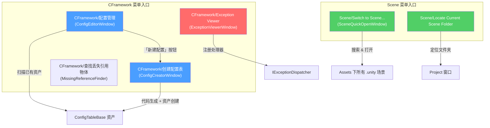
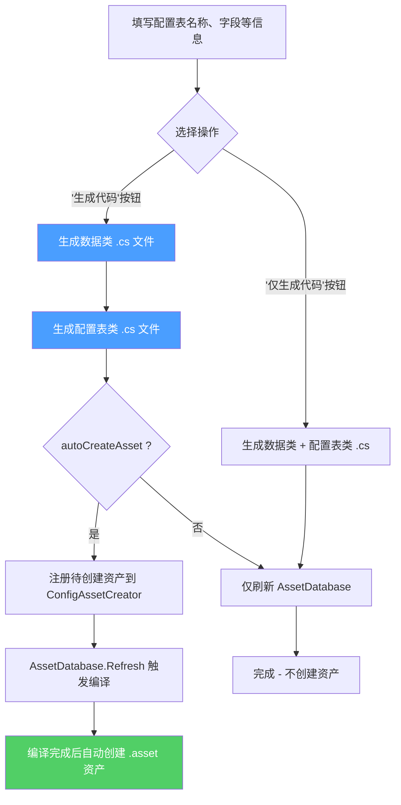

CFramework 提供了一套编辑器工具链，覆盖**配置表创建与管理**、**运行时异常可视化**以及**场景快速切换**三大日常开发高频场景。这些工具以 Unity 菜单项 `CFramework/` 和 `Scene/` 为入口，集成 Odin Inspector 的高级 UI 能力，帮助你在不离开编辑器的前提下完成从代码生成到运行调试的全流程操作。本文将逐一介绍每个窗口的功能定位、打开方式和核心操作流程。

## 编辑器工具总览

以下是 CFramework 编辑器窗口在开发工作流中的定位与入口关系：



各窗口的菜单路径与核心用途对比如下：

| 窗口 | 菜单入口 | 基类 | 核心用途 |
|------|---------|------|---------|
| **ConfigEditorWindow** | `CFramework/配置管理` | `OdinEditorWindow` | 浏览所有 ConfigTable 资产，统一编辑入口 |
| **ConfigCreatorWindow** | `CFramework/创建配置表` | `OdinEditorWindow` | 通过可视化界面一键生成配置表类 + 数据类 + 资产 |
| **ExceptionViewerWindow** | `CFramework/Exception Viewer` | `EditorWindow` | 运行时实时展示框架捕获的全局异常 |
| **SceneQuickOpenWindow** | `Scene/Switch to Scene...` | `EditorWindow` | 搜索并快速打开项目中的任意场景 |

Sources: [ConfigEditorWindow.cs](Editor/Windows/Config/ConfigEditorWindow.cs#L14-L24), [ConfigCreatorWindow.cs](Editor/Windows/Config/ConfigCreatorWindow.cs#L16-L27), [ExceptionViewerWindow.cs](Editor/Windows/Tools/ExceptionViewerWindow.cs#L11-L58), [SceneQuickOpenMenu.cs](Editor/Windows/Tools/SceneQuickOpenMenu.cs#L15-L50)

## 配置管理窗口（ConfigEditorWindow）

**配置管理窗口** 是所有配置表的统一浏览与编辑入口。它自动扫描项目中所有继承自 `ConfigTableBase` 的 ScriptableObject 资产，以**左右分栏**的布局呈现：左侧为配置表列表，右侧为选中配置的 Inspector 编辑区域。

**打开方式**：菜单栏 `CFramework → 配置管理`。

窗口启动时会自动调用 `RefreshConfigList()`，通过 `AssetDatabase.FindAssets("t:ScriptableObject")` 遍历所有 ScriptableObject 资产，筛选出 `ConfigTableBase` 的子类实例，构建 `ConfigInfo` 列表。每个条目记录了配置表的名称、类型、数据条数和资产路径。工具栏上方提供「刷新」按钮用于重新扫描，以及「新建配置」按钮一键跳转至 `ConfigCreatorWindow` 创建新的配置表。

当你从左侧列表选中一个配置表时，窗口会为该资产创建 Odin `PropertyTree` 以实现完整的 Inspector 编辑体验，右侧标题栏动态显示 `配置详情 - {名称} ({条数} 条记录)`。若项目中尚未创建任何配置表，窗口将展示居中引导提示文字。

Sources: [ConfigEditorWindow.cs](Editor/Windows/Config/ConfigEditorWindow.cs#L14-L257)

## 配置创建器（ConfigCreatorWindow）

**配置创建器** 是 CFramework 配置表开发工作流的核心工具。它通过一个可视化表单，让你在不手写任何代码的前提下，一键生成符合框架规范的**数据类**（实现 `IConfigItem<TKey>`）、**配置表类**（继承 `ConfigTable<TKey, TValue>`）以及对应的 **ScriptableObject 资产文件**。

**打开方式**：菜单栏 `CFramework → 创建配置表`，或在配置管理窗口中点击「新建配置」按钮。

### 表单配置项说明

配置创建器的表单分为五个逻辑分区：

| 分区 | 字段 | 说明 | 默认值 |
|------|------|------|--------|
| **基础配置** | 配置表名称 | 生成的配置表类名（如 `ItemConfig`） | `NewConfig` |
| **配置表设置** | 命名空间 / 输出目录 | 配置表类的命名空间和存放路径 | `Game.Configs` / `Assets/Scripts/Config` |
| **数据类设置** | 命名空间 / 输出目录 | 数据类的命名空间和存放路径 | `Game.Configs` / `Assets/Scripts/Config` |
| **类型配置** | 键类型 / 值类型名称 / 字段列表 | 主键类型（int/string/long 等）、数据类名、字段定义 | `int` / 自动推导 |
| **资源设置** | 资产输出目录 / 打开脚本 / 自动创建资产 | 资产存放路径及生成后行为控制 | `Assets/EditorRes/Configs` |

Sources: [ConfigCreatorWindow.cs](Editor/Windows/Config/ConfigCreatorWindow.cs#L30-L72)

### 智能命名联动与偏好持久化

配置创建器内置两项便捷机制。**命名联动**——当你修改"配置表名称"时，如果名称以 `Config` 结尾（如 `ItemConfig`），系统会自动推导"值类型名称"为 `ItemData`。**偏好持久化**——所有路径和命名空间设置通过 `EditorPrefs` 自动保存，关闭窗口后重新打开时恢复上次的配置。

Sources: [ConfigCreatorWindow.cs](Editor/Windows/Config/ConfigCreatorWindow.cs#L76-L119), [ConfigCreatorWindow.cs](Editor/Windows/Config/ConfigCreatorWindow.cs#L498-L516)

### 字段定义与类型支持

在"类型配置"分区中，你可以为数据类定义任意数量的字段。每个字段包含四个属性：**字段名**、**类型**、**是否主键**和**描述**（用于注释）。系统支持以下字段类型：

| 类别 | 支持的类型 |
|------|-----------|
| 数值 | `int`, `float`, `long`, `double`, `byte`, `short`, `uint`, `ulong`, `ushort` |
| 文本/布尔 | `string`, `bool` |
| 向量/颜色 | `Vector2`, `Vector3`, `Vector4`, `Color` |
| Unity 资源 | `GameObject`, `Transform`, `Sprite`, `Texture`, `AudioClip` |

Sources: [ConfigCreatorWindow.cs](Editor/Windows/Config/ConfigCreatorWindow.cs#L155-L188)

### 代码生成流程



窗口底部提供两个操作按钮：

- **生成代码**（蓝色）：生成 `.cs` 文件，且当"自动创建资产"开启时，通过 `ConfigAssetCreator` 在编译完成后自动创建对应的 `.asset` 文件。该机制利用 `[DidReloadScripts]` 回调检测编译完成事件，确保类型已加载后再执行 `ScriptableObject.CreateInstance`。
- **仅生成代码**（绿色）：只生成 `.cs` 源文件并刷新资产数据库，不创建 `.asset` 资产，适合需要先手动调整代码再创建资产的场景。

生成前，你可以展开底部的**代码预览**折叠面板，实时查看即将生成的配置表类和数据类的完整代码，确认无误后再点击生成。

Sources: [ConfigCreatorWindow.cs](Editor/Windows/Config/ConfigCreatorWindow.cs#L214-L333), [ConfigCreatorWindow.cs](Editor/Windows/Config/ConfigCreatorWindow.cs#L432-L485), [ConfigAssetCreator.cs](Editor/Utilities/ConfigAssetCreator.cs#L14-L167)

### 生成代码示例

假设配置表名称为 `ItemConfig`，键类型为 `int`，值类型为 `ItemData`，包含 `id`（主键）、`name`、`description` 三个字段。生成的数据类大致如下：

```csharp
// ItemData.cs
using System;
using CFramework;
using UnityEngine;

namespace Game.Configs
{
    [Serializable]
    public sealed class ItemData : IConfigItem<int>
    {
        public int id = 0;
        public string name = "";
        public string description = "";

        public int Key => id;

        public ItemData Clone()
        {
            return new ItemData
            {
                id = id,
                name = name,
                description = description
            };
        }
    }
}
```

生成的配置表类则非常精简，因为核心逻辑已由 `ConfigTable<TKey, TValue>` 基类提供：

```csharp
// ItemConfig.cs
using CFramework;
using UnityEngine;

namespace Game.Configs
{
    [CreateAssetMenu(fileName = "ItemConfig", menuName = "Game/Config/ItemConfig")]
    public sealed class ItemConfig : ConfigTable<int, ItemData>
    {
        // 数据在 Inspector 中配置
    }
}
```

Sources: [ConfigCreatorWindow.cs](Editor/Windows/Config/ConfigCreatorWindow.cs#L335-L467)

## 异常查看器（ExceptionViewerWindow）

**异常查看器** 是 CFramework 运行时异常体系的编辑器可视化终端。它在 Play Mode 下自动连接框架的 `IExceptionDispatcher`，将 UniTask 异步流和 R3 Observable 中未处理的异常实时呈现在一个可滚动的列表中，让你无需在 Console 窗口的噪声日志中翻找关键错误。

**打开方式**：菜单栏 `CFramework → Exception Viewer`。

### 工作原理

窗口在 `OnEnable` 时检查是否处于 Play Mode，若是，则从 `GameScope.Instance` 的 DI 容器中解析 `IExceptionDispatcher` 服务，并通过 `RegisterHandler` 注册一个回调。每当 `DefaultExceptionDispatcher` 分发异常时（通过内部 R3 Subject 推送），回调会将异常信息封装为 `ExceptionInfo` 结构体（含时间戳、消息、堆栈跟踪），添加到列表并触发 `Repaint()` 刷新界面。

列表以**逆序**（最新的异常在最上方）绘制每个异常条目，展示格式为 `[HH:mm:ss] 异常消息`。点击 "Copy Stack Trace" 链接可将完整堆栈跟踪复制到系统剪贴板，方便粘贴到问题追踪系统中。工具栏提供 "Clear" 按钮清空所有记录，右侧实时显示当前异常总数。

> ⚠️ 异常查看器需要在 **Play Mode** 下打开才能连接到 `IExceptionDispatcher`。在 Edit Mode 下打开窗口不会注册处理器，列表将保持为空。

Sources: [ExceptionViewerWindow.cs](Editor/Windows/Tools/ExceptionViewerWindow.cs#L1-L92), [IExceptionDispatcher.cs](Runtime/Core/Exception/IExceptionDispatcher.cs#L1-L24), [DefaultExceptionDispatcher.cs](Runtime/Core/Exception/DefaultExceptionDispatcher.cs#L1-L44)

## 场景快捷打开（SceneQuickOpenMenu）

**场景快捷打开** 由两个功能组成：一个**场景切换弹窗**（`SceneQuickOpenWindow`），以及一个**定位当前场景文件夹**的快捷操作。它们以 Unity 顶部菜单栏的 `Scene/` 菜单为入口，帮助你在多场景项目中快速定位和切换。

### 打开方式

| 功能 | 菜单入口 |
|------|---------|
| 场景切换弹窗 | `Scene → Switch to Scene...` |
| 定位当前场景文件夹 | `Scene → Locate Current Scene Folder` |

### 场景切换弹窗（SceneQuickOpenWindow）

这是一个轻量级的搜索式场景切换器，设计灵感来源于 VS Code 的文件搜索（Ctrl+P）。打开后自动聚焦搜索框，支持以下操作：

**搜索过滤**：输入关键词后，系统会对所有 `Assets` 目录下的 `.unity` 场景文件按**场景名称**和**完整路径**进行模糊匹配，实时过滤列表。

**键盘快捷操作**：
- **Enter**：直接打开第一个匹配的场景（无需鼠标点击）
- **Escape**：关闭窗口

**场景列表渲染**：每个场景条目由三部分组成——左侧场景图标（当前活动场景使用高亮图标 + `●` 前缀标记）、中间场景名称、右侧相对路径（去除 `Assets/` 前缀）。当前活动场景以绿色背景高亮，鼠标悬停条目以蓝色半透明背景提示。窗口底部状态栏显示匹配场景数量和操作提示。

**未保存保护**：切换场景前，如果当前场景有未保存的修改（`isDirty`），系统会弹出对话框提供三个选项：保存并打开、不保存直接打开、取消操作。

Sources: [SceneQuickOpenMenu.cs](Editor/Windows/Tools/SceneQuickOpenMenu.cs#L46-L81), [SceneQuickOpenMenu.cs](Editor/Windows/Tools/SceneQuickOpenMenu.cs#L100-L349)

### 定位当前场景文件夹

该功能获取当前活动场景的路径，提取其所在目录，通过 `Selection.activeObject` 和 `EditorGUIUtility.PingObject` 在 Project 窗口中高亮定位该文件夹，适合在复杂项目结构中快速找到场景关联的资源目录。若当前场景未保存，会在 Console 输出警告。

Sources: [SceneQuickOpenMenu.cs](Editor/Windows/Tools/SceneQuickOpenMenu.cs#L22-L41)

## 其他编辑器工具

除上述核心窗口外，CFramework 还在 `CFramework/` 菜单下提供了以下辅助工具：

- **查找丢失引用物体**（`MissingReferenceFinder`）：扫描项目中所有场景和预制体，检测 Missing Script 组件和丢失的字段引用，按类型分组展示结果并提供"选中"按钮快速定位问题对象。菜单入口为 `CFramework → 查找丢失引用物体`。

Sources: [MissingReferenceFinder.cs](Editor/Windows/Tools/MissingReferenceFinder.cs#L11-L27)

## 默认路径约定

配置创建器中的输出目录默认值由 `EditorPaths` 静态类统一管理。以下是关键的路径常量：

| 常量名 | 路径 | 用途 |
|--------|------|------|
| `ConfigScripts` | `Assets/Scripts/Config` | 配置表类和数据类代码输出目录 |
| `EditorConfigs` | `Assets/EditorRes/Configs` | 编辑器配置资产（.asset）存放目录 |
| `GeneratedRoot` | `Assets/Scripts/Generated` | 代码生成根目录（Addressable 常量等） |

Sources: [EditorPaths.cs](Editor/EditorPaths.cs#L42-L86)

## 下一步阅读

- 了解配置表的运行时架构：[配置表系统：ScriptableObject 数据源、泛型 ConfigTable 与热重载](16-pei-zhi-biao-xi-tong-scriptableobject-shu-ju-yuan-fan-xing-configtable-yu-re-zhong-zai)
- 了解异常查看器背后的分发机制：[全局异常分发器：统一捕获 UniTask 与 R3 未处理异常](7-quan-ju-yi-chang-fen-fa-qi-tong-bu-huo-unitask-yu-r3-wei-chu-li-yi-chang)
- 了解 ConfigTable 的 Inspector 编辑体验：[ConfigTable 自定义 Inspector 与配置资产编辑器](21-configtable-zi-ding-yi-inspector-yu-pei-zhi-zi-chan-bian-ji-qi)
- 了解 Addressable 相关的代码生成工具：[Addressable 常量代码生成器与资源后处理器](20-addressable-chang-liang-dai-ma-sheng-cheng-qi-yu-zi-yuan-hou-chu-li-qi)