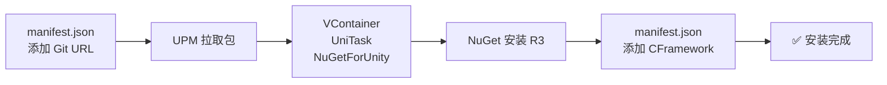
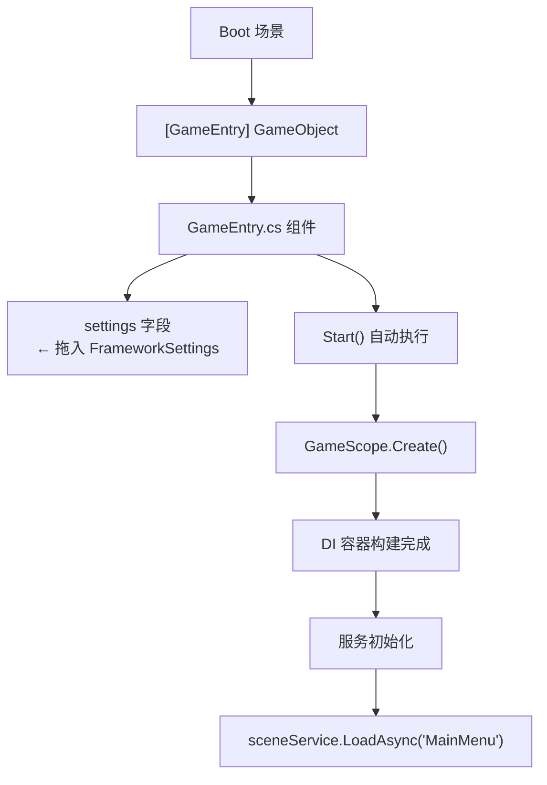
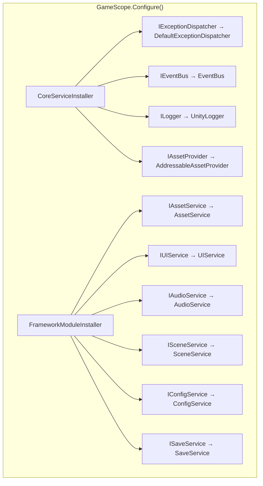

本页是一份面向初学者的 **手把手教程**，目标是从零开始，在 15 分钟内完成 CFramework 的安装、全局配置创建、游戏入口编写，并成功加载你的第一个游戏场景。读完本页后，你将理解框架的 **最小启动链路**——即从一条 Git 依赖到屏幕上出现场景画面的完整过程。

---

## 前置条件

在安装 CFramework 之前，请确认你的开发环境满足以下最低要求：

| 依赖项 | 最低版本 | 说明 |
|--------|---------|------|
| Unity | 2021.3+ | 框架使用 `UNetWeaver` 兼容的程序集定义 |
| VContainer | 1.17.0+ | 依赖注入容器，框架的服务注册基础设施 |
| UniTask | 2.5.0+ | 零 GC 异步框架，所有服务接口均基于 `UniTask` |
| R3 | 1.3.0+ | 响应式扩展，事件总线与 UI 绑定的核心依赖 |
| Odin Inspector | 3.0+ | 编辑器增强（非 Git 分发，需自行购买安装） |
| Addressables | 1.21+ | 资源管理底层实现 |

> **注意**：Odin Inspector 是商业插件，需通过 Unity Asset Store 单独安装。其余依赖均可通过 Git URL 或 NuGetForUnity 免费获取。

Sources: [package.json](package.json#L1-L30), [README.md](README.md#L22-L29)

---

## 第一步：安装依赖包

CFramework 采用 **Unity Package Manager (UPM)** 分发。安装分为三个阶段：先装基础依赖，再装 R3，最后装框架本体。

### 1.1 添加基础依赖

打开你 Unity 项目中的 `Packages/manifest.json` 文件，在 `dependencies` 节点中添加以下三条记录：

```json
{
  "dependencies": {
    "jp.hadashikick.vcontainer": "https://github.com/hadashiA/VContainer.git?path=VContainer/Assets/VContainer",
    "cysharp.unitask": "https://github.com/Cysharp/UniTask.git?path=src/UniTask",
    "com.glitchenzo.nugetforunity": "https://github.com/GlitchEnzo/NuGetForUnity.git?path=/src/NuGetForUnity"
  }
}
```

保存后返回 Unity，编辑器会自动拉取这些包。等待编译完成（右下角进度条消失）。

### 1.2 通过 NuGetForUnity 安装 R3

在 Unity 菜单栏中点击 `NuGet → Manage NuGet Packages`，搜索 **R3** 并安装。R3 是 UniTask 之外另一个核心异步响应式库，框架的事件总线与 UI 数据绑定均依赖它。

### 1.3 安装 CFramework

同样在 `Packages/manifest.json` 的 `dependencies` 中追加：

```json
{
  "dependencies": {
    "com.cnoom.cframework": "https://github.com/cnoom/C-Framework.git"
  }
}
```

保存后等待 Unity 编译完成。安装成功后，你可以在 `Packages/CFramework` 下看到完整的框架目录结构。



Sources: [README.md](README.md#L31-L53)

---

## 第二步：创建 FrameworkSettings 全局配置

FrameworkSettings 是一个 **ScriptableObject** 资产，集中管理框架所有模块的运行时参数——内存预算、UI 栈容量、音频默认音量、存档加密密钥等。框架启动时必须读取此配置。

### 2.1 通过菜单创建

在 Unity 菜单栏中点击：

```
CFramework → CreateSettings
```

弹出文件保存对话框后，选择项目中的 `Assets/Resources/` 目录（如果没有就新建一个），以默认文件名 `FrameworkSettings` 保存。

> **为什么放在 Resources 目录？** 框架内置了 `LoadDefault()` 方法，会从 `Resources/FrameworkSettings` 路径自动加载。当你在代码中调用 `GameScope.Create()` 且不传入 settings 参数时，就会使用这个默认位置。

### 2.2 核心配置项一览

创建完成后选中该资产，Inspector 中会显示以下配置分组：

| 分组 | 配置项 | 默认值 | 说明 |
|------|--------|--------|------|
| **Asset** | MemoryBudgetMB | 512 | 资源内存预算（MB），超出时自动释放低优先级资源 |
| **Asset** | MaxLoadPerFrame | 5 | 每帧最大加载数量，用于分帧预加载 |
| **UI** | MaxNavigationStack | 10 | UI 导航栈最大容量 |
| **UI** | UIRootAddress | "UIRoot" | UIRoot 预制体的 Addressable Key |
| **Audio** | DefaultBGMVolume | 0.8 | BGM 默认音量 |
| **Audio** | DefaultSFXVolume | 1.0 | 音效默认音量 |
| **Save** | AutoSaveInterval | 60 | 自动保存间隔（秒） |
| **Save** | EncryptionKey | "CFramework" | 存档 AES 加密密钥 |
| **Log** | LogLevel | Debug | 日志输出级别 |
| **Config** | ConfigAddressPrefix | "Config" | 配置表 Addressable 寻址前缀 |

> 作为初学者，**直接使用默认值即可**，所有配置项均有合理的开箱即用默认值。后续需要调优时参考 [FrameworkSettings 全局配置详解](3-frameworksettings-quan-ju-pei-zhi-xiang-jie)。

Sources: [FrameworkSettings.cs](Runtime/Core/FrameworkSettings.cs#L1-L57), [FrameworkSettingsEditor.cs](Editor/Inspectors/FrameworkSettingsEditor.cs#L1-L31)

---

## 第三步：编写游戏入口脚本

游戏入口是整个框架的 **启动点**，负责创建全局作用域、初始化核心服务、加载初始场景。下面是一个最小可运行的入口脚本。

### 3.1 创建 GameEntry 脚本

在你的项目 `Assets/Scripts/` 目录下创建 `GameEntry.cs`：

```csharp
using CFramework;
using Cysharp.Threading.Tasks;
using UnityEngine;

public sealed class GameEntry : MonoBehaviour
{
    [SerializeField] private FrameworkSettings settings;

    private async UniTaskVoid Start()
    {
        // 1. 创建全局作用域（自动注册所有框架服务）
        var scope = GameScope.Create(settings);
        var container = scope.Container;

        // 2. 注册全局异常处理器
        var exceptionDispatcher = container.Resolve<IExceptionDispatcher>();
        exceptionDispatcher.RegisterHandler(ex =>
        {
            Debug.LogError($"[全局异常] {ex.Message}");
        });

        // 3. 并行初始化配置服务与资源服务
        await UniTask.WhenAll(
            container.Resolve<IConfigService>().InitializeAsync(),
            container.Resolve<IAssetService>().InitializeAsync()
        );

        // 4. 加载初始场景
        var sceneService = container.Resolve<ISceneService>();
        await sceneService.LoadAsync("MainMenu");
    }
}
```

### 3.2 创建启动场景

1. 在 `Assets/Scenes/` 下新建一个场景，命名为 `Boot`（或任意名称）
2. 在场景中创建一个空 GameObject，命名为 `[GameEntry]`
3. 将 `GameEntry` 脚本挂载到该 GameObject 上
4. 将第二步创建的 `FrameworkSettings` 资产拖入 Inspector 中的 `Settings` 字段



Sources: [GameScope.cs](Runtime/Core/DI/GameScope.cs#L116-L125), [README.md](README.md#L62-L97)

---

## 第四步：理解启动链路——框架帮你做了什么

当你调用 `GameScope.Create(settings)` 时，框架内部发生了一系列自动化操作。理解这条链路，是后续深入学习的基础。

### 4.1 服务的自动注册

`GameScope` 继承自 VContainer 的 `LifetimeScope`，在 `Configure` 阶段按顺序执行两个内置安装器：



简单来说，**你不需要手动注册任何框架服务**——只需调用一行 `GameScope.Create()`，所有 10 个核心服务就已就绪，可以通过 `container.Resolve<T>()` 获取。

### 4.2 全局作用域的生命周期

| 阶段 | 执行时机 | 发生了什么 |
|------|---------|-----------|
| `Awake` | `GameScope.Create()` 内部 | 单例检查、`DontDestroyOnLoad`、构建 DI 容器 |
| `Configure` | `Awake` 内部 | 注册 `FrameworkSettings` → 执行内置安装器 → 执行动态安装器 |
| `Start` | Unity 生命周期 | 解析所有框架服务到公共属性（`Logger`、`EventBus` 等） |
| `OnDestroy` | 场景销毁 / 退出播放 | 清理单例引用、释放容器 |

`GameScope` 创建后生成的 GameObject 命名为 `[GameScope]`，它被标记为 `DontDestroyOnLoad`，意味着**场景切换时不会被销毁**，全局服务在整个游戏生命周期内持续可用。

Sources: [GameScope.cs](Runtime/Core/DI/GameScope.cs#L37-L111), [CoreServiceInstaller.cs](Runtime/Core/DI/CoreServiceInstaller.cs#L1-L23), [FrameworkModuleInstaller.cs](Runtime/Core/DI/FrameworkModuleInstaller.cs#L1-L26)

---

## 第五步：加载你的第一个游戏场景

### 5.1 创建 MainMenu 场景

在 `Assets/Scenes/` 下新建场景，命名为 `MainMenu`。在场景中放一些基础内容——一个 Canvas、一个标题文本 `Text - "Hello CFramework!"`，让你能确认场景已成功加载。

### 5.2 将场景加入 Build Settings

1. 打开 `File → Build Settings`
2. 将 `Boot` 场景拖入列表，索引为 **0**（必须是第一个）
3. 将 `MainMenu` 场景拖入列表，索引为 **1**

> **关键**：`SceneService.LoadAsync()` 底层使用 Unity 的 `SceneManager.LoadSceneAsync()`，目标场景必须出现在 Build Settings 的 Scenes In Build 列表中。

### 5.3 运行

点击 Unity 编辑器的 Play 按钮。你应该观察到以下流程：

1. `Boot` 场景启动，`GameEntry.Start()` 执行
2. 控制台输出框架初始化日志
3. 场景自动切换到 `MainMenu`
4. `MainMenu` 场景中的内容正常显示

如果一切正常，**恭喜你——CFramework 已成功运行！** 🎉

### 5.4 常见问题排查

| 问题 | 可能原因 | 解决方案 |
|------|---------|---------|
| `FrameworkSettings not found` 警告 | settings 资产未放入 Resources 目录 | 将 `FrameworkSettings.asset` 移至 `Assets/Resources/` |
| 场景加载后黑屏 | `MainMenu` 未加入 Build Settings | 在 Build Settings 中添加目标场景 |
| `NullReferenceException` 在 `Resolve` 时 | `GameScope.Create()` 尚未完成就调用 `Resolve` | 确保 `await` 等待 `Create()` 完成后再操作 |
| 编译错误：找不到 `CFramework` 命名空间 | 包未正确安装 | 检查 `manifest.json` 中的 Git URL 是否正确 |

Sources: [FrameworkSettings.cs](Runtime/Core/FrameworkSettings.cs#L45-L56), [SceneService.cs](Runtime/Scene/SceneService.cs#L34-L68)

---

## 走得更远：下一步阅读建议

至此你已掌握 CFramework 的最小启动链路。以下是推荐的进阶阅读路径，按依赖关系排序：

| 顺序 | 页面 | 你将学到 |
|------|------|---------|
| 1 | [FrameworkSettings 全局配置详解](3-frameworksettings-quan-ju-pei-zhi-xiang-jie) | 每个配置项的作用与调优策略 |
| 2 | [游戏入口与生命周期：GameScope 创建与服务初始化流程](4-you-xi-ru-kou-yu-sheng-ming-zhou-qi-gamescope-chuang-jian-yu-fu-wu-chu-shi-hua-liu-cheng) | 完整的初始化时序、服务预热、动态安装器 |
| 3 | [依赖注入体系：GameScope、SceneScope 与动态安装器机制](5-yi-lai-zhu-ru-ti-xi-gamescope-scenescope-yu-dong-tai-an-zhuang-qi-ji-zhi) | VContainer 集成原理、自定义服务注册 |
| 4 | [资源管理服务：Addressables 封装、引用计数与生命周期绑定](10-zi-yuan-guan-li-fu-wu-addressables-feng-zhuang-yin-yong-ji-shu-yu-sheng-ming-zhou-qi-bang-ding) | 加载预制体、纹理、音频等资源的标准方式 |
| 5 | [UI 面板系统：IUI 生命周期、UIBinder 组件注入与导航栈管理](12-ui-mian-ban-xi-tong-iui-sheng-ming-zhou-qi-uibinder-zu-jian-zhu-ru-yu-dao-hang-zhan-guan-li) | 创建和打开你的第一个 UI 面板 |