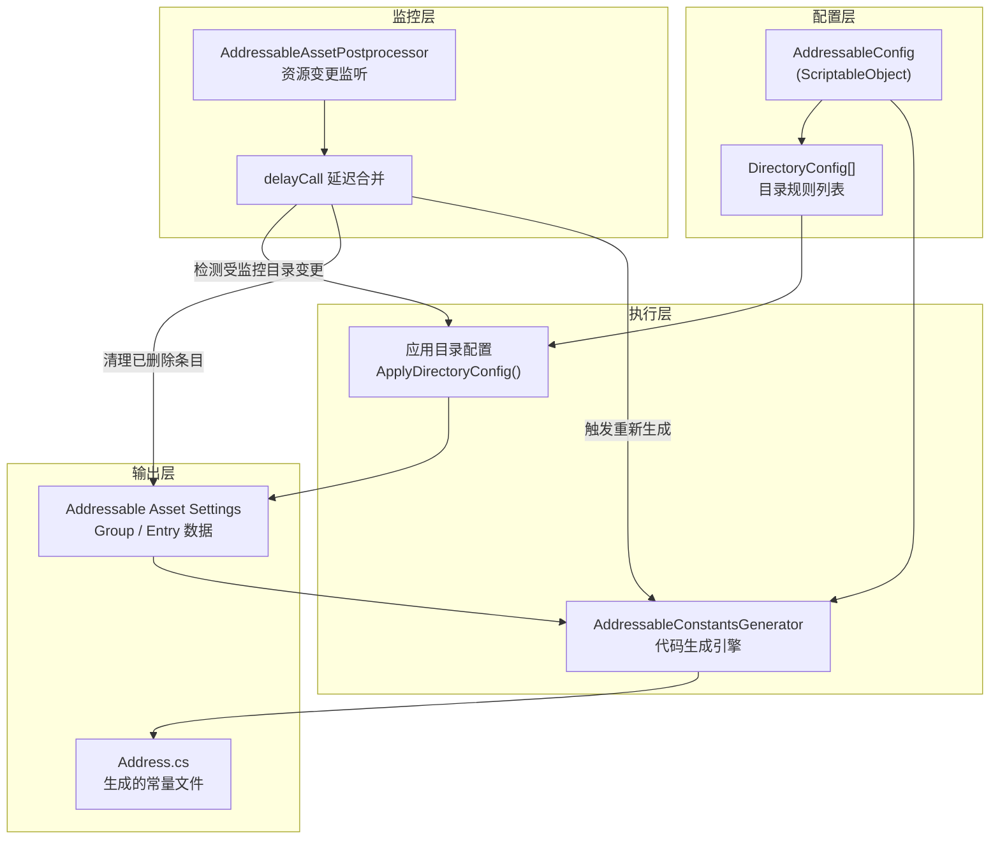
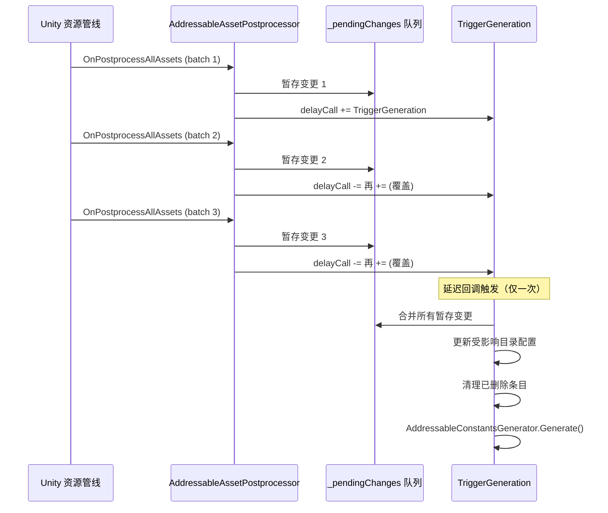

CFramework 的 Addressable 工具链由三个核心组件构成：**AddressableConfig** 作为统一配置中心定义目录规则与生成参数，**AddressableConstantsGenerator** 负责将这些规则转化为类型安全的静态常量代码，而 **AddressableAssetPostprocessor** 则作为资源守卫者在文件变更时自动维护整个系统的同步。这三者共同构成了一个从"资源目录配置 → Addressable 标记 → 常量代码生成"的完整闭环，其目标是消除项目中所有 Addressable 地址的硬编码字符串，将运行时资源引用从脆弱的魔法字符串升级为编译期可验证的常量标识。

## 整体架构

系统的运作遵循一个清晰的数据流管道：开发者通过 `AddressableConfig` 配置目标目录与命名规则 → `ApplyDirectoryConfig` 批量将资源注册到 Addressables 系统 → `AddressableConstantsGenerator` 读取 Group 数据并生成 C# 静态类 → 生成的常量文件供运行时 `AssetService` 安全引用。当受监控目录下的资源发生新增、删除或移动时，`AddressableAssetPostprocessor` 自动捕获变更并重新执行上述管道。



Sources: [AddressableConstantsGenerator.cs](Editor/Generators/AddressableConstantsGenerator.cs#L18-L83), [AddressableAssetPostprocessor.cs](Editor/Utilities/AddressableAssetPostprocessor.cs#L16-L56), [AddressableConfig.cs](Editor/Configs/AddressableConfig.cs#L18-L33)

## AddressableConfig：配置中心

`AddressableConfig` 是整个工具链的配置中枢，以 ScriptableObject 形式存储在 `Assets/EditorRes/Configs/AddressableConfig.asset`。它采用 **单例获取模式**——通过 `GetOrCreateInstance()` 方法优先从 AssetDatabase 中查找已有实例，仅在不存在时才自动创建默认配置，确保整个编辑器生命周期内只维护一份配置数据。

### 常量生成设置

配置的"常量生成设置"折叠面板控制着代码生成的全部参数：

| 参数 | 类型 | 默认值 | 说明 |
|------|------|--------|------|
| `constantsOutputPath` | `string` | `Assets/Scripts/Generated` | 生成文件的输出目录 |
| `constantsClassName` | `string` | `Address` | 生成的静态类名 |
| `constantsNamespace` | `string` | `CFramework` | 命名空间，留空则不包裹 |
| `autoGenerate` | `bool` | `true` | 资源变更时是否自动重新生成 |
| `enableNestedGroups` | `bool` | `true` | 按地址路径首级目录创建嵌套类 |
| `namingConvention` | `NamingConvention` | `PascalCase` | 常量名的命名风格 |
| `excludedGroups` | `List<string>` | `["Built In Data"]` | 排除的分组名称 |

Sources: [AddressableConfig.cs](Editor/Configs/AddressableConfig.cs#L141-L196), [EditorPaths.cs](Editor/EditorPaths.cs#L57-L74)

### DirectoryConfig：目录级规则

每个 `DirectoryConfig` 描述了如何处理一个目标目录下的资源集合。其设计覆盖了从"发现资源"到"生成地址"的完整规则链。

**可寻址命名规则**定义了地址的生成算法。前缀类型（`PrefixType`）决定了地址的前半部分：`None` 表示无前缀，`DirectoryName` 取目标目录名，`GroupName` 取分组名，`LabelName` 取首个默认标签，`Custom` 使用自定义文本。地址类型（`AddressType`）控制后半部分：`FileName` 使用无扩展名文件名，`FileNameWithExtension` 保留扩展名，`RelativePath` 使用相对子路径。最终地址由 `GenerateAddress()` 按 `前缀/地址` 格式拼接，再可选地执行小写转换和空格替换。

**分组设置**允许通过 `useSubDirectoryAsGroup` 将子目录映射为独立的 Addressable Group，支持 `groupPrefix` 统一前缀。**标签规则**（`LabelRule`）提供了基于通配符模式匹配的自动标签分配机制。

**过滤规则**实现了多层筛选：`includeExtensions` 白名单控制文件类型，`excludeFiles` 和 `excludeDirectories` 精确排除特定路径，`recursive` 决定是否递归子目录，`ignoreDotDirectories` 自动跳过 `.git`、`.vs` 等隐藏目录。

| 规则类别 | 关键字段 | 作用 |
|----------|----------|------|
| 命名规则 | `prefixType`, `addressType`, `convertToLowercase` | 控制地址字符串的生成 |
| 分组设置 | `groupName`, `useSubDirectoryAsGroup`, `groupPrefix` | 控制资源在 Group 中的分布 |
| 标签规则 | `defaultLabels`, `labelRules[]` | 控制资源的自动标签 |
| 过滤规则 | `includeExtensions`, `excludeFiles`, `excludeDirectories` | 控制哪些文件参与处理 |
| 高级设置 | `simulationMode`, `verboseLogging` | 安全开关与调试支持 |

Sources: [AddressableConfig.cs](Editor/Configs/AddressableConfig.cs#L200-L370)

### 预览与应用

`AddressableConfig` 内置了完整的预览机制。`PreviewDirectoryConfig()` 方法模拟整个处理流程，显示匹配的资源数量、生成的地址、分配的分组和标签，但不会实际修改任何 Addressable 数据。预览结果通过 `AddressableConfigPreviewWindow`（基于 Odin EditorWindow）展示，支持复制到剪贴板。默认的 `simulationMode = true` 为每个新建配置提供了安全网，只有在开发者显式关闭模拟模式后，"应用"按钮才会真正执行修改。

Sources: [AddressableConfig.cs](Editor/Configs/AddressableConfig.cs#L427-L480), [AddressableConfigPreviewWindow.cs](Editor/Windows/Addressable/AddressableConfigPreviewWindow.cs#L1-L61)

## AddressableConstantsGenerator：代码生成引擎

`AddressableConstantsGenerator` 是一个纯静态类，其核心职责是从 Addressable Asset Settings 中提取 Group 和 Entry 数据，将其转化为结构化的 C# 静态常量代码。生成过程分为四个阶段：**收集** → **构建** → **渲染** → **写入**。

### 四阶段生成管道

**收集阶段**（`CollectGroups`）遍历所有 Addressable Group，跳过排除列表中的分组（默认排除 `Built In Data`）和空分组。对每个有效分组，`CollectGroupData` 逐条提取 Entry 的地址、标签，并通过 `ConvertToConstantName` 将地址转换为合法的 C# 常量名。同分组内出现重复地址时，自动追加递增后缀（如 `_2`、`_3`）消除歧义。

**构建阶段**（`BuildNestedGroups`）在 `enableNestedGroups = true` 时，按地址路径的第一个 `/` 分隔段将条目分组为嵌套静态类。例如地址 `Audio/BGM/battle_theme` 会归入 `Audio` 嵌套类。无路径分隔符的地址归入 `_Root` 类。此特性让生成的代码结构自然映射资源的目录层次。

**渲染阶段**（`GenerateCode`）使用 `StringBuilder` 逐行拼接代码。生成的文件带有 `auto-generated` 标记头，声明了命名空间（如配置了的话），包含一个 `public static partial class` 顶层类，内嵌按 Group 分组的静态子类，每个子类内包含 `public const string` 常量字段。常量值的注释中包含了该资源关联的 Labels 信息。

**写入阶段**（`WriteToFile`）执行了一个关键的优化：**内容差异比较**。写入前先读取已有文件内容，如果完全一致则跳过写入和 `AssetDatabase.Refresh()`，避免触发不必要的脚本编译和域重载。

### 生成代码示例

假设配置了 `constantsClassName = "Address"`，命名空间为 `CFramework`，且有两个分组 `Audio` 和 `UI`，生成的代码结构如下：

```csharp
// <auto-generated>
//    此代码由 CFramework AddressableConstantsGenerator 自动生成。
//    对此文件的更改可能导致错误的行为，并且会在重新生成时丢失。
// </auto-generated>

namespace CFramework
{
    /// <summary>
    /// Addressables 资源常量，按 Group 分组
    /// </summary>
    public static partial class Address
    {
        /// <summary>
        /// Group: Audio
        /// </summary>
        public static class Audio
        {
            public static class Bgm
            {
                /// <summary>
                /// Labels: audio, background
                /// </summary>
                public const string BattleTheme = "Audio/BGM/battle_theme";
                public const string MenuTheme = "Audio/BGM/menu_theme";
            }
            public static class Sfx
            {
                public const string Click = "Audio/SFX/click";
            }
        }

        /// <summary>
        /// Group: UI
        /// </summary>
        public static class UI
        {
            public const string MainPanel = "UI/MainPanel";
            public const string SettingsPanel = "UI/SettingsPanel";
        }
    }
}
```

Sources: [AddressableConstantsGenerator.cs](Editor/Generators/AddressableConstantsGenerator.cs#L95-L232)

### 命名转换系统

地址到常量名的转换是代码生成的核心算法，由三层管道组成：

1. **`ExtractNameFromAddress`**：从完整地址中提取最后一段路径，并移除文件扩展名，获得原始名称
2. **`CleanName`**：清洗非法字符——将 `_`、空格、`-`、`/`、`\`、`.` 等分隔符统一转换为空格作为单词边界，移除所有非字母数字字符，连续分隔符合并
3. **`ApplyNamingConvention`**：按选定的 `NamingConvention` 将空格分隔的单词列表转换为目标格式

| NamingConvention | 输入示例 | 输出 |
|------------------|----------|------|
| `PascalCase` | `battle_bgm_01` | `BattleBgm01` |
| `CamelCase` | `battle_bgm_01` | `battleBgm01` |
| `LowerCase` | `battle_bgm_01` | `battlebgm01` |
| `Original` | `battle_bgm_01` | `battlebgm01`（连接单词） |

常量名始终以 `PascalCase` 作为最终格式（`ConvertToConstantName` 内部硬编码），而分组类名（`ConvertToClassName`）则使用用户配置的 `namingConvention`。若转换后的名称以数字开头，会自动添加 `_` 前缀以确保 C# 标识符合法。

Sources: [AddressableConstantsGenerator.cs](Editor/Generators/AddressableConstantsGenerator.cs#L357-L395), [NamingConvention.cs](Editor/Generators/NamingConvention.cs#L1-L28)

## AddressableAssetPostprocessor：资源变更守卫

`AddressableAssetPostprocessor` 继承自 Unity 的 `AssetPostprocessor`，通过 `OnPostprocessAllAssets` 静态回调监听项目中所有资源的导入、删除、移动操作。但并非每次变更都触发生成——它实现了一套**精准过滤 + 延迟合并**的调度策略。

### 变更检测策略

`ShouldRegenerate` 方法首先调用 `HasWatchedDirectoryChange` 逐一检查四类变更（imported、deleted、moved、movedFrom）中是否有任何资源位于 `AddressableConfig.directories` 列表中已启用的目录下。过滤逻辑跳过 `.meta` 文件、非资源文件类型（`.cs`、`.csproj`、`.sln` 等）、Addressables 配置目录和 CFramework 自身目录。这意味着在非监控目录下修改脚本或编辑器文件不会触发无谓的重新生成。

### 延迟合并与调度

通过变更检测后，`OnPostprocessAllAssets` 并不立即执行生成，而是将变更信息存入 `_pendingChanges` 列表（带 `lock` 线程安全保护），然后通过 `EditorApplication.delayCall` 注册延迟回调。**这是一个关键设计**：Unity 在批量导入资源时会连续触发多次 `OnPostprocessAllAssets`，使用 `delayCall` 加上 `+=` 再 `-=` 的模式确保只有最后一次回调注册的 `TriggerGeneration` 会真正执行，所有中间变更被自动合并处理。



### 三步执行流程

`DoGenerate` 是实际执行的入口，它检查 `autoGenerate` 开关和 Addressable Settings 的有效性后，按顺序执行三个步骤：

1. **更新受影响目录配置**（`ProcessAddressChanges`）：通过 `FindAffectedDirectoryConfigs` 找出所有受变更影响的 `DirectoryConfig`，仅对这些目录重新执行地址更新。使用 `AssetDatabase.StartAssetEditing()` / `StopAssetEditing()` 包裹批量操作，避免中间状态触发多余的刷新。对每个受影响配置重新扫描资源、更新 Address 和 Labels
2. **清理已删除条目**（`CleanupDeletedEntries`）：遍历已删除资源，检查是否位于受监控目录下，若存在对应的 Addressable Entry 则从其 Group 中移除
3. **重新生成常量文件**：调用 `AddressableConstantsGenerator.Generate(config)` 完成代码生成

此外，`TriggerGeneration` 还包含了**编译状态守卫**：如果执行时 Unity 正在编译或处于 Play 模式，会通过 `EditorApplication.update` 注册 `WaitForCompilation` 轮询，直到编译完成后再执行生成，避免在域重载期间操作 AssetDatabase。

Sources: [AddressableAssetPostprocessor.cs](Editor/Utilities/AddressableAssetPostprocessor.cs#L31-L211)

## 触发方式与菜单集成

常量生成器提供了多种触发入口，适应不同工作场景：

| 触发方式 | 入口 | 适用场景 |
|----------|------|----------|
| 菜单项 | `CFramework > Addressables > 生成资源常量` | 手动触发全量重新生成 |
| Inspector 按钮 | AddressableConfig → 常量生成设置 → 生成资源常量 | 配置调整后的即时验证 |
| 全量应用 | AddressableConfig → 快捷操作 → 应用所有配置 | 首次配置或批量修改后的全量同步 |
| 单目录应用 | DirectoryConfig → 操作 → 应用 | 针对单个目录的精确控制 |
| 自动触发 | AddressableAssetPostprocessor 监控 | 日常开发中的无感维护 |

手动菜单项调用 `Generate()` 无参版本，内部通过 `AddressableConfig.GetOrCreateInstance()` 获取或创建配置单例后调用带参版本。自动触发仅在 `autoGenerate = true` 时生效，且仅监控已启用目录内的资源文件变更。

Sources: [AddressableConstantsGenerator.cs](Editor/Generators/AddressableConstantsGenerator.cs#L34-L39), [AddressableConfig.cs](Editor/Configs/AddressableConfig.cs#L65-L127), [AddressableAssetPostprocessor.cs](Editor/Utilities/AddressableAssetPostprocessor.cs#L161-L211)

## 设计决策与使用建议

**文件写入优化**是本系统的一个重要工程决策。代码生成器在每次写入前进行内容比较，仅在内容确实变化时才执行文件写入和 `AssetDatabase.Refresh()`。这避免了因无意义写入导致的脚本重编译——在一个包含数千个 Addressable 资源的项目中，后处理器可能频繁触发，但大部分触发不会产生实际的文件变化。

**`partial class` 声明**为开发者预留了扩展点。生成的类声明为 `public static partial class Address`，开发者可以在另一个文件中为同一类添加自定义辅助方法（如按标签查询的快捷方法），而不会被自动生成的逻辑覆盖。

**`simulationMode` 安全网**建议在新建目录配置时始终开启。预览功能（`PreviewDirectoryConfig`）会显示完整的处理计划而不修改任何数据，是验证命名规则和分组策略的最佳方式。确认无误后再关闭模拟模式执行应用。

**与运行时的衔接**：生成的常量直接配合 [资源管理服务：Addressables 封装、引用计数与生命周期绑定](10-zi-yuan-guan-li-fu-wu-addressables-feng-zhuang-yin-yong-ji-shu-yu-sheng-ming-zhou-qi-bang-ding) 中的 `AssetService` 使用，将 `Address.Audio.Bgm.BattleTheme` 这样的常量作为加载请求的地址参数，彻底消除手写地址字符串的风险。若需了解配置资产在 Inspector 中的编辑体验，可参阅 [ConfigTable 自定义 Inspector 与配置资产编辑器](21-configtable-zi-ding-yi-inspector-yu-pei-zhi-zi-chan-bian-ji-qi)。