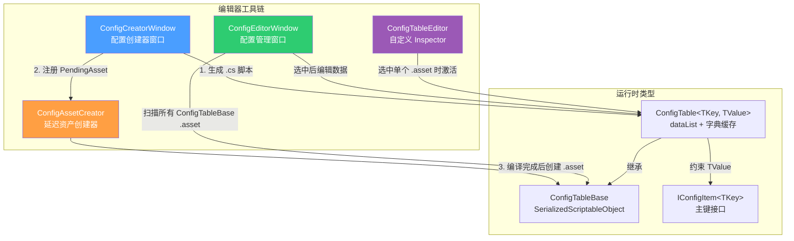
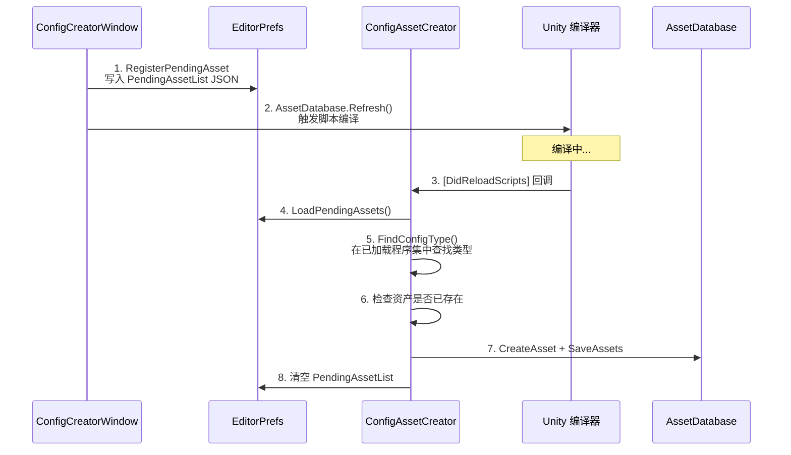
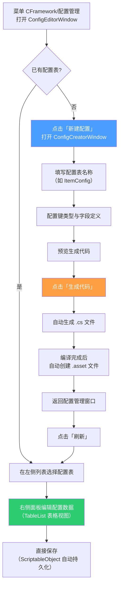

CFramework 的配置表编辑器工具链围绕 **Odin Inspector** 构建，提供了三个层次分明的编辑器组件：**ConfigTableEditor** 自定义 Inspector 提供基于 Odin 的数据编辑体验，**ConfigEditorWindow** 配置管理窗口以主从布局统一管理所有配置资产，**ConfigCreatorWindow** 配置创建器以声明式 UI 驱动代码生成与资产创建。三者配合覆盖了从"创建配置表类型"到"编辑配置数据"的完整工作流，核心设计理念是让开发者无需手写样板代码即可快速产出符合框架规范的配置表。

Sources: [ConfigTableEditor.cs](Editor/Inspectors/ConfigTableEditor.cs#L1-L15), [ConfigEditorWindow.cs](Editor/Windows/Config/ConfigEditorWindow.cs#L1-L257), [ConfigCreatorWindow.cs](Editor/Windows/Config/ConfigCreatorWindow.cs#L1-L520)

## 架构总览：三组件协作关系

以下 Mermaid 图展示了三个编辑器组件及其与运行时类的协作流程。阅读此图前需了解：**ConfigTableBase** 是所有配置表的抽象基类，继承自 Odin 的 `SerializedScriptableObject`；**ConfigTable<TKey, TValue>** 是泛型配置表实现，内部持有 `dataList` 列表并通过字典缓存提供 O(1) 查找；**IConfigItem<TKey>** 是配置数据项的主键接口。



Sources: [ConfigTableEditor.cs](Editor/Inspectors/ConfigTableEditor.cs#L1-L15), [ConfigEditorWindow.cs](Editor/Windows/Config/ConfigEditorWindow.cs#L1-L257), [ConfigCreatorWindow.cs](Editor/Windows/Config/ConfigCreatorWindow.cs#L1-L520), [ConfigAssetCreator.cs](Editor/Utilities/ConfigAssetCreator.cs#L1-L218), [ConfigTableBase.cs](Runtime/Config/ConfigTableBase.cs#L1-L25), [ConfigTable.cs](Runtime/Config/ConfigTable.cs#L1-L101)

## ConfigTableEditor：自定义 Inspector 扩展点

**ConfigTableEditor** 是一个极简的自定义编辑器，通过 `[CustomEditor(typeof(ConfigTableBase), true)]` 特性注册为所有 `ConfigTableBase` 派生类的 Inspector 替代。它直接继承 Odin 的 `OdinEditor`，因此任何继承自 `ConfigTable<TKey, TValue>` 的配置表资产在 Inspector 中都会自动获得 Odin 提供的完整序列化支持——包括 `[TableList]` 表格视图、`[Searchable]` 搜索过滤、拖拽排序等能力。

```csharp
[CustomEditor(target(ConfigTableBase), true)]
public class ConfigTableEditor : OdinEditor
{
    // 使用 Odin 默认的 Inspector 显示
    // 如需自定义功能，可在此扩展
}
```

这种设计的关键意义在于**扩展预留**：当前使用 Odin 默认渲染，但开发者可以在此基类中统一注入自定义绘制逻辑——例如添加数据验证按钮、导入/导出功能、批量编辑工具等——所有派生的 ConfigTable 都会自动继承这些增强。`true` 参数使得该 CustomEditor 对所有 `ConfigTableBase` 子类生效，而非仅作用于基类本身。

Sources: [ConfigTableEditor.cs](Editor/Inspectors/ConfigTableEditor.cs#L1-L15)

### Inspector 中的实际渲染效果

虽然 ConfigTableEditor 本身没有自定义绘制逻辑，但 ConfigTable 泛型类的字段声明中已通过 Odin 特性定义了数据列表的呈现方式。`dataList` 字段使用了以下关键特性组合：

| 特性 | 作用 |
|------|------|
| `[OdinSerialize]` | 使用 Odin 序列化器，支持 Unity 原生不支持的多态、字典等类型 |
| `[TableList]` | 将列表渲染为可编辑的表格视图，每行一条记录 |
| `[ShowInInspector]` | 确保受保护字段在 Inspector 中可见 |
| `[Searchable]` | 启用列表内搜索过滤功能 |
| `[PropertyOrder(1)]` | 控制属性在 Inspector 中的排序 |

这种 `[TableList]` + `[Searchable]` 的组合使得配置数据在 Inspector 中以电子表格形式呈现，每列对应一个字段，支持内联编辑、排序和搜索，大幅提升了配置数据的可视化编辑效率。

Sources: [ConfigTable.cs](Runtime/Config/ConfigTable.cs#L16-L26)

## ConfigEditorWindow：配置管理主窗口

**ConfigEditorWindow** 是一个基于 `OdinEditorWindow` 的配置管理中心，通过菜单 `CFramework/配置管理` 打开。它采用经典的**主从布局（Master-Detail）**：左侧 25% 宽度显示所有 ConfigTableBase 资产列表，右侧 75% 宽度显示选中配置的详细数据编辑区。

Sources: [ConfigEditorWindow.cs](Editor/Windows/Config/ConfigEditorWindow.cs#L14-L25), [ConfigEditorWindow.cs](Editor/Windows/Config/ConfigEditorWindow.cs#L56-L101)

### 配置信息数据模型

窗口通过内部类 `ConfigInfo` 封装每个配置资产的元数据，用于列表展示和状态管理：

| 字段 | 类型 | 说明 | Inspector 显示 |
|------|------|------|---------------|
| `Name` | string | 配置表类名（如 ItemConfig） | `[DisplayAsString]` 只读显示 |
| `Type` | string | 基类名称（如 ConfigTable\`2） | `[DisplayAsString]` 只读显示 |
| `Count` | int | 当前配置记录数量 | `[DisplayAsString]` 只读显示 |
| `Path` | string | 资产文件路径 | `[HideInInspector]` 隐藏 |
| `Asset` | ScriptableObject | 资产引用 | `[HideInInspector]` 隐藏 |
| `ConfigType` | Type | 运行时类型信息 | 未标记特性 |

Sources: [ConfigEditorWindow.cs](Editor/Windows/Config/ConfigEditorWindow.cs#L33-L52)

### 配置扫描与加载机制

窗口在 `OnEnable` 时自动调用 `RefreshConfigList()`，通过 `AssetDatabase.FindAssets("t:ScriptableObject")` 扫描项目内所有 ScriptableObject 资产，然后筛选出 `ConfigTableBase` 类型的实例并构建 `ConfigInfo` 列表。左侧列表使用 Odin 的 `[ListDrawerSettings]` 配置为只读、分页（每页 20 条）、带刷新按钮的模式：

```csharp
[ListDrawerSettings(
    ShowPaging = true,
    NumberOfItemsPerPage = 20,
    IsReadOnly = true,
    OnTitleBarGUI = nameof(DrawRefreshButton),
    ShowIndexLabels = false,
    DraggableItems = false
)]
```

Sources: [ConfigEditorWindow.cs](Editor/Windows/Config/ConfigEditorWindow.cs#L59-L71), [ConfigEditorWindow.cs](Editor/Windows/Config/ConfigEditorWindow.cs#L138-L168)

### 选择切换与属性树编辑

当用户在左侧列表中选中某个配置时，`OnSelectedConfigChanged` 回调被触发。该回调通过比较 `Selection.activeObject` 与列表中 `ConfigInfo.Asset` 引用来确定选中项，随后为选中的 `ConfigTableBase` 实例创建 Odin `PropertyTree`，使其数据在右侧面板中以完整的 Odin Inspector 形式渲染——这意味着所有 Odin 特性（`[TableList]`、`[Searchable]` 等）在窗口内同样生效。`PropertyTree` 在选择切换时通过 `Dispose()` 释放旧实例，避免资源泄漏。

Sources: [ConfigEditorWindow.cs](Editor/Windows/Config/ConfigEditorWindow.cs#L170-L199)

### 工具栏与空状态提示

窗口重写了 `DrawEditors()` 方法以绘制顶部工具栏，包含"新建配置"和"刷新"按钮以及配置总数显示。当项目中尚无任何配置表时，`DrawEmptyState()` 绘制半透明背景区域并居中显示提示文字"暂无配置表\n请点击「新建配置」按钮创建"，引导用户进入创建流程。

Sources: [ConfigEditorWindow.cs](Editor/Windows/Config/ConfigEditorWindow.cs#L201-L254)

## ConfigCreatorWindow：配置创建器窗口

**ConfigCreatorWindow** 是整个配置表工具链中最复杂的组件，它将"定义配置表结构"到"生成代码并创建资产"的全过程封装为一个声明式表单界面。通过菜单 `CFramework/创建配置表` 打开。

Sources: [ConfigCreatorWindow.cs](Editor/Windows/Config/ConfigCreatorWindow.cs#L16-L26)

### 表单字段组织

窗口使用 Odin 的分组特性将表单分为五个逻辑区域：

| 分组 | 特性 | 包含字段 | 用途 |
|------|------|---------|------|
| 基础配置 | `[TitleGroup]` | configName | 配置表类名（如 ItemConfig） |
| 配置表设置 | `[TitleGroup]` | configNamespace, configOutputPath | 配置表类的命名空间与输出目录 |
| 数据类设置 | `[TitleGroup]` | dataNamespace, dataOutputPath | 数据类的命名空间与输出目录 |
| 资源设置 | `[TitleGroup]` | outputAssetPath, openGeneratedScript, autoCreateAsset | 资产输出路径与行为选项 |
| 类型配置 | `[TitleGroup]` | keyType, valueTypeName, valueFields | 键类型、值类型名称、字段定义列表 |

Sources: [ConfigCreatorWindow.cs](Editor/Windows/Config/ConfigCreatorWindow.cs#L32-L71)

### 字段类型系统

创建器提供了预定义的字段类型选项，覆盖了游戏配置中最常见的数据类型：

| 类别 | 支持的类型 |
|------|-----------|
| 数值 | int, float, long, double, byte, short, uint, ulong, ushort |
| 文本 | string |
| 布尔 | bool |
| 向量 | Vector2, Vector3, Vector4 |
| 颜色 | Color |
| Unity 资源 | GameObject, Transform, Sprite, Texture, AudioClip |

键类型（keyType）独立于字段类型，提供 int、string、long、byte、short、uint、ulong、ushort 八种选项。每个字段条目通过 `ValueField` 类描述，包含字段名、类型、是否为主键、描述四个属性，其中描述会作为 XML 文档注释输出到生成代码中。

Sources: [ConfigCreatorWindow.cs](Editor/Windows/Config/ConfigCreatorWindow.cs#L121-L188)

### 智能命名联动

创建器实现了两个自动联动机制以减少手动输入：**配置名联动**——当 `configName` 变化时，若名称以 "Config" 结尾，则自动将 `valueTypeName` 设为去掉 "Config" 后缀加上 "Data" 的结果（例如输入 `ItemConfig` 自动生成 `ItemData`）；**键类型联动**——当 `keyType` 变化时，自动更新第一个字段（默认主键字段）的类型为所选键类型。

Sources: [ConfigCreatorWindow.cs](Editor/Windows/Config/ConfigCreatorWindow.cs#L497-L511)

### 代码生成：数据类与配置表类

点击"生成代码"或"仅生成代码"按钮后，创建器通过 StringBuilder 动态构建两个 C# 源文件。

**数据类**生成逻辑生成一个实现 `IConfigItem<TKey>` 的 sealed 类，包含用户定义的所有字段（附带默认值初始化）、`Key` 属性（指向主键字段）以及 `Clone()` 方法。以下是一个典型的生成结果示例：

```csharp
// 由 ConfigCreatorWindow 自动生成
using System;
using CFramework;
using UnityEngine;

namespace Game.Configs
{
    [Serializable]
    public sealed class ItemData : IConfigItem<int>
    {
        public int id = 0;
        public string name = "";
        public int Key => id;

        public ItemData Clone()
        {
            return new ItemData
            {
                id = id,
                name = name
            };
        }
    }
}
```

**配置表类**生成逻辑产出继承自 `ConfigTable<TKey, TValue>` 的 sealed 类，并自动添加 `[CreateAssetMenu]` 特性使得用户也可以通过 Unity 的 Assets/Create 菜单手动创建该类型的资产：

```csharp
using CFramework;
using UnityEngine;

namespace Game.Configs
{
    [CreateAssetMenu(fileName = "ItemConfig", menuName = "Game/Config/ItemConfig")]
    public sealed class ItemConfig : ConfigTable<int, ItemData>
    {
        // 数据在 Inspector 中配置
    }
}
```

Sources: [ConfigCreatorWindow.cs](Editor/Windows/Config/ConfigCreatorWindow.cs#L335-L467)

### 偏好设置持久化

创建器通过 `EditorPrefs` 持久化所有配置项，包括命名空间、输出路径和键类型。窗口在 `OnEnable` 时加载、`OnDisable` 时保存，同时各路径字段的 `[OnValueChanged]` 回调也会即时保存，确保编辑器意外关闭时配置不丢失。

| 持久化键 | 默认值 |
|---------|--------|
| `CFramework.ConfigCreator.ConfigNamespace` | Game.Configs |
| `CFramework.ConfigCreator.ConfigOutputPath` | Assets/Scripts/Config |
| `CFramework.ConfigCreator.DataNamespace` | Game.Configs |
| `CFramework.ConfigCreator.DataOutputPath` | Assets/Scripts/Config |
| `CFramework.ConfigCreator.AssetOutputPath` | Assets/EditorRes/Configs |
| `CFramework.ConfigCreator.KeyType` | int |

Sources: [ConfigCreatorWindow.cs](Editor/Windows/Config/ConfigCreatorWindow.cs#L76-L117), [EditorPaths.cs](Editor/EditorPaths.cs#L42-L86)

## ConfigAssetCreator：编译后延迟资产创建

配置创建器面临一个关键时序问题：**生成的 C# 脚本需要经过编译才能被 Unity 识别为有效类型，但创建 ScriptableObject 资产又必须引用这些类型**。`ConfigAssetCreator` 通过"注册-编译-创建"的三阶段流水线解决这个问题。

Sources: [ConfigAssetCreator.cs](Editor/Utilities/ConfigAssetCreator.cs#L1-L34)

### 三阶段流水线



Sources: [ConfigAssetCreator.cs](Editor/Utilities/ConfigAssetCreator.cs#L36-L81)

**阶段一：注册待创建资产**。ConfigCreatorWindow 在生成代码后调用 `ConfigAssetCreator.RegisterPendingAsset()`，将配置名称、命名空间和输出路径序列化为 JSON 写入 `EditorPrefs`（键为 `CFramework.PendingConfigAssets`）。随后调用 `AssetDatabase.Refresh()` 触发 Unity 重新编译。

**阶段二：编译完成后触发**。`ConfigAssetCreator` 使用 `[DidReloadScripts]` 和 `[InitializeOnLoad]` 双重机制监听编译完成事件，确保在任何情况下都能捕获到编译完成的时机。编译完成后从 `EditorPrefs` 读取待创建列表。

**阶段三：创建资产文件**。`ProcessPendingAssets()` 遍历所有待创建项，通过 `FindConfigType()` 在所有已加载程序集中按"完整命名空间.类名"和"裸类名"两种策略查找类型。找到类型后，使用 `ScriptableObject.CreateInstance()` 创建实例，通过 `AssetDatabase.CreateAsset()` 持久化为 .asset 文件，并自动在 Project 窗口中 Ping 该资产。若资产已存在则跳过创建，避免覆盖已有数据。

Sources: [ConfigAssetCreator.cs](Editor/Utilities/ConfigAssetCreator.cs#L83-L167), [ConfigAssetCreator.cs](Editor/Utilities/ConfigAssetCreator.cs#L169-L201)

### 容错与错误处理

`ConfigAssetCreator` 在多个关键节点实现了防御性编程：`LoadPendingAssets()` 使用 try-catch 包裹 JSON 反序列化，损坏数据时返回空列表；`FindConfigType()` 对每个程序集的 `GetType()` 调用单独 try-catch，避免某个程序集加载异常阻断整个查找流程；`CreateConfigAsset()` 在资产创建失败时弹出详细的错误对话框，包含失败原因和手动创建路径指引。

Sources: [ConfigAssetCreator.cs](Editor/Utilities/ConfigAssetCreator.cs#L83-L167)

## 完整工作流：从创建到编辑

以下流程图展示了使用配置表编辑器工具链的完整操作步骤：



Sources: [ConfigEditorWindow.cs](Editor/Windows/Config/ConfigEditorWindow.cs#L18-L24), [ConfigCreatorWindow.cs](Editor/Windows/Config/ConfigCreatorWindow.cs#L20-L26), [ConfigAssetCreator.cs](Editor/Utilities/ConfigAssetCreator.cs#L52-L63)

## 菜单入口与路径约定汇总

| 菜单路径 | 打开组件 | 功能 |
|---------|---------|------|
| `CFramework/配置管理` | ConfigEditorWindow | 管理所有配置资产的主窗口 |
| `CFramework/创建配置表` | ConfigCreatorWindow | 独立打开配置创建器 |
| `Assets/Create/Game/Config/{类名}` | Unity 内置 | 手动创建特定类型的配置资产（由生成代码的 `[CreateAssetMenu]` 注册） |

框架通过 `EditorPaths` 静态类统一管理路径约定，配置表相关的默认路径为：

| 用途 | 路径常量 | 值 |
|------|---------|-----|
| 配置表脚本输出 | `EditorPaths.ConfigScripts` | Assets/Scripts/Config |
| 配置资产输出 | `EditorPaths.EditorConfigs` | Assets/EditorRes/Configs |

Sources: [ConfigEditorWindow.cs](Editor/Windows/Config/ConfigEditorWindow.cs#L18), [ConfigCreatorWindow.cs](Editor/Windows/Config/ConfigCreatorWindow.cs#L20), [EditorPaths.cs](Editor/EditorPaths.cs#L42-L86)

## 扩展指南

**自定义 Inspector 增强**：在 `ConfigTableEditor` 中重写 OdinEditor 的绘制方法即可为所有配置表添加统一功能。例如重写 `OnInspectorGUI()` 在默认绘制前后插入自定义工具栏。

**自定义字段类型**：若需支持枚举、自定义结构体等字段类型，扩展 `ConfigCreatorWindow.ValueField.FieldTypeOptions` 数组并同步修改 `IsNumericType()` 方法即可。

**资产创建后处理**：在 `ConfigAssetCreator.CreateConfigAsset()` 方法中，资产创建成功后的位置可插入自定义逻辑，如自动添加 Addressable 标签、初始化默认数据等。

Sources: [ConfigTableEditor.cs](Editor/Inspectors/ConfigTableEditor.cs#L9-L14), [ConfigCreatorWindow.cs](Editor/Windows/Config/ConfigCreatorWindow.cs#L156-L188), [ConfigAssetCreator.cs](Editor/Utilities/ConfigAssetCreator.cs#L104-L167)

## 延伸阅读

- 了解配置表运行时的泛型设计、数据源切换与热重载机制，请参阅 [配置表系统：ScriptableObject 数据源、泛型 ConfigTable 与热重载](16-pei-zhi-biao-xi-tong-scriptableobject-shu-ju-yuan-fan-xing-configtable-yu-re-zhong-zai)
- 了解其他编辑器窗口工具，请参阅 [编辑器窗口一览：配置创建器、异常查看器与场景快捷打开](19-bian-ji-qi-chuang-kou-lan-pei-zhi-chuang-jian-qi-yi-chang-cha-kan-qi-yu-chang-jing-kuai-jie-da-kai)
- 了解另一套代码生成器的设计模式，请参阅 [Addressable 常量代码生成器与资源后处理器](20-addressable-chang-liang-dai-ma-sheng-cheng-qi-yu-zi-yuan-hou-chu-li-qi)