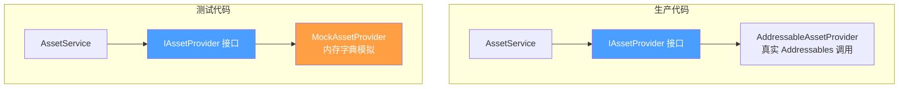

CFramework 的单元测试体系建立在 **接口抽象 + 手工 Mock** 的核心策略之上，通过将服务的外部依赖（资源加载、场景管理等）抽象为可替换的接口，使绝大多数业务逻辑可以在无需真实 Unity 资源的环境下完成验证。本文将从测试工程结构、Mock 替换模式、测试编写范式以及各模块覆盖现状四个维度，为你提供一份系统性的测试编写指南。

## 测试工程结构

CFramework 的测试代码位于 `Tests/` 目录下，按 **编辑器测试** 与 **运行时测试** 两个程序集（Assembly Definition）进行物理隔离。运行时测试覆盖全部核心模块，编辑器测试则专注于 Inspector 与配置工具的验证。

```
Tests/
├── CFramework.Runtime.Tests.asmdef    ← 运行时测试程序集
├── Editor/
│   ├── CFramework.Editor.Tests.asmdef ← 编辑器测试程序集
│   └── FrameworkSettingsTests.cs
└── Runtime/
    ├── Asset/          ← AssetService + MockAssetProvider
    ├── Audio/          ← AudioService（占位）
    ├── Config/         ← ConfigService + ConfigTable
    ├── Core/           ← EventBus + ExceptionDispatcher
    ├── Log/            ← UnityLogger
    ├── Save/           ← SaveService
    ├── Scene/          ← SceneService + FadeTransition
    ├── State/          ← StateMachine + StateMachineStack
    └── UI/             ← UI（空目录，待补充）
```

两个程序集通过 `defineConstraints: ["UNITY_INCLUDE_TESTS"]` 约束，仅在测试模式下参与编译，不会污染发布构建。运行时测试程序集显式引用了 UniTask、R3、VContainer、Addressables 等依赖，确保异步测试与响应式断言能够正常执行。

Sources: [CFramework.Runtime.Tests.asmdef](Tests/CFramework.Runtime.Tests.asmdef#L1-L30), [CFramework.Editor.Tests.asmdef](Tests/Editor/CFramework.Editor.Tests.asmdef#L1-L22)

## Mock 替换的核心模式

### 接口抽象层：IAssetProvider

CFramework 的 Mock 策略并非在测试中临时构造桩对象，而是在架构设计阶段就通过接口预留了替换点。最典型的例子是 **`IAssetProvider`**——`AssetService` 的全部底层资源操作（加载、实例化、释放、内存查询）都委托给这个接口，而非直接调用 Addressables API。



这种设计使得 `AssetService` 的引用计数、内存预算、生命周期绑定、并发加载等复杂逻辑，可以在 **完全不触碰 Addressables 系统** 的情况下完成测试。

Sources: [IAssetProvider](Runtime/Asset/IAssetService.cs#L14-L35)

### MockAssetProvider 实现

`MockAssetProvider` 是框架中唯一的手工 Mock 类，它实现了 `IAssetProvider` 接口的全部四个方法，核心机制如下：

| 能力 | 实现方式 | 用途 |
|------|---------|------|
| 资源注册 | `Dictionary<object, Object>` + `RegisterAsset/RegisterGameObject` | 测试前预置模拟资源 |
| 加载模拟 | 直接从字典返回，支持 `loadDelayMs` 模拟网络延迟 | 测试并发、取消、超时 |
| 实例化模拟 | `Object.Instantiate` 克隆注册的 GameObject | 验证实例化流程 |
| 释放追踪 | `ReleaseLog` 列表记录所有释放操作 | 断言验证释放行为 |
| 内存模拟 | `Dictionary<object, long>` 自定义每资源内存大小 | 测试内存预算超限 |

```csharp
// 典型用法：注册资源 → 注入服务 → 执行测试
var mockProvider = new MockAssetProvider();
mockProvider.RegisterGameObject("TestPrefab", "TestPrefab", memorySize: 2048L);
var service = new AssetService(settings, mockProvider);

// 测试完成后断言释放日志
Assert.AreEqual(0, service.MemoryBudget.UsedBytes);
```

值得注意的是，`MockAssetProvider` 并非简单的桩对象（stub），它同时承担了 **spy** 的角色——通过 `ReleaseLog` 属性暴露内部调用记录，使测试可以验证 `AssetService` 是否在正确的时机、以正确的参数调用了底层释放接口。

Sources: [MockAssetProvider.cs](Tests/Runtime/Asset/MockAssetProvider.cs#L1-L129)

## 测试编写范式

### 异步测试模式

CFramework 大量使用 UniTask 异步编程，测试中通过 `UnityTest` + `UniTask.ToCoroutine` 的组合来桥接 NUnit 的协程测试机制与 async/await 编程模型。这是框架中最核心的测试编写范式：

```csharp
[UnityTest]
[Timeout(10000)]  // 防止异步操作挂起
public IEnumerator A001_ReferenceCount_MultipleLoadsReleaseCorrectly()
{
    return UniTask.ToCoroutine(async () =>
    {
        // Arrange - 准备测试数据
        var handle1 = await _assetService.LoadAsync<GameObject>(TestPrefabKey);
        var handle2 = await _assetService.LoadAsync<GameObject>(TestPrefabKey);

        // Act - 执行被测操作
        handle1.Dispose();

        // Assert - 验证结果
        Assert.IsNotNull(handle2.Asset, "释放第一个引用后，资源仍应可用");
    });
}
```

对于不需要异步操作的纯逻辑测试（如状态机、事件总线），则直接使用 `[Test]` 特性，避免进入协程调度带来的额外开销。

Sources: [AssetServiceTests.cs](Tests/Runtime/Asset/AssetServiceTests.cs#L57-L91)

### 测试生命周期管理

所有测试类遵循统一的 **SetUp/TearDown** 模式，确保测试之间完全隔离：

```csharp
[SetUp]
public void SetUp()
{
    // 1. 创建配置（ScriptableObject 需要运行时实例化）
    var settings = ScriptableObject.CreateInstance<FrameworkSettings>();
    settings.MemoryBudgetMB = 512;

    // 2. 创建 Mock 依赖
    _mockProvider = new MockAssetProvider();
    _mockProvider.RegisterGameObject(TestPrefabKey, "TestPrefab");

    // 3. 构造被测系统（注入 Mock）
    _assetService = new AssetService(settings, _mockProvider);
}

[TearDown]
public void TearDown()
{
    // 反向释放：服务 → Mock → 临时对象
    _assetService?.Dispose();
    _mockProvider?.Cleanup();
    foreach (var go in _cleanupObjects)
        if (go != null) Object.DestroyImmediate(go);
}
```

关键实践：`FrameworkSettings` 作为 `ScriptableObject` 必须通过 `CreateInstance` 创建并在 TearDown 中通过 `DestroyImmediate` 销毁；MockProvider 的 `Cleanup` 方法负责清理所有注册的模拟 GameObject，防止测试泄漏。

Sources: [AssetServiceTests.cs](Tests/Runtime/Asset/AssetServiceTests.cs#L27-L53)

### 测试命名与分类约定

框架采用 **模块前缀 + 序号 + 功能描述** 的命名体系，使测试在运行器中按逻辑分组显示：

| 模块 | 前缀 | 示例 |
|------|------|------|
| Asset（资源） | `A` | `A001_ReferenceCount_MultipleLoadsReleaseCorrectly` |
| EventBus（事件） | `E` | `E001_ExceptionIsolation_SingleHandlerExceptionDoesNotAffectOthers` |
| Exception（异常） | 无前缀 | `Dispatch_ExceptionHandled_CallsRegisteredHandlers` |
| Save（存档） | `S` | `S001_AtomicWrite_ProcessKillDuringWriteDoesNotCorrupt` |
| Config（配置） | `C` | `C007_ConfigTable_Get_ReturnsCorrectValue` |
| Scene（场景） | `S` | `S005_Transition_FadeTransition_Animation_Success` |
| State（状态机） | 无前缀 | `RegisterState_NullState_ThrowsArgumentNullException` |

测试内部使用 `#region` 按测试维度分组（引用计数测试、内存预算测试、生命周期绑定测试等），每个 region 聚焦一个功能切面。

Sources: [AssetServiceTests.cs](Tests/Runtime/Asset/AssetServiceTests.cs#L55-L93)

### 测试辅助类型（Test Doubles）

对于不依赖接口注入的模块（如状态机、配置表），测试类通过 **私有嵌套类** 构造轻量级测试替身，无需引入外部 Mock 框架：

```csharp
// 状态机测试中的替身状态
private class TestState : IState<string>, IStateEnter, IStateExit, IStateUpdate
{
    public string Key { get; }
    public bool EnterCalled { get; private set; }
    public bool ExitCalled { get; private set; }

    public void OnEnter() => EnterCalled = true;
    public void OnExit()  => ExitCalled  = true;
    public void OnUpdate(float deltaTime) { }
}

// 配置表测试中的替身数据
public class TestConfigData : IConfigItem<int>
{
    public int Id { get; set; }
    public string Name { get; set; }
    public int Key => Id;
}
```

这种模式的优点是替身的生命周期完全限制在测试类内部，不会污染全局命名空间，同时通过 `EnterCalled`、`ExitCalled` 等布尔标记实现 spy 功能。

Sources: [StateMachineTests.cs](Tests/Runtime/State/StateMachineTests.cs#L447-L493), [ConfigServiceTests.cs](Tests/Runtime/Config/ConfigServiceTests.cs#L134-L157)

## 各模块测试覆盖分析

下面的表格从测试深度、Mock 策略和覆盖维度三个角度，对框架各模块的测试现状进行全面评估：

| 模块 | 测试文件 | 成熟度 | Mock 策略 | 关键测试维度 |
|------|---------|--------|----------|-------------|
| **AssetService** | AssetServiceTests (14 tests) | ✅ 完整 | IAssetProvider 接口注入 MockAssetProvider | 引用计数、并发加载、内存预算、生命周期绑定、取消操作、实例化 |
| **EventBus** | EventBusTests (7 tests) | ✅ 完整 | 无外部依赖，直接实例化 | 异常隔离、优先级排序、响应式订阅、性能基准 |
| **ExceptionDispatcher** | ExceptionDispatcherTests (8 tests) | ✅ 完整 | 无外部依赖 | 处理器注册/注销、Null 安全、Dispose 后行为 |
| **Logger** | LoggerTests (18 tests) | ✅ 完整 | FrameworkSettings 注入 | 日志级别过滤、格式化输出、LogAssert 日志验证 |
| **SaveService** | SaveServiceTests (20+ tests) | ✅ 完整 | FrameworkSettings + 临时目录 | 原子写入、脏状态追踪、多槽位隔离、自动保存、加密、错误恢复 |
| **StateMachine** | StateMachineTests (20+ tests) | ✅ 完整 | 内嵌 TestState 替身 | 状态注册/注销、生命周期回调、事件触发、空安全 |
| **StateMachineStack** | StateMachineStackTests (30+ tests) | ✅ 完整 | 内嵌 StackTestState 替身 | Push/Pop 语义、栈深度管理、场景导航模拟 |
| **ConfigTable** | ConfigServiceTests (部分) | 🟡 部分 | 内嵌 TestConfigTable | Get/TryGet 查询、空数据边界 |
| **SceneService** | SceneServiceTests (部分) | 🟡 占位 | 无 | FadeTransition 参数验证、过渡动画执行 |
| **AudioService** | AudioServiceTests | 🔴 占位 | 无 | Assert.Pass 占位，待实现 |
| **UI** | （空目录） | 🔴 未开始 | — | — |

Sources: [AssetServiceTests.cs](Tests/Runtime/Asset/AssetServiceTests.cs#L1-L491), [EventBusTests.cs](Tests/Runtime/Core/EventBusTests.cs#L1-L238), [ExceptionDispatcherTests.cs](Tests/Runtime/Core/ExceptionDispatcherTests.cs#L1-L199), [LoggerTests.cs](Tests/Runtime/Log/LoggerTests.cs#L1-L244), [SaveServiceTests.cs](Tests/Runtime/Save/SaveServiceTests.cs#L1-L727), [StateMachineTests.cs](Tests/Runtime/State/StateMachineTests.cs#L1-L494), [StateMachineStackTests.cs](Tests/Runtime/State/StateMachineStackTests.cs#L1-L952)

## 关键测试场景详解

### 并发加载竞态验证

`AssetService` 的并发安全是最难通过常规手段验证的特性之一。测试利用 `MockAssetProvider` 的 `loadDelayMs` 参数模拟慢速加载，然后同时发起多个对同一 key 的加载请求，验证底层加载只发生一次且所有调用者获得同一实例：

```csharp
// 模拟 100ms 延迟，确保三个请求在第一个完成之前同时到达
var delayProvider = new MockAssetProvider(loadDelayMs: 100);
delayProvider.RegisterGameObject("ConcurrentAsset", "ConcurrentAsset");
var service = new AssetService(settings, delayProvider);

// 同时发起 3 个加载请求
var task1 = service.LoadAsync<GameObject>("ConcurrentAsset");
var task2 = service.LoadAsync<GameObject>("ConcurrentAsset");
var task3 = service.LoadAsync<GameObject>("ConcurrentAsset");

var result1 = await task1;
var result2 = await task2;
var result3 = await task3;

// 所有结果应指向同一资源实例
Assert.AreEqual(result1.Asset, result2.Asset);
Assert.AreEqual(result1.Asset, result3.Asset);
```

Sources: [AssetServiceTests.cs](Tests/Runtime/Asset/AssetServiceTests.cs#L356-L393)

### 存档原子写入与容错

`SaveService` 测试套件展示了如何验证文件系统的可靠性边界——通过手动损坏文件内容、删除目录、取消写入等方式，验证服务在各种异常场景下都能优雅降级而非崩溃：

```csharp
// 手动损坏已保存的文件
File.WriteAllBytes(filePath, new byte[] { 0x00, 0x01, 0x02, 0x03 });

// 清除缓存强制从文件读取
_saveService.SetSlot(_saveService.CurrentSlot + 1);
_saveService.SetSlot(_saveService.CurrentSlot - 1);

// 应返回默认值而非抛出异常
var result = await _saveService.LoadAsync("corrupted", new TestSaveData { Level = 999 });
Assert.AreEqual(999, result.Level);
```

Sources: [SaveServiceTests.cs](Tests/Runtime/Save/SaveServiceTests.cs#L624-L647)

### 状态机场景化测试

`StateMachineStackTests` 在单元测试之外，还包含多个 **场景化测试**（Scenario Test），模拟真实的游戏菜单导航流程来验证 Push/Pop/PopTo 的组合语义。这种测试方式将多个 API 调用串联为一个连贯的业务流程，比单点断言更能暴露状态管理缺陷：

```csharp
// 模拟：MainMenu → Settings → AudioSettings → 返回 Settings → 返回 MainMenu
_fsm.ChangeState("MainMenu");
_fsm.Push("Settings");
_fsm.Push("AudioSettings");
Assert.AreEqual(3, _fsm.StackDepth);

_fsm.Pop();  // AudioSettings → Settings
Assert.AreEqual("Settings", _fsm.CurrentState);

_fsm.Pop();  // Settings → MainMenu
Assert.AreEqual(1, _fsm.StackDepth);
```

Sources: [StateMachineStackTests.cs](Tests/Runtime/State/StateMachineStackTests.cs#L774-L803)

## 为新模块编写测试的 CheckList

当你需要为框架中的新功能或已有模块补充测试时，请按以下步骤执行：

1. **确认依赖接口**：检查被测类的构造函数参数，识别哪些依赖需要 Mock。如果被测类直接依赖 Unity 引擎 API（如 `AudioSource`、`SceneManager`），考虑是否需要提取接口。
2. **选择测试基类**：异步操作使用 `[UnityTest]` + `UniTask.ToCoroutine`；纯逻辑使用 `[Test]`。
3. **编写 SetUp/TearDown**：创建 `FrameworkSettings` 实例、构造 Mock 依赖、实例化被测系统；TearDown 中反向释放，清理临时 GameObject。
4. **覆盖三个维度**：**正向路径**（正常输入返回预期结果）、**边界条件**（空值、零值、极端参数）、**错误恢复**（异常后状态一致性）。
5. **使用 LogAssert**：当测试预期会产生 Unity 日志输出（Warning/Error）时，使用 `LogAssert.Expect` 声明预期日志，或使用 `LogAssert.ignoreFailingMessages = true` 临时抑制。
6. **超时保护**：所有 `[UnityTest]` 添加 `[Timeout]` 特性，防止异步挂起导致测试套件永不结束。

Sources: [AssetServiceTests.cs](Tests/Runtime/Asset/AssetServiceTests.cs#L27-L53)

## 延伸阅读

- 若想了解 Mock 替换的接口设计背景，请参阅 [框架扩展指南：自定义 IInstaller、IAssetProvider 与 ISceneTransition](23-kuang-jia-kuo-zhan-zhi-nan-zi-ding-yi-iinstaller-iassetprovider-yu-iscenetransition)
- 若想理解被测服务的完整实现细节，请参阅对应的模块文档，如 [资源管理服务：Addressables 封装、引用计数与生命周期绑定](10-zi-yuan-guan-li-fu-wu-addressables-feng-zhuang-yin-yong-ji-shu-yu-sheng-ming-zhou-qi-bang-ding) 或 [存档系统：原子写入、脏状态追踪、AES 加密与多存档槽管理](17-cun-dang-xi-tong-yuan-zi-xie-ru-zang-zhuang-tai-zhui-zong-aes-jia-mi-yu-duo-cun-dang-cao-guan-li)