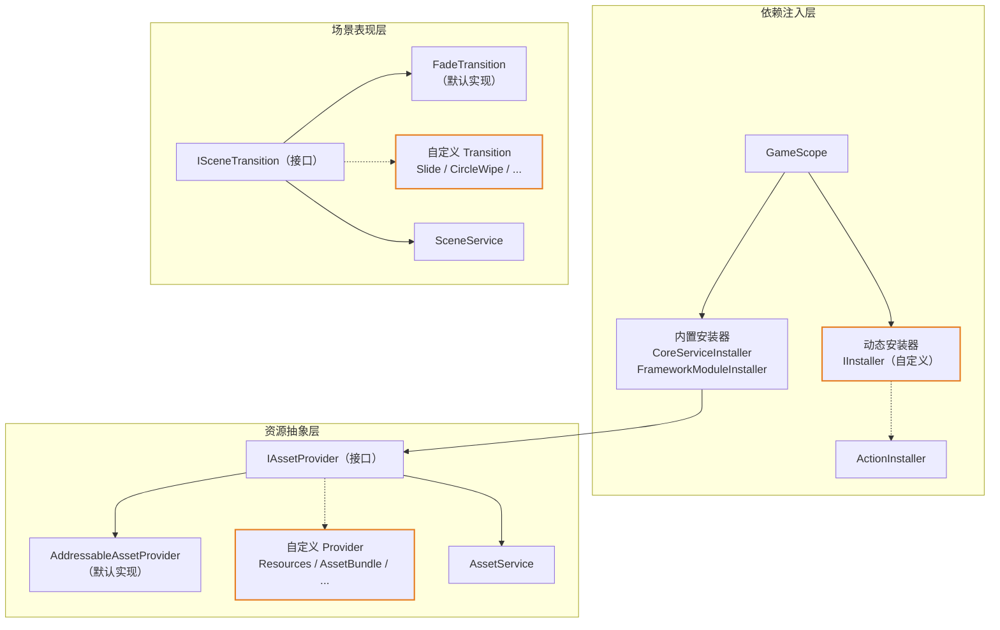
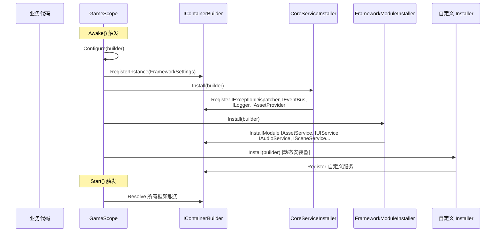
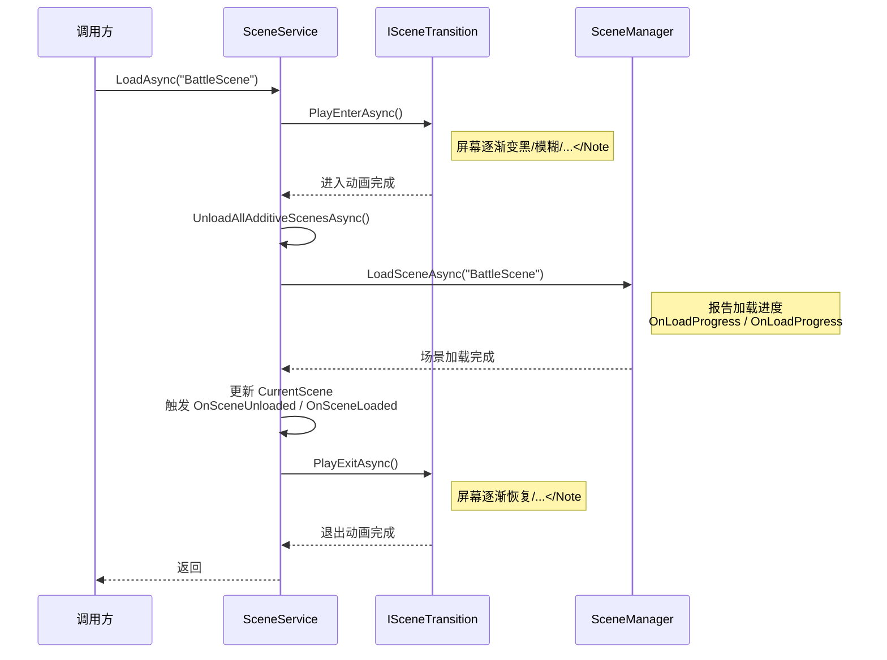

CFramework 的架构设计遵循**开放-封闭原则**：核心服务的行为可通过接口替换，功能模块可通过安装器动态注入，而无需修改框架源码。本文档聚焦三个关键扩展点——**IInstaller** 负责服务注册与模块组装、**IAssetProvider** 抽象底层资源加载策略、**ISceneTransition** 定义场景切换的视觉表现——逐一拆解其契约契约、框架内建的默认实现、以及自定义扩展的完整流程。掌握这三个扩展点，你就能在不触碰框架内部代码的前提下，将 CFramework 适配到任何项目的技术栈与美术管线中。

Sources: [CoreServiceInstaller.cs](Runtime/Core/DI/CoreServiceInstaller.cs#L1-L23), [IAssetService.cs](Runtime/Asset/IAssetService.cs#L14-L35), [ISceneTransition.cs](Runtime/Scene/ISceneTransition.cs#L1-L21)

## 扩展点全景架构

三个扩展点在框架中各司其职，分别位于**依赖注入层**、**资源抽象层**和**场景表现层**。下面的关系图展示了它们的协作方式和注册路径：



三个扩展点遵循统一的交互模式：框架在内部定义**接口契约**，同时提供一个**开箱即用的默认实现**；开发者通过实现同一接口来提供替代方案，再通过各自的**注入机制**将自定义实现替换到框架中。橙色节点标记的即为可扩展的部分。

Sources: [GameScope.cs](Runtime/Core/DI/GameScope.cs#L77-L95), [AssetService.cs](Runtime/Asset/AssetService.cs#L22-L29), [SceneService.cs](Runtime/Scene/SceneService.cs#L28)

## 扩展点对比总览

| 扩展点 | 所属层 | 接口定义 | 默认实现 | 注入方式 | 典型应用场景 |
|--------|--------|----------|----------|----------|-------------|
| **IInstaller** | 依赖注入 | `VContainer.Unity.IInstaller` | `CoreServiceInstaller` / `FrameworkModuleInstaller` | `GameScope.AddInstaller()` | 注册自定义游戏服务、替换框架默认服务 |
| **IAssetProvider** | 资源加载 | `CFramework.IAssetProvider` | `AddressableAssetProvider` | `CoreServiceInstaller` 中注册到 DI 容器 | 切换到 Resources / AssetBundle / 远程资源系统 |
| **ISceneTransition** | 场景过渡 | `CFramework.ISceneTransition` | `FadeTransition` | `SceneService.Transition` 属性赋值 | 实现自定义场景切换动画效果 |

Sources: [CoreServiceInstaller.cs](Runtime/Core/DI/CoreServiceInstaller.cs#L15-L22), [IAssetService.cs](Runtime/Asset/IAssetService.cs#L14-L35), [ISceneTransition.cs](Runtime/Scene/ISceneTransition.cs#L9-L20)

---

## 一、自定义 IInstaller：模块注册与动态注入

### 1.1 IInstaller 机制解析

IInstaller 是 VContainer 定义的核心扩展接口，其契约极其简洁——接收一个 `IContainerBuilder`，在内部完成服务注册。CFramework 的 `GameScope` 在 `Configure` 阶段按顺序执行两组安装器：**内置安装器**（`CoreServiceInstaller` → `FrameworkModuleInstaller`）和**动态安装器**（通过 `AddInstaller` 注册）。这意味着你的自定义安装器在内置安装器之后执行，可以覆盖已注册的服务绑定。

```csharp
// VContainer 的 IInstaller 契约（由 VContainer 提供）
public interface IInstaller
{
    void Install(IContainerBuilder builder);
}
```

CFramework 在此基础上提供了 `InstallerExtensions` 工具类，其中 `InstallModule<TInterface, TImplementation>()` 方法将服务同时注册为 **EntryPoint**（实现 `IStartable` / `ITickable` 等 VContainer 生命周期接口时自动调用）和指定接口类型的单例绑定。

Sources: [ActionInstaller.cs](Runtime/Core/DI/ActionInstaller.cs#L1-L32), [InstallerExtensions.cs](Runtime/Core/DI/InstallerExtensions.cs#L1-L39), [GameScope.cs](Runtime/Core/DI/GameScope.cs#L77-L95)

### 1.2 安装器执行时序

理解安装器的执行时机对于正确注册服务至关重要：



关键细节：**内置安装器的顺序不可变更**——`CoreServiceInstaller` 先注册基础设施（异常分发器、事件总线、日志、资源提供者），`FrameworkModuleInstaller` 再注册功能模块（这些模块依赖基础设施）。你的自定义安装器排在最后，这意味着你可以安全地 `Rebind<ISomeService, MyCustomService>()` 来替换任何框架服务。

Sources: [GameScope.cs](Runtime/Core/DI/GameScope.cs#L22-L26), [CoreServiceInstaller.cs](Runtime/Core/DI/CoreServiceInstaller.cs#L15-L22), [FrameworkModuleInstaller.cs](Runtime/Core/DI/FrameworkModuleInstaller.cs#L16-L25)

### 1.3 实战：创建独立安装器类

当你需要注册一组相关的服务时（例如一个完整的战斗系统或网络模块），推荐创建独立的安装器类。以下是注册自定义游戏服务的完整模式：

```csharp
using VContainer;
using VContainer.Unity;

namespace MyGame
{
    // ===== 自定义服务接口与实现 =====
    public interface INetworkService
    {
        UniTask ConnectAsync(string host, int port);
        void Disconnect();
    }

    public sealed class WebSocketNetworkService : INetworkService, IStartable, IDisposable
    {
        public void Start() { /* 连接初始化 */ }
        public async UniTask ConnectAsync(string host, int port) { /* ... */ }
        public void Disconnect() { /* ... */ }
        public void Dispose() { /* 清理连接 */ }
    }

    // ===== 独立安装器 =====
    public sealed class NetworkInstaller : IInstaller
    {
        public void Install(IContainerBuilder builder)
        {
            // 使用 InstallModule 同时注册 EntryPoint 和接口绑定
            builder.InstallModule<INetworkService, WebSocketNetworkService>();
        }
    }
}
```

注册到框架只需一行调用：

```csharp
// 在游戏启动早期调用（如 RuntimeInitializeOnLoadMethod 或启动脚本中）
GameScope.AddInstaller(new NetworkInstaller());
```

**时序策略**：如果 `AddInstaller` 在 `GameScope.Awake()` 之前调用，安装器会在首次构建时自动执行；如果 `GameScope` 已经构建完毕，`AddInstaller` 会立即触发 `RebuildContainer()`，重建整个 DI 容器。

Sources: [GameScope.cs](Runtime/Core/DI/GameScope.cs#L142-L174), [InstallerExtensions.cs](Runtime/Core/DI/InstallerExtensions.cs#L30-L37)

### 1.4 快捷方式：ActionInstaller 委托模式

对于少量服务的注册，无需创建独立类。`ActionInstaller` 将一个 `Action<IContainerBuilder>` 委托包装为 `IInstaller`，适合在代码中直接内联使用：

```csharp
// 方式一：传入 Action 委托（内部自动包装为 ActionInstaller）
GameScope.AddInstaller(builder =>
{
    builder.Register<IGameStateManager, GameStateManager>(Lifetime.Singleton);
    builder.Register<IScoreService, ScoreService>(Lifetime.Singleton);
});

// 方式二：传入 IInstaller 数组
GameScope.AddInstaller(
    new ActionInstaller(b => b.Register<IFooService, FooService>(Lifetime.Singleton)),
    new ActionInstaller(b => b.Register<IBarService, BarService>(Lifetime.Singleton))
);
```

两种 `AddInstaller` 重载在效果上完全等价——委托式重载内部会自动创建 `ActionInstaller` 实例。

Sources: [ActionInstaller.cs](Runtime/Core/DI/ActionInstaller.cs#L11-L31), [GameScope.cs](Runtime/Core/DI/GameScope.cs#L167-L174)

### 1.5 动态安装器管理

`GameScope` 提供了完整的动态安装器生命周期管理 API。以下是管理操作及其副作用：

| API | 调用时机 | 副作用 |
|-----|---------|--------|
| `AddInstaller(params IInstaller[])` | 任意时刻 | 若已构建则自动触发 `RebuildContainer()` |
| `AddInstaller(Action<IContainerBuilder>)` | 任意时刻 | 同上 |
| `RemoveInstaller(IInstaller)` | 需要卸载模块时 | **不自动重建**，需手动调用 `RebuildContainer()` |
| `ClearInstallers()` | 需要重置所有自定义模块时 | **不自动重建**，需手动调用 `RebuildContainer()` |
| `RebuildContainer()` | 手动触发 | 释放所有 `IDisposable` 服务，重新执行全部安装器 |

**注意**：`RebuildContainer()` 会销毁并重建所有已注册的服务实例。如果某些服务持有运行时状态（如网络连接、玩家数据缓存），重建前需自行保存状态。

Sources: [GameScope.cs](Runtime/Core/DI/GameScope.cs#L149-L210)

### 1.6 实战：替换框架默认服务

自定义安装器的一个核心用途是**替换框架的默认实现**。例如，将默认的 `AddressableAssetProvider` 替换为自定义的资源加载方案：

```csharp
public sealed class CustomProviderInstaller : IInstaller
{
    public void Install(IContainerBuilder builder)
    {
        // Rebind 将覆盖 CoreServiceInstaller 中的注册
        builder.Register<IAssetProvider, MyResourcesProvider>(Lifetime.Singleton);
    }
}

// 在 GameScope 初始化前注册
GameScope.AddInstaller(new CustomProviderInstaller());
```

由于 `GameScope.Configure` 按序执行内置 → 动态安装器，VContainer 的后注册覆盖机制确保你的自定义绑定优先于默认绑定生效。

Sources: [GameScope.cs](Runtime/Core/DI/GameScope.cs#L90-L95), [CoreServiceInstaller.cs](Runtime/Core/DI/CoreServiceInstaller.cs#L20)

---

## 二、自定义 IAssetProvider：替换资源加载底层

### 2.1 IAssetProvider 接口契约

`IAssetProvider` 是资源加载的**最底层抽象**，位于 `AssetService` 之下。它定义了四个核心操作，任何资源加载系统只需实现这四个方法即可无缝接入框架：

```csharp
public interface IAssetProvider
{
    // 异步加载资源（支持泛型类型约束）
    UniTask<Object> LoadAssetAsync<T>(object key, CancellationToken ct = default) where T : Object;

    // 异步实例化预制体（返回场景中的 GameObject 实例）
    UniTask<GameObject> InstantiateAsync(object key, Transform parent, CancellationToken ct = default);

    // 释放指定 key 对应的底层句柄
    void ReleaseHandle(object key, bool isInstance);

    // 查询资源内存占用（字节），用于 AssetMemoryBudget 预算管理
    long GetAssetMemorySize(object key);
}
```

`AssetService` 在此接口之上构建了引用计数、防重入加载（同一资源的并发请求合并）、内存预算追踪、生命周期绑定等完整的管理逻辑。因此，你的自定义 Provider **无需关心这些上层关注点**，只需专注于底层资源的加载与释放。

Sources: [IAssetService.cs](Runtime/Asset/IAssetService.cs#L14-L35), [AssetService.cs](Runtime/Asset/AssetService.cs#L19-L29)

### 2.2 默认实现分析：AddressableAssetProvider

理解默认实现是编写自定义 Provider 的最佳起点。`AddressableAssetProvider` 的实现揭示了四个关键设计模式：

**句柄追踪模式**：使用 `Dictionary<object, AsyncOperationHandle>` 维护 key → Addressables 句柄的映射，确保 `ReleaseHandle` 时能找到正确的句柄进行释放。注意实例化操作使用 `"$inst_" + key` 前缀避免与加载操作的 key 冲突。

**线程安全模式**：对 `_handles` 字典的所有读写操作都包裹在 `lock (_handles)` 中，因为 `LoadAssetAsync` 可能在多个异步任务中并发调用。

**错误处理模式**：加载失败时先释放已获取的句柄，再抛出异常，防止句柄泄漏。

**实例化分离模式**：实例化操作与加载操作使用不同的 key 前缀（`$inst_`）存储在同一个字典中，由 `isInstance` 参数区分释放方式。

Sources: [AddressableAssetProvider.cs](Runtime/Asset/AddressableAssetProvider.cs#L1-L72)

### 2.3 实战：基于 Resources 的 AssetProvider

以下是一个基于 Unity 原生 `Resources` API 的完整 `IAssetProvider` 实现，适用于不想使用 Addressables 的小型项目或原型开发：

```csharp
using System.Collections.Generic;
using System.Threading;
using Cysharp.Threading.Tasks;
using UnityEngine;
using Object = UnityEngine.Object;

namespace MyGame
{
    public sealed class ResourcesAssetProvider : IAssetProvider
    {
        private readonly Dictionary<object, Object> _loadedAssets = new();
        private readonly Dictionary<object, GameObject> _instances = new();
        private readonly object _lock = new();

        public async UniTask<Object> LoadAssetAsync<T>(object key, CancellationToken ct = default)
            where T : Object
        {
            var path = key.ToString();

            // Resources.LoadAsync 是真正的异步操作
            var request = Resources.LoadAsync<T>(path);
            while (!request.isDone)
            {
                ct.ThrowIfCancellationRequested();
                await UniTask.Yield(ct);
            }

            var asset = request.asset;
            if (asset == null)
                throw new System.Exception($"[ResourcesProvider] Failed to load: {path}");

            lock (_lock)
            {
                _loadedAssets[key] = asset;
            }

            return asset;
        }

        public async UniTask<GameObject> InstantiateAsync(object key, Transform parent,
            CancellationToken ct = default)
        {
            var path = key.ToString();
            var prefab = await Resources.LoadAsync<GameObject>(path);
            ct.ThrowIfCancellationRequested();

            if (prefab == null)
                throw new System.Exception($"[ResourcesProvider] Failed to load prefab: {path}");

            var instance = Object.Instantiate(prefab as GameObject, parent);
            var instKey = "$inst_" + key;

            lock (_lock)
            {
                _instances[instKey] = instance;
            }

            return instance;
        }

        public void ReleaseHandle(object key, bool isInstance)
        {
            lock (_lock)
            {
                if (isInstance)
                {
                    if (_instances.TryGetValue(key, out var instance) && instance != null)
                        Object.Destroy(instance);
                    _instances.Remove(key);
                }
                else
                {
                    if (_loadedAssets.TryGetValue(key, out var asset) && asset != null)
                        Resources.UnloadAsset(asset);
                    _loadedAssets.Remove(key);
                }
            }
        }

        public long GetAssetMemorySize(object key)
        {
            // Resources API 无精确内存查询，返回估算值
            // 生产环境可使用 Profiler.GetRuntimeMemorySizeLong
            return 2048L;
        }
    }
}
```

注册到框架：

```csharp
GameScope.AddInstaller(new ActionInstaller(builder =>
{
    builder.Register<IAssetProvider, ResourcesAssetProvider>(Lifetime.Singleton);
}));
```

Sources: [AddressableAssetProvider.cs](Runtime/Asset/AddressableAssetProvider.cs#L14-L72), [IAssetService.cs](Runtime/Asset/IAssetService.cs#L14-L35)

### 2.4 实战：MockAssetProvider 测试替身

框架测试套件中的 `MockAssetProvider` 是 `IAssetProvider` 的另一种典型实现——完全在内存中模拟资源加载，无需任何 Unity 资源系统参与。它揭示了编写 Provider 测试替身的关键技巧：

| 技巧 | 说明 |
|------|------|
| **预注册资源** | 通过 `RegisterAsset(key, asset, memorySize)` 在测试初始化时注入模拟数据 |
| **释放日志** | `ReleaseLog` 列表记录所有释放操作，用于断言验证释放行为是否正确 |
| **可配置延迟** | `loadDelayMs` 参数模拟网络或磁盘 IO 延迟，测试异步竞态条件 |
| **独立实例追踪** | 使用 `HashSet<object>` 追踪实例化操作，确保 `ReleaseHandle(isInstance: true)` 行为正确 |

在单元测试中的使用方式如下（参见框架测试套件中的实际代码）：

```csharp
// 创建模拟提供者并注册资源
var mockProvider = new MockAssetProvider();
mockProvider.RegisterGameObject("TestPrefab", "TestPrefab");

// 注入到 AssetService（绕过 DI 容器，直接构造）
var settings = ScriptableObject.CreateInstance<FrameworkSettings>();
var assetService = new AssetService(settings, mockProvider);

// 执行测试...
var handle = await assetService.LoadAsync<GameObject>("TestPrefab");
Assert.IsNotNull(handle.Asset);
```

`AssetService` 的构造函数接受一个可选的 `IAssetProvider` 参数——当传入 `null` 时默认创建 `AddressableAssetProvider`，传入自定义实现则直接使用。这种构造器注入模式让单元测试可以完全脱离 Addressables 环境。

Sources: [MockAssetProvider.cs](Tests/Runtime/Asset/MockAssetProvider.cs#L1-L128), [AssetService.cs](Runtime/Asset/AssetService.cs#L22-L29), [AssetServiceTests.cs](Tests/Runtime/Asset/AssetServiceTests.cs#L27-L38)

### 2.5 IAssetProvider 自定义检查清单

编写自定义 Provider 时，确保以下要点全部覆盖：

| 检查项 | 说明 | 参考位置 |
|--------|------|----------|
| ✅ 线程安全 | 所有共享状态（字典、集合）的读写需加锁 | [AddressableAssetProvider.cs](Runtime/Asset/AddressableAssetProvider.cs#L29-L32) |
| ✅ 实例化 key 前缀 | 使用 `"$inst_" + key` 区分实例化与加载操作 | [AddressableAssetProvider.cs](Runtime/Asset/AddressableAssetProvider.cs#L46) |
| ✅ 失败时释放句柄 | 加载异常时先释放已获取的底层句柄再抛出 | [AddressableAssetProvider.cs](Runtime/Asset/AddressableAssetProvider.cs#L24-L27) |
| ✅ CancellationToken 传播 | 在关键 await 点检查 `ct.ThrowIfCancellationRequested()` | [AddressableAssetProvider.cs](Runtime/Asset/AddressableAssetProvider.cs#L21) |
| ✅ ReleaseHandle 幂等性 | 多次释放同一 key 不应抛异常 | [AddressableAssetProvider.cs](Runtime/Asset/AddressableAssetProvider.cs#L55-L65) |
| ✅ 内存估算合理 | `GetAssetMemorySize` 返回值影响预算管理准确性 | [AddressableAssetProvider.cs](Runtime/Asset/AddressableAssetProvider.cs#L67-L70) |

Sources: [AddressableAssetProvider.cs](Runtime/Asset/AddressableAssetProvider.cs#L1-L72)

---

## 三、自定义 ISceneTransition：场景切换动画

### 3.1 ISceneTransition 接口契约

`ISceneTransition` 是框架中最简洁的扩展点，仅定义两个异步方法——进入动画和退出动画：

```csharp
public interface ISceneTransition
{
    /// 进入动画：在场景加载开始前播放（如屏幕渐黑）
    UniTask PlayEnterAsync(CancellationToken ct = default);

    /// 退出动画：在场景加载完成后播放（如屏幕渐亮）
    UniTask PlayExitAsync(CancellationToken ct = default);
}
```

这个看似简单的设计背后是 `SceneService` 精心编排的执行时序。

Sources: [ISceneTransition.cs](Runtime/Scene/ISceneTransition.cs#L1-L21)

### 3.2 过渡动画执行时序

`SceneService.LoadAsync` 方法按照严格的顺序编排过渡动画与场景加载：



关键设计点：`PlayEnterAsync` 在场景卸载和加载**之前**执行，确保旧场景完全被遮罩后才进行切换操作；`PlayExitAsync` 在新场景加载完成**之后**执行，保证玩家看到的是已经准备好的新场景内容。`Transition` 属性可为 `null`——设为 `null` 时跳过所有过渡动画，直接加载场景。

Sources: [SceneService.cs](Runtime/Scene/SceneService.cs#L34-L68)

### 3.3 默认实现分析：FadeTransition

`FadeTransition` 通过动态创建一个覆盖全屏的 Canvas + Image 组件来实现经典的淡入淡出效果。其实现中有三个值得借鉴的模式：

**延迟创建模式**：`CreateOverlay()` 采用懒初始化策略，仅在首次播放进入动画时创建 UI 对象，且通过 `Object.DontDestroyOnLoad` 确保覆盖层在场景切换过程中不被销毁。

**对称动画模式**：进入动画从 alpha=0 渐变到 alpha=1，退出动画从 alpha=1 渐变到 alpha=0。两者复用同一个 `FadeAsync(from, to, ct)` 内部方法，通过参数控制方向。

**属性配置模式**：`Duration` 和 `FadeColor` 暴露为公有属性，支持在构造时通过对象初始化器自定义，也可在运行时动态修改。

Sources: [FadeTransition.cs](Runtime/Scene/FadeTransition.cs#L1-L74)

### 3.4 实战：自定义圆形擦除过渡

以下是一个更复杂的过渡动画实现——圆形擦除（Circle Wipe），使用 `Mathf.Lerp` 控制遮罩的缩放，从屏幕中心向外扩展覆盖：

```csharp
using System.Threading;
using Cysharp.Threading.Tasks;
using UnityEngine;
using UnityEngine.UI;

namespace MyGame
{
    public sealed class CircleWipeTransition : ISceneTransition
    {
        private GameObject _overlayObj;
        private Image _image;
        private Sprite _circleSprite;

        public float Duration { get; set; } = 0.6f;
        public Color WipeColor { get; set; } = Color.black;

        public CircleWipeTransition()
        {
            // 创建一个简单的圆形 Sprite（也可通过构造函数注入）
            _circleSprite = CreateCircleSprite();
        }

        public async UniTask PlayEnterAsync(CancellationToken ct = default)
        {
            EnsureOverlay();
            _image.transform.localScale = Vector3.zero;
            await ScaleAsync(Vector3.zero, Vector3.one * 3f, ct);
        }

        public async UniTask PlayExitAsync(CancellationToken ct = default)
        {
            await ScaleAsync(Vector3.one * 3f, Vector3.zero, ct);
            Cleanup();
        }

        private void EnsureOverlay()
        {
            if (_overlayObj != null) return;

            _overlayObj = new GameObject("[CircleWipeTransition]");
            Object.DontDestroyOnLoad(_overlayObj);

            var canvas = _overlayObj.AddComponent<Canvas>();
            canvas.renderMode = RenderMode.ScreenSpaceOverlay;
            canvas.sortingOrder = 9999;

            _image = _overlayObj.AddComponent<Image>();
            _image.sprite = _circleSprite;
            _image.color = WipeColor;
            _image.rectTransform.anchorMin = new Vector2(0.5f, 0.5f);
            _image.rectTransform.anchorMax = new Vector2(0.5f, 0.5f);
            _image.rectTransform.sizeDelta = new Vector2(1920, 1920);
        }

        private async UniTask ScaleAsync(Vector3 from, Vector3 to, CancellationToken ct)
        {
            var elapsed = 0f;
            while (elapsed < Duration)
            {
                elapsed += Time.deltaTime;
                var t = Mathf.SmoothStep(0f, 1f, Mathf.Clamp01(elapsed / Duration));
                _image.transform.localScale = Vector3.Lerp(from, to, t);
                await UniTask.Yield(ct);
            }
            _image.transform.localScale = to;
        }

        private Sprite CreateCircleSprite()
        {
            // 创建 64x64 白色圆形纹理
            var size = 64;
            var tex = new Texture2D(size, size);
            var center = size / 2f;
            var radius = size / 2f - 1;

            for (var y = 0; y < size; y++)
            for (var x = 0; x < size; x++)
            {
                var dist = Vector2.Distance(new Vector2(x, y), new Vector2(center, center));
                tex.SetPixel(x, y, dist <= radius ? Color.white : Color.clear);
            }

            tex.Apply();
            return Sprite.Create(tex, new Rect(0, 0, size, size), new Vector2(0.5f, 0.5f));
        }

        private void Cleanup()
        {
            if (_overlayObj != null)
            {
                Object.Destroy(_overlayObj);
                _overlayObj = null;
                _image = null;
            }
        }
    }
}
```

Sources: [FadeTransition.cs](Runtime/Scene/FadeTransition.cs#L11-L73), [ISceneTransition.cs](Runtime/Scene/ISceneTransition.cs#L9-L20)

### 3.5 将自定义过渡动画注入 SceneService

`ISceneTransition` 的注入方式与 `IAssetProvider` 不同——它不是通过 DI 容器注册，而是通过 `ISceneService.Transition` 属性直接赋值。`SceneService` 默认创建 `FadeTransition` 实例，你可以在任何时刻替换它：

```csharp
// 方式一：通过 DI 安装器替换（推荐——集中管理所有服务配置）
GameScope.AddInstaller(builder =>
{
    builder.RegisterBuildCallback(resolver =>
    {
        var sceneService = resolver.Resolve<ISceneService>();
        sceneService.Transition = new CircleWipeTransition
        {
            Duration = 0.8f,
            WipeColor = new Color(0.1f, 0.1f, 0.1f, 1f)
        };
    });
});

// 方式二：在任意获得 ISceneService 的地方直接赋值
public class GameBootstrapper : IStartable
{
    private readonly ISceneService _sceneService;

    public GameBootstrapper(ISceneService sceneService)
    {
        _sceneService = sceneService;
    }

    public void Start()
    {
        _sceneService.Transition = new CircleWipeTransition { Duration = 0.8f };
    }
}

// 方式三：运行时动态切换（如不同场景使用不同过渡效果）
await sceneService.LoadAsync("BattleScene"); // 使用当前 Transition
sceneService.Transition = new SlideTransition(); // 切换为滑动过渡
await sceneService.LoadAsync("MainMenu");     // 使用新的 Transition

// 方式四：禁用过渡动画
sceneService.Transition = null; // 跳过所有动画，直接加载场景
```

`Transition` 属性是可读可写的（`ISceneService.Transition { get; set; }`），设为 `null` 时 `SceneService` 的 `LoadAsync` 会跳过过渡动画的 await 调用。

Sources: [SceneService.cs](Runtime/Scene/SceneService.cs#L28), [ISceneService.cs](Runtime/Scene/ISceneService.cs#L16)

### 3.6 ISceneTransition 自定义检查清单

| 检查项 | 说明 | 参考位置 |
|--------|------|----------|
| ✅ UI 对象 DontDestroyOnLoad | 过渡覆盖层不能随场景切换被销毁 | [FadeTransition.cs](Runtime/Scene/FadeTransition.cs#L37) |
| ✅ Canvas sortingOrder 足够高 | 确保覆盖层在所有游戏 UI 之上（≥ 9999） | [FadeTransition.cs](Runtime/Scene/FadeTransition.cs#L41) |
| ✅ PlayExitAsync 清理资源 | 退出动画完成后销毁临时 UI 对象 | [FadeTransition.cs](Runtime/Scene/FadeTransition.cs#L29) |
| ✅ CancellationToken 响应 | 每帧 yield 时传入 ct，支持取消加载 | [FadeTransition.cs](Runtime/Scene/FadeTransition.cs#L68) |
| ✅ 幂等安全 | 多次调用 PlayEnterAsync 不应创建重复覆盖层 | [FadeTransition.cs](Runtime/Scene/FadeTransition.cs#L34) |
| ✅ Duration 合理 | 建议控制在 0.3s–1.0s 之间，避免阻塞玩家体验 | [FadeTransition.cs](Runtime/Scene/FadeTransition.cs#L15) |

Sources: [FadeTransition.cs](Runtime/Scene/FadeTransition.cs#L1-L74)

---

## 四、最佳实践与高级模式

### 4.1 三个扩展点的协同使用

在真实项目中，三个扩展点往往协同工作。以下是一个完整的"自定义资源系统 + 自定义场景过渡"集成示例：

```csharp
// 1. 定义自定义 Provider
public sealed class AssetBundleProvider : IAssetProvider { /* ... */ }

// 2. 通过 Installer 注册所有自定义实现
public sealed class GameInstaller : IInstaller
{
    public void Install(IContainerBuilder builder)
    {
        // 替换资源加载底层
        builder.Register<IAssetProvider, AssetBundleProvider>(Lifetime.Singleton);

        // 注册自定义游戏服务（注入框架服务）
        builder.InstallModule<ILevelService, LevelService>();
    }
}

// 3. 在 GameScope 构建前注册安装器
[RuntimeInitializeOnLoadMethod]
private static void InitializeGame()
{
    GameScope.AddInstaller(new GameInstaller());
}

// 4. 在游戏启动后配置场景过渡
public class GameInitializer : IStartable
{
    private readonly ISceneService _sceneService;

    public GameInitializer(ISceneService sceneService) => _sceneService = sceneService;

    public void Start()
    {
        _sceneService.Transition = new CircleWipeTransition { Duration = 0.6f };
    }
}
```

这种分层架构确保每个扩展点各司其职：Installer 负责服务注册，Provider 负责资源加载，Transition 负责视觉表现。

Sources: [GameScope.cs](Runtime/Core/DI/GameScope.cs#L77-L95), [CoreServiceInstaller.cs](Runtime/Core/DI/CoreServiceInstaller.cs#L15-L22)

### 4.2 SceneScope 中的场景级安装器

除了 `GameScope` 的全局安装器，框架还提供了 `SceneScope` 用于场景级别的依赖注册。`SceneScope` 继承自 VContainer 的 `LifetimeScope`，自动作为 `GameScope` 的子作用域——子作用域可以解析父作用域中注册的所有服务：

```csharp
public class BattleSceneScope : SceneScope
{
    [SerializeField] private BattleConfig _battleConfig;

    protected override void Configure(IContainerBuilder builder)
    {
        // 注册场景特有的配置与服务
        builder.RegisterInstance(_battleConfig);
        builder.Register<IBattleSystem, BattleSystem>(Lifetime.Singleton);
        builder.Register<IEnemySpawner, EnemySpawner>(Lifetime.Singleton);
    }
}
```

在场景的 `SceneScope.Configure` 中，你可以注入 `GameScope` 中注册的 `IAssetService`、`ISceneService` 等全局服务到场景级服务中，实现全局服务与场景服务的组合使用。详见 [依赖注入体系：GameScope、SceneScope 与动态安装器机制](5-yi-lai-zhu-ru-ti-xi-gamescope-scenescope-yu-dong-tai-an-zhuang-qi-ji-zhi)。

Sources: [SceneScope.cs](Runtime/Core/DI/SceneScope.cs#L1-L16)

### 4.3 扩展设计原则

| 原则 | 说明 |
|------|------|
| **优先组合而非继承** | `IInstaller` 和 `IAssetProvider` 都是接口，通过实现接口而非继承基类来扩展 |
| **保持单一职责** | 每个 Installer 只负责一组相关服务，每个 Provider 只封装一种资源系统 |
| **利用构造器注入测试** | `AssetService(settings, mockProvider)` 模式让测试脱离基础设施 |
| **注意静态状态清理** | `GameScope` 的 `_additionalInstallers` 是静态列表，Domain Reload 时自动清理 |
| **尊重执行顺序** | 内置安装器先执行，动态安装器后执行，后者可覆盖前者的服务注册 |

Sources: [GameScope.cs](Runtime/Core/DI/GameScope.cs#L71-L75), [AssetService.cs](Runtime/Asset/AssetService.cs#L22-L29)

---

## 五、扩展点速查表

以下是三个扩展点的完整速查，供日常开发快速参考：

| 维度 | IInstaller | IAssetProvider | ISceneTransition |
|------|-----------|----------------|------------------|
| **接口定义位置** | VContainer 外部库 | `CFramework.IAssetProvider` | `CFramework.ISceneTransition` |
| **接口方法数** | 1（`Install`） | 4（`LoadAssetAsync`, `InstantiateAsync`, `ReleaseHandle`, `GetAssetMemorySize`） | 2（`PlayEnterAsync`, `PlayExitAsync`） |
| **默认实现** | `CoreServiceInstaller` + `FrameworkModuleInstaller` | `AddressableAssetProvider` | `FadeTransition` |
| **注入方式** | `GameScope.AddInstaller()` | DI 容器注册 `IAssetProvider` 绑定 | `sceneService.Transition = ...` 赋值 |
| **替换时机** | `GameScope.Awake()` 前后均可 | `GameScope.Awake()` 前注册 Installer | 任意时刻 |
| **线程安全要求** | 无（Configure 阶段同步执行） | **是**（异步加载可能并发） | 无（场景加载串行执行） |
| **测试难度** | 低 | 中（需模拟资源系统） | 低（纯视觉逻辑） |
| **框架测试示例** | — | [MockAssetProvider.cs](Tests/Runtime/Asset/MockAssetProvider.cs) | [SceneServiceTests.cs](Tests/Runtime/Scene/SceneServiceTests.cs#L54-L101) |

Sources: [IAssetService.cs](Runtime/Asset/IAssetService.cs#L1-L84), [ISceneTransition.cs](Runtime/Scene/ISceneTransition.cs#L1-L21), [InstallerExtensions.cs](Runtime/Core/DI/InstallerExtensions.cs#L1-L39)

---

## 延伸阅读

- 了解三个扩展点背后的完整 DI 架构：[依赖注入体系：GameScope、SceneScope 与动态安装器机制](5-yi-lai-zhu-ru-ti-xi-gamescope-scenescope-yu-dong-tai-an-zhuang-qi-ji-zhi)
- 深入 `IAssetProvider` 之上的引用计数与内存管理：[资源管理服务：Addressables 封装、引用计数与生命周期绑定](10-zi-yuan-guan-li-fu-wu-addressables-feng-zhuang-yin-yong-ji-shu-yu-sheng-ming-zhou-qi-bang-ding)
- 查看框架如何使用 Mock Provider 编写单元测试：[单元测试指南：测试覆盖策略与 Mock 替换模式](22-dan-yuan-ce-shi-zhi-nan-ce-shi-fu-gai-ce-lue-yu-mock-ti-huan-mo-shi)
- 了解 `FadeTransition` 在场景加载流程中的完整集成：[场景管理服务：场景加载、叠加场景与过渡动画（FadeTransition）](15-chang-jing-guan-li-fu-wu-chang-jing-jia-zai-die-jia-chang-jing-yu-guo-du-dong-hua-fadetransition)