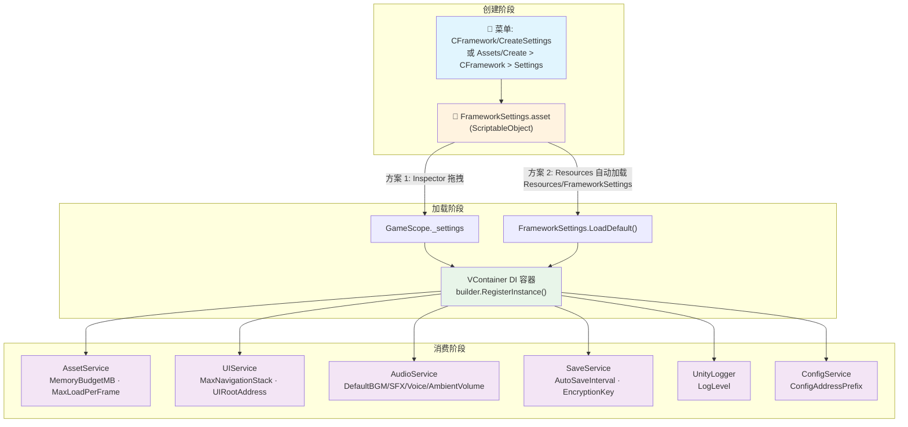
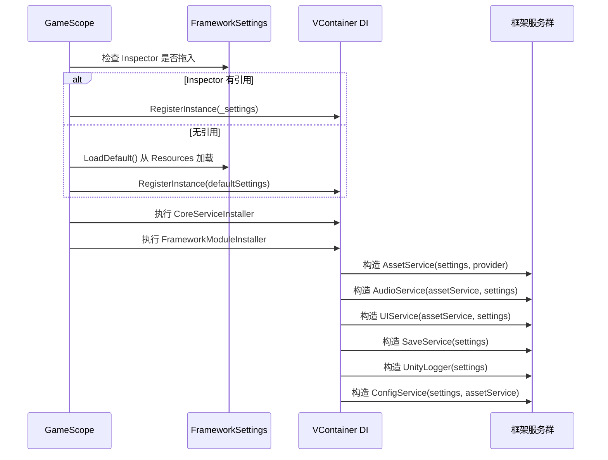

**FrameworkSettings** 是 CFramework 的核心配置中枢——一个基于 Unity ScriptableObject 的全局设置资产，集中管理资源加载、UI 系统、音频、存档、日志和配置表六大模块的运行参数。所有框架服务在启动时通过依赖注入自动获取该配置，你只需在 Inspector 中调整数值，即可在不修改任何代码的前提下改变框架行为。

Sources: [FrameworkSettings.cs](Runtime/Core/FrameworkSettings.cs#L1-L57)

## 整体架构：一份数据，多处消费

在深入每个配置项之前，先理解 FrameworkSettings 在框架中的流转路径。下图展示了从资产创建到服务消费的完整数据流：



如图所示，FrameworkSettings 本质上是一个**单一数据源**：你在 Inspector 中编辑的每一项数值，最终会被分发到对应的框架服务构造函数中。这种设计确保了配置的一致性——不存在"资源服务用的是 512MB 预算，而音频服务读到的是另一个值"的情况。

Sources: [FrameworkSettings.cs](Runtime/Core/FrameworkSettings.cs#L8-L57), [GameScope.cs](Runtime/Core/DI/GameScope.cs#L77-L94)

## 创建与放置

FrameworkSettings 是一个标准的 ScriptableObject 资产，有两种方式创建它：

**方式一：编辑器菜单创建（推荐）**

点击 Unity 菜单栏 `CFramework → CreateSettings`，在弹出的文件保存对话框中选择存放路径即可。该功能由编辑器工具类 `FrameworkSettingsEditor` 提供，会自动创建一个带有默认值的设置资产。

**方式二：右键菜单创建**

在 Project 窗口中右键 → `Create → CFramework → Settings`，这是通过 `[CreateAssetMenu]` 特性注册的。

Sources: [FrameworkSettingsEditor.cs](Editor/Inspectors/FrameworkSettingsEditor.cs#L1-L31), [FrameworkSettings.cs](Runtime/Core/FrameworkSettings.cs#L8-L9)

### 资产放置规则

创建完成后，资产文件的放置位置决定加载方式：

| 放置方式 | 路径要求 | 加载机制 | 适用场景 |
|---------|---------|---------|---------|
| **GameScope Inspector 拖拽** | 任意 Assets 内路径 | VContainer 直接注入 | 项目开发期，灵活切换配置 |
| **Resources 自动加载** | `Assets/Resources/FrameworkSettings.asset` | `Resources.Load<FrameworkSettings>()` | 打包后运行，无需手动引用 |

如果你在 GameScope 的 Inspector 面板中拖入了设置资产，框架优先使用该引用。如果未拖拽，框架会调用 `FrameworkSettings.LoadDefault()` 从 `Resources/FrameworkSettings` 路径自动加载。若该路径下也不存在资产，框架会创建一个内存中的默认实例并输出警告日志。

Sources: [FrameworkSettings.cs](Runtime/Core/FrameworkSettings.cs#L44-L56), [GameScope.cs](Runtime/Core/DI/GameScope.cs#L77-L88)

## 配置项全览

FrameworkSettings 共包含 **6 个分类、12 个配置字段**。下表汇总了所有字段及其默认值：

| 分类 | 字段名 | 类型 | 默认值 | 说明 |
|------|--------|------|--------|------|
| **Asset** | `MemoryBudgetMB` | `int` | `512` | 资源内存预算上限（MB） |
| **Asset** | `MaxLoadPerFrame` | `int` | `5` | 分帧预加载时每帧最大加载数量 |
| **UI** | `MaxNavigationStack` | `int` | `10` | UI 导航栈最大容量 |
| **UI** | `UIRootAddress` | `string` | `"UIRoot"` | UIRoot Prefab 的 Addressable Key |
| **Audio** | `DefaultBGMVolume` | `float` | `0.8` | 默认 BGM 音量 (0~1) |
| **Audio** | `DefaultSFXVolume` | `float` | `1.0` | 默认音效音量 (0~1) |
| **Audio** | `DefaultVoiceVolume` | `float` | `1.0` | 默认语音音量 (0~1) |
| **Audio** | `DefaultAmbientVolume` | `float` | `0.5` | 默认环境音音量 (0~1) |
| **Save** | `AutoSaveInterval` | `int` | `60` | 自动保存间隔（秒） |
| **Save** | `EncryptionKey` | `string` | `"CFramework"` | 存档 AES 加密密钥 |
| **Log** | `LogLevel` | `LogLevel` | `Debug` | 全局日志过滤级别 |
| **Config** | `ConfigAddressPrefix` | `string` | `"Config"` | 配置表的 Addressable 地址前缀 |

Sources: [FrameworkSettings.cs](Runtime/Core/FrameworkSettings.cs#L11-L41)

下面逐一解析每个分类的配置细节及其在框架服务中的具体用途。

## Asset 配置 — 资源内存与加载节奏

### MemoryBudgetMB — 内存预算上限

该值设定资源服务的内存预算上限，单位为兆字节（MB）。`AssetService` 在构造时将其转换为字节数，赋值给 `AssetMemoryBudget.BudgetBytes`：

```csharp
// AssetService 构造函数中的转换逻辑
MemoryBudget = new AssetMemoryBudget
{
    BudgetBytes = settings.MemoryBudgetMB * 1024L * 1024L
};
```

每当一个新资源加载完成，`AssetService` 会累加 `MemoryBudget.UsedBytes` 并调用 `CheckBudget()`。当已用内存超过预算时，触发 `OnBudgetExceeded` 事件，你的游戏代码可以监听该事件执行资源回收策略。

**调优建议**：移动端项目建议 256~512MB，PC 端项目可设置 512~2048MB。该值并非硬性限制——超过预算不会自动释放资源，而是提供一个**监控锚点**供你做出响应。

Sources: [FrameworkSettings.cs](Runtime/Core/FrameworkSettings.cs#L13-L14), [AssetService.cs](Runtime/Asset/AssetService.cs#L22-L29), [AssetMemoryBudget.cs](Runtime/Asset/AssetMemoryBudget.cs#L8-L21)

### MaxLoadPerFrame — 每帧最大加载数量

控制 `AssetService.PreloadAsync()` 在分帧预加载模式下的节奏。当一批资源需要批量加载时，每加载完 `MaxLoadPerFrame` 个资源后，方法会调用 `await UniTask.Yield()` 让出一帧，避免单帧卡顿。

**调优建议**：默认值 `5` 适合大多数场景。如果预加载的资产体积较大（如高清纹理、音频片段），可降低到 `2~3`；若主要是小型配置表，可提高到 `8~10` 加速加载。

Sources: [FrameworkSettings.cs](Runtime/Core/FrameworkSettings.cs#L16), [AssetService.cs](Runtime/Asset/AssetService.cs#L182-L217)

## UI 配置 — 面板导航与根节点

### MaxNavigationStack — 导航栈最大容量

`UIService` 内部维护一个 `LinkedList<string>` 作为导航栈，记录 UI 面板的打开顺序（用于"返回上一级"功能）。`MaxNavigationStack` 限制该栈的最大深度，超过时自动移除最早的记录。

**调优建议**：默认 `10` 适合中等复杂度的 UI 系统。如果你的游戏存在深层嵌套的菜单结构（如：主菜单 → 设置 → 音频设置 → 高级设置），可适当增大。设为 `1` 则等同于禁用导航栈。

Sources: [FrameworkSettings.cs](Runtime/Core/FrameworkSettings.cs#L18), [UIService.cs](Runtime/UI/UIService.cs#L37-L42)

### UIRootAddress — UIRoot 预制体地址

指定 UIRoot Prefab 在 Addressables 系统中的 Key。`UIService.Start()` 启动时会尝试通过该 Key 加载预制体并实例化为 UI 根节点。加载成功后，所有 UI 面板都会挂载到该根节点之下。

如果加载失败（Key 不存在或 Addressables 未配置），UIService 会自动回退到代码创建模式——生成一个带 Canvas 组件的基础 UIRoot 对象。

**使用提示**：确保你的 UIRoot Prefab 已在 Addressables Groups 窗口中标记为 Addressable，并且其地址与该配置值完全一致。

Sources: [FrameworkSettings.cs](Runtime/Core/FrameworkSettings.cs#L20-L21), [UIService.cs](Runtime/UI/UIService.cs#L52-L93)

## Audio 配置 — 四通道默认音量

音频系统将所有声音分为四个独立分组（`AudioGroup` 枚举）：**BGM**、**SFX**、**Voice**、**Ambient**。FrameworkSettings 中的四个音量字段分别设定各分组的初始音量。

`AudioService` 构造时会读取这些默认值并写入内部音量数组：

```csharp
// AudioService 构造函数
_groupVolumes[(int)AudioGroup.BGM] = settings.DefaultBGMVolume;     // 默认 0.8
_groupVolumes[(int)AudioGroup.SFX] = settings.DefaultSFXVolume;     // 默认 1.0
_groupVolumes[(int)AudioGroup.Voice] = settings.DefaultVoiceVolume; // 默认 1.0
_groupVolumes[(int)AudioGroup.Ambient] = settings.DefaultAmbientVolume; // 默认 0.5
```

所有音量字段在 Inspector 中通过 `[Range(0f, 1f)]` 特性约束为 0 到 1 之间的浮点数。运行时可通过 `AudioService` 的属性（`BGMVolume`、`SFXVolume` 等）动态修改，修改后会立即生效。

**调优建议**：BGM 通常设置在 `0.5~0.8` 避免喧宾夺主；SFX 和 Voice 设为 `1.0` 确保清晰度；Ambient 视游戏类型而定，氛围类游戏可设 `0.6~0.8`，竞技类游戏建议 `0.3~0.5`。

Sources: [FrameworkSettings.cs](Runtime/Core/FrameworkSettings.cs#L23-L30), [AudioService.cs](Runtime/Audio/AudioService.cs#L39-L48)

## Save 配置 — 自动保存与加密

### AutoSaveInterval — 自动保存间隔

以秒为单位设定自动保存的触发间隔。`SaveService` 提供了 `EnableAutoSave(float intervalSeconds)` 方法，调用后会启动一个异步循环：每隔指定秒数检查脏状态，若数据被修改过则自动执行保存。

**注意**：`AutoSaveInterval` 是配置中的建议值，实际调用时可以传参覆盖：

```csharp
// 使用配置中的默认间隔
saveService.EnableAutoSave(settings.AutoSaveInterval);

// 或手动指定间隔（如 Boss 战后保存）
saveService.EnableAutoSave(30f);
```

Sources: [FrameworkSettings.cs](Runtime/Core/FrameworkSettings.cs#L32-L33), [SaveService.cs](Runtime/Save/SaveService.cs#L271-L305)

### EncryptionKey — 存档加密密钥

用于存档数据 AES 加密的密钥字符串。`SaveService` 在加密时会将密钥截取或补齐到 16 字节，然后使用 AES 算法对 JSON 数据进行加密。加密后的文件格式为 `[IV 16字节][密文]`。

**安全提示**：默认密钥 `"CFramework"` 仅用于开发测试。发布游戏前务必替换为自定义密钥，建议长度 16 个字符以上。由于该密钥以明文存储在 ScriptableObject 中，对于高安全需求的场景，应考虑额外的密钥保护措施。

Sources: [FrameworkSettings.cs](Runtime/Core/FrameworkSettings.cs#L35), [SaveService.cs](Runtime/Save/SaveService.cs#L311-L347)

## Log 配置 — 日志过滤级别

### LogLevel — 全局日志级别

控制 `UnityLogger` 的日志过滤行为。该字段使用框架自定义的 `LogLevel` 枚举，定义了六个级别：

| 枚举值 | 数值 | 行为 |
|--------|------|------|
| `Debug` | 0 | 输出所有日志，包括调试信息 |
| `Info` | 1 | 过滤 Debug 级别，保留信息及以上 |
| `Warning` | 2 | 仅保留警告、错误和异常 |
| `Error` | 3 | 仅保留错误和异常 |
| `Exception` | 4 | 仅保留异常 |
| `None` | 100 | 完全禁用所有日志输出 |

`UnityLogger.IsEnabled()` 方法通过比较 `(int)level >= (int)_logLevel` 判断是否输出日志。例如，当配置为 `Warning` 时，`LogDebug()` 和 `LogInfo()` 调用会被直接跳过（`return`），不会产生任何 Unity Console 输出。

**调优建议**：开发阶段设为 `Debug` 便于排查问题；测试阶段设为 `Info` 或 `Warning` 减少日志噪音；发布版本设为 `Error` 或 `None` 提升运行性能。该值支持运行时动态修改，`UnityLogger` 的 `LogLevel` 属性 setter 会同步更新 FrameworkSettings 中的值。

Sources: [FrameworkSettings.cs](Runtime/Core/FrameworkSettings.cs#L37), [LogLevel.cs](Runtime/Core/Log/LogLevel.cs#L1-L38), [UnityLogger.cs](Runtime/Core/Log/UnityLogger.cs#L14-L39)

## Config 配置 — 配置表地址前缀

### ConfigAddressPrefix — Addressable 寻址前缀

`ConfigService` 加载配置表时，会拼接该前缀与表名来构建 Addressable 地址：

```csharp
// ConfigService 中的地址拼接逻辑
var address = string.IsNullOrEmpty(_settings.ConfigAddressPrefix)
    ? type.Name
    : $"{_settings.ConfigAddressPrefix}/{type.Name}";
```

例如，前缀为 `"Config"` 时，加载 `ItemTable` 类型对应的配置表会查找地址 `"Config/ItemTable"`。若前缀为空字符串，则直接使用类型名 `"ItemTable"` 作为地址。

**使用提示**：该前缀帮助你在 Addressables Groups 中用文件夹路径的方式组织配置表资产，保持资源结构清晰。确保你的 ScriptableObject 配置资产在 Addressables 中的地址与拼接后的格式一致。

Sources: [FrameworkSettings.cs](Runtime/Core/FrameworkSettings.cs#L39-L40), [ConfigService.cs](Runtime/Config/ConfigService.cs#L32-L44)

## 注入机制：从资产到服务

FrameworkSettings 通过 VContainer 依赖注入框架传递到各个服务。整个流转过程发生在 `GameScope.Configure()` 方法中：



关键点在于：**FrameworkSettings 作为单例实例注册到 DI 容器中**（`builder.RegisterInstance`），之后所有需要配置的服务在构造时会自动由 VContainer 注入同一个实例。这意味着如果你在运行时修改了 FrameworkSettings 的某个字段值，相关服务不会自动感知变更——配置主要在服务构造阶段生效。

Sources: [GameScope.cs](Runtime/Core/DI/GameScope.cs#L77-L94), [CoreServiceInstaller.cs](Runtime/Core/DI/CoreServiceInstaller.cs#L1-L23), [FrameworkModuleInstaller.cs](Runtime/Core/DI/FrameworkModuleInstaller.cs#L1-L26)

## 实战：创建你的第一份配置

以下是完整的三步配置流程：

**第一步：创建资产**

在 Unity 编辑器中点击 `CFramework → CreateSettings`，将资产保存到 `Assets/Resources/FrameworkSettings.asset`（推荐放置在 Resources 目录下，确保 `LoadDefault()` 可以自动找到它）。

**第二步：在 Inspector 中调整参数**

选中刚创建的资产，在 Inspector 面板中你会看到按分类组织的配置项。对于移动端游戏，建议做以下初始调整：

| 配置项 | 默认值 | 移动端建议值 | 原因 |
|--------|--------|-------------|------|
| `MemoryBudgetMB` | 512 | 256 | 移动设备内存有限 |
| `MaxLoadPerFrame` | 5 | 3 | 移动端 CPU 帧预算更紧张 |
| `DefaultBGMVolume` | 0.8 | 0.6 | 手机外放音量较小，降低 BGM 避免遮蔽音效 |
| `LogLevel` | Debug | Warning | 减少发布后的性能开销 |
| `EncryptionKey` | "CFramework" | 自定义16+字符 | 安全性要求 |

**第三步：关联到 GameScope**

将 FrameworkSettings 资产拖拽到场景中 `GameScope` 组件的 `_settings` 字段。如果跳过此步，框架会在运行时通过 `Resources.Load` 自动加载。

Sources: [FrameworkSettingsEditor.cs](Editor/Inspectors/FrameworkSettingsEditor.cs#L11-L29), [FrameworkSettings.cs](Runtime/Core/FrameworkSettings.cs#L44-L56), [GameScope.cs](Runtime/Core/DI/GameScope.cs#L28-L88)

## 默认值验证与测试

框架通过单元测试确保默认配置值的合理性。`FrameworkSettingsTests` 验证了以下约束：

- 内存预算大于 0
- 每帧最大加载数大于 0
- 导航栈最大容量大于 0
- BGM 默认音量在 0~1 范围内

这些测试保证了即使你忘记创建配置资产，框架使用内存默认值时也不会出现非法参数。当你在项目中自定义配置后，建议参考这些测试编写自己的验证用例，确保团队协作时不会误设不合理参数。

Sources: [FrameworkSettingsTests.cs](Tests/Editor/FrameworkSettingsTests.cs#L27-L67)

## 常见问题排查

| 现象 | 可能原因 | 解决方法 |
|------|---------|---------|
| 控制台警告 "FrameworkSettings not found at Resources/FrameworkSettings" | 资产未放在 Resources 目录 | 将资产移至 `Assets/Resources/` 并命名为 `FrameworkSettings` |
| UI 面板无法显示 | `UIRootAddress` 对应的 Prefab 未配置 Addressable | 在 Addressables Groups 中将该 Prefab 标记为 Addressable，地址设为 "UIRoot" |
| 存档文件无法读取 | `EncryptionKey` 被修改 | 加密密钥变更后旧的存档文件将无法解密，需清除旧存档或恢复原密钥 |
| 日志不输出 | `LogLevel` 设为 `None` 或高于当前日志级别 | 将 LogLevel 降回 `Debug` 查看完整日志 |
| 配置表加载失败 | `ConfigAddressPrefix` 与实际 Addressable 地址不匹配 | 检查 Addressables Groups 中配置表的地址是否为 `{前缀}/{表名}` 格式 |

## 下一步

配置完 FrameworkSettings 后，你已经为框架运行打好了基础。接下来建议按以下顺序继续学习：

1. **[游戏入口与生命周期：GameScope 创建与服务初始化流程](4-you-xi-ru-kou-yu-sheng-ming-zhou-qi-gamescope-chuang-jian-yu-fu-wu-chu-shi-hua-liu-cheng)** — 了解 FrameworkSettings 是如何被注入到 GameScope 并驱动服务启动的
2. **[依赖注入体系：GameScope、SceneScope 与动态安装器机制](5-yi-lai-zhu-ru-ti-xi-gamescope-scenescope-yu-dong-tai-an-zhuang-qi-ji-zhi)** — 深入理解 VContainer 容器如何组装框架服务
3. **[资源管理服务：Addressables 封装、引用计数与生命周期绑定](10-zi-yuan-guan-li-fu-wu-addressables-feng-zhuang-yin-yong-ji-shu-yu-sheng-ming-zhou-qi-bang-ding)** — 探索 `MemoryBudgetMB` 和 `MaxLoadPerFrame` 的实际运行效果