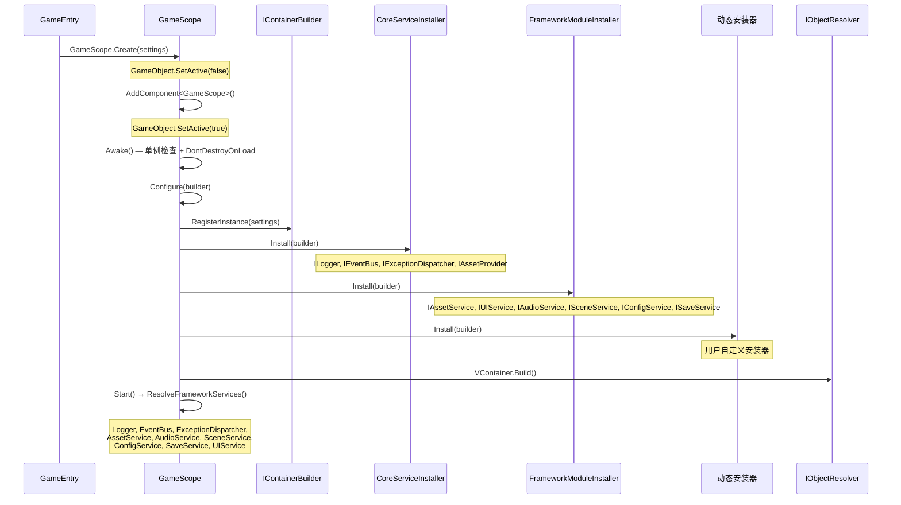
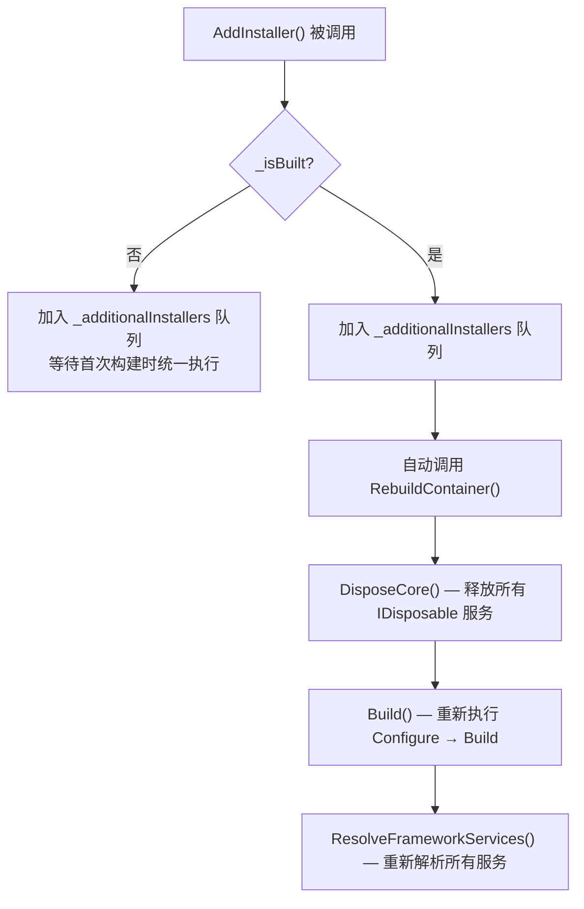

**GameScope** 是 CFramework 的心脏——一个继承自 VContainer `LifetimeScope` 的全局单例作用域，负责在游戏启动瞬间完成从依赖注入容器构建到全部框架服务就绪的完整链路。理解 GameScope 的创建时机、内部安装器的执行顺序以及服务解析流程，是掌握整个框架运转方式的第一步。本文将从生命周期阶段出发，逐层拆解 GameScope 从无到有的全过程。

Sources: [GameScope.cs](Runtime/Core/DI/GameScope.cs#L1-L210)

## 整体架构概览

在深入每一行代码之前，先从全局视角把握 GameScope 在 CFramework 中的定位。GameScope 持有一个 VContainer DI 容器，通过**安装器（Installer）** 模式将所有框架服务注册到容器中，再通过 **属性解析** 将服务暴露为全局可访问的公共属性。整个流程可以用以下时序图表示：



GameScope 的设计遵循 **单一职责的分层注册** 原则：核心基础设施服务（日志、事件、异常分发）由 `CoreServiceInstaller` 负责，业务功能模块（资源、UI、音频、场景、配置、存档）由 `FrameworkModuleInstaller` 负责，用户自定义服务通过动态安装器机制注入。三者按顺序执行，确保基础设施先于业务模块可用。

Sources: [GameScope.cs](Runtime/Core/DI/GameScope.cs#L16-L26), [CoreServiceInstaller.cs](Runtime/Core/DI/CoreServiceInstaller.cs#L1-L23), [FrameworkModuleInstaller.cs](Runtime/Core/DI/FrameworkModuleInstaller.cs#L1-L26)

## GameScope 的创建方式

GameScope 提供两种创建路径：**代码创建** 和 **场景预制体挂载**。两种方式最终都会触发相同的生命周期流程。

### 方式一：代码创建（推荐）

通过静态方法 `GameScope.Create()` 在运行时动态创建，这是 README 快速开始示例中展示的推荐方式。该方法内部执行了三个关键步骤：

1. 创建一个名为 `[GameScope]` 的 GameObject
2. **先将其设为非激活状态**（`SetActive(false)`），再添加 GameScope 组件
3. **重新激活**（`SetActive(true)`），触发 Unity 生命周期回调

```csharp
public static GameScope Create(FrameworkSettings settings = null)
{
    settings ??= FrameworkSettings.LoadDefault();
    var go = new GameObject("[GameScope]");
    go.SetActive(false);
    var scope = go.AddComponent<GameScope>();
    scope._settings = settings;
    go.SetActive(true);
    return scope;
}
```

先禁用再启用的操作并非多余——它确保 `AddComponent` 时不会立即触发 `Awake`，从而让 `_settings` 字段在 `Configure` 被调用之前就已赋值完毕。如果直接在激活状态添加组件，Unity 可能会在 `AddComponent` 返回之前就调用 `Awake`，导致 `Configure` 在 settings 为空的情况下执行。

Sources: [GameScope.cs](Runtime/Core/DI/GameScope.cs#L116-L125)

### 方式二：场景预制体挂载

将 GameScope 组件直接挂载到场景中的 GameObject 上，通过 Inspector 拖入 `FrameworkSettings` 引用。此方式适用于需要在编辑器中预配置的场景，但不具备 `Create` 方法的延迟激活保护。

### 典型入口代码

以下是一段完整的游戏入口示例，展示了创建 GameScope 后的标准操作序列：

```csharp
using CFramework;
using Cysharp.Threading.Tasks;
using UnityEngine;

public sealed class GameEntry : MonoBehaviour
{
    [SerializeField] private FrameworkSettings settings;

    private async UniTaskVoid Start()
    {
        // 1. 创建全局作用域
        var scope = GameScope.Create(settings);
        var container = scope.Container;

        // 2. 注册全局异常处理器
        var exceptionDispatcher = container.Resolve<IExceptionDispatcher>();
        exceptionDispatcher.RegisterHandler(ex =>
        {
            Debug.LogError($"[全局异常] {ex.Message}");
        });

        // 3. 初始化服务
        await UniTask.WhenAll(
            container.Resolve<IConfigService>().InitializeAsync(),
            container.Resolve<IAssetService>().InitializeAsync()
        );

        // 4. 加载初始场景
        var sceneService = container.Resolve<ISceneService>();
        await sceneService.LoadAsync("MainMenu");
    }
}
```

Sources: [README.md](README.md#L64-L97), [GameScope.cs](Runtime/Core/DI/GameScope.cs#L116-L125)

## 生命周期阶段详解

GameScope 继承自 VContainer 的 `LifetimeScope`，其生命周期阶段按以下顺序执行：

| 阶段 | 触发时机 | 核心职责 | 关键操作 |
|------|---------|---------|---------|
| **Create** | 外部调用 `GameScope.Create()` | 构造 GameObject、注入 settings | 创建对象 → 禁用 → 挂组件 → 启用 |
| **Awake** | Unity 自动调用 | 单例保障 + 触发容器构建 | 单例检查 → `DontDestroyOnLoad` → `base.Awake()` → 标记 `_isBuilt` |
| **Configure** | `base.Awake()` 内部触发 | 向 DI 容器注册所有服务 | 注册 settings → 执行内置安装器 → 执行动态安装器 |
| **Start** | Unity 自动调用 | 解析服务到公共属性 | `ResolveFrameworkServices()` |
| **OnDestroy** | GameObject 销毁时 | 清理单例引用 | 清除 `Instance` → 重置 `_isBuilt` → `base.OnDestroy()` |

Sources: [GameScope.cs](Runtime/Core/DI/GameScope.cs#L37-L66)

### Awake：单例保障与容器构建入口

```csharp
protected override void Awake()
{
    if (Instance != null && Instance != this)
    {
        Destroy(gameObject);
        return;
    }
    Instance = this;
    DontDestroyOnLoad(gameObject);
    base.Awake();    // ← 触发 Configure → Build
    _isBuilt = true;
}
```

`Awake` 的执行逻辑体现了三层保护：

- **重复实例销毁**：如果 `Instance` 已存在且不是当前实例，直接销毁多余的 GameObject，防止多个 GameScope 并存。
- **跨场景持久化**：`DontDestroyOnLoad` 确保 GameScope 在场景切换时不被销毁，其持有的所有单例服务也由此获得全局生命周期。
- **构建完成标记**：`_isBuilt = true` 是动态安装器机制的关键前提——只有标记为已构建后，后续调用 `AddInstaller` 才会触发容器重建。

`base.Awake()` 的调用会触发 VContainer 内部的 `Configure` → `Build` 链路，这是整个 DI 容器的构建起点。

Sources: [GameScope.cs](Runtime/Core/DI/GameScope.cs#L37-L50)

### Configure：服务注册的核心舞台

`Configure` 是 GameScope 最重要的方法，它定义了所有服务注入容器的完整顺序：

```csharp
protected override void Configure(IContainerBuilder builder)
{
    // 第一层：全局配置
    if (_settings != null)
        builder.RegisterInstance(_settings);
    else
        builder.RegisterInstance(FrameworkSettings.LoadDefault());

    // 第二层：框架内置服务
    foreach (var installer in _builtInInstallers)
        builder.Install(installer);

    // 第三层：动态注册的服务
    foreach (var installer in _additionalInstallers)
        builder.Install(installer);
}
```

**第一层** 将 `FrameworkSettings` 作为单例实例注册到容器。几乎所有框架模块（AssetService、AudioService 等）的构造函数都依赖此配置对象。如果 Inspector 中未指定 settings，会自动从 `Resources/FrameworkSettings` 加载默认配置。

**第二层** 执行两个内置安装器，注册顺序如下表所示：

| 安装器 | 注册服务 | 生命周期 | 说明 |
|--------|---------|---------|------|
| `CoreServiceInstaller` | `IExceptionDispatcher → DefaultExceptionDispatcher` | Singleton | 全局异常捕获与分发 |
| | `IEventBus → EventBus` | Singleton | 同步/异步事件发布订阅 |
| | `ILogger → UnityLogger` | Singleton | 分级日志输出 |
| | `IAssetProvider → AddressableAssetProvider` | Singleton | Addressables 底层封装 |
| `FrameworkModuleInstaller` | `IAssetService → AssetService` | Singleton (EntryPoint) | 资源管理与引用计数 |
| | `IUIService → UIService` | Singleton (EntryPoint) | UI 面板管理与导航栈 |
| | `IAudioService → AudioService` | Singleton (EntryPoint) | 双音轨 BGM 与分组音量 |
| | `ISceneService → SceneService` | Singleton (EntryPoint) | 场景加载与过渡动画 |
| | `IConfigService → ConfigService` | Singleton (EntryPoint) | ScriptableObject 配置表 |
| | `ISaveService → SaveService` | Singleton (EntryPoint) | 原子写入与加密存档 |

**第三层** 执行所有通过 `AddInstaller` 动态注册的安装器，为用户自定义服务提供注入入口。

值得注意的是，`FrameworkModuleInstaller` 中的服务使用 `InstallModule` 扩展方法注册，该方法内部调用 `RegisterEntryPoint`，这意味着这些服务不仅作为单例注册，还会被注册为 VContainer 的 **入口点**，VContainer 会在容器构建完成后自动实例化它们。而核心服务（`CoreServiceInstaller`）则使用标准的 `Register` 方法，它们在首次被解析时才会实例化。

Sources: [GameScope.cs](Runtime/Core/DI/GameScope.cs#L77-L95), [CoreServiceInstaller.cs](Runtime/Core/DI/CoreServiceInstaller.cs#L15-L21), [FrameworkModuleInstaller.cs](Runtime/Core/DI/FrameworkModuleInstaller.cs#L16-L24), [InstallerExtensions.cs](Runtime/Core/DI/InstallerExtensions.cs#L30-L37)

### Start：服务解析与属性暴露

```csharp
private void Start()
{
    ResolveFrameworkServices();
}

private void ResolveFrameworkServices()
{
    Logger = Container.Resolve<ILogger>();
    EventBus = Container.Resolve<IEventBus>();
    ExceptionDispatcher = Container.Resolve<IExceptionDispatcher>();
    AssetService = Container.Resolve<IAssetService>();
    AudioService = Container.Resolve<IAudioService>();
    SceneService = Container.Resolve<ISceneService>();
    ConfigService = Container.Resolve<IConfigService>();
    SaveService = Container.Resolve<ISaveService>();
    UIService = Container.Resolve<IUIService>();
}
```

`ResolveFrameworkServices` 将所有九个框架服务从容器中解析并赋值到 GameScope 的公共属性。选择在 `Start` 而非 `Awake` 中执行解析是一个重要的设计决策：`Awake` 阶段容器刚刚构建完成，VContainer 可能还在处理入口点的初始化；而 `Start` 在 `Awake` 之后、第一帧 `Update` 之前执行，确保容器已完全就绪。

这些公共属性提供了**便捷的全局访问**途径，开发者可以通过 `GameScope.Instance.AssetService` 快速获取服务引用，无需每次手动解析容器。

Sources: [GameScope.cs](Runtime/Core/DI/GameScope.cs#L52-L111), [GameScope.cs](Runtime/Core/DI/GameScope.cs#L127-L139)

## 安装器体系：服务注册的积木

CFramework 的安装器体系基于 VContainer 的 `IInstaller` 接口，遵循**策略模式**：每个安装器封装一组相关的服务注册逻辑，GameScope 只需按顺序调用 `Install` 即可。

### InstallModule 扩展方法

`FrameworkModuleInstaller` 使用 `InstallModule<TInterface, TImplementation>` 扩展方法进行注册，其内部实现如下：

```csharp
public static RegistrationBuilder InstallModule<TInterface, TImplementation>(
    this IContainerBuilder builder,
    Lifetime lifetime = Lifetime.Singleton)
    where TImplementation : class, TInterface
    where TInterface : class
{
    return builder.RegisterEntryPoint<TImplementation>(lifetime).As<TInterface>();
}
```

该方法将实现类注册为 **EntryPoint**（VContainer 会在容器构建时自动创建实例），同时映射到接口类型。与普通的 `Register` 相比，EntryPoint 注册确保服务在容器构建完成后立即实例化，而不是延迟到首次解析时。这对于需要在启动时执行初始化逻辑的服务（如事件总线的订阅注册、异常分发器的全局钩子安装等）至关重要。

### ActionInstaller：轻量级委托安装器

当注册逻辑简单到不值得创建一个独立的 Installer 类时，可以使用 `ActionInstaller`：

```csharp
// 快速注册一个自定义服务
GameScope.AddInstaller(new ActionInstaller(b => 
    b.Register<IGameDataService, GameDataService>(Lifetime.Singleton)));

// 或者使用更简洁的委托重载
GameScope.AddInstaller(b => 
    b.Register<IGameDataService, GameDataService>(Lifetime.Singleton));
```

`ActionInstaller` 内部仅持有一个 `Action<IContainerBuilder>` 委托，在 `Install` 被调用时执行该委托。它本质上是对 `IInstaller` 的函数式包装。

Sources: [InstallerExtensions.cs](Runtime/Core/DI/InstallerExtensions.cs#L1-L39), [ActionInstaller.cs](Runtime/Core/DI/ActionInstaller.cs#L1-L32)

## 动态安装器机制

GameScope 最灵活的设计之一是支持在**任意时刻**动态添加安装器，并自动处理容器重建。

### 工作原理



关键代码如下：

```csharp
public static void AddInstaller(params IInstaller[] installer)
{
    foreach (var i in installer)
        _additionalInstallers.Add(i);

    // 如果 GameScope 已构建，触发容器重建
    if (Instance != null && Instance._isBuilt)
        Instance.RebuildContainer();
}

public void RebuildContainer()
{
    DisposeCore();              // 释放所有 IDisposable 服务
    Build();                    // 重新 Configure → Build
    ResolveFrameworkServices(); // 重新解析服务到属性
}
```

**重建的代价**是值得注意的：`RebuildContainer` 会释放所有实现了 `IDisposable` 的已注册服务，然后重新创建它们。这意味着重建后所有服务的内部状态都会丢失。因此，动态安装器的添加通常应在游戏启动的早期阶段完成，避免在运行时中后期频繁触发重建。

### 域重载保护

Unity 编辑器在进入 Play Mode 时可能触发 **Domain Reload**，导致静态字段保留上一次 Play 的残留数据。GameScope 通过 `[RuntimeInitializeOnLoadMethod]` 特性确保静态安装器列表在每次加载时被清空：

```csharp
[RuntimeInitializeOnLoadMethod(RuntimeInitializeLoadType.SubsystemRegistration)]
private static void ResetStaticState()
{
    _additionalInstallers.Clear();
}
```

这一机制防止了编辑器反复进入 Play Mode 时，动态安装器被重复累积的隐患。

Sources: [GameScope.cs](Runtime/Core/DI/GameScope.cs#L141-L206), [GameScope.cs](Runtime/Core/DI/GameScope.cs#L71-L75)

## SceneScope：场景级生命周期管理

与 GameScope 的全局作用域互补，`SceneScope` 提供了场景级别的依赖注入作用域。它同样继承自 VContainer 的 `LifetimeScope`，但默认不在 `Configure` 中注册任何服务：

```csharp
public class SceneScope : LifetimeScope
{
    protected override void Configure(IContainerBuilder builder)
    {
        // 子类重写以注册场景特定服务
    }
}
```

SceneScope 的设计意图是让开发者创建子类来注册场景特定的服务，同时通过 VContainer 的父子作用域机制自动获得对 GameScope 容器中所有服务的访问能力。当场景卸载时，SceneScope 及其注册的所有服务会随之销毁，实现场景级资源的自动清理。

关于 SceneScope 的深入用法，将在 [依赖注入体系：GameScope、SceneScope 与动态安装器机制](5-yi-lai-zhu-ru-ti-xi-gamescope-scenescope-yu-dong-tai-an-zhuang-qi-ji-zhi) 中详细展开。

Sources: [SceneScope.cs](Runtime/Core/DI/SceneScope.cs#L1-L16)

## FrameworkSettings 在 GameScope 中的角色

`FrameworkSettings` 是一个 ScriptableObject 配置资产，在 `Configure` 阶段被注册为容器单例。它是连接编辑器配置与运行时服务的桥梁。

GameScope 对 settings 的处理遵循**显式优先、兜底默认**策略：

```csharp
if (_settings != null)
    builder.RegisterInstance(_settings);
else
    builder.RegisterInstance(FrameworkSettings.LoadDefault());
```

当通过 `GameScope.Create(settings)` 传入 settings 时使用传入值；否则从 `Resources/FrameworkSettings` 路径加载。如果该路径下也不存在配置资产，则使用代码中的默认值并输出警告日志。

框架中多个服务的构造函数都依赖 FrameworkSettings，例如 `AssetService` 使用 `settings.MemoryBudgetMB` 初始化内存预算。有关配置项的完整说明，参见 [FrameworkSettings 全局配置详解](3-frameworksettings-quan-ju-pei-zhi-xiang-jie)。

Sources: [GameScope.cs](Runtime/Core/DI/GameScope.cs#L79-L88), [FrameworkSettings.cs](Runtime/Core/FrameworkSettings.cs#L1-L57)

## 完整生命周期流程总结

```mermaid
flowchart LR
    subgraph 创建阶段
        A["new GameObject"] --> B["SetActive(false)"]
        B --> C["AddComponent&lt;GameScope&gt;"]
        C --> D["赋值 _settings"]
        D --> E["SetActive(true)"]
    end

    subgraph Awake阶段
        E --> F["单例检查"]
        F --> G["DontDestroyOnLoad"]
        G --> H["base.Awake()"]
        H --> I["Configure()"]
        I --> J["注册 FrameworkSettings"]
        J --> K["CoreServiceInstaller"]
        K --> L["FrameworkModuleInstaller"]
        L --> M["动态安装器"]
        M --> N["VContainer.Build()"]
        N --> O["_isBuilt = true"]
    end

    subgraph Start阶段
        O --> P["ResolveFrameworkServices()"]
        P --> Q["全部服务就绪"]
    end
```



将以上流程归纳为一个简明的检查清单，开发者在排查启动问题时可以逐一验证：

| 检查项 | 验证方式 | 常见问题 |
|--------|---------|---------|
| GameScope 实例是否唯一 | `GameScope.Instance != null` | 场景中存在多个 GameScope |
| FrameworkSettings 是否加载 | 检查日志中是否有 "not found" 警告 | Resources 下缺少配置文件 |
| 内置服务是否注册 | `Container.Resolve<ILogger>()` 不抛异常 | 安装器执行顺序被覆盖 |
| 公共属性是否已解析 | `GameScope.Instance.AssetService != null` | 在 Start 之前访问了服务属性 |
| 动态安装器是否生效 | 检查 `_additionalInstallers.Count` | 在 Awake 后添加但未触发重建 |

Sources: [GameScope.cs](Runtime/Core/DI/GameScope.cs#L1-L210)

## 下一步阅读

至此，你已经了解了 GameScope 如何创建 DI 容器并完成全部服务的注册与解析。以下是推荐的后续阅读路径：

- **[依赖注入体系：GameScope、SceneScope 与动态安装器机制](5-yi-lai-zhu-ru-ti-xi-gamescope-scenescope-yu-dong-tai-an-zhuang-qi-ji-zhi)** — 深入理解 VContainer 集成、父子作用域关系、以及动态安装器的高级用法
- **[事件总线：同步/异步发布订阅与 R3 响应式集成](6-shi-jian-zong-xian-tong-bu-yi-bu-fa-bu-ding-yue-yu-r3-xiang-ying-shi-ji-cheng)** — 了解 GameScope 中 `IEventBus` 的完整能力
- **[资源管理服务：Addressables 封装、引用计数与生命周期绑定](10-zi-yuan-guan-li-fu-wu-addressables-feng-zhuang-yin-yong-ji-shu-yu-sheng-ming-zhou-qi-bang-ding)** — 深入理解作为 EntryPoint 的 AssetService 的工作原理