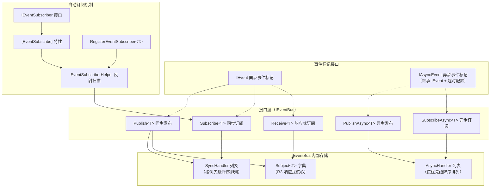

事件总线是 CFramework 核心基础设施的通信枢纽——它为游戏系统间的解耦通信提供了**同步发布订阅**、**异步发布订阅**与 **R3 响应式流**三种范式，统一在 `IEventBus` 接口之下。无论是简单的状态通知、耗时的异步操作，还是需要链式变换的响应式数据流，事件总线都能以类型安全的方式承载，并通过优先级排序、异常隔离、超时保护等机制确保通信的健壮性。

Sources: [IEventBus.cs](Runtime/Core/Event/IEventBus.cs#L1-L44), [EventBus.cs](Runtime/Core/Event/EventBus.cs#L1-L223)

## 架构总览：三层通信模型

事件总线的架构可以用以下三层模型来理解——从接口契约到底层存储，再到与依赖注入系统的集成：



三种通信范式的核心区别如下：

| 特性 | 同步发布订阅 | 异步发布订阅 | R3 响应式订阅 |
|---|---|---|---|
| **事件标记** | `IEvent` | `IAsyncEvent` | `IEvent` |
| **发布方法** | `Publish<T>` | `PublishAsync<T>` | 通过 `Publish<T>` 触发 |
| **订阅方法** | `Subscribe<T>` | `SubscribeAsync<T>` | `Receive<T>()` |
| **处理器签名** | `Action<T>` | `Func<T, CancellationToken, UniTask>` | R3 `Observable<T>` 操作链 |
| **执行模式** | 即时同步遍历 | 顺序 await 异步 | Subject.OnNext 推送 |
| **超时保护** | 无 | 事件级可配置（默认 5 秒） | 无 |
| **取消支持** | `IDisposable` | `IDisposable` + `CancellationToken` | `IDisposable`（R3 订阅） |
| **典型场景** | 状态变更通知 | 网络请求、资源加载后处理 | 数据变换、过滤、节流 |

Sources: [IEvent.cs](Runtime/Core/Event/IEvent.cs#L1-L22), [IEventBus.cs](Runtime/Core/Event/IEventBus.cs#L1-L44), [EventBus.cs](Runtime/Core/Event/EventBus.cs#L1-L223)

## 事件定义：IEvent 与 IAsyncEvent

事件总线要求所有事件类型实现标记接口。CFramework 提供两个层次的接口：

**`IEvent`**——同步事件的标记接口，不包含任何成员，支持 struct 和 class 两种声明方式。使用 struct 可以避免堆分配和 GC 压力，框架内部通过 `in T` 参数传递确保 struct 事件在发布时不产生装箱。

**`IAsyncEvent`**——异步事件的标记接口，继承自 `IEvent`，并提供一个可重写的 `Timeout` 属性（默认 5 秒）。异步事件在发布时会将此超时与调用方传入的 `CancellationToken` 组合为联动取消令牌，任何一方触发取消都会中止处理器链。

```csharp
// 同步事件（推荐使用 struct）
public struct PlayerLevelUpEvent : IEvent
{
    public int Level;
    public int PreviousLevel;
}

// 异步事件（通常使用 class，因为需要携带更多上下文）
public class SaveCompletedEvent : IAsyncEvent
{
    public string SlotName;
    public TimeSpan Timeout => TimeSpan.FromSeconds(10); // 自定义超时
}
```

Sources: [IEvent.cs](Runtime/Core/Event/IEvent.cs#L1-L22)

## 同步发布订阅：Publish 与 Subscribe

同步通道是事件总线最基础的使用方式。发布时，EventBus 依次执行两个阶段：**先触发 R3 Subject 推送**（供 `Receive<T>()` 的响应式订阅者消费），**再遍历同步处理器列表**（按优先级降序执行）。这种两阶段设计保证了无论订阅方式如何，所有订阅者都能收到事件。

### 处理器优先级与插入排序

订阅时通过 `priority` 参数指定执行优先级，**值越大越先执行**。EventBus 在内部维护一个按优先级降序排列的有序列表，插入时使用 `FindIndex` 定位插入位置：

```csharp
// 优先级10最先执行，0最后执行
_eventBus.Subscribe<PlayerLevelUpEvent>(OnLevelUpHighPriority, priority: 10);
_eventBus.Subscribe<PlayerLevelUpEvent>(OnLevelUpNormal, priority: 5);
_eventBus.Subscribe<PlayerLevelUpEvent>(OnLevelUpLow, priority: 0);
```

### 异常隔离

每个同步处理器的调用都被独立的 `try-catch` 包裹。当某个处理器抛出异常时，EventBus 捕获该异常并通过 `OnHandlerError` 回调通知上层，**但不阻断后续处理器的执行**。这意味着即使一个优先级较高的处理器失败，低优先级的处理器仍会正常运行：

```csharp
_eventBus.OnHandlerError = (ex, evt, handler) =>
{
    Debug.LogError($"事件处理器异常: {ex.Message}, 事件类型: {evt.GetType().Name}");
};
```

`OnHandlerError` 回调接收三个参数：异常对象 `ex`、触发异常的事件实例 `evt`、以及出错的处理器委托 `handler`，方便精确定位问题来源。

Sources: [EventBus.cs](Runtime/Core/Event/EventBus.cs#L38-L105)

## 异步发布订阅：PublishAsync 与 SubscribeAsync

异步通道专为需要 `await` 的场景设计——网络响应等待、资源加载完成、持久化写入等。异步事件要求实现 `IAsyncEvent` 接口。

### 顺序执行与超时保护

与同步通道不同，异步处理器的执行是**严格顺序的**——每个处理器 `await` 完成后才执行下一个。这种设计确保了异步操作的确定性顺序，但也意味着单个慢处理器会阻塞整个链路。

为防止处理器无限挂起，EventBus 将事件自身的 `Timeout` 与调用方传入的 `CancellationToken` 组合为 `LinkedTokenSource`。当超时触发时，抛出 `TimeoutException` 并通过 `OnHandlerError` 回调上报；当调用方取消时，传播 `OperationCanceledException`：

```csharp
// 异步处理器：模拟保存后通知
_eventBus.SubscribeAsync<SaveCompletedEvent>(async (evt, ct) =>
{
    await UploadToCloudAsync(evt.SlotName, ct);
}, priority: 5);

// 发布异步事件
await _eventBus.PublishAsync(new SaveCompletedEvent { SlotName = "slot_1" });
```

Sources: [EventBus.cs](Runtime/Core/Event/EventBus.cs#L125-L193)

## R3 响应式订阅：Receive

`Receive<T>()` 方法返回一个 R3 的 `Observable<T>`，允许开发者使用完整的响应式编程范式处理事件流。框架内部使用 `Subject<T>` 作为广播源，在 `Publish<T>` 的第一阶段被触发。

这一设计使得事件可以被 R3 丰富的操作符链处理——过滤、节流、缓冲、变换：

```csharp
// 仅响应等级大于10的升级事件，且在500ms内去抖
_eventBus.Receive<PlayerLevelUpEvent>()
    .Where(e => e.Level > 10)
    .ThrottleFirst(TimeSpan.FromMilliseconds(500))
    .Subscribe(e => ShowLevelUpEffect(e.Level))
    .AddTo(gameObject); // 绑定 GameObject 生命周期
```

`Subject<T>` 按需创建——首次调用 `Receive<T>()` 时才会实例化，避免为从未被响应式订阅的事件类型分配内存。

Sources: [EventBus.cs](Runtime/Core/Event/EventBus.cs#L107-L121)

## 自动订阅机制：IEventSubscriber 与 [EventSubscribe]

手动调用 `Subscribe` 管理订阅生命周期容易遗漏取消操作。CFramework 通过 **`IEventSubscriber` + `[EventSubscribe]` 特性 + `EventSubscriberHelper` 反射扫描**的组合，提供了声明式的自动订阅方案。

### 工作流程

```mermaid
sequenceDiagram
    participant Builder as VContainer Builder
    participant Resolver as DI Resolver
    participant Helper as EventSubscriberHelper
    participant Bus as IEventBus
    participant Subscriber as IEventSubscriber 实例

    Builder->>Builder: RegisterEventSubscriber&lt;T&gt;()
    Builder->>Builder: RegisterBuildCallback 注册回调
    Builder->>Resolver: 构建容器
    Resolver->>Subscriber: Resolve&lt;T&gt;() 创建实例
    Resolver->>Helper: AutoSubscribe(subscriber, eventBus)
    Helper->>Helper: 反射扫描 [EventSubscribe] 方法
    Helper->>Helper: 缓存扫描结果（ConcurrentDictionary）
    Helper->>Bus: Subscribe(handler, priority)
    Bus-->>Subscriber: IDisposable → 加入 EventSubscriptions
    Note over Subscriber: CompositeDisposable 统一管理
```

### 使用方式

第一步，让服务实现 `IEventSubscriber` 接口，并用 `[EventSubscribe]` 标记处理方法：

```csharp
public class AchievementService : IEventSubscriber
{
    public CompositeDisposable EventSubscriptions { get; } = new();

    [EventSubscribe(priority: 5)]
    private void OnPlayerLevelUp(PlayerLevelUpEvent evt)
    {
        CheckLevelAchievements(evt.Level);
    }

    [EventSubscribe(priority: 10)]
    private void OnEnemyDefeated(EnemyDefeatedEvent evt)
    {
        UpdateKillCounter(evt.EnemyId);
    }
}
```

第二步，在 VContainer 安装器中注册：

```csharp
public class GameInstaller : IInstaller
{
    public void Install(IContainerBuilder builder)
    {
        // 方式一：直接注册实现类型
        builder.RegisterEventSubscriber<AchievementService>();

        // 方式二：注册接口映射（支持依赖注入时按接口解析）
        builder.RegisterEventSubscriber<IAchievementService, AchievementService>();
    }
}
```

### 反射缓存与验证

`EventSubscriberHelper` 使用 `ConcurrentDictionary<Type, List<SubscribeInfo>>` 缓存反射扫描结果，同一类型只扫描一次。扫描过程包含严格的签名验证：

- **参数数量校验**：`[EventSubscribe]` 标记的方法必须恰好有一个参数，否则抛出 `InvalidOperationException`
- **类型约束校验**：参数类型必须实现 `IEvent` 接口，否则抛出 `InvalidOperationException`
- **方法可见性**：支持 `public` 和 `non-public`（private/protected）方法，使用 `BindingFlags.FlattenHierarchy` 确保继承层次的方法也能被发现

`[EventSubscribe]` 特性继承自 Unity 的 `PreserveAttribute`，防止 IL2CPP 代码裁剪将被标记的方法误删。

Sources: [IEventSubscriber.cs](Runtime/Core/Event/IEventSubscriber.cs#L1-L17), [EventSubscribeAttribute.cs](Runtime/Core/Event/EventSubscribeAttribute.cs#L1-L24), [EventSubscriberHelper.cs](Runtime/Core/Event/EventSubscriberHelper.cs#L1-L102), [EventSubscriberExtensions.cs](Runtime/Core/Event/EventSubscriberExtensions.cs#L1-L65)

## DI 注册与生命周期

`EventBus` 作为**单例服务**在 `CoreServiceInstaller` 中注册到 VContainer 容器，随 `GameScope` 的生命周期创建和销毁：

```csharp
// CoreServiceInstaller.cs
builder.Register<IEventBus, EventBus>(Lifetime.Singleton);
```

`EventBus` 实现了 `IDisposable`，在 `Dispose` 时会清理所有 `Subject`、同步处理器和异步处理器列表，并使用 `lock` 确保与并发的 `Publish`/`Subscribe` 操作不产生竞态条件。`GameScope` 销毁时，VContainer 容器自动调用 `Dispose`。

`GameScope` 在 `Start` 阶段将 `IEventBus` 解析到公共属性 `EventBus` 上，因此任何组件都可以通过 `GameScope.Instance.EventBus` 直接访问，也可以通过构造函数注入获取。

Sources: [CoreServiceInstaller.cs](Runtime/Core/DI/CoreServiceInstaller.cs#L1-L23), [EventBus.cs](Runtime/Core/Event/EventBus.cs#L25-L34), [GameScope.cs](Runtime/Core/DI/GameScope.cs#L100-L111)

## 线程安全设计

EventBus 的所有公共方法都使用 `lock (_lock)` 保护内部状态，确保在多线程环境下的安全性。特别的设计细节包括：

- **快照读取**：`Publish` 和 `PublishAsync` 在锁内复制处理器列表后释放锁，再在锁外遍历执行，避免持锁期间处理器回调中再次操作 EventBus 导致死锁
- **原子 Dispose**：`Dispose` 方法在单一锁内清理所有内部容器，防止与正在进行的 Publish/Subscribe 操作产生竞态
- **延迟创建 Subject**：`Receive<T>()` 的 `Subject<T>` 在首次调用时才创建，创建操作在锁内完成

Sources: [EventBus.cs](Runtime/Core/Event/EventBus.cs#L40-L73), [EventBus.cs](Runtime/Core/Event/EventBus.cs#L107-L121), [EventBus.cs](Runtime/Core/Event/EventBus.cs#L25-L34)

## API 速查表

### IEventBus 接口方法

| 方法 | 签名 | 说明 |
|---|---|---|
| **Publish** | `void Publish<T>(in T evt) where T : IEvent` | 同步发布事件，所有订阅者立即执行 |
| **PublishAsync** | `UniTask PublishAsync<T>(T evt, CancellationToken ct = default) where T : IAsyncEvent` | 异步发布事件，顺序 await 所有处理器 |
| **Subscribe** | `IDisposable Subscribe<T>(Action<T> handler, int priority = 0) where T : IEvent` | 同步订阅，返回可释放的订阅令牌 |
| **SubscribeAsync** | `IDisposable SubscribeAsync<T>(Func<T, CancellationToken, UniTask> handler, int priority = 0) where T : IAsyncEvent` | 异步订阅，处理器接收取消令牌 |
| **Receive** | `Observable<T> Receive<T>() where T : IEvent` | 获取 R3 响应式流，支持完整操作符链 |

### IEventBus 属性

| 属性 | 类型 | 说明 |
|---|---|---|
| **OnHandlerError** | `Action<Exception, IEvent, object>` | 处理器异常回调，接收异常、事件实例和处理器委托 |

Sources: [IEventBus.cs](Runtime/Core/Event/IEventBus.cs#L1-L44)

## 延伸阅读

- 了解 EventBus 如何作为核心服务被注册和初始化：[依赖注入体系：GameScope、SceneScope 与动态安装器机制](5-yi-lai-zhu-ru-ti-xi-gamescope-scenescope-yu-dong-tai-an-zhuang-qi-ji-zhi)
- 了解异常回调如何与全局异常分发器协同：[全局异常分发器：统一捕获 UniTask 与 R3 未处理异常](7-quan-ju-yi-chang-fen-fa-qi-tong-bu-huo-unitask-yu-r3-wei-chu-li-yi-chang)
- 了解另一种基于响应式的数据共享方式：[黑板系统：类型安全的键值对数据共享与响应式观察](8-hei-ban-xi-tong-lei-xing-an-quan-de-jian-zhi-dui-shu-ju-gong-xiang-yu-xiang-ying-shi-guan-cha)