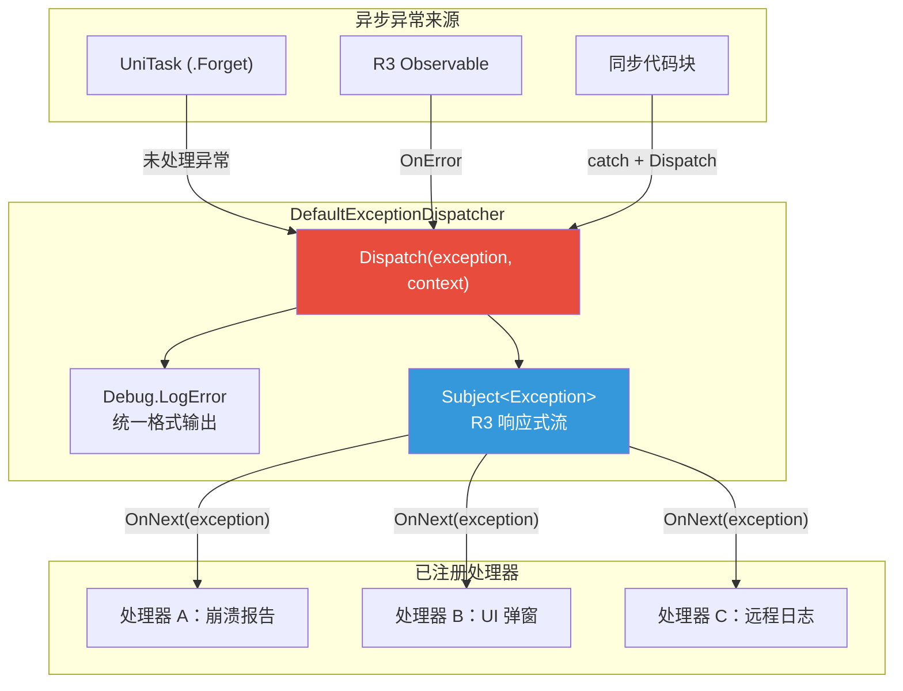
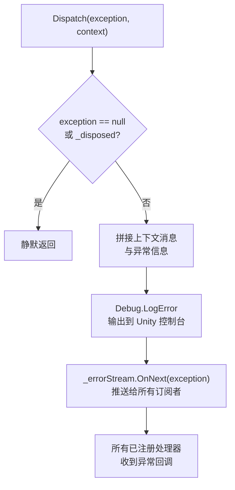
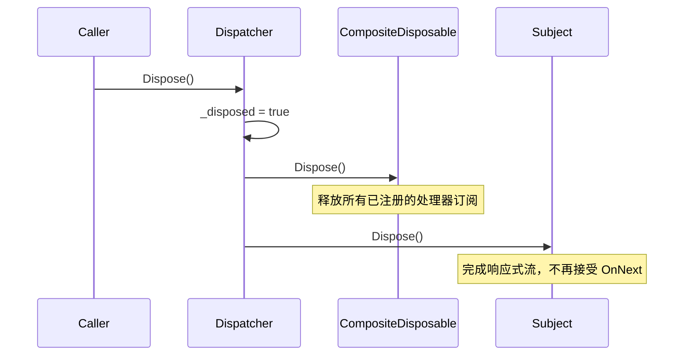

在现代 Unity 异步编程中，UniTask 与 R3（Reactive Extensions for C#）已成为两大核心工具。然而，异步上下文中的异常常常静默丢失——UniTask 的 `.Forget()` 调用不会将异常传播到调用者，R3 Observable 的 `OnError` 若未订阅则被吞没。**CFramework 的全局异常分发器**正是为解决这一问题而设计的：它提供了一个类型安全的、基于响应式流的异常汇聚与分发机制，确保任何通过 `Dispatch` 方法报告的异常都能被统一记录并分播给所有注册的处理器。

Sources: [IExceptionDispatcher.cs](Runtime/Core/Exception/IExceptionDispatcher.cs#L1-L25), [DefaultExceptionDispatcher.cs](Runtime/Core/Exception/DefaultExceptionDispatcher.cs#L1-L45)

## 设计动机与问题背景

### 异步异常的"黑洞"问题

当你在 UniTask 中使用 `.Forget()` 触发即发即弃的异步操作时，该方法返回的 `UniTask` 不会被 `await`，其内部抛出的异常不会以任何形式传播到调用栈。类似地，R3 的 `Subject<T>` 或 `Observable<T>` 在产生 `OnError` 通知时，若下游没有订阅错误通道，异常便被无声吞没。在生产环境中，这意味着关键的游戏逻辑错误（如网络请求失败、资源加载异常）可能完全不可见，导致极难排查的隐性 Bug。

CFramework 的异常分发器采用**发布-订阅（Publish-Subscribe）** 模式，将所有异常汇聚到一个中心化的 `Subject<Exception>` 流中，再通过 R3 的响应式订阅机制分发给所有已注册的处理器。这种设计保证：

- **零丢失**：任何通过 `Dispatch` 提交的异常至少会被 `Debug.LogError` 记录
- **可扩展**：第三方模块可以在运行时动态注册自己的异常处理器
- **可取消**：每个处理器返回 `IDisposable`，随时可退订

Sources: [IExceptionDispatcher.cs](Runtime/Core/Exception/IExceptionDispatcher.cs#L6-L8), [DefaultExceptionDispatcher.cs](Runtime/Core/Exception/DefaultExceptionDispatcher.cs#L12-L34)

## 架构总览



上图展示了异常从各异步来源流经分发器再到处理器的完整数据流。`Dispatch` 方法是整个管道的入口——它同时完成两件事：**同步写入 Unity 控制台日志**，以及**推送到 R3 Subject 流**以通知所有订阅者。

Sources: [DefaultExceptionDispatcher.cs](Runtime/Core/Exception/DefaultExceptionDispatcher.cs#L25-L34)

## 接口设计：IExceptionDispatcher

`IExceptionDispatcher` 接口极其精简，仅暴露两个方法，体现了**最小接口原则**：

| 方法 | 签名 | 职责 |
|------|------|------|
| **Dispatch** | `void Dispatch(Exception exception, string context = null)` | 分发异常。`context` 参数为可选的上下文标签（如 `"AssetService"`、`"NetworkModule"`），会被拼接到日志消息中 |
| **RegisterHandler** | `IDisposable RegisterHandler(Action<Exception> handler)` | 注册异常处理器，返回 `IDisposable` 用于取消订阅 |

`context` 参数的设计值得关注——它允许调用者在分发异常时携带来源标识，使得日志输出从泛泛的 `[CFramework Exception]` 变为 `[CFramework Exception] Context: AssetService`，大幅提升问题定位效率。

Sources: [IExceptionDispatcher.cs](Runtime/Core/Exception/IExceptionDispatcher.cs#L1-L25)

## 默认实现：DefaultExceptionDispatcher

### 核心数据结构

`DefaultExceptionDispatcher` 是框架内置的唯一实现，它内部依赖两个 R3 基础设施：

| 字段 | 类型 | 用途 |
|------|------|------|
| `_errorStream` | `Subject<Exception>` | R3 主题，作为异常广播的核心通道 |
| `_handlers` | `CompositeDisposable` | R3 组合可释放对象，集中管理所有订阅的生命周期 |
| `_disposed` | `bool` | 释放标志，防止 Dispose 后的无效操作 |

### Dispatch 方法的执行流程



`Dispatch` 方法的实现体现了**防御性编程**思想：空异常或已释放状态下直接返回，不会抛出二次异常。日志输出格式为：

```
[CFramework Exception] Context: {context}
{ExceptionType}: {Message}
{StackTrace}
```

Sources: [DefaultExceptionDispatcher.cs](Runtime/Core/Exception/DefaultExceptionDispatcher.cs#L25-L34)

### RegisterHandler 与生命周期管理

`RegisterHandler` 的实现将 `Action<Exception>` 包装为 R3 订阅，并统一加入 `CompositeDisposable`：

```csharp
// 注册处理器（伪代码展示核心逻辑）
public IDisposable RegisterHandler(Action<Exception> handler)
{
    if (handler == null) return Disposable.Empty;
    var subscription = _errorStream.Subscribe(handler);
    _handlers.Add(subscription);
    return subscription;
}
```

关键设计点：

- **空处理器防御**：传入 `null` 处理器时返回 `Disposable.Empty` 而非抛出异常，保证调用方代码简洁
- **双重释放保障**：返回的 `subscription` 可以单独 `Dispose()` 取消单个处理器；也可以在分发器整体 `Dispose()` 时通过 `CompositeDisposable` 批量清理所有订阅
- **R3 Subject 语义**：`Subject<T>` 是热可观察序列，只推送订阅后产生的数据，不会回放历史异常

Sources: [DefaultExceptionDispatcher.cs](Runtime/Core/Exception/DefaultExceptionDispatcher.cs#L36-L43), [DefaultExceptionDispatcher.cs](Runtime/Core/Exception/DefaultExceptionDispatcher.cs#L16-L23)

### Dispose 语义

`DefaultExceptionDispatcher` 实现了 `IDisposable`，其 `Dispose` 方法遵循标准的释放模式：



Dispose 后再调用 `Dispatch` 不会抛出异常，而是静默返回——这一行为通过 `_disposed` 标志实现，确保组件释放顺序不影响系统稳定性。

Sources: [DefaultExceptionDispatcher.cs](Runtime/Core/Exception/DefaultExceptionDispatcher.cs#L16-L23), [DefaultExceptionDispatcher.cs](Runtime/Core/Exception/DefaultExceptionDispatcher.cs#L27)

## 依赖注入集成

### 注册方式

异常分发器在框架启动时由 `CoreServiceInstaller` 注册为**单例**服务，是整个 DI 容器中最先注册的核心基础设施之一：

```csharp
public void Install(IContainerBuilder builder)
{
    builder.Register<IExceptionDispatcher, DefaultExceptionDispatcher>(Lifetime.Singleton);
    builder.Register<IEventBus, EventBus>(Lifetime.Singleton);
    builder.Register<ILogger, UnityLogger>(Lifetime.Singleton);
    builder.Register<IAssetProvider, AddressableAssetProvider>(Lifetime.Singleton);
}
```

这意味着任何通过 VContainer 注入 `IExceptionDispatcher` 的服务，拿到的都是同一个分发器实例。

Sources: [CoreServiceInstaller.cs](Runtime/Core/DI/CoreServiceInstaller.cs#L1-L23)

### 在 GameScope 中的解析

`GameScope` 在 `Start` 阶段通过 `ResolveFrameworkServices` 将异常分发器解析到公共属性 `ExceptionDispatcher`，使其成为全局可访问的入口：

```csharp
public IExceptionDispatcher ExceptionDispatcher { get; private set; }
```

Sources: [GameScope.cs](Runtime/Core/DI/GameScope.cs#L100-L111), [GameScope.cs](Runtime/Core/DI/GameScope.cs#L131)

## 实际使用模式

### 模式一：在 UniTask 中捕获并分发

这是最常见的用法——在 `.Forget()` 前的异步方法中包裹 try-catch，将异常转发给分发器：

```csharp
public class GameBattleController
{
    private readonly IExceptionDispatcher _dispatcher;

    public GameBattleController(IExceptionDispatcher dispatcher)
    {
        _dispatcher = dispatcher;
    }

    public void StartBattle()
    {
        RunBattleFlowAsync().Forget();
    }

    private async UniTaskVoid RunBattleFlowAsync()
    {
        try
        {
            var boss = await LoadBossAsync();
            await boss.PlayIntroAnimationAsync();
            await WaitForBattleEndAsync();
        }
        catch (Exception ex)
        {
            // 统一分发，附带上下文标识
            _dispatcher.Dispatch(ex, "BattleSystem");
        }
    }
}
```

Sources: [IExceptionDispatcher.cs](Runtime/Core/Exception/IExceptionDispatcher.cs#L14-L16)

### 模式二：注册自定义异常处理器

框架使用者和第三方模块可以在运行时注册自己的异常处理逻辑，例如崩溃报告或远程日志上传：

```csharp
public class CrashReportModule : IInstaller
{
    public void Install(IContainerBuilder builder)
    {
        builder.Register<CrashReportService>(Lifetime.Singleton)
               .AsImplementedInterfaces()
               .AsSelf();
    }
}

public class CrashReportService : IStartable, IDisposable
{
    private readonly IExceptionDispatcher _dispatcher;
    private IDisposable _subscription;

    public CrashReportService(IExceptionDispatcher dispatcher)
    {
        _dispatcher = dispatcher;
    }

    public void Start()
    {
        // 注册处理器，保存订阅引用
        _subscription = _dispatcher.RegisterHandler(ex =>
        {
            UploadCrashReportAsync(ex).Forget();
        });
    }

    public void Dispose()
    {
        // 取消订阅，不再接收异常通知
        _subscription?.Dispose();
    }
}
```

Sources: [IExceptionDispatcher.cs](Runtime/Core/Exception/IExceptionDispatcher.cs#L20-L24), [DefaultExceptionDispatcher.cs](Runtime/Core/Exception/DefaultExceptionDispatcher.cs#L36-L43)

### 模式三：与 EventBus 错误回调联动

框架的 `EventBus` 提供了 `OnHandlerError` 回调，可以将事件处理器中的异常桥接到异常分发器：

```csharp
// 在 GameScope 或引导代码中建立桥接
var eventBus = Container.Resolve<IEventBus>();
var dispatcher = Container.Resolve<IExceptionDispatcher>();

eventBus.OnHandlerError = (ex, evt, handler) =>
{
    dispatcher.Dispatch(ex, $"EventBus<{evt.GetType().Name}>");
};
```

这种桥接模式使得 EventBus 的处理器异常也能通过统一的分发器管道流转，避免遗漏。

Sources: [IEventBus.cs](Runtime/Core/Event/IEventBus.cs#L15-L16), [EventBus.cs](Runtime/Core/Event/EventBus.cs#L36), [EventBus.cs](Runtime/Core/Event/EventBus.cs#L65-L73)

## 线程安全与注意事项

| 关注点 | 行为 |
|--------|------|
| **线程安全** | `DefaultExceptionDispatcher` 依赖 R3 的 `Subject<T>`，其 `OnNext` 在调用线程同步执行所有订阅者回调。若在非主线程调用 `Dispatch`，需确保处理器内部不直接操作 Unity API |
| **异常重入** | 若处理器内部抛出异常，R3 Subject 会终止并变为 Faulted 状态。建议处理器内部始终包裹 try-catch |
| **Dispose 顺序** | `GameScope` 销毁时会触发 VContainer 的生命周期清理，`DefaultExceptionDispatcher.Dispose()` 将释放所有处理器订阅。此后任何 `Dispatch` 调用将静默返回 |
| **Domain Reload** | Unity 的 Domain Reload 机制会重新初始化静态字段。分发器作为 DI 单例，会随 `GameScope` 重建而重新创建 |

Sources: [DefaultExceptionDispatcher.cs](Runtime/Core/Exception/DefaultExceptionDispatcher.cs#L10-L14), [DefaultExceptionDispatcher.cs](Runtime/Core/Exception/DefaultExceptionDispatcher.cs#L16-L23)

## API 速查表

| API | 说明 | 返回值 |
|-----|------|--------|
| `Dispatch(Exception, string)` | 分发异常，自动记录日志并通知所有处理器 | `void` |
| `RegisterHandler(Action<Exception>)` | 注册异常处理器 | `IDisposable`（用于取消订阅） |
| `Dispose()` | 释放分发器，清理所有订阅 | `void` |

## 测试覆盖

异常分发器的单元测试覆盖了以下核心场景，验证了实现的健壮性：

| 测试用例 | 验证行为 |
|----------|----------|
| `Dispatch_ExceptionHandled_CallsRegisteredHandlers` | 异常被正确传递给已注册的处理器，且仅调用一次 |
| `Dispatch_MultipleHandlers_AllCalled` | 多个处理器注册时，`Dispatch` 会通知所有处理器 |
| `RegisterHandler_ReturnsDisposable_CanUnregister` | 通过返回的 `IDisposable` 取消注册后，该处理器不再被调用 |
| `Dispatch_NullException_DoesNotThrow` | 传入 `null` 异常不会抛出异常 |
| `RegisterHandler_NullHandler_ReturnsEmptyDisposable` | 传入 `null` 处理器返回非空的 `Disposable.Empty`，不抛异常 |
| `Dispatch_WithContext_LogsContextMessage` | 携带 context 参数时，异常仍能正确传递 |
| `Dispose_DisposesAllHandlers` | Dispose 后再调用 Dispatch，所有处理器不会被调用 |
| `MultipleRegisterAndUnregister_WorksCorrectly` | 多个处理器的独立注册/取消注册互不干扰 |

Sources: [ExceptionDispatcherTests.cs](Tests/Runtime/Core/ExceptionDispatcherTests.cs#L1-L199)

## 延伸阅读

- 了解异常分发器如何作为核心服务被注册到 DI 容器：[依赖注入体系：GameScope、SceneScope 与动态安装器机制](5-yi-lai-zhu-ru-ti-xi-gamescope-scenescope-yu-dong-tai-an-zhuang-qi-ji-zhi)
- 了解 EventBus 中的异常处理机制：[事件总线：同步/异步发布订阅与 R3 响应式集成](6-shi-jian-zong-xian-tong-bu-yi-bu-fa-bu-ding-yue-yu-r3-xiang-ying-shi-ji-cheng)
- 了解资源服务中的异步异常处理实践：[资源管理服务：Addressables 封装、引用计数与生命周期绑定](10-zi-yuan-guan-li-fu-wu-addressables-feng-zhuang-yin-yong-ji-shu-yu-sheng-ming-zhou-qi-bang-ding)
- 了解日志系统的分级控制：[日志系统：分级日志控制与 UnityLogger 实现](9-ri-zhi-xi-tong-fen-ji-ri-zhi-kong-zhi-yu-unitylogger-shi-xian)