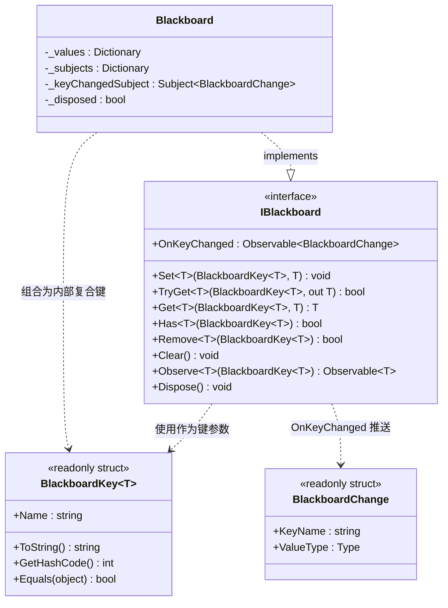
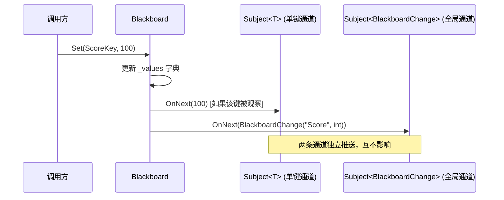

黑板（Blackboard）是一种经典的共享数据架构模式——多个互不相识的系统通过一块公共"黑板"读写数据，实现松耦合的信息传递。CFramework 的 `Blackboard` 在此基础上引入了**泛型键的类型安全约束**与 **R3 响应式流观察**，让你无需手动轮询即可在数据变化时获得通知。如果你曾遇到过"系统 A 需要知道系统 B 的某个值什么时候变了"这类问题，黑板系统正是为此而设计的。它不属于框架默认安装的服务，而是一个独立的基础设施组件，你可以按需创建并通过依赖注入容器注册。

Sources: [IBlackboard.cs](Runtime/Core/Blackboard/IBlackboard.cs#L1-L93), [Blackboard.cs](Runtime/Core/Blackboard/Blackboard.cs#L1-L170), [BlackboardKey.cs](Runtime/Core/Blackboard/BlackboardKey.cs#L1-L48)

## 架构总览

黑板系统由三个核心文件构成一个紧凑的类型层次：

```
BlackboardKey<T>     —— 泛型只读结构体，充当类型安全的"键"
    ↓
IBlackboard          —— 接口契约，定义读写、观察与生命周期
    ↓
Blackboard           —— 密封实现类，内部持有两个字典 + R3 Subject 体系
```

下图展示了各类型之间的核心协作关系。在阅读后续章节前，请先建立这个心智模型：`BlackboardKey<T>` 是入口凭证，`IBlackboard` 是操作窗口，`Blackboard` 是底层引擎。



Sources: [IBlackboard.cs](Runtime/Core/Blackboard/IBlackboard.cs#L1-L93), [Blackboard.cs](Runtime/Core/Blackboard/Blackboard.cs#L1-L170), [BlackboardKey.cs](Runtime/Core/Blackboard/BlackboardKey.cs#L1-L48)

## 核心概念

### BlackboardKey\<T\>：编译期的类型安全屏障

`BlackboardKey<T>` 是一个泛型只读结构体，其泛型参数 `T` 在创建时固定，并参与到哈希计算和相等比较中。这意味着即使两个键的字符串名称相同，只要类型参数不同，它们就被视为不同的键——一个 `BlackboardKey<int>` 和一个 `BlackboardKey<string>` 即使都叫 `"Score"`，也绝不会冲突。

关键的设计决策体现在哈希函数中：`GetHashCode()` 将 `(Name, typeof(T))` 作为元组联合计算，而 `Equals()` 在运行时额外检查了 `GetType()` 一致性。这构成了一道编译期与运行期双重保障的类型安全屏障——你不可能意外地用一个 `int` 键写入后用 `string` 键读取到错误的值。

```csharp
// 声明强类型键——通常作为 static readonly 字段
private static readonly BlackboardKey<int> ScoreKey = new("Score");
private static readonly BlackboardKey<string> PlayerNameKey = new("PlayerName");
```

Sources: [BlackboardKey.cs](Runtime/Core/Blackboard/BlackboardKey.cs#L1-L48)

### BlackboardChange：全局变化通知载体

`BlackboardChange` 是一个只读结构体，仅携带两个信息：发生变化的键名称（`KeyName`）和值类型（`ValueType`）。它通过 `IBlackboard.OnKeyChanged` 属性向所有订阅者广播，是一个"谁变了"的信号，但不包含具体的变更值。如果你需要获取最新值，需在收到通知后调用 `Get` 或 `TryGet`——这是一种有意为之的**拉取式设计**，避免在通知中传递大对象的拷贝开销。

Sources: [IBlackboard.cs](Runtime/Core/Blackboard/IBlackboard.cs#L9-L26)

### 复合键机制：名称 + 类型的双重索引

`Blackboard` 的内部存储使用 `(string name, Type type)` 元组作为字典键。这个**复合键机制**是整个类型安全体系的核心实现手段：

| 字典 | 键类型 | 值类型 | 用途 |
|------|--------|--------|------|
| `_values` | `(string name, Type type)` | `object` | 存储所有键值对的实际数据 |
| `_subjects` | `(string name, Type type)` | `object`（实际为 `Subject<T>`） | 为每个被观察的键维护 R3 响应式流 |

这种设计意味着：只有被 `Observe()` 调用过的键才会创建对应的 `Subject`，未观察的键不会产生任何响应式基础设施的内存开销——这是一种**按需创建**策略。

Sources: [Blackboard.cs](Runtime/Core/Blackboard/Blackboard.cs#L14-L25)

## 响应式通知机制

黑板系统提供**双层通知通道**，满足不同粒度的观察需求：



**单键通道**（通过 `Observe<T>(key)` 获取）：返回 `Observable<T>`，每次 `Set` 或 `Remove` 时推送具体的值对象。订阅者直接拿到最新值，无需二次查询。

**全局通道**（通过 `OnKeyChanged` 属性获取）：无论哪个键发生变化，都会推送一个 `BlackboardChange` 结构体。适合需要监听"任意数据变动"的场景，例如调试面板、自动保存触发器等。

Sources: [Blackboard.cs](Runtime/Core/Blackboard/Blackboard.cs#L40-L52), [Blackboard.cs](Runtime/Core/Blackboard/Blackboard.cs#L130-L143), [IBlackboard.cs](Runtime/Core/Blackboard/IBlackboard.cs#L31-L36)

### Remove 与 Clear 的通知行为

`Remove` 操作在成功移除后，会向该键的 `Subject<T>` 推送 `default(T)` 值（`OnNext(default)`），并触发全局 `OnKeyChanged` 通知。这意味着订阅者可以通过接收到 `default` 值来感知"键已被移除"这一语义——但需要留意，对于值类型 `int` 来说 `default` 就是 `0`，与合法的业务值可能产生歧义。

`Clear` 操作仅触发全局 `OnKeyChanged` 通知（遍历所有已创建的 `_subjects`），但不会对每个 `Subject<T>` 单独推送。清空后 `_values` 字典被直接清空，所有键值对消失。

Sources: [Blackboard.cs](Runtime/Core/Blackboard/Blackboard.cs#L92-L125)

## 完整 API 参考

下表汇总了 `IBlackboard` 接口定义的全部公共操作：

| 方法 | 返回值 | 说明 |
|------|--------|------|
| `Set<T>(BlackboardKey<T>, T)` | `void` | 写入或覆盖指定键的值；触发单键和全局双层通知 |
| `TryGet<T>(BlackboardKey<T>, out T)` | `bool` | 尝试读取值，返回是否成功；不存在时 `out` 参数为 `default` |
| `Get<T>(BlackboardKey<T>, T)` | `T` | 读取值，不存在时返回传入的 `defaultValue`（默认为 `default(T)`） |
| `Has<T>(BlackboardKey<T>)` | `bool` | 检查指定键是否存在 |
| `Remove<T>(BlackboardKey<T>)` | `bool` | 移除指定键并返回是否成功移除；触发通知 |
| `Clear()` | `void` | 清空所有键值对；仅触发全局通知 |
| `Observe<T>(BlackboardKey<T>)` | `Observable<T>` | 获取指定键的 R3 响应式流；首次调用时惰性创建 Subject |
| `OnKeyChanged` | `Observable<BlackboardChange>` | 全局键变化事件流，任意键的 Set/Remove/Clear 均触发 |
| `Dispose()` | `void` | 释放所有 Subject 和内部字典资源；之后所有操作抛出 `ObjectDisposedException` |

Sources: [IBlackboard.cs](Runtime/Core/Blackboard/IBlackboard.cs#L31-L92)

## 使用指南

### 键的定义规范

推荐的实践是将黑板键声明为类或结构体的 `static readonly` 字段，集中管理。这带来三个好处：键名称在编译期确定（不会拼错）、类型参数绑定到字段声明（不会用错类型）、集中定义方便检索。

```csharp
public static class GameKeys
{
    public static readonly BlackboardKey<int> Score = new("Score");
    public static readonly BlackboardKey<string> PlayerName = new("PlayerName");
    public static readonly BlackboardKey<float> Health = new("Health");
    public static readonly BlackboardKey<bool> IsPaused = new("IsPaused");
}
```

Sources: [BlackboardKey.cs](Runtime/Core/Blackboard/BlackboardKey.cs#L7-L21)

### 基本读写操作

```csharp
var board = new Blackboard();

// 写入
board.Set(GameKeys.Score, 100);
board.Set(GameKeys.PlayerName, "Alice");

// 读取（带默认值）
int score = board.Get(GameKeys.Score, 0);

// 安全读取（out 参数模式）
if (board.TryGet(GameKeys.Health, out float health))
{
    // health 变量已赋值，可安全使用
}

// 检查存在性
bool hasName = board.Has(GameKeys.PlayerName); // true

// 移除
board.Remove(GameKeys.Score);
```

Sources: [Blackboard.cs](Runtime/Core/Blackboard/Blackboard.cs#L40-L87)

### 响应式观察

黑板系统与 R3 响应式框架深度集成。通过 `Observe` 获取的 `Observable<T>` 可以与 R3 的全部操作符链式组合，实现复杂的数据流变换：

```csharp
var board = new Blackboard();

// 观察特定键——Observe 返回的 Subject 在首次调用时惰性创建
board.Observe(GameKeys.Score)
    .Subscribe(score => Debug.Log($"分数更新: {score}"))
    .AddTo(this); // 绑定到 MonoBehaviour 生命周期

// 全局监听：任意键变化
board.OnKeyChanged
    .Subscribe(change => Debug.Log($"键 [{change.KeyName}] ({change.ValueType.Name}) 发生变化"))
    .AddTo(this);

// 结合 R3 操作符：仅当分数超过阈值时触发
board.Observe(GameKeys.Score)
    .Where(s => s >= 100)
    .Subscribe(_ => Debug.Log("达成高分成就！"))
    .AddTo(this);
```

Sources: [Blackboard.cs](Runtime/Core/Blackboard/Blackboard.cs#L130-L143), [IBlackboard.cs](Runtime/Core/Blackboard/IBlackboard.cs#L85-L92)

### 通过依赖注入注册

黑板没有被框架自动安装，你需要自行决定其注册方式。以下是两种典型方案：

**方案一：作为全局单例注入（GameScope 级别）**

```csharp
// 在游戏启动时动态注册
GameScope.AddInstaller(builder =>
{
    builder.Register<IBlackboard, Blackboard>(Lifetime.Singleton);
});
```

**方案二：在自定义 Installer 中注册**

```csharp
public class GameplayInstaller : IInstaller
{
    public void Install(IContainerBuilder builder)
    {
        builder.Register<IBlackboard, Blackboard>(Lifetime.Singleton);
    }
}
```

之后在任何通过 VContainer 注入的类中，直接声明 `IBlackboard` 参数即可获得实例。

Sources: [CoreServiceInstaller.cs](Runtime/Core/DI/CoreServiceInstaller.cs#L1-L23), [GameScope.cs](Runtime/Core/DI/GameScope.cs#L147-L174), [ActionInstaller.cs](Runtime/Core/DI/ActionInstaller.cs#L1-L32)

### 资源释放

`Blackboard` 实现了 `IDisposable`。调用 `Dispose()` 后，所有内部 `Subject<T>` 被逐一释放，字典被清空，全局 `_keyChangedSubject` 也被释放。此后任何操作（包括 `Set`、`Get`、`Observe`）都会抛出 `ObjectDisposedException`。如果黑板注册在 VContainer 容器中且生命周期为 Singleton，它会在 `LifetimeScope` 销毁时自动释放。

Sources: [Blackboard.cs](Runtime/Core/Blackboard/Blackboard.cs#L148-L169)

## 设计权衡与注意事项

| 维度 | 设计选择 | 影响与注意 |
|------|----------|-----------|
| **类型安全** | 泛型键 `BlackboardKey<T>` + 复合键 `(name, Type)` | 编译期杜绝类型混用；但同名不同类型的键会各自独立存储 |
| **值存储** | `Dictionary<..., object>` 装箱 | 值类型（int、float、struct）每次 Set/TryGet 会发生装箱/拆箱；高频更新场景需注意 GC 压力 |
| **通知粒度** | Set 不做值比较，每次调用都触发通知 | 即使传入的值与当前值相同，也会推送通知；如需去重可在订阅端用 `DistinctUntilChanged` |
| **Subject 惰性创建** | 仅在调用 `Observe` 时才创建 `Subject<T>` | 未观察的键零开销；但首次 `Observe` 调用前 `Set` 的值不会重播给后续订阅者（Subject 不是 ReplaySubject） |
| **Remove 语义** | 推送 `default(T)` 通知 | 值类型的 `default` 可能与合法业务值冲突，需在订阅端额外判断 |
| **线程安全** | 非线程安全 | 所有操作应在主线程（Unity 主循环）中执行；跨线程访问需要外部同步 |
| **内存生命周期** | 依赖 `IDisposable` | 记得及时 Dispose 或依赖 VContainer 容器管理生命周期，避免 Subject 泄漏 |

Sources: [Blackboard.cs](Runtime/Core/Blackboard/Blackboard.cs#L1-L170), [BlackboardKey.cs](Runtime/Core/Blackboard/BlackboardKey.cs#L28-L46)

## 典型应用场景

**跨系统状态共享**：AI 系统将"敌人距离"写入黑板，行为树通过 `Observe` 响应式地感知距离变化，而无需直接持有 AI 系统的引用。

**UI 数据绑定**：游戏业务逻辑将金币数量写入黑板，UI 层订阅对应键的 Observable，自动驱动显示刷新。这种模式下 UI 与业务逻辑完全解耦。

**调试与监控面板**：通过全局 `OnKeyChanged` 订阅，可以轻松实现一个实时显示所有黑板状态变化的调试窗口，对开发期的问题排查极为便利。

**有限状态机共享上下文**：多个 FSM 状态之间通过黑板共享过渡条件所需的上下文数据，避免状态类之间的直接耦合。这一点在与框架的 [有限状态机：标准 FSM 与栈状态机（Push/Pop）的设计与使用](18-you-xian-zhuang-tai-ji-biao-zhun-fsm-yu-zhan-zhuang-tai-ji-push-pop-de-she-ji-yu-shi-yong) 配合使用时尤为有效。

Sources: [IBlackboard.cs](Runtime/Core/Blackboard/IBlackboard.cs#L1-L93)

## 与事件总线的边界

黑板系统和 [事件总线：同步/异步发布订阅与 R3 响应式集成](6-shi-jian-zong-xian-tong-bu-yi-bu-fa-bu-ding-yue-yu-r3-xiang-ying-shi-ji-cheng) 都支持 R3 响应式观察，但它们的适用场景截然不同：

| 维度 | 黑板系统 (Blackboard) | 事件总线 (EventBus) |
|------|----------------------|---------------------|
| **数据模型** | 键值对存储（持续存在，可随时查询当前值） | 事件流（瞬时消费，发布后不存储） |
| **通信模式** | 状态共享：写者设置值，读者随时读取最新状态 | 消息传递：发布者发出事件，订阅者即时处理 |
| **查询能力** | 支持 `Get`/`TryGet`/`Has` 主动查询 | 不支持查询历史事件 |
| **适用场景** | 共享状态（血量、分数、配置标志） | 触发动作（玩家受伤、任务完成、场景切换） |

一个简单的判断准则：**如果消费者需要"当前值"，用黑板；如果消费者需要"发生了什么事"，用事件总线**。

Sources: [IBlackboard.cs](Runtime/Core/Blackboard/IBlackboard.cs#L1-L93), [IEventBus.cs](Runtime/Core/Event/IEventBus.cs#L1-L44)

## 延伸阅读

- 了解黑板如何通过 VContainer 注入：[依赖注入体系：GameScope、SceneScope 与动态安装器机制](5-yi-lai-zhu-ru-ti-xi-gamescope-scenescope-yu-dong-tai-an-zhuang-qi-ji-zhi)
- 了解黑板底层使用的 R3 响应式框架：[事件总线：同步/异步发布订阅与 R3 响应式集成](6-shi-jian-zong-xian-tong-bu-yi-bu-fa-bu-ding-yue-yu-r3-xiang-ying-shi-ji-cheng)
- 黑板作为状态机共享上下文的应用：[有限状态机：标准 FSM 与栈状态机（Push/Pop）的设计与使用](18-you-xian-zhuang-tai-ji-biao-zhun-fsm-yu-zhan-zhuang-tai-ji-push-pop-de-she-ji-yu-shi-yong)
- 框架扩展指南中注册自定义服务的方式：[框架扩展指南：自定义 IInstaller、IAssetProvider 与 ISceneTransition](23-kuang-jia-kuo-zhan-zhi-nan-zi-ding-yi-iinstaller-iassetprovider-yu-iscenetransition)