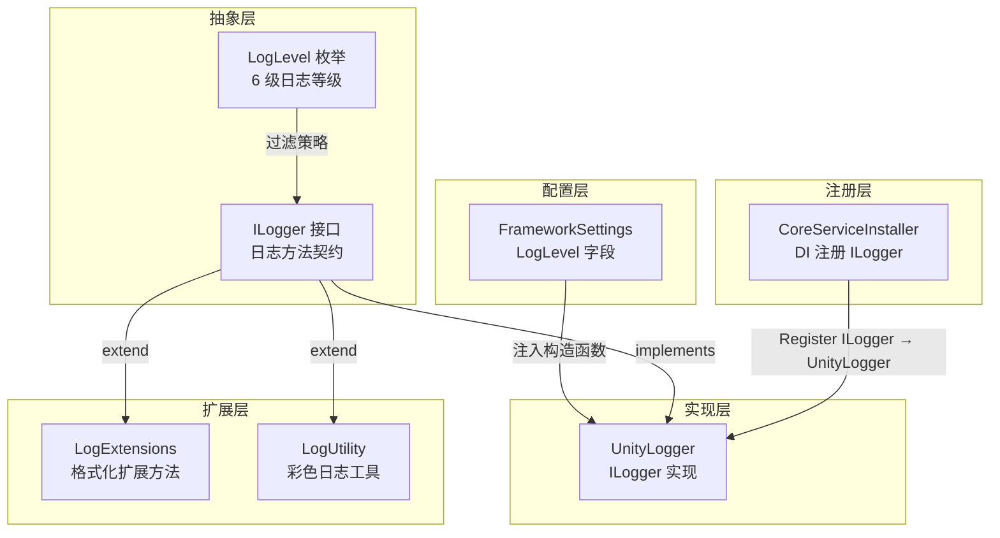

当你第一次在 Unity 控制台看到密密麻麻的 Debug 日志淹没了一条关键错误信息时，你就会理解**日志分级**为什么是框架的基础设施而非锦上添花。CFramework 的日志系统通过 `ILogger` 接口、`UnityLogger` 实现和 `LogLevel` 枚举三级协作，为你提供了一套开箱即用、与 DI 容器深度集成的分级日志方案——你可以在 `FrameworkSettings` 里一键切换日志级别，让开发阶段输出详细调试信息、发布版本只保留错误与异常。

Sources: [LogLevel.cs](Runtime/Core/Log/LogLevel.cs#L1-L38), [ILogger.cs](Runtime/Core/Log/ILogger.cs#L1-L70), [UnityLogger.cs](Runtime/Core/Log/UnityLogger.cs#L1-L143)

## 系统架构总览

日志系统由四个核心类型和一组扩展方法组成，它们的职责划分清晰且层次分明：



**设计哲学**：接口与实现分离（`ILogger` vs `UnityLogger`），使得你可以在测试中替换为 Mock Logger，或在未来扩展为文件日志、远程日志等不同后端——而框架内所有服务对日志的调用方式完全不变。

Sources: [CoreServiceInstaller.cs](Runtime/Core/DI/CoreServiceInstaller.cs#L17-L21), [FrameworkSettings.cs](Runtime/Core/FrameworkSettings.cs#L37-L37)

## 日志级别详解：LogLevel 枚举

`LogLevel` 定义了六个级别，其核心过滤规则是**数值越大越严格**：当设置了某个级别后，只有大于等于该级别的日志才会被输出。

| 枚举值 | 整数值 | 含义 | 典型使用场景 |
|--------|--------|------|-------------|
| `Debug` | 0 | 调试信息 | 变量值打印、流程追踪、帧循环细节 |
| `Info` | 1 | 一般信息 | 服务启动完成、模块初始化成功 |
| `Warning` | 2 | 警告信息 | 配置缺失使用默认值、资源未找到 |
| `Error` | 3 | 错误信息 | 操作失败、数据异常 |
| `Exception` | 4 | 异常信息 | 未捕获异常堆栈 |
| `None` | 100 | 禁用所有 | 正式发布版本 |

**过滤机制的本质**是一次简单的整数比较：`IsEnabled` 方法内部执行 `(int)level >= (int)_logLevel`。这意味着当你把 `LogLevel` 设为 `Warning`（值为 2）时，`Debug`（0）和 `Info`（1）的日志请求会在方法入口处直接返回——不会产生任何字符串格式化开销，也不会触发 Unity 控制台输出。

Sources: [LogLevel.cs](Runtime/Core/Log/LogLevel.cs#L1-L38), [UnityLogger.cs](Runtime/Core/Log/UnityLogger.cs#L36-L39)

## ILogger 接口：统一的日志契约

`ILogger` 是框架中所有日志操作的唯一入口接口。它定义了两种调用模式——**无标签版本**和**带标签版本**，每种日志级别各提供一对方法：

```csharp
// 无标签：直接输出消息
void LogDebug(string message);
void LogInfo(string message);
void LogWarning(string message);
void LogError(string message);
void LogException(Exception exception);

// 带标签：消息前自动添加 [Tag] 前缀
void LogDebug(string tag, string message);
void LogInfo(string tag, string message);
void LogWarning(string tag, string message);
void LogError(string tag, string message);
void LogException(string tag, Exception exception);
```

**标签（Tag）的设计意图**：在多人协作项目中，控制台日志往往来自不同的模块和系统。通过标签机制，你可以一眼识别日志的来源模块——例如 `[AudioService]`、`[AssetService]`、`[SaveService]`，在排查问题时快速定位责任方。标签在 `FormatMessage` 中被格式化为 `[标签名] 消息内容` 的标准格式。

此外，接口还暴露了 `LogLevel` 属性（可读写）和 `IsEnabled(LogLevel)` 方法，前者用于运行时动态调整过滤阈值，后者用于在执行昂贵的日志格式化之前进行短路判断。

Sources: [ILogger.cs](Runtime/Core/Log/ILogger.cs#L1-L69)

## UnityLogger：接口的默认实现

`UnityLogger` 是 `ILogger` 在框架中的唯一默认实现，它将日志桥接到 Unity 原生的 `UnityEngine.Debug` API。其构造函数接收一个 `FrameworkSettings` 参数，实现配置与代码的解耦：

```csharp
// 构造函数：从 FrameworkSettings 读取初始日志级别
public UnityLogger(FrameworkSettings settings)
{
    _settings = settings;
    _logLevel = settings != null ? settings.LogLevel : LogLevel.Debug;
}
```

**与 FrameworkSettings 的双向同步**是 `UnityLogger` 的一个重要特性。当你通过代码修改 `logger.LogLevel` 时，它会同步更新关联的 `FrameworkSettings` 实例；反之，在 Inspector 中修改 `FrameworkSettings` 的 `LogLevel` 字段后，下次调用日志方法时也会使用新的级别。这种设计确保了无论你从哪个入口修改配置，系统状态始终一致。

每个日志方法的实现都遵循相同的**守卫模式**：先调用 `IsEnabled` 检查级别，未通过则直接 `return`；通过后再调用 `FormatMessage` 格式化消息并调用对应的 `Debug.Log*` 方法。唯一的例外是 `LogException` 方法——对于 `Exception` 类型参数，它直接调用 `Debug.LogException(exception)`，因为 Unity 对异常有特殊的堆栈回溯格式化处理。

Sources: [UnityLogger.cs](Runtime/Core/Log/UnityLogger.cs#L1-L142)

## DI 注册与获取

日志服务在框架启动时由 `CoreServiceInstaller` 自动注册到 VContainer DI 容器中，生命周期为单例：

```csharp
// CoreServiceInstaller.Install 中的注册代码
builder.Register<ILogger, UnityLogger>(Lifetime.Singleton);
```

这意味着你可以在任何通过 DI 创建的服务中直接注入 `ILogger`：

```csharp
public class MyGameService
{
    private readonly ILogger _logger;

    // 构造函数注入——VContainer 自动解析
    public MyGameService(ILogger logger)
    {
        _logger = logger;
    }

    public void DoWork()
    {
        _logger.LogInfo("MyGameService", "开始执行任务...");
    }
}
```

如果你不想通过构造函数注入，也可以直接从 `GameScope.Instance` 获取已解析的日志服务实例：`GameScope.Instance.Logger`。

Sources: [CoreServiceInstaller.cs](Runtime/Core/DI/CoreServiceInstaller.cs#L15-L21), [GameScope.cs](Runtime/Core/DI/GameScope.cs#L102-L102), [GameScope.cs](Runtime/Core/DI/GameScope.cs#L129-L129)

## 格式化扩展方法：LogExtensions

框架通过 `LogExtensions` 静态类为 `ILogger` 添加了格式化日志输出能力。每个日志级别（Debug/Info/Warning/Error）各提供两个方法——无标签和带标签版本：

```csharp
// 使用示例
logger.LogDebugFormat("玩家得分: {0}, 等级: {1}", score, level);
logger.LogInfoFormat("BattleSystem", "回合 {0} 开始", round);
```

**性能设计细节**：所有 `*Format` 扩展方法都在执行 `string.Format` 之前先调用 `logger.IsEnabled` 进行级别检查。这避免了在日志被过滤时仍然执行字符串格式化的无谓开销——对于高频调用的 Debug 日志，这种短路判断能显著减少 GC 分配。

Sources: [LogExtensions.cs](Runtime/Core/Log/LogExtensions.cs#L1-L79)

## 彩色日志工具：LogUtility

`LogUtility` 位于 `CFramework.Utility` 命名空间下，提供了两个与标签着色相关的扩展方法，利用 Unity 的 Rich Text 标签让日志标签在控制台中以不同颜色显示：

| 方法 | 功能 | 用法 |
|------|------|------|
| `LogWithColor(tag, message, color, logLevel)` | 使用**自定义颜色**渲染标签 | `logger.LogWithColor("Server", "连接成功", Color.cyan)` |
| `LogWithLevelColor(tag, message, logLevel)` | 根据**日志级别自动分配颜色** | `logger.LogWithLevelColor("Save", "保存完成", LogLevel.Info)` |

`LogWithLevelColor` 内置的颜色映射规则如下：

| 日志级别 | 标签颜色 | 视觉含义 |
|----------|----------|----------|
| `Debug` | 🟢 绿色 | 开发调试信息 |
| `Info` | ⚪ 白色 | 一般提示信息 |
| `Warning` | 🟡 黄色 | 需要注意的警告 |
| `Error` / `Exception` | 🔴 红色 | 严重错误 |

颜色通过 `StringRichTextUtility.Color` 方法将标签包裹在 `<color=#hex>` 标签中实现，Unity Console 面板原生支持 Rich Text 渲染。

Sources: [LogUtility.cs](Runtime/Utility/LogUtility.cs#L1-L72), [StringRichTextUtility.cs](Runtime/Utility/String/StringRichTextUtility.cs#L7-L11)

## 配置日志级别：FrameworkSettings

`FrameworkSettings` 是一个 ScriptableObject 配置资产，其中 `LogLevel` 字段控制全局日志过滤级别，默认值为 `LogLevel.Debug`：

```
FrameworkSettings Inspector:
  ┌─ Log ──────────────────────────┐
  │  日志级别: [Debug ▼]            │
  └────────────────────────────────┘
```

**推荐的分级策略**：

| 开发阶段 | 建议级别 | 原因 |
|----------|----------|------|
| 日常开发 | `Debug` | 输出所有信息，便于调试 |
| 功能测试 | `Info` | 过滤掉琐碎调试信息，保留流程日志 |
| 集成测试 | `Warning` | 只关注潜在问题和错误 |
| 性能测试 | `Error` | 屏蔽噪音，只看真正的问题 |
| 正式发布 | `None` | 完全禁用日志，零开销 |

Sources: [FrameworkSettings.cs](Runtime/Core/FrameworkSettings.cs#L37-L37)

## 完整使用示例

以下代码展示了日志系统在实际游戏服务中的典型用法，涵盖了级别过滤、标签格式化、异常处理等关键模式：

```csharp
using System;
using CFramework;
using CFramework.Utility;

public class BattleManager
{
    private readonly ILogger _logger;

    public BattleManager(ILogger logger)
    {
        _logger = logger;
    }

    public void StartBattle(int battleId)
    {
        // ✅ 基本信息日志——带标签
        _logger.LogInfo("BattleManager", $"战斗 {battleId} 开始");

        // ✅ 格式化日志——避免手动拼接字符串
        _logger.LogDebugFormat("BattleManager", "队伍人数: {0}, 敌方人数: {1}", 4, 8);

        // ✅ 彩色日志——在 Console 中标签显示为青色
        _logger.LogWithColor("BattleManager", "Boss 已刷新!", UnityEngine.Color.cyan);
    }

    public void OnBattleEnd()
    {
        // ⚠️ 警告日志——异常但不致命的情况
        _logger.LogWarning("BattleManager", "战斗超时，强制结束");

        try
        {
            // 业务逻辑...
        }
        catch (Exception ex)
        {
            // ❌ 异常日志——输出完整堆栈
            _logger.LogException("BattleManager", ex);
        }
    }
}
```

Sources: [UnityLogger.cs](Runtime/Core/Log/UnityLogger.cs#L44-L132), [LogExtensions.cs](Runtime/Core/Log/LogExtensions.cs#L11-L78), [LogUtility.cs](Runtime/Utility/LogUtility.cs#L8-L27)

## 测试覆盖

框架为日志系统提供了完整的单元测试（位于 `Tests/Runtime/Log/LoggerTests.cs`），覆盖以下场景：

| 测试类别 | 测试内容 |
|----------|----------|
| 级别初始化 | `LogLevel_DefaultFromSettings` — 验证默认级别为 Debug |
| 级别过滤 | `IsEnabled_DebugLevel` 至 `IsEnabled_NoneLevel` — 验证每个级别的启用/禁用逻辑 |
| 各级别输出 | `LogDebug`/`LogInfo`/`LogWarning`/`LogError`/`LogException` 的带标签和无标签版本 |
| 级别屏蔽 | `LogDebug_WhenDisabled_DoesNotOutput` — 验证被过滤时不产生输出 |
| 格式化输出 | `LogDebugFormat`/`LogInfoFormat`/`LogWarningFormat`/`LogErrorFormat` 的正确格式化 |
| 边界情况 | 空消息、null 消息、空标签、null 标签、null 异常——均不抛出异常 |

这些测试确保了日志系统在任何输入条件下的健壮性——你不需要在调用日志方法之前做额外的 null 检查。

Sources: [LoggerTests.cs](Tests/Runtime/Log/LoggerTests.cs#L1-L244)

## 与其他系统的关系

日志系统作为基础设施层，被框架中的其他模块广泛依赖。它通过 DI 容器自动注入到需要的服务中，而你只需关注"在哪个级别输出什么信息"即可。与之密切相关的两个系统值得了解：

- **[全局异常分发器：统一捕获 UniTask 与 R3 未处理异常](7-quan-ju-yi-chang-fen-fa-qi-tong-buo-unitask-yu-r3-wei-chu-li-yi-chang)**：`DefaultExceptionDispatcher` 在分发异常时直接使用 `Debug.LogError` 输出错误信息，而你的业务代码则可以通过 `ILogger` 记录异常——两者共同构成了完整的错误可见性体系。
- **[FrameworkSettings 全局配置详解](3-frameworksettings-quan-ju-pei-zhi-xiang-jie)**：日志级别的运行时配置入口，修改后立即生效。