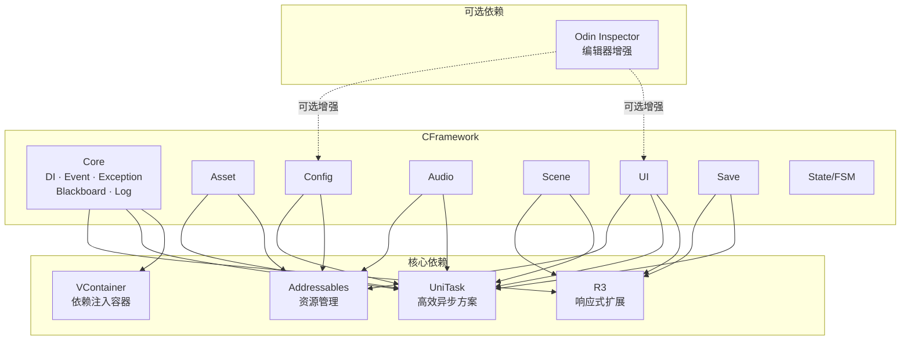
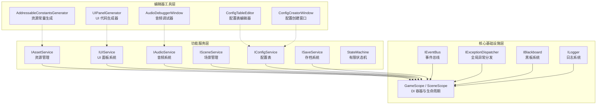

**CFramework** 是一套基于 **VContainer、UniTask、R3 和 Addressables** 构建的 Unity 游戏开发框架，当前版本为 **1.5.0**。它将游戏开发中最常见的底层关注——依赖注入、资源生命周期、事件通信、UI 管理、音频播放、配置读取、存档持久化——封装为一系列**面向接口、单职责**的服务，通过统一的 `GameScope` 容器进行装配与管理。框架以 **MIT 协议**开源，Odin Inspector 为可选增强依赖，未安装时框架自动降级到内置的编辑器实现，不会阻断编译或运行。

Sources: [README.md](README.md#L1-L7), [package.json](package.json#L1-L8)

---

## 核心设计理念

CFramework 的架构遵循三条第一性原则：

- **依赖注入驱动**：所有服务通过 VContainer 的 `IContainerBuilder` 注册，通过 `IInstaller` 安装器机制装配。全局作用域 `GameScope` 承载单例服务，场景作用域 `SceneScope` 承载场景级服务，两者的生命周期与 Unity 的 `LifetimeScope` 完全对齐。开发者可以在任意时刻通过 `GameScope.AddInstaller()` 动态注入自定义模块，框架自动重建容器。

Sources: [GameScope.cs](Runtime/Core/DI/GameScope.cs#L1-L50), [SceneScope.cs](Runtime/Core/DI/SceneScope.cs#L1-L16)

- **异步优先 + 响应式补充**：所有耗时操作（资源加载、场景切换、存档写入）均返回 `UniTask`，由 `CancellationToken` 驱动取消；事件总线同时提供同步/异步发布订阅与 R3 `Observable<T>` 响应式流，使同一套事件机制既能处理即时逻辑，也能驱动 UI 绑定与数据响应。

Sources: [IEventBus.cs](Runtime/Core/Event/IEventBus.cs#L1-L44), [IAssetService.cs](Runtime/Asset/IAssetService.cs#L40-L83)

- **接口隔离与可测试性**：每个模块均以 `I` 前缀接口对外暴露（`IAssetService`、`IUIService`、`IAudioService`、`ISceneService`、`IConfigService`、`ISaveService`），实现类在安装器内部绑定。测试时只需注册 Mock 实现即可完全隔离外部依赖。框架自身测试覆盖率已达 **100%**。

Sources: [CoreServiceInstaller.cs](Runtime/Core/DI/CoreServiceInstaller.cs#L1-L23), [FrameworkModuleInstaller.cs](Runtime/Core/DI/FrameworkModuleInstaller.cs#L1-L28), [CHANGELOG.md](CHANGELOG.md#L69-L71)

---

## 技术栈与依赖关系

在深入模块之前，理解框架的底层依赖链至关重要。以下关系图展示了 CFramework 与四项核心库之间的协作方式：



> **图表前提说明**：上方 Mermaid 图展示了 CFramework 内部各模块与外部库之间的依赖关系。实线箭头表示直接依赖，虚线箭头表示可选增强。

| 依赖库 | 版本要求 | 角色 | 框架中的使用场景 |
|--------|---------|------|----------------|
| **VContainer** | 1.17.0+ | 依赖注入容器 | `GameScope`/`SceneScope` 生命周期管理、服务注册与解析 |
| **UniTask** | 2.5.0+ | 异步编程方案 | 所有 `async` 服务方法、资源加载、场景切换、存档 IO |
| **R3** | 1.3.0+ | 响应式扩展 | 事件总线响应式流、UI 数据绑定、黑板观察、存档脏状态通知 |
| **Addressables** | 1.22.3+ | 资源管理系统 | `AssetService` 底层提供者、配置表加载、UI 面板预制体加载 |
| **Odin Inspector** | 3.0+（可选） | 编辑器增强 | 配置表序列化与 Inspector 美化，未安装时框架自动降级 |

Sources: [package.json](package.json#L1-L30), [README.md](README.md#L22-L33)

---

## 架构总览

CFramework 采用**分层架构**，自底向上分为三层：核心基础设施层、功能服务层、编辑器工具层。`GameScope` 作为唯一的入口点，在 `Configure` 阶段按固定顺序执行安装器链——先安装核心基础服务（`CoreServiceInstaller`），再安装功能模块服务（`FrameworkModuleInstaller`），最后安装开发者动态注册的自定义安装器。



> **图表前提说明**：上方 Mermaid 图展示了 CFramework 的三层架构及服务间的依赖方向。实线表示运行时依赖，虚线表示编辑器工具对功能模块的辅助关系。

### 安装器链执行流程

框架启动时，`GameScope.Configure` 方法按以下顺序执行安装：

1. **注册 `FrameworkSettings`**：将全局配置实例注入容器
2. **`CoreServiceInstaller`**：注册异常分发器、事件总线、日志、资源提供者
3. **`FrameworkModuleInstaller`**：注册资源、UI、音频（条件编译）、场景、配置、存档六大模块
4. **动态安装器列表**：开发者通过 `GameScope.AddInstaller()` 注册的自定义模块

所有服务注册完毕后，`Start` 阶段统一执行 `ResolveFrameworkServices()` 将各服务解析到 `GameScope` 的公共属性上，供全局访问。

Sources: [GameScope.cs](Runtime/Core/DI/GameScope.cs#L77-L113), [CoreServiceInstaller.cs](Runtime/Core/DI/CoreServiceInstaller.cs#L15-L21), [FrameworkModuleInstaller.cs](Runtime/Core/DI/FrameworkModuleInstaller.cs#L16-L26)

---

## 模块功能速览

以下表格按层次列出框架全部九大模块的核心能力，帮助你在不深入源码的情况下快速掌握每个模块的职责边界。

### 核心基础设施层（Core）

| 模块 | 核心接口/类 | 关键能力 |
|------|-----------|---------|
| **DI / 生命周期** | `GameScope`、`SceneScope` | 全局与场景级 DI 容器、动态安装器机制、容器热重建 |
| **事件总线** | `IEventBus` | 同步/异步发布订阅、优先级排序、R3 `Receive<T>()` 响应式流 |
| **全局异常** | `IExceptionDispatcher` | 统一捕获 UniTask 与 R3 未处理异常、自定义处理器注册 |
| **黑板系统** | `IBlackboard` | 类型安全的键值对存储、`Observe<T>()` 响应式观察 |
| **日志系统** | `ILogger` | 分级日志控制（Debug/Info/Warning/Error）、运行时级别热切换 |

Sources: [IEventBus.cs](Runtime/Core/Event/IEventBus.cs#L1-L44), [IExceptionDispatcher.cs](Runtime/Core/Exception/IExceptionDispatcher.cs#L1-L25), [IBlackboard.cs](Runtime/Core/Blackboard/IBlackboard.cs#L1-L93)

### 功能服务层

| 模块 | 核心接口 | 关键能力 |
|------|---------|---------|
| **资源管理** | `IAssetService` | Addressables 封装、引用计数、内存预算监控、`AssetHandle.AddTo(gameObject)` 生命周期绑定、分帧预加载 |
| **UI 面板** | `IUIService`、`IUI` | 面板缓存复用、导航栈管理、`UIBinder` 组件自动注入、代码生成器 |
| **音频系统** | `IAudioService` | AudioMixer 驱动、分组音量控制、双音轨 BGM 交叉淡入淡出、Snapshot 切换、Slot 池化 |
| **场景管理** | `ISceneService` | Addressable 场景加载、叠加场景支持、`ISceneTransition` 过渡动画接口（内置淡入淡出） |
| **配置表** | `IConfigService` | ScriptableObject 数据源、泛型 `ConfigTable<TKey, TValue>`、热重载、多数据源标记 |
| **存档系统** | `ISaveService` | 原子写入、脏状态追踪与响应式通知、AES 加密、多存档槽、可配置间隔自动保存 |
| **有限状态机** | `StateMachine`、`StateMachineStack` | 细粒度状态接口（Enter/Exit/Update/FixedUpdate）、标准 FSM、栈状态机（Push/Pop） |

Sources: [IAssetService.cs](Runtime/Asset/IAssetService.cs#L40-L83), [IUIService.cs](Runtime/UI/IUIService.cs#L1-L62), [IAudioService.cs](Runtime/Audio/IAudioService.cs#L14-L145), [ISceneService.cs](Runtime/Scene/ISceneService.cs#L1-L53), [IConfigService.cs](Runtime/Config/IConfigService.cs#L1-L20), [ISaveService.cs](Runtime/Save/ISaveService.cs#L1-L48)

---

## 项目目录结构

理解目录组织方式有助于你在需要扩展或排查问题时快速定位文件。以下展示框架运行时与编辑器的核心目录：

```
CFramework/
├── Runtime/                        # 运行时代码（打包进游戏）
│   ├── Core/                       # 核心基础设施
│   │   ├── Blackboard/             #   黑板系统
│   │   ├── DI/                     #   依赖注入（GameScope、SceneScope、Installer）
│   │   ├── Event/                  #   事件总线
│   │   ├── Exception/              #   全局异常分发
│   │   └── Log/                    #   日志系统
│   ├── Asset/                      # 资源管理（AssetHandle、AssetService）
│   ├── Audio/                      # 音频系统（AudioService、AudioGroup）
│   ├── Config/                     # 配置表（ConfigTable、ConfigService）
│   ├── Save/                       # 存档系统（SaveService、SaveDataBase）
│   ├── Scene/                      # 场景管理（SceneService、FadeTransition）
│   ├── State/FSM/                  # 有限状态机（StateMachine、StateMachineStack）
│   ├── UI/                         # UI 面板（UIService、UIBinder、IUI）
│   ├── Extensions/                 # 扩展方法（Number、Transform）
│   ├── OdinStubs/                  # Odin Inspector 特性桩（确保无 Odin 时可编译）
│   └── Utility/                    # 通用工具（String、Random、Log）
├── Editor/                         # 编辑器代码（仅编辑器环境）
│   ├── Configs/                    #   编辑器配置（AddressableConfig、UIPanelGeneratorConfig）
│   ├── Generators/                 #   代码生成器（AddressableConstants、UIPanel）
│   ├── Inspectors/                 #   自定义 Inspector（FrameworkSettings、ConfigTable）
│   ├── Utilities/                  #   编辑器工具（OdinDetector、AddressableAssetPostprocessor）
│   └── Windows/                    #   编辑器窗口（AudioDebugger、Config、Addressable、Tools）
├── Tests/                          # 单元测试（覆盖率 100%）
│   ├── Editor/                     #   EditMode 测试
│   └── Runtime/                    #   PlayMode 测试
├── Prefabs/                        # 内置预制体（GameAudioMixer）
├── package.json                    # UPM 包定义
├── README.md                       # 项目说明
└── CHANGELOG.md                    # 版本更新日志
```

Sources: [README.md](README.md#L386-L417), [CHANGELOG.md](CHANGELOG.md#L1-L10)

---

## 框架设计优势

基于上述架构，CFramework 为中大型 Unity 项目提供了以下工程优势：

**① 模块解耦与按需集成**。音频模块通过 `CFRAMEWORK_AUDIO` 条件编译符号控制，不使用音频功能的工程可以完全剔除该模块。所有服务面向接口编程，你可以仅引入需要的模块而无需引入整个框架的运行时开销。

Sources: [FrameworkModuleInstaller.cs](Runtime/Core/DI/FrameworkModuleInstaller.cs#L20-L22), [IAudioService.cs](Runtime/Audio/IAudioService.cs#L1-L2)

**② 生命周期安全的资源管理**。`AssetHandle` 封装了引用计数，通过 `AddTo(gameObject)` 将资源释放与 GameObject 生命周期绑定——对象销毁时资源自动归还，从根源上杜绝资源泄漏。`AssetMemoryBudget` 实时监控内存用量，在接近预算上限时预警。

Sources: [IAssetService.cs](Runtime/Asset/IAssetService.cs#L45-L63)

**③ 零样板的事件驱动编程**。事件总线支持 `struct` 类型事件定义，避免 GC 分配；同一接口同时提供命令式订阅与 R3 响应式流，使 UI 绑定无需额外引入独立的消息机制。

Sources: [IEventBus.cs](Runtime/Core/Event/IEventBus.cs#L21-L43)

**④ 生产级存档安全**。存档系统采用"写入临时文件 → 重命名覆盖"的原子写入策略，配合 AES 加密（随机 IV），在断电、崩溃等异常场景下仍能保证存档完整性。脏状态追踪 + 可配置自动保存让"何时存档"这个问题变得简单。

Sources: [ISaveService.cs](Runtime/Save/ISaveService.cs#L21-L47)

**⑤ 编辑器生产力闭环**。UI 代码生成器从预制体命名规范自动生成组件绑定代码，Addressable 常量生成器消除手写字符串，ConfigTable 可视化编辑器让策划可以直接在 Inspector 中编辑数据——框架在"编写代码"和"运行游戏"之间构建了一整套自动化工具链。

Sources: [README.md](README.md#L280-L362)

---

## 适合谁使用

| 使用场景 | 适配程度 | 说明 |
|---------|---------|------|
| **中大型商业项目** | ★★★★★ | DI 架构 + 接口隔离 + 100% 测试覆盖，适合多人协作与长期维护 |
| **独立游戏 / GameJam** | ★★★★☆ | 模块可按需引入，快速上手；但需要理解 VContainer 与 UniTask 基础 |
| **学习 Unity 架构设计** | ★★★★★ | 每个模块都是单一职责的范例，代码清晰、注释完整，适合作为架构参考 |
| **已有项目的渐进式集成** | ★★★★☆ | 框架以 UPM 包形式安装，不侵入现有代码；可通过 `AddInstaller` 逐步接入 |

Sources: [README.md](README.md#L34-L57), [CHANGELOG.md](CHANGELOG.md#L99-L115)

---

## 环境要求

| 项目 | 要求 |
|------|------|
| Unity 版本 | **2021.3 及以上** |
| 脚本运行时 | .NET Standard 2.1 / .NET Framework 4.x |
| 必需包 | VContainer 1.17.0+、UniTask 2.5.0+、R3 1.3.0+、Addressables 1.22.3+ |
| 可选包 | Odin Inspector 3.0+（自动检测，不安装不影响编译） |

Sources: [package.json](package.json#L1-L22), [README.md](README.md#L22-L33)

---

## 推荐阅读路径

本页作为框架总览，提供了 CFramework 的全貌与设计理念。接下来，建议按照以下顺序深入阅读：

1. **[快速上手：安装、环境配置与运行第一个游戏场景](2-kuai-su-shang-shou-an-zhuang-huan-jing-pei-zhi-yu-yun-xing-di-ge-you-xi-chang-jing)** —— 手把手完成框架安装、配置创建与首个场景运行
2. **[FrameworkSettings 全局配置详解](3-frameworksettings-quan-ju-pei-zhi-xiang-jie)** —— 理解每一项配置参数的含义与调优方法
3. **[游戏入口与生命周期：GameScope 创建与服务初始化流程](4-you-xi-ru-kou-yu-sheng-ming-zhou-qi-gamescope-chuang-jian-yu-fu-wu-chu-shi-hua-liu-cheng)** —— 掌握框架启动的完整生命周期

完成入门指南后，可根据项目需求跳转至"深入理解"章节中的对应模块文档。