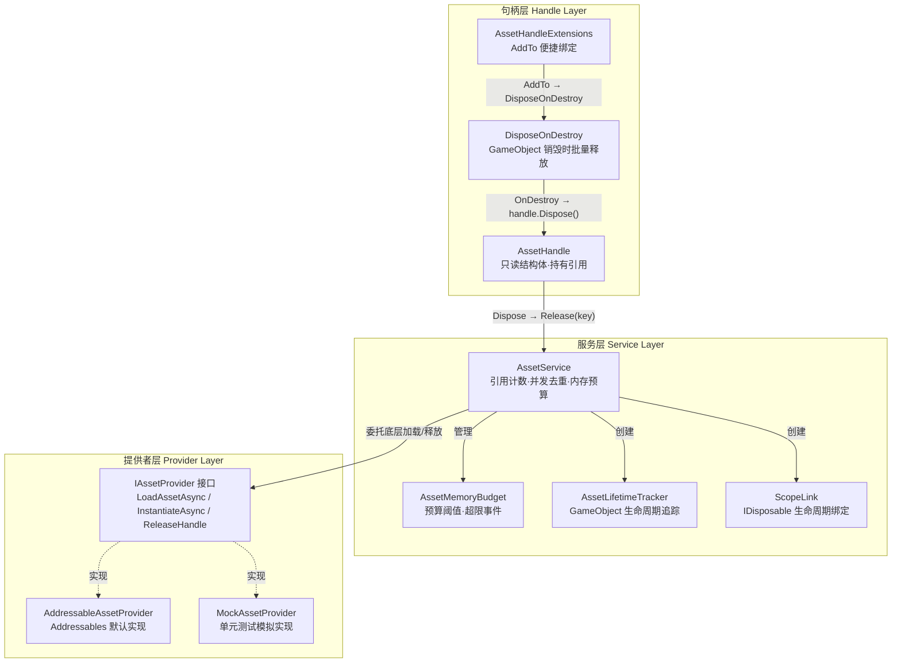

资源管理是游戏运行时最核心的基础设施之一——加载过早浪费内存，加载过迟破坏体验，忘记释放则引发泄漏。CFramework 的资源管理服务通过 **三层抽象架构**（Provider 抽象层、Service 协调层、Handle 语义层）将 Unity Addressables 的底层 API 封装为一套引用计数驱动、生命周期自动绑定的资源管理方案。本文将深入解析这套系统的设计意图、核心机制与正确使用方式，帮助你在项目中做到「资源加载即安全，资源释放即自动」。

Sources: [IAssetService.cs](Runtime/Asset/IAssetService.cs#L1-L84), [AssetService.cs](Runtime/Asset/AssetService.cs#L1-L307)

## 架构总览：三层分离设计

资源管理服务采用经典的 **提供者-服务-句柄** 三层架构，每一层都有明确的职责边界：



**提供者层**（`IAssetProvider`）将 Addressables 的 `LoadAssetAsync`、`InstantiateAsync`、`Release` 封装为统一接口，使上层代码不依赖具体资源加载实现，也为单元测试中的 Mock 替换留下入口。**服务层**（`AssetService`）在 Provider 之上叠加引用计数、并发去重、内存预算三大核心能力，是整个系统的协调中枢。**句柄层**（`AssetHandle` + 扩展方法）以 RAII 语义向调用方暴露资源引用，通过 `Dispose()` 模式实现「离开作用域即释放」的安全保证。

Sources: [IAssetService.cs](Runtime/Asset/IAssetService.cs#L14-L35), [AssetService.cs](Runtime/Asset/AssetService.cs#L13-L21), [AssetHandle.cs](Runtime/Asset/AssetHandle.cs#L1-L35)

## IAssetProvider：底层加载抽象

`IAssetProvider` 定义了四个核心操作，将资源加载的底层差异隔离在接口之后：

| 方法 | 职责 | 返回值 |
|---|---|---|
| `LoadAssetAsync<T>(key, ct)` | 按 key 异步加载资源 | `UniTask<Object>` |
| `InstantiateAsync(key, parent, ct)` | 按 key 异步实例化预制体 | `UniTask<GameObject>` |
| `ReleaseHandle(key, isInstance)` | 释放指定 key 的底层句柄 | `void` |
| `GetAssetMemorySize(key)` | 查询资源的内存占用（字节） | `long` |

框架默认提供的 `AddressableAssetProvider` 将这四个操作直接映射到 Unity Addressables API。它内部维护一个 `Dictionary<object, AsyncOperationHandle>` 来跟踪所有活跃的 Addressables 句柄，确保每个 key 只对应一个底层 `AsyncOperationHandle`，且在 `ReleaseHandle` 时正确释放回 Addressables 引擎。值得注意的是，实例化操作使用 `"$inst_" + key` 作为内部存储 key，与普通资源加载的 key 空间隔离，避免两者在引用计数和释放逻辑上产生冲突。

Sources: [IAssetService.cs](Runtime/Asset/IAssetService.cs#L14-L35), [AddressableAssetProvider.cs](Runtime/Asset/AddressableAssetProvider.cs#L14-L72)

## AssetService：引用计数与并发安全

`AssetService` 是资源管理的核心引擎，它在 `IAssetProvider` 之上构建了四个关键机制。理解这些机制的工作方式，是正确使用资源服务的前提。

### 引用计数模型

`AssetService` 内部维护三个核心字典来跟踪资源状态：

| 字典 | 类型 | 职责 |
|---|---|---|
| `_refCounts` | `Dictionary<object, int>` | 每个 key 的当前引用计数 |
| `_loadedAssets` | `Dictionary<object, Object>` | 已完成加载的资源缓存 |
| `_loadingTasks` | `Dictionary<object, UniTaskCompletionSource>` | 正在加载中的任务占位 |

当调用 `LoadAsync<T>(key)` 时，服务首先在 `lock` 块内检查该 key 的状态。若资源已完成加载（`_refCounts` 存在且 `_loadingTasks` 不存在），直接递增引用计数并返回缓存的 `AssetHandle`；若资源正在加载中（`_loadingTasks` 存在），则等待已有的加载任务完成后再递增引用计数；若为首次加载，创建 `UniTaskCompletionSource` 作为占位，当前请求成为「加载发起者」执行实际加载。

当 `Release(key)` 被调用时，引用计数递减。**只有计数归零时**才真正调用 `_provider.ReleaseHandle()` 释放底层资源，同时从 `_loadedAssets` 中移除缓存并扣减内存预算。这确保了同一资源的多个消费者不会互相干扰——只要还有人在用，资源就不会被回收。

Sources: [AssetService.cs](Runtime/Asset/AssetService.cs#L15-L21), [AssetService.cs](Runtime/Asset/AssetService.cs#L33-L92), [AssetService.cs](Runtime/Asset/AssetService.cs#L136-L163)

### 并发加载去重

在异步编程中，同一帧内多次请求同一资源是常见场景（例如多个 UI 面板同时请求同一张纹理）。如果没有去重机制，底层 Provider 会被调用多次，造成带宽浪费和内存碎片。

`AssetService` 通过 `_loadingTasks` 字典配合 `UniTaskCompletionSource` 实现了**请求合并**：第一个到达的请求创建 `TCS` 并标记自己为 `isLoader = true`，后续并发请求发现 `TCS` 已存在后直接 `await loadingTcs.Task` 等待。当加载发起者完成加载后，调用 `loadingTcs.TrySetResult(asset)` 一次性唤醒所有等待者。整个流程在 `lock (_lock)` 保护下完成，确保线程安全。

```
请求 A (isLoader=true)  →  创建 TCS → 执行实际加载 → SetResult → 返回
请求 B (isLoader=false) →  发现 TCS → await TCS.Task ──────┘ → 返回
请求 C (isLoader=false) →  发现 TCS → await TCS.Task ──────┘ → 返回
```

这一机制的测试用例 `A010_ConcurrentLoad_SameKey_ShouldNotLoadTwice` 验证了并发场景的正确性：三个同时发起的加载请求返回同一资源实例，且 Provider 的 `LoadAssetAsync` 仅被调用一次。

Sources: [AssetService.cs](Runtime/Asset/AssetService.cs#L33-L92), [AssetServiceTests.cs](Tests/Runtime/Asset/AssetServiceTests.cs#L355-L395)

### 实例化与 Key 隔离

`InstantiateAsync` 的设计有一个重要细节：它使用 `"$inst_" + key` 作为内部追踪 key，而非原始 key。这意味着**资源加载和实例化使用独立的引用计数通道**。你可以在加载一个预制体的同时多次实例化它，两者的生命周期互不影响。每次 `InstantiateAsync` 都会在 `_instanceFlags` 中标记该 key 为实例类型，这样在 `Release` 时可以区分是调用 `Addressables.Release(handle)` 还是让实例随场景销毁。

Sources: [AssetService.cs](Runtime/Asset/AssetService.cs#L94-L109), [AssetService.cs](Runtime/Asset/AssetService.cs#L146-L154)

### 内存预算监控

`AssetMemoryBudget` 提供轻量级的内存使用追踪。每次资源加载完成时，`AssetService` 调用 `MemoryBudget.UsedBytes += provider.GetAssetMemorySize(key)` 累加内存占用；每次资源释放时等量扣减。当 `UsedBytes > BudgetBytes` 时触发 `OnBudgetExceeded` 事件，上层可据此执行资源清理或弹出警告。预算值来自 `FrameworkSettings.MemoryBudgetMB` 配置，默认 512MB。

| 属性 | 类型 | 说明 |
|---|---|---|
| `BudgetBytes` | `long` | 预算上限（字节），由 `FrameworkSettings.MemoryBudgetMB × 1024²` 计算 |
| `UsedBytes` | `long` | 当前已使用字节 |
| `UsageRatio` | `float` | 使用率（0.0~1.0+），超过 1.0 表示超限 |
| `OnBudgetExceeded` | `Action<float>` | 超限事件，参数为当前使用率 |

Sources: [AssetMemoryBudget.cs](Runtime/Asset/AssetMemoryBudget.cs#L1-L22), [AssetService.cs](Runtime/Asset/AssetService.cs#L22-L29), [AssetService.cs](Runtime/Asset/AssetService.cs#L78-L86)

## AssetHandle：RAII 语义的资源句柄

`AssetHandle` 是一个 `readonly struct`，同时实现了 `IDisposable`。它是调用方与资源服务之间的唯一契约对象。每个 `AssetHandle` 持有三项信息：加载得到的 `Asset` 引用、创建它的 `IAssetService` 实例、以及资源的 `key`。调用 `Dispose()` 时，它将 `key` 交还给 `IAssetService.Release()`，由服务层完成引用计数递减。

由于 `AssetHandle` 是值类型，传递时会产生副本。这意味着**每个副本都可以独立 Dispose**，而服务层会正确累加引用计数——每次 `LoadAsync` 返回新句柄时，引用计数已经 +1，所以每个句柄的 `Dispose()` 对应一次 `Release()`。这种设计使得 `using` 语法可以自然地用于资源管理：

```csharp
// using 语法确保离开作用域时自动释放
using var handle = await assetService.LoadAsync<GameObject>("UI/MainWindow");
var prefab = handle.As<GameObject>();
Instantiate(prefab);
// handle.Dispose() 在作用域结束时自动调用
```

`As<T>()` 方法提供了类型安全的资源获取，等同于 `(T)Asset` 的安全转换。

Sources: [AssetHandle.cs](Runtime/Asset/AssetHandle.cs#L1-L35)

## 生命周期绑定：两种自动释放模式

手动管理 `AssetHandle.Dispose()` 在简单场景下可行，但在复杂系统中容易遗漏。CFramework 提供了两种自动绑定机制，让资源的释放与对象生命周期自动关联。

### 模式一：AssetHandle.AddTo — 句柄级绑定

`AssetHandleExtensions.AddTo()` 是最轻量的绑定方式。它将 `AssetHandle` 注册到目标 `GameObject` 上的 `DisposeOnDestroy` 组件，当该 `GameObject` 被销毁时，`DisposeOnDestroy.OnDestroy()` 批量调用所有已注册句柄的 `Dispose()`。

```csharp
var handle = await assetService.LoadAsync<Sprite>("Icons/avatar");
handle.AddTo(gameObject);  // gameObject 销毁时自动释放
```

`DisposeOnDestroy` 内部使用 `List<AssetHandle>` 加 `lock` 保护，确保即使在主线程销毁的瞬间有其他线程尝试注册新句柄，也不会出现竞态问题。如果组件已经被销毁（`_destroyed == true`），后续的 `Add()` 调用会被安全忽略。

Sources: [AssetHandleExtensions.cs](Runtime/Asset/AssetHandleExtensions.cs#L1-L69)

### 模式二：LinkToScope — 服务级绑定

`LinkToScope` 是 `AssetService` 提供的更重量级绑定机制，支持两种 scope 类型：

**GameObject scope**：服务在目标 `GameObject` 上挂载一个内部组件 `AssetLifetimeTracker`。该组件在 `OnDestroy()` 回调中调用 `_service.Release(_key)` 完成引用释放。绑定时会额外增加一次引用计数（`_refCounts[key]++`），因此即使你手动 Dispose 了原始 `AssetHandle`，资源仍然被 `AssetLifetimeTracker` 持有，直到 `GameObject` 销毁。

**IDisposable scope**：当 scope 是一个 `IDisposable` 对象时，服务创建一个 `ScopeLink` 内部类，同时持有资源 key 和 scope 的引用。当 `ScopeLink.Dispose()` 被调用时，它同时释放资源和 scope 本身，适合与 UniTask 的 `LinkedCancellationTokenSource` 等模式组合使用。

| 绑定方式 | 适用场景 | 引用计数变化 | 释放触发条件 |
|---|---|---|---|
| `handle.AddTo(gameObject)` | 简单绑定，句柄随 GameObject 释放 | 无额外变化 | GameObject 销毁 |
| `LinkToScope(key, gameObject)` | 需要独立于句柄的持有关系 | +1（独立引用） | GameObject 销毁 |
| `LinkToScope(key, IDisposable)` | 与其他 Disposable 联动 | +1（独立引用） | 手动调用返回的 IDisposable.Dispose() |

Sources: [AssetService.cs](Runtime/Asset/AssetService.cs#L111-L134), [AssetService.cs](Runtime/Asset/AssetService.cs#L224-L304)

## 分帧预加载：PreloadAsync

`PreloadAsync` 提供了批量资源预加载能力，通过 `maxLoadPerFrame` 参数控制每帧最大加载数量，避免一次性加载大量资源导致帧率卡顿。每完成一个资源的加载就通过 `IProgress<float>` 回调报告当前进度（`processed / total`），当单帧加载数达到阈值时调用 `UniTask.Yield()` 让出一帧。单个资源加载失败不会中断整体流程，仅输出警告日志并继续处理下一个。

```csharp
await assetService.PreloadAsync(
    new object[] { "UI/PanelA", "UI/PanelB", "Textures/Bg1" },
    progress => Debug.Log($"加载进度: {progress:P0}"),
    maxLoadPerFrame: 3
);
```

`maxLoadPerFrame` 的默认值来自 `FrameworkSettings.MaxLoadPerFrame`（默认 5），通常在低端设备上应适当降低该值以保持流畅的帧率表现。

Sources: [AssetService.cs](Runtime/Asset/AssetService.cs#L182-L217), [FrameworkSettings.cs](Runtime/Core/FrameworkSettings.cs#L14-L17)

## DI 注册与全局生命周期

`AssetService` 通过 `FrameworkModuleInstaller` 以 **EntryPoint Singleton** 方式注册到 VContainer 容器：

```csharp
builder.RegisterEntryPoint<AssetService>(Lifetime.Singleton).As<IAssetService>();
```

这意味着 `AssetService` 实现了 `IDisposable`，当 `GameScope`（LifetimeScope）被销毁时，VContainer 会自动调用 `AssetService.Dispose()`，内部执行 `ReleaseAll()` 释放所有已加载资源并重置内存预算计数器。因此，在游戏正常运行流程中，你无需担心全局层面的资源泄漏。

Sources: [FrameworkModuleInstaller.cs](Runtime/Core/DI/FrameworkModuleInstaller.cs#L1-L28), [InstallerExtensions.cs](Runtime/Core/DI/InstallerExtensions.cs#L30-L37), [AssetService.cs](Runtime/Asset/AssetService.cs#L165-L180)

## IAssetService API 一览

| 方法 | 返回值 | 说明 |
|---|---|---|
| `LoadAsync<T>(key, ct)` | `UniTask<AssetHandle>` | 加载资源，返回带引用计数的句柄 |
| `InstantiateAsync(key, parent, ct)` | `UniTask<GameObject>` | 实例化预制体，返回场景中的实例 |
| `LinkToScope(key, scope)` | `IDisposable` | 将资源绑定到 GameObject 或 IDisposable 生命周期 |
| `Release(key)` | `void` | 释放一次引用，计数归零时回收资源 |
| `ReleaseAll()` | `void` | 强制释放所有已加载资源 |
| `PreloadAsync(keys, progress, maxLoadPerFrame, ct)` | `UniTask` | 分帧批量预加载 |
| `MemoryBudget` | `AssetMemoryBudget` | 内存预算监控对象 |

Sources: [IAssetService.cs](Runtime/Asset/IAssetService.cs#L40-L83)

## 测试策略：MockAssetProvider

资源服务的单元测试完全脱离真实 Addressables 环境，通过 `MockAssetProvider` 实现零依赖测试。`MockAssetProvider` 在内存中维护 `Dictionary<object, Object>` 作为资源池，支持通过 `RegisterAsset()` 或 `RegisterGameObject()` 注册模拟资源，并可通过 `loadDelayMs` 参数模拟加载延迟。它还暴露 `ReleaseLog` 列表记录所有释放操作，供测试断言验证引用计数逻辑的正确性。

测试覆盖了以下关键场景：

| 测试用例 | 验证目标 |
|---|---|
| `A001_ReferenceCount_MultipleLoadsReleaseCorrectly` | 多次加载同一资源，逐个释放后资源仍可用，全部释放后内存归零 |
| `A003_MemoryBudget_ExceedingBudgetLogsWarning` | 内存超限时触发 `OnBudgetExceeded` 事件 |
| `A004_LifetimeBinding_GameObjectDestroyReleasesAsset` | GameObject 销毁后自动释放绑定资源 |
| `A005_Instantiate_CreatesInstanceAndTracksReference` | 实例化创建独立实例且使用隔离 key |
| `A010_ConcurrentLoad_SameKey_ShouldNotLoadTwice` | 并发请求合并为单次底层加载 |

Sources: [MockAssetProvider.cs](Tests/Runtime/Asset/MockAssetProvider.cs#L1-L129), [AssetServiceTests.cs](Tests/Runtime/Asset/AssetServiceTests.cs#L1-L491)

## 延伸阅读

- 深入了解 `AssetHandle` 的高级用法——实例化扩展、内存预算监控与分帧预加载的实战模式，请参阅 [AssetHandle 资源句柄：加载、实例化、内存预算与分帧预加载](11-assethandle-zi-yuan-ju-bing-jia-zai-shi-li-hua-nei-cun-yu-suan-yu-fen-zheng-yu-jia-zai)
- 了解编辑器侧如何自动生成类型安全的资源常量以避免硬编码字符串，请参阅 [Addressable 常量代码生成器与资源后处理器](20-addressable-chang-liang-dai-ma-sheng-cheng-qi-yu-zi-yuan-hou-chu-li-qi)
- 了解如何为自定义资源加载方案（如 AssetBundle、Resources）编写自己的 `IAssetProvider`，请参阅 [框架扩展指南：自定义 IInstaller、IAssetProvider 与 ISceneTransition](23-kuang-jia-kuo-zhan-zhi-nan-zi-ding-yi-iinstaller-iassetprovider-yu-iscenetransition)