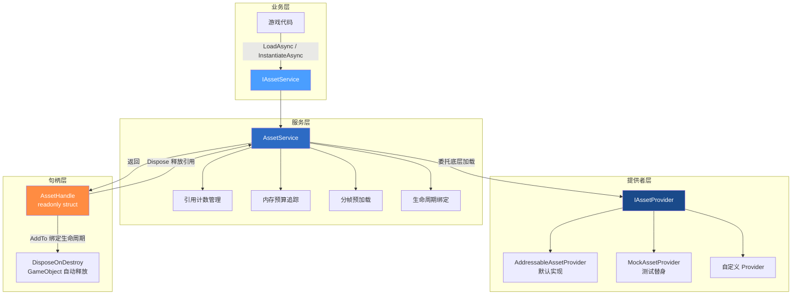
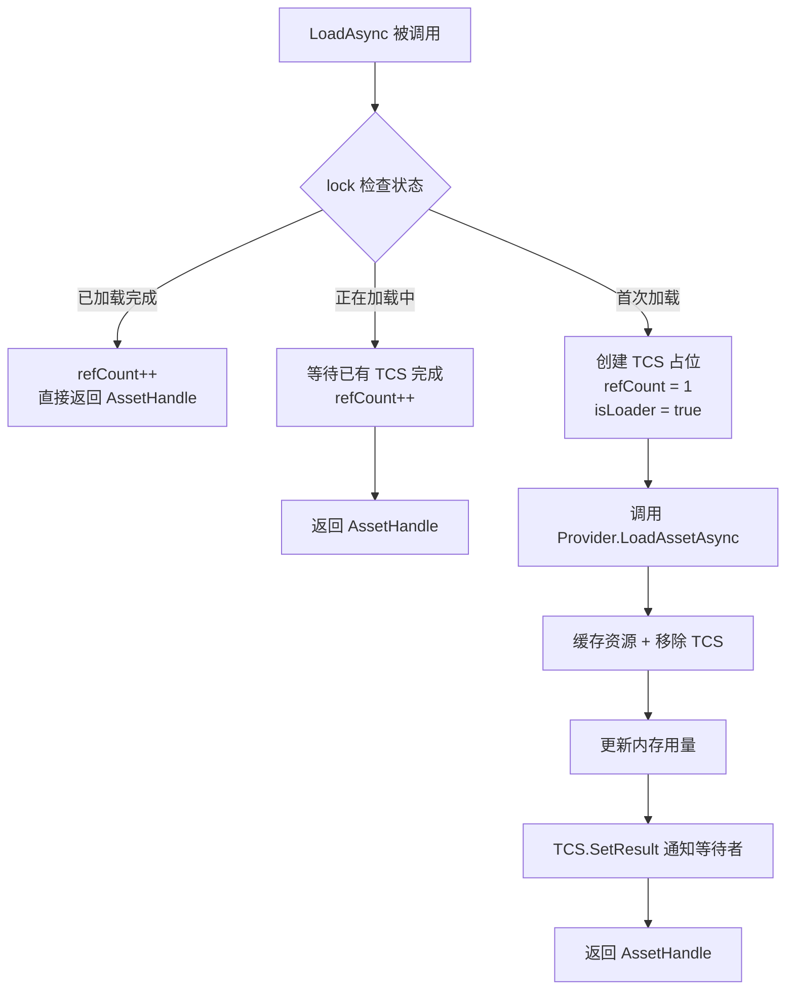
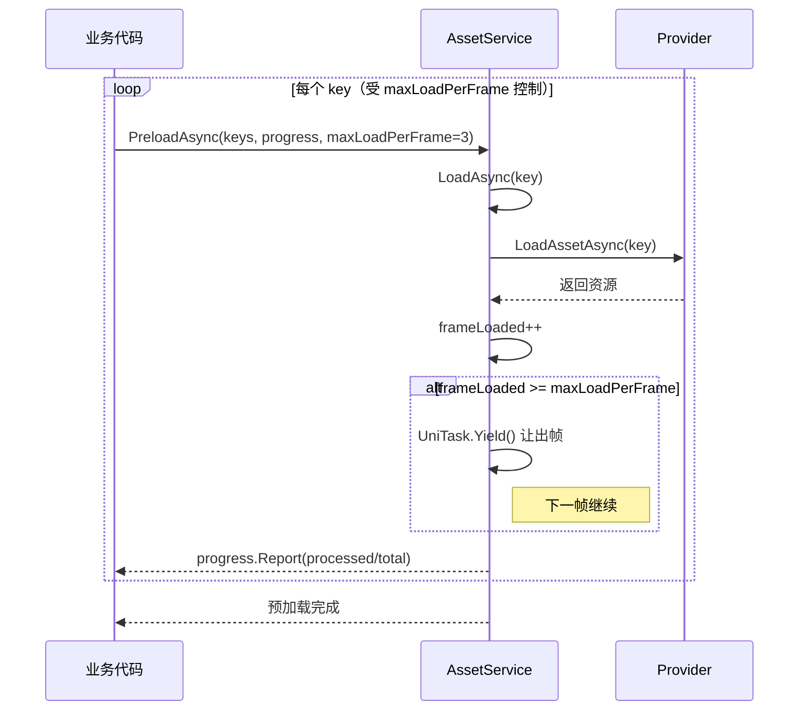

**AssetHandle** 是 CFramework 资源管理层的核心抽象——一个封装了引用计数的 `readonly struct`，将"谁在使用资源"这一关键问题从开发者的心智负担中彻底剥离。开发者拿到 `AssetHandle` 后，只需关心 **使用** 和 **释放** 两件事：要么显式调用 `Dispose()`，要么通过 `AddTo()` 将其绑定到 GameObject 的生命周期上自动释放。本文将深入剖析 AssetHandle 的设计哲学、引用计数机制、内存预算守护、分帧预加载策略，以及生命周期绑定的两种模式。

Sources: [AssetHandle.cs](Runtime/Asset/AssetHandle.cs#L1-L36), [IAssetService.cs](Runtime/Asset/IAssetService.cs#L1-L84)

## 架构总览：三层分离设计

资源管理子系统采用 **接口-服务-提供者** 三层架构。最上层 `IAssetService` 定义面向业务代码的资源加载契约，中层 `AssetService` 实现引用计数、去重、内存预算等横切关注点，底层 `IAssetProvider` 抽象具体的资源加载实现（默认为 Addressables）。这种分离意味着：你可以在测试中用 `MockAssetProvider` 替换真实加载，也可以在未来切换到自定义的资源管线，而业务代码完全不需要改动。



| 层级 | 核心类型 | 职责 |
|------|----------|------|
| 接口层 | `IAssetService` | 定义加载、实例化、释放、预加载、生命周期绑定契约 |
| 服务层 | `AssetService` | 引用计数、加载去重、内存预算、分帧控制、生命周期追踪 |
| 提供者层 | `IAssetProvider` / `AddressableAssetProvider` | 底层 Addressables 调用封装 |
| 句柄层 | `AssetHandle` / `AssetHandleExtensions` | 轻量级资源引用，支持 `using` 模式与 `AddTo` 绑定 |

Sources: [IAssetService.cs](Runtime/Asset/IAssetService.cs#L14-L35), [AssetService.cs](Runtime/Asset/AssetService.cs#L13-L29), [AddressableAssetProvider.cs](Runtime/Asset/AddressableAssetProvider.cs#L14-L16)

## AssetHandle：不可变的资源引用句柄

`AssetHandle` 是一个 `readonly struct`，设计上刻意保持极简——它只持有三个字段：**资源对象引用**（`Asset`）、**服务实例**（`_service`）和 **资源 Key**（`_key`）。作为 `readonly struct`，它在赋值时发生值拷贝而非堆分配，这意味着频繁传递句柄不会产生 GC 压力。但这也带来一个重要推论：**每次调用 `LoadAsync` 返回的句柄是独立的引用计数单元**，需要各自释放。

```csharp
// AssetHandle 的核心结构
public readonly struct AssetHandle : IDisposable
{
    public Object Asset { get; }           // 加载到的资源对象
    private readonly IAssetService _service; // 指向创建它的服务
    private readonly object _key;           // 资源的唯一标识

    public void Dispose()
    {
        // 释放时反向调用服务的 Release，递减引用计数
        if (_service != null && _key != null) _service.Release(_key);
    }

    public T As<T>() where T : Object      // 类型安全的资源获取
        => Asset as T;
}
```

`As<T>()` 方法提供了类型安全的向下转型，其语义等同于 C# 的 `as` 操作符——如果类型不匹配返回 `null` 而非抛出异常。此外，`internal` 修饰的构造函数确保了只有 `AssetService` 能够创建 `AssetHandle`，外部代码无法伪造句柄。

Sources: [AssetHandle.cs](Runtime/Asset/AssetHandle.cs#L9-L35)

## 加载流程与引用计数机制

`AssetService.LoadAsync<T>()` 是整个资源加载的入口，其核心逻辑围绕 **三路分支** 展开：已加载、加载中、首次加载。这个设计确保了同一资源永远只被底层加载一次，同时所有并发请求都能正确获得引用。



**并发安全** 是这一设计的核心考量。`AssetService` 内部维护了五个关键数据结构，全部通过统一的 `_lock` 对象保护：

| 数据结构 | 类型 | 用途 |
|----------|------|------|
| `_refCounts` | `Dictionary<object, int>` | 每个资源的引用计数 |
| `_loadedAssets` | `Dictionary<object, Object>` | 已完成加载的资源缓存 |
| `_loadingTasks` | `Dictionary<object, UniTaskCompletionSource>` | 正在加载中的占位任务 |
| `_instanceFlags` | `Dictionary<object, bool>` | 标记 key 是否为实例化资源 |
| `_lock` | `object` | 保护上述所有字典的互斥锁 |

当多个协程同时对同一 key 调用 `LoadAsync` 时，第一个请求创建 `UniTaskCompletionSource`（TCS）并成为 **加载发起者**（`isLoader = true`），后续请求发现 TCS 已存在，进入 **等待者** 路径（`isLoader = false`）。加载完成后，发起者通过 `TrySetResult` 一次性唤醒所有等待者，等待者在锁保护下各自递增引用计数。这保证了 **Provider 的 `LoadAssetAsync` 对同一 key 永远只被调用一次**。

Sources: [AssetService.cs](Runtime/Asset/AssetService.cs#L33-L92)

## 实例化：独立的引用追踪通道

`InstantiateAsync` 与 `LoadAsync` 采用 **完全分离的引用追踪通道**。加载资源关注的是原始 `Asset` 的生命周期，而实例化关注的是场景中 `GameObject` 实例的生命周期。为了防止二者的 key 冲突，实例化操作会自动添加 `"$inst_"` 前缀：

```csharp
// AssetService 中的实例化逻辑
var instKey = "$inst_" + key;  // 例如 "EnemyPrefab" → "$inst_EnemyPrefab"
_instanceFlags[instKey] = true;
_refCounts[instKey] = count + 1;
```

这意味着你可以同时加载一个预制体作为 `Asset`（用于读取配置数据）和实例化多个场景实例（用于实际展示），二者的引用计数互不干扰。释放实例时，框架通过 `_instanceFlags` 标记识别这是一个实例而非原始资源，从而调用 Provider 的正确释放逻辑。值得注意的是，实例化的返回值是 `GameObject` 而非 `AssetHandle`——你需要通过 `Release("$inst_" + key)` 手动管理实例的释放。

Sources: [AssetService.cs](Runtime/Asset/AssetService.cs#L94-L109), [AssetService.cs](Runtime/Asset/AssetService.cs#L136-L163)

## 生命周期绑定：两种自动释放模式

手动管理 `Dispose` 在复杂业务逻辑中容易遗漏，CFramework 提供了两种自动释放机制来消除这一风险。

### 模式一：AddTo 扩展方法（句柄侧绑定）

`AssetHandleExtensions.AddTo()` 是最直观的绑定方式，通过 `DisposeOnDestroy` 组件将句柄绑定到 GameObject 的销毁生命周期：

```csharp
// 使用示例
var handle = await assetService.LoadAsync<GameObject>("BossModel");
handle.AddTo(gameObject);  // gameObject 销毁时自动释放
```

内部实现中，`DisposeOnDestroy` 组件维护一个 `AssetHandle` 列表，在 `OnDestroy` 回调中遍历并释放所有句柄。它使用 `lock` 保护列表操作，并设置 `_destroyed` 标志防止 `OnDestroy` 之后的延迟调用。这种模式的优势是 **零侵入**——不需要修改业务代码的类结构。

Sources: [AssetHandleExtensions.cs](Runtime/Asset/AssetHandleExtensions.cs#L9-L68)

### 模式二：LinkToScope 服务方法（服务侧绑定）

`AssetService.LinkToScope()` 提供了更精细的控制，支持两种 scope 类型：

| Scope 类型 | 内部实现 | 触发时机 |
|------------|----------|----------|
| `GameObject` | `AssetLifetimeTracker` MonoBehaviour | GameObject 被销毁时 |
| `IDisposable` | `ScopeLink` 包装器 | 手动调用 Dispose 时 |

对于 GameObject scope，服务会在目标对象上添加 `AssetLifetimeTracker` 组件，其 `OnDestroy` 回调自动调用 `AssetService.Release(key)`。对于 IDisposable scope，`ScopeLink` 将资源释放与 scope 的 Dispose 调用组合在一起，确保两者同步释放。

```csharp
// 绑定到 GameObject 生命周期
assetService.LinkToScope("BossModel", bossGameObject);

// 绑定到 IDisposable 作用域
var scope = assetService.LinkToScope("EffectPrefab", someDisposable);
// ... 使用完毕后
scope.Dispose();  // 同时释放资源和 IDisposable
```

两种模式的关键区别在于：`AddTo` 作用于 `AssetHandle` 本身（触发句柄的 `Dispose`），而 `LinkToScope` 作用于服务层的 key（直接调用 `Release`，并在绑定时额外增加一次引用计数）。

Sources: [AssetService.cs](Runtime/Asset/AssetService.cs#L111-L134), [AssetService.cs](Runtime/Asset/AssetService.cs#L227-L304)

## 内存预算：阈值守护与用量追踪

`AssetMemoryBudget` 是一个轻量级的内存用量监控器，在每次资源加载完成时更新已用字节数，并检查是否超出预算阈值：

```csharp
public sealed class AssetMemoryBudget
{
    public long BudgetBytes { get; set; }     // 预算上限（字节）
    public long UsedBytes { get; internal set; } // 当前已用（字节）
    public float UsageRatio => ...;            // 使用率 0.0 ~ N
    public event Action<float> OnBudgetExceeded; // 超预算事件
}
```

预算值在 `AssetService` 构造时从 `FrameworkSettings.MemoryBudgetMB` 读取并转换为字节数（`MB * 1024 * 1024`）。每完成一次资源加载，服务通过 `IAssetProvider.GetAssetMemorySize(key)` 查询该资源的内存占用，累加到 `UsedBytes` 中并调用 `CheckBudget()`。当 `UsedBytes > BudgetBytes` 时，触发 `OnBudgetExceeded` 事件，回调参数为当前使用率。资源释放时，相应的内存量从 `UsedBytes` 中扣除。

需要注意的是，当前 `AddressableAssetProvider.GetAssetMemorySize` 返回的是一个固定值 `1024L`。在生产环境中，你应当实现精确的内存查询——例如通过 `UnityEngine.Profiling.Profiler.GetRuntimeMemorySizeLong` 或 Addressables 的 `GetDownloadSize` API 来获取真实数据。`MockAssetProvider` 中已预留了按 key 注册自定义内存大小的能力，方便在测试中模拟不同的内存场景。

| 配置项 | FrameworkSettings 字段 | 默认值 | 说明 |
|--------|----------------------|--------|------|
| 内存预算 | `MemoryBudgetMB` | 512 | 单位 MB，通过 FrameworkSettings 配置 |
| 每帧加载数 | `MaxLoadPerFrame` | 5 | PreloadAsync 的默认每帧加载数 |

Sources: [AssetMemoryBudget.cs](Runtime/Asset/AssetMemoryBudget.cs#L1-L22), [AssetService.cs](Runtime/Asset/AssetService.cs#L22-L29), [FrameworkSettings.cs](Runtime/Core/FrameworkSettings.cs#L14-L17), [AddressableAssetProvider.cs](Runtime/Asset/AddressableAssetProvider.cs#L67-L70)

## 分帧预加载：帧预算与进度报告

`PreloadAsync` 解决了一个经典问题：游戏启动时需要预加载大量资源，但不能让主线程卡死。其核心策略是 **帧预算控制**——每完成 `maxLoadPerFrame` 个资源加载后，主动 `await UniTask.Yield()` 让出当前帧的执行权，将剩余工作分散到后续帧中。

```csharp
// PreloadAsync 的核心循环
foreach (var key in keyList)
{
    ct.ThrowIfCancellationRequested();

    try
    {
        await LoadAsync<Object>(key, ct);
        frameLoaded++;

        // 分帧：达到帧预算后让出执行权
        if (frameLoaded >= maxLoadPerFrame)
        {
            frameLoaded = 0;
            await UniTask.Yield(ct);
        }
    }
    catch (Exception ex)
    {
        Debug.LogWarning($"Failed to preload: {key}, Error: {ex.Message}");
    }

    processed++;
    progress?.Report((float)processed / keyList.Count);
}
```

这段代码展现了三个重要的设计决策：

**容错性**——单个资源加载失败不会中断整个预加载流程，异常被捕获后仅输出警告日志，流程继续执行下一个 key。**可取消性**——每个迭代开头检查 `CancellationToken`，允许在任意时机中断预加载。**精确进度**——每处理完一个资源就通过 `IProgress<float>` 报告进度（0.0 ~ 1.0），而不是等到一批全部完成后才更新，这为 UI 层的加载进度条提供了丝滑的数据源。



Sources: [AssetService.cs](Runtime/Asset/AssetService.cs#L182-L217)

## 完整 API 速查

### IAssetService 接口方法

| 方法 | 返回类型 | 说明 |
|------|----------|------|
| `LoadAsync<T>(key, ct)` | `UniTask<AssetHandle>` | 异步加载资源，返回带引用计数的句柄 |
| `InstantiateAsync(key, parent, ct)` | `UniTask<GameObject>` | 异步实例化预制体到指定父节点 |
| `Release(key)` | `void` | 递减引用计数，归零时释放资源 |
| `ReleaseAll()` | `void` | 强制释放所有已加载资源和实例 |
| `LinkToScope(key, scope)` | `IDisposable` | 将资源绑定到 GameObject 或 IDisposable 的生命周期 |
| `PreloadAsync(keys, progress, maxLoadPerFrame, ct)` | `UniTask` | 批量分帧预加载 |

### AssetHandle 方法与扩展

| 方法 | 所在类型 | 说明 |
|------|----------|------|
| `Dispose()` | `AssetHandle` | 递减引用计数（可通过 `using` 语句自动调用） |
| `As<T>()` | `AssetHandle` | 类型安全地获取资源（返回 `null` 如果类型不匹配） |
| `handle.Asset` | `AssetHandle` | 获取原始 `UnityEngine.Object` 引用 |
| `AddTo(gameObject)` | `AssetHandleExtensions` | 绑定到 GameObject 销毁时自动释放 |
| `AddTo(behaviour)` | `AssetHandleExtensions` | 绑定到 MonoBehaviour 的 GameObject 销毁时释放 |

### AssetMemoryBudget 属性与事件

| 成员 | 类型 | 说明 |
|------|------|------|
| `BudgetBytes` | `long` (可读写) | 内存预算上限，单位字节 |
| `UsedBytes` | `long` (只读) | 当前已用内存，单位字节 |
| `UsageRatio` | `float` (只读) | 使用率 = UsedBytes / BudgetBytes |
| `OnBudgetExceeded` | `event Action<float>` | 超预算时触发，参数为当前使用率 |

Sources: [IAssetService.cs](Runtime/Asset/IAssetService.cs#L40-L83), [AssetHandle.cs](Runtime/Asset/AssetHandle.cs#L9-L35), [AssetHandleExtensions.cs](Runtime/Asset/AssetHandleExtensions.cs#L9-L28), [AssetMemoryBudget.cs](Runtime/Asset/AssetMemoryBudget.cs#L8-L21)

## 典型使用模式

### 模式一：using 语句的确定性释放

适用于资源使用范围明确、生命周期可控的场景。`AssetHandle` 实现了 `IDisposable`，天然支持 C# 的 `using` 模式：

```csharp
// 确定性释放：using 块结束时自动 Dispose
using var handle = await assetService.LoadAsync<Texture2D>("Icon Atlas");
var texture = handle.As<Texture2D>();
// ... 使用 texture 进行 UI 渲染 ...
// 离开 using 作用域后，引用计数自动递减
```

### 模式二：AddTo 的游戏对象绑定

适用于资源跟随某个 GameObject 的场景——例如角色模型跟随角色实体，特效跟随技能容器：

```csharp
var handle = await assetService.LoadAsync<GameObject>("SkillEffect");
var effect = handle.As<GameObject>();
handle.AddTo(gameObject);  // gameObject 销毁时，资源自动释放
```

### 模式三：预加载与进度展示

适用于游戏启动、场景切换等需要批量加载资源的场景：

```csharp
var preloadKeys = new object[] { "UIAtlas", "CommonAudio", "ParticlePool" };
var progress = new Progress<float>(p => loadingBar.value = p);
await assetService.PreloadAsync(preloadKeys, progress, maxLoadPerFrame: 3);
```

Sources: [AssetHandle.cs](Runtime/Asset/AssetHandle.cs#L23-L26), [AssetHandleExtensions.cs](Runtime/Asset/AssetHandleExtensions.cs#L14-L28), [AssetService.cs](Runtime/Asset/AssetService.cs#L182-L217)

## 设计要点总结

**AssetHandle 选择 `readonly struct` 而非 class**，这是一个经过权衡的决定。作为值类型，它在函数传参和赋值时不产生堆分配，避免了 GC 压力。但代价是每次传递都会创建一个"逻辑副本"——调用 `Dispose()` 的次数必须与 `LoadAsync` 返回的句柄数量一致，多释放或少释放都会导致引用计数错误。

**引用计数与加载去重的协同** 是整个系统最精妙的部分。通过 `UniTaskCompletionSource` 作为占位符，系统在第一个加载请求尚未完成时，就能让后续请求排队等待，且所有请求最终获得相同的资源实例。这种设计既避免了重复加载的浪费，又确保了并发场景下的线程安全。

**内存预算是顾问而非强制**——`OnBudgetExceeded` 事件不会自动卸载资源，它只是一个通知机制。这给了开发者最大的灵活性：你可以选择立即卸载最久未用的资源，也可以延迟到合适的时机（例如场景切换时）统一处理。

Sources: [AssetHandle.cs](Runtime/Asset/AssetHandle.cs#L9-L35), [AssetService.cs](Runtime/Asset/AssetService.cs#L33-L92), [AssetMemoryBudget.cs](Runtime/Asset/AssetMemoryBudget.cs#L17-L20)

---

**下一步阅读**：了解句柄如何在 UI 系统中管理面板资源，参见 [UI 面板系统：IUI 生命周期、UIBinder 组件注入与导航栈管理](12-ui-mian-ban-xi-tong-iui-sheng-ming-zhou-qi-uibinder-zu-jian-zhu-ru-yu-dao-hang-zhan-guan-li)；了解 Provider 的测试替换模式，参见 [单元测试指南：测试覆盖策略与 Mock 替换模式](22-dan-yuan-ce-shi-zhi-nan-ce-shi-fu-gai-ce-lue-yu-mock-ti-huan-mo-shi)；了解如何自定义 Provider 以接入非 Addressables 资源管线，参见 [框架扩展指南：自定义 IInstaller、IAssetProvider 与 ISceneTransition](23-kuang-jia-kuo-zhan-zhi-nan-zi-ding-yi-iinstaller-iassetprovider-yu-iscenetransition)。