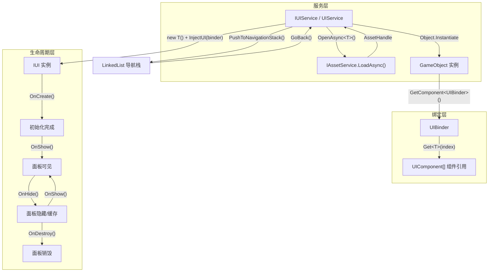
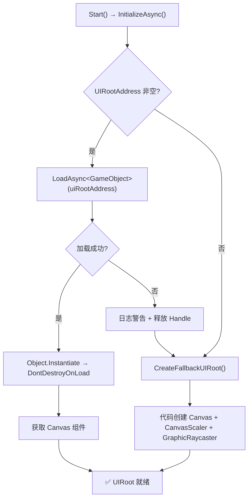
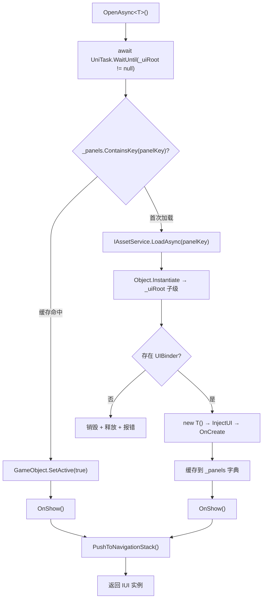

CFramework 的 UI 面板系统围绕三个核心抽象构建：**IUI 生命周期接口**定义面板从创建到销毁的完整状态机；**UIBinder 组件绑定器**充当 Prefab 与逻辑类之间的桥接层，以声明式方式配置组件引用；**UIService 导航栈**以 `LinkedList<string>` 实现面板的历史回溯与自动淘汰。整个系统遵循「约定优于配置」原则——Prefab 名称即为 Addressable Key，也是 `typeof(T).Name` 的推导依据，开发者无需编写任何注册或路由配置即可打开面板。

Sources: [IUI.cs](Runtime/UI/IUI.cs#L1-L31), [IUIService.cs](Runtime/UI/IUIService.cs#L1-L62), [UIService.cs](Runtime/UI/UIService.cs#L1-L331)

## 架构总览：三层职责分离

在深入每个组件之前，先建立系统全局视角。下图展示了从用户调用 `OpenAsync<T>()` 到面板最终渲染的完整数据流——跨越服务层、绑定层和生命周期层：



**关键设计约束**：IUI 实例是纯 C# 对象（不继承 MonoBehaviour），通过 `new T()` 创建。这意味着面板逻辑与 Unity GameObject 生命周期完全解耦——GameObject 的 `SetActive(false/true)` 控制可见性，而 IUI 的 `OnHide()/OnShow()` 负责逻辑层面的状态切换。UIBinder 在 `InjectUI` 完成注入后即失去用途，不再参与后续逻辑。

Sources: [UIService.cs](Runtime/UI/UIService.cs#L179-L196), [UIBinder.cs](Runtime/UI/UIBinder.cs#L14-L17), [IUI.cs](Runtime/UI/IUI.cs#L1-L31)

## IUI 生命周期接口：四阶段状态机

`IUI` 是所有 UI 面板必须实现的接口，定义了四个顺序执行的生命周期方法。UIService 在特定时机调用它们，开发者通过重写实现面板的业务逻辑。

Sources: [IUI.cs](Runtime/UI/IUI.cs#L1-L31)

### 四阶段调用时序与语义

| 阶段 | 方法 | 调用时机 | 典型用途 | 可调用次数 |
|------|------|---------|---------|-----------|
| 注入 | `InjectUI(UIBinder)` | 实例化后立即调用，在 `OnCreate` 之前 | 接收 UIBinder 中的组件引用 | 恰好 1 次 |
| 创建 | `OnCreate()` | `InjectUI` 完成后调用 | 初始化面板状态、绑定事件监听 | 恰好 1 次 |
| 显示 | `OnShow()` | 面板首次显示或从缓存中重新激活 | 刷新数据、播放进入动画、启用交互 | 1 次或多次 |
| 隐藏 | `OnHide()` | 调用 `Close<T>()` 或 `GoBack()` 时 | 暂停动画、禁用交互、保存临时状态 | 0 次或多次 |
| 销毁 | `OnDestroy()` | 面板从缓存中彻底移除（栈淘汰或 Dispose） | 释放资源、取消订阅、清理引用 | 恰好 1 次 |

状态转换遵循严格的不变式：`InjectUI → OnCreate → (OnShow ↔ OnHide)* → OnDestroy`。**不存在不经过 `InjectUI + OnCreate` 直接进入 `OnShow` 的路径**，也不存在 `OnDestroy` 之后再调用任何方法的路径。

Sources: [UIService.cs](Runtime/UI/UIService.cs#L179-L201), [UIService.cs](Runtime/UI/UIService.cs#L270-L283)

### InjectUI 的特殊地位

`InjectUI` 在五个方法中具有唯一的双重身份：它既是 IUI 接口的显式成员，又是实际由代码生成器实现的方法。框架约定面板类使用 `partial class` 分拆为两个文件——自动生成的 `.Bindings.cs` 负责实现 `InjectUI`，用户编写的 `.cs` 负责实现其余四个生命周期方法。这种分拆保证了组件绑定的自动化与用户代码的手动控制互不干扰。

Sources: [UIPanelGenerator.cs](Editor/Generators/UIPanelGenerator.cs#L189-L197)

## UIBinder 组件绑定器：Prefab 与逻辑的桥梁

`UIBinder` 是挂载在 UI Prefab 根节点上的 MonoBehaviour 组件，充当「组件引用的容器」。它存储一组 `UIComponent` 数据，每个 `UIComponent` 记录一个目标 GameObject 及其需要提取的组件类型。UIService 在实例化 Prefab 后获取 UIBinder，将其传递给 `IUI.InjectUI()` 完成一次性注入。

Sources: [UIBinder.cs](Runtime/UI/UIBinder.cs#L1-L128)

### UIComponent 数据结构

每个 `UIComponent` 实例封装了一条绑定信息——**哪个 GameObject 上的哪种 Component 类型**。它通过序列化 `_typeName`（AssemblyQualifiedName）来持久化类型信息，在 Inspector 中以 `ValueDropdown` 形式展示目标物体上所有可用组件类型，确保开发者只能选择实际存在的组件。

Sources: [UIComponent.cs](Runtime/UI/UIComponent.cs#L1-L58)

| 字段 | 类型 | 序列化 | 用途 |
|------|------|--------|------|
| `gameObject` | `GameObject` | ✅ `[SerializeField]` | 目标子物体引用 |
| `ComponentType` | `Type` | 通过 `_typeName` 间接序列化 | 要提取的组件类型 |
| `Name` | `string` | 只读，取自 `gameObject.name` | 用于按名称查找和代码生成时的字段命名 |

`AvailableComponentTypes` 属性在 Inspector 中动态扫描目标 GameObject 上所有 Component，以 `ValueDropdown` 形式呈现——这防止了类型拼写错误，也避免了运行时 `GetComponent<T>()` 返回 null 的风险。

Sources: [UIComponent.cs](Runtime/UI/UIComponent.cs#L46-L56)

### Get\<T\> 检索机制：索引优先

UIBinder 提供两种检索方式，但代码生成器始终使用**索引方式**，因为索引访问是 O(1) 直接寻址，无需遍历：

```csharp
// 索引方式 — 代码生成器使用，O(1) 性能
public T Get<T>(int index) where T : Component

// 名称方式 — 手动调用时的备选，O(n) 线性扫描
public T Get<T>(string name) where T : Component
```

索引方式的容错设计值得注意：当 `index` 越界时返回 `null` 而非抛出异常，这保证了即使 Prefab 结构发生变动（组件被删除导致索引偏移），`InjectUI` 也不会因异常中断整个面板初始化。但开发者需要在 `OnCreate` 中对关键字段进行 null 检查。

Sources: [UIBinder.cs](Runtime/UI/UIBinder.cs#L29-L53)

### 编辑器内的一键代码生成

UIBinder 内嵌了一个编辑器按钮 `[Button("生成绑定代码")]`，它通过反射调用 `CFramework.Editor` 程序集中的 `UIPanelGenerator.Generate` 方法。使用反射而非直接引用的原因是 **Runtime 程序集无法引用 Editor 程序集**——这是 Unity 程序集划分的基本约束。按钮仅在 `HasValidComponents()` 返回 true 时显示，即至少有一个 `UIComponent` 同时具有有效的 `ComponentType` 和 `gameObject` 引用。

Sources: [UIBinder.cs](Runtime/UI/UIBinder.cs#L75-L127)

## UIService 核心实现：加载、缓存与导航栈

`UIService` 是 `IUIService` 的唯一实现，作为 VContainer 的 EntryPoint（`IStartable`）自动初始化，并在 `IDisposable.Dispose` 时清理所有资源。它的核心职责可以拆解为三个子系统。

Sources: [UIService.cs](Runtime/UI/UIService.cs#L1-L331)

### UIRoot 初始化：Addressable 加载与代码兜底

UIService 实现了 `IStartable`，在 VContainer 解析完成后自动调用 `Start()` 方法，触发异步初始化流程。UIRoot 是所有 UI 面板的根容器，其初始化遵循两阶段策略：



**兜底 UIRoot** 的配置非常实用：`RenderMode.ScreenSpaceOverlay`、1920×1080 参考分辨率、`matchWidthOrHeight = 0.5` 均衡适配——这是大多数 Unity UI 项目的标准配置，确保即使没有提供 Prefab 也能正常工作。UIRoot 通过 `DontDestroyOnLoad` 确保场景切换时不被销毁。

Sources: [UIService.cs](Runtime/UI/UIService.cs#L44-L94), [UIService.cs](Runtime/UI/UIService.cs#L244-L265), [FrameworkSettings.cs](Runtime/Core/FrameworkSettings.cs#L19-L22)

### 面板加载与缓存策略

`OpenAsync<T>()` 是系统最核心的方法，其执行路径取决于面板是否已在缓存中：



**缓存字典 `_panels`** 的键是 `typeof(T).Name`，值是 `UIPanelData` 内部类，封装了 IUI 实例、GameObject、UIBinder、AssetHandle 和开关状态。这意味着：

- **同一类型的面板在内存中最多存在一个实例**——不存在重复实例化路径
- **关闭面板 ≠ 销毁面板**——`Close<T>()` 仅调用 `OnHide()` 并 `SetActive(false)`，面板保留在缓存字典中等待复用
- **真正销毁面板的时机只有两个**：导航栈溢出时的 `DestroyPanel()` 和 `Dispose()` 时的全局清理

Sources: [UIService.cs](Runtime/UI/UIService.cs#L141-L202), [UIService.cs](Runtime/UI/UIService.cs#L207-L228), [UIService.cs](Runtime/UI/UIService.cs#L286-L299)

### 导航栈：LinkedList 实现的 LRU 淘汰

导航栈基于 `LinkedList<string>` 实现，存储面板的 `panelKey`（即类名字符串）。这不是一个简单的后进先出栈——它具备「重新激活时提升至栈顶」的行为：

| 操作 | 行为 | 边界处理 |
|------|------|---------|
| `PushToNavigationStack(key)` | 先 `Remove(key)`（若已存在），再 `AddLast(key)` | 超出 `MaxStackCapacity` 时从栈头依次调用 `DestroyPanel()` |
| `GoBack()` | 取 `Last.Value`（当前面板），调用 `ClosePanel()` | 栈中 ≤ 1 个元素时直接 return |
| `ClosePanel(key)` | 调用 `OnHide()` + `SetActive(false)` + `Remove(key)` | 面板不在缓存中时静默返回 |
| `CloseAll()` | 遍历所有 IsOpen=true 的面板执行 OnHide + SetActive(false) | 清空整个导航栈 |
| `DestroyPanel(key)` | 调用 `OnDestroy()` + 销毁 GameObject + 释放 AssetHandle + 从字典移除 | 面板不存在时静默返回 |

**淘汰机制的关键细节**：`PushToNavigationStack` 在容量溢出时使用 `while` 循环而非 `if` 判断——这是防御性编程，理论上一次 `Push` 最多淘汰一个面板（因为新元素只增加一个），但 while 循环确保了即使 `MaxStackCapacity` 被运行时缩减为 1 也不会出现不一致状态。

Sources: [UIService.cs](Runtime/UI/UIService.cs#L304-L317), [UIService.cs](Runtime/UI/UIService.cs#L232-L239), [UIService.cs](Runtime/UI/UIService.cs#L270-L299)

### 面板关闭 vs 面板销毁：两级释放语义

这是理解 UIService 内存模型的关键区分：

**Close（隐藏并缓存）**：触发 `OnHide()` 生命周期 → `GameObject.SetActive(false)` → 从导航栈移除 → 面板数据仍保留在 `_panels` 字典中。下次 `OpenAsync<T>()` 时直接复用，仅触发 `OnShow()` 而不重新加载 Prefab。

**Destroy（彻底销毁）**：触发 `OnDestroy()` 生命周期 → `Object.Destroy(GameObject)` → `AssetHandle.Dispose()` 释放 Addressable 引用 → 从 `_panels` 字典中移除。下次 `OpenAsync<T>()` 需要重新加载和实例化。

| 维度 | Close | Destroy |
|------|-------|---------|
| 生命周期回调 | `OnHide()` | `OnDestroy()` |
| GameObject | `SetActive(false)` | `Object.Destroy()` |
| AssetHandle | 保留 | `Dispose()` 释放 |
| 缓存字典 | 保留 | 移除 |
| 导航栈 | 移除 | 移除 |
| 触发场景 | 用户调用 `Close<T>()` / `GoBack()` | 栈溢出淘汰 / `Dispose()` 全局清理 |

Sources: [UIService.cs](Runtime/UI/UIService.cs#L270-L299)

## 事件系统与 R3 集成

UIService 通过两个 R3 `Subject<string>` 暴露面板状态变化事件，供外部系统（如成就系统、新手引导、埋点统计）订阅：

```csharp
// 面板打开事件 — 在 OnShow() 和 PushToNavigationStack() 之后触发
Observable<string> OnPanelOpened { get; }

// 面板关闭事件 — 在 OnHide() 和导航栈移除之后触发
Observable<string> OnPanelClosed { get; }
```

事件的 payload 是面板的 `panelKey`（即 `typeof(T).Name` 字符串），订阅者可以根据 key 判断具体是哪个面板发生了状态变化。这两个事件在 `Dispose()` 时随 Subject 一起释放，不会产生内存泄漏。

Sources: [UIService.cs](Runtime/UI/UIService.cs#L24-L25), [UIService.cs](Runtime/UI/UIService.cs#L128-L130), [IUIService.cs](Runtime/UI/IUIService.cs#L25-L31)

## DI 注册与服务生命周期

`UIService` 通过 `FrameworkModuleInstaller` 以 EntryPoint Singleton 的方式注册到 VContainer 容器中：

```csharp
builder.RegisterEntryPoint<UIService>(Lifetime.Singleton).As<IUIService>();
```

作为 EntryPoint，它实现了 `IStartable`（容器构建完成后自动调用 `Start()`）和 `IDisposable`（生命周期作用域销毁时自动调用 `Dispose()`）。这意味着 UIService 的初始化和清理完全由 DI 容器管理，开发者无需手动调用任何初始化方法。

Sources: [FrameworkModuleInstaller.cs](Runtime/Core/DI/FrameworkModuleInstaller.cs#L1-L28), [InstallerExtensions.cs](Runtime/Core/DI/InstallerExtensions.cs#L30-L37)

## FrameworkSettings 中的 UI 相关配置

`FrameworkSettings` ScriptableObject 中有两个直接控制 UIService 行为的字段：

| 字段 | 类型 | 默认值 | 影响 |
|------|------|--------|------|
| `MaxNavigationStack` | `int` | 10 | 导航栈最大容量，超出时从栈底淘汰最旧面板 |
| `UIRootAddress` | `string` | `"UIRoot"` | UIRoot Prefab 的 Addressable Key，为空时使用代码兜底创建 |

`MaxNavigationStack` 的值在 UIService 构造函数中读取，运行时也可通过 `MaxStackCapacity` 属性动态调整（最小值保证为 1）。`UIRootAddress` 在 `InitializeAsync()` 中使用，如果 Addressable 加载失败会自动降级为代码创建。

Sources: [FrameworkSettings.cs](Runtime/Core/FrameworkSettings.cs#L19-L22), [UIService.cs](Runtime/UI/UIService.cs#L37-L42), [UIService.cs](Runtime/UI/UIService.cs#L121-L126)

## 完整工作流：从 Prefab 到运行面板

将上述所有机制串联起来，一个面板从创建到运行的完整工作流如下：

**第 1 步 — Prefab 准备**：在 UI Prefab 根节点挂载 `UIBinder` 组件，在 Inspector 中配置 `_components` 数组，为每个需要绑定的子物体选择组件类型。

**第 2 步 — 代码生成**：点击 UIBinder 上的「生成绑定代码」按钮，`UIPanelGenerator` 生成两个文件到 `Assets/Scripts/UI/` 目录：
- `{PanelName}.Bindings.cs` — 自动生成的 `partial class`，包含 `_xxx` 字段声明和 `InjectUI` 方法实现
- `{PanelName}.cs` — 用户骨架文件（仅首次生成），包含空的 `OnCreate/OnShow/OnHide/OnDestroy` 方法

**第 3 步 — 业务逻辑**：在用户文件中实现四个生命周期方法，使用已注入的 `_xxx` 字段操作 UI 组件。

**第 4 步 — Addressable 标记**：将 Prefab 标记为 Addressable，Key 设为类名（与 `typeof(T).Name` 一致）。

**第 5 步 — 运行时调用**：在任意通过 DI 注入的类中，构造函数注入 `IUIService`，然后调用 `await uiService.OpenAsync<PanelName>()`。

Sources: [UIBinder.cs](Runtime/UI/UIBinder.cs#L75-L111), [UIPanelGenerator.cs](Editor/Generators/UIPanelGenerator.cs#L129-L244), [UIPanelGeneratorConfig.cs](Editor/Configs/UIPanelGeneratorConfig.cs#L1-L43), [UIService.cs](Runtime/UI/UIService.cs#L141-L202)

## 设计决策与权衡分析

| 设计决策 | 优势 | 代价 |
|---------|------|------|
| IUI 为纯 C# 对象（非 MonoBehaviour） | 可单元测试、无 GameObject 生命周期耦合 | 无法使用 Inspector 拖拽赋值，依赖 UIBinder 中转 |
| 面板单例缓存（同类名唯一实例） | 避免重复加载、内存可控 | 不支持同类型多实例（如多个相同弹窗） |
| 约定 Prefab 名称 = 类名 | 零配置打开面板、代码生成自动化 | 重构类名时需同步修改 Prefab/Addressable Key |
| LinkedList 导航栈 + LRU 淘汰 | 历史回退自然、内存自动回收 | 被淘汰面板的 UI 状态丢失（OnDestroy 不可逆） |
| UIBinder 一次性注入后不再使用 | 清晰的职责边界、无运行时查询开销 | 动态添加组件时需重新生成绑定代码 |

Sources: [IUI.cs](Runtime/UI/IUI.cs#L1-L31), [UIService.cs](Runtime/UI/UIService.cs#L141-L202), [UIBinder.cs](Runtime/UI/UIBinder.cs#L14-L17)

## 延伸阅读

- 代码生成的完整配置选项与命名规则转换细节，参见 [UI 代码生成器：从预制体命名规范自动生成组件绑定代码](13-ui-dai-ma-sheng-cheng-qi-cong-yu-zhi-ti-ming-ming-gui-fan-zi-dong-sheng-cheng-zu-jian-bang-ding-dai-ma)
- 面板加载依赖的 `AssetHandle` 引用计数与生命周期绑定机制，参见 [AssetHandle 资源句柄：加载、实例化、内存预算与分帧预加载](11-assethandle-zi-yuan-ju-bing-jia-zai-shi-li-hua-nei-cun-yu-suan-yu-fen-zheng-yu-jia-zai)
- UIService 的 DI 注册原理与 `IStartable`/`IDisposable` 生命周期管理，参见 [依赖注入体系：GameScope、SceneScope 与动态安装器机制](5-yi-lai-zhu-ru-ti-xi-gamescope-scenescope-yu-dong-tai-an-zhuang-qi-ji-zhi)
- `FrameworkSettings` 中 `UIRootAddress` 和 `MaxNavigationStack` 的全局配置方式，参见 [FrameworkSettings 全局配置详解](3-frameworksettings-quan-ju-pei-zhi-xiang-jie)