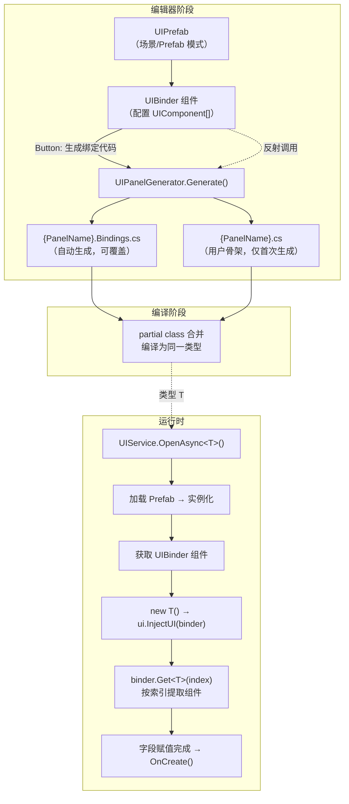

CFramework 的 UI 代码生成器是一套编辑器工具链，旨在消除 UI 开发中最繁琐的重复劳动——手动编写组件引用声明和赋值逻辑。开发者只需在 Prefab 上通过 `UIBinder` 配置需要绑定的子物体及其组件类型，一键即可生成类型安全的绑定代码和用户骨架文件，将"配置即代码"的理念贯穿整个 UI 开发流程。本文将从架构设计、代码生成机制、配置体系、运行时集成和实际操作流程五个维度，深入解析这套生成器的完整工作原理。

Sources: [UIPanelGenerator.cs](Editor/Generators/UIPanelGenerator.cs#L1-L248), [UIBinder.cs](Runtime/UI/UIBinder.cs#L1-L128)

## 架构全景：从配置到代码的完整管线

代码生成器的核心设计遵循**单一数据源原则**：`UIBinder` 组件上的 `UIComponent[]` 数组是唯一的配置入口，所有生成的代码都从这一份数据推导而来。这种设计保证了配置与代码之间的强一致性——只要 UIBinder 中的数据正确，生成的代码就不会出现引用错误。

下面的架构图展示了从编辑器配置到运行时注入的完整数据流：



值得注意的是，`UIBinder` 通过**反射**调用 Editor 程序集中的 `UIPanelGenerator`。这是因为 Runtime 程序集无法直接引用 Editor 程序集，而按钮又必须挂在 Runtime 的 `UIBinder` 上。这种跨程序集反射调用模式在 Unity 编辑器工具开发中是标准做法，确保了 Runtime 代码的干净性。

Sources: [UIBinder.cs](Runtime/UI/UIBinder.cs#L75-L126), [UIPanelGenerator.cs](Editor/Generators/UIPanelGenerator.cs#L27-L45)

## 核心机制：UIBinder 与 UIComponent 的数据模型

**UIBinder** 是挂载在 UI Prefab 根节点上的 MonoBehaviour，充当组件引用的容器。它在 `InjectUI` 阶段将组件注入到 `IUI` 实例中，之后不再被使用——这是一个典型的"一次性中介"模式。UIBinder 提供两种查询方式：按索引查询（`Get<T>(int index)`）和按名称查询（`Get<T>(string name)`），代码生成器使用的是更高效的索引方式。

**UIComponent** 是一个可序列化的数据结构，记录一条绑定关系：

| 字段 | 类型 | 说明 |
|------|------|------|
| `gameObject` | `GameObject` | 目标子物体（Required，Odin 标记） |
| `Name` | `string` | 只读，自动取 `gameObject.name` |
| `ComponentType` | `Type` | 通过下拉菜单选择目标物体上的组件类型 |
| `_typeName` | `string` | 内部序列化字段，存储程序集限定名 |

`ComponentType` 的下拉菜单（`ValueDropdown`）自动枚举目标 GameObject 上所有已挂载的组件类型，开发者只需从列表中选择即可。类型信息通过 `AssemblyQualifiedName` 序列化，确保跨程序集的类型解析准确性。

Sources: [UIBinder.cs](Runtime/UI/UIBinder.cs#L17-L73), [UIComponent.cs](Runtime/UI/UIComponent.cs#L1-L57)

## 代码生成引擎：UIPanelGenerator 详解

`UIPanelGenerator` 是一个静态类，入口方法是 `Generate(UIBinder binder, string prefabName)`。生成过程分为三个阶段：**数据采集**、**绑定代码生成**和**用户骨架生成**。

### 阶段一：数据采集与命名转换

生成器遍历 `UIComponent[]` 数组，对每条记录提取四个关键信息：**索引位置**、**类型名称**、**字段名称**和**显示名称**。其中最关键的是字段名称的推导逻辑——`ToFieldName()` 方法实现了一套智能命名转换规则：

| 输入名称 | 转换过程 | 输出字段名 |
|----------|----------|------------|
| `btn_Start` | 移除 `btn_` 前缀 → `Start` → 首字母小写 | `start` |
| `txt_PlayerName` | 移除 `txt_` 前缀 → `PlayerName` → 下划线分割驼峰 | `playerName` |
| `img_Background` | 移除 `img_` 前缀 → `Background` → 首字母小写 | `background` |
| `m_CloseButton` | 移除 `m_` 前缀 → `CloseButton` → 首字母小写 | `closeButton` |
| `go_Panel` | 移除 `go_` 前缀 → `Panel` → 首字母小写 | `panel` |
| `obj_ItemList` | 移除 `obj_` 前缀 → `ItemList` → 下划线分割驼峰 | `itemList` |
| `HealthBar` | 无前缀无下划线 → 首字母小写 | `healthBar` |

被移除的前缀列表为：`m_`、`btn_`、`txt_`、`img_`、`go_`、`obj_`，匹配时不区分大小写。最终字段名会加上配置中的 `FieldPrefix`（默认 `_`），因此 `btn_Start` 的完整字段名为 `_start`。

同时，生成器会自动收集所有组件类型所在的命名空间，生成对应的 `using` 指令（过滤掉全局命名空间和目标命名空间 `UI`），确保生成的代码无需手动添加引用。

Sources: [UIPanelGenerator.cs](Editor/Generators/UIPanelGenerator.cs#L49-L156)

### 阶段二：绑定代码生成

绑定代码文件以 `{PrefabName}.Bindings.cs` 命名，带有 `<auto-generated>` 标记头。生成的代码结构如下：

```csharp
// <auto-generated>
//     此代码由 CFramework UIPanelGenerator 自动生成。
//     对此文件的更改可能导致错误的行为，并且会在重新生成时丢失。
// </auto-generated>

using CFramework.Runtime.UI;
using UnityEngine.UI;  // 自动收集的命名空间

namespace UI
{
    public partial class BattlePanel
    {
        /// <summary>
        /// btn_Start
        /// </summary>
        private Button _start;

        /// <summary>
        /// txt_Score
        /// </summary>
        private TextMeshProUGUI _score;

        void IUI.InjectUI(UIBinder binder)
        {
            _start = binder.Get<Button>(0);
            _score = binder.Get<TextMeshProUGUI>(1);
        }
    }
}
```

`InjectUI` 方法通过 `binder.Get<T>(index)` 按索引精确提取组件。索引方式的优势在于 O(1) 的查找性能和零字符串分配，适合高频调用的 UI 初始化场景。

Sources: [UIPanelGenerator.cs](Editor/Generators/UIPanelGenerator.cs#L129-L205)

### 阶段三：用户骨架生成

骨架文件以 `{PrefabName}.cs` 命名，**仅在文件不存在时生成**，永远不会覆盖已有的用户代码。这是 partial class 模式的关键设计：绑定代码可以反复生成，而用户业务逻辑始终安全。

```csharp
using CFramework.Runtime.UI;
using UnityEngine;

namespace UI
{
    public partial class BattlePanel : IUI
    {
        public void OnCreate() { }
        public void OnShow() { }
        public void OnHide() { }
        public void OnDestroy() { }
    }
}
```

生成的骨架文件实现了 `IUI` 接口的四个生命周期方法，开发者在其中填写业务逻辑。由于绑定文件中的 partial class 已经实现了 `InjectUI`（通过显式接口实现 `void IUI.InjectUI`），用户文件中无需关心组件注入的任何细节。

Sources: [UIPanelGenerator.cs](Editor/Generators/UIPanelGenerator.cs#L210-L244), [IUI.cs](Runtime/UI/IUI.cs#L1-L31)

## 配置体系：UIPanelGeneratorConfig

生成器的所有行为参数集中在 `UIPanelGeneratorConfig` 静态类中，以常量形式定义：

| 配置项 | 值 | 说明 |
|--------|-----|------|
| `Namespace` | `"UI"` | 生成代码的目标命名空间 |
| `OutputPath` | `"Assets/Scripts/UI"` | 输出目录（Assets 相对路径） |
| `BindingsFileSuffix` | `".Bindings.cs"` | 绑定文件后缀 |
| `UserFileSuffix` | `".cs"` | 用户骨架文件后缀 |
| `FieldPrefix` | `"_"` | 字段命名前缀（默认下划线风格） |
| `GenerateXmlComments` | `true` | 是否为字段生成 XML 文档注释 |
| `GenerateUserFile` | `true` | 是否同时生成用户骨架文件 |

路径常量与 `EditorPaths.UIBindingsOutput`（`"Assets/Scripts/UI"`）保持一致，确保生成器输出的文件落入约定的项目目录结构中。这些配置项虽然以常量形式存在（而非 ScriptableObject），但对于中小型项目而言，这种静态配置方式更直观、零运行时开销，且修改后立即生效无需额外序列化。

Sources: [UIPanelGeneratorConfig.cs](Editor/Configs/UIPanelGeneratorConfig.cs#L1-L43), [EditorPaths.cs](Editor/EditorPaths/EditorPaths.cs#L57-L74)

## 运行时集成：从生成代码到组件注入

生成的代码在运行时通过 `UIService` 的 `OpenAsync<T>()` 方法被激活。整个注入链路如下：

```mermaid
sequenceDiagram
    participant Caller as 调用方
    participant UIService as UIService
    participant AssetService as AssetService
    participant Binder as UIBinder
    participant UI as T (IUI 实例)

    Caller->>UIService: OpenAsync&lt;BattlePanel&gt;()
    UIService->>UIService: panelKey = typeof(T).Name
    alt 已缓存
        UIService->>UI: OnShow()
    else 首次打开
        UIService->>AssetService: LoadAsync&lt;GameObject&gt;(panelKey)
        AssetService-->>UIService: AssetHandle
        UIService->>UIService: Instantiate → Get UIBinder
        UIService->>UI: new T()
        UIService->>UI: InjectUI(binder)
        UI->>Binder: Get&lt;Button&gt;(0)
        Binder-->>UI: Button 组件
        UI->>Binder: Get&lt;Text&gt;(1)
        Binder-->>UI: Text 组件
        UIService->>UI: OnCreate()
        UIService->>UI: OnShow()
    end
```

关键约定是 **Prefab 名称 = 类名 = Addressable Key**。`UIService` 使用 `typeof(T).Name` 作为 Addressable 加载的 key，同时作为缓存字典的键。这意味着 Prefab 必须以类名命名（如 `BattlePanel.prefab`），并且其 Addressable 地址也必须是 `BattlePanel`。

`InjectUI` 方法的显式接口实现（`void IUI.InjectUI`）是一个精妙的设计选择：它确保了 partial class 的两个文件不会在方法名上产生冲突。用户文件中的 `OnCreate`/`OnShow` 等生命周期方法是公共的，可以直接调用；而 `InjectUI` 只能通过接口引用访问，将注入逻辑完全封装在生成的代码中。

Sources: [UIService.cs](Runtime/UI/UIService.cs#L141-L201), [IUIService.cs](Runtime/UI/IUIService.cs#L39-L44)

## 实操流程：从零创建一个 UI 面板

以下是以创建 `SettingsPanel` 为例的完整操作步骤：

**第一步：创建 Prefab 并挂载 UIBinder**

在 `Assets/Prefabs` 目录下创建名为 `SettingsPanel` 的 Prefab，在根节点上添加 `UIBinder` 组件。

**第二步：配置组件绑定**

在 UIBinder 的 Inspector 面板中，添加需要绑定的子物体。例如：

| 目标物体 | 组件类型 | 生成字段名 |
|----------|----------|------------|
| `btn_Close` | `Button` | `_close` |
| `txt_Title` | `Text` | `_title` |
| `slider_Volume` | `Slider` | `_volume` |
| `toggle_Music` | `Toggle` | `_music` |

**第三步：生成代码**

在 Prefab 编辑模式下，点击 UIBinder Inspector 底部的 **"生成绑定代码"** 按钮（Odin Button）。按钮仅在有有效组件时显示，通过 `HasValidComponents()` 方法控制。生成器将输出两个文件到 `Assets/Scripts/UI/`：

- `SettingsPanel.Bindings.cs` — 自动生成的绑定代码（可反复覆盖）
- `SettingsPanel.cs` — 用户骨架文件（仅首次创建）

**第四步：编写业务逻辑**

在 `SettingsPanel.cs` 中填充业务代码：

```csharp
public partial class SettingsPanel : IUI
{
    public void OnCreate()
    {
        _close.onClick.AddListener(OnCloseClicked);
        _volume.onValueChanged.AddListener(OnVolumeChanged);
        _music.onValueChanged.AddListener(OnMusicToggled);
    }

    public void OnShow()
    {
        _volume.value = PlayerPrefs.GetFloat("Volume", 0.8f);
    }

    public void OnHide() { }
    public void OnDestroy()
    {
        _close.onClick.RemoveAllListeners();
    }
}
```

注意 `_close`、`_volume`、`_music` 等字段定义在 `SettingsPanel.Bindings.cs` 中，通过 partial class 机制合并到同一类型。`_title` 虽然也被生成，但此处未使用——不影响编译和运行。

Sources: [UIBinder.cs](Runtime/UI/UIBinder.cs#L76-L111), [UIPanelGenerator.cs](Editor/Generators/UIPanelGenerator.cs#L210-L244)

## 设计决策与权衡分析

| 设计决策 | 优势 | 代价 |
|----------|------|------|
| **partial class 分文件** | 绑定代码可反复生成，用户代码不受影响 | 需要理解 partial class 的合并语义 |
| **索引式组件提取** | O(1) 查找，零字符串分配，无反射 | 组件顺序变更需要重新生成 |
| **反射跨程序集调用** | Runtime 不依赖 Editor 程序集 | 调用链路不透明，错误诊断稍复杂 |
| **常量式配置** | 零运行时开销，修改即时生效 | 需修改源码才能调整配置 |
| **显式接口实现 InjectUI** | 避免与用户代码的方法名冲突 | 只能通过接口引用调用（但通常不需要手动调用） |
| **仅首次生成骨架文件** | 保护用户业务代码不被覆盖 | 新增生命周期方法时需手动补齐 |

Sources: [UIPanelGenerator.cs](Editor/Generators/UIPanelGenerator.cs#L1-L248), [UIBinder.cs](Runtime/UI/UIBinder.cs#L1-L128)

## 相关页面

- **上游依赖**：[UI 面板系统：IUI 生命周期、UIBinder 组件注入与导航栈管理](12-ui-mian-ban-xi-tong-iui-sheng-ming-zhou-qi-uibinder-zu-jian-zhu-ru-yu-dao-hang-zhan-guan-li) — 理解 IUI 生命周期和 UIBinder 的运行时角色
- **同类工具**：[Addressable 常量代码生成器与资源后处理器](20-addressable-chang-liang-dai-ma-sheng-cheng-qi-yu-zi-yuan-hou-chu-li-qi) — 框架中另一套代码生成工具的设计模式
- **配置编辑**：[ConfigTable 自定义 Inspector 与配置资产编辑器](21-configtable-zi-ding-yi-inspector-yu-pei-zhi-zi-chan-bian-ji-qi) — 编辑器 Inspector 定制的另一种实践