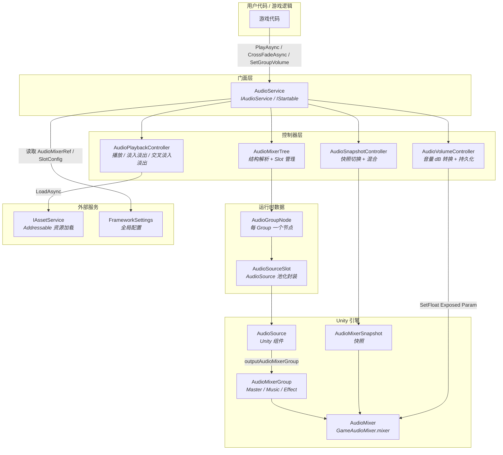
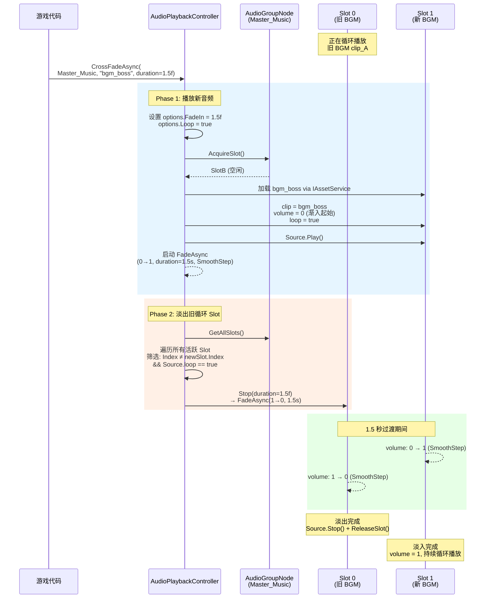

CFramework 的音频系统采用**数据驱动**架构，基于 Unity 的 `AudioMixer` 实现了完整的分组音量控制、双音轨 BGM 交叉淡入淡出、快照平滑切换和音量持久化。整个系统通过编译符号 `CFRAMEWORK_AUDIO` 进行条件编译，开发者只需在 `FrameworkSettings` 中指定 AudioMixer 引用，框架即可在运行时自动解析 Group 层级、生成 GameObject 池、挂载 AudioSource 并绑定 MixerGroup——零代码即可获得一个生产级的音频管线。

Sources: [IAudioService.cs](Runtime/Audio/IAudioService.cs#L1-L147), [AudioService.cs](Runtime/Audio/AudioService.cs#L1-L55)

## 架构总览

音频系统的核心设计遵循**单一职责 + 门面协调**模式：`AudioService` 作为门面（Facade），将职责委托给四个专职控制器，每个控制器只关心自己的领域。这种分层使得你可以独立替换或测试某一层的实现，而不会波及其他子系统。



**数据流向**：游戏代码通过 `IAudioService` 接口调用，`AudioService` 根据操作类型分发到对应的控制器。播放请求经由 `AudioPlaybackController` → `AudioMixerTree.GetNode()` 获取节点 → `AudioGroupNode.AcquireSlot()` 获取空闲槽位 → 配置 `AudioSource` → 启动播放。音量设置则经 `AudioVolumeController` 将 0~1 线性值转换为 dB 值，通过 AudioMixer 的 Exposed Parameter 直接作用于 Mixer 层面。

Sources: [AudioService.cs](Runtime/Audio/AudioService.cs#L100-L132), [FrameworkModuleInstaller.cs](Runtime/Core/DI/FrameworkModuleInstaller.cs#L16-L26)

## 核心概念

### AudioGroup 枚举与路径哈希寻址

框架使用 `AudioGroup` 枚举作为**编译期安全**的分组标识符，而非易错的字符串。每个枚举值的数值等于对应 AudioMixer Group 路径的 `Animator.StringToHash()` 结果，运行时通过哈希值实现 O(1) 查找，无需字符串比较。

| 枚举成员 | 描述路径 | 哈希值 | 用途 |
|---------|---------|--------|------|
| `Master` | `"Master"` | 715499232 | 总控分组，所有音频的父级 |
| `Master_Music` | `"Master/Music"` | 734377894 | BGM 分组，支持双音轨交叉淡入淡出 |
| `Master_Effect` | `"Master/Effect"` | 523937844 | 音效分组，支持多 Slot 并发播放 |

枚举的 `[Description]` 特性存储了对应的 AudioMixer Group 路径（如 `"Master/Music"`），但运行时寻址直接使用哈希值，路径字符串仅用于调试日志和 Editor 显示。`AudioMixerTree` 在 `Build` 阶段递归遍历 AudioMixer 层级，将每个 Group 路径的哈希值注册到内部的 `Dictionary<int, AudioGroupNode>` 中，后续所有操作——无论是播放、音量设置还是静音——都以这个哈希值为 key 进行 O(1) 定位。

Sources: [AudioGroup.cs](Runtime/Audio/AudioGroup.cs#L1-L23), [AudioMixerTree.cs](Runtime/Audio/AudioMixerTree.cs#L17-L76)

### AudioMixerTree 动态解析

`AudioMixerTree` 是整个音频系统的**基础设施层**，负责将 AudioMixer 的 Group 层级转化为可操作的运行时结构。它的 `Build` 方法执行以下步骤：

1. **创建根节点** `[Audio]`，标记 `DontDestroyOnLoad`（或挂载到指定父节点）
2. **递归遍历** AudioMixer Group 层级（从 `Master` 开始），通过 `AudioMixer.FindMatchingGroups()` 发现每个节点的直接子分组——这是必要的，因为 Unity 运行时 `AudioMixerGroup` 不暴露 `children` 属性
3. **为每个 Group 生成** `AudioGroupNode`（包含对应的 GameObject + AudioSource Slot 池）
4. **预分配 Slot**：根据 `FrameworkSettings.GroupSlotConfig` 中的配置为指定分组预创建 AudioSource

生成的运行时 GameObject 层级结构如下：

```
[Audio]                          ← DontDestroyOnLoad
  ├── [Master]                   ← Master Group Node
  │     ├── [Music]              ← Master_Music Group Node
  │     │     ├── AudioSource #0 ← Pre-allocated Slot 0
  │     │     └── AudioSource #1 ← Pre-allocated Slot 1
  │     └── [Effect]             ← Master_Effect Group Node
  │           ├── AudioSource #0 ← Pre-allocated Slot 0
  │           ├── ...            ← Dynamic expansion
  │           └── AudioSource #4 ← Pre-allocated Slot 4
```

每个 `AudioSource` 的 `outputAudioMixerGroup` 属性被设置为对应的 `AudioMixerGroup`，确保所有音频信号流经 AudioMixer 的 DSP 路径——这是实现分组音量控制和快照切换的前提。

Sources: [AudioMixerTree.cs](Runtime/Audio/AudioMixerTree.cs#L31-L133)

### AudioSourceSlot 池化机制

每个 `AudioGroupNode` 内部维护一个 `AudioSourceSlot` **对象池**。Slot 是对 `AudioSource` 组件的封装，管理着播放状态、当前 Clip Key 和淡入淡出的 `CancellationTokenSource`。

**池化策略**采用预分配 + 按需扩容 + 定时缩容的三级模式：

| 阶段 | 行为 | 触发条件 |
|------|------|---------|
| 预分配 | 根据 `GroupSlotConfig` 创建初始 Slot | `Build` 时 |
| 按需扩容 | 调用 `AcquireSlot()` 时，若空闲队列为空且未达上限，新建 Slot | 播放时无空闲 Slot |
| 定时缩容 | 每 30 秒检查一次，释放超出初始数量的空闲 Slot | `ShrinkIfNeeded()` |

`AcquireSlot()` 的分配优先级为：**复用空闲 Slot → 新建 Slot → 拒绝（达到上限）**。当 Slot 被回收时（`ReleaseSlot`），调用 `Reset()` 将 AudioSource 恢复到初始状态（停止播放、清空 clip、重置 volume/pitch/loop），然后加入空闲队列等待下次复用。每个 Slot 的淡入淡出操作通过 `GetFadeToken()` 获取独立的 `CancellationToken`，确保新的淡入操作会自动取消旧的，避免多个协程同时修改同一个 AudioSource 的 volume。

Sources: [AudioSourceSlot.cs](Runtime/Audio/AudioSourceSlot.cs#L1-L73), [AudioGroupNode.cs](Runtime/Audio/AudioGroupNode.cs#L57-L200)

## 双音轨 BGM 交叉淡入淡出

交叉淡入淡出（Crossfade）是 BGM 切换时保持听觉连贯性的核心技术——旧音乐渐出的同时新音乐渐入，避免突兀的硬切。CFramework 的实现基于**同组多 Slot 并发**的架构：`Master_Music` 分组预分配 2 个 Slot，在 Crossfade 期间新旧 BGM 同时占据各自的 Slot，淡入淡出完成后旧 Slot 被回收。



`CrossFadeAsync` 的实现逻辑清晰分为两步：首先通过 `PlayAsync` 播放新音频（自动携带 `FadeIn` 渐入），然后遍历同组内所有**正在播放且为循环模式**的其他 Slot，逐个调用 `Stop` 进行淡出。这意味着 Crossfade 只会影响循环播放的音频（即 BGM），不会干扰同组的音效。

**淡入淡出曲线**使用 SmoothStep 插值（`t * t * (3 - 2t)`）而非线性插值，产生 S 形过渡曲线，听感更加自然。每次新的淡入淡出会通过 `GetFadeToken()` 取消上一次未完成的操作，确保不会出现多个协程争夺同一个 AudioSource volume 的情况。

Sources: [AudioPlaybackController.cs](Runtime/Audio/AudioPlaybackController.cs#L168-L194), [AudioPlaybackController.cs](Runtime/Audio/AudioPlaybackController.cs#L263-L288)

## 分组音量控制

### 线性值与 dB 转换

Unity 的 `AudioMixer` 在内部以分贝（dB）为单位处理音量，但对外接口使用 0~1 的线性值更符合人类直觉。`AudioVolumeController` 负责这个双域转换：

| 操作 | 外部接口 | 内部操作 | AudioMixer 层面 |
|------|---------|---------|----------------|
| 设置音量 | `SetGroupVolume(group, 0.5f)` | `20 * log10(0.5)` ≈ -6 dB | `mixer.SetFloat("Master_Music_Volume", -6dB)` |
| 获取音量 | `GetGroupVolume(group)` | 直接返回缓存值 | 无 Mixer 交互 |
| 静音 | `MuteGroup(group, true)` | 设为 -80 dB | `mixer.SetFloat("Master_Music_Volume", -80dB)` |
| 取消静音 | `MuteGroup(group, false)` | 恢复缓存的线性值 | 重新计算 dB 并设置 |

转换公式为 `dB = 20 * log10(linear)`，当线性值低于 `0.0001` 时直接映射到 `-80 dB`（静默阈值）。静音功能的实现方式是将 dB 值设为 `-80`，同时保留原始的线性音量缓存值，取消静音时恢复该缓存值——这意味着静音/取消静音不会丢失用户之前设置的音量级别。

Sources: [AudioVolumeController.cs](Runtime/Audio/AudioVolumeController.cs#L1-L126)

### Exposed Parameters 映射

音量控制依赖 AudioMixer 的 **Exposed Parameters** 机制。每个需要独立控制音量的 Group，必须在 AudioMixer Editor 中将其 Volume 参数暴露为名为 `{枚举名}_Volume` 的参数。例如：

| AudioGroup 枚举 | Exposed Parameter 名称 | 对应 Mixer Group |
|----------------|----------------------|-----------------|
| `Master` | `Master_Volume` | Master |
| `Master_Music` | `Master_Music_Volume` | Master/Music |
| `Master_Effect` | `Master_Effect_Volume` | Master/Effect |

`ValidateExposedParameters()` 在初始化阶段自动检查每个分组的 Exposed Parameter 是否存在，缺失时输出警告日志。**如果某个 Group 的 Exposed Parameter 未在 AudioMixer 中暴露，该分组的音量控制将不生效**——这是一个常见的配置遗漏点。

**注意**：框架内置的 `GameAudioMixer.mixer` 默认未包含 Exposed Parameters（`m_ExposedParameters: []`），你需要手动在 Unity AudioMixer 窗口中右键点击 Volume 参数 → 选择 "Expose Parameter" → 将参数名重命名为上述命名格式。

Sources: [AudioVolumeController.cs](Runtime/Audio/AudioVolumeController.cs#L67-L82), [GameAudioMixer.mixer](Prefabs/GameAudioMixer.mixer#L18-L18)

### 音量持久化

音量设置通过 `PlayerPrefs` 进行持久化，键名格式为 `{VolumePrefsPrefix}{枚举名}`（默认前缀为 `"Audio_Volume_"`）。完整的持久化流程如下：

- **加载时机**：`AudioService.InitializeAsync()` 执行时，`AudioVolumeController.LoadPersistentVolumes()` 遍历所有已注册的 Group，检查 PlayerPrefs 中是否存在对应的键，存在则恢复其音量
- **保存时机**：手动调用 `SaveVolumes()` 或 `Dispose()`（框架销毁时自动触发）时，将所有 Group 的当前线性音量值写入 PlayerPrefs
- **静音状态**：静音开关**不持久化**，每次启动默认为非静音状态

Sources: [AudioVolumeController.cs](Runtime/Audio/AudioVolumeController.cs#L86-L112), [AudioService.cs](Runtime/Audio/AudioService.cs#L286-L293)

## 快照系统

快照（Snapshot）是 AudioMixer 的预设状态——可以预先配置不同场景下的音量、Effect 参数等，然后在运行时平滑切换。`AudioSnapshotController` 提供了两种切换方式：

| 方法 | 用途 | 特点 |
|------|------|------|
| `TransitionToSnapshotAsync(name, duration)` | 切换到单个快照 | 平滑过渡，返回 UniTask 等待完成 |
| `TransitionToBlended(names[], weights[], duration)` | 加权混合多个快照 | 适用于需要过渡中间态的场景 |

快照数据需要通过构造函数外部传入（`AudioMixerSnapshot[]`），因为 Unity 运行时 `AudioMixer` 不暴露 `snapshots` 属性。框架内置的 `GameAudioMixer.mixer` 包含一个默认快照 `"Snapshot"`，开发者可以在 AudioMixer Editor 中添加更多快照来定义不同的音频场景（如 "战斗"、"菜单"、"过场动画"）。

Sources: [AudioSnapshotController.cs](Runtime/Audio/AudioSnapshotController.cs#L1-L84)

## 配置指南

音频系统的所有可配置项集中在 `FrameworkSettings` 的 **Audio 区域**，通过 ScriptableObject Inspector 进行编辑：

| 配置项 | 类型 | 默认值 | 说明 |
|-------|------|-------|------|
| `AudioMixerRef` | `AudioMixer` | null | 音频混合器引用，未设置时尝试自动加载框架内置 Mixer |
| `GroupSlotConfig` | `string` | `"Master_Music:2,Master_Effect:5"` | 各分组预分配 Slot 数量，格式：`枚举名:数量`，逗号分隔 |
| `MaxSlotsPerGroup` | `int` | 20 | 每个 Group 的 Slot 上限（防止内存泄漏） |
| `VolumePrefsPrefix` | `string` | `"Audio_Volume_"` | 音量持久化的 PlayerPrefs 键前缀 |

**配置步骤**：

1. 在 Unity 菜单中 `Create > CFramework > Settings` 创建 `FrameworkSettings` 资产
2. 将其放置在 `Resources/FrameworkSettings` 路径（或通过 DI 注入）
3. 在 Inspector 的 **Audio** 区域，将 `GameAudioMixer.mixer`（位于 `Prefabs/` 目录）拖入 `AudioMixerRef` 字段
4. 在 AudioMixer Editor 中，为 Master、Music、Effect 三个 Group 的 Volume 参数分别创建 Exposed Parameter，命名为 `Master_Volume`、`Master_Music_Volume`、`Master_Effect_Volume`
5. 根据项目需求调整 `GroupSlotConfig`——BGM 分组 2 个 Slot 即可支持交叉淡入淡出，音效分组根据并发需求配置

Sources: [FrameworkSettings.cs](Runtime/Core/FrameworkSettings.cs#L24-L36)

## 编辑器调试工具

框架提供了 **Audio Debugger** 编辑器窗口（菜单路径：`Tools > CFramework > Audio Debugger`），仅在 Play Mode 下可用。该窗口实时显示所有分组的调试信息，并提供交互式调节能力：

- **分组信息**：显示每个 Group 的路径、活跃/总 Slot 数量、当前音量、静音状态
- **音量滑块**：直接拖动调节任意分组的音量（实时生效）
- **静音开关**：切换各分组的静音状态
- **快照按钮**：一键切换到任意快照（0.5 秒过渡）
- **保存按钮**：将当前音量设置持久化到 PlayerPrefs

Sources: [AudioDebuggerWindow.cs](Editor/Windows/AudioDebuggerWindow.cs#L1-L113)

## API 速览

### 播放控制

```csharp
// 播放 BGM（循环 + 1 秒渐入）
await audioService.PlayAsync(AudioGroup.Master_Music, "bgm_title",
    AudioPlayOptions.LoopFadeIn(1f));

// 播放音效（一次性）
audioService.PlayAsync(AudioGroup.Master_Effect, "sfx_click",
    AudioPlayOptions.OneShot, ct: cancellationToken);

// 交叉淡入淡出切换 BGM（1.5 秒过渡）
await audioService.CrossFadeAsync(AudioGroup.Master_Music, "bgm_battle",
    duration: 1.5f);

// 停止最后一个活跃 Slot（带 2 秒淡出）
audioService.Stop(AudioGroup.Master_Music, slotIndex: -1, fadeOut: 2f);

// 停止分组内所有播放
audioService.StopAll(AudioGroup.Master_Effect, fadeOut: 0.5f);
```

### 音量控制

```csharp
// 设置 BGM 音量为 50%
audioService.SetGroupVolume(AudioGroup.Master_Music, 0.5f);

// 获取当前音效音量
float sfxVol = audioService.GetGroupVolume(AudioGroup.Master_Effect);

// 静音 BGM
audioService.MuteGroup(AudioGroup.Master_Music, true);

// 持久化当前音量设置
audioService.SaveVolumes();
```

### 快照切换

```csharp
// 切换到 "Combat" 快照（2 秒过渡）
await audioService.TransitionToSnapshotAsync("Combat", 2f);

// 查看当前快照
string current = audioService.CurrentSnapshot;
```

### 暂停与恢复

```csharp
// 全局暂停（记录所有活跃 Slot）
audioService.PauseAll();

// 恢复（只恢复之前暂停的 Slot）
audioService.ResumeAll();
```

### AudioPlayOptions 预设

| 预设工厂方法 | 用途 | 特性 |
|-------------|------|------|
| `AudioPlayOptions.Default` | 通用默认 | volume=1, pitch=1, 不循环, 无渐入 |
| `AudioPlayOptions.LoopFadeIn(float)` | BGM 播放 | 循环 + 指定时长的渐入 |
| `AudioPlayOptions.OneShot` | 一次性音效 | PlayOneShot 模式，播放完自动回收 Slot |
| `AudioPlayOptions.Spatial3D(Vector3)` | 3D 空间音效 | spatialBlend=1，需指定世界坐标 |

Sources: [AudioPlayOptions.cs](Runtime/Audio/AudioPlayOptions.cs#L1-L84), [IAudioService.cs](Runtime/Audio/IAudioService.cs#L72-L100)

## 设计决策与扩展要点

**为什么用路径哈希而非字符串？** 枚举值 = `Animator.StringToHash(path)` 使得所有 Group 寻址都是 `Dictionary<int, T>` 的 O(1) 操作，避免运行时字符串比较。同时，枚举提供了编译期类型安全——拼错分组名会直接编译报错，而非运行时静默失败。

**为什么 Slot 池而非动态创建？** 频繁的 `AddComponent<AudioSource>` / `Destroy` 会触发 GC 和 Unity 内部重组。池化策略将 AudioSource 的生命周期与分组绑定，预分配避免首次播放时的延迟，按需扩容 + 定时缩容平衡了内存占用与响应速度。

**如何自定义分组？** 由于 `AudioGroup` 枚举是框架预定义的，扩展分组需要：1) 在 AudioMixer 中添加新的子 Group，2) 在 `AudioGroup` 枚举中添加对应条目（哈希值通过 `Animator.StringToHash("Master/NewGroup")` 计算），3) 在 `GroupSlotConfig` 中配置预分配数量。对于需要高度灵活的项目，可以考虑将 `AudioGroup` 改为 `int` 别名或使用自定义代码生成器自动同步。

Sources: [AudioGroup.cs](Runtime/Audio/AudioGroup.cs#L8-L10), [AudioMixerTree.cs](Runtime/Audio/AudioMixerTree.cs#L136-L139)

---

**下一步阅读**：了解场景加载时的音频生命周期管理，参见 [场景管理服务：场景加载、叠加场景与过渡动画](15-chang-jing-guan-li-fu-wu-chang-jing-jia-zai-die-jia-chang-jing-yu-guo-du-dong-hua)；了解音频资源的加载机制，参见 [资源管理服务：Addressables 封装、引用计数与生命周期绑定](10-zi-yuan-guan-li-fu-wu-addressables-feng-zhuang-yin-yong-ji-shu-yu-sheng-ming-zhou-qi-bang-ding)；如需自定义调试窗口或扩展编辑器工具，参见 [编辑器窗口一览：配置创建器、异常查看器与调试工具](19-bian-ji-qi-chuang-kou-lan-pei-zhi-chuang-jian-qi-yi-chang-cha-kan-qi-yu-diao-shi-gong-ju)。