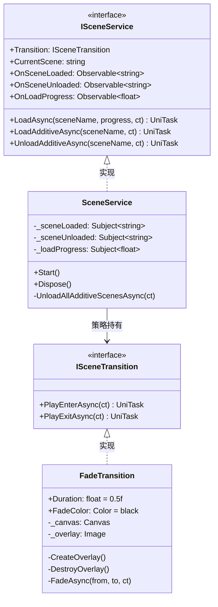
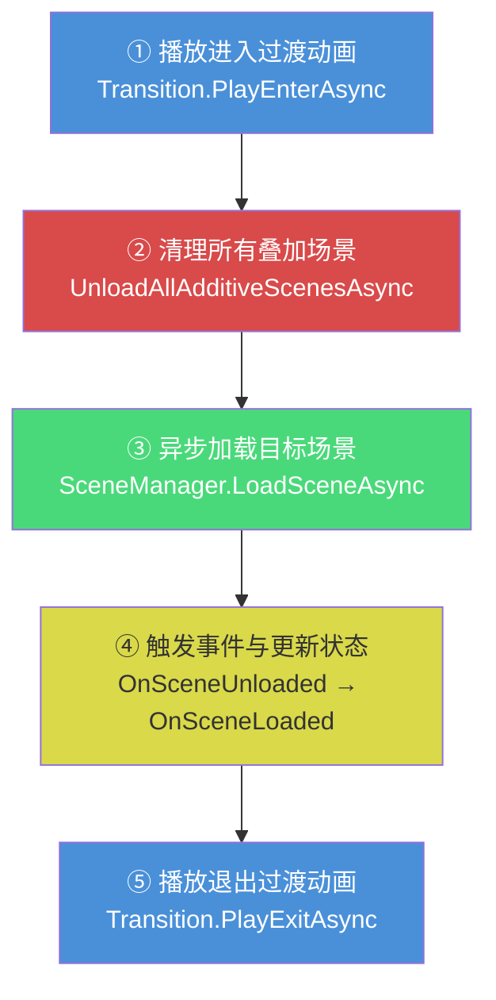

CFramework 的场景管理服务将 Unity 原生 `SceneManager` 封装为一套 **策略驱动的异步场景切换管线**——通过 `ISceneService` 接口暴露统一的加载、叠加与卸载操作，通过 `ISceneTransition` 策略接口将过渡动画从场景逻辑中完全解耦。这种设计使得开发者可以在不修改任何业务代码的前提下，替换淡入淡出为划屏、圆形遮罩甚至自定义 Shader 过渡。本文将从接口契约出发，逐层深入实现细节、过渡动画机制、事件响应模型，以及在实际项目中的典型使用模式。

Sources: [ISceneService.cs](Runtime/Scene/ISceneService.cs#L1-L53), [SceneService.cs](Runtime/Scene/SceneService.cs#L1-L113), [ISceneTransition.cs](Runtime/Scene/ISceneTransition.cs#L1-L21), [FadeTransition.cs](Runtime/Scene/FadeTransition.cs#L1-L74)

## 架构总览

场景管理服务由四个核心类型组成，各司其职、边界清晰。下图展示了它们之间的关系与数据流向：



| 类型 | 职责 | 注册方式 |
|------|------|----------|
| `ISceneService` | 场景加载/卸载的公共契约 | 由 `FrameworkModuleInstaller` 注册为单例入口点 |
| `SceneService` | 核心实现，管理完整加载生命周期 | 通过 `InstallModule<ISceneService, SceneService>()` 注册 |
| `ISceneTransition` | 过渡动画的策略抽象 | 属性注入，默认值为 `FadeTransition` |
| `FadeTransition` | 淡入淡出过渡的内置实现 | 由 `SceneService` 默认实例化，可替换 |

`SceneService` 同时实现了 VContainer 的 `IStartable` 和 `IDisposable` 接口——`Start()` 在容器初始化完成后自动捕获当前活动场景名称，`Dispose()` 在容器销毁时释放所有 R3 Subject 资源，确保无内存泄漏。

Sources: [SceneService.cs](Runtime/Scene/SceneService.cs#L13-L28), [FrameworkModuleInstaller.cs](Runtime/Core/DI/FrameworkModuleInstaller.cs#L16-L27), [InstallerExtensions.cs](Runtime/Core/DI/InstallerExtensions.cs#L30-L37)

## 场景加载全流程：LoadAsync 深度解析

`LoadAsync` 是场景服务的核心方法，它不仅仅是一个简单的 `SceneManager.LoadSceneAsync` 包装——它编排了一个完整的五阶段管线。理解这个管线的执行顺序，是正确使用场景服务的前提。



**阶段① — 进入过渡动画**：如果 `Transition` 不为 `null`，首先调用 `PlayEnterAsync`。对于默认的 `FadeTransition`，这意味着屏幕将从透明渐变为纯色遮罩，将当前画面完全覆盖。这一步的设计意图是在场景切换之前，先向玩家提供一个视觉上的"帷幕"。

**阶段② — 清理叠加场景**：在加载新主场景之前，`UnloadAllAdditiveScenesAsync` 会遍历当前所有已加载场景（从后向前），将非当前主场景的全部卸载。这一步确保新场景加载时处于一个干净的初始状态。方法内部使用 `CurrentScene ?? SceneManager.GetActiveScene().name` 做了防御性检查，避免在 `Start()` 尚未执行时误删所有场景。

**阶段③ — 异步加载**：调用 `SceneManager.LoadSceneAsync(sceneName)` 以 Unity 原生的 Single 模式加载目标场景。在加载过程中，通过 `while (!op.isDone)` 循环逐帧轮询进度，每帧将 `op.progress` 同时报告给调用方传入的 `IProgress<float>` 和内部 `_loadProgress` Subject。

**阶段④ — 状态更新与事件触发**：加载完成后，方法先更新 `CurrentScene` 属性，然后按顺序触发 `_sceneUnloaded.OnNext(oldScene)` 和 `_sceneLoaded.OnNext(sceneName)`。注意卸载事件携带的是旧场景名，加载事件携带的是新场景名——这一设计让订阅者能够精确区分"从哪来"和"到哪去"。

**阶段⑤ — 退出过渡动画**：最后调用 `PlayExitAsync`，对 `FadeTransition` 而言是遮罩从纯色渐变为透明，露出新场景画面，然后销毁遮罩 GameObject。

Sources: [SceneService.cs](Runtime/Scene/SceneService.cs#L34-L68), [SceneService.cs](Runtime/Scene/SceneService.cs#L101-L111)

## 叠加场景：Additive 模式

与 `LoadAsync` 的"全切换"模式不同，`LoadAdditiveAsync` 和 `UnloadAdditiveAsync` 提供了一种**增量式的场景叠加机制**——在保留当前主场景不变的前提下，动态加载或卸载额外的场景。这一模式没有过渡动画，是一个纯粹的异步操作。

叠加场景的典型用途包括：UI 覆盖层、弹窗系统、小地图、调试面板等需要"漂浮"在主场景之上的内容。由于 `LoadAdditiveAsync` 使用 `LoadSceneMode.Additive` 参数，Unity 会将新场景的内容合并到当前场景层级中，而不是替换它。

```csharp
// 加载一个叠加场景（例如：战斗 HUD）
await sceneService.LoadAdditiveAsync("BattleHUD", ct);

// 稍后卸载它
await sceneService.UnloadAdditiveAsync("BattleHUD", ct);
```

值得注意的一个安全细节是：当 `LoadAsync` 执行主场景切换时，它会自动调用 `UnloadAllAdditiveScenesAsync` 清理所有叠加场景。这意味着你无需手动追踪和管理叠加场景的生命周期——主场景切换就是一次全局重置。

Sources: [SceneService.cs](Runtime/Scene/SceneService.cs#L70-L94), [SceneService.cs](Runtime/Scene/SceneService.cs#L101-L111)

## 过渡动画：策略模式与 FadeTransition

### ISceneTransition 策略接口

过渡动画通过 `ISceneTransition` 接口实现了经典的策略模式。接口仅定义两个方法，语义极为精确：

| 方法 | 调用时机 | 语义 |
|------|----------|------|
| `PlayEnterAsync` | 场景加载**之前** | "遮住旧画面"——进入过渡，通常是将遮罩从透明变为不透明 |
| `PlayExitAsync` | 场景加载**之后** | "揭开新画面"——退出过渡，通常是将遮罩从不透明变为透明 |

这两个方法的命名采用"进入/退出过渡"而非"淡入/淡出"，因为具体的视觉效果完全由实现类决定——可能是淡入淡出，也可能是圆形缩放、水平滑动或任何自定义效果。

Sources: [ISceneTransition.cs](Runtime/Scene/ISceneTransition.cs#L1-L21)

### FadeTransition 内置实现

`FadeTransition` 是框架提供的默认过渡实现，采用 Canvas + Image 方案创建全屏遮罩。其核心机制如下：

**遮罩创建（`CreateOverlay`）**：动态创建一个名为 `[FadeTransition]` 的 GameObject，挂载 Canvas（`RenderMode.ScreenSpaceOverlay`，`sortingOrder = 9999`）和 Image 组件。通过 `DontDestroyOnLoad` 确保遮罩在场景切换过程中不会被销毁。该方法有幂等保护——如果 `_canvas` 已存在则直接返回。

**遮罩销毁（`DestroyOverlay`）**：仅在 `PlayExitAsync` 完成后调用，销毁整个 Canvas GameObject 并将引用置空。这意味着遮罩在两次场景切换之间不会残留于场景中。

**渐变动画（`FadeAsync`）**：核心渐变逻辑，接收 `from` 和 `to` 两个 alpha 值，在 `Duration` 时间内通过 `Mathf.Lerp` 线性插值。默认 `Duration = 0.5f`，`FadeColor = Color.black`——即黑色 0.5 秒淡入淡出。

```csharp
// 默认配置（构造时自动应用）
var transition = new FadeTransition();  // 黑色 0.5s

// 自定义配置
var transition = new FadeTransition
{
    Duration = 1.0f,
    FadeColor = Color.white  // 白色 1s 淡入淡出
};
```

| 配置属性 | 类型 | 默认值 | 说明 |
|----------|------|--------|------|
| `Duration` | `float` | `0.5f` | 单次渐变（进入或退出）的持续时间（秒） |
| `FadeColor` | `Color` | `Color.black` | 遮罩颜色（alpha 由动画控制，设置时忽略 alpha 通道） |

Sources: [FadeTransition.cs](Runtime/Scene/FadeTransition.cs#L12-L73)

### 替换过渡动画

`ISceneService.Transition` 属性是可读写的，这意味着你可以在运行时随时替换过渡策略。最常见的做法是在游戏初始化阶段通过依赖注入替换默认实现：

```csharp
// 方式一：通过 GameScope 获取服务后替换
var sceneService = GameScope.Instance.SceneService;
sceneService.Transition = new MyCustomTransition();

// 方式二：在 IInstaller 中通过构造函数注入
public void Install(IContainerBuilder builder)
{
    builder.Register<ISceneTransition, CircleWipeTransition>(Lifetime.Singleton);
}
```

如果你希望完全禁用过渡动画，只需将 `Transition` 设为 `null`——`LoadAsync` 内部对所有 `Transition` 的调用都做了空值检查。

关于如何实现自定义 `ISceneTransition` 的完整指南，请参阅 [框架扩展指南：自定义 IInstaller、IAssetProvider 与 ISceneTransition](23-kuang-jia-kuo-zhan-zhi-nan-zi-ding-yi-iinstaller-iassetprovider-yu-iscenetransition)。

Sources: [SceneService.cs](Runtime/Scene/SceneService.cs#L28), [SceneService.cs](Runtime/Scene/SceneService.cs#L38), [SceneService.cs](Runtime/Scene/SceneService.cs#L67)

## 事件系统：R3 响应式观察

场景服务通过三个 R3 `Observable` 暴露运行时事件，订阅者可以基于这些事件触发副作用逻辑（如播放音效、更新 UI 状态、记录分析数据等）。

| 事件 | 类型 | 触发时机 | 携带数据 |
|------|------|----------|----------|
| `OnSceneLoaded` | `Observable<string>` | 场景加载完成 | 新场景名称 |
| `OnSceneUnloaded` | `Observable<string>` | 场景卸载完成 | 被卸载的场景名称 |
| `OnLoadProgress` | `Observable<float>` | 每帧加载进度更新 | 0.0 ~ 1.0 的进度值 |

这三个事件在内部均由 R3 `Subject<T>` 驱动——这意味着它们既是 Observer 也是 Observable，支持多播。`SceneService` 在 `Dispose` 时会释放所有 Subject，防止容器销毁后仍有订阅者持有已释放的 Subject 引用。

```csharp
// 订阅场景加载事件
sceneService.OnSceneLoaded
    .Subscribe(sceneName =>
    {
        Debug.Log($"场景已加载: {sceneName}");
    })
    .AddTo(gameObject);  // 绑定 GameObject 生命周期

// 监听加载进度（仅 LoadAsync 触发）
sceneService.OnLoadProgress
    .Subscribe(p =>
    {
        loadingBar.value = p;
    })
    .AddTo(gameObject);
```

**重要行为说明**：`OnLoadProgress` 仅在 `LoadAsync` 中触发——`LoadAdditiveAsync` 和 `UnloadAdditiveAsync` 不报告进度。`OnSceneLoaded` 和 `OnSceneUnloaded` 则在三种操作中都会触发。

Sources: [SceneService.cs](Runtime/Scene/SceneService.cs#L15-L17), [SceneService.cs](Runtime/Scene/SceneService.cs#L30-L32), [SceneService.cs](Runtime/Scene/SceneService.cs#L19-L24)

## 取消与异常安全

所有异步方法均接受 `CancellationToken` 参数，这不仅是良好的异步实践，更是框架级别的安全保证。在 `LoadAsync` 的加载轮询循环中，每帧都会调用 `ct.ThrowIfCancellationRequested()`——如果调用方取消了操作，UniTask 会抛出 `OperationCanceledException` 而非让加载无限悬挂。

```csharp
// 带超时的场景加载
var cts = new CancellationTokenSource(TimeSpan.FromSeconds(10));
try
{
    await sceneService.LoadAsync("HeavyScene", ct: cts.Token);
}
catch (OperationCanceledException)
{
    Debug.LogWarning("场景加载超时或被取消");
}
finally
{
    cts.Dispose();
}
```

叠加场景的 `LoadAdditiveAsync` 和 `UnloadAdditiveAsync` 同样每帧检查取消令牌，确保在长时间加载的场景中也能及时响应取消请求。

Sources: [SceneService.cs](Runtime/Scene/SceneService.cs#L46-L48), [SceneService.cs](Runtime/Scene/SceneService.cs#L74-L78), [SceneService.cs](Runtime/Scene/SceneService.cs#L86-L90)

## DI 注册与生命周期

`SceneService` 在 `FrameworkModuleInstaller` 中通过 `InstallModule<ISceneService, SceneService>()` 注册。这个扩展方法内部调用 `RegisterEntryPoint<TImplementation>(lifetime).As<TInterface>()`，将 `SceneService` 同时注册为 VContainer 入口点和 `ISceneService` 接口实现。

入口点注册意味着 VContainer 会在容器构建完成后自动调用 `Start()` 方法——此时 `CurrentScene` 被初始化为当前活动场景的名称。作为 `IDisposable`，`SceneService` 的 `Dispose()` 方法会在容器销毁时自动调用，释放所有 R3 Subject 资源。

在 `GameScope` 中，`SceneService` 通过 `ResolveFrameworkServices()` 被解析为公共属性，可通过 `GameScope.Instance.SceneService` 直接访问：

```csharp
// 在任何地方获取场景服务
var sceneService = GameScope.Instance.SceneService;
await sceneService.LoadAsync("MainMenu");
```

Sources: [FrameworkModuleInstaller.cs](Runtime/Core/DI/FrameworkModuleInstaller.cs#L23), [GameScope.cs](Runtime/Core/DI/GameScope.cs#L109), [GameScope.cs](Runtime/Core/DI/GameScope.cs#L138), [InstallerExtensions.cs](Runtime/Core/DI/InstallerExtensions.cs#L30-L37)

## 实战示例：完整的场景切换流程

以下代码展示了一个典型的游戏场景管理场景——从主菜单进入游戏关卡，加载战斗 HUD 叠加场景，并在退出时返回主菜单：

```csharp
public class GameController : MonoBehaviour
{
    private ISceneService _sceneService;

    private void Start()
    {
        _sceneService = GameScope.Instance.SceneService;

        // 监听场景变化
        _sceneService.OnSceneLoaded
            .Subscribe(OnSceneChanged)
            .AddTo(gameObject);
    }

    /// <summary>
    ///     进入游戏关卡
    /// </summary>
    public async UniTask EnterLevelAsync(string levelName)
    {
        // LoadAsync 会自动：播放进入动画 → 清理叠加场景 → 加载关卡 → 播放退出动画
        var progress = Progress.Create<float>(p => Debug.Log($"加载进度: {p:P0}"));
        await _sceneService.LoadAsync(levelName, progress);

        // 关卡加载完成后，叠加战斗 HUD
        await _sceneService.LoadAdditiveAsync("BattleHUD");
    }

    /// <summary>
    ///     返回主菜单
    /// </summary>
    public async UniTask ReturnToMainMenuAsync()
    {
        // LoadAsync 会自动卸载 BattleHUD 叠加场景
        await _sceneService.LoadAsync("MainMenu");
    }

    private void OnSceneChanged(string sceneName)
    {
        Debug.Log($"当前场景: {sceneName}");
    }
}
```

Sources: [ISceneService.cs](Runtime/Scene/ISceneService.cs#L1-L53), [SceneService.cs](Runtime/Scene/SceneService.cs#L34-L68)

## 测试策略

场景服务的测试文件位于 `Tests/Runtime/Scene/SceneServiceTests.cs`，包含七个测试用例覆盖核心场景。其中 `FadeTransition` 的属性验证（`S004`）和动画完整性测试（`S005`）可以在编辑器环境下独立运行，而涉及实际场景加载的测试（`S001`-`S003`、`S006`-`S007`）则需要预先创建对应的测试场景资产。

`S005` 测试使用 `UnityTest` + 协程模式配合 UniTask 的 `ToCoroutine` 桥接，并设置了 5 秒超时保护与 `CancellationTokenSource` 双重保险——这是测试异步过渡动画的标准模式：

```csharp
[UnityTest]
[Timeout(5000)]
public IEnumerator S005_Transition_FadeTransition_Animation_Success()
{
    var transition = new FadeTransition { Duration = 0.1f, FadeColor = Color.black };
    var cts = new CancellationTokenSource();
    cts.CancelAfter(TimeSpan.FromSeconds(3));
    try
    {
        yield return UniTask.ToCoroutine(async () =>
        {
            await transition.PlayEnterAsync(cts.Token);
            await transition.PlayExitAsync(cts.Token);
        });
        Assert.Pass("过渡动画测试通过");
    }
    finally { cts?.Dispose(); }
}
```

关于测试覆盖策略的更深入讨论，请参阅 [单元测试指南：测试覆盖策略与 Mock 替换模式](22-dan-yuan-ce-shi-zhi-nan-ce-shi-fu-gai-ce-lue-yu-mock-ti-huan-mo-shi)。

Sources: [SceneServiceTests.cs](Tests/Runtime/Scene/SceneServiceTests.cs#L1-L117)

## 设计总结与下一步

CFramework 的场景管理服务遵循**单一职责 + 策略可替换**的设计哲学：`SceneService` 专注于编排加载管线，过渡视觉效果完全委托给 `ISceneTransition` 实现。叠加场景的自动清理机制消除了手动管理的认知负担，R3 响应式事件则为跨系统联动提供了松耦合的通知通道。

当你准备好实现自己的过渡效果或需要更深入的定制时，建议继续阅读：

- **[框架扩展指南：自定义 IInstaller、IAssetProvider 与 ISceneTransition](23-kuang-jia-kuo-zhan-zhi-nan-zi-ding-yi-iinstaller-iassetprovider-yu-iscenetransition)** — 学习如何创建自定义过渡动画
- **[依赖注入体系：GameScope、SceneScope 与动态安装器机制](5-yi-lai-zhu-ru-ti-xi-gamescope-scenescope-yu-dong-tai-an-zhuang-qi-ji-zhi)** — 深入理解 SceneService 的 DI 注册与生命周期管理
- **[事件总线：同步/异步发布订阅与 R3 响应式集成](6-shi-jian-zong-xian-tong-bu-yi-bu-fa-bu-ding-yue-yu-r3-xiang-ying-shi-ji-cheng)** — 掌握 R3 Observable 的更多高级用法