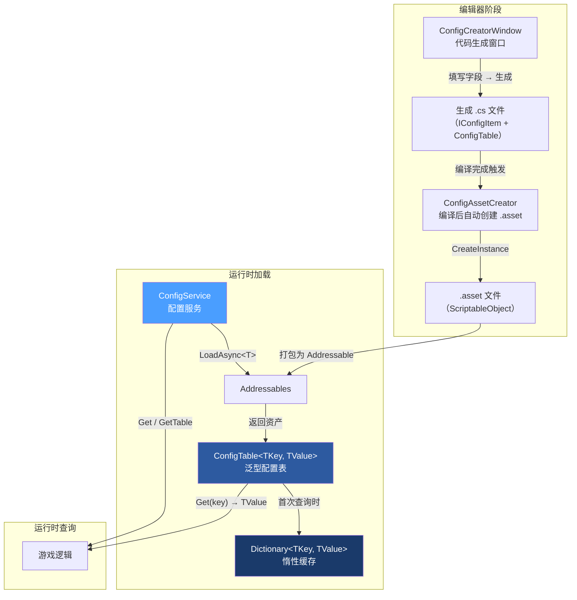
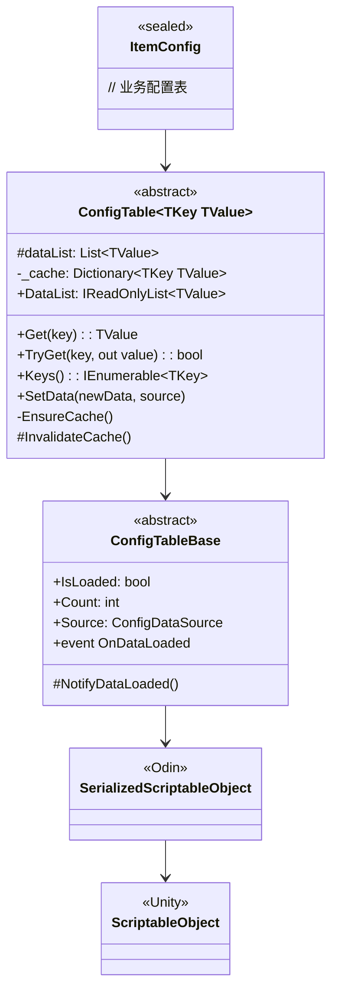
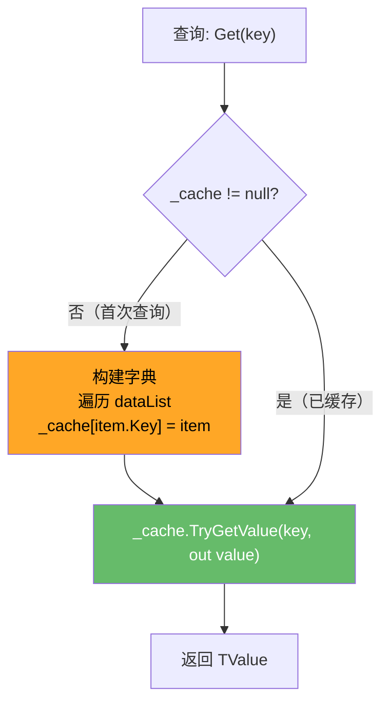
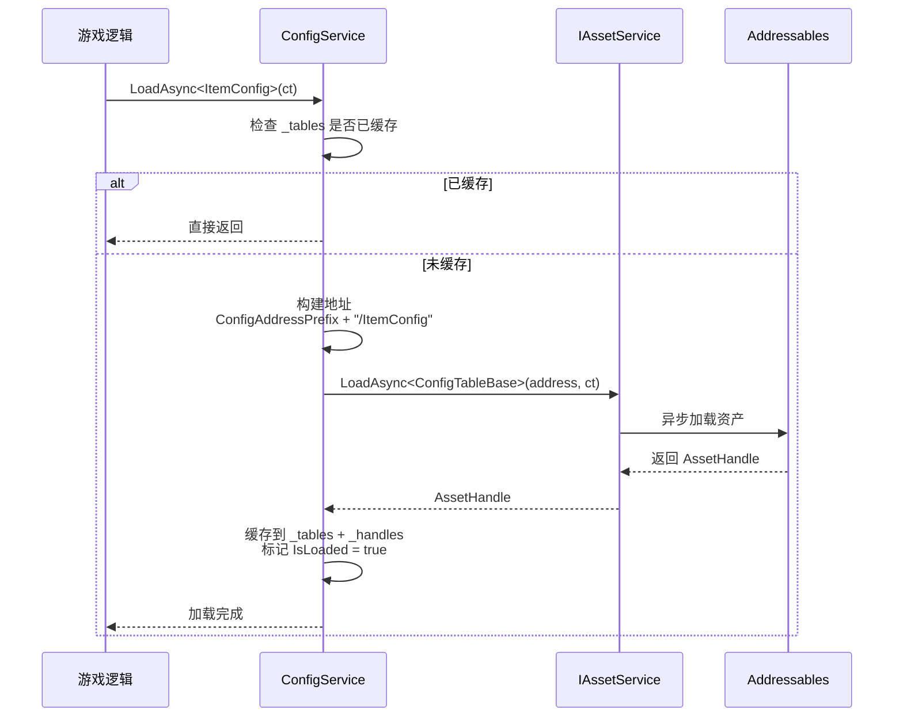
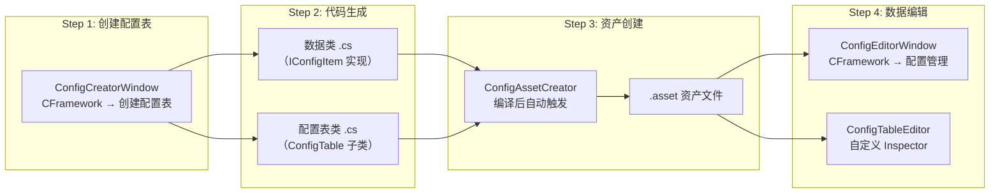

配置表系统是 CFramework 中管理游戏静态数据的核心基础设施——从道具属性到关卡参数，所有策划可配数据都经由这一管道统一加载、缓存与查询。系统采用 **泛型键值对 + ScriptableObject 数据源 + Addressables 远端加载** 三层架构：底层通过 `IConfigItem<TKey>` 定义数据契约，中层由 `ConfigTable<TKey, TValue>` 提供类型安全的 O(1) 查询与惰性字典缓存，顶层 `ConfigService` 基于 Addressables 实现异步加载与热重载。编辑器侧则提供了完整的代码生成工具链——从配置表创建窗口到自动资产生成——将"定义数据结构 → 生成代码 → 填入数据"的流程压缩到几次点击之内。

Sources: [IConfigItem.cs](Runtime/Config/IConfigItem.cs#L1-L15), [ConfigTableBase.cs](Runtime/Config/ConfigTableBase.cs#L1-L25), [ConfigService.cs](Runtime/Config/ConfigService.cs#L1-L30)

---

## 系统架构总览

在深入每个组件之前，先建立对整体数据流的认知。下图展示了从数据定义到运行时查询的完整链路：



整个系统围绕三个核心抽象构建：

| 层次 | 核心类型 | 职责 |
|------|----------|------|
| **数据契约** | `IConfigItem<TKey>` | 定义配置行的主键接口 |
| **配置容器** | `ConfigTable<TKey, TValue>` | 存储数据列表、提供 O(1) 查询、支持外部注入 |
| **服务协调** | `ConfigService` | Addressables 异步加载、资源句柄管理、热重载 |
| **数据源标记** | `ConfigDataSource` | 枚举标识数据来源（ScriptableObject / Binary / Json / Network / External） |

Sources: [ConfigDataSource.cs](Runtime/Config/ConfigDataSource.cs#L1-L14), [ConfigTable.cs](Runtime/Config/ConfigTable.cs#L1-L101), [ConfigService.cs](Runtime/Config/ConfigService.cs#L1-L138)

---

## 数据契约层：IConfigItem\<TKey\>

一切配置数据的起点是 `IConfigItem<TKey>` 接口。它只要求实现一个 `Key` 属性——这是配置表中每一行数据的唯一标识。设计上刻意保持极简：框架不关心你的数据有哪些字段，只关心"用什么字段来定位它"。

```csharp
public interface IConfigItem<TKey>
{
    TKey Key { get; }
}
```

实际项目中，你需要为每种配置表定义对应的数据类。例如一个道具配置的数据类：

```csharp
[Serializable]
public class ItemData : IConfigItem<int>
{
    public int id;
    public string name = "";
    public int maxStack;
    public float weight;

    public int Key => id;  // 将 id 字段暴露为主键
}
```

**设计要点**：`TKey` 可以是任意类型——`int`、`string`、`long` 均可。这意味着你可以根据业务需求选择最合适的主键策略：整型自增、字符串枚举、甚至是复合键（需自行实现 `GetHashCode` / `Equals`）。

Sources: [IConfigItem.cs](Runtime/Config/IConfigItem.cs#L1-L15)

---

## 配置容器层：ConfigTable 泛型体系

### 继承结构

配置表的类层次设计为两层继承，将"通用配置行为"与"具体业务类型参数"分离：



`ConfigTableBase` 继承自 Odin 的 `SerializedScriptableObject`（无 Odin 时回退为 Unity 原生 `ScriptableObject`），提供了所有配置表共享的基础状态：加载标记 `IsLoaded`、记录数量 `Count`、数据来源 `Source`，以及数据加载完成通知事件 `OnDataLoaded`。

Sources: [ConfigTableBase.cs](Runtime/Config/ConfigTableBase.cs#L1-L25), [OdinStubs.cs](Runtime/OdinStubs/OdinStubs.cs#L1-L16)

### 泛型 ConfigTable\<TKey, TValue\> 的核心机制

`ConfigTable<TKey, TValue>` 是整个系统的"发动机"。它同时承担两项职责：**序列化容器**（存储数据列表）和**查询引擎**（提供快速查找）。

**序列化层面**，配置数据存储在 `dataList` 字段中，通过条件编译适配 Odin Inspector 与 Unity 原生序列化：

```csharp
#if ODIN_INSPECTOR
    [OdinSerialize]
#else
    [SerializeField]
#endif
    [TableList] [ShowInInspector] [Searchable]
    protected List<TValue> dataList = new();
```

Odin 环境下启用 `[OdinSerialize]` 以支持更丰富的类型序列化；无 Odin 时回退到 `[SerializeField]`。`[TableList]` 和 `[Searchable]` 特性确保 Inspector 中以可搜索的表格形式展示数据，极大提升策划编辑体验。

Sources: [ConfigTable.cs](Runtime/Config/ConfigTable.cs#L17-L26)

**查询层面**，`ConfigTable` 实现了经典的**惰性缓存**模式：



这个设计的关键在于 `_cache` 是 `[NonSerialized]` 的——它不参与序列化，只在运行时首次查询时由 `EnsureCache()` 按需构建。这意味着反序列化成本仅与 `List` 本身相关，而字典的构建开销被延迟到真正需要查询的时刻。对于包含数千条记录的配置表，这种惰性初始化策略可以有效避免启动时的大量字典构建开销集中爆发。

Sources: [ConfigTable.cs](Runtime/Config/ConfigTable.cs#L31-L99)

### 查询 API 一览

| 方法 | 返回值 | 行为 |
|------|--------|------|
| `Get(TKey key)` | `TValue` | 获取配置项；不存在时返回 `null` |
| `TryGet(TKey key, out TValue)` | `bool` | 安全获取，通过返回值判断是否存在 |
| `Keys()` | `IEnumerable<TKey>` | 返回所有主键集合 |
| `DataList` | `IReadOnlyList<TValue>` | 暴露只读列表，支持遍历全部数据 |

### 外部数据注入

`SetData` 方法是配置表对外的**扩展接入点**，允许从任意数据源注入数据：

```csharp
public void SetData(List<TValue> newData, ConfigDataSource source = ConfigDataSource.External)
{
    dataList = newData ?? throw new ArgumentNullException(nameof(newData));
    _cache = null; // 清除缓存，下次访问时重建
    Source = source;
    IsLoaded = true;
    NotifyDataLoaded();
}
```

调用 `SetData` 后会立即清除 `_cache` 字典缓存，确保后续查询基于新数据重建索引。同时触发 `OnDataLoaded` 事件通知订阅者数据已就绪。`ConfigDataSource` 枚举支持以下来源标记：

| 来源 | 说明 |
|------|------|
| `ScriptableObject` | 默认来源，Inspector 直接编辑 |
| `Binary` | 二进制格式（如 Protocol Buffers） |
| `Json` | JSON 文本格式 |
| `Network` | 网络接口下发 |
| `External` | 外部注入（`SetData` 的默认标记） |

Sources: [ConfigTable.cs](Runtime/Config/ConfigTable.cs#L69-L78), [ConfigDataSource.cs](Runtime/Config/ConfigDataSource.cs#L1-L14)

---

## 服务层：ConfigService 异步加载与热重载

### 服务接口设计

`IConfigService` 定义了配置服务的公共契约，涵盖加载、查询与热重载三类操作：

```csharp
public interface IConfigService
{
    UniTask LoadAsync<TKey>(CancellationToken ct = default);
    UniTask LoadAllAsync(CancellationToken ct = default);
    T GetTable<T>() where T : ConfigTableBase;
    bool TryGetTable<T>(out T table) where T : ConfigTableBase;
    TValue Get<TKey, TValue>(TKey key);
    UniTask ReloadAsync<TKey>(CancellationToken ct = default);
}
```

值得注意的是 `LoadAsync<TKey>` 的泛型参数 `TKey` 并非指配置表的主键类型——它指的是**配置表类型本身**。这是因为框架采用了一种精巧的寻址策略：用配置表的类名（如 `ItemConfig`）作为 Addressable 的加载地址。这种约定优于配置的方式让开发者只需 `LoadAsync<ItemConfig>()` 即可完成加载，无需手动维护地址映射表。

Sources: [IConfigService.cs](Runtime/Config/IConfigService.cs#L1-L20)

### 加载流程详解

`ConfigService` 的核心加载流程如下：



地址构建规则由 `FrameworkSettings.ConfigAddressPrefix` 控制。默认值为 `"Config"`，因此 `LoadAsync<ItemConfig>()` 会从 `"Config/ItemConfig"` 地址加载。如果你的项目将配置资产放在 `"Assets/Addressables/Config"` 目录下，Addressable 的分组地址设置为 `"Config"` 即可自动匹配。

Sources: [ConfigService.cs](Runtime/Config/ConfigService.cs#L32-L68), [FrameworkSettings.cs](Runtime/Core/FrameworkSettings.cs#L45-L46)

### 资源句柄管理

`ConfigService` 同时维护两张内部字典：`_tables`（Type → ConfigTableBase）用于查询，`_handles`（Type → AssetHandle）用于生命周期管理。`AssetHandle` 来自 [资源管理服务](10-zi-yuan-guan-li-fu-wu-addressables-feng-zhuang-yin-yong-ji-shu-yu-sheng-ming-zhou-qi-bang-ding) 系统，内部持有引用计数。当 `ConfigService.Dispose()` 被调用时，所有句柄会被批量释放，确保 Addressables 层面的资源正确卸载。

### 反射缓存优化

`Get<TKey, TValue>(TKey key)` 方法提供了一种无需先获取配置表实例的直接查询方式。由于运行时需要通过 `MakeGenericType` 构造 `ConfigTable<TKey, TValue>` 的封闭类型并反射调用其 `Get` 方法，框架使用 `ConcurrentDictionary<Type, Func<ConfigTableBase, object, object>>` 缓存反射委托，避免每次查询都走完整反射链路。

```csharp
var del = _getDelegates.GetOrAdd(tableType, t =>
{
    var getMethod = t.GetMethod("Get");
    return (tbl, k) => getMethod.Invoke(tbl, new[] { k });
});
return (TValue)del(table, key);
```

这一优化在高频查询场景下可将反射开销从 O(n) 降至 O(1)（n 为查询次数），首次调用后委托被缓存，后续调用直接执行编译后的委托。

Sources: [ConfigService.cs](Runtime/Config/ConfigService.cs#L94-L109), [ConfigService.cs](Runtime/Config/ConfigService.cs#L20-L24)

### 热重载机制

`ReloadAsync<TKey>` 实现了运行时配置热更新，流程简洁而完整：

1. **移除缓存**：从 `_tables` 字典中移除目标配置表
2. **释放句柄**：调用 `handle.Dispose()` 释放旧资源的 Addressables 引用
3. **重新加载**：调用 `LoadAsync<TKey>` 从 Addressables 获取最新数据

```csharp
public async UniTask ReloadAsync<TKey>(CancellationToken ct = default)
{
    var type = typeof(TKey);
    if (_tables.ContainsKey(type)) _tables.Remove(type);
    if (_handles.TryGetValue(type, out var handle))
    {
        handle.Dispose();
        _handles.Remove(type);
    }
    await LoadAsync<TKey>(ct);
}
```

**典型应用场景**：游戏运行时收到服务器推送的配置更新通知后，调用 `await configService.ReloadAsync<ActivityConfig>()` 即可无缝切换到新配置，无需重启游戏。由于 Addressables 支持远程内容交付，配合 CDN 更新配置资产即可实现不停服热更。

Sources: [ConfigService.cs](Runtime/Config/ConfigService.cs#L111-L127)

---

## 依赖注入集成

`ConfigService` 通过 `FrameworkModuleInstaller` 自动注册为全局单例，无需手动配置：

```csharp
// FrameworkModuleInstaller.cs
builder.InstallModule<IConfigService, ConfigService>();
```

`InstallModule` 扩展方法将 `ConfigService` 同时注册为 **入口点** 和 **接口服务**，这意味着你可以在任何通过 VContainer 注入的类中直接使用：

```csharp
public class GameplayController : IStartable
{
    private readonly IConfigService _configService;

    public GameplayController(IConfigService configService)
    {
        _configService = configService;
    }

    public async void Start()
    {
        await _configService.LoadAsync<ItemConfig>();
        var table = _configService.GetTable<ItemConfig>();
        var item = table.Get(1001);
        Debug.Log($"道具: {item.DataList[0].Key}");
    }
}
```

Sources: [FrameworkModuleInstaller.cs](Runtime/Core/DI/FrameworkModuleInstaller.cs#L23-L24), [InstallerExtensions.cs](Runtime/Core/DI/InstallerExtensions.cs#L30-L37)

---

## 编辑器工具链

配置表系统配备了完整的编辑器工具链，覆盖从代码生成到资产管理的完整工作流：



Sources: [ConfigCreatorWindow.cs](Editor/Windows/Config/ConfigCreatorWindow.cs#L1-L30), [ConfigAssetCreator.cs](Editor/Utilities/ConfigAssetCreator.cs#L1-L50), [ConfigEditorWindow.cs](Editor/Windows/Config/ConfigEditorWindow.cs#L1-L50)

### ConfigCreatorWindow：配置表代码生成器

通过 `CFramework → 创建配置表` 菜单打开。该窗口以可视化方式引导你完成配置表的全套创建流程：

| 配置区域 | 字段 | 说明 |
|----------|------|------|
| **基础配置** | 配置表名称 | 类名，如 `ItemConfig` |
| **配置表设置** | 命名空间 | 默认 `Game.Configs` |
| | 输出目录 | 默认 `Assets/Scripts/Config` |
| **数据类设置** | 命名空间 | 默认 `Game.Configs` |
| | 输出目录 | 默认 `Assets/Scripts/Config` |
| **类型配置** | 键类型 | `int` / `string` / `long` 等 |
| | 值类型名称 | 自动从配置表名推导（`ItemConfig` → `ItemData`） |
| | 值类型字段 | 可视化定义每个字段：名称、类型、是否主键、描述 |
| **资源设置** | 资源输出目录 | 默认 `Assets/EditorRes/Configs` |
| | 自动创建资产 | 编译后自动生成 `.asset` 文件 |

窗口底部提供实时**代码预览**，展示即将生成的配置表类和数据类代码。确认后点击"生成代码"，系统会：

1. 在输出目录生成 `ItemData.cs`（数据类）和 `ItemConfig.cs`（配置表类）
2. 若勾选"自动创建资产"，通过 `ConfigAssetCreator` 注册待创建资产
3. 触发 `AssetDatabase.Refresh()`，Unity 编译新脚本
4. 编译完成后，`[DidReloadScripts]` 回调触发 `ConfigAssetCreator`，自动创建 `.asset` 文件

生成的数据类会自动包含 `Clone()` 方法，支持对象深拷贝。

Sources: [ConfigCreatorWindow.cs](Editor/Windows/Config/ConfigCreatorWindow.cs#L33-L73), [ConfigCreatorWindow.cs](Editor/Windows/Config/ConfigCreatorWindow.cs#L336-L468)

### ConfigAssetCreator：编译后自动资产创建

这是一个 `static` 工具类，通过 `[InitializeOnLoad]` 和 `[DidReloadScripts]` 双重机制确保不会遗漏任何待创建的配置资产。它将创建请求序列化为 JSON 存储在 `EditorPrefs` 中，即使编辑器中途重启也能恢复创建队列。

资产创建过程中会进行多层防御性检查：通过反射在所有程序集中查找目标类型、检查输出目录是否存在、检查资产是否已存在以避免覆盖。创建成功后会自动选中并 Ping 新资产。

Sources: [ConfigAssetCreator.cs](Editor/Utilities/ConfigAssetCreator.cs#L1-L80), [ConfigAssetCreator.cs](Editor/Utilities/ConfigAssetCreator.cs#L104-L167)

### ConfigEditorWindow：配置管理窗口

通过 `CFramework → 配置管理` 菜单打开，提供所有配置表的集中管理视图。左侧面板列出项目中所有继承自 `ConfigTableBase` 的 ScriptableObject 资产（通过 `AssetDatabase.FindAssets("t:ScriptableObject")` 全局扫描），右侧面板展示选中配置表的详细数据编辑界面。Odin 环境下使用 `OdinEditorWindow` + `PropertyTree` 提供原生表格编辑体验；无 Odin 时使用 `ReorderableList` 手动构建可排序列表。

Sources: [ConfigEditorWindow.cs](Editor/Windows/Config/ConfigEditorWindow.cs#L139-L199), [ConfigEditorWindowDefault.cs](Editor/Windows/Config/ConfigEditorWindowDefault.cs#L297-L369)

### ConfigTableEditor：自定义 Inspector

当你在 Project 窗口选中任意 `.asset` 配置文件时，Inspector 面板会由 `ConfigTableEditor` 接管渲染。它会在顶部添加一个信息头——显示配置表类型名和记录数量，以分割线与下方数据列表区分。Odin 环境下直接继承 `OdinEditor` 以获得增强显示。

Sources: [ConfigTableEditor.cs](Editor/Inspectors/ConfigTableEditor.cs#L1-L67)

---

## 实战示例：创建并使用一个道具配置表

下面通过一个完整的端到端示例展示从创建到使用的全过程。

### 第一步：通过编辑器生成代码

1. 菜单 `CFramework → 创建配置表`
2. 填写配置信息：
   - 配置表名称：`ItemConfig`
   - 键类型：`int`
   - 值类型名称：`ItemData`（自动推导）
   - 添加字段：`id`（int，主键）、`name`（string）、`maxStack`（int）、`weight`（float）
3. 点击"生成代码"

### 第二步：生成的代码结构

生成器会产出两个文件。数据类 `ItemData.cs`：

```csharp
using System;
using CFramework;
using UnityEngine;

namespace Game.Configs
{
    [Serializable]
    public sealed class ItemData : IConfigItem<int>
    {
        public int id = 0;
        public string name = "";
        public int maxStack = 0;
        public float weight = 0;

        public int Key => id;

        public ItemData Clone() { /* ... */ }
    }
}
```

配置表类 `ItemConfig.cs`：

```csharp
using CFramework;
using UnityEngine;
using Game.Configs;

namespace Game.Configs
{
    [CreateAssetMenu(fileName = "ItemConfig", menuName = "Game/Config/ItemConfig")]
    public sealed class ItemConfig : ConfigTable<int, ItemData>
    {
        // 数据在 Inspector 中配置
    }
}
```

### 第三步：在 Inspector 中填入数据

编译完成后，`.asset` 文件自动出现在 `Assets/EditorRes/Configs/ItemConfig.asset`。双击打开 Inspector，以表格形式逐行填入道具数据。记得将该 `.asset` 标记为 Addressable，地址设为 `Config/ItemConfig`（与 `FrameworkSettings.ConfigAddressPrefix` 匹配）。

### 第四步：运行时加载与查询

```csharp
public class GameEntry : IStartable
{
    private readonly IConfigService _configService;

    public GameEntry(IConfigService configService)
    {
        _configService = configService;
    }

    public async void Start()
    {
        // 加载配置表
        await _configService.LoadAsync<ItemConfig>();

        // 方式 1：通过 ConfigService 直接查询
        var item = _configService.Get<int, ItemData>(1001);

        // 方式 2：获取配置表实例后查询（推荐，类型安全）
        if (_configService.TryGetTable<ItemConfig>(out var table))
        {
            if (table.TryGet(1001, out var itemData))
            {
                Debug.Log($"道具: {itemData.name}, 堆叠上限: {itemData.maxStack}");
            }
        }
    }
}
```

Sources: [ConfigServiceTests.cs](Tests/Runtime/Config/ConfigServiceTests.cs#L134-L157), [ConfigCreatorWindow.cs](Editor/Windows/Config/ConfigCreatorWindow.cs#L433-L468)

---

## 设计决策与权衡

### 为什么选择 ScriptableObject 而非纯文本配置？

| 维度 | ScriptableObject | 纯文本 |
|------|------------------|------------------------|
| **编辑体验** | Inspector 可视化编辑 | 需外部编辑器或转换工具 |
| **类型安全** | 编译期检查 | 运行时解析可能出错 |
| **引用支持** | 直接引用 Unity 资产（Sprite、Prefab 等） | 需间接映射 |
| **性能** | 二进制序列化，加载快 | 需解析 + 反序列化开销 |
| **热更新** | 需配合 Addressables | 天然支持 |
| **协作** | 二进制合并困难 | 文本合并友好 |

框架的选择是 **ScriptableObject 为默认数据源，通过 `SetData` 和 `ConfigDataSource` 为外部数据源预留扩展口**。这意味着你可以在开发阶段使用 ScriptableObject 的编辑便利性，在运营阶段切换为网络下发或二进制格式，两者共享同一套查询 API。

### 为什么 ConfigService 使用反射缓存而非直接泛型？

`Get<TKey, TValue>(TKey key)` 方法需要在不指定配置表类型的前提下实现查询。由于 C# 泛型的再ification 特性，`ConfigTable<TKey, TValue>` 的封闭类型必须在编译期已知。通过 `MakeGenericType` + 委托缓存，框架在首次调用时完成反射构造，后续调用直接使用编译后的委托，兼顾了 API 灵活性与运行时性能。

Sources: [ConfigTable.cs](Runtime/Config/ConfigTable.cs#L69-L78), [ConfigService.cs](Runtime/Config/ConfigService.cs#L94-L109)

---

## 与其他系统的关联

配置表系统作为数据基础设施，与框架内多个模块存在协作关系：

- **[资源管理服务](10-zi-yuan-guan-li-fu-wu-addressables-feng-zhuang-yin-yong-ji-shu-yu-sheng-ming-zhou-qi-bang-ding)**：`ConfigService` 依赖 `IAssetService` 加载配置资产，加载的 `AssetHandle` 由资源服务的引用计数系统管理
- **[依赖注入体系](5-yi-lai-zhu-ru-ti-xi-gamescope-scenescope-yu-dong-tai-an-zhuang-qi-ji-zhi)**：通过 `FrameworkModuleInstaller` 自动注册为全局单例
- **[FrameworkSettings 全局配置详解](3-frameworksettings-quan-ju-pei-zhi-xiang-jie)**：`ConfigAddressPrefix` 字段控制配置表的 Addressable 寻址前缀
- **[ConfigTable 自定义 Inspector 与配置资产编辑器](21-configtable-zi-ding-yi-inspector-yu-pei-zhi-zi-chan-bian-ji-qi)**：编辑器侧的 Inspector 增强与资产管理窗口详解