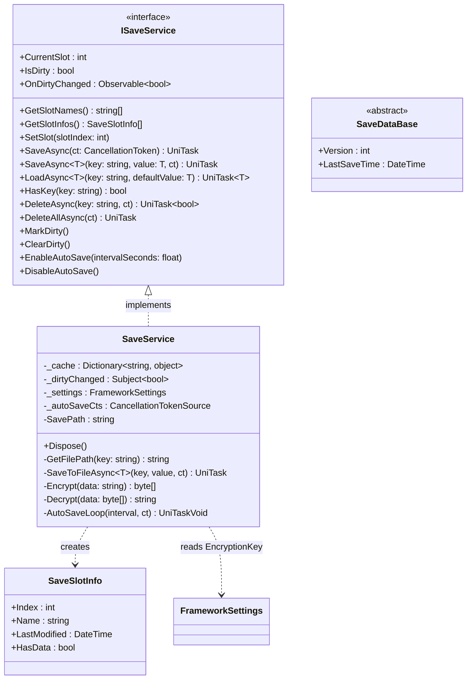
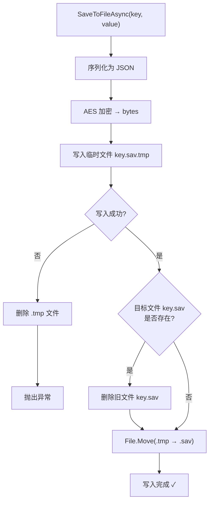
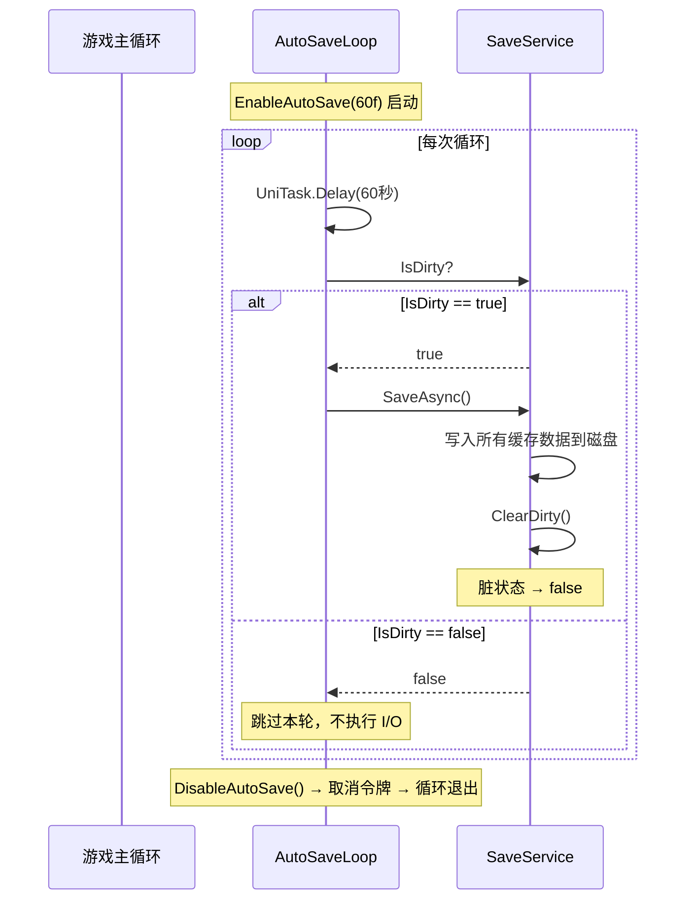

存档系统是 CFramework 中负责游戏数据持久化的核心模块，围绕 `ISaveService` 接口构建了四个关键能力：**原子写入**保证断电安全、**脏状态追踪**配合 R3 响应式通知、**AES 对称加密**保护存档隐私、以及**多存档槽**支持多周目并行。本文将从架构总览切入，逐一剖析每个子系统的设计动机与实现细节，帮助你在自己的游戏项目中快速接入并定制存档逻辑。

Sources: [ISaveService.cs](Runtime/Save/ISaveService.cs#L1-L48), [SaveService.cs](Runtime/Save/SaveService.cs#L1-L351)

---

## 架构总览

存档系统由四个类型组成，职责划分清晰：`ISaveService` 定义服务契约、`SaveService` 承载全部实现、`SaveDataBase` 为存档数据提供版本化基类、`SaveSlotInfo` 封装存档槽的元数据。服务通过 [依赖注入体系](5-yi-lai-zhu-ru-ti-xi-gamescope-scenescope-yu-dong-tai-an-zhuang-qi-ji-zhi) 注册到 `GameScope`，以单例形式供全局访问。



**数据流概览**：游戏代码调用 `SaveAsync<T>(key, value)` → 数据写入内存缓存 `_cache` → 序列化为 JSON → AES 加密 → 原子写入到磁盘文件 `slot_N/key.sav`。读取时逆向执行：从缓存查找 → 如未命中则从磁盘读取 → AES 解密 → 反序列化 → 写入缓存并返回。

Sources: [ISaveService.cs](Runtime/Save/ISaveService.cs#L10-L47), [SaveService.cs](Runtime/Save/SaveService.cs#L16-L28), [SaveDataBase.cs](Runtime/Save/SaveDataBase.cs#L1-L14), [SaveSlotInfo.cs](Runtime/Save/SaveSlotInfo.cs#L1-L15)

---

## 原子写入机制

游戏存档面临的核心风险是**写入中断**——进程崩溃、设备断电、操作系统强杀都可能导致文件只写入了一半，产生损坏的存档数据。CFramework 采用经典的**临时文件 + 原子重命名**策略来规避这个问题。



具体实现分三步：首先将加密后的字节流写入 `.tmp` 后缀的临时文件；写入完成后，如果目标文件已存在则先删除；最后通过 `File.Move` 将临时文件重命名为目标文件。在大多数操作系统上，`File.Move` 是原子操作——要么完整完成，要么完全不发生，不存在"写了一半"的中间态。这意味着即使 `File.Move` 前一刻进程被杀，磁盘上要么保留着旧的完整存档、要么保留着新的完整存档，绝不会出现半截数据。

当写入失败时（例如磁盘已满），`catch` 块会立即清理临时文件，防止残留的 `.tmp` 文件污染存档目录。测试套件通过 `S001_AtomicWrite_ProcessKillDuringWriteDoesNotCorrupt` 和 `S001_AtomicWrite_TempFileCleanedOnError` 两个用例验证了这一行为。

Sources: [SaveService.cs](Runtime/Save/SaveService.cs#L155-L183), [SaveServiceTests.cs](Tests/Runtime/Save/SaveServiceTests.cs#L59-L104)

---

## 脏状态追踪与响应式通知

存档系统通过 `IsDirty` 属性和 `OnDirtyChanged` 可观察流实现脏状态追踪，其核心设计原则是**去重触发**——只在状态真正变化时发出通知，避免冗余事件导致的性能浪费。

| 方法 | 触发条件 | 行为 |
|------|---------|------|
| `MarkDirty()` | `IsDirty == false` | 将 `IsDirty` 设为 `true`，通过 `_dirtyChanged` Subject 推送 `true` |
| `MarkDirty()` | `IsDirty == true` | **不执行任何操作**，不推送事件 |
| `ClearDirty()` | `IsDirty == true` | 将 `IsDirty` 设为 `false`，推送 `false` |
| `ClearDirty()` | `IsDirty == false` | **不执行任何操作**，不推送事件 |

这个去重机制在测试中得到了严格验证：连续调用三次 `MarkDirty()` 只会产生一次事件通知（`S002_DirtyState_MarkDirtyDoesNotTriggerEventIfAlreadyDirty`）；在非脏状态下调用 `ClearDirty()` 不会产生任何事件（`S002_DirtyState_ClearDirtyDoesNotTriggerEventIfNotDirty`）。

**脏状态的触发时机**体现在两个操作路径上：`SaveAsync<T>(key, value)` 在写入文件后调用 `MarkDirty()`，标记数据已修改；`SaveAsync()`（无参版本）在将所有缓存数据刷写到磁盘后调用 `ClearDirty()`，表示数据已持久化完毕。`DeleteAllAsync()` 同样会清除脏状态，因为所有数据都已被移除。

**实际应用模式**：UI 层可以订阅 `OnDirtyChanged` 来驱动"是否显示保存提示"等交互逻辑：

```csharp
saveService.OnDirtyChanged
    .Subscribe(isDirty => saveIndicator.gameObject.SetActive(isDirty))
    .AddTo(this);
```

Sources: [SaveService.cs](Runtime/Save/SaveService.cs#L39-L41), [SaveService.cs](Runtime/Save/SaveService.cs#L249-L267), [SaveService.cs](Runtime/Save/SaveService.cs#L141-L150), [SaveServiceTests.cs](Tests/Runtime/Save/SaveServiceTests.cs#L106-L163)

---

## AES 对称加密

存档文件以加密形式存储在磁盘上，防止用户直接修改 JSON 文本作弊或窥探未公开的游戏内容。加密层使用 **AES（Advanced Encryption Standard）** 对称算法，密钥来源于 `FrameworkSettings.EncryptionKey` 配置。

### 加密流程


`Encrypt` 方法将 `EncryptionKey` 通过 `PadRight(16)` 填充并截取前 16 字节作为 AES-128 密钥。每次加密时调用 `aes.GenerateIV()` 生成随机的 16 字节初始化向量（IV），然后将 IV 明文拼接到密文头部：`[IV 16字节][密文]`。**随机 IV 确保即使对相同明文重复加密，输出的密文也完全不同**，有效防止已知明文攻击。

### 解密流程

`Decrypt` 方法是加密的逆过程：从密文头部提取前 16 字节作为 IV，剩余部分作为密文，然后使用 AES 解密器还原明文。密钥处理方式与加密一致，保证了对称性。

### 密钥配置

默认密钥为 `"CFramework"`（见 `FrameworkSettings.cs`），通过 ScriptableObject Inspector 即可修改。密钥在内部被标准化为恰好 16 字节（AES-128），不足时右侧补空格，超出时截断。

| 配置项 | 位置 | 默认值 | 说明 |
|--------|------|--------|------|
| `EncryptionKey` | `FrameworkSettings` Inspector | `"CFramework"` | 存档加密密钥，实际使用前 16 字节 |
| `AutoSaveInterval` | `FrameworkSettings` Inspector | `60` | 自动保存间隔（秒） |

> **安全提示**：框架提供的 AES 加密属于客户端对称加密，密钥存储在游戏包体内。这足以防止普通用户的随意篡改，但不能抵御有经验的逆向工程师。如果你的游戏对反作弊有更高要求，建议在服务端进行关键数据的验证。

Sources: [SaveService.cs](Runtime/Save/SaveService.cs#L309-L348), [FrameworkSettings.cs](Runtime/Core/FrameworkSettings.cs#L38-L41)

---

## 多存档槽管理

存档系统支持**多存档槽**（Multi-Slot）架构，每个槽位在磁盘上对应一个独立的目录，数据完全隔离。这在 RPG、策略等需要多周目并行存档的游戏类型中尤为重要。

### 目录结构

磁盘上的存档目录组织如下：

```
Application.persistentDataPath/
└── Save/
    ├── slot_0/
    │   ├── player.sav
    │   └── settings.sav
    ├── slot_1/
    │   └── player.sav
    └── slot_2/
        ├── player.sav
        └── inventory.sav
```

每个 `slot_N` 目录内以 `key.sav` 为文件名存储对应的存档数据。`SavePath` 属性根据 `CurrentSlot` 动态拼接路径：`persistentDataPath/Save/slot_{CurrentSlot}/`。

### 槽位切换与缓存清理

调用 `SetSlot(int slotIndex)` 切换存档槽时，服务会执行两个关键操作：将 `CurrentSlot` 更新为新索引、清空内存缓存 `_cache`。缓存清理确保切换槽位后不会读到上一个槽位的残留数据。负数索引会被自动修正为 `0`。

### 槽位元数据查询

`GetSlotNames()` 扫描 `Save/` 目录下所有子目录名称并返回字符串数组。`GetSlotInfos()` 进一步解析每个槽位的详细信息，返回 `SaveSlotInfo` 对象数组：

| SaveSlotInfo 字段 | 类型 | 含义 |
|-------------------|------|------|
| `Index` | `int` | 从目录名 `slot_N` 解析出的数字索引 |
| `Name` | `string` | 原始目录名，如 `"slot_0"` |
| `LastModified` | `DateTime` | 目录的最后写入时间 |
| `HasData` | `bool` | 目录内是否存在 `*.sav` 文件 |

`HasData` 通过检查目录内是否存在 `.sav` 扩展名的文件来判断，而非简单判断目录是否存在。这避免了空目录被误判为有效存档。

Sources: [SaveService.cs](Runtime/Save/SaveService.cs#L28-L97), [SaveSlotInfo.cs](Runtime/Save/SaveSlotInfo.cs#L1-L15), [SaveServiceTests.cs](Tests/Runtime/Save/SaveServiceTests.cs#L492-L622)

---

## 内存缓存层

`SaveService` 内部维护了一个 `Dictionary<string, object>` 作为内存缓存，在读路径和写路径中扮演不同角色。

**读路径缓存**：`LoadAsync<T>(key, defaultValue)` 首先检查缓存是否命中——如果 `_cache` 中已存在该 key，直接返回缓存的强转结果，避免磁盘 I/O 和解密开销。未命中时才执行文件读取、解密、反序列化，然后将结果写入缓存。

**写路径缓存**：`SaveAsync<T>(key, value)` 先将 value 存入 `_cache`，再执行文件写入。这保证了后续同一 key 的 `LoadAsync` 能立即获取最新数据，无需等磁盘写入完成。

**缓存生命周期**：缓存在 `SetSlot()` 和 `DeleteAllAsync()` 调用时被清空，在 `DeleteAsync(key)` 时移除单个条目。`HasKey(key)` 方法同时检查缓存和磁盘，缓存命中时直接返回 `true`。

**并发安全注意**：在 `SaveAsync()` 无参版本中，缓存键值对先被复制到 `cacheCopy` 列表再遍历，避免遍历过程中集合被修改导致异常。这是一个务实的防御性拷贝策略。

Sources: [SaveService.cs](Runtime/Save/SaveService.cs#L18-L19), [SaveService.cs](Runtime/Save/SaveService.cs#L103-L151), [SaveService.cs](Runtime/Save/SaveService.cs#L185-L200)

---

## 自动保存机制

自动保存功能通过 `EnableAutoSave(float intervalSeconds)` 启动一个基于 UniTask 的异步循环，在后台持续运行，仅在数据为脏时触发保存。



**关键设计决策**：

- **懒保存**：只有 `IsDirty == true` 时才执行 I/O 操作。如果游戏在两次检查间隔内没有任何数据修改，自动保存完全不产生磁盘写入开销。
- **CancellationToken 控制**：`DisableAutoSave()` 通过取消 `CancellationTokenSource` 来终止循环。内部调用 `AutoSaveLoop` 前会先调用 `DisableAutoSave()` 清理旧的 CTS，防止重复启动循环。
- **异常隔离**：自动保存循环内的异常被 `try-catch` 捕获并记录警告日志，不会导致循环终止。即使某次保存失败，下一轮循环仍会尝试保存。
- **默认间隔**：`FrameworkSettings.AutoSaveInterval` 默认值为 60 秒，可通过 Inspector 调整。`EnableAutoSave` 方法接受 `intervalSeconds` 参数覆盖默认值。

Sources: [SaveService.cs](Runtime/Save/SaveService.cs#L271-L305), [FrameworkSettings.cs](Runtime/Core/FrameworkSettings.cs#L38-L39), [SaveServiceTests.cs](Tests/Runtime/Save/SaveServiceTests.cs#L409-L490)

---

## 错误处理与容错设计

存档系统在多个层面实现了容错机制，确保在各种异常情况下都不会导致游戏崩溃或数据丢失。

| 异常场景 | 处理策略 | 表现 |
|----------|---------|------|
| 文件不存在 | `LoadAsync` 检查 `File.Exists`，未命中返回 `defaultValue` | 静默返回默认值 |
| 文件损坏（被篡改/磁盘错误） | `catch` 捕获解密/反序列化异常，返回 `defaultValue` 并输出 Warning 日志 | 静默降级 |
| 写入失败（磁盘满/权限不足） | 删除临时文件，抛出异常让调用方处理 | 调用方决定重试或通知用户 |
| 不存在的槽位 | `LoadAsync` 在空目录中查找文件，自然返回 `defaultValue` | 静默返回 |
| 操作取消 | 开头调用 `ct.ThrowIfCancellationRequested()` 抛出 `OperationCanceledException` | UniTask 标准取消语义 |
| 删除文件失败 | 捕获异常输出 Warning，返回 `false` | 不影响其他数据 |

测试套件中的 `ErrorHandling_*` 系列用例验证了这些容错行为，包括手动损坏文件后加载返回默认值（`S624`）、空 key 不导致崩溃（`S650`）、已取消的 CancellationToken 正确抛出 `OperationCanceledException`（`S662`）、以及不存在的槽位目录不导致异常（`S688`）。

Sources: [SaveService.cs](Runtime/Save/SaveService.cs#L117-L139), [SaveService.cs](Runtime/Save/SaveService.cs#L174-L183), [SaveService.cs](Runtime/Save/SaveService.cs#L194-L240), [SaveServiceTests.cs](Tests/Runtime/Save/SaveServiceTests.cs#L624-L701)

---

## SaveDataBase 版本化基类

`SaveDataBase` 是一个轻量级的抽象基类，为存档数据提供两个标准字段：

```csharp
public abstract class SaveDataBase
{
    public int Version { get; set; }
    public DateTime LastSaveTime { get; set; }
}
```

- **`Version`**：数据版本号，用于实现存档迁移逻辑。当游戏更新导致存档格式变化时，可以通过版本号判断需要执行的迁移步骤。
- **`LastSaveTime`**：最后保存时间戳，可用于 UI 显示或数据过期判断。

使用时只需让你的存档数据类继承 `SaveDataBase`：

```csharp
[Serializable]
public class PlayerSaveData : SaveDataBase
{
    public int Level;
    public int Gold;
    public string PlayerName;
}
```

**注意**：`SaveDataBase` 是可选的——`SaveService` 的泛型 API `SaveAsync<T>` / `LoadAsync<T>` 不要求 `T` 必须继承 `SaveDataBase`。任何可被 `JsonUtility` 序列化的类型都能直接使用。`SaveDataBase` 仅在你需要版本管理和时间戳时才需要继承。

Sources: [SaveDataBase.cs](Runtime/Save/SaveDataBase.cs#L1-L14)

---

## 完整 API 速查表

以下表格汇总了 `ISaveService` 接口暴露的全部公共方法，方便快速查阅：

### 存档槽管理

| 方法 / 属性 | 返回值 | 说明 |
|-------------|--------|------|
| `CurrentSlot` | `int` | 当前活跃的存档槽索引 |
| `GetSlotNames()` | `string[]` | 返回所有已存在的槽位目录名 |
| `GetSlotInfos()` | `SaveSlotInfo[]` | 返回所有槽位的详细信息 |
| `SetSlot(int)` | `void` | 切换到指定槽位，清空缓存 |

### 保存与加载

| 方法 | 返回值 | 说明 |
|------|--------|------|
| `SaveAsync(CancellationToken)` | `UniTask` | 将所有缓存数据刷写到磁盘，清除脏状态 |
| `SaveAsync<T>(string, T, CancellationToken)` | `UniTask` | 保存单条数据到缓存和磁盘 |
| `LoadAsync<T>(string, T)` | `UniTask<T>` | 从缓存或磁盘加载数据 |
| `HasKey(string)` | `bool` | 检查 key 是否存在于缓存或磁盘 |
| `DeleteAsync(string, CancellationToken)` | `UniTask<bool>` | 删除指定 key 的缓存和文件 |
| `DeleteAllAsync(CancellationToken)` | `UniTask` | 清除当前槽位的全部数据 |

### 脏状态与自动保存

| 方法 / 属性 | 返回值 | 说明 |
|-------------|--------|------|
| `IsDirty` | `bool` | 当前是否存在未持久化的修改 |
| `MarkDirty()` | `void` | 手动标记为脏状态 |
| `ClearDirty()` | `void` | 手动清除脏状态 |
| `OnDirtyChanged` | `Observable<bool>` | R3 响应式流，脏状态变化时推送 |
| `EnableAutoSave(float)` | `void` | 启用自动保存循环 |
| `DisableAutoSave()` | `void` | 停止自动保存循环 |

Sources: [ISaveService.cs](Runtime/Save/ISaveService.cs#L1-L48)

---

## 延伸阅读

- **[依赖注入体系](5-yi-lai-zhu-ru-ti-xi-gamescope-scenescope-yu-dong-tai-an-zhuang-qi-ji-zhi)** — 了解 `SaveService` 如何通过 `IInstaller` 注册到 `GameScope` 并注入到其他服务
- **[事件总线](6-shi-jian-zong-xian-tong-bu-yi-bu-fa-bu-ding-yue-yu-r3-xiang-ying-shi-ji-cheng)** — 深入理解 `OnDirtyChanged` 所基于的 R3 `Subject` 与 `Observable` 模式
- **[单元测试指南](22-dan-yuan-ce-shi-zhi-nan-ce-shi-fu-gai-ce-lue-yu-mock-ti-huan-mo-shi)** — 查看存档系统 20+ 个测试用例的编写策略与 Mock 模式
- **[框架扩展指南](23-kuang-jia-kuo-zhan-zhi-nan-zi-ding-yi-iinstaller-iassetprovider-yu-iscenetransition)** — 如何替换默认 `SaveService` 实现以支持云存档等自定义存储后端