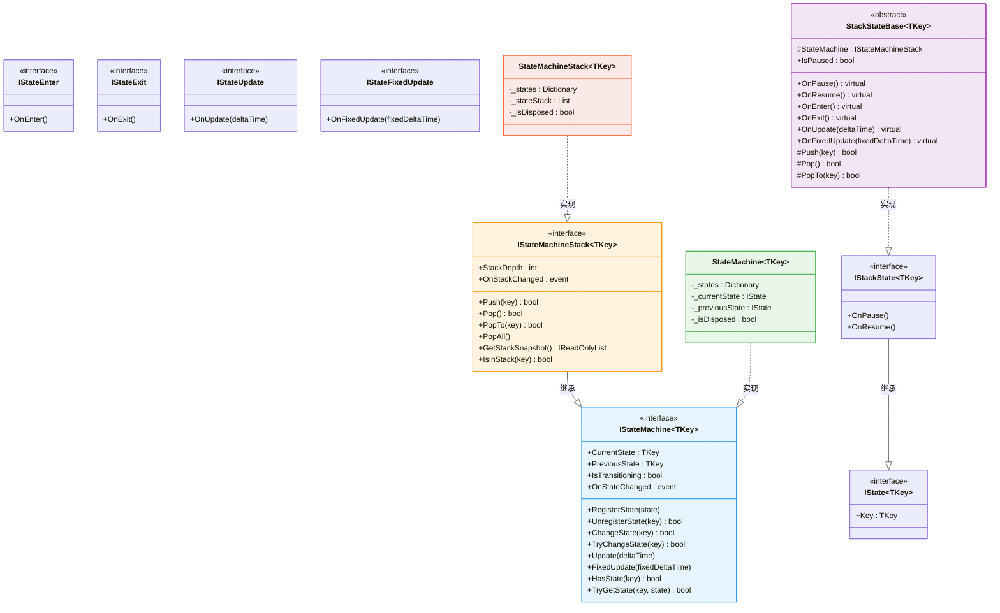
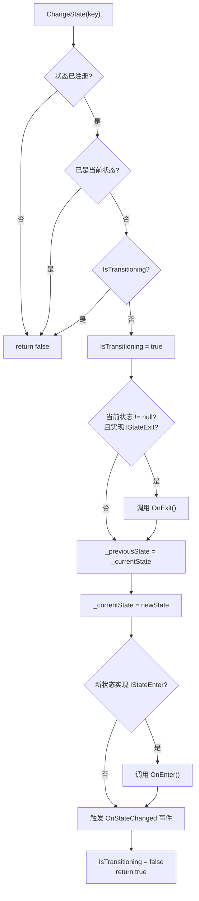
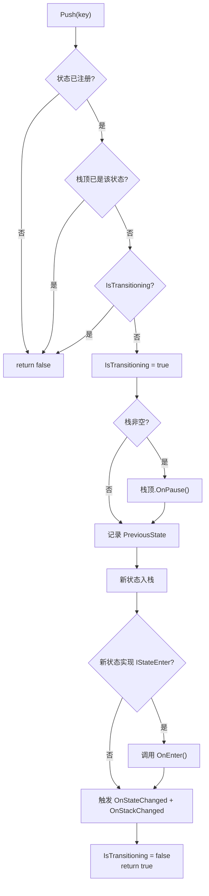
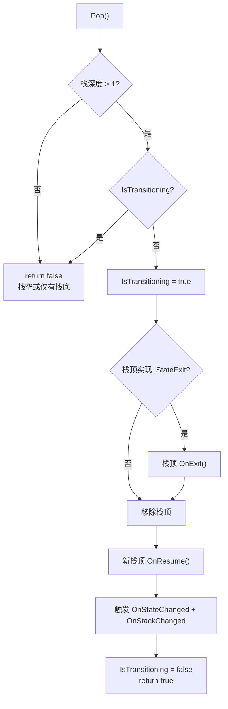

CFramework 的状态机模块提供了两种互补的有限状态机实现——**标准扁平状态机** `StateMachine<TKey>` 和**栈状态机** `StateMachineStack<TKey>`。两者共享统一的生命周期接口设计哲学：通过接口组合实现"按需实现"（opt-in），状态类只需声明关心的生命周期回调，不必背负全部方法的空实现。泛型键类型 `TKey` 允许你使用枚举、字符串或任意可比较类型来标识状态，从根本上避免了魔法字符串与硬编码索引。本文将从接口架构出发，逐一剖析两种状态机的设计动机、核心机制与适用场景，帮助你为不同游戏子系统选择正确的状态管理策略。

Sources: [IState.cs](Runtime/State/FSM/IState.cs#L1-L14), [IStateMachine.cs](Runtime/State/FSM/IStateMachine.cs#L1-L83), [IStateMachineStack.cs](Runtime/State/FSM/IStateMachineStack.cs#L1-L58)

## 接口架构：组合优于继承的设计哲学

### 生命周期接口矩阵

状态机的核心设计思想是**接口隔离原则（ISP）**——每个生命周期阶段被建模为独立的窄接口，状态类通过实现多个接口来声明自己需要哪些回调。这意味着一个纯"被动"状态可以只实现 `IStateEnter` 和 `IStateExit` 而无需关心帧更新，而一个需要每帧驱动逻辑的状态则额外实现 `IStateUpdate`。

| 接口 | 方法 | 职责 |
|---|---|---|
| `IState<TKey>` | `Key` | 状态的身份标识，唯一键 |
| `IStateEnter` | `OnEnter()` | 进入状态时调用，执行初始化逻辑 |
| `IStateExit` | `OnExit()` | 退出状态时调用，执行清理逻辑 |
| `IStateUpdate` | `OnUpdate(float)` | 每帧更新，接收 deltaTime 参数 |
| `IStateFixedUpdate` | `OnFixedUpdate(float)` | 物理帧更新，接收 fixedDeltaTime 参数 |
| `IStackState<TKey>` | `OnPause()` / `OnResume()` | 栈状态独有：被压栈暂停 / 被弹栈恢复 |

Sources: [IStateEnter.cs](Runtime/State/FSM/IStateEnter.cs#L1-L10), [IStateExit.cs](Runtime/State/FSM/IStateExit.cs#L1-L10), [IStateUpdate.cs](Runtime/State/FSM/IStateUpdate.cs#L1-L11), [IStateFixedUpdate.cs](Runtime/State/FSM/IStateFixedUpdate.cs#L1-L11), [IStackState.cs](Runtime/State/FSM/IStackState.cs#L1-L19)

### 类型关系总览

下面的类图展示了整个状态机模块的类型层次。注意两种状态机共享 `IStateMachine<TKey>` 接口，而栈状态机通过继承扩展了标准接口，添加了 `Push`/`Pop` 等栈操作。`StackStateBase<TKey>` 作为便捷基类，预实现了所有生命周期方法的空实现并提供 `StateMachine` 引用和 `Push`/`Pop`/`PopTo` 等快捷方法。



Sources: [StateMachine.cs](Runtime/State/FSM/StateMachine.cs#L1-L197), [StateMachineStack.cs](Runtime/State/FSM/StateMachineStack.cs#L1-L412), [StackStateBase.cs](Runtime/State/FSM/StackStateBase.cs#L1-L112)

## 标准 FSM：StateMachine\<TKey\>

### 设计动机与适用场景

**标准状态机**是最经典的状态管理模式——任意时刻只有一个"当前状态"，状态切换是原子替换。这种模型天然适用于：角色行为状态（Idle → Run → Jump → Attack）、敌人 AI 状态巡逻（Patrol → Chase → Attack → Flee）、武器切换（Sword → Bow → Magic）等**扁平化的、无层次嵌套关系**的状态集。

`StateMachine<TKey>` 内部使用 `Dictionary<TKey, IState<TKey>>` 存储已注册的状态，通过引用跟踪 `_currentState` 和 `_previousState`。切换状态时，旧状态先执行 `OnExit()`，新状态再执行 `OnEnter()`，整个过程被 `IsTransitioning` 标志位包裹在 `try/finally` 块中，确保即使在回调中抛出异常，标志位也能被正确重置。

Sources: [StateMachine.cs](Runtime/State/FSM/StateMachine.cs#L11-L53)

### 状态切换的生命周期流程



Sources: [StateMachine.cs](Runtime/State/FSM/StateMachine.cs#L78-L115)

### 核心安全机制

**重入保护**是状态机最关键的防护层。`IsTransitioning` 标志在状态切换开始时置 `true`，在 `finally` 块中置 `false`。这意味着如果在 `OnExit()` 或 `OnEnter()` 回调中再次调用 `ChangeState()`，将被直接拒绝并返回 `false`，避免栈溢出和状态不一致。框架同时提供了 `TryChangeState()` 安全版本——它用 `try/catch` 包裹 `ChangeState()`，将异常转化为 `Debug.LogWarning` 和 `false` 返回值，适用于外部输入驱动的不确定场景。

Sources: [StateMachine.cs](Runtime/State/FSM/StateMachine.cs#L86-L133)

### 使用示例

以下是一个角色控制器状态的标准 FSM 实现模式。使用枚举作为键类型可以获得编译期类型安全：

```csharp
// 定义状态键枚举
public enum PlayerState { Idle, Run, Jump, Attack }

// 状态类：只需实现关心的接口
public class PlayerIdleState : IState<PlayerState>, IStateEnter, IStateUpdate
{
    public PlayerState Key => PlayerState.Idle;
    
    public void OnEnter()
    {
        // 播放待机动画、重置速度等
    }
    
    public void OnUpdate(float deltaTime)
    {
        // 检测输入，满足条件时通过外部引用触发 ChangeState
    }
}

// 创建并使用状态机
var fsm = new StateMachine<PlayerState>();
fsm.RegisterState(new PlayerIdleState());
fsm.RegisterState(new PlayerRunState());
fsm.RegisterState(new PlayerJumpState());

fsm.ChangeState(PlayerState.Idle);  // 首次进入 Idle
fsm.ChangeState(PlayerState.Run);   // Idle.OnExit() → Run.OnEnter()
```

Sources: [StateMachine.cs](Runtime/State/FSM/StateMachine.cs#L1-L197), [StateMachineTests.cs](Tests/Runtime/State/StateMachineTests.cs#L447-L479)

## 栈状态机：StateMachineStack\<TKey\>

### 设计动机与适用场景

**栈状态机**在标准 FSM 的基础上引入了状态栈——当前状态不会被销毁，而是被"压入栈中暂停"。当新状态弹出后，原状态自动恢复执行。这种模型天然映射了游戏中的**层级覆盖**场景：UI 导航（主菜单 → 设置 → 音频设置 → 返回）、暂停系统（游戏中 → 暂停菜单 → 返回游戏）、对话框链（剧情对话 → 选项 → 确认 → 返回对话）。栈状态机的核心优势是：被覆盖的状态**保持其内部数据不变**，恢复时无需重新初始化。

`StateMachineStack<TKey>` 内部同时维护一个 `Dictionary`（状态注册表）和一个 `List`（运行时栈）。`Update` 和 `FixedUpdate` **只驱动栈顶状态**——被暂停的中间状态不会收到帧回调，这是栈状态机与标准 FSM 在运行时行为上的关键差异。

Sources: [StateMachineStack.cs](Runtime/State/FSM/StateMachineStack.cs#L11-L35), [StateMachineStack.cs](Runtime/State/FSM/StateMachineStack.cs#L324-L342)

### 栈操作一览

| 操作 | 方法 | 行为 | 触发的生命周期 |
|---|---|---|---|
| 替换栈顶 | `ChangeState(key)` | 退出当前栈顶，将新状态放入栈顶 | 旧顶 `OnExit` → 新顶 `OnEnter` |
| 压栈 | `Push(key)` | 暂停当前栈顶，将新状态压入栈顶 | 旧顶 `OnPause` → 新顶 `OnEnter` |
| 弹栈 | `Pop()` | 退出当前栈顶，恢复其下方状态 | 旧顶 `OnExit` → 新顶 `OnResume` |
| 弹到指定层 | `PopTo(key)` | 退出目标状态之上的所有状态，恢复目标状态 | 上层全部 `OnExit` → 目标 `OnResume` |
| 弹到栈底 | `PopAll()` | 退出除栈底外的所有状态，恢复栈底 | 上层全部 `OnExit` → 栈底 `OnResume` |

Sources: [StateMachineStack.cs](Runtime/State/FSM/StateMachineStack.cs#L90-L318)

### Push 与 Pop 的生命周期流程

**Push 流程**——将新状态压入栈顶，旧状态被暂停而非销毁：



**Pop 流程**——弹出栈顶，恢复下方状态：



Sources: [StateMachineStack.cs](Runtime/State/FSM/StateMachineStack.cs#L150-L183), [StateMachineStack.cs](Runtime/State/FSM/StateMachineStack.cs#L189-L223)

### ChangeState 在栈状态机中的语义

需要特别注意的是，`ChangeState()` 在栈状态机中的语义是**替换栈顶**，而非清空整个栈。这意味着栈中已暂停的状态不会被恢复或退出，只有栈顶被替换。这一设计允许你在保留导航历史的同时替换当前活跃状态。例如：栈中为 `[Game, Menu]`，调用 `ChangeState(Dialog)` 后变为 `[Game, Dialog]`——Menu 被 `OnExit`，Dialog `OnEnter`，而底层的 Game 状态保持暂停不变。

Sources: [StateMachineStack.cs](Runtime/State/FSM/StateMachineStack.cs#L90-L127), [StateMachineStackTests.cs](Tests/Runtime/State/StateMachineStackTests.cs#L846-L878)

### 使用示例：游戏菜单导航

以下模拟了一个完整的 UI 层级导航场景，展示栈状态机的核心优势：

```csharp
public enum UIScreen { MainMenu, Settings, AudioSettings }

// 使用 StackStateBase 作为基类，获得 StateMachine 引用和快捷方法
public class MainMenuState : StackStateBase<UIScreen>, IStateEnter, IStateExit
{
    public MainMenuState() : base(UIScreen.MainMenu) { }
    
    public override void OnEnter()  { /* 显示主菜单 UI */ }
    public override void OnExit()   { /* 隐藏主菜单 UI */ }
    
    public void OnSettingsButton() => Push(UIScreen.Settings);  // 快捷方法
}

public class SettingsState : StackStateBase<UIScreen>, IStateEnter, IStateExit
{
    public SettingsState() : base(UIScreen.Settings) { }
    
    public override void OnEnter()  { /* 显示设置面板 */ }
    public override void OnExit()   { /* 隐藏设置面板 */ }
}

// 创建栈状态机
var fsm = new StateMachineStack<UIScreen>();
fsm.RegisterState(new MainMenuState());
fsm.RegisterState(new SettingsState());
fsm.RegisterState(new AudioSettingsState());

fsm.ChangeState(UIScreen.MainMenu);  // 栈: [MainMenu]           深度 1
fsm.Push(UIScreen.Settings);         // 栈: [MainMenu, Settings]  深度 2，MainMenu.OnPause()
fsm.Push(UIScreen.AudioSettings);    // 栈: [MainMenu, Settings, AudioSettings]  深度 3

fsm.Pop();                           // 栈: [MainMenu, Settings]  AudioSettings.OnExit() → Settings.OnResume()
fsm.PopAll();                        // 栈: [MainMenu]            Settings.OnExit() → MainMenu.OnResume()
```

Sources: [StackStateBase.cs](Runtime/State/FSM/StackStateBase.cs#L1-L112), [StateMachineStackTests.cs](Tests/Runtime/State/StateMachineStackTests.cs#L773-L823)

## StackStateBase：栈状态的便捷基类

`StackStateBase<TKey>` 是框架为栈状态机提供的**一站式基类**，它预实现了所有生命周期接口并提供空方法的 `virtual` 覆写点。更重要的是，它持有对所属 `IStateMachineStack<TKey>` 的引用，使状态内部可以直接调用 `Push`、`Pop`、`PopTo` 等操作——无需外部控制器中转。基类还自动管理 `IsPaused` 属性：`OnPause()` 时置 `true`，`OnResume()` 时置 `false`，你的覆写代码可以通过该属性查询当前暂停状态。

```csharp
public abstract class StackStateBase<TKey> : IStackState<TKey>
{
    protected IStateMachineStack<TKey> StateMachine { get; private set; }
    public bool IsPaused { get; private set; }
    public TKey Key { get; }
    
    public virtual void OnPause()  { IsPaused = true; }
    public virtual void OnResume() { IsPaused = false; }
    public virtual void OnEnter()  { }
    public virtual void OnExit()   { }
    public virtual void OnUpdate(float deltaTime) { }
    public virtual void OnFixedUpdate(float fixedDeltaTime) { }
    
    protected bool Push(TKey key) => StateMachine?.Push(key) ?? false;
    protected bool Pop()          => StateMachine?.Pop() ?? false;
    protected bool PopTo(TKey key) => StateMachine?.PopTo(key) ?? false;
}
```

状态机在 `RegisterState` 时自动通过 `SetStateMachine()` 注入自身引用，在 `UnregisterState` 或 `Dispose` 时清空引用，确保生命周期绑定的一致性。

Sources: [StackStateBase.cs](Runtime/State/FSM/StackStateBase.cs#L1-L112), [StateMachineStack.cs](Runtime/State/FSM/StateMachineStack.cs#L50-L65)

## 两种状态机的对比与选型指南

| 维度 | StateMachine\<TKey\> | StateMachineStack\<TKey\> |
|---|---|---|
| **状态数量** | 任意时刻仅 1 个活跃状态 | 栈中可存在多个状态，仅栈顶活跃 |
| **切换语义** | 原子替换，旧状态销毁 | `ChangeState` 替换栈顶；`Push` 暂停当前并覆盖 |
| **回溯能力** | 仅记录 `PreviousState`，无自动恢复 | 完整的栈历史，`Pop` 自动恢复上一状态 |
| **状态要求** | 实现 `IState<TKey>` 即可 | 必须实现 `IStackState<TKey>`（含 `OnPause`/`OnResume`） |
| **帧更新范围** | 当前状态 | 仅栈顶状态 |
| **事件系统** | `OnStateChanged(from, to)` | `OnStateChanged` + `OnStackChanged(snapshot)` |
| **内存开销** | O(n) 注册表 + O(1) 当前引用 | O(n) 注册表 + O(m) 运行时栈 |
| **典型场景** | 角色 AI 行为、武器状态、游戏阶段 | UI 导航、暂停菜单、对话框链、嵌套面板 |

**选型原则**：如果状态之间的关系是"互斥替换"——切换后无需保留前一个状态的数据——使用标准 FSM。如果状态之间的关系是"层级覆盖"——覆盖后需要原样恢复前一个状态——使用栈状态机。在实际项目中，两者经常**混合使用**：角色的行为状态用标准 FSM 驱动，而游戏全局的 UI 层用栈状态机管理。

Sources: [StateMachine.cs](Runtime/State/FSM/StateMachine.cs#L1-L197), [StateMachineStack.cs](Runtime/State/FSM/StateMachineStack.cs#L1-L412)

## 资源管理与 Dispose 模式

两种状态机都实现了 `IDisposable`，遵循框架统一的资源管理模式。`Dispose()` 的执行流程为：先对活跃状态（标准 FSM 的当前状态 / 栈状态机从栈顶到栈底的全部状态）调用 `OnExit()`，然后清理所有状态的 `IStateMachineHolder` / `StackStateBase` 引用，最后清空注册表和栈。重复调用 `Dispose()` 是安全的（幂等设计），因为 `_isDisposed` 标志位会在首次调用后阻止重复清理。

在 Unity 中，你通常应在 `MonoBehaviour.OnDestroy()` 或 `IDisposable.Dispose()` 中调用状态机的 `Dispose()`。如果你使用了框架的[依赖注入体系](5-yi-lai-zhu-ru-ti-xi-gamescope-scenescope-yu-dong-tai-an-zhuang-qi-ji-zhi)，可以在安装器中将状态机注册为生命周期绑定的服务，由容器自动管理释放。

Sources: [StateMachine.cs](Runtime/State/FSM/StateMachine.cs#L178-L196), [StateMachineStack.cs](Runtime/State/FSM/StateMachineStack.cs#L393-L411)

## 事件驱动与外部观察

两种状态机都提供 `OnStateChanged` 事件（签名为 `Action<TKey, TKey>`，参数依次为"来源状态"和"目标状态"），用于解耦状态切换的外部响应。栈状态机额外提供 `OnStackChanged` 事件（签名为 `Action<IReadOnlyList<TKey>>`），在每次栈结构变化时推送完整的栈快照，适用于调试面板、面包屑导航等需要感知全栈结构的场景。

`GetStackSnapshot()` 返回的是**当前栈的浅拷贝列表**——每次调用都分配新的 `List<TKey>`。在性能敏感的热路径上，建议订阅 `OnStackChanged` 事件缓存快照，而非每帧调用此方法。`IsInStack(key)` 方法则用于查询特定状态是否仍在栈中（时间复杂度 O(m)，m 为栈深度），适用于需要检查前置状态是否有效的业务逻辑。

Sources: [IStateMachine.cs](Runtime/State/FSM/IStateMachine.cs#L28-L29), [IStateMachineStack.cs](Runtime/State/FSM/IStateMachineStack.cs#L18-L20), [StateMachineStack.cs](Runtime/State/FSM/StateMachineStack.cs#L370-L388)

## 常见陷阱与最佳实践

**陷阱一：在 OnEnter/OnExit 中触发状态切换。** 由于 `IsTransitioning` 重入保护，在生命周期回调中调用 `ChangeState`/`Push`/`Pop` 会被静默拒绝。如果需要链式切换，建议在 `OnEnter` 中通过 `UniTask.Yield()` 或 `UniTask.Delay()` 延迟触发下一帧的切换，或在回调中设置标志位由外部驱动器检查后执行切换。

**陷阱二：注销栈中的状态。** `UnregisterState` 会检查目标状态是否正在使用——标准 FSM 拒绝注销当前活跃状态，栈状态机拒绝注销任何在栈中的状态。这是有意为之的安全措施，防止状态被销毁后栈中出现悬空引用。

**陷阱三：Pop 时栈深度为 1。** 栈状态机的 `Pop()` 要求栈中至少有 2 个状态——只有栈底一个状态时弹出是无效操作，返回 `false`。这是为了防止"空栈"状态导致状态机失去活跃状态。如果你需要完全清空状态机，应使用 `Dispose()` 而非反复 `Pop`。

**最佳实践：使用枚举作为键类型。** 虽然框架支持任意 `TKey`，但枚举提供编译期检查、IDE 自动补全和重构安全性，远优于字符串键。在大型项目中，建议为每个状态机实例定义独立的枚举类型，避免键空间冲突。

Sources: [StateMachine.cs](Runtime/State/FSM/StateMachine.cs#L62-L71), [StateMachineStack.cs](Runtime/State/FSM/StateMachineStack.cs#L72-L83), [StateMachineStack.cs](Runtime/State/FSM/StateMachineStack.cs#L189-L193)

## 推荐阅读

- 如果你需要将状态机集成到框架的依赖注入容器中，参考 [依赖注入体系：GameScope、SceneScope 与动态安装器机制](5-yi-lai-zhu-ru-ti-xi-gamescope-scenescope-yu-dong-tai-an-zhuang-qi-ji-zhi)
- 如果你想了解状态机模块的完整测试覆盖策略与 Mock 模式，参考 [单元测试指南：测试覆盖策略与 Mock 替换模式](22-dan-yuan-ce-shi-zhi-nan-ce-shi-fu-gai-ce-lue-yu-mock-ti-huan-mo-shi)
- 如果你的 UI 面板需要与栈状态机配合管理导航历史，参考 [UI 面板系统：IUI 生命周期、UIBinder 组件注入与导航栈管理](12-ui-mian-ban-xi-tong-iui-sheng-ming-zhou-qi-uibinder-zu-jian-zhu-ru-yu-dao-hang-zhan-guan-li)