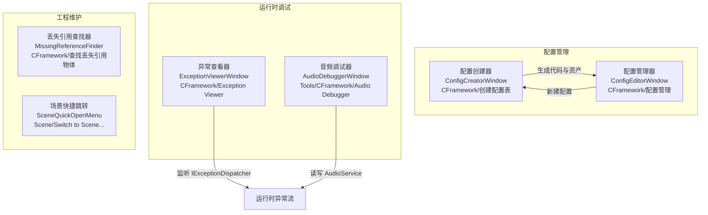
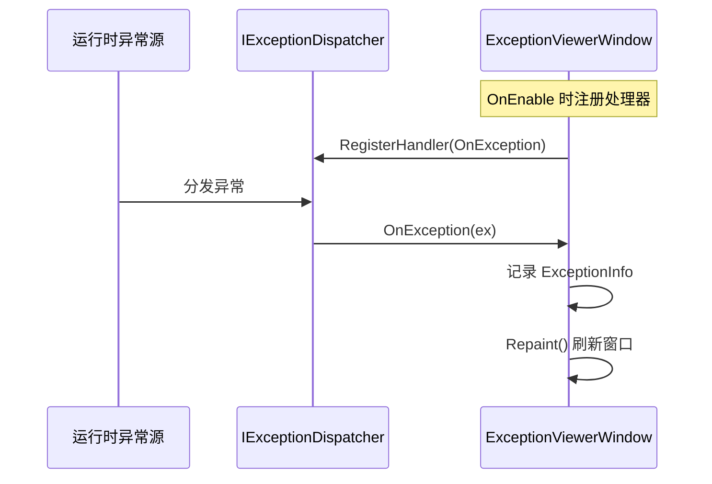

CFramework 在 Unity 编辑器中提供了一整套工具窗口，涵盖**配置表的可视化创建与管理**、**运行时异常实时监控**、**音频分组调试**以及**工程健康检查**（丢失引用扫描、场景快捷跳转）。这些窗口统一注册在菜单栏的 `CFramework/` 与 `Scene/` 路径下，无需额外配置即可使用。本页将逐一介绍每个窗口的功能定位、打开方式、界面构成与典型操作流程，帮助你在日常开发中快速定位和利用这些工具。

## 工具全景图

框架的编辑器工具按职能分为三大类——配置管理、运行时调试和工程维护。下面的关系图展示了各类工具的菜单入口与核心职责：



**关键设计特征**：配置管理类工具采用 **双实现架构**——当项目安装了 Odin Inspector 时自动启用增强版界面（ richer layout、拖拽排序、分页列表），未安装时回退到标准 `EditorWindow` 实现，功能完全等价。这一切换由 [OdinDetector](Editor/Utilities/OdinDetector.cs) 自动完成，你无需手动管理脚本定义符号。

Sources: [OdinDetector.cs](Editor/Utilities/OdinDetector.cs#L1-L67)

## 配置创建器（ConfigCreatorWindow）

### 功能定位

配置创建器是一个**可视化代码生成器**，它让你通过填写表单而非手写代码来创建配置表。它会同时生成两个 C# 文件——一个实现 `IConfigItem<TKey>` 的**数据类**和一个继承 `ConfigTable<TKey, TValue>` 的**配置表类**——并可自动创建对应的 ScriptableObject 资产文件。

**菜单入口**：`CFramework > 创建配置表`

Sources: [ConfigCreatorWindow.cs](Editor/Windows/Config/ConfigCreatorWindow.cs#L17-L28)

### 界面构成

窗口界面由五个逻辑区域组成：

| 区域 | 用途 | 关键字段 |
|------|------|---------|
| **基础配置** | 配置表名称、命名空间与输出目录 | `configName`、`configNamespace`、`configOutputPath` |
| **数据类设置** | 数据类的命名空间与输出目录 | `dataNamespace`、`dataOutputPath` |
| **类型配置** | 键类型选择、值类型名称、字段定义 | `keyType`、`valueTypeName`、`valueFields` |
| **资源设置** | 资产输出目录、是否自动创建资产、是否打开生成脚本 | `outputAssetPath`、`autoCreateAsset`、`openGeneratedScript` |
| **代码预览** | 实时预览即将生成的配置表类和数据类代码 | 只读显示 |

Sources: [ConfigCreatorWindow.cs](Editor/Windows/Config/ConfigCreatorWindow.cs#L31-L73)

### 键类型与字段定义

配置创建器支持 **8 种主键类型**，覆盖了常见的数值与字符串场景：

| 键类型 | 适用场景 |
|--------|---------|
| `int` | 整数 ID（默认选择） |
| `string` | 字符串标识符，如物品编号 "item_001" |
| `long` | 64 位整数 ID |
| `byte` / `short` | 小范围整数键 |
| `uint` / `ulong` / `ushort` | 无符号整数键 |

字段定义支持 **15 种数据类型**，包括基础类型（`int`、`float`、`string`、`bool`）、Unity 数学类型（`Vector2`、`Vector3`、`Color`）以及资源引用类型（`GameObject`、`Sprite`、`AudioClip` 等）。每个字段可以标记为**主键**（用于 `IConfigItem<TKey>` 的 `Key` 属性），并可添加**描述注释**。

Sources: [ConfigCreatorWindow.cs](Editor/Windows/Config/ConfigCreatorWindow.cs#L122-L189)

### 代码生成流程


窗口底部提供两个操作按钮：

- **「生成代码」**：生成 `.cs` 文件后，若 `autoCreateAsset` 为 `true`，则通过 [ConfigAssetCreator](Editor/Utilities/ConfigAssetCreator.cs) 注册待创建资产，等待编译完成后自动创建 `.asset` 文件
- **「仅生成代码」**：只生成 `.cs` 文件并刷新资产数据库，不创建资产

**智能联动**：当配置表名称以 "Config" 结尾时，值类型名称会自动推导——例如输入 `ItemConfig`，数据类名自动变为 `ItemData`。

Sources: [ConfigCreatorWindow.cs](Editor/Windows/Config/ConfigCreatorWindow.cs#L213-L334), [ConfigAssetCreator.cs](Editor/Utilities/ConfigAssetCreator.cs#L52-L81)

### 偏好设置持久化

配置创建器的所有路径和命名空间设置会自动保存到 `EditorPrefs`，下次打开窗口时恢复上次的配置。这意味着你在创建一系列同类配置表时，无需反复填写相同的命名空间和输出目录。

Sources: [ConfigCreatorWindow.cs](Editor/Windows/Config/ConfigCreatorWindow.cs#L76-L119)

## 配置管理器（ConfigEditorWindow）

### 功能定位

配置管理器是一个**集中式配置资产浏览器**，它会自动扫描项目中所有继承自 `ConfigTableBase` 的 ScriptableObject 资产，在一个窗口内完成浏览、搜索与编辑。你可以将其理解为配置表系统的"总控制台"。

**菜单入口**：`CFramework > 配置管理`

Sources: [ConfigEditorWindow.cs](Editor/Windows/Config/ConfigEditorWindow.cs#L15-L27)

### 双面板布局

窗口采用**左右分栏**的经典布局：

- **左侧面板（25% 宽度）**：显示所有已发现的配置表列表，每项展示名称、类型和记录数。支持搜索过滤（标准版本）和分页浏览（Odin 版本，每页 20 条）
- **右侧面板（75% 宽度）**：显示选中配置表的详细数据编辑器，标题栏显示配置名称与记录总数

当尚未选中任何配置表时，右侧面板会显示引导提示：「请在左侧选择一个配置表」或「暂无配置表，请点击下方新建配置按钮创建配置表」。

Sources: [ConfigEditorWindowDefault.cs](Editor/Windows/Config/ConfigEditorWindowDefault.cs#L147-L199), [ConfigEditorWindow.cs](Editor/Windows/Config/ConfigEditorWindow.cs#L57-L101)

### 核心操作

| 操作 | 说明 |
|------|------|
| **刷新** | 重新扫描项目中所有 `ConfigTableBase` 资产，更新列表 |
| **新建配置** | 打开配置创建器窗口，开始创建新的配置表 |
| **选中编辑** | 点击左侧列表项，右侧面板展示该配置的数据编辑器（使用 `ReorderableList` 支持增删改） |

标准实现版本使用 Unity 内置的 `ReorderableList` 来编辑配置数据列表，支持拖拽排序、添加与删除行。当字段数 ≤ 4 时采用水平排列布局，字段数 > 4 时采用垂直排列，确保在小屏幕上也有良好的编辑体验。

Sources: [ConfigEditorWindowDefault.cs](Editor/Windows/Config/ConfigEditorWindowDefault.cs#L297-L369), [ConfigEditorWindow.cs](Editor/Windows/Config/ConfigEditorWindow.cs#L121-L134)

## 全局异常查看器（ExceptionViewerWindow）

### 功能定位

异常查看器是框架**全局异常分发器**的编辑器端可视化窗口。它通过 `IExceptionDispatcher` 注册异常处理回调，将运行时捕获的所有异常（包括 UniTask 和 R3 的未处理异常）实时呈现在一个独立窗口中，方便你在不切换到 Console 窗口的情况下快速定位问题。

**菜单入口**：`CFramework > Exception Viewer`

**使用前提**：窗口需要在 **Play Mode** 下且 `GameScope` 已初始化才能接收异常事件。如果你在编辑器中打开此窗口但尚未进入播放模式，窗口不会显示错误，但也不会捕获异常。

Sources: [ExceptionViewerWindow.cs](Editor/Windows/Tools/ExceptionViewerWindow.cs#L1-L92)

### 界面与操作

窗口界面简洁直观：

- **工具栏**：左侧「Clear」按钮清空异常列表，右侧显示当前异常总数
- **异常列表**：按时间倒序排列（最新异常在最上方），每条显示 `[HH:mm:ss] 异常消息`
- **Copy Stack Trace**：每条异常旁的链接按钮，点击后将完整堆栈信息复制到系统剪贴板

当异常被捕获时，窗口会自动调用 `Repaint()` 刷新显示，你无需手动刷新。

Sources: [ExceptionViewerWindow.cs](Editor/Windows/Tools/ExceptionViewerWindow.cs#L30-L83)

### 工作原理



异常查看器与框架的 [全局异常分发器](7-quan-ju-yi-chang-fen-fa-qi-tong-bu-huo-unitask-yu-r3-wei-chu-li-yi-chang) 配合使用，是运行时调试的重要辅助工具。

Sources: [ExceptionViewerWindow.cs](Editor/Windows/Tools/ExceptionViewerWindow.cs#L16-L28)

## 音频调试器（AudioDebuggerWindow）

### 功能定位

音频调试器是一个**运行时专用**的音频系统监控面板，用于在 Play Mode 下实时查看和调节所有音频分组的音量、静音状态、Slot 占用情况以及快照切换。它直接操作 `IAudioService` 接口，修改立即生效。

**菜单入口**：`Tools > CFramework > Audio Debugger`

**编译条件**：此窗口仅在定义了 `CFRAMEWORK_AUDIO` 脚本符号时编译。如果你的项目中看不到此菜单项，请检查 FrameworkSettings 中是否启用了音频模块。

Sources: [AudioDebuggerWindow.cs](Editor/Windows/AudioDebuggerWindow.cs#L1-L19)

### 功能面板

窗口在运行时展示三个核心区域：

| 区域 | 功能 |
|------|------|
| **Audio Groups** | 遍历所有音频分组，显示路径、Slot 使用率（`Active/Total`）、音量滑块和静音开关 |
| **Snapshots** | 显示当前快照名称，列出所有可用快照按钮，点击即以 0.5 秒过渡时间切换 |
| **Save Volumes** | 将当前各分组音量持久化保存 |

当不在播放模式或 `AudioService` 未初始化时，窗口会显示相应的提示信息（HelpBox），引导你正确使用。

Sources: [AudioDebuggerWindow.cs](Editor/Windows/AudioDebuggerWindow.cs#L21-L91)

> **注意**：当前版本的 `GetAudioService()` 方法返回 `null`，需要根据项目实际的依赖注入获取方式进行适配。详细信息请参阅 [音频系统：双音轨 BGM 交叉淡入淡出与分组音量控制](14-yin-pin-xi-tong-shuang-yin-gui-bgm-jiao-cha-dan-ru-dan-chu-yu-fen-zu-yin-liang-kong-zhi)。

Sources: [AudioDebuggerWindow.cs](Editor/Windows/AudioDebuggerWindow.cs#L97-L110)

## 丢失引用查找器（MissingReferenceFinder）

### 功能定位

丢失引用查找器是一个**工程健康检查工具**，它会扫描项目中所有场景文件（`.unity`）和预制体文件（`.prefab`），检测两类常见问题：**脚本缺失**（Missing Script，即 Component 引用的脚本类已被删除）和**字段引用丢失**（Missing Reference，即序列化字段曾引用某个资源但该资源已被删除）。

**菜单入口**：`CFramework > 查找丢失引用物体`

Sources: [MissingReferenceFinder.cs](Editor/Windows/Tools/MissingReferenceFinder.cs#L11-L27)

### 扫描流程

```mermaid
flowchart TD
    A[点击"开始扫描"] --> B[收集所有场景和预制体路径]
    B --> C{遍历资产}
    C -->|.unity 文件| D["以 Additive 模式打开场景<br/>扫描根物体及子物体"]
    C -->|.prefab 文件| E["LoadPrefabContents<br/>扫描预制体层级"]
    D --> F["GetMissingTypes 检测"]
    E --> F
    F --> G{检测类型}
    G -->|Component == null| H["MissingScript"]
    G -->|"引用为 null 且<br/>instanceID != 0"| I["MissingFieldReference"]
    H --> J[按类型分组展示结果]
    I --> J
    J --> K[点击"选中"<br/>定位到具体物体]
```

扫描过程会显示进度条并支持取消。为避免干扰版本控制，只读场景（文件属性含 `ReadOnly` 标志）会被自动跳过。

Sources: [MissingReferenceFinder.cs](Editor/Windows/Tools/MissingReferenceFinder.cs#L75-L169)

### 检测项目详解

| 检测类型 | 判定逻辑 | 说明 |
|----------|---------|------|
| **脚本缺失 (Missing Script)** | 遍历 `GameObject.GetComponents<Component>()`，发现 `null` 元素 | 脚本类被删除或程序集变更导致 MonoBehaviour 无法加载 |
| **字段引用丢失 (Missing Reference)** | 遍历 `SerializedProperty`，发现 `objectReferenceValue == null && objectReferenceInstanceIDValue != 0` | 曾引用过的资源被删除，但序列化数据中残留了 instanceID |

字段引用检测可能存在**误报**（例如 Animator 组件的 Avatar 字段默认为 null 但 instanceID 非零），因此该选项可通过界面上的 Toggle 开关独立控制。

Sources: [MissingReferenceFinder.cs](Editor/Windows/Tools/MissingReferenceFinder.cs#L198-L266)

### 结果交互

扫描结果按缺失类型分组折叠显示。每条结果提供**「选中」按钮**：对于场景中的物体，会打开对应场景并在 Hierarchy 中定位选中；对于预制体中的物体，会进入 Prefab 编辑模式并 Ping 到目标物体。

Sources: [MissingReferenceFinder.cs](Editor/Windows/Tools/MissingReferenceFinder.cs#L268-L327)

## 场景快捷跳转（SceneQuickOpenMenu）

### 功能定位

场景快捷跳转是一个**轻量级场景切换工具**，提供带搜索功能的场景列表面板，支持一键切换场景和定位当前场景所在文件夹。它特别适合场景数量较多的项目，避免了在 Project 窗口中手动翻找的繁琐操作。

**菜单入口**：
- `Scene > Switch to Scene...` — 打开场景选择窗口
- `Scene > Locate Current Scene Folder` — 在 Project 窗口中定位当前场景所在文件夹

Sources: [SceneQuickOpenMenu.cs](Editor/Windows/Tools/SceneQuickOpenMenu.cs#L11-L51)

### 场景选择窗口

选择窗口提供了流畅的键盘操作体验：

| 操作 | 效果 |
|------|------|
| **输入搜索词** | 按场景名或路径模糊过滤 |
| **Enter** | 打开第一个匹配的场景 |
| **ESC** | 关闭窗口 |
| **点击场景项** | 直接切换到该场景 |
| **↻ 按钮** | 刷新场景列表 |

列表中当前已打开的场景会以绿色高亮和 `●` 前缀标记，每项右侧显示相对于 `Assets/` 的目录路径。切换场景前，如果当前场景有未保存的修改，会弹出保存确认对话框。

Sources: [SceneQuickOpenMenu.cs](Editor/Windows/Tools/SceneQuickOpenMenu.cs#L100-L218)

## 双实现架构：Odin 与标准版本

CFramework 的编辑器窗口（配置创建器和配置管理器）采用**条件编译双实现**策略。每个窗口都有两个同名类文件：

| 文件 | 条件编译 | 基类 |
|------|---------|------|
| `ConfigCreatorWindow.cs` | `#if ODIN_INSPECTOR` | `OdinEditorWindow` |
| `ConfigCreatorWindowDefault.cs` | `#if !ODIN_INSPECTOR` | `EditorWindow` |
| `ConfigEditorWindow.cs` | `#if ODIN_INSPECTOR` | `OdinEditorWindow` |
| `ConfigEditorWindowDefault.cs` | `#if !ODIN_INSPECTOR` | `EditorWindow` |

**切换机制**完全自动化：[OdinDetector](Editor/Utilities/OdinDetector.cs) 在编辑器加载时检测 `Sirenix.OdinInspector.Attributes` 程序集是否存在，自动添加或移除 `ODIN_INSPECTOR` 脚本定义符号。你不需要手动修改任何设置。

**Odin 版本的优势**包括：字段分组与折叠（`TitleGroup`、`FoldoutGroup`）、值下拉选择（`ValueDropdown`）、分页列表（`NumberOfItemsPerPage`）、颜色编码按钮（`GUIColor`）等。标准版本通过手写 `OnGUI` 实现了等效功能，但在视觉精致度和交互体验上略逊于 Odin 版本。

Sources: [OdinDetector.cs](Editor/Utilities/OdinDetector.cs#L1-L67), [ConfigCreatorWindow.cs](Editor/Windows/Config/ConfigCreatorWindow.cs#L1-L2), [ConfigCreatorWindowDefault.cs](Editor/Windows/Config/ConfigCreatorWindowDefault.cs#L1-L2)

## 工具菜单速查表

以下表格汇总了所有编辑器窗口的菜单路径与适用场景：

| 菜单路径 | 窗口 | 适用场景 |
|----------|------|---------|
| `CFramework > 配置管理` | ConfigEditorWindow | 浏览、搜索、编辑所有配置表 |
| `CFramework > 创建配置表` | ConfigCreatorWindow | 可视化创建新的配置表类与资产 |
| `CFramework > Exception Viewer` | ExceptionViewerWindow | 运行时监控全局异常 |
| `CFramework > 查找丢失引用物体` | MissingReferenceFinder | 工程健康检查，定位脚本缺失与引用丢失 |
| `Tools > CFramework > Audio Debugger` | AudioDebuggerWindow | 运行时调试音频分组、音量、快照 |
| `Scene > Switch to Scene...` | SceneQuickOpenWindow | 搜索并快速切换场景 |
| `Scene > Locate Current Scene Folder` | —（直接执行） | 在 Project 窗口定位当前场景文件夹 |

Sources: [ConfigEditorWindow.cs](Editor/Windows/Config/ConfigEditorWindow.cs#L19-L20), [ConfigCreatorWindow.cs](Editor/Windows/Config/ConfigCreatorWindow.cs#L21-L22), [ExceptionViewerWindow.cs](Editor/Windows/Tools/ExceptionViewerWindow.cs#L54-L58), [MissingReferenceFinder.cs](Editor/Windows/Tools/MissingReferenceFinder.cs#L23-L27), [AudioDebuggerWindow.cs](Editor/Windows/AudioDebuggerWindow.cs#L15-L19), [SceneQuickOpenMenu.cs](Editor/Windows/Tools/SceneQuickOpenMenu.cs#L22-L23)

## 下一步

了解了编辑器窗口的全貌后，你可以继续深入以下专题：

- **[Addressable 常量代码生成器与资源后处理器](20-addressable-chang-liang-dai-ma-sheng-cheng-qi-yu-zi-yuan-hou-chu-li-qi)** — 了解 Addressable 相关的代码生成窗口与自动化后处理器
- **[ConfigTable 自定义 Inspector 与配置资产编辑器](21-configtable-zi-ding-yi-inspector-yu-pei-zhi-zi-chan-bian-ji-qi)** — 深入了解配置表的 Inspector 定制与编辑器扩展机制
- **[配置表系统：ScriptableObject 数据源、泛型 ConfigTable 与热重载](16-pei-zhi-biao-xi-tong-scriptableobject-shu-ju-yuan-fan-xing-configtable-yu-re-zhong-zai)** — 理解配置创建器所生成的代码背后的运行时架构