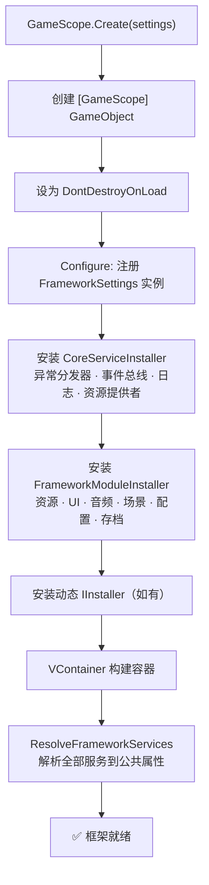

本页是 CFramework 的**完整上手指南**——从零开始搭建一个可运行的游戏项目，涵盖依赖安装、框架配置、游戏入口编写，直至第一个场景成功加载并打印出框架日志。跟随本页操作完成后，你将拥有一套完整可用的框架基础设施，为后续深入各功能模块做好准备。

Sources: [README.md](README.md#L1-L7), [package.json](package.json#L1-L30)

## 环境要求

在开始安装之前，请确认开发环境满足以下最低版本要求：

| 依赖项 | 最低版本 | 用途 |
|--------|---------|------|
| Unity | 2021.3+ | 引擎基础 |
| VContainer | 1.17.0+ | 依赖注入容器 |
| UniTask | 2.5.0+ | 高性能异步方案 |
| R3 | 1.3.0+ | 响应式扩展库 |
| Addressables | 1.21+ | 资源管理系统 |

| 可选依赖 | 版本 | 说明 |
|----------|------|------|
| Odin Inspector | 3.0+ | 增强 Inspector 与序列化；未安装时框架自动回退到内置编辑器实现 |

> **提示**：框架通过 `versionDefines` 自动检测 Odin Inspector 是否安装，无需手动配置脚本定义符号。检测逻辑由 `OdinDetector` 在编辑器启动时自动完成。

Sources: [README.md](README.md#L22-L32), [CFramework.Runtime.asmdef](Runtime/CFramework.Runtime.asmdef#L19-L24), [OdinDetector.cs](Editor/Utilities/OdinDetector.cs#L13-L63)

## 安装步骤

CFramework 以 Unity Package Manager (UPM) Git 包的形式分发。安装过程分为三步：先安装基础依赖，再安装 R3，最后安装框架本体。

### 第一步：添加基础依赖

打开项目根目录下的 `Packages/manifest.json`，在 `dependencies` 节点中添加 **VContainer**、**UniTask** 和 **NuGetForUnity**：

```json
{
  "dependencies": {
    "jp.hadashikick.vcontainer": "https://github.com/hadashiA/VContainer.git?path=VContainer/Assets/VContainer",
    "com.cysharp.unitask": "https://github.com/Cysharp/UniTask.git?path=src/UniTask/Assets/Plugins/UniTask",
    "com.glitchenzo.nugetforunity": "https://github.com/GlitchEnzo/NuGetForUnity.git?path=/src/NuGetForUnity"
  }
}
```

回到 Unity 编辑器，等待 UPM 解析并编译完成。

Sources: [README.md](README.md#L36-L47), [package.json](package.json#L17-L22)

### 第二步：安装 R3

NuGetForUnity 编译完成后，在 Unity 菜单栏中打开 **NuGet → Manage NuGet Packages**，搜索并安装 **R3**。这一步会将 R3 核心库及其 Unity 适配层安装到项目中。

Sources: [README.md](README.md#L47-L48)

### 第三步：安装 CFramework

继续编辑 `Packages/manifest.json`，在 `dependencies` 中追加 CFramework：

```json
{
  "dependencies": {
    "com.cnoom.cframework": "https://github.com/cnoom/C-Framework.git"
  }
}
```

Unity 编辑器会自动拉取并编译框架代码。编译完成后，菜单栏将出现 **CFramework** 菜单项，表示安装成功。

Sources: [README.md](README.md#L49-L56), [package.json](package.json#L2-L4)

### 安装验证清单

| 检查项 | 验证方式 |
|--------|---------|
| 菜单栏出现 `CFramework` 菜单 | 点击菜单栏查看 |
| 包管理器中可见 CFramework | `Window → Package Manager → Packages: In Project` |
| 控制台无编译错误 | 打开 Console 面板检查 |

Sources: [package.json](package.json#L2-L4)

## 项目目录结构约定

CFramework 遵循一套明确的目录约定。虽然框架本身安装在 `Packages/` 下，但你的游戏项目应按以下结构组织资源：

```
Assets/
├── Resources/
│   └── FrameworkSettings.asset      # 框架全局配置（可选，也可代码加载）
├── Scenes/
│   └── MainMenu.unity               # 初始场景
├── Scripts/
│   ├── GameEntry.cs                 # 游戏入口脚本
│   ├── Generated/                   # 自动生成的代码
│   ├── Config/                      # 配置表脚本
│   ├── Services/                    # 自定义服务
│   └── UI/                          # UI 面板脚本与绑定代码
├── Prefabs/
│   └── UIRoot.prefab                # UI 根节点预制体（Addressable）
└── Audio/                           # 音频资源
```

> **关键约定**：`UIRoot` 预制体需要标记为 Addressable，且地址键（Addressable Key）需与 `FrameworkSettings.UIRootAddress` 一致（默认为 `"UIRoot"`）。

Sources: [EditorPaths.cs](Editor/EditorPaths.cs#L17-L137), [FrameworkSettings.cs](Runtime/Core/FrameworkSettings.cs#L22-L23)

## 创建框架配置

`FrameworkSettings` 是一个 ScriptableObject 资产，集中管理框架所有模块的运行时参数。创建它有两种方式：

**方式一：通过菜单创建（推荐）**

在 Unity 编辑器中选择 `Assets → Create → CFramework → Framework Settings`，或点击菜单栏 `CFramework → CreateSettings`，在弹出的文件对话框中选择保存位置。

**方式二：通过代码自动加载**

如果不手动创建，`GameScope` 启动时会自动调用 `FrameworkSettings.LoadDefault()`，从 `Resources/FrameworkSettings` 路径加载。若该路径下不存在资产，框架将使用代码中的默认值并输出一条警告日志。

创建完成后，Inspector 面板中将显示以下配置分组：

| 配置分组 | 关键参数 | 默认值 | 说明 |
|----------|---------|--------|------|
| **Asset** | MemoryBudgetMB | 512 | 资源内存预算上限（MB） |
| | MaxLoadPerFrame | 5 | 每帧最大资源加载数量 |
| **UI** | MaxNavigationStack | 10 | UI 导航栈最大深度 |
| | UIRootAddress | "UIRoot" | UIRoot 预制体的 Addressable Key |
| **Audio** | AudioMixerRef | null | 音频混合器引用（null 时自动加载内置 AudioMixer） |
| | GroupSlotConfig | "Master_Music:2,Master_Effect:5" | 各分组预分配 Slot 数量 |
| **Save** | AutoSaveInterval | 60 | 自动保存间隔（秒） |
| | EncryptionKey | "CFramework" | 存档加密密钥 |
| **Log** | LogLevel | Debug | 日志输出级别 |
| **Config** | ConfigAddressPrefix | "Config" | 配置表 Addressable 地址前缀 |

> **新手建议**：初次使用时保持所有默认值即可，后续根据项目需求调整。如需了解每个参数的详细含义，参见 [FrameworkSettings 全局配置详解](3-frameworksettings-quan-ju-pei-zhi-xiang-jie)。

Sources: [FrameworkSettings.cs](Runtime/Core/FrameworkSettings.cs#L1-L64), [FrameworkSettingsEditor.cs](Editor/Inspectors/FrameworkSettingsEditor.cs#L20-L38)

## 编写游戏入口

`GameEntry` 是整个游戏的生命周期起点。它负责创建框架的全局作用域 `GameScope`，初始化核心服务，并加载第一个游戏场景。下面是完整的最小入口实现：

```csharp
using CFramework;
using Cysharp.Threading.Tasks;
using UnityEngine;

public sealed class GameEntry : MonoBehaviour
{
    [SerializeField] private FrameworkSettings settings;

    private async UniTaskVoid Start()
    {
        // 1. 创建全局作用域 —— 自动注册所有框架服务
        var scope = GameScope.Create(settings);
        var container = scope.Container;

        // 2. 注册全局异常处理器
        var exceptionDispatcher = container.Resolve<IExceptionDispatcher>();
        exceptionDispatcher.RegisterHandler(ex =>
        {
            Debug.LogError($"[全局异常] {ex.Message}");
        });

        // 3. 并行初始化配置服务与资源服务
        await UniTask.WhenAll(
            container.Resolve<IConfigService>().LoadAllAsync(),
            container.Resolve<IAssetService>().PreloadAsync(/* 预加载资源列表 */)
        );

        // 4. 加载初始场景
        var sceneService = container.Resolve<ISceneService>();
        await sceneService.LoadAsync("MainMenu");
    }
}
```

### 入口代码解析

**第 1 步**中，`GameScope.Create()` 执行了以下关键操作：



框架内置了两个安装器，按固定顺序执行：`CoreServiceInstaller` 注册底层基础服务，`FrameworkModuleInstaller` 注册上层功能模块。`CoreServiceInstaller` 负责注册四个核心接口——`IExceptionDispatcher`（全局异常分发）、`IEventBus`（事件总线）、`ILogger`（日志系统）和 `IAssetProvider`（资源加载提供者）；`FrameworkModuleInstaller` 则在此基础上注册六大功能模块服务。

**第 2 步**注册全局异常处理器，确保 UniTask 和 R3 中未捕获的异常都能被统一处理，不会静默丢失。

**第 3 步**并行初始化服务——如果你的项目暂不使用配置表，可以移除 `IConfigService` 的初始化调用。

**第 4 步**通过 `ISceneService` 加载场景。`SceneService` 内部会先播放淡入过渡动画（`FadeTransition`），然后卸载所有叠加场景，加载目标场景，最后播放淡出动画。

Sources: [GameScope.cs](Runtime/Core/DI/GameScope.cs#L77-L127), [CoreServiceInstaller.cs](Runtime/Core/DI/CoreServiceInstaller.cs#L10-L22), [FrameworkModuleInstaller.cs](Runtime/Core/DI/FrameworkModuleInstaller.cs#L10-L27), [SceneService.cs](Runtime/Scene/SceneService.cs#L34-L68)

## 搭建初始场景

完成入口脚本后，需要创建一个启动场景来挂载 `GameEntry`，以及一个目标场景作为实际游戏内容。

### 创建启动场景

1. 在 `Assets/Scenes/` 下创建场景 `Bootstrap.unity`
2. 创建空 GameObject，命名为 `GameEntry`
3. 将 `GameEntry` 脚本挂载到该 GameObject 上
4. 在 Inspector 中将 `FrameworkSettings` 资产拖入 `settings` 字段（若留空，框架会自动尝试从 `Resources/` 加载默认配置）
5. 打开 **Build Settings**（`File → Build Settings`），将 `Bootstrap` 场景添加到 **Scenes In Build** 列表的**第 0 位**

### 创建目标场景

1. 在 `Assets/Scenes/` 下创建场景 `MainMenu.unity`
2. 在场景中添加一个 Canvas 和简单文本（例如 "Main Menu"），用于验证场景加载成功
3. 将 `MainMenu` 场景也添加到 **Build Settings** 的场景列表中

### 场景配置总结

| 场景 | 用途 | Build Settings 位置 |
|------|------|---------------------|
| `Bootstrap` | 游戏入口，挂载 GameEntry | 第 0 位（启动场景） |
| `MainMenu` | 第一个游戏场景 | 第 1 位及之后 |

Sources: [SceneService.cs](Runtime/Scene/SceneService.cs#L34-L68), [FadeTransition.cs](Runtime/Scene/FadeTransition.cs#L1-L74)

## 运行与验证

按下 Unity 编辑器的 **Play** 按钮，观察以下关键指标确认框架运行正常：

| 验证步骤 | 预期结果 |
|----------|---------|
| 控制台日志 | 无红色错误，可能出现 `[CFramework]` 前缀的初始化日志 |
| Hierarchy 面板 | 出现 `[GameScope]` GameObject（DontDestroyOnLoad） |
| 场景切换 | 编辑器从 Bootstrap 自动切换到 MainMenu |
| 过渡动画 | 屏幕短暂黑屏淡入淡出（FadeTransition 默认 0.5 秒） |

如果控制台出现 `[CFramework] FrameworkSettings not found at Resources/FrameworkSettings, using default values.` 警告，说明 `FrameworkSettings` 资产未放在 `Resources/` 目录下且 `GameEntry` 的 `settings` 字段未赋值。这不影响运行（框架会使用默认值），但建议创建配置资产以便后续调整参数。

Sources: [FrameworkSettings.cs](Runtime/Core/FrameworkSettings.cs#L51-L62), [GameScope.cs](Runtime/Core/DI/GameScope.cs#L37-L55)

## 常见问题排查

| 问题 | 可能原因 | 解决方案 |
|------|---------|---------|
| 编译错误：找不到 `VContainer` | VContainer 未正确安装 | 检查 `manifest.json` 中 VContainer 的 Git URL 是否正确 |
| 编译错误：找不到 `Cysharp.Threading.Tasks` | UniTask 未安装 | 检查 UniTask 的 Git URL，确保路径包含 `UniTask/Assets/Plugins/UniTask` |
| 编译错误：找不到 `R3` | R3 未通过 NuGetForUnity 安装 | 打开 NuGet 窗口搜索并安装 R3 |
| 运行时 `Scene 'MainMenu' couldn't be loaded` | 场景未添加到 Build Settings | 打开 `File → Build Settings`，将目标场景添加到列表 |
| 运行时 `Addressables` 相关错误 | UIRoot 预制体未标记为 Addressable | 将 UIRoot 预制体标记为 Addressable，地址设为 `"UIRoot"` |
| `GameScope` 重复实例 | 场景中手动放置了多个 GameScope | 使用 `GameScope.Create()` 代码创建即可，不要手动添加组件 |

Sources: [package.json](package.json#L17-L22), [SceneService.cs](Runtime/Scene/SceneService.cs#L34-L68)

## 下一步

安装完成、场景成功运行后，你已经搭建了框架的核心骨架。以下是建议的阅读路线：

1. **[FrameworkSettings 全局配置详解](3-frameworksettings-quan-ju-pei-zhi-xiang-jie)** — 深入理解每一项配置参数的作用与调优策略
2. **[游戏入口与生命周期：GameScope 创建与服务初始化流程](4-you-xi-ru-kou-yu-sheng-ming-zhou-qi-gamescope-chuang-jian-yu-fu-wu-chu-shi-hua-liu-cheng)** — 掌握 DI 容器构建、服务解析与动态安装器的完整生命周期
3. **[依赖注入体系：GameScope、SceneScope 与动态安装器机制](5-yi-lai-zhu-ru-ti-xi-gamescope-scenescope-yu-dong-tai-an-zhuang-qi-ji-zhi)** — 理解框架的服务注册架构，学习如何注册自定义服务

如果你更倾向于"边做边学"，可以直接跳转到具体的功能模块文档，例如 **[UI 面板系统](12-ui-mian-ban-xi-tong-iui-sheng-ming-zhou-qi-uibinder-zu-jian-zhu-ru-yu-dao-hang-zhan-guan-li)** 或 **[音频系统](14-yin-pin-xi-tong-shuang-yin-gui-bgm-jiao-cha-dan-ru-dan-chu-yu-fen-zu-yin-liang-kong-zhi)**。