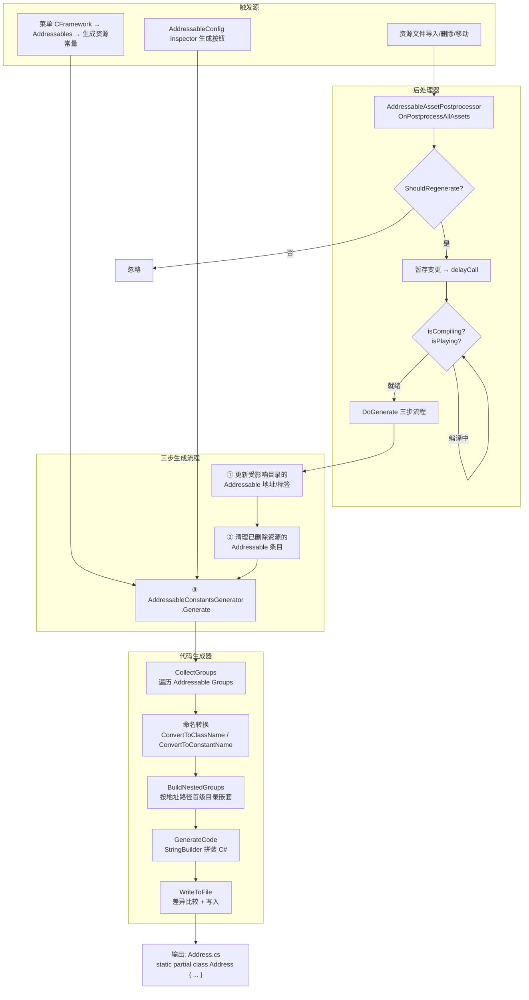
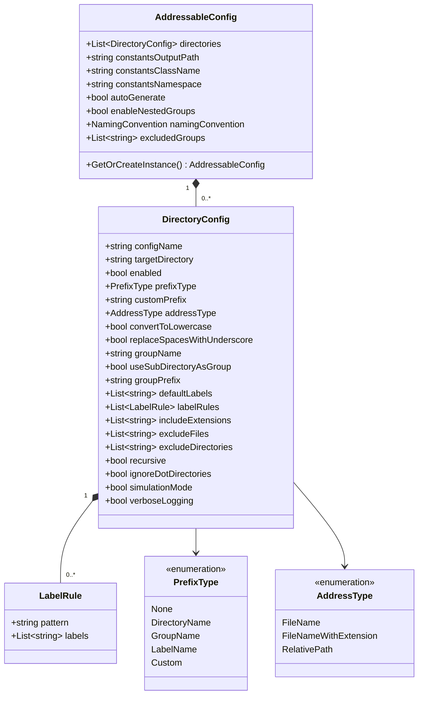
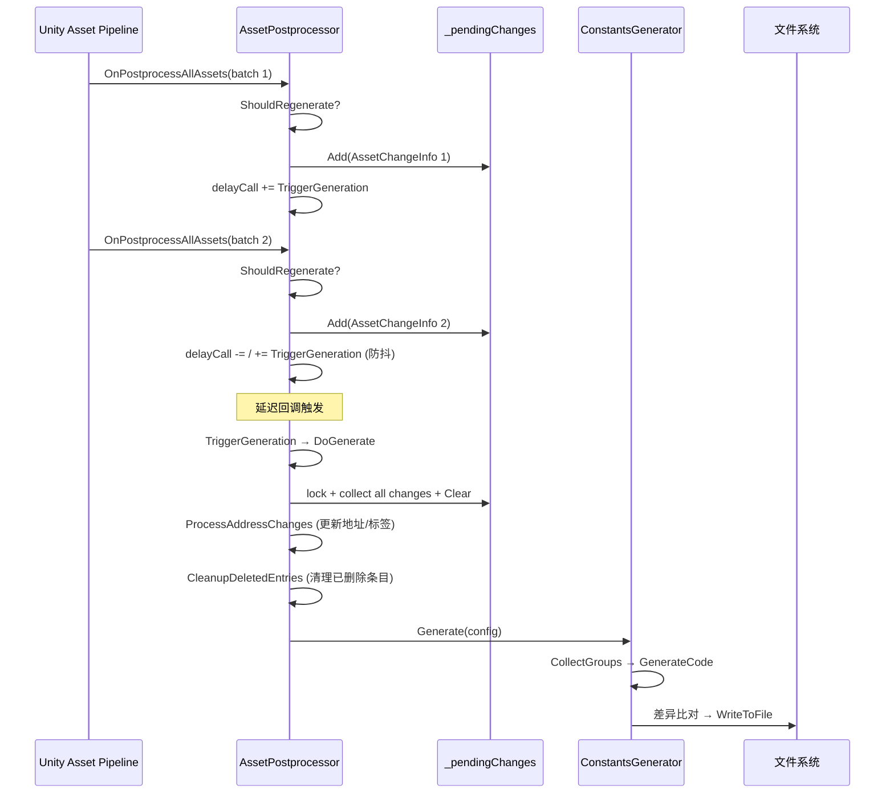

CFramework 的 Addressable 工具链由三大组件构成：**AddressableConstantsGenerator**（常量代码生成器）、**AddressableAssetPostprocessor**（资源变更后处理器）和 **AddressableConfig**（全局配置资产）。它们协同工作，实现了从"资源目录监控 → 地址自动分配 → 类型安全常量代码生成"的完整闭环，彻底消除了 Addressables 字符串硬编码带来的运行时风险。本文面向高级开发者，深入剖析其架构设计、数据流、命名转换算法与自动化机制。

Sources: [AddressableConstantsGenerator.cs](Editor/Generators/AddressableConstantsGenerator.cs#L1-L561), [AddressableAssetPostprocessor.cs](Editor/Utilities/AddressableAssetPostprocessor.cs#L1-L400), [AddressableConfig.cs](Editor/Configs/AddressableConfig.cs#L1-L744)

---

## 系统架构总览

在理解各组件之前，需要先建立对整体数据流的认知。以下 Mermaid 图展示了从资源文件变动到生成可编译 C# 常量类的完整管道：



**核心设计原则**：整个管道是**幂等的**——无论触发多少次，只要 Addressable Groups 的状态不变，生成的代码内容就不变。生成器在写入前会比对文件内容，仅在存在差异时才执行磁盘写入和 `AssetDatabase.Refresh`，从而避免不必要的域重载。

Sources: [AddressableConstantsGenerator.cs](Editor/Generators/AddressableConstantsGenerator.cs#L500-L524), [AddressableAssetPostprocessor.cs](Editor/Utilities/AddressableAssetPostprocessor.cs#L31-L211)

---

## AddressableConfig：全局配置模型

`AddressableConfig` 是一个 ScriptableObject，承载了整个工具链的所有配置参数。它采用**单例模式**通过 `GetOrCreateInstance()` 访问，默认存储路径由 `EditorPaths.AddressableConfig` 约定为 `Assets/EditorRes/Configs/AddressableConfig.asset`。

### 配置维度一览

| 配置分区 | 关键字段 | 类型 | 默认值 | 用途 |
|---|---|---|---|---|
| 常量生成设置 | `constantsOutputPath` | `string` | `Assets/Scripts/Generated` | 生成文件的输出目录 |
| | `constantsClassName` | `string` | `Address` | 生成的主类名 |
| | `constantsNamespace` | `string` | `CFramework` | 命名空间（留空则无） |
| | `autoGenerate` | `bool` | `true` | 资源变更时自动触发生成 |
| | `enableNestedGroups` | `bool` | `true` | 按地址路径首级目录创建嵌套类 |
| | `namingConvention` | `NamingConvention` | `PascalCase` | 常量名命名风格 |
| | `excludedGroups` | `List<string>` | `["Built In Data"]` | 不参与生成的分组 |

Sources: [AddressableConfig.cs](Editor/Configs/AddressableConfig.cs#L141-L196), [EditorPaths.cs](Editor/Editor/EditorPaths.cs#L52-L67)

### DirectoryConfig：目录级配置单元

`directories` 列表中的每个 `DirectoryConfig` 是一个独立的工作单元，定义了"如何将一个目标目录下的资源映射为 Addressable 资源"。其内部结构精密度极高：



**地址生成算法** `GenerateAddress()` 的组合逻辑如下：

| `prefixType` | 前缀来源 | `addressType` | 地址部分 | 组合结果 |
|---|---|---|---|---|
| `GroupName` | `config.groupName` | `FileName` | `hero_avatar` | `Characters/hero_avatar` |
| `DirectoryName` | 目标目录名 | `RelativePath` | `warriors/knight` | `Assets/warriors/knight` |
| `Custom` | `customPrefix` | `FileNameWithExtension` | `bgm_battle.wav` | `Audio/bgm_battle.wav` |
| `None` | 空 | `FileName` | `hero_avatar` | `hero_avatar` |

`DetermineGroup()` 的分组逻辑：当 `useSubDirectoryAsGroup = true` 时，取资源相对路径的第一个子目录名拼接 `groupPrefix`；否则统一使用 `groupName` 字段。

Sources: [AddressableConfig.cs](Editor/Configs/AddressableConfig.cs#L200-L371), [AddressableConfig.cs](Editor/Configs/AddressableConfig.cs#L598-L655)

### 过滤与标签规则

资源的匹配与过滤遵循多级判定链：`includeExtensions` 白名单 → `excludeFiles` 黑名单 → `excludeDirectories` 目录排除 → `ignoreDotDirectories` 隐藏目录过滤。标签系统支持**通配符模式匹配**，`LabelRule` 的 `pattern` 字段支持 `*`（任意序列）和精确匹配两种模式，在 `IsMatch()` 中实现前缀、后缀、包含、精确四级匹配策略。

Sources: [AddressableConfig.cs](Editor/Configs/AddressableConfig.cs#L540-L593), [AddressableConfig.cs](Editor/Configs/AddressableConfig.cs#L660-L700)

---

## AddressableConstantsGenerator：代码生成引擎

### 收集阶段：从 Groups 到数据模型

生成器的 `Generate()` 方法以 `AddressableAssetSettings` 为数据源，执行以下收集流程：

1. **分组过滤**：遍历 `settings.groups`，跳过 `excludedGroups` 中的分组和空分组
2. **条目收集**：对每个分组调用 `CollectGroupData()`，将 `AddressableAssetGroup.entries` 映射为 `EntryData`
3. **重复地址处理**：维护 `addressCountMap` 字典，对同分组内重复地址追加序号后缀（如 `HeroAsset_2`）
4. **排序**：分组按 `ClassName` 排序，条目按 `ConstantName` 排序，确保生成结果的确定性

Sources: [AddressableConstantsGenerator.cs](Editor/Generators/AddressableConstantsGenerator.cs#L45-L129)

### 命名转换算法

常量名的生成是整个代码生成器中最精密的部分。它由三级管线组成：

**第一级 — `ExtractNameFromAddress`**：从 Addressable 地址中提取名称核心。取 `Path.GetFileNameWithoutExtension()` 的结果；若为空则回退到路径最后一段。

**第二级 — `CleanName`**：清理非法字符，同时保留**单词边界语义**。字母和数字保留；分隔符类字符（`_`、空格、`-`、`/`、`\`、`.`）统一替换为空格以标记单词边界；其他字符忽略。连续分隔符压缩为单个空格。

**第三级 — `ApplyNamingConvention`**：按空格分词后应用四种命名规则：

| NamingConvention | 输入示例 | 输出结果 | 算法 |
|---|---|---|---|
| `PascalCase` | `hero avatar idle` | `HeroAvatarIdle` | 每词首字母大写，其余小写 |
| `CamelCase` | `hero avatar idle` | `heroAvatarIdle` | 首词全小写，后续词首字母大写 |
| `LowerCase` | `hero avatar idle` | `heroavataridle` | 所有字符小写拼接 |
| `Original` | `hero avatar idle` | `heroavataridle` | 直接拼接（去空格） |

**常量名特殊处理**：`ConvertToConstantName` 强制使用 `PascalCase`（忽略配置中的 `namingConvention`，该配置仅影响类名），并在结果以数字开头时自动添加 `_` 前缀以满足 C# 标识符规范。

Sources: [AddressableConstantsGenerator.cs](Editor/Generators/AddressableConstantsGenerator.cs#L357-L478)

### 嵌套分组机制

当 `enableNestedGroups = true` 时，生成器调用 `BuildNestedGroups()` 按地址路径的第一个 `/` 分割段进行嵌套归类。例如：

- 地址 `Audio/BGM/battle_theme` → 嵌套类 `Audio`
- 地址 `Audio/SFX/explosion` → 嵌套类 `Audio`
- 地址 `Characters/Hero/knight` → 嵌套类 `Characters`
- 无 `/` 的地址 → 归入 `_Root` 嵌套类

这确保了生成代码的结构与资源目录的语义层级对齐，在使用时获得 IDE 智能提示的分层导航体验。

Sources: [AddressableConstantsGenerator.cs](Editor/Generators/AddressableConstantsGenerator.cs#L237-L337)

### 生成代码示例

假设有一个 `Audio` 分组包含地址 `bgm/battle_theme` 和 `sfx/explosion`，配置为 `CFramework` 命名空间、`Address` 类名、启用嵌套分组，生成结果如下：

```csharp
// <auto-generated>
//    此代码由 CFramework AddressableConstantsGenerator 自动生成。
//    对此文件的更改可能导致错误的行为，并且会在重新生成时丢失。
// </auto-generated>

namespace CFramework
{
    /// <summary>
    /// Addressables 资源常量，按 Group 分组
    /// </summary>
    public static partial class Address
    {
        /// <summary>
        /// Group: Audio
        /// </summary>
        public static class Audio
        {
            /// <summary>
            /// Bgm
            /// </summary>
            public static class Bgm
            {
                public const string BattleTheme = "bgm/battle_theme";
            }

            /// <summary>
            /// Sfx
            /// </summary>
            public static class Sfx
            {
                public const string Explosion = "sfx/explosion";
            }
        }
    }
}
```

Sources: [AddressableConstantsGenerator.cs](Editor/Generators/AddressableConstantsGenerator.cs#L192-L354)

---

## AddressableAssetPostprocessor：自动化变更管道

### 触发判定逻辑

`AddressableAssetPostprocessor` 继承自 Unity 的 `AssetPostprocessor`，在 `OnPostprocessAllAssets` 回调中监听所有资源变动。但并非所有变动都应触发生成——`ShouldRegenerate()` 通过 `HasWatchedDirectoryChange()` 执行精确过滤：

**过滤层级（由粗到细）**：
1. 跳过 `.meta` 文件
2. 跳过非资源文件类型（`.cs`、`.csproj`、`.sln`、`.wlt`、`.tmp`）
3. 跳过 `Assets/AddressableAssetsData` 目录（Addressables 自身配置）
4. 跳过 `CFramework/` 目录（框架内部文件）
5. 仅当资源路径以某个**已启用的** `DirectoryConfig.targetDirectory` 为前缀时才返回 `true`

Sources: [AddressableAssetPostprocessor.cs](Editor/Utilities/AddressableAssetPostprocessor.cs#L57-L128)

### 延迟处理与防抖机制

后处理器面临的核心挑战是 Unity 在批量导入资源时会**连续多次**触发 `OnPostprocessAllAssets`。解决方案是经典的**延迟合并**模式：

1. 每次回调将变更信息 `AssetChangeInfo` 暂存入 `_pendingChanges` 列表（带 `lock` 线程安全）
2. 通过 `EditorApplication.delayCall -= TriggerGeneration; EditorApplication.delayCall += TriggerGeneration;` 实现**防抖**——只有最后一次回调生效
3. `TriggerGeneration()` 检查编译/播放状态，若正在编译则注册 `WaitForCompilation()` 轮询等待

Sources: [AddressableAssetPostprocessor.cs](Editor/Utilities/AddressableAssetPostprocessor.cs#L31-L155)

### 三步生成流程

`DoGenerate()` 方法是后处理器的核心，执行严格有序的三步操作：

**① ProcessAddressChanges** — 仅处理受影响的目录配置（`FindAffectedDirectoryConfigs` 通过路径前缀匹配定位），对其下资源重新扫描并更新 Addressable 地址、分组、标签。关键优化：使用 `AssetDatabase.StartAssetEditing() / StopAssetEditing()` 包裹批量操作，避免逐资源刷新。

**② CleanupDeletedEntries** — 遍历所有已删除资源路径，通过 GUID 查找对应的 Addressable 条目并从分组中移除。仅处理受监控目录下的删除事件。

**③ AddressableConstantsGenerator.Generate** — 调用代码生成器完成最终输出。



Sources: [AddressableAssetPostprocessor.cs](Editor/Utilities/AddressableAssetPostprocessor.cs#L157-L368)

---

## 配置预览窗口

`AddressableConfigPreviewWindow` 提供了配置应用前的安全预览能力。它采用条件编译实现 **Odin Inspector 优先、标准 EditorWindow 兜底**的双模式设计：

- `#if ODIN_INSPECTOR`：继承 `OdinEditorWindow`，获得更优的渲染效果
- `#else`：继承标准 `EditorWindow`，不依赖任何第三方插件

两种实现共享相同的 API 接口 `ShowWindow(string content)`，由调用方 `AddressableConfig.PreviewAllConfigs()` 或 `DirectoryConfig.PreviewButton()` 统一调用。预览内容包括：目标目录、匹配资源数量、每个资源的地址/分组/标签映射、分组统计和标签统计，最多展示前 10 条资源的详细映射信息。

Sources: [AddressableConfigPreviewWindow.cs](Editor/Windows/Addressable/AddressableConfigPreviewWindow.cs#L1-L117), [AddressableConfig.cs](Editor/Configs/AddressableConfig.cs#L63-L89), [AddressableConfig.cs](Editor/Configs/AddressableConfig.cs#L427-L480)

---

## 触发生成的三种方式

| 方式 | 入口 | 适用场景 |
|---|---|---|
| **菜单手动触发** | `CFramework → Addressables → 生成资源常量` | 首次使用、手动刷新、CI 流程 |
| **Inspector 按钮** | `AddressableConfig` → 常量生成设置 → 生成资源常量 | 调试配置、选择性生成 |
| **自动触发** | 资源导入/删除/移动 → `AssetPostprocessor` | 日常开发、自动化维护 |

手动触发和 Inspector 按钮直接调用 `AddressableConstantsGenerator.Generate()`，跳过后处理器的地址更新和清理步骤。自动触发则完整执行三步流程。

Sources: [AddressableConstantsGenerator.cs](Editor/Generators/AddressableConstantsGenerator.cs#L34-L39), [AddressableConfig.cs](Editor/Configs/AddressableConfig.cs#L174-L179), [AddressableAssetPostprocessor.cs](Editor/Utilities/AddressableAssetPostprocessor.cs#L161-L211)

---

## 路径约定体系

`EditorPaths` 静态类集中管理所有编辑器路径常量，确保路径一致性：

| 常量 | 值 | 用途 |
|---|---|---|
| `EditorConfigs` | `Assets/EditorRes/Configs` | 配置资产存储目录 |
| `AddressableConfig` | `Assets/EditorRes/Configs/AddressableConfig.asset` | 默认配置资产路径 |
| `AddressableConstantsOutput` | `Assets/Scripts/Generated` | 常量代码输出目录 |
| `GeneratedRoot` | `Assets/Scripts/Generated` | 代码生成根目录 |

`EnsureDirectoryExists()` 工具方法在创建配置资产和写入生成代码时被广泛调用，保证目录结构始终有效。

Sources: [EditorPaths.cs](Editor/Editor/EditorPaths.cs#L1-L177)

---

## 设计决策与扩展考量

**声明为 `partial class`**：生成的 `Address` 类标记为 `static partial`，允许开发者在不修改生成代码的前提下添加扩展方法或自定义逻辑。

**幂等写入策略**：`WriteToFile()` 在文件已存在时先读取全文比对，内容一致则跳过写入和 `AssetDatabase.Refresh()`。这一设计对大型项目至关重要——避免每次资源导入都触发不必要的脚本编译。

**模拟模式**：`DirectoryConfig.simulationMode` 默认为 `true`，新创建的配置处于安全状态，必须显式关闭后才能实际修改资源的 Addressable 设置。这防止了开发者在不了解规则时意外批量修改资源元数据。

**与运行时的关系**：生成的常量类可直接配合 [资源管理服务：Addressables 封装、引用计数与生命周期绑定](10-zi-yuan-guan-li-fu-wu-addressables-feng-zhuang-yin-yong-ji-shu-yu-sheng-ming-zhou-qi-bang-ding) 和 [AssetHandle 资源句柄：加载、实例化、内存预算与分帧预加载](11-assethandle-zi-yuan-ju-bing-jia-zai-shi-li-hua-nei-cun-yu-suan-yu-fen-zheng-yu-jia-zai) 使用，将字符串硬编码替换为编译期可验证的常量引用。若需了解更上层的编辑器窗口体系，参见 [编辑器窗口一览：配置创建器、异常查看器与调试工具](19-bian-ji-qi-chuang-kou-lan-pei-zhi-chuang-jian-qi-yi-chang-cha-kan-qi-yu-diao-shi-gong-ju)。