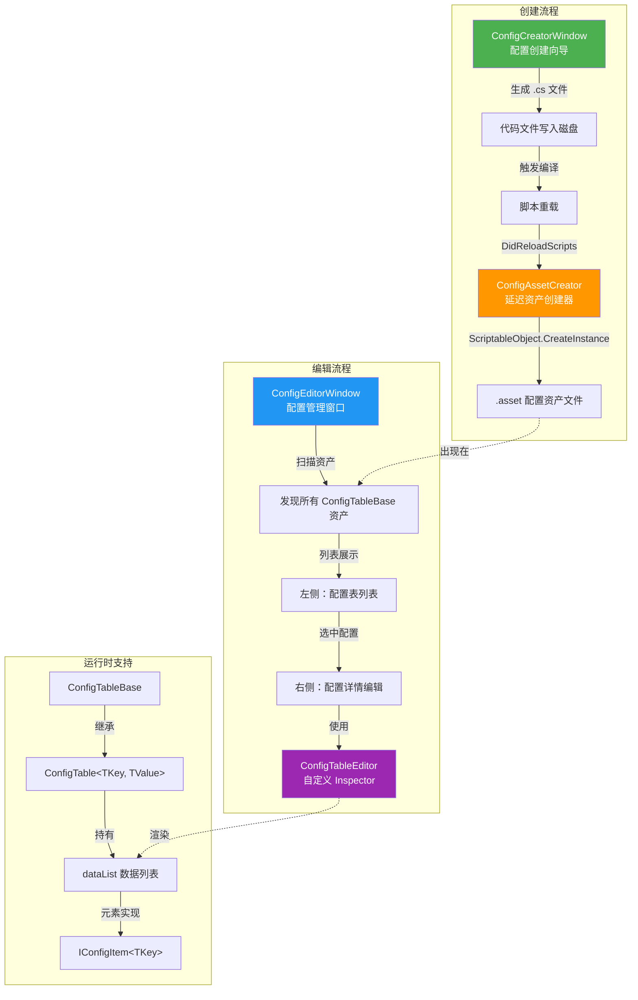
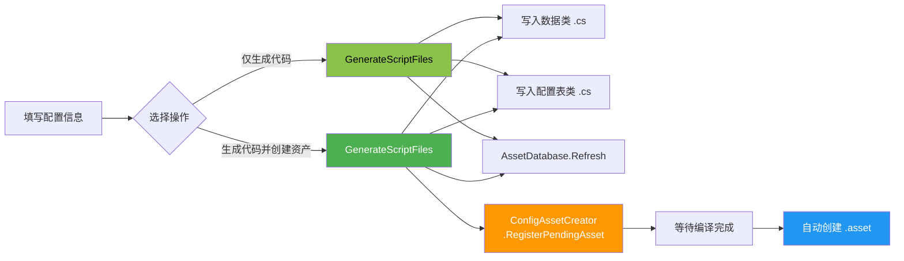

CFramework 为配置表系统提供了一套完整的编辑器工具链，涵盖从 Inspector 增强显示、集中式配置管理窗口，到可视化的配置创建向导与延迟资产创建机制。这套工具链在架构上遵循**双轨实现模式**——针对安装了 Odin Inspector 的项目提供增强体验，同时确保无 Odin 环境下的完整可用性。本文将逐一剖析每个组件的设计意图、工作原理与使用方法。

Sources: [ConfigTableEditor.cs](Editor/Inspectors/ConfigTableEditor.cs#L1-L67), [ConfigEditorWindow.cs](Editor/Windows/Config/ConfigEditorWindow.cs#L1-L259), [ConfigCreatorWindow.cs](Editor/Windows/Config/ConfigCreatorWindow.cs#L1-L522), [ConfigAssetCreator.cs](Editor/Utilities/ConfigAssetCreator.cs#L1-L218)

## 整体架构概览

在深入每个组件之前，先理解整个编辑器工具链的协作关系有助于建立全局认知。下图展示了从"创建配置表"到"编辑配置数据"的完整工作流以及各组件之间的交互：



Sources: [ConfigTableBase.cs](Runtime/Config/ConfigTableBase.cs#L1-L25), [ConfigTable.cs](Runtime/Config/ConfigTable.cs#L1-L101), [IConfigItem.cs](Runtime/Config/IConfigItem.cs#L1-L15)

## Odin 双轨实现机制

整个编辑器工具链最核心的架构决策是 **Odin Inspector 的条件编译双轨制**。这一机制通过 `ODIN_INSPECTOR` 预处理符号，在同一组类名下提供两套并行的实现：

| 维度 | Odin 版本 (`#if ODIN_INSPECTOR`) | 默认版本 (`#else`) |
|------|-----------------------------------|---------------------|
| **ConfigTableEditor** | 继承 `OdinEditor`，直接使用 Odin 的 Inspector 渲染管线 | 继承 `UnityEditor.Editor`，手动绘制信息头 + 默认属性 |
| **ConfigEditorWindow** | 继承 `OdinEditorWindow`，利用 Odin 的属性树 (`PropertyTree`) 进行配置编辑 | 继承 `EditorWindow`，使用 `ReorderableList` 进行列表编辑 |
| **ConfigCreatorWindow** | 继承 `OdinEditorWindow`，大量使用 Odin 属性标注实现表单式 UI | 继承 `EditorWindow`，纯 `EditorGUILayout` 手动布局 |
| **序列化** | 使用 `[OdinSerialize]`，支持更丰富的类型序列化 | 使用 `[SerializeField]`，依赖 Unity 原生序列化 |

这套双轨制的自动切换由 [OdinDetector](Editor/Utilities/OdinDetector.cs) 完成——它在编辑器加载时检测 `Sirenix.OdinInspector.Attributes` 程序集是否存在，并自动在 PlayerSettings 中添加或移除 `ODIN_INSPECTOR` 脚本定义符号。对于未安装 Odin 的项目，[OdinStubs.cs](Runtime/OdinStubs/OdinStubs.cs#L1-L225) 提供了所有用到的 Odin 类型和特性的空壳实现（如 `SerializedScriptableObject`、`TableListAttribute` 等），确保代码在任何环境下均可编译通过。

Sources: [OdinDetector.cs](Editor/Utilities/OdinDetector.cs#L1-L67), [OdinStubs.cs](Runtime/OdinStubs/OdinStubs.cs#L1-L225), [ConfigTable.cs](Runtime/Config/ConfigTable.cs#L17-L26)

## ConfigTableEditor — 自定义 Inspector

**ConfigTableEditor** 是所有 `ConfigTableBase` 子类在 Inspector 面板中的自定义渲染器，通过 `[CustomEditor(typeof(ConfigTableBase), true)]` 注册，第二个参数 `true` 表示该编辑器同时应用于所有派生类。

### Odin 版本的行为

在 Odin Inspector 已安装的环境下，`ConfigTableEditor` 继承自 `OdinEditor`，直接委托给 Odin 的渲染管线处理所有属性的绘制。这意味着 `ConfigTable<TKey, TValue>` 上标注的 `[TableList]`、`[Searchable]` 等 Odin 特性将完整生效，提供表格化的数据编辑、内置搜索过滤等高级交互体验。

Sources: [ConfigTableEditor.cs](Editor/Inspectors/ConfigTableEditor.cs#L1-L16), [ConfigTable.cs](Runtime/Config/ConfigTable.cs#L17-L26)

### 默认版本的行为

无 Odin 时，编辑器会手动构建一个增强的 Inspector 界面，包含以下层次：

1. **信息头区域**：水平布局中显示配置表类型名（粗体）和记录数量（迷你字体），例如 `ItemConfig` 右侧显示 `42 条记录`
2. **分割线**：一条 1px 高的深灰色分隔线，视觉上将信息头与数据区隔开
3. **数据属性区**：通过 `DrawPropertiesExcluding(serializedObject, "m_Script")` 渲染所有序列化属性（排除脚本引用字段），确保 `dataList` 列表以 Unity 原生的列表编辑器呈现

Sources: [ConfigTableEditor.cs](Editor/Inspectors/ConfigTableEditor.cs#L27-L65)

## ConfigEditorWindow — 配置管理窗口

**ConfigEditorWindow** 是一个集中式的配置资产管理窗口，通过菜单 `CFramework > 配置管理` 打开。它将项目中所有继承自 `ConfigTableBase` 的 ScriptableObject 资产聚合到一个统一的界面中进行浏览和编辑，无需在 Project 窗口中逐个定位 `.asset` 文件。

### 窗口布局

窗口采用经典的**左右分栏布局**：

- **左侧面板**（约 25% 宽度）：配置表列表，显示每个配置表的名称、基类类型和数据条数
- **右侧面板**（约 75% 宽度）：选中配置表的详情编辑区域

顶部工具栏提供「新建配置」和「刷新」两个操作按钮，右侧显示配置表总数统计。

### 配置发现机制

`RefreshConfigList()` 方法通过 `AssetDatabase.FindAssets("t:ScriptableObject")` 扫描项目中所有 ScriptableObject 资产，然后逐个检查是否为 `ConfigTableBase` 的实例。对于每个匹配的资产，提取其类型名、基类名、数据条数和资产路径，构建 `ConfigInfo` 信息对象加入列表。

Sources: [ConfigEditorWindow.cs](Editor/Windows/Config/ConfigEditorWindow.cs#L139-L169), [ConfigEditorWindowDefault.cs](Editor/Windows/Config/ConfigEditorWindowDefault.cs#L437-L468)

### 默认版本中的 ReorderableList 编辑

在没有 Odin 的环境中，右侧面板使用 Unity 内置的 `ReorderableList` 来编辑选中配置表的 `dataList` 属性。其实现包含以下关键设计：

- **自适应布局策略**：当字段数 ≤ 4 时，采用水平排列（等宽分配）；字段数 > 4 时切换为垂直排列
- **动态行高计算**：通过 `elementHeightCallback` 遍历每个元素的所有可见子属性，取最大高度作为行高
- **脏标记管理**：在添加、删除、修改列表元素时均调用 `EditorUtility.SetDirty()`，确保变更被持久化

Sources: [ConfigEditorWindowDefault.cs](Editor/Windows/Config/ConfigEditorWindowDefault.cs#L296-L369)

### Odin 版本中的属性树编辑

在 Odin 环境中，选中配置表后会创建一个 `PropertyTree` 对象，利用 Odin 的属性树系统直接在右侧面板中渲染完整的配置编辑界面。这种方式自动继承了 Odin 的 `[TableList]` 表格视图、`[Searchable]` 搜索功能等高级特性。

Sources: [ConfigEditorWindow.cs](Editor/Windows/Config/ConfigEditorWindow.cs#L171-L199)

## ConfigCreatorWindow — 配置创建向导

**ConfigCreatorWindow** 是一个可视化的配置表代码生成器，通过菜单 `CFramework > 创建配置表` 打开。它引导开发者以填表的方式定义配置表结构，自动生成数据类和配置表类的 C# 代码文件，并可选地创建对应的 `.asset` 资产文件。

### 配置项详解

创建向导的配置项分为以下几组：

| 配置组 | 字段 | 说明 | 默认值 |
|--------|------|------|--------|
| **基础配置** | 配置表名称 | 生成的类名，如 `ItemConfig` | `NewConfig` |
| **配置表设置** | 命名空间 | 配置表类的命名空间 | `Game.Configs` |
| | 输出目录 | 配置表 .cs 文件存放路径 | `Assets/Scripts/Config` |
| **数据类设置** | 命名空间 | 数据类的命名空间 | `Game.Configs` |
| | 输出目录 | 数据类 .cs 文件存放路径 | `Assets/Scripts/Config` |
| **类型配置** | 键类型 | 主键的数据类型 | `int` |
| | 值类型名称 | 数据类的类名，如 `ItemData` | 自动推导 |
| **资源设置** | 资源输出目录 | .asset 文件存放路径 | `Assets/EditorRes/Configs` |
| | 打开生成的脚本 | 是否在生成后自动打开代码文件 | `true` |
| | 自动创建资产 | 是否在编译后自动创建 .asset | `true` |

其中**值类型名称**会随配置表名称自动推导——当配置表名称以 `Config` 结尾时（如 `ItemConfig`），值类型名称自动设为 `ItemData`。

Sources: [ConfigCreatorWindow.cs](Editor/Windows/Config/ConfigCreatorWindow.cs#L33-L71), [ConfigCreatorWindowDefault.cs](Editor/Windows/Config/ConfigCreatorWindowDefault.cs#L30-L46), [EditorPaths.cs](Editor/EditorPaths.cs#L42-L86)

### 字段定义与键类型

向导支持的字段类型涵盖了 Unity 游戏开发中常用的数据类型：

**键类型选项**：`int`、`string`、`long`、`byte`、`short`、`uint`、`ulong`、`ushort`

**值字段类型选项**：`int`、`float`、`string`、`bool`、`long`、`double`、`Vector2`、`Vector3`、`Vector4`、`Color`、`GameObject`、`Transform`、`Sprite`、`Texture`、`AudioClip`

每个字段可以标记为**主键**（`isKeyField`），该字段将被映射为 `IConfigItem<TKey>.Key` 属性的实现。如果不手动标记任何主键字段，系统默认将第一个字段作为主键。

Sources: [ConfigCreatorWindow.cs](Editor/Windows/Config/ConfigCreatorWindow.cs#L122-L189), [ConfigCreatorWindowDefault.cs](Editor/Windows/Config/ConfigCreatorWindowDefault.cs#L51-L61)

### 代码生成流程

向导的代码生成过程分为两个阶段：



**阶段一：代码文件生成**。`GenerateScriptFiles()` 方法在磁盘上写入两个 C# 文件：

- **数据类文件**（如 `ItemData.cs`）：包含一个 `sealed class`，实现 `IConfigItem<TKey>` 接口，声明所有配置字段，提供 `Key` 属性和 `Clone()` 方法
- **配置表类文件**（如 `ItemConfig.cs`）：包含一个 `sealed class`，继承 `ConfigTable<TKey, TValue>`，附带 `[CreateAssetMenu]` 特性以支持手动创建

Sources: [ConfigCreatorWindow.cs](Editor/Windows/Config/ConfigCreatorWindow.cs#L302-L468)

**阶段二：资产延迟创建**（仅在"自动创建资产"开启时）。代码生成后，向导调用 `ConfigAssetCreator.RegisterPendingAsset()` 将待创建的资产信息（类名、命名空间、输出路径）序列化为 JSON 存储到 `EditorPrefs`。随后 `AssetDatabase.Refresh()` 触发 Unity 编译。编译完成后，`[DidReloadScripts]` 回调触发 `ConfigAssetCreator` 读取待处理队列，通过反射查找新生成的配置表类型，调用 `ScriptableObject.CreateInstance()` 创建资产实例并写入磁盘。

Sources: [ConfigAssetCreator.cs](Editor/Utilities/ConfigAssetCreator.cs#L36-L167)

### 代码预览

向导在界面底部提供实时代码预览，展示即将生成的配置表类和数据类代码。这允许开发者在正式生成前确认代码结构是否符合预期。

以下是典型的生成结果示例。假设配置表名称为 `ItemConfig`，键类型为 `int`，字段包含 `id`（主键）、`name`、`price`：

**生成的数据类**：

```csharp
using System;
using CFramework;
using UnityEngine;

namespace Game.Configs
{
    [Serializable]
    public sealed class ItemData : IConfigItem<int>
    {
        public int id = 0;
        public string name = "";
        public int price = 0;

        public int Key => id;

        public ItemData Clone()
        {
            return new ItemData
            {
                id = id,
                name = name,
                price = price
            };
        }
    }
}
```

**生成的配置表类**：

```csharp
using CFramework;
using UnityEngine;

namespace Game.Configs
{
    [CreateAssetMenu(fileName = "ItemConfig", menuName = "Game/Config/ItemConfig")]
    public sealed class ItemConfig : ConfigTable<int, ItemData>
    {
        // 数据在 Inspector 中配置
    }
}
```

Sources: [ConfigCreatorWindow.cs](Editor/Windows/Config/ConfigCreatorWindow.cs#L336-L468)

### 偏好设置持久化

向导中的所有配置项（命名空间、输出路径、键类型等）通过 `EditorPrefs` 在窗口关闭时自动保存、打开时自动恢复。每个配置项对应一个独立的偏好键，如 `CFramework.ConfigCreator.ConfigNamespace`、`CFramework.ConfigCreator.AssetOutputPath` 等。这意味着开发者的配置习惯会在多次打开向导之间保持一致。

Sources: [ConfigCreatorWindow.cs](Editor/Windows/Config/ConfigCreatorWindow.cs#L75-L118), [ConfigCreatorWindowDefault.cs](Editor/Windows/Config/ConfigCreatorWindowDefault.cs#L65-L106)

## ConfigAssetCreator — 延迟资产创建器

**ConfigAssetCreator** 是一个静态工具类，解决了一个关键的时序问题：代码生成器在生成 `.cs` 文件后无法立即实例化对应的 `ScriptableObject`，因为新类型尚需编译才能被运行时识别。

### 工作机制

其核心设计采用**队列 + 回调**模式：

1. **注册阶段**：向导调用 `RegisterPendingAsset()` 将资产信息（`configName`、`configNamespace`、`outputPath`）添加到待处理队列，队列以 JSON 格式存储在 `EditorPrefs` 中
2. **等待编译**：`AssetDatabase.Refresh()` 触发 Unity 重新编译
3. **处理阶段**：`[DidReloadScripts]` 回调在编译完成后触发 `ProcessPendingAssets()`，清空队列并逐一处理
4. **类型查找**：`FindConfigType()` 通过反射在所有已加载程序集中搜索目标类型，优先尝试带命名空间的完整名称，其次尝试不带命名空间的类型名
5. **资产创建**：检查目标路径下是否已存在同名资产（避免覆盖），然后调用 `ScriptableObject.CreateInstance()` + `AssetDatabase.CreateAsset()` 完成创建

Sources: [ConfigAssetCreator.cs](Editor/Utilities/ConfigAssetCreator.cs#L1-L218)

### 错误处理与回退

当类型查找失败时（例如命名空间配置错误或脚本存在编译错误），创建器会：

- 在 Console 中输出详细的警告日志，包含可能的原因分析
- 弹出对话框告知用户手动创建资产的路径（`Assets/Create/Game/Config/{ConfigName}`）
- 由于待处理队列已清空，不会反复尝试创建失败的资产

Sources: [ConfigAssetCreator.cs](Editor/Utilities/ConfigAssetCreator.cs#L104-L167)

## 使用指南：从创建到编辑的完整流程

### 创建一个新配置表

1. 打开菜单 `CFramework > 创建配置表`，启动 ConfigCreatorWindow
2. 填写**配置表名称**（如 `WeaponConfig`），值类型名称会自动推导为 `WeaponData`
3. 根据需要调整命名空间和输出目录
4. 配置**字段列表**：添加字段、选择类型、标记主键字段、添加描述
5. 在代码预览区确认生成结果
6. 点击「生成代码」或「仅生成代码」
7. 如果选择了自动创建资产，等待编译完成后资产将自动出现在 `Assets/EditorRes/Configs/` 目录下

### 在配置管理窗口中编辑数据

1. 打开菜单 `CFramework > 配置管理`，启动 ConfigEditorWindow
2. 在左侧配置表列表中点击目标配置表
3. 在右侧详情面板中添加、编辑或删除数据条目
4. 所有修改会自动标记资产为 Dirty，在保存项目时持久化

### 在 Inspector 中直接编辑

也可以在 Project 窗口中双击任意 `.asset` 配置资产文件，Inspector 面板将使用 ConfigTableEditor 渲染增强的编辑界面。在 Odin 环境下，数据将以表格形式呈现，支持内联搜索和排序。

Sources: [ConfigEditorWindow.cs](Editor/Windows/Config/ConfigEditorWindow.cs#L19-L25), [ConfigCreatorWindow.cs](Editor/Windows/Config/ConfigCreatorWindow.cs#L19-L27), [EditorPaths.cs](Editor/EditorPaths.cs#L42-L43)

## 扩展建议

当你理解了这套编辑器工具链后，以下阅读路径将帮助你进一步深入：

- 了解配置表系统的运行时数据结构与查询 API，参阅 [配置表系统：ScriptableObject 数据源、泛型 ConfigTable 与热重载](16-pei-zhi-biao-xi-tong-scriptableobject-shu-ju-yuan-fan-xing-configtable-yu-re-zhong-zai)
- 了解其他编辑器窗口与调试工具，参阅 [编辑器窗口一览：配置创建器、异常查看器与调试工具](19-bian-ji-qi-chuang-kou-lan-pei-zhi-chuang-jian-qi-yi-chang-cha-kan-qi-yu-diao-shi-gong-ju)
- 如需为配置表添加自定义的运行时处理逻辑，参阅 [框架扩展指南：自定义 IInstaller、IAssetProvider 与 ISceneTransition](23-kuang-jia-kuo-zhan-zhi-nan-zi-ding-yi-iinstaller-iassetprovider-yu-iscenetransition)