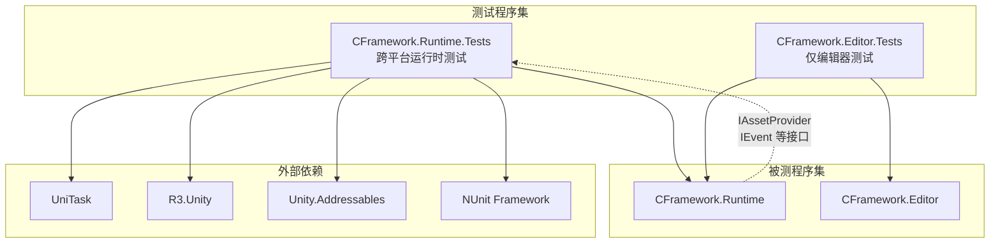
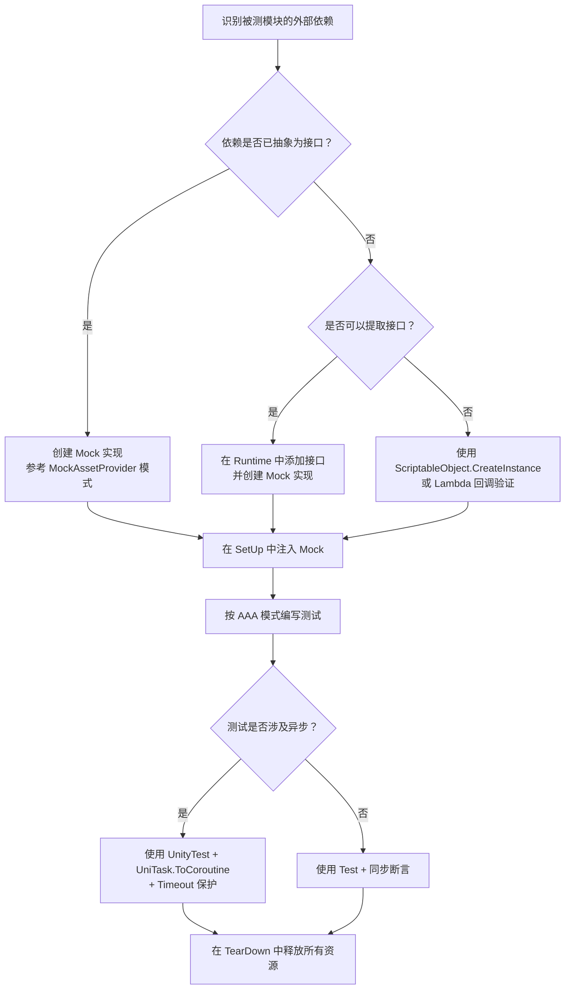

CFramework 的测试体系围绕**接口抽象**与**依赖注入**两大架构支柱构建，使每个功能模块都可以在隔离环境中被验证。本文档将系统性地阐述框架的测试组织结构、测试命名与编写规范、Mock 替换模式以及各模块的覆盖策略，帮助你理解现有测试的设计意图，并为编写新的框架测试建立一致的实践基准。

Sources: [CFramework.Runtime.Tests.asmdef](Tests/CFramework.Runtime.Tests.asmdef#L1-L30), [CFramework.Editor.Tests.asmdef](Tests/Editor/CFramework.Editor.Tests.asmdef#L1-L22)

## 测试体系架构：双程序集隔离模型

CFramework 的测试代码分布在两个独立的 Assembly Definition 中，形成 **Runtime 测试** 与 **Editor 测试** 的双层隔离模型。这种分离不是随意为之——它精确映射了 Unity 的运行时/编辑器二分法，确保运行时测试在所有目标平台可执行，而编辑器测试仅在 Editor 环境运行。



**Runtime 测试程序集**（`CFramework.Runtime.Tests`）覆盖所有运行时模块——Asset、Audio、Config、Core、Log、Save、Scene、State 和 UI。它通过 `includePlatforms: []`（空数组）声明自己可在任意平台执行，同时依赖 UniTask、R3、Addressables 等运行时库以支持异步测试场景。

**Editor 测试程序集**（`CFramework.Editor.Tests`）通过 `includePlatforms: ["Editor"]` 限定自身仅在编辑器环境运行，覆盖 FrameworkSettings 等编辑器配置对象的验证。两个程序集都设置了 `UNITY_INCLUDE_TESTS` 约束，确保测试代码不会意外编译进正式构建。

Sources: [CFramework.Runtime.Tests.asmdef](Tests/CFramework.Runtime.Tests.asmdef#L4-L29), [CFramework.Editor.Tests.asmdef](Tests/Editor/CFramework.Editor.Tests.asmdef#L4-L21)

### 测试目录与模块覆盖映射

| 目录 | 测试文件 | 被测模块 | 测试模式 |
|------|----------|----------|----------|
| `Tests/Runtime/Asset/` | `AssetServiceTests.cs` + `MockAssetProvider.cs` | AssetService 引用计数/内存预算 | Mock Provider |
| `Tests/Runtime/Audio/` | `AudioServiceTests.cs` | AudioService 音量/播放 | 占位桩测试 |
| `Tests/Runtime/Config/` | `ConfigServiceTests.cs` | ConfigService/ConfigTable | 混合模式 |
| `Tests/Runtime/Core/` | `EventBusTests.cs` + `ExceptionDispatcherTests.cs` | EventBus/ExceptionDispatcher | 纯逻辑单元测试 |
| `Tests/Runtime/Log/` | `LoggerTests.cs` | UnityLogger 分级日志 | Unity LogAssert |
| `Tests/Runtime/Save/` | `SaveServiceTests.cs` | SaveService 原子写入/槽位/自动保存 | 集成测试 |
| `Tests/Runtime/Scene/` | `SceneServiceTests.cs` | SceneService/FadeTransition | 占位桩测试 |
| `Tests/Runtime/State/` | `StateMachineTests.cs` + `StateMachineStackTests.cs` | FSM/栈状态机 | 纯逻辑单元测试 |
| `Tests/Editor/` | `FrameworkSettingsTests.cs` | FrameworkSettings 默认值 | 编辑器测试 |

Sources: [Tests 目录结构](Tests/Runtime)

## Mock 替换模式：接口驱动的依赖隔离

框架测试体系的核心设计原则是**面向接口编程，面向 Mock 测试**。CFramework 通过 `IAssetProvider`、`IConfigService`、`ISaveService` 等接口将外部依赖抽象化，使得测试可以用内存对象替换真实的文件系统、网络加载或 Unity Addressables 系统。

### 模式一：完整 Mock 实现（MockAssetProvider）

这是框架中最成熟的 Mock 模式，用于 `AssetServiceTests`。`MockAssetProvider` 实现了 `IAssetProvider` 接口，在内存中维护一个 `Dictionary<object, Object>` 作为模拟资源仓库，将异步加载操作转化为字典查找：

```csharp
// MockAssetProvider 的核心结构
public sealed class MockAssetProvider : IAssetProvider
{
    private readonly Dictionary<object, Object> _assets = new();
    private readonly Dictionary<object, long> _memorySizes = new();
    private int _loadDelayMs;

    // 注册 API — 在 SetUp 中预配置模拟资源
    public void RegisterAsset(object key, Object asset, long memorySize = 1024L);
    public void RegisterGameObject(object key, string name = null, long memorySize = 1024L);

    // IAssetProvider 实现 — 返回内存对象而非真正加载
    public async UniTask<Object> LoadAssetAsync<T>(object key, CancellationToken ct);
    public async UniTask<GameObject> InstantiateAsync(object key, Transform parent, CancellationToken ct);
    public void ReleaseHandle(object key, bool isInstance);
    public long GetAssetMemorySize(object key);

    // 可观测性 — 记录所有释放操作，用于断言验证
    public List<(object key, bool isInstance)> ReleaseLog { get; }
}
```

`MockAssetProvider` 有三个关键设计特征值得注意：

**预注册模式**：测试在 `SetUp` 阶段通过 `RegisterGameObject` 预先声明所需的模拟资源，`LoadAssetAsync` 只是简单的字典查找。这消除了 Addressables 的配置依赖，让测试可以在任何环境稳定运行。

**可配置延迟**：构造函数接受 `loadDelayMs` 参数，允许测试模拟慢加载场景，验证并发加载竞态或取消操作。例如 `A009_CancelLoad_ThrowsOperationCanceledException` 使用 `new MockAssetProvider(loadDelayMs: 500)` 创建慢速 Provider，配合 `CancellationTokenSource.CancelAfter(10ms)` 测试取消行为。

**操作日志**：`ReleaseLog` 属性记录所有释放操作的 `(key, isInstance)` 元组，使测试可以通过检查日志来断言资源管理器的内部行为，而非仅依赖外部可观测状态。

Sources: [MockAssetProvider.cs](Tests/Runtime/Asset/MockAssetProvider.cs#L13-L127)

### 模式二：测试专用辅助类型

部分模块不需要完整的 Mock 实现，而是通过**测试专用子类**来绕过外部依赖。`ConfigServiceTests` 中定义了 `TestConfigTable` 和 `TestConfigData`，它们分别继承 `ConfigTable<int, TestConfigData>` 和实现 `IConfigItem<int>`，允许测试直接调用 `SetData()` 方法注入测试数据并验证查询逻辑：

```csharp
// ConfigServiceTests 中的辅助类型
public class TestConfigTable : ConfigTable<int, TestConfigData> { }

public class TestConfigData : IConfigItem<int>
{
    public int Id { get; set; }
    public string Name { get; set; }
    public int Key => Id;
}
```

状态机测试则使用了两种粒度的辅助类型：`TestState` 实现了 `IState<string>`、`IStateEnter`、`IStateExit`、`IStateUpdate`、`IStateFixedUpdate` 全部接口，用于完整生命周期验证；`MinimalState` 仅实现 `IState<string>`，用于验证框架对最小接口实现的兼容性。栈状态机测试中的 `StackTestState` 继承 `StackStateBase<string>` 并暴露 `EnterCalled`、`ExitCalled`、`PauseCalled`、`ResumeCalled` 等布尔标记，让测试可以精确断言生命周期回调的触发顺序。

Sources: [ConfigServiceTests.cs](Tests/Runtime/Config/ConfigServiceTests.cs#L134-L157), [StateMachineTests.cs](Tests/Runtime/State/StateMachineTests.cs#L447-L492)

### 模式三：内联 Lambda 回调验证

对于事件驱动型组件，框架使用**内联 Lambda 回调**来捕获和验证事件行为。`EventBusTests` 通过注册 Lambda 处理器并检查副作用列表来验证事件发布：

```csharp
// EventBusTests — 异常隔离测试
var callOrder = new List<int>();
_eventBus.Subscribe<TestEvent>(e => callOrder.Add(1), priority: 10);
_eventBus.Subscribe<TestEvent>(e => {
    callOrder.Add(2);
    throw new InvalidOperationException("Test exception");
}, priority: 5);
_eventBus.Subscribe<TestEvent>(e => callOrder.Add(3), priority: 0);

_eventBus.OnHandlerError = (ex, evt, handler) => exceptionThrown = true;
_eventBus.Publish(new TestEvent { Value = 1 });

Assert.AreEqual(new[] { 1, 2, 3 }, callOrder.ToArray());
```

`ExceptionDispatcherTests` 也使用类似模式：通过 `RegisterHandler` 注册 Lambda 收集异常对象，然后通过 `LogAssert.ignoreFailingMessages = true` 抑制 Unity 测试框架对 `Debug.LogError` 的失败判定，专注于验证异常分发逻辑本身。

Sources: [EventBusTests.cs](Tests/Runtime/Core/EventBusTests.cs#L34-L63), [ExceptionDispatcherTests.cs](Tests/Runtime/Core/ExceptionDispatcherTests.cs#L27-L53)

## 测试编写规范：结构与命名

### AAA 模式与 SetUp/TearDown 生命周期

所有框架测试遵循 **Arrange-Act-Assert（AAA）** 三段式结构，并使用 `[SetUp]`/`[TearDown]` 管理测试隔离边界。以下是各模块的生命周期管理模式对比：

| 模式 | SetUp 职责 | TearDown 职责 | 适用场景 |
|------|-----------|--------------|----------|
| **纯逻辑** | 创建被测对象实例 | 调用 `Dispose()` | EventBus, StateMachine, ExceptionDispatcher |
| **Mock 注入** | 创建 `FrameworkSettings` + `MockProvider` + 被测服务 | `Dispose()` + `Cleanup()` + 销毁临时对象 | AssetService |
| **文件系统** | 创建 `FrameworkSettings` + 随机临时路径 + 服务实例 | 清理 `_disposables` + `Dispose` + 删除临时目录 | SaveService |
| **ScriptableObject** | `ScriptableObject.CreateInstance<T>()` | `Object.DestroyImmediate(settings)` | LoggerTests, FrameworkSettingsTests |

`SaveServiceTests` 展示了最完整的生命周期管理：使用 `Guid.NewGuid()` 生成唯一临时路径确保测试间隔离，通过 `_disposables` 列表统一管理 R3 订阅的 `IDisposable`，在 `TearDown` 中先逐一释放订阅再清理文件系统。

Sources: [AssetServiceTests.cs](Tests/Runtime/Asset/AssetServiceTests.cs#L27-L53), [SaveServiceTests.cs](Tests/Runtime/Save/SaveServiceTests.cs#L20-L57)

### 测试方法命名规范

框架采用 `{模块前缀}_{编号}_{特性}_{场景}` 的四段命名法，前缀标识被测模块，编号标识执行优先级或逻辑顺序：

| 前缀 | 模块 | 示例 |
|------|------|------|
| `A0xx` | Asset（资源） | `A001_ReferenceCount_MultipleLoadsReleaseCorrectly` |
| `S0xx` | Save（存档）/ Scene（场景） | `S001_AtomicWrite_ProcessKillDuringWriteDoesNotCorrupt` |
| `C0xx` | Config（配置） | `C007_ConfigTable_Get_ReturnsCorrectValue` |
| `E0xx` | EventBus（事件） | `E001_ExceptionIsolation_SingleHandlerExceptionDoesNotAffectOthers` |

`#region` 分组用于将相关测试组织在一起，例如 AssetServiceTests 中的 `#region 引用计数测试`、`#region 内存预算测试`、`#region 并发加载测试` 等，使测试文件在 IDE 中可以折叠导航。

Sources: [AssetServiceTests.cs](Tests/Runtime/Asset/AssetServiceTests.cs#L55-L56), [SaveServiceTests.cs](Tests/Runtime/Save/SaveServiceTests.cs#L59-L60)

### 异步测试：UnityTest + UniTask 协程桥接

由于 NUnit 的 `[Test]` 不支持 `async` 方法，框架使用 `[UnityTest]` + `UniTask.ToCoroutine` 桥接模式来测试异步逻辑：

```csharp
[UnityTest]
[Timeout(10000)]
public IEnumerator A001_ReferenceCount_MultipleLoadsReleaseCorrectly()
{
    return UniTask.ToCoroutine(async () =>
    {
        var handle = await _assetService.LoadAsync<GameObject>(TestPrefabKey);
        // ... 异步断言逻辑
    });
}
```

所有异步测试都配置了 `[Timeout]` 保护——通常 5000ms 到 15000ms——防止因死锁或未预期的等待导致测试套件无限挂起。需要取消操作的测试还额外创建 `CancellationTokenSource` 并在 `finally` 块中释放，确保测试异常路径也不会泄漏资源。

Sources: [AssetServiceTests.cs](Tests/Runtime/Asset/AssetServiceTests.cs#L57-L91), [SceneServiceTests.cs](Tests/Runtime/Scene/SceneServiceTests.cs#L70-L101)

## 模块测试覆盖详解

### 完整覆盖模块

以下模块已实现完整的功能测试覆盖，测试代码验证了核心业务逻辑路径：

**AssetService（12 个测试）**：覆盖引用计数管理、分帧加载进度报告、内存预算超限告警、GameObject 生命周期绑定释放、实例化跟踪、无效 Key 异常、并发加载去重、取消加载、自定义内存大小追踪等全部关键路径。

**SaveService（25+ 个测试）**：覆盖原子写入的 `.tmp` 临时文件清理、脏状态事件触发与防重入、多 Key 存取、缓存更新、删除与清空、多槽位隔离、自动保存定时触发与脏数据过滤、损坏文件容错、取消操作异常传播、缺失目录处理等。

**EventBus（6 个测试）**：覆盖异常隔离（单个处理器异常不影响其他处理器）、异步事件超时、优先级排序、struct 事件无装箱性能基准、订阅/取消订阅、R3 响应式集成。

**StateMachine（20+ 个测试）**：覆盖状态注册/注销、重复注册异常、同状态切换去重、状态转换回调（OnEnter/OnExit）、PreviousState 追踪、OnStateChanged 事件、Update/FixedUpdate 分发、Dispose 清理、双重 Dispose 安全性。

**StateMachineStack（35+ 个测试）**：在标准 FSM 测试基础上额外覆盖栈特有操作：Push/Pop 栈深度管理、OnPause/OnResume 生命周期、PopTo 指定层弹出、PopAll 一键回根、栈快照、混合 ChangeState+Push 场景、导航场景端到端模拟。

**ExceptionDispatcher（8 个测试）**：覆盖异常分发、多处理器广播、Disposable 注销、null 异常安全、上下文传递、Dispose 后行为、多次注册/注销组合。

**UnityLogger（20+ 个测试）**：覆盖五个日志级别（Debug/Info/Warning/Error/Exception）的开关行为、Tag 格式化、格式化消息、null/空消息安全性，使用 `LogAssert.Expect` 精确匹配 Unity 日志输出。

Sources: [AssetServiceTests.cs](Tests/Runtime/Asset/AssetServiceTests.cs#L1-L491), [SaveServiceTests.cs](Tests/Runtime/Save/SaveServiceTests.cs#L1-L727), [EventBusTests.cs](Tests/Runtime/Core/EventBusTests.cs#L1-L238)

### 占位桩测试模块

以下模块的测试文件已建立骨架结构，但核心逻辑测试仍使用 `Assert.Pass("需要实际 XXXService 实例进行测试")` 作为占位：

| 模块 | 占位原因 | 推进策略 |
|------|---------|---------|
| **AudioService** | 依赖 AudioMixer、AudioSource 等 Unity 组件，难以纯 Mock | 抽取 `IAudioPlayer` 接口，Mock 播放层 |
| **ConfigService（完整服务）** | 依赖 `IAssetService` 加载 ScriptableObject | 注入 MockAssetProvider 构建轻量 IAssetService |
| **SceneService（核心方法）** | 依赖 SceneManager 真实场景 | 仅 FadeTransition 已有实际测试 |
| **UIService** | 目录为空，尚未开始 | 需建立测试文件 |

这些占位测试的价值在于**预定义了测试方法名和关注点**——`AudioServiceTests` 已列出 BGM 音量、SFX 音量、静音、BGM 播放、交叉淡入淡出、生命周期等 7 个测试方法签名，为后续实现提供了清晰的测试蓝图。

Sources: [AudioServiceTests.cs](Tests/Runtime/Audio/AudioServiceTests.cs#L1-L85), [SceneServiceTests.cs](Tests/Runtime/Scene/SceneServiceTests.cs#L1-L117)

## Unity 特有测试技术

### LogAssert：驯服 Unity 日志断言

Unity 测试框架默认将 `Debug.LogWarning` 和 `Debug.LogError` 视为测试失败信号。对于需要验证异常处理或日志输出的测试，框架使用两种 `LogAssert` 策略：

**精确匹配**（LoggerTests）：使用 `LogAssert.Expect(LogType, message)` 或 `LogAssert.Expect(LogType, Regex)` 声明预期的日志消息。测试框架会消费匹配到的日志，不再将其视为失败：

```csharp
[Test]
public void LogWarning_OutputsMessage()
{
    LogAssert.Expect(LogType.Warning, "Test warning message");
    _logger.LogWarning("Test warning message");
}

[Test]
public void LogException_OutputsException()
{
    var exception = new Exception("Test exception");
    LogAssert.Expect(LogType.Exception, new Regex(".*Test exception.*"));
    _logger.LogException(exception);
}
```

**全局抑制**（ExceptionDispatcherTests）：使用 `LogAssert.ignoreFailingMessages = true` 临时禁用所有日志失败判定，测试结束后恢复为 `false`。这种模式适用于需要验证异常分发逻辑但不关心具体日志内容的场景。

Sources: [LoggerTests.cs](Tests/Runtime/Log/LoggerTests.cs#L133-L168), [ExceptionDispatcherTests.cs](Tests/Runtime/Core/ExceptionDispatcherTests.cs#L43-L53)

### ScriptableObject 测试隔离

多个测试需要在非 MonoBehaviour 上下文中创建 `FrameworkSettings` 实例。框架使用 `ScriptableObject.CreateInstance<T>()` 在内存中创建实例，并通过 `Object.DestroyImmediate()` 在 `TearDown` 中销毁，避免资产泄漏：

```csharp
[SetUp]
public void SetUp()
{
    _settings = ScriptableObject.CreateInstance<FrameworkSettings>();
    _settings.MemoryBudgetMB = 512;
    _settings.MaxLoadPerFrame = 5;
}

[TearDown]
public void TearDown()
{
    if (_settings != null) Object.DestroyImmediate(_settings);
}
```

Sources: [AssetServiceTests.cs](Tests/Runtime/Asset/AssetServiceTests.cs#L30-L32), [LoggerTests.cs](Tests/Runtime/Log/LoggerTests.cs#L17-L31)

## 为新模块编写测试的实践路径

当你需要为框架中的新功能模块编写测试时，以下流程图描述了从分析到实现的完整路径：



**第一步：确定依赖边界。** 检查被测类是否通过构造函数接收接口依赖（如 `AssetService(FrameworkSettings, IAssetProvider)`），这是最佳的 Mock 切入点。如果被测类直接依赖 Unity 组件（如 `AudioSource`），考虑是否需要引入中间接口。

**第二步：选择 Mock 策略。** 对于需要完整模拟的资源加载类服务，创建独立的 Mock 类文件（如 `MockAssetProvider.cs`）；对于简单的回调/事件验证，使用内联 Lambda 即可；对于需要数据注入的场景（如 ConfigTable），创建测试专用的子类型。

**第三步：编写测试。** 遵循框架已有的命名规范和 `#region` 分组习惯。每个测试方法只验证一个行为维度，使用明确的中文断言消息辅助定位失败原因。

Sources: [AssetService.cs](Runtime/Asset/AssetService.cs#L22-L29), [IAssetService.cs](Runtime/Asset/IAssetService.cs#L14-L35)

## 与框架扩展的关系

理解测试覆盖策略为[框架扩展指南：自定义 IInstaller、IAssetProvider 与 ISceneTransition](23-kuang-jia-kuo-zhan-zhi-nan-zi-ding-yi-iinstaller-iassetprovider-yu-iscenetransition)奠定了基础——当你在框架中添加自定义的 `IAssetProvider`、`ISceneTransition` 或 `IInstaller` 时，本文档所述的 Mock 模式和测试结构可以直接复用。反过来，依赖注入体系（[依赖注入体系：GameScope、SceneScope 与动态安装器机制](5-yi-lai-zhu-ru-ti-xi-gamescope-scenescope-yu-dong-tai-an-zhuang-qi-ji-zhi)）中 VContainer 的接口绑定机制，正是使 `MockAssetProvider` 能够无缝替换 `AddressableAssetProvider` 的架构基础。