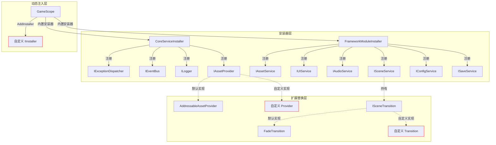
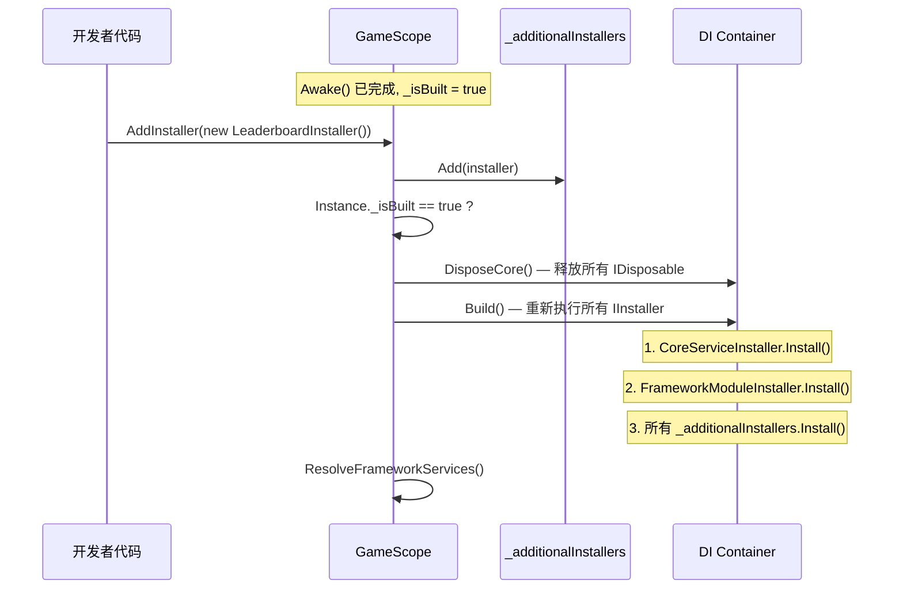
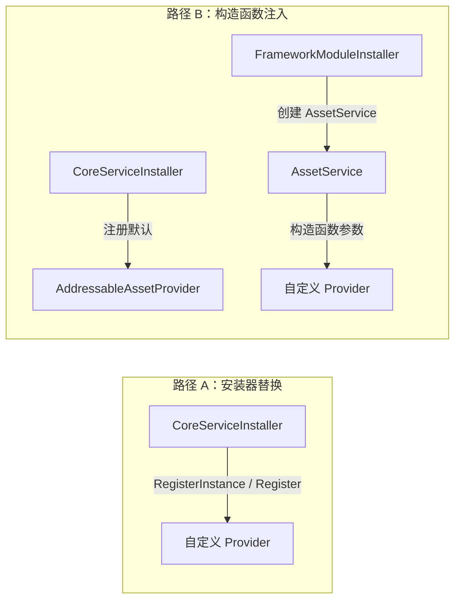
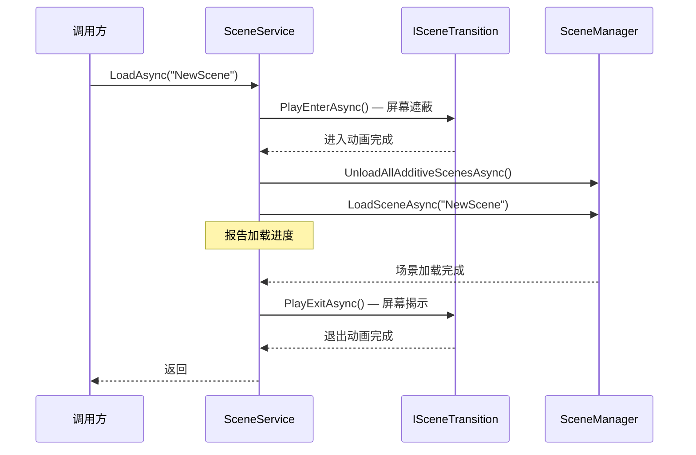

CFramework 的架构遵循 **开放-封闭原则**：核心服务通过接口抽象暴露扩展点，而非继承体系。本文档深入解析三大核心扩展机制——**IInstaller** 控制依赖注入的注册策略、**IAssetProvider** 抽象底层资源加载引擎、**ISceneTransition** 解耦场景切换的表现层。掌握这三个扩展点，意味着你可以将框架从"开箱即用"推进到"量身定制"的层级，无论是替换 Addressables 为自研资源管线、接入自定义过渡动画系统，还是在运行时动态注入游戏模块，都将获得完整的架构指导。

Sources: [CoreServiceInstaller.cs](Runtime/Core/DI/CoreServiceInstaller.cs#L1-L23), [IAssetService.cs](Runtime/Asset/IAssetService.cs#L14-L35), [ISceneTransition.cs](Runtime/Scene/ISceneTransition.cs#L1-L21)

---

## 扩展点架构总览

在深入每个扩展点的实现细节之前，先从第一性原理理解三者如何协作。框架的服务注册采用 **两层安装器架构**：`CoreServiceInstaller` 负责基础设施（日志、事件总线、资源提供者），`FrameworkModuleInstaller` 负责功能模块（UI、音频、场景、配置、存档）。`IAssetProvider` 作为基础设施层的一员被注入到 `AssetService` 中，而 `ISceneTransition` 则作为运行时可替换的策略对象挂载在 `SceneService` 上。



Sources: [GameScope.cs](Runtime/Core/DI/GameScope.cs#L22-L26), [CoreServiceInstaller.cs](Runtime/Core/DI/CoreServiceInstaller.cs#L15-L21), [FrameworkModuleInstaller.cs](Runtime/Core/DI/FrameworkModuleInstaller.cs#L16-L26)

---

## 扩展点一：自定义 IInstaller

### 机制解析

IInstaller 是 VContainer 的核心扩展接口，CFramework 在其上构建了 **静态安装器列表 + 动态注册** 的双层机制。`GameScope` 在 `Configure` 阶段按序执行两批安装器：先执行 `_builtInInstallers`（框架内置），再执行 `_additionalInstallers`（动态添加）。关键设计在于——如果 `AddInstaller` 在 `GameScope.Awake()` 之后调用，会自动触发 `RebuildContainer()`，重建整个 DI 容器。

这种设计意味着：你可以在游戏运行期间的 **任意时刻** 注入新模块，而不需要重启或预配置。例如，一个 DLC 模块在下载完成后动态注册其服务，或一个调试面板在开发者控制台激活时才注入。

Sources: [GameScope.cs](Runtime/Core/DI/GameScope.cs#L77-L95), [GameScope.cs](Runtime/Core/DI/GameScope.cs#L146-L178)

### 安装器类型对比

| 类型 | 适用场景 | 生命周期 | 重建触发 | 示例 |
|------|---------|---------|---------|------|
| **独立 IInstaller 类** | 复杂模块、多服务注册、需要复用 | 静态列表持久化 | 是（Awake 后） | `CoreServiceInstaller` |
| **ActionInstaller** | 轻量注册、1~3 个服务、一次性使用 | 委托捕获 | 是（Awake 后） | `GameScope.AddInstaller(b => b.Register<IFoo, Foo>())` |
| **SceneScope 重写** | 场景级服务、仅限当前场景 | 场景生命周期 | 否（Configure 阶段） | 子类重写 `Configure` |

Sources: [ActionInstaller.cs](Runtime/Core/DI/ActionInstaller.cs#L1-L31), [SceneScope.cs](Runtime/Core/DI/SceneScope.cs#L1-L16), [GameScope.cs](Runtime/Core/DI/GameScope.cs#L153-L178)

### 实战：创建独立安装器模块

以下展示一个完整的自定义安装器——为游戏注册一个 `ILeaderboardService` 模块，包含接口、实现和安装器三个文件：

```csharp
// 1. 定义服务接口
public interface ILeaderboardService
{
    UniTask<LeaderboardEntry[]> GetTopPlayersAsync(int count, CancellationToken ct = default);
    UniTask SubmitScoreAsync(string playerId, int score, CancellationToken ct = default);
}

// 2. 实现服务（VContainer EntryPoint，支持构造函数注入）
public sealed class LeaderboardService : ILeaderboardService, IStartable, IDisposable
{
    private readonly ILogger _logger;
    private readonly IEventBus _eventBus;

    // 通过 DI 自动注入框架核心服务
    public LeaderboardService(ILogger logger, IEventBus eventBus)
    {
        _logger = logger;
        _eventBus = eventBus;
    }

    public async UniTask<LeaderboardEntry[]> GetTopPlayersAsync(int count, CancellationToken ct)
    {
        // 实现略...
        return Array.Empty<LeaderboardEntry>();
    }

    public async UniTask SubmitScoreAsync(string playerId, int score, CancellationToken ct)
    {
        // 实现略...
        _eventBus.Publish(new ScoreSubmittedEvent(playerId, score));
    }

    public void Start() { /* 初始化逻辑 */ }
    public void Dispose() { /* 清理逻辑 */ }
}

// 3. 创建安装器
public sealed class LeaderboardInstaller : IInstaller
{
    public void Install(IContainerBuilder builder)
    {
        // 使用 InstallModule 注册为 EntryPoint（支持 IStartable/IDisposable）
        builder.InstallModule<ILeaderboardService, LeaderboardService>();
    }
}
```

在游戏初始化阶段注册此安装器：

```csharp
// 方式 A：通过 GameScope.AddInstaller（运行时动态注册）
GameScope.AddInstaller(new LeaderboardInstaller());

// 方式 B：通过 ActionInstaller 简化（少量注册时推荐）
GameScope.AddInstaller(builder =>
{
    builder.InstallModule<ILeaderboardService, LeaderboardService>();
});
```

**关键注意事项**：`InstallModule` 扩展方法内部调用的是 `RegisterEntryPoint`，这意味着你的实现类可以同时实现 `IStartable`、`IPostStartable`、`IFixedTickable`、`ITickable`、`ILateTickable` 和 `IDisposable` 等 VContainer 生命周期接口，它们会被自动调度。

Sources: [InstallerExtensions.cs](Runtime/Core/DI/InstallerExtensions.cs#L24-L37), [FrameworkModuleInstaller.cs](Runtime/Core/DI/FrameworkModuleInstaller.cs#L16-L26), [GameScope.cs](Runtime/Core/DI/GameScope.cs#L146-L178)

### 动态注册与容器重建机制

当 `AddInstaller` 在 `GameScope.Awake()` 之后被调用时，会触发 `RebuildContainer()`。这个方法执行三步操作：`DisposeCore()` → `Build()` → `ResolveFrameworkServices()`。重建过程会释放所有实现了 `IDisposable` 的已注册服务，然后重新执行所有安装器（内置 + 动态），最后重新解析框架公共服务属性。



**重建的风险与对策**：由于重建会释放所有 `IDisposable` 服务，你需要确保自定义服务在 `Dispose` 中正确处理状态持久化。例如，网络连接应在 `Dispose` 中断开并在 `Start` 中重连，而非依赖对象持续存在。

Sources: [GameScope.cs](Runtime/Core/DI/GameScope.cs#L200-L214), [GameScope.cs](Runtime/Core/DI/GameScope.cs#L153-L164)

---

## 扩展点二：自定义 IAssetProvider

### 机制解析

`IAssetProvider` 是资源加载的 **策略抽象层**。`AssetService` 并不直接调用 Addressables API，而是委托给 `IAssetProvider` 实例。这种设计使得资源加载引擎可以在不修改上层业务代码的前提下完全替换——从 Addressables 切换到 AssetBundle、Resources、甚至内存模拟，只需提供一个新的 `IAssetProvider` 实现。

接口定义了四个方法，覆盖了资源加载的完整生命周期：

| 方法 | 职责 | 调用时机 |
|------|------|---------|
| `LoadAssetAsync<T>` | 异步加载资源对象 | `AssetService.LoadAsync` 首次请求时 |
| `InstantiateAsync` | 异步实例化预制体 | `AssetService.InstantiateAsync` 调用时 |
| `ReleaseHandle` | 释放底层句柄 | 引用计数归零时 |
| `GetAssetMemorySize` | 查询资源内存占用 | 内存预算检查时 |

Sources: [IAssetService.cs](Runtime/Asset/IAssetService.cs#L14-L35), [AssetService.cs](Runtime/Asset/AssetService.cs#L22-L29)

### 注入路径分析

`IAssetProvider` 的注入发生在 `CoreServiceInstaller` 中，注册为 `Lifetime.Singleton`。`AssetService` 的构造函数接受一个可选的 `IAssetProvider` 参数——如果为 `null`，则默认创建 `AddressableAssetProvider`。这意味着你有两种替换路径：



**路径 A（推荐）**：通过自定义安装器替换 `IAssetProvider` 注册，`AssetService` 将通过 DI 获得你的自定义 Provider。

**路径 B**：直接在 `AssetService` 构造时传入自定义 Provider，适用于测试或非 DI 场景。

Sources: [CoreServiceInstaller.cs](Runtime/Core/DI/CoreServiceInstaller.cs#L20), [AssetService.cs](Runtime/Asset/AssetService.cs#L22-L29)

### 实战：基于 Resources 的 AssetProvider

以下是一个完整的 `ResourcesAssetProvider` 实现，将资源加载从 Addressables 切换到 Unity 原生 `Resources` 系统：

```csharp
using System.Collections.Generic;
using System.Threading;
using Cysharp.Threading.Tasks;
using UnityEngine;
using Object = UnityEngine.Object;

public sealed class ResourcesAssetProvider : IAssetProvider
{
    private readonly Dictionary<object, Object> _loadedAssets = new();
    private readonly HashSet<object> _instantiated = new();

    public async UniTask<Object> LoadAssetAsync<T>(object key, CancellationToken ct = default) where T : Object
    {
        var path = key.ToString();
        var operation = Resources.LoadAsync<T>(path);

        while (!operation.isDone)
        {
            ct.ThrowIfCancellationRequested();
            await UniTask.Yield(ct);
        }

        var asset = operation.asset as Object;
        if (asset == null)
            throw new System.Exception($"Failed to load resource at path: {path}");

        lock (_loadedAssets)
        {
            _loadedAssets[key] = asset;
        }

        return asset;
    }

    public async UniTask<GameObject> InstantiateAsync(object key, Transform parent, CancellationToken ct = default)
    {
        // Resources 不支持直接 InstantiateAsync，先加载再实例化
        var prefab = await LoadAssetAsync<GameObject>(key, ct);
        var instance = parent != null
            ? Object.Instantiate(prefab, parent)
            : Object.Instantiate(prefab);

        var instKey = "$inst_" + key;
        lock (_instantiated)
        {
            _instantiated.Add(instKey);
        }

        return instance;
    }

    public void ReleaseHandle(object key, bool isInstance)
    {
        // Resources.Load 的资源由 Resources.UnloadAsset 管理
        // 实例化对象直接 Destroy
        if (isInstance && _loadedAssets.TryGetValue(key, out var asset))
        {
            if (asset is GameObject go) Object.Destroy(go);
        }

        _loadedAssets.Remove(key);
    }

    public long GetAssetMemorySize(object key)
    {
        if (_loadedAssets.TryGetValue(key, out var asset) && asset != null)
            return Profiler.GetRuntimeMemorySizeLong(asset);
        return 0L;
    }
}
```

将自定义 Provider 注入框架：

```csharp
// 通过安装器替换 IAssetProvider 注册
GameScope.AddInstaller(builder =>
{
    // 注意：需要在 CoreServiceInstaller 之前或通过 Rebuild 生效
    // 推荐：直接覆盖注册
    builder.Register<IAssetProvider, ResourcesAssetProvider>(Lifetime.Singleton);
});
```

或者，通过在 `GameScope.Configure` 执行之前（即 `Awake` 之前）添加安装器，避免触发重建：

```csharp
// 在 GameScope.Create() 之前添加
GameScope.AddInstaller(new ResourcesProviderInstaller());
var scope = GameScope.Create(settings);
```

Sources: [AddressableAssetProvider.cs](Runtime/Asset/AddressableAssetProvider.cs#L14-L72), [IAssetService.cs](Runtime/Asset/IAssetService.cs#L14-L35), [CoreServiceInstaller.cs](Runtime/Core/DI/CoreServiceInstaller.cs#L15-L21)

### 实战参考：测试用的 MockAssetProvider

框架自身提供了 `MockAssetProvider` 作为最佳实践参考。它展示了如何构建一个 **内存级资源提供者**：通过 `RegisterAsset` / `RegisterGameObject` 预注册模拟资源，支持配置内存大小和加载延迟，并通过 `ReleaseLog` 记录所有释放操作供断言验证。这种模式非常适合在单元测试中隔离外部依赖。

```csharp
// 框架内置的 MockAssetProvider 使用范例
var settings = ScriptableObject.CreateInstance<FrameworkSettings>();
settings.MemoryBudgetMB = 512;

var mockProvider = new MockAssetProvider();
mockProvider.RegisterGameObject("TestPrefab", "TestPrefab", memorySize: 2048L);
var assetService = new AssetService(settings, mockProvider);
```

| MockAssetProvider 特性 | 用途 |
|----------------------|------|
| `RegisterAsset(key, asset, memorySize)` | 注册任意 Object 模拟资源 |
| `RegisterGameObject(key, name, memorySize)` | 快捷创建 GameObject 模拟资源 |
| `ReleaseLog` | 记录所有 `(key, isInstance)` 释放操作 |
| `loadDelayMs` 构造参数 | 模拟网络/IO 延迟以测试异步行为 |
| `Cleanup()` | 清理所有模拟资源与状态 |

Sources: [MockAssetProvider.cs](Tests/Runtime/Asset/MockAssetProvider.cs#L1-L128), [AssetServiceTests.cs](Tests/Runtime/Asset/AssetServiceTests.cs#L27-L38)

### 实现注意事项：实例化 Key 约定

`AssetService` 在跟踪实例化对象时使用了 **`$inst_` 前缀** 的 key 约定——当调用 `InstantiateAsync` 时，内部会将 `key` 转换为 `"$inst_" + key`，以避免与 `LoadAsync` 的 key 产生引用计数冲突。你的自定义 `IAssetProvider` **必须遵循相同的 key 约定**，在 `InstantiateAsync` 内部使用 `var instKey = "$inst_" + key` 来存储实例化句柄，否则引用计数和内存预算追踪将出现数据不一致。

Sources: [AssetService.cs](Runtime/Asset/AssetService.cs#L99-L106), [AddressableAssetProvider.cs](Runtime/Asset/AddressableAssetProvider.cs#L46-L49)

---

## 扩展点三：自定义 ISceneTransition

### 机制解析

`ISceneTransition` 是场景过渡动画的策略接口，仅定义两个方法：`PlayEnterAsync`（场景加载前执行的"进入"动画）和 `PlayExitAsync`（场景加载后执行的"退出"动画）。`SceneService` 在 `LoadAsync` 方法中按固定时序调度这两个方法：



`SceneService.Transition` 属性是可读写的，默认值为 `new FadeTransition()`。你可以在 **任意时刻** 替换它——下一次场景加载将自动使用新的过渡动画。

Sources: [SceneService.cs](Runtime/Scene/SceneService.cs#L34-L68), [ISceneTransition.cs](Runtime/Scene/ISceneTransition.cs#L1-L21)

### 框架内置：FadeTransition 分析

`FadeTransition` 是框架提供的唯一内置过渡动画实现，其工作原理值得深入理解：

- **Canvas 策略**：运行时动态创建一个 `RenderMode.ScreenSpaceOverlay` 的 Canvas，`sortingOrder` 设为 9999 以确保覆盖所有 UI 元素
- **生命周期管理**：`PlayEnterAsync` 创建 Overlay，`PlayExitAsync` 结束时通过 `DestroyOverlay` 销毁整个 Canvas GameObject
- **DontDestroyOnLoad**：创建的 Canvas 跨场景存活，避免场景切换时被意外销毁
- **可配置参数**：`Duration`（动画时长，默认 0.5s）和 `FadeColor`（遮蔽颜色，默认黑色）

| 参数 | 类型 | 默认值 | 说明 |
|------|------|--------|------|
| `Duration` | `float` | 0.5s | 单次渐变（进入或退出）的持续时间 |
| `FadeColor` | `Color` | `Color.black` | 遮蔽层的颜色（alpha 由动画控制） |

Sources: [FadeTransition.cs](Runtime/Scene/FadeTransition.cs#L1-L73)

### 实战：圆形遮罩过渡动画

以下实现一个从屏幕中心向外扩展的圆形遮罩效果，展示如何构建需要 `MonoBehaviour` 配合的自定义过渡：

```csharp
using System.Threading;
using Cysharp.Threading.Tasks;
using UnityEngine;

public sealed class CircleWipeTransition : ISceneTransition
{
    private GameObject _overlayGo;
    private Material _material;
    
    public float Duration { get; set; } = 0.8f;
    public Color WipeColor { get; set; } = Color.black;

    public async UniTask PlayEnterAsync(CancellationToken ct = default)
    {
        CreateOverlay();
        await AnimateRadius(0f, 1.5f, ct); // 从 0 扩展到 1.5（覆盖屏幕）
    }

    public async UniTask PlayExitAsync(CancellationToken ct = default)
    {
        await AnimateRadius(1.5f, 0f, ct); // 从 1.5 收缩到 0
        DestroyOverlay();
    }

    private void CreateOverlay()
    {
        if (_overlayGo != null) return;

        _overlayGo = new GameObject("[CircleWipeTransition]");
        Object.DontDestroyOnLoad(_overlayGo);

        var canvas = _overlayGo.AddComponent<Canvas>();
        canvas.renderMode = RenderMode.ScreenSpaceOverlay;
        canvas.sortingOrder = 9999;

        var image = _overlayGo.AddComponent<UnityEngine.UI.Image>();
        // 使用径向遮罩 Shader
        _material = new Material(Shader.Find("Custom/CircleWipe"));
        _material.SetColor("_Color", WipeColor);
        _material.SetFloat("_Radius", 0f);
        image.material = _material;
    }

    private void DestroyOverlay()
    {
        if (_overlayGo != null)
        {
            Object.Destroy(_overlayGo);
            _overlayGo = null;
            _material = null;
        }
    }

    private async UniTask AnimateRadius(float from, float to, CancellationToken ct)
    {
        if (_material == null) return;

        var elapsed = 0f;
        while (elapsed < Duration)
        {
            elapsed += Time.deltaTime;
            var t = Mathf.Clamp01(elapsed / Duration);
            // 使用 ease-in-out 曲线
            t = t * t * (3f - 2f * t);
            _material.SetFloat("_Radius", Mathf.Lerp(from, to, t));
            await UniTask.Yield(ct);
        }

        _material.SetFloat("_Radius", to);
    }
}
```

替换过渡动画的方式非常直接：

```csharp
// 方式 A：在任意服务/组件中通过 DI 获取 ISceneService
public class GameInitializer : IStartable
{
    private readonly ISceneService _sceneService;
    
    public GameInitializer(ISceneService sceneService) => _sceneService = sceneService;
    
    public void Start()
    {
        _sceneService.Transition = new CircleWipeTransition
        {
            Duration = 1.0f,
            WipeColor = new Color(0.1f, 0.1f, 0.2f)
        };
    }
}

// 方式 B：直接通过 GameScope 全局访问
GameScope.Instance.SceneService.Transition = new CircleWipeTransition();
```

Sources: [ISceneTransition.cs](Runtime/Scene/ISceneTransition.cs#L1-L21), [SceneService.cs](Runtime/Scene/SceneService.cs#L28), [FadeTransition.cs](Runtime/Scene/FadeTransition.cs#L32-L55)

### 实现注意事项：取消令牌与资源清理

`ISceneTransition` 的两个方法都接受 `CancellationToken`。当场景加载被取消时（例如玩家快速切换目标场景），`SceneService.LoadAsync` 中的 `ct.ThrowIfCancellationRequested()` 会向上传播取消信号。你的自定义过渡动画 **必须在动画循环中正确响应取消令牌**：

```csharp
// ✅ 正确：循环中检查取消令牌
while (elapsed < Duration)
{
    ct.ThrowIfCancellationRequested(); // 关键：允许中断
    elapsed += Time.deltaTime;
    await UniTask.Yield(ct); // Yield 本身也传播取消
}

// ❌ 错误：忽略取消令牌
await UniTask.Delay((int)(Duration * 1000)); // 无法中途取消
```

此外，`FadeTransition` 的实现提供了一个重要的设计参考：**进入动画创建资源，退出动画销毁资源**。这种对称的生命周期管理确保了过渡资源不会泄漏。如果你的自定义过渡使用了 Shader、Material 或其他 Unity 资源，务必在 `PlayExitAsync` 中清理。

Sources: [FadeTransition.cs](Runtime/Scene/FadeTransition.cs#L57-L72), [SceneService.cs](Runtime/Scene/SceneService.cs#L46-L54)

---

## 三大扩展点协作模式

在实际项目中，三大扩展点往往需要协同工作。以下展示一个完整的游戏模块扩展场景：自定义资源加载引擎 + 自定义场景过渡 + 动态服务注册。

```csharp
/// <summary>
///     游戏模块安装器：一次性注册自定义 Provider 和游戏服务
/// </summary>
public sealed class GameModuleInstaller : IInstaller
{
    public void Install(IContainerBuilder builder)
    {
        // 替换资源加载引擎为自定义实现
        builder.Register<IAssetProvider, ResourcesAssetProvider>(Lifetime.Singleton);
        
        // 注册游戏业务服务
        builder.InstallModule<ILeaderboardService, LeaderboardService>();
        builder.InstallModule<IMatchmakingService, MatchmakingService>();
    }
}

/// <summary>
///     游戏初始化器：配置场景过渡并启动游戏流程
/// </summary>
public sealed class GameInitializer : IStartable, IDisposable
{
    private readonly ISceneService _sceneService;
    private readonly ILogger _logger;

    public GameInitializer(ISceneService sceneService, ILogger logger)
    {
        _sceneService = sceneService;
        _logger = logger;
    }

    public void Start()
    {
        // 配置自定义场景过渡
        _sceneService.Transition = new CircleWipeTransition
        {
            Duration = 0.8f,
            WipeColor = new Color(0.05f, 0.05f, 0.1f)
        };

        _logger.Log("Game module initialized with custom provider and transition.");
    }

    public void Dispose() { }
}
```

注册流程：

```csharp
// 游戏启动入口
public class GameBootstrapper : MonoBehaviour
{
    [SerializeField] private FrameworkSettings _settings;
    
    private IEnumerator Start()
    {
        // 1. 在 GameScope 构建前注册自定义安装器
        GameScope.AddInstaller(new GameModuleInstaller());
        
        // 2. 创建 GameScope（触发 Configure → Install）
        var scope = GameScope.Create(_settings);
        
        // 3. 等待一帧确保所有 IStartable.Start() 执行完毕
        yield return null;
        
        // 4. 开始游戏流程
        yield return scope.SceneService.LoadAsync("MainMenu").ToCoroutine();
    }
}
```

Sources: [GameScope.cs](Runtime/Core/DI/GameScope.cs#L118-L127), [InstallerExtensions.cs](Runtime/Core/DI/InstallerExtensions.cs#L24-L37), [SceneService.cs](Runtime/Scene/SceneService.cs#L28)

---

## 扩展点设计决策总结

| 维度 | IInstaller | IAssetProvider | ISceneTransition |
|------|-----------|----------------|------------------|
| **抽象层次** | DI 注册策略 | 资源加载引擎 | 场景过渡表现 |
| **替换时机** | `GameScope.Awake()` 前或运行时（触发重建） | DI 容器构建时 | 任意时刻（下次 `LoadAsync` 生效） |
| **影响范围** | 全局 DI 容器 | 所有 `AssetService` 操作 | `SceneService.LoadAsync` 的视觉效果 |
| **状态管理** | 静态列表 + 自动重建 | 无状态（方法级契约） | 自管理 Overlay 生命周期 |
| **测试策略** | `ActionInstaller` + 委托替换 | `MockAssetProvider` 内存模拟 | 直接实例化 + 超时 CTS |
| **框架内置** | `CoreServiceInstaller`, `FrameworkModuleInstaller` | `AddressableAssetProvider` | `FadeTransition` |

Sources: [CoreServiceInstaller.cs](Runtime/Core/DI/CoreServiceInstaller.cs#L1-L23), [AddressableAssetProvider.cs](Runtime/Asset/AddressableAssetProvider.cs#L14-L72), [FadeTransition.cs](Runtime/Scene/FadeTransition.cs#L12-L16)

---

## 常见问题与排错

**Q: 为什么自定义 IAssetProvider 没有生效？**

检查注册顺序。`CoreServiceInstaller` 在 `GameScope.Configure` 中最先执行，它注册了 `AddressableAssetProvider`。如果你在 `GameScope.Awake()` 之后通过 `AddInstaller` 注册自定义 Provider，VContainer 的后注册覆盖机制可能因版本而异。推荐做法：在 `GameScope.Create()` 之前添加安装器，或确保你的安装器在 `_builtInInstallers` 执行后覆盖注册。

**Q: 自定义 ISceneTransition 的 Overlay 在场景切换后被销毁了？**

确保在创建 Overlay GameObject 时调用 `Object.DontDestroyOnLoad(go)`。`SceneService.LoadAsync` 内部会执行 `SceneManager.LoadSceneAsync`，默认行为会销毁当前场景的所有 GameObject。参考 [FadeTransition.cs](Runtime/Scene/FadeTransition.cs#L36-L38) 中的 `CreateOverlay` 实现。

**Q: `RebuildContainer()` 后自定义服务的状态丢失了？**

这是预期行为。重建会释放所有 `IDisposable` 服务并重新创建。如果你的服务持有需要持久化的状态（如网络连接、玩家数据缓存），应在 `Dispose` 中序列化状态，在 `IStartable.Start` 中恢复。或者，将状态存储在 [黑板系统：类型安全的键值对数据共享与响应式观察](8-hei-ban-xi-tong-lei-xing-an-quan-de-jian-zhi-dui-shu-ju-gong-xiang-yu-xiang-ying-shi-guan-cha) 中，它不受容器重建影响。

**Q: 如何在自定义 IAssetProvider 中正确实现 `GetAssetMemorySize`？**

默认的 `AddressableAssetProvider` 返回固定值 `1024L`，这是一个简化实现。生产环境建议使用 `UnityEngine.Profiler.GetRuntimeMemorySizeLong(asset)` 获取精确值。对于 `MockAssetProvider`，使用构造时指定的 `memorySize` 参数，如 [MockAssetProvider.cs](Tests/Runtime/Asset/MockAssetProvider.cs#L106-L109) 所示。

---

## 延伸阅读

- [依赖注入体系：GameScope、SceneScope 与动态安装器机制](5-yi-lai-zhu-ru-ti-xi-gamescope-scenescope-yu-dong-tai-an-zhuang-qi-ji-zhi) — 理解 DI 容器的完整构建流程与生命周期管理
- [资源管理服务：Addressables 封装、引用计数与生命周期绑定](10-zi-yuan-guan-li-fu-wu-addressables-feng-zhuang-yin-yong-ji-shu-yu-sheng-ming-zhou-qi-bang-ding) — 深入 `AssetService` 的引用计数与内存预算机制
- [场景管理服务：场景加载、叠加场景与过渡动画](15-chang-jing-guan-li-fu-wu-chang-jing-jia-zai-die-jia-chang-jing-yu-guo-du-dong-hua) — `SceneService` 的完整 API 与叠加场景管理
- [单元测试指南：测试覆盖策略与 Mock 替换模式](22-dan-yuan-ce-shi-zhi-nan-ce-shi-fu-gai-ce-lue-yu-mock-ti-huan-mo-shi) — 使用 `MockAssetProvider` 编写隔离测试的最佳实践