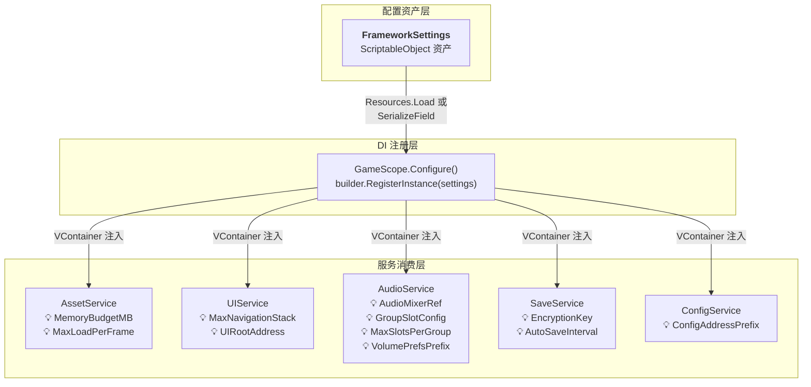
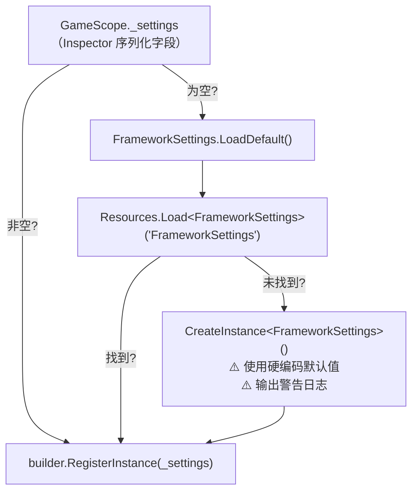

**FrameworkSettings** 是 CFramework 的中央配置枢纽——一个基于 ScriptableObject 的单例资产，以声明式字段驱动框架各模块的运行时行为。你只需编辑一个 Inspector 面板，就能控制资源内存预算、UI 导航栈深度、音频分组策略、存档加密密钥等核心参数，而无需修改任何代码。本文将从整体架构、配置项逐条解读、资产创建与加载机制、以及实际调优建议四个维度，帮助你彻底掌握这个"一行代码撬动全局"的配置系统。

Sources: [FrameworkSettings.cs](Runtime/Core/FrameworkSettings.cs#L1-L64)

## 整体架构：配置如何流向各服务

FrameworkSettings 并非一个孤立的配置文件——它是整个依赖注入体系中的 **第一公民**。在 `GameScope.Configure()` 阶段，FrameworkSettings 被注册为 VContainer 的单例实例，随后各服务通过构造函数注入获取它，并在初始化时读取自己关心的字段。下面的架构图展示了这条从"配置资产"到"服务行为"的数据流：



**关键设计要点**：FrameworkSettings 在 `Configure()` 阶段以 `RegisterInstance` 注册为不可变单例。这意味着它在容器生命周期内是固定的——如果你需要运行时动态修改某个值（比如切换内存预算），需要直接访问服务暴露的属性（如 `AssetService.MemoryBudget`），而非修改 settings 对象本身。

Sources: [GameScope.cs](Runtime/Core/DI/GameScope.cs#L77-L95), [FrameworkSettings.cs](Runtime/Core/FrameworkSettings.cs#L1-L64)

## 配置项完整参考

FrameworkSettings 的字段被分为六个逻辑分组，对应框架的六大子系统。下表按分组列出每一项的名称、类型、默认值、作用说明及其下游消费者。

### 📦 Asset — 资源管理

| 字段 | 类型 | 默认值 | 说明 | 消费者 |
|---|---|---|---|---|
| `MemoryBudgetMB` | `int` | `512` | 资源内存预算上限（单位 MB）。AssetService 在构造时将其换算为 `AssetMemoryBudget.BudgetBytes`（512 × 1024² = 536,870,912 字节）。当已加载资源总大小超过此阈值时，触发 `OnBudgetExceeded` 事件。 | [AssetService](Runtime/Asset/AssetService.cs#L22-L29) |
| `MaxLoadPerFrame` | `int` | `5` | 每帧最大资源加载数量，用于 `PreloadAsync` 分帧预加载，防止单帧卡顿。 | [AssetService.PreloadAsync](Runtime/Asset/AssetService.cs#L182-L217) |

### 🖥️ UI — 面板系统

| 字段 | 类型 | 默认值 | 说明 | 消费者 |
|---|---|---|---|---|
| `MaxNavigationStack` | `int` | `10` | UI 导航栈最大容量。当栈深度超过此值时，最底部的面板会被自动弹出。在 UIService 构造时读取并赋给 `MaxStackCapacity`。 | [UIService](Runtime/UI/UIService.cs#L32-L42) |
| `UIRootAddress` | `string` | `"UIRoot"` | UIRoot Prefab 的 Addressable Key。UIService 在 `Start()` 阶段通过此 Key 从 Addressables 加载 UI 根节点预制体；加载失败时自动回退为代码创建带 Canvas 的 GameObject。 | [UIService.InitializeAsync](Runtime/UI/UIService.cs#L52-L94) |

### 🔊 Audio — 音频系统

| 字段 | 类型 | 默认值 | 说明 | 消费者 |
|---|---|---|---|---|
| `AudioMixerRef` | `AudioMixer` | `null` | 音频混合器引用。未设置时框架会尝试加载内置 AudioMixer。这是音频系统的核心依赖——AudioMixerTree 将从此对象解析出完整的分组层级结构。 | [AudioService](Runtime/Audio/AudioService.cs#L59-L78) |
| `GroupSlotConfig` | `string` | `"Master_Music:2,Master_Effect:5"` | 各分组预分配 Slot 数量。格式为 `枚举名:数量`，逗号分隔。枚举名由 AudioMixer Group 路径将 `/` 替换为 `_` 得来（如 `Master/Music` → `Master_Music`）。 | [AudioService.ParseSlotConfig](Runtime/Audio/AudioService.cs#L318-L335) |
| `MaxSlotsPerGroup` | `int` | `20` | 每个音频分组的 Slot 自动扩容上限。当预分配的 Slot 不够用时，系统会按需扩容，但不会超过此上限。 | [AudioMixerTree.Build](Runtime/Audio/AudioMixerTree.cs#L31-L52) |
| `VolumePrefsPrefix` | `string` | `"Audio_Volume_"` | 音量设置持久化到 PlayerPrefs 时的键名前缀。最终存储键为 `{前缀}{分组枚举名}`。 | [AudioVolumeController](Runtime/Audio/AudioService.cs#L112-L113) |

### 💾 Save — 存档系统

| 字段 | 类型 | 默认值 | 说明 | 消费者 |
|---|---|---|---|---|
| `AutoSaveInterval` | `int` | `60` | 自动保存间隔（秒）。调用 `SaveService.EnableAutoSave()` 后，服务会在此间隔内自动检查脏状态并持久化。 | [SaveService](Runtime/Save/SaveService.cs#L273-L279) |
| `EncryptionKey` | `string` | `"CFramework"` | 存档 AES 加密密钥。SaveService 内部将其补齐或截取到 16 字节作为 AES-128 密钥。**强烈建议在生产环境中修改为自定义密钥**。 | [SaveService.Encrypt](Runtime/Save/SaveService.cs#L311-L328) |

### 📝 Log — 日志系统

| 字段 | 类型 | 默认值 | 说明 | 消费者 |
|---|---|---|---|---|
| `LogLevel` | `LogLevel` | `LogLevel.Debug` | 全局日志级别阈值。只有级别 ≥ 此阈值的消息才会被输出。可选值：`Debug`(0)、`Info`(1)、`Warning`(2)、`Error`(3)、`Exception`(4)、`None`(100)。 | [LogLevel 枚举](Runtime/Core/Log/LogLevel.cs#L1-L38) |

### 📋 Config — 配置表系统

| 字段 | 类型 | 默认值 | 说明 | 消费者 |
|---|---|---|---|---|
| `ConfigAddressPrefix` | `string` | `"Config"` | 配置表的 Addressable 地址前缀。ConfigService 在加载配置表时构建的完整地址为 `{前缀}/{表类型名}`。留空则直接使用表类型名作为地址。 | [ConfigService.LoadAsync](Runtime/Config/ConfigService.cs#L32-L68) |

Sources: [FrameworkSettings.cs](Runtime/Core/FrameworkSettings.cs#L1-L64)

## 创建与加载机制

### 创建 FrameworkSettings 资产

CFramework 提供两种方式创建配置资产：

**方式一：通过菜单创建（推荐）**

在 Unity 编辑器顶部菜单栏点击 `CFramework → CreateSettings`，在弹出的保存对话框中选择路径即可。编辑器会自动为你创建一个预填默认值的 ScriptableObject 资产。

**方式二：通过右键菜单创建**

在 Project 窗口右键 → `Create → CFramework → Settings`，效果相同。这个入口由 `[CreateAssetMenu]` 特性提供。

Sources: [FrameworkSettingsEditor.cs](Editor/Inspectors/FrameworkSettingsEditor.cs#L20-L38), [FrameworkSettings.cs](Runtime/Core/FrameworkSettings.cs#L9-L10)

### 加载优先级链

GameScope 在 `Configure()` 阶段按以下优先级链获取 FrameworkSettings 实例：



**解读**：

1. **最高优先级**：GameScope Inspector 中直接拖拽赋值的 `_settings` 字段。适用于需要为不同构建目标（开发/测试/生产）维护不同配置文件的场景。
2. **次优先级**：`Resources/FrameworkSettings` 路径下自动加载。这是最常见的工作流——将配置资产放在任意 `Resources` 文件夹下命名为 `FrameworkSettings` 即可。
3. **兜底方案**：若以上都未找到，框架会创建一个运行时实例并使用代码中的硬编码默认值，同时输出警告日志提醒你。**游戏功能不会因此中断，但所有配置均为默认值**。

Sources: [GameScope.cs](Runtime/Core/DI/GameScope.cs#L77-L88), [FrameworkSettings.cs](Runtime/Core/FrameworkSettings.cs#L51-L62)

### 通过代码创建 GameScope

如果你不使用 Inspector 拖拽，也可以通过 `GameScope.Create()` 静态方法以纯代码方式启动框架，并传入自定义的 settings 实例：

```csharp
// 使用默认配置
var scope = GameScope.Create();

// 或传入自定义配置
var mySettings = ScriptableObject.CreateInstance<FrameworkSettings>();
mySettings.MemoryBudgetMB = 1024;
mySettings.LogLevel = LogLevel.Warning;
var scope = GameScope.Create(mySettings);
```

当 `settings` 参数为 `null` 时，`Create` 方法内部会自动调用 `LoadDefault()` 获取配置。

Sources: [GameScope.cs](Runtime/Core/DI/GameScope.cs#L118-L127)

## 实际调优建议

### 按项目规模选择内存预算

`MemoryBudgetMB` 的合理取值取决于目标平台和资源复杂度。以下表格给出参考基线：

| 项目规模 | 推荐值 | 适用场景 |
|---|---|---|
| 小型 2D / 休闲游戏 | `256 - 384` | 精灵图为主，音频资源少 |
| 中型 3D / 手游 | `512`（默认） | 混合资源类型，中等多边形模型 |
| 大型 3D / PC 主机 | `768 - 1024+` | 高分辨率纹理、大量预制体预加载 |

> 💡 **提示**：`AssetMemoryBudget` 会在每次资源加载后检查 `UsedBytes > BudgetBytes` 并触发 `OnBudgetExceeded` 事件。你可以订阅此事件来实现自定义的内存回收策略，例如自动卸载最久未使用的资源。

### 音频 Slot 配置技巧

`GroupSlotConfig` 的格式 `"Master_Music:2,Master_Effect:5"` 中的枚举名**必须与 AudioMixer 中 Group 的路径层级精确对应**（将路径分隔符 `/` 替换为 `_`）。例如，如果你的 AudioMixer 结构为 `Master → Music → BGM`，那么配置项应写为 `Master_Music_BGM:2`。

预分配数量应略大于该分组**同时播放**的最大音频数量——预分配不足时系统会自动扩容（直到 `MaxSlotsPerGroup`），但运行时扩容会产生一次性的 GameObject 创建开销。

### 存档密钥安全提醒

`EncryptionKey` 的默认值 `"CFramework"` 仅适用于开发阶段。**上线前务必替换为项目独有的密钥字符串**。虽然 AES 加密不能替代服务端验证，但它能有效防止普通玩家直接篡改本地存档文件。

Sources: [FrameworkSettings.cs](Runtime/Core/FrameworkSettings.cs#L1-L64), [AssetMemoryBudget.cs](Runtime/Asset/AssetMemoryBudget.cs#L1-L22)

## 常见问题排查

| 现象 | 原因 | 解决方法 |
|---|---|---|
| 控制台出现 `[CFramework] FrameworkSettings not found at Resources/FrameworkSettings` 警告 | 未在 Resources 目录下放置配置资产 | 通过 `CFramework → CreateSettings` 创建资产，保存到 `Assets/Resources/FrameworkSettings.asset` |
| UI 面板打开后 Canvas 不存在 | `UIRootAddress` 指向的 Prefab 缺少 Canvas 组件 | 在 UIRoot Prefab 上添加 Canvas 组件，或确认 Addressable 标签正确 |
| 音频服务初始化失败，提示 `AudioMixerRef is null` | 未在 FrameworkSettings 的 Inspector 中拖入 AudioMixer | 将 `GameAudioMixer.mixer` 拖入 `AudioMixerRef` 字段 |
| 配置表加载地址错误 | `ConfigAddressPrefix` 与 Addressables 中的实际分组路径不匹配 | 检查 Addressables Group 设置，确保 `Config/{表名}` 路径正确 |
| 内存预算告警频繁触发 | `MemoryBudgetMB` 设置过低 | 根据项目实际资源体量调高此值，或优化资源加载策略 |

Sources: [FrameworkSettings.cs](Runtime/Core/FrameworkSettings.cs#L51-L62), [UIService.cs](Runtime/UI/UIService.cs#L72-L74), [AudioService.cs](Runtime/Audio/AudioService.cs#L68-L75)

## 下一步

FrameworkSettings 是框架的"控制面板"，它的每一个字段都精确地连接到具体的服务实现。理解了配置的全景图之后，建议你继续阅读以下页面，深入每个服务是如何消费这些配置的：

- [游戏入口与生命周期：GameScope 创建与服务初始化流程](4-you-xi-ru-kou-yu-sheng-ming-zhou-qi-gamescope-chuang-jian-yu-fu-wu-chu-shi-hua-liu-cheng) — 了解 FrameworkSettings 是如何在 DI 容器构建阶段被注册的
- [资源管理服务：Addressables 封装、引用计数与生命周期绑定](10-zi-yuan-guan-li-fu-wu-addressables-feng-zhuang-yin-yong-ji-shu-yu-sheng-ming-zhou-qi-bang-ding) — 深入 `MemoryBudgetMB` 和 `MaxLoadPerFrame` 的运行时效果
- [音频系统：双音轨 BGM 交叉淡入淡出与分组音量控制](14-yin-pin-xi-tong-shuang-yin-gui-bgm-jiao-cha-dan-ru-dan-chu-yu-fen-zu-yin-liang-kong-zhi) — 理解 `GroupSlotConfig` 与 AudioMixer 层级的映射关系