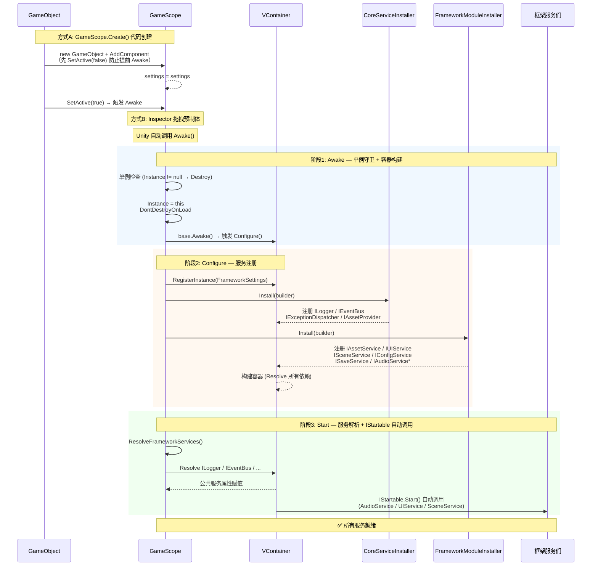
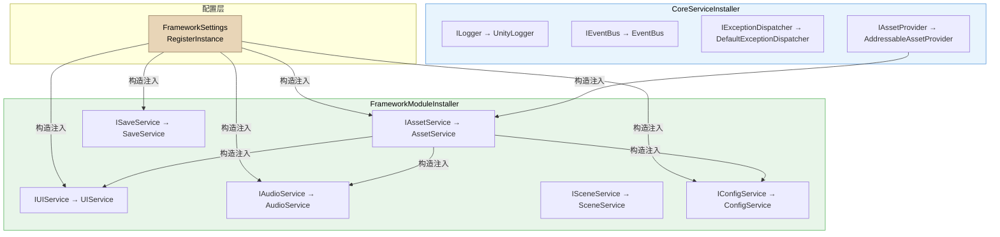

**GameScope** 是 CFramework 的运行时心脏——它继承自 VContainer 的 `LifetimeScope`，作为全局依赖注入容器的宿主，在游戏启动时自动完成配置注册、服务构建和初始化解析。理解 GameScope 的生命周期，就是理解整个框架从"配置文件"到"可用服务"的完整转化路径。本文将逐步拆解这一流程的每个阶段，帮助你掌握框架的启动机制和扩展入口。

Sources: [GameScope.cs](Runtime/Core/DI/GameScope.cs#L1-L214)

## 全局架构：从创建到就绪的完整流程

下面的时序图展示了 GameScope 从实例化到所有服务可用的完整生命周期，包括两种创建方式和三阶段初始化过程。



Sources: [GameScope.cs](Runtime/Core/DI/GameScope.cs#L37-L113), [CoreServiceInstaller.cs](Runtime/Core/DI/CoreServiceInstaller.cs#L15-L21), [FrameworkModuleInstaller.cs](Runtime/Core/DI/FrameworkModuleInstaller.cs#L16-L26)

## 创建 GameScope 的两种方式

CFramework 提供两种等价的创建方式，选择取决于你的项目结构和团队偏好。

### 方式一：代码创建（推荐）

通过 `GameScope.Create()` 静态方法以纯代码方式启动框架，无需在场景中预先放置任何预制体。这是最灵活的方式——你可以在任何 MonoBehaviour 的 `Start()` 中调用它，也可以将配置资产通过参数传入。

```csharp
using CFramework;
using Cysharp.Threading.Tasks;
using UnityEngine;

public sealed class GameEntry : MonoBehaviour
{
    [SerializeField] private FrameworkSettings settings;

    private async UniTaskVoid Start()
    {
        // 创建全局作用域，框架自动完成服务注册和初始化
        var scope = GameScope.Create(settings);
        // 此后所有服务已就绪，可从 scope.Container 解析
    }
}
```

`Create` 方法内部有一个关键设计：**先将 GameObject 设为 `SetActive(false)`，添加组件后再 `SetActive(true)`**。这确保了 `Awake()` 在 `_settings` 赋值完成后才被 Unity 触发，避免了时序竞争。

Sources: [GameScope.cs](Runtime/Core/DI/GameScope.cs#L118-L127)

### 方式二：Inspector 拖拽

将 GameScope 组件直接挂载到场景中的 GameObject 上，并在 Inspector 面板中拖入 FrameworkSettings 资产。这种方式适用于需要快速原型验证或团队中非程序员需要调整入口配置的场景。Unity 在场景加载时自动调用 `Awake()`，此时 `_settings` 已通过序列化字段赋值完毕。

Sources: [GameScope.cs](Runtime/Core/DI/GameScope.cs#L28-L28)

### 两种方式对比

| 维度 | 代码创建 (`GameScope.Create`) | Inspector 拖拽 |
|---|---|---|
| **配置来源** | 方法参数，可运行时动态构造 | 序列化字段，需预先创建资产 |
| **启动时机** | 由你控制，适合异步初始化链 | 场景加载时自动触发 |
| **配置切换** | 轻松传入不同 settings 实例 | 需要替换 Inspector 引用 |
| **适用场景** | 生产环境、多构建目标 | 原型验证、快速调试 |
| **DontDestroyOnLoad** | 自动生效 | 自动生效 |

Sources: [GameScope.cs](Runtime/Core/DI/GameScope.cs#L37-L50), [GameScope.cs](Runtime/Core/DI/GameScope.cs#L118-L127)

## 生命周期三阶段详解

### 阶段 1：Awake — 单例守卫与容器构建触发

`Awake()` 是 GameScope 生命周期的起点，它执行三个关键操作：

**单例守卫**：检查 `Instance` 是否已存在。如果场景中已有另一个 GameScope 实例（例如叠加场景加载时误带入），当前实例会被直接销毁，保证全局唯一。

**持久化标记**：调用 `DontDestroyOnLoad(gameObject)` 确保GameScope 在场景切换时不会被销毁——它跨越整个游戏会话生命周期。

**触发容器构建**：调用 `base.Awake()`，VContainer 的 `LifetimeScope` 在此阶段自动调用 `Configure()` 方法完成服务注册，然后构建 DI 容器。构建完成后，`_isBuilt` 被标记为 `true`。

Sources: [GameScope.cs](Runtime/Core/DI/GameScope.cs#L37-L50)

### 阶段 2：Configure — 服务注册的核心

`Configure()` 是整个框架的服务注册中心，它按固定顺序执行三组注册动作：

**① 注册 FrameworkSettings**：首先将全局配置注册为容器单例实例。注册优先级为：Inspector 序列化字段 > `Resources/FrameworkSettings` 自动加载 > 代码默认值兜底。所有后续注册的服务都可以通过构造函数注入获取这个配置对象。

**② 执行内置安装器**：框架按顺序执行两个内置安装器——`CoreServiceInstaller` 和 `FrameworkModuleInstaller`。这个顺序很重要：核心基础设施（日志、事件总线）必须先于功能模块（UI、音频）注册，因为功能模块在构造时就需要注入核心服务。

**③ 执行动态安装器**：最后执行通过 `AddInstaller` 动态注册的安装器列表，允许游戏代码在框架启动前或运行时注入自定义服务。

```csharp
protected override void Configure(IContainerBuilder builder)
{
    // 1. 注册 FrameworkSettings（全局配置单例）
    if (_settings != null)
        builder.RegisterInstance(_settings);
    else
        builder.RegisterInstance(FrameworkSettings.LoadDefault());

    // 2. 内置安装器（固定顺序）
    foreach (var installer in _builtInInstallers) builder.Install(installer);

    // 3. 动态安装器（用户注册）
    foreach (var installer in _additionalInstallers) builder.Install(installer);
}
```

Sources: [GameScope.cs](Runtime/Core/DI/GameScope.cs#L77-L95)

### 阶段 3：Start — 服务解析与自动初始化

`Start()` 在 `Awake()` 之后、第一帧 `Update()` 之前被 Unity 调用，它执行两个关键任务：

**解析框架服务到属性**：`ResolveFrameworkServices()` 将所有框架公共服务从 DI 容器解析到 `GameScope.Instance` 的公共属性上，形成一个全局服务门面（Facade）。你可以通过 `GameScope.Instance.AssetService` 直接访问，也可以从子容器中 `Resolve`。

**VContainer 自动调用 IStartable**：这是 `InstallModule` 注册模式带来的隐式行为。所有通过 `InstallModule` 注册且实现了 `IStartable` 接口的服务，其 `Start()` 方法会被 VContainer 自动调用。这意味着 `UIService`、`AudioService`、`SceneService` 等都会在这个阶段自动完成各自的异步初始化（加载 UIRoot、解析 AudioMixer 等），无需手动调用。

Sources: [GameScope.cs](Runtime/Core/DI/GameScope.cs#L52-L113), [InstallerExtensions.cs](Runtime/Core/DI/InstallerExtensions.cs#L30-L37)

## 内置安装器与服务注册全景

### CoreServiceInstaller — 核心基础设施

`CoreServiceInstaller` 注册框架最底层的四个服务，这些服务不依赖任何功能模块，但被所有功能模块依赖：

| 接口 | 实现 | 生命周期 | 职责 |
|---|---|---|---|
| `IExceptionDispatcher` | `DefaultExceptionDispatcher` | Singleton | 统一捕获并分发 UniTask/R3 未处理异常 |
| `IEventBus` | `EventBus` | Singleton | 同步/异步事件发布订阅，R3 响应式桥接 |
| `ILogger` | `UnityLogger` | Singleton | 分级日志输出到 Unity Console |
| `IAssetProvider` | `AddressableAssetProvider` | Singleton | 底层资源加载抽象（Addressables 实现） |

Sources: [CoreServiceInstaller.cs](Runtime/Core/DI/CoreServiceInstaller.cs#L15-L21)

### FrameworkModuleInstaller — 功能模块

`FrameworkModuleInstaller` 使用 `InstallModule` 扩展方法注册六大功能服务。`InstallModule` 内部调用 `RegisterEntryPoint`，这使得每个服务同时具备两个角色：**可解析的服务实例**（通过接口类型解析）和 **自动启动的入口点**（VContainer 自动调用 `IStartable.Start()`）。

| 接口 | 实现 | 编译条件 | IStartable | 构造依赖 |
|---|---|---|---|---|
| `IAssetService` | `AssetService` | 始终包含 | ✗ | `FrameworkSettings`, `IAssetProvider`（可选） |
| `IUIService` | `UIService` | 始终包含 | ✓ | `IAssetService`, `FrameworkSettings` |
| `IAudioService` | `AudioService` | `CFRAMEWORK_AUDIO` | ✓ | `IAssetService`, `FrameworkSettings` |
| `ISceneService` | `SceneService` | 始终包含 | ✓ | 无 |
| `IConfigService` | `ConfigService` | 始终包含 | ✗ | `FrameworkSettings`, `IAssetService` |
| `ISaveService` | `SaveService` | 始终包含 | ✗ | `FrameworkSettings` |

**注意**：`IAudioService` 受 `CFRAMEWORK_AUDIO` 编译符号控制。如果你不需要音频系统，只需在 Player Settings 中移除该符号即可，框架不会注册任何音频相关代码。

Sources: [FrameworkModuleInstaller.cs](Runtime/Core/DI/FrameworkModuleInstaller.cs#L16-L26), [InstallerExtensions.cs](Runtime/Core/DI/InstallerExtensions.cs#L30-L37)

### InstallModule 的注册机制

`InstallModule` 是 CFramework 对 VContainer 的一个精巧封装，其核心实现只有一行：

```csharp
builder.RegisterEntryPoint<TImplementation>(lifetime).As<TInterface>();
```

这行代码做了两件事：第一，将实现类注册为 VContainer 的 **Entry Point**，容器构建完成后 VContainer 会自动检测该类型是否实现了 `IStartable`、`IAsyncStartable` 等接口并调用；第二，将其同时注册为接口类型的服务，使得其他类可以通过构造函数注入 `TInterface` 来获取实例。这种模式让每个服务拥有"自启动"能力，无需在 GameScope 中手动编排初始化顺序。

Sources: [InstallerExtensions.cs](Runtime/Core/DI/InstallerExtensions.cs#L30-L37)

## 服务依赖关系图

下图展示了框架内部服务之间的注入依赖关系，帮助你理解为什么 `CoreServiceInstaller` 必须先于 `FrameworkModuleInstaller` 执行——因为功能模块在构造函数中就需要注入核心服务。



Sources: [CoreServiceInstaller.cs](Runtime/Core/DI/CoreServiceInstaller.cs#L15-L21), [FrameworkModuleInstaller.cs](Runtime/Core/DI/FrameworkModuleInstaller.cs#L16-L26), [AssetService.cs](Runtime/Asset/AssetService.cs#L22-L29), [UIService.cs](Runtime/UI/UIService.cs#L37-L42), [AudioService.cs](Runtime/Audio/AudioService.cs#L37-L41), [ConfigService.cs](Runtime/Config/ConfigService.cs#L26-L30), [SaveService.cs](Runtime/Save/SaveService.cs#L23-L26)

## 动态安装器机制

GameScope 的服务注册并非一劳永逸——它支持在**任意时刻**动态添加新的安装器。这一机制是框架扩展性的核心入口。

### 工作原理

`AddInstaller` 维护一个静态列表 `_additionalInstallers`，其行为根据调用时机分为两种情况：

**首次构建前（`_isBuilt == false`）调用**：安装器被添加到列表中，等待 `Configure()` 首次执行时一并注册。这是最常见的场景——例如在 `Awake` 之前的静态初始化代码中注册。

**首次构建后（`_isBuilt == true`）调用**：安装器被添加到列表后，GameScope 会立即执行 `RebuildContainer()`——先释放所有已注册的 `IDisposable` 服务，然后重新执行全部安装器（内置 + 动态），重建 DI 容器，最后重新解析框架服务属性。这意味着你可以在游戏运行时热插入新的服务模块。

Sources: [GameScope.cs](Runtime/Core/DI/GameScope.cs#L145-L178)

### 两种动态注册方式

| 方式 | 代码示例 | 适用场景 |
|---|---|---|
| **安装器实例** | `GameScope.AddInstaller(new MyCustomInstaller())` | 需要复用的、有独立职责的服务模块 |
| **委托式** | `GameScope.AddInstaller(b => b.Register<IFoo, Foo>())` | 少量临时注册，无需创建独立类 |

委托式注册内部会自动包装为 `ActionInstaller` 实例。

Sources: [GameScope.cs](Runtime/Core/DI/GameScope.cs#L153-L178), [ActionInstaller.cs](Runtime/Core/DI/ActionInstaller.cs#L1-L32)

### 容器重建的注意事项

`RebuildContainer()` 是一个重量级操作——它会调用 `DisposeCore()` 释放所有实现了 `IDisposable` 的已注册服务，然后从零重建容器。这意味着：

- 所有服务持有的状态（如 `SaveService` 的内存缓存、`AssetService` 的资源引用）都会被清理
- 所有 `IStartable.Start()` 会被重新调用
- 如果你在动态安装器中注册的服务与已有服务存在冲突，会抛出 VContainer 注册异常

因此，**建议仅在确实需要运行时热加载模块时使用动态安装器**，而非作为常规的服务注册方式。

Sources: [GameScope.cs](Runtime/Core/DI/GameScope.cs#L200-L210)

## Domain Reload 安全保障

Unity 在 Enter Play Settings 中默认开启 **Domain Reload**——每次退出 Play Mode 时会重置所有 C# 静态字段。但如果你关闭了 Domain Reload（例如加速编辑器迭代），静态字段在退出 Play Mode 后会保留旧值，导致下次进入 Play Mode 时出现幽灵安装器。

GameScope 通过 `[RuntimeInitializeOnLoadMethod]` 特性在 SubsystemRegistration 阶段自动清空 `_additionalInstallers` 列表，确保无论 Domain Reload 是否开启，每次 Play Mode 启动时安装器列表都是干净的。

Sources: [GameScope.cs](Runtime/Core/DI/GameScope.cs#L71-L75)

## 典型游戏入口模式

结合以上知识，一个完整的游戏入口通常包含四个步骤：**创建作用域 → 配置异常处理 → 初始化需要异步加载的服务 → 进入首个游戏场景**。以下代码来自框架 README 的推荐模式：

```csharp
using CFramework;
using Cysharp.Threading.Tasks;
using UnityEngine;

public sealed class GameEntry : MonoBehaviour
{
    [SerializeField] private FrameworkSettings settings;

    private async UniTaskVoid Start()
    {
        // 步骤1：创建全局作用域（内部完成 Configure + Build + Resolve）
        var scope = GameScope.Create(settings);
        var container = scope.Container;

        // 步骤2：注册全局异常处理器
        var exceptionDispatcher = container.Resolve<IExceptionDispatcher>();
        exceptionDispatcher.RegisterHandler(ex =>
        {
            Debug.LogError($"[全局异常] {ex.Message}");
        });

        // 步骤3：异步初始化需要预加载的服务（ConfigService 需要加载配置表）
        await UniTask.WhenAll(
            container.Resolve<IConfigService>().LoadAsync<HeroConfig>(),
            container.Resolve<IConfigService>().LoadAsync<ItemConfig>()
        );

        // 步骤4：加载首个游戏场景
        var sceneService = container.Resolve<ISceneService>();
        await sceneService.LoadAsync("MainMenu");
    }
}
```

**为什么 ConfigService 需要手动初始化而 UIService 不需要？** 因为 UIService 实现了 `IStartable`，VContainer 在容器构建后会自动调用其 `Start()` 方法完成 UIRoot 加载。而 ConfigService 不实现 `IStartable`——它的加载依赖于你告诉它要加载哪些配置表（`LoadAsync<TKey>()`），这个信息无法在注册时确定。

Sources: [README.md](README.md#L67-L99), [GameScope.cs](Runtime/Core/DI/GameScope.cs#L118-L127), [ConfigService.cs](Runtime/Config/ConfigService.cs#L32-L68)

## GameScope 公共服务一览

`GameScope.Instance` 暴露以下公共服务属性，作为全局服务访问的便捷入口。你也可以通过 `GameScope.Instance.Container.Resolve<T>()` 从 DI 容器直接解析。

| 属性 | 类型 | 条件编译 | 说明 |
|---|---|---|---|
| `Logger` | `ILogger` | 始终可用 | 分级日志输出 |
| `EventBus` | `IEventBus` | 始终可用 | 事件发布订阅 |
| `ExceptionDispatcher` | `IExceptionDispatcher` | 始终可用 | 全局异常分发 |
| `AssetService` | `IAssetService` | 始终可用 | 资源加载与引用计数 |
| `AudioService` | `IAudioService` | `CFRAMEWORK_AUDIO` | 音频播放与控制 |
| `SceneService` | `ISceneService` | 始终可用 | 场景加载管理 |
| `ConfigService` | `IConfigService` | 始终可用 | 配置表加载与查询 |
| `SaveService` | `ISaveService` | 始终可用 | 存档读写与自动保存 |
| `UIService` | `IUIService` | 始终可用 | UI 面板管理 |

Sources: [GameScope.cs](Runtime/Core/DI/GameScope.cs#L129-L143)

## 常见问题排查

| 现象 | 原因 | 解决方法 |
|---|---|---|
| `GameScope.Instance` 为 `null` | 未调用 `GameScope.Create()` 或场景中无 GameScope 组件 | 确保在入口脚本的 `Start()` 中调用了 `Create()`，或场景中放置了带 GameScope 组件的 GameObject |
| 服务解析抛出 `VContainerException` | 动态安装器在首次构建后才添加，且未触发重建 | 使用 `AddInstaller` 后系统会自动重建；如果使用 `RemoveInstaller`，需手动调用 `RebuildContainer()` |
| AudioService 相关编译错误 | 项目中未定义 `CFRAMEWORK_AUDIO` 编译符号 | 在 Player Settings → Scripting Define Symbols 中添加 `CFRAMEWORK_AUDIO`，或移除对 AudioService 的引用 |
| 退出 Play Mode 后再次进入出现重复安装器 | 关闭了 Domain Reload 但安装器是运行时动态添加的 | 框架已通过 `ResetStaticState` 自动处理；如果问题仍然存在，检查是否有非静态字段持有安装器引用 |
| `ResolveFrameworkServices` 阶段报 NullReferenceException | FrameworkSettings 注册失败（settings 为 null 且 Resources 中不存在） | 确保 `Resources/FrameworkSettings.asset` 存在，或在 `Create()` 时传入有效的 settings 参数 |

Sources: [GameScope.cs](Runtime/Core/DI/GameScope.cs#L37-L66), [GameScope.cs](Runtime/Core/DI/GameScope.cs#L71-L75), [GameScope.cs](Runtime/Core/DI/GameScope.cs#L100-L113)

## 下一步

GameScope 是框架的"启动引擎"——它将 [FrameworkSettings 全局配置详解](3-frameworksettings-quan-ju-pei-zhi-xiang-jie) 中的配置资产转化为可用的服务实例。要进一步深入理解这套机制的底层设计，建议继续阅读：

- [依赖注入体系：GameScope、SceneScope 与动态安装器机制](5-yi-lai-zhu-ru-ti-xi-gamescope-scenescope-yu-dong-tai-an-zhuang-qi-ji-zhi) — 深入理解 VContainer 集成、SceneScope 场景级作用域和自定义 IInstaller 的完整设计
- [框架扩展指南：自定义 IInstaller、IAssetProvider 与 ISceneTransition](23-kuang-jia-kuo-zhan-zhi-nan-zi-ding-yi-iinstaller-iassetprovider-yu-iscenetransition) — 学习如何编写自己的安装器并集成到 GameScope 的启动流程中