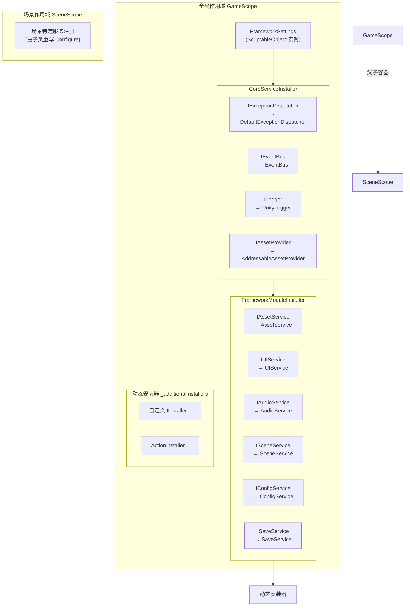
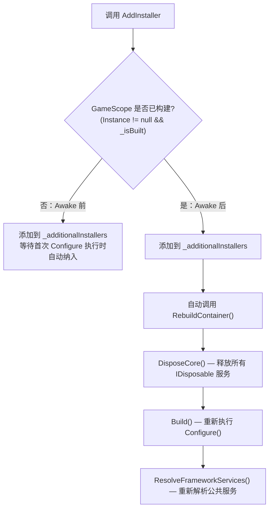

CFramework 的依赖注入体系建立在 **VContainer** 之上，通过两级作用域（`GameScope` / `SceneScope`）和模块化安装器（`IInstaller`）实现服务注册与解耦。本页将深入剖析这套体系的核心架构——从容器的分层设计、安装器的执行顺序，到运行时动态注册与容器重建机制——帮助你理解框架"如何把所有服务组装在一起"这一根本问题。

Sources: [GameScope.cs](Runtime/Core/DI/GameScope.cs#L1-L214), [InstallerExtensions.cs](Runtime/Core/DI/InstallerExtensions.cs#L1-L39)

## 架构总览：两级作用域与安装器协作

CFramework 的 DI 容器采用 **全局作用域 + 场景作用域** 的双层结构。`GameScope` 作为全局唯一的根容器，承载框架所有核心服务与功能模块的注册；`SceneScope` 则作为场景级别的子容器，用于注册场景特有的依赖。两者均继承自 VContainer 的 `LifetimeScope`，自动建立父子容器关系——场景内的解析请求会沿继承链向上委托到全局容器，实现**服务共享与作用域隔离**的统一。



上图揭示了容器构建的三个阶段：首先注册全局配置（`FrameworkSettings`），然后由 `CoreServiceInstaller` 注册底层基础服务，接着 `FrameworkModuleInstaller` 注册依赖这些基础服务的功能模块，最后执行所有用户动态添加的安装器。这个**严格有序的分层注册**确保了依赖关系的正确解析——上层服务可以被下层注入，反之则不行。

Sources: [GameScope.cs](Runtime/Core/DI/GameScope.cs#L77-L95), [CoreServiceInstaller.cs](Runtime/Core/DI/CoreServiceInstaller.cs#L1-L23), [FrameworkModuleInstaller.cs](Runtime/Core/DI/FrameworkModuleInstaller.cs#L1-L28)

## 安装器机制：模块化服务注册的基石

### IInstaller 接口与扩展方法

VContainer 提供了 `IInstaller` 接口，其契约极为简洁——接收 `IContainerBuilder`，在内部完成服务注册。CFramework 在此基础上通过 `InstallerExtensions` 提供了两个关键扩展方法：

| 扩展方法 | 签名 | 用途 |
|----------|------|------|
| `Install` | `builder.Install(IInstaller)` | 执行任意 `IInstaller` 实例的注册逻辑，空值安全 |
| `InstallModule` | `builder.InstallModule<TInterface, TImpl>()` | 以 **EntryPoint** 模式注册模块服务（接口→实现，默认单例） |

`InstallModule` 的设计尤为值得注意。它调用 `RegisterEntryPoint<TImplementation>(lifetime).As<TInterface>()`，这意味着实现类不仅作为单例注册到接口类型，同时被注册为 VContainer 的 **EntryPoint**——框架自动调用其 `IStartable.Start()` 和 `IDisposable.Dispose()` 等生命周期方法，无需手动管理。

Sources: [InstallerExtensions.cs](Runtime/Core/DI/InstallerExtensions.cs#L16-L37)

### 内置安装器的职责划分

框架将服务注册拆分为两个内置安装器，遵循**核心依赖先行**的原则：

**CoreServiceInstaller** 注册四个无外部依赖的基础设施服务：

| 接口 | 实现 | 生命周期 | 职责 |
|------|------|----------|------|
| `IExceptionDispatcher` | `DefaultExceptionDispatcher` | Singleton | 统一异常捕获与分发 |
| `IEventBus` | `EventBus` | Singleton | 同步/异步事件发布订阅 |
| `ILogger` | `UnityLogger` | Singleton | 分级日志输出 |
| `IAssetProvider` | `AddressableAssetProvider` | Singleton | 底层资源加载抽象层 |

**FrameworkModuleInstaller** 注册六个功能模块服务，这些模块通过构造函数注入消费核心服务与 `FrameworkSettings`。例如 `AssetService` 的构造函数需要 `FrameworkSettings`（获取内存预算配置）和可选的 `IAssetProvider`（底层加载实现）；`UIService` 依赖 `IAssetService` 和 `FrameworkSettings`，形成清晰的依赖层级。注意 `IAudioService` 的注册受 `CFRAMEWORK_AUDIO` 编译符号控制——未启用音频模块时不会注册。

Sources: [CoreServiceInstaller.cs](Runtime/Core/DI/CoreServiceInstaller.cs#L15-L21), [FrameworkModuleInstaller.cs](Runtime/Core/DI/FrameworkModuleInstaller.cs#L16-L26), [AssetService.cs](Runtime/Asset/AssetService.cs#L22-L29), [UIService.cs](Runtime/UI/UIService.cs#L20-L30)

### ActionInstaller：轻量级委托注册

当注册逻辑简单到不值得创建一个独立的类时，`ActionInstaller` 提供了快速通道。它将一个 `Action<IContainerBuilder>` 委托包装为 `IInstaller`：

```csharp
// 使用 ActionInstaller 快速注册一个自定义服务
GameScope.AddInstaller(new ActionInstaller(builder =>
{
    builder.Register<IPlayerService, PlayerService>(Lifetime.Singleton);
}));

// 或使用更简洁的委托重载（内部自动创建 ActionInstaller）
GameScope.AddInstaller(builder =>
{
    builder.Register<IPlayerService, PlayerService>(Lifetime.Singleton);
});
```

两种写法等价——`AddInstaller` 的委托重载内部会自动创建 `ActionInstaller` 实例。这体现了 CFramework 对**便捷性与规范性**的平衡：简单的注册用委托，复杂的模块化注册实现 `IInstaller` 接口。

Sources: [ActionInstaller.cs](Runtime/Core/DI/ActionInstaller.cs#L1-L32), [GameScope.cs](Runtime/Core/DI/GameScope.cs#L149-L178)

## GameScope：全局容器的完整生命周期

### 单例保障与跨场景持久

`GameScope` 继承自 VContainer 的 `LifetimeScope`，在 `Awake` 中实现了经典的单例守护逻辑：如果已存在另一个实例，则销毁自身并退出。通过 `DontDestroyOnLoad` 确保全局作用域跨场景存活，这意味着所有注册为 Singleton 的服务在整个游戏运行期间始终可用。静态属性 `Instance` 提供全局访问点，在 `OnDestroy` 时清理为 `null`。

Sources: [GameScope.cs](Runtime/Core/DI/GameScope.cs#L37-L66)

### 容器构建流程

`GameScope.Configure(IContainerBuilder)` 在 `Awake` 期间被 VContainer 自动调用，执行以下注册序列：

```
1. FrameworkSettings 注册
   ├── 优先使用 Inspector 中拖入的 _settings 实例
   └── 若为空，则通过 Resources.Load 加载默认配置

2. 内置安装器执行（按数组顺序）
   ├── CoreServiceInstaller.Install()    → 注册 4 个核心服务
   └── FrameworkModuleInstaller.Install() → 注册 6 个功能模块

3. 动态安装器执行（按添加顺序）
   └── 逐一调用 _additionalInstallers 中的 Install()
```

构建完成后，`Start()` 中调用 `ResolveFrameworkServices()` 将九个框架公共服务解析到 `GameScope` 的公共属性上（`Logger`、`EventBus`、`ExceptionDispatcher`、`AssetService`、`AudioService`、`SceneService`、`ConfigService`、`SaveService`、`UIService`）。这是一个**便利层**——你既可以通过 `GameScope.Instance.AssetService` 快速访问，也可以在任意被容器管理的类中通过构造函数注入获取。

Sources: [GameScope.cs](Runtime/Core/DI/GameScope.cs#L77-L113)

### 静态状态清理与 Domain Reload 防护

Unity 的 Enter Play Mode 设置中若禁用了 Domain Reload，静态字段会跨越 Play 模式保留。CFramework 通过 `[RuntimeInitializeOnLoadMethod(RuntimeInitializeLoadType.SubsystemRegistration)]` 标注的 `ResetStaticState()` 方法，在每次进入 Play 模式时自动清空 `_additionalInstallers` 列表，防止上一轮 Play 残留的安装器污染新一轮的容器构建。

Sources: [GameScope.cs](Runtime/Core/DI/GameScope.cs#L71-L75)

## 动态安装器：运行时服务注册与容器重建

### 添加时机的两种分支

`GameScope.AddInstaller` 的核心设计在于**感知容器状态**，根据调用时机走不同的路径：



**Awake 前调用**：安装器被添加到静态列表，当 `Configure` 执行时自然会被遍历到。这适用于游戏启动的早期初始化阶段，例如在 `RuntimeInitializeOnLoadMethod` 中预注册服务。

**Awake 后调用**：安装器被添加后立即触发 `RebuildContainer()`。这是一个**重量级操作**——它会释放当前容器中所有实现了 `IDisposable` 的服务，然后从头重建容器并重新解析。这适用于游戏运行时的模块热加载场景（如下载 DLC 后注册新模块），但需谨慎使用。

Sources: [GameScope.cs](Runtime/Core/DI/GameScope.cs#L141-L210)

### RebuildContainer 的代价与注意事项

容器重建是不可忽视的开销。`RebuildContainer()` 执行三个步骤：`DisposeCore()` 释放旧容器中所有 `IDisposable` 服务 → `Build()` 从零执行 `Configure` → `ResolveFrameworkServices()` 重新解析九个公共服务属性。这意味着：

- 所有持有旧服务引用的外部对象将指向已释放的实例，需要重新获取
- 服务的状态（如 `EventBus` 中的订阅关系、`AssetService` 中的缓存资源）将丢失
- 因此，动态安装器的添加应尽量集中在游戏启动阶段，避免在游戏运行中频繁触发重建

Sources: [GameScope.cs](Runtime/Core/DI/GameScope.cs#L205-L210)

### 安装器的移除与清理

框架提供了三个管理动态安装器的 API：

| 方法 | 行为 | 是否自动重建 |
|------|------|:------------:|
| `RemoveInstaller(IInstaller)` | 从列表移除指定安装器 | ✗ |
| `ClearInstallers()` | 清空所有动态安装器 | ✗ |
| `RebuildContainer()` | 手动触发完整重建 | — (本身就是重建) |

移除操作不会自动触发重建，因为移除后你可能还需要添加新的安装器。建议在批量修改完成后手动调用 `RebuildContainer()` 使变更生效。

Sources: [GameScope.cs](Runtime/Core/DI/GameScope.cs#L186-L210)

## SceneScope：场景级服务隔离

`SceneScope` 是一个极简的场景作用域基类，仅提供空的 `Configure` 方法供子类重写。它的设计哲学是**最小干预**——框架不预设任何场景级服务，完全由项目根据场景需求自行注册。

```csharp
// 示例：战斗场景的专属作用域
public class BattleSceneScope : SceneScope
{
    protected override void Configure(IContainerBuilder builder)
    {
        // 注册场景特有服务
        builder.Register<IBattleSystem, BattleSystem>(Lifetime.Singleton);
        builder.Register<IEnemySpawner, EnemySpawner>(Lifetime.Singleton);
    }
}
```

由于 `SceneScope` 继承自 `LifetimeScope`，VContainer 自动将其识别为 `GameScope` 的子容器。这意味着 `BattleSystem` 的构造函数中可以直接注入 `IEventBus`、`IAssetService` 等全局服务——解析请求会沿父子链向上委托到 `GameScope` 的容器。当场景卸载时，`SceneScope` 随 GameObject 销毁，其注册的场景级服务也被自动释放，不会污染其他场景。

Sources: [SceneScope.cs](Runtime/Core/DI/SceneScope.cs#L1-L16)

## 服务注册模式解析：EntryPoint 与构造函数注入

### InstallModule 的 EntryPoint 注册

`InstallModule<TInterface, TImplementation>()` 的实现使用了 `RegisterEntryPoint` 而非普通的 `Register`，这是一个关键的设计决策：

```csharp
// InstallerExtensions.cs 中的核心实现
public static RegistrationBuilder InstallModule<TInterface, TImplementation>(
    this IContainerBuilder builder,
    Lifetime lifetime = Lifetime.Singleton)
    where TImplementation : class, TInterface
    where TInterface : class
{
    return builder.RegisterEntryPoint<TImplementation>(lifetime).As<TInterface>();
}
```

使用 `RegisterEntryPoint` 注册的服务，VContainer 会在容器构建完成后自动检测其实现的接口并调用对应方法：

| 接口 | 自动调用时机 |
|------|-------------|
| `IStartable` | 容器构建完成后调用 `Start()` |
| `IDisposable` | 容器销毁时调用 `Dispose()` |
| `IAsyncStartable` | 容器构建后异步调用 `StartAsync()` |

这解释了为什么 `UIService` 同时实现了 `IUIService`、`IStartable` 和 `IDisposable`——它被注册为 EntryPoint 后，VContainer 在 `GameScope` 的 `Start` 阶段自动调用 `UIService.Start()` 完成初始化，在作用域销毁时自动调用 `Dispose()` 清理资源。`SceneService` 同样遵循此模式。

Sources: [InstallerExtensions.cs](Runtime/Core/DI/InstallerExtensions.cs#L30-L37), [UIService.cs](Runtime/UI/UIService.cs#L20-L21), [SceneService.cs](Runtime/Scene/SceneService.cs#L13-L14)

### 构造函数注入的依赖链

以 `AssetService` 为例，其构造函数声明了两个依赖：

```csharp
public AssetService(FrameworkSettings settings, IAssetProvider provider = null)
{
    _provider = provider ?? new AddressableAssetProvider();
    MemoryBudget = new AssetMemoryBudget
    {
        BudgetBytes = settings.MemoryBudgetMB * 1024L * 1024L
    };
}
```

VContainer 在解析 `IAssetService` 时会自动注入这两个参数：`FrameworkSettings` 已在 `Configure` 最开始注册为实例，`IAssetProvider` 已由 `CoreServiceInstaller` 注册。由于 `provider` 参数有默认值 `null`，即使没有注册 `IAssetProvider`，构造也能成功（回退到默认实现），这为测试场景提供了灵活性——直接传入 `MockAssetProvider` 即可绕过真实的 Addressables 调用。

Sources: [AssetService.cs](Runtime/Asset/AssetService.cs#L22-L29)

## 实战指南：扩展依赖注入体系

### 注册自定义服务（启动时）

如果你的自定义服务需要在游戏启动时就绑定到全局容器，推荐在 `GameScope.Create()` 之前通过 `AddInstaller` 注册：

```csharp
// GameEntry.cs
public class GameEntry : MonoBehaviour
{
    [SerializeField] private FrameworkSettings settings;

    private async UniTaskVoid Start()
    {
        // 在创建 GameScope 前注册自定义服务
        GameScope.AddInstaller(new GameServiceInstaller());

        // 创建全局作用域（Configure 执行时自动包含上面的安装器）
        var scope = GameScope.Create(settings);

        // 后续初始化...
    }
}

// 独立安装器类（推荐用于复杂注册逻辑）
public class GameServiceInstaller : IInstaller
{
    public void Install(IContainerBuilder builder)
    {
        builder.Register<IPlayerService, PlayerService>(Lifetime.Singleton);
        builder.Register<IInventoryService, InventoryService>(Lifetime.Singleton);
    }
}
```

Sources: [GameScope.cs](Runtime/Core/DI/GameScope.cs#L116-L127)

### 注册自定义服务（运行时动态）

如果需要在游戏运行过程中动态注册（例如热更新模块），使用 `AddInstaller` 的委托重载：

```csharp
// 游戏运行中动态注册 DLC 模块
public void OnDlcDownloaded()
{
    GameScope.AddInstaller(builder =>
    {
        builder.Register<IDlcContentService, DlcContentService>(Lifetime.Singleton);
    });
    // 容器自动重建，新服务立即可用
}
```

Sources: [GameScope.cs](Runtime/Core/DI/GameScope.cs#L170-L178)

### 在测试中替换服务

框架的分层注入设计天然支持测试替换。你可以通过构造函数直接传入 Mock 实现来绕过 DI 容器：

```csharp
// 测试中使用 MockAssetProvider 替换真实资源加载
[Test]
public void TestWithMockProvider()
{
    var settings = ScriptableObject.CreateInstance<FrameworkSettings>();
    var mockProvider = new MockAssetProvider();
    var assetService = new AssetService(settings, mockProvider);
    // 直接构造，跳过 DI 容器
}
```

框架的 `MockAssetProvider` 是一个完整的内存模拟实现，支持注册模拟资源、记录释放操作、模拟加载延迟，专为单元测试设计。

Sources: [MockAssetProvider.cs](Tests/Runtime/Asset/MockAssetProvider.cs#L1-L32)

更多关于测试替换模式的细节，参考 [单元测试指南：测试覆盖策略与 Mock 替换模式](22-dan-yuan-ce-shi-zhi-nan-ce-shi-fu-gai-ce-lue-yu-mock-ti-huan-mo-shi)。关于自定义 `IInstaller` 的完整扩展指南，参考 [框架扩展指南：自定义 IInstaller、IAssetProvider 与 ISceneTransition](23-kuang-jia-kuo-zhan-zhi-nan-zi-ding-yi-iinstaller-iassetprovider-yu-iscenetransition)。

## 延伸阅读

理解依赖注入体系后，建议按以下顺序继续深入：

- [事件总线：同步/异步发布订阅与 R3 响应式集成](6-shi-jian-zong-xian-tong-bu-yi-bu-fa-bu-ding-yue-yu-r3-xiang-ying-shi-ji-cheng) — 了解 `IEventBus` 如何通过 DI 容器全局可用
- [资源管理服务：Addressables 封装、引用计数与生命周期绑定](10-zi-yuan-guan-li-fu-wu-addressables-feng-zhuang-yin-yong-ji-shu-yu-sheng-ming-zhou-qi-bang-ding) — 查看 `IAssetService` 如何依赖 `IAssetProvider` 实现分层解耦
- [游戏入口与生命周期：GameScope 创建与服务初始化流程](4-you-xi-ru-kou-yu-sheng-ming-zhou-qi-gamescope-chuang-jian-yu-fu-wu-chu-shi-hua-liu-cheng) — 回顾 GameScope 的使用方式与初始化时机