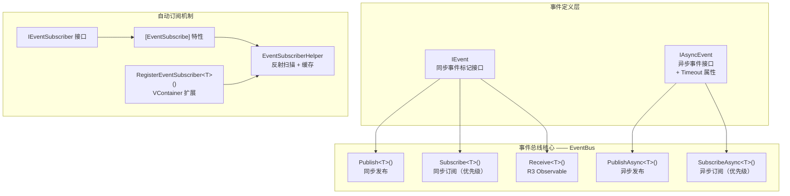
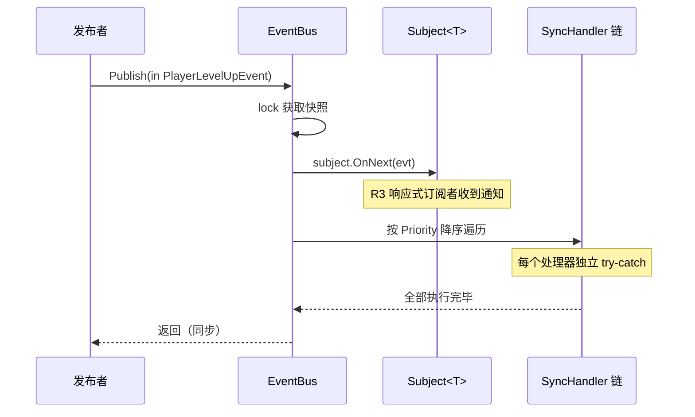
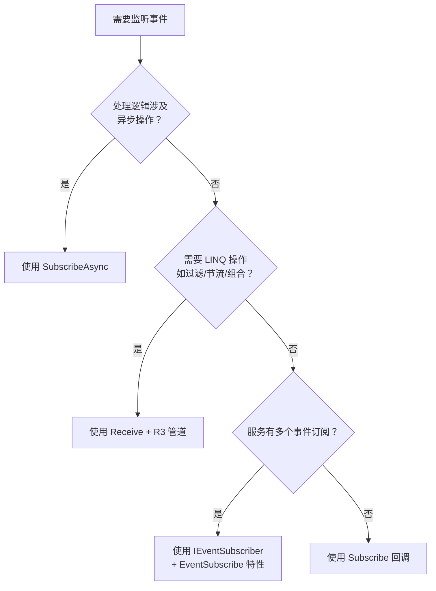

事件总线是 CFramework 核心基础设施中的**进程内消息中枢**，为游戏各模块提供解耦通信能力。它在一个统一的 `IEventBus` 接口中融合了三种互补的事件消费模式——**同步回调**、**异步管线**、**R3 响应式流**——并通过优先级调度、异常隔离、超时防护等机制保障生产环境的健壮性。本文将深入剖析其架构设计、运行机制与最佳实践。

Sources: [IEventBus.cs](Runtime/Core/Event/IEventBus.cs#L1-L44), [EventBus.cs](Runtime/Core/Event/EventBus.cs#L1-L223)

## 架构总览：三层事件处理模型

事件总线采用**分层路由**设计：同步事件经过两条并行路径（R3 Subject 广播 + 优先级回调链），异步事件走独立的顺序管线。这种分层确保了响应式与命令式消费方式可以独立运作、互不干扰。



Sources: [IEvent.cs](Runtime/Core/Event/IEvent.cs#L1-L22), [EventBus.cs](Runtime/Core/Event/EventBus.cs#L1-L34)

## 事件契约：IEvent 与 IAsyncEvent

所有事件必须实现标记接口 `IEvent`（同步）或 `IAsyncEvent`（异步）。框架推荐使用 **struct** 定义事件类型以避免 GC 分配——`Publish<T>(in T evt)` 使用了 `in` 参数修饰符，对 struct 事件实现了零拷贝传递。

```csharp
// 同步事件 — 推荐使用 struct
public struct PlayerLevelUpEvent : IEvent
{
    public int PlayerId;
    public int NewLevel;
}

// 异步事件 — 携带超时配置
public class SaveDataEvent : IAsyncEvent
{
    public string SlotId;
    public SaveData Data;

    // 覆盖默认 5 秒超时
    public TimeSpan Timeout => TimeSpan.FromSeconds(10);
}
```

`IAsyncEvent` 继承自 `IEvent`，并额外提供 `Timeout` 属性（默认 5 秒）。在异步发布时，总线会将此超时与调用方传入的 `CancellationToken` 组合为**链接取消令牌**，确保任何一方触发取消都能终止处理流程。

Sources: [IEvent.cs](Runtime/Core/Event/IEvent.cs#L1-L22)

## 同步事件通道

同步通道是事件总线最基础的使用方式。`Publish` 方法在调用线程上**同步**执行所有注册的处理器，执行顺序由优先级决定。

### 发布流程



发布过程分为两个阶段：**先触发 R3 Subject**（供 `Receive<T>()` 的响应式订阅者消费），**再执行优先级回调链**。这意味着响应式订阅者总是先于命令式回调收到事件。两个阶段在同一个 `lock` 快照下工作——发布时先复制 handler 列表，再在锁外执行，避免了死锁风险。

Sources: [EventBus.cs](Runtime/Core/Event/EventBus.cs#L40-L73)

### 优先级调度

每个同步订阅可指定 `priority` 参数（默认 0），**值越大越先执行**。相同优先级的处理器按订阅顺序执行。内部使用**降序插入排序**维护有序列表：

```csharp
// 订阅时指定优先级
eventBus.Subscribe<PlayerLevelUpEvent>(OnLevelUp_HighPriority, priority: 100);
eventBus.Subscribe<PlayerLevelUpEvent>(OnLevelUp_NormalPriority, priority: 10);
eventBus.Subscribe<PlayerLevelUpEvent>(OnLevelUp_LowPriority, priority: 0);
```

Sources: [EventBus.cs](Runtime/Core/Event/EventBus.cs#L75-L105), [IEventBus.cs](Runtime/Core/Event/IEventBus.cs#L29-L31)

### 异常隔离

这是事件总线设计中一个关键的健壮性特性：**单个处理器的异常不会中断其余处理器的执行**。每个处理器都被独立的 `try-catch` 包裹，异常通过 `OnHandlerError` 回调上报。

```csharp
eventBus.OnHandlerError = (exception, evt, handler) =>
{
    Debug.LogError($"事件处理异常: {evt.GetType().Name}, 错误: {exception.Message}");
};
```

`OnHandlerError` 回调接收三个参数：异常对象、触发异常的事件实例、以及引发异常的处理器委托。这使得上层可以精确记录是哪个处理逻辑出了问题。

Sources: [EventBus.cs](Runtime/Core/Event/EventBus.cs#L64-L72)

## 异步事件通道

异步通道为需要 I/O 操作（如网络请求、文件写入、资源加载）的事件处理场景设计。与同步通道的关键区别在于：**异步处理器按优先级顺序依次执行**（非并行），每个处理器必须完成后才执行下一个。

### 异步发布与超时机制

```csharp
// 发布异步事件
await eventBus.PublishAsync(new SaveDataEvent { SlotId = "slot1" });

// 带外部取消令牌
var cts = new CancellationTokenSource();
eventBus.PublishAsync(new SaveDataEvent(), cts.Token);
```

异步发布时，总线自动创建 `CancellationTokenSource.CreateLinkedTokenSource`，将事件自身的 `Timeout` 与调用方传入的 `CancellationToken` 链接。这意味着：

| 取消来源 | 触发条件 | 异常类型 |
|---|---|---|
| 事件超时 | `IAsyncEvent.Timeout` 到期 | `TimeoutException`（通过 `OnHandlerError` 上报） |
| 外部取消 | 调用方取消 `CancellationToken` | `OperationCanceledException`（正常传播） |
| 处理器异常 | 处理器内部抛出非取消异常 | 原始异常（通过 `OnHandlerError` 上报） |

当超时触发时，异常被捕获并转换为 `TimeoutException` 通过 `OnHandlerError` 通知，**不会中断后续处理器的执行**——与同步通道的异常隔离策略保持一致。

Sources: [EventBus.cs](Runtime/Core/Event/EventBus.cs#L127-L158), [IEventBus.cs](Runtime/Core/Event/IEventBus.cs#L25-L26)

## R3 响应式订阅

`Receive<T>()` 方法将事件暴露为 R3 的 `Observable<T>` 流，支持 LINQ 风格的响应式操作。内部使用**懒创建的 `Subject<T>`**——仅在首次调用 `Receive<T>()` 时创建，不调用则不分配。

```csharp
// 基本订阅
eventBus.Receive<PlayerLevelUpEvent>()
    .Subscribe(e => Debug.Log($"玩家 {e.PlayerId} 升级到 {e.NewLevel}"))
    .AddTo(compositeDisposable);

// 带过滤与节流
eventBus.Receive<DamageEvent>()
    .Where(e => e.Amount > 100)
    .ThrottleFirstFrame(10)
    .Subscribe(e => ShowDamageNumber(e))
    .AddTo(compositeDisposable);
```

`Subject<T>` 是 R3 中的热流（Hot Observable），只有在订阅之后发布的事件才会被接收——它**不会缓存历史事件**。如果需要在订阅时立即获取最新状态，请考虑使用[黑板系统：类型安全的键值对数据共享与响应式观察](8-hei-ban-xi-tong-lei-xing-an-quan-de-jian-zhi-dui-shu-ju-gong-xiang-yu-xiang-ying-shi-guan-cha)中的 `ReactiveProperty` 机制。

Sources: [EventBus.cs](Runtime/Core/Event/EventBus.cs#L107-L121), [IEventBus.cs](Runtime/Core/Event/IEventBus.cs#L41-L42)

## 三种订阅模式对比

| 特性 | `Subscribe<T>` | `SubscribeAsync<T>` | `Receive<T>` |
|---|---|---|---|
| 事件类型 | `IEvent` | `IAsyncEvent` | `IEvent` |
| 执行模式 | 同步，同一帧 | 异步，按优先级顺序 await | 响应式流（R3 Observable） |
| 优先级 | ✅ 支持 | ✅ 支持 | ❌ 不支持（先进先出） |
| 异常隔离 | ✅ 独立 try-catch | ✅ 独立 try-catch | 由 R3 管道处理 |
| 超时控制 | — | ✅ 链接取消令牌 | — |
| 典型场景 | UI 刷新、状态同步 | 存档写入、网络通信 | 数据流转换、跨模块绑定 |
| 返回类型 | `IDisposable` | `IDisposable` | `Observable<T>` |

Sources: [IEventBus.cs](Runtime/Core/Event/IEventBus.cs#L1-L44)

## 自动订阅机制：IEventSubscriber 与特性驱动

对于需要订阅多个事件的服务，框架提供了**声明式自动订阅**能力，通过 `IEventSubscriber` 接口 + `[EventSubscribe]` 特性消除手动订阅的样板代码。

### 工作原理

```mermaid
sequenceDiagram
    participant CB as IContainerBuilder
    participant R as VContainer Resolver
    participant ESH as EventSubscriberHelper
    participant EB as IEventBus
    participant S as IEventSubscriber 实例

    CB->>CB: RegisterEventSubscriber&lt;T&gt;()
    Note over CB: 注册构建回调
    CB->>R: 容器构建完成
    R->>R: 触发 RegisterBuildCallback
    R->>R: Resolve&lt;T&gt;() 获取订阅者
    R->>R: Resolve&lt;IEventBus&gt;()
    R->>ESH: AutoSubscribe(subscriber, eventBus)
    ESH->>ESH: GetOrBuildSubscribeInfos()<br/>反射扫描 [EventSubscribe] 方法
    Note over ESH: 结果缓存在 ConcurrentDictionary
    ESH->>EB: 为每个方法调用 Subscribe()
    EB-->>ESH: 返回 IDisposable
    ESH->>S: 添加到 EventSubscriptions
    Note over S: CompositeDisposable 统一管理
```

### 使用步骤

**第一步**：定义实现 `IEventSubscriber` 的服务类，用 `[EventSubscribe]` 标记事件处理方法：

```csharp
public class GameplayEventSubscriber : IEventSubscriber
{
    public CompositeDisposable EventSubscriptions { get; } = new();

    [EventSubscribe(priority: 10)]
    private void OnPlayerLevelUp(PlayerLevelUpEvent evt)
    {
        Debug.Log($"玩家升级: {evt.NewLevel}");
    }

    [EventSubscribe(priority: 5)]
    private void OnPlayerDeath(PlayerDeathEvent evt)
    {
        // 处理玩家死亡逻辑
    }
}
```

方法签名必须严格为 `void MethodName(T evt)`，其中 `T` 必须实现 `IEvent`。支持 `private` 方法——反射扫描使用 `BindingFlags.NonPublic`。

**第二步**：在 VContainer 安装器中注册：

```csharp
public class GameInstaller : IInstaller
{
    public void Install(IContainerBuilder builder)
    {
        // 方式一：直接注册实现类型
        builder.RegisterEventSubscriber<GameplayEventSubscriber>();

        // 方式二：注册接口-实现映射
        builder.RegisterEventSubscriber<IGameplayEvents, GameplayEventSubscriber>();
    }
}
```

**第三步**：容器销毁时，`CompositeDisposable` 自动释放所有订阅，无需手动清理。

Sources: [IEventSubscriber.cs](Runtime/Core/Event/IEventSubscriber.cs#L1-L17), [EventSubscribeAttribute.cs](Runtime/Core/Event/EventSubscribeAttribute.cs#L1-L24), [EventSubscriberHelper.cs](Runtime/Core/Event/EventSubscriberHelper.cs#L1-L102), [EventSubscriberExtensions.cs](Runtime/Core/Event/EventSubscriberExtensions.cs#L1-L65)

### 反射缓存策略

`EventSubscriberHelper` 使用 `ConcurrentDictionary<Type, List<SubscribeInfo>>` 缓存反射扫描结果。**每个类型只扫描一次**，后续调用直接命中缓存。这意味着即使同一个类型被多次解析（如多场景场景下），反射开销也仅在首次发生。

`[EventSubscribe]` 特性继承自 `PreserveAttribute`（Unity 的代码裁剪保护标记），确保在 IL2CPP 构建中，被标记的方法不会被 strip 掉。

Sources: [EventSubscriberHelper.cs](Runtime/Core/Event/EventSubscriberHelper.cs#L17-L51), [EventSubscribeAttribute.cs](Runtime/Core/Event/EventSubscribeAttribute.cs#L12-L13)

## 容器注册与生命周期

`EventBus` 在 `CoreServiceInstaller` 中以 **Singleton** 生命周期注册到 VContainer 容器，通过 `GameScope` 管理其完整生命周期：

```csharp
// CoreServiceInstaller.cs — 容器注册
builder.Register<IEventBus, EventBus>(Lifetime.Singleton);
```

`EventBus` 实现了 `IDisposable`，在 `GameScope` 销毁（容器释放）时自动调用 `Dispose`，清理所有 `Subject` 和处理器列表。由于容器重建（`RebuildContainer`）也会触发 `Dispose`，因此不存在内存泄漏风险。

Sources: [CoreServiceInstaller.cs](Runtime/Core/DI/CoreServiceInstaller.cs#L1-L23), [GameScope.cs](Runtime/Core/DI/GameScope.cs#L100-L113), [EventBus.cs](Runtime/Core/Event/EventBus.cs#L25-L34)

## 线程安全设计

`EventBus` 内部使用单一 `lock` 对象保护所有共享状态（`_subjects`、`_syncHandlers`、`_asyncHandlers`）。关键设计决策：

- **发布时快照**：`Publish` 和 `PublishAsync` 在锁内复制 handler 列表，锁外执行回调，**避免在持有锁时调用用户代码**——这是防止死锁的核心策略。
- **懒创建 Subject**：`Receive<T>()` 在首次调用时才创建 `Subject<T>`，无 `Receive` 调用的事件类型不会产生任何分配。
- **Dispose 安全**：`Dispose` 方法在锁内清空所有集合并释放 Subject，与正在执行的发布操作通过锁快照互斥。

Sources: [EventBus.cs](Runtime/Core/Event/EventBus.cs#L14-L34), [EventBus.cs](Runtime/Core/Event/EventBus.cs#L46-L56)

## 实践指南

### 选择正确的订阅模式



### 订阅生命周期管理

无论哪种订阅模式，返回的 `IDisposable` 都需要妥善管理。推荐的清理策略取决于使用场景：

| 场景 | 管理方式 | 示例 |
|---|---|---|
| MonoBehaviour 组件 | `AddTo(gameObject)` 或 `AddTo(this)` | R3 的 Unity 扩展自动随 GameObject 销毁 |
| IEventSubscriber 服务 | `CompositeDisposable EventSubscriptions` | 容器销毁时自动 Dispose |
| 短期逻辑（如动画序列） | `using` 语句或显式 `Dispose` | 逻辑完成后立即释放 |
| 全局静态订阅 | `CompositeDisposable` 集中管理 | 在模块卸载时统一清理 |

### 事件设计建议

- **使用 struct 定义事件**：`Publish<T>(in T evt)` 对 struct 使用 `in` 修饰符，10 万次发布在 500ms 内完成（见基准测试 `E004_StructEventNoBoxing_PerformanceBenchmark`）。
- **事件应携带完整上下文**：避免让消费者再去查询额外信息，事件本身应包含处理所需的全部数据。
- **异步事件合理设置超时**：默认 5 秒适用于大多数场景，网络密集型操作可适当延长。

Sources: [EventBusTests.cs](Tests/Runtime/Core/EventBusTests.cs#L137-L160)

## 延伸阅读

- 事件总线产生的未处理异常可对接[全局异常分发器：统一捕获 UniTask 与 R3 未处理异常](7-quan-ju-yi-chang-fen-fa-qi-tong-buo-unitask-yu-r3-wei-chu-li-yi-chang)进行集中管理。
- 响应式订阅的 `Receive<T>()` 返回的 `Observable<T>` 可与[黑板系统：类型安全的键值对数据共享与响应式观察](8-hei-ban-xi-tong-lei-xing-an-quan-de-jian-zhi-dui-shu-ju-gong-xiang-yu-xiang-ying-shi-guan-cha)中的 `ReactiveProperty` 组合使用，实现状态-事件混合驱动架构。
- `EventBus` 的容器注册由[依赖注入体系：GameScope、SceneScope 与动态安装器机制](5-yi-lai-zhu-ru-ti-xi-gamescope-scenescope-yu-dong-tai-an-zhuang-qi-ji-zhi)管理，理解 DI 体系有助于掌握服务的生命周期。