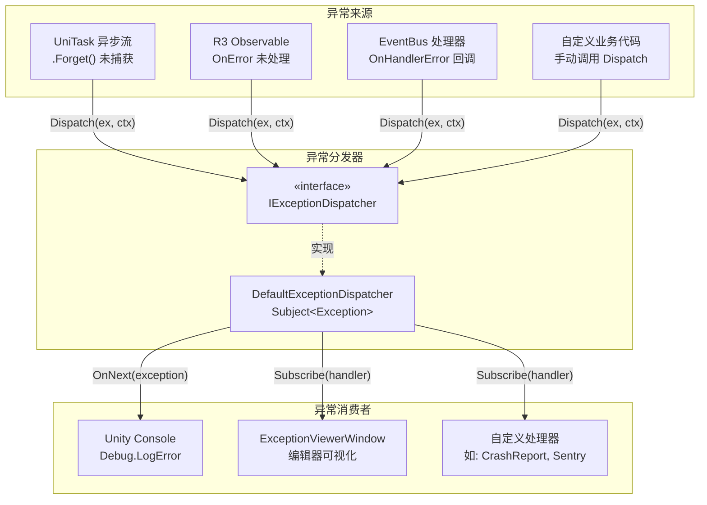
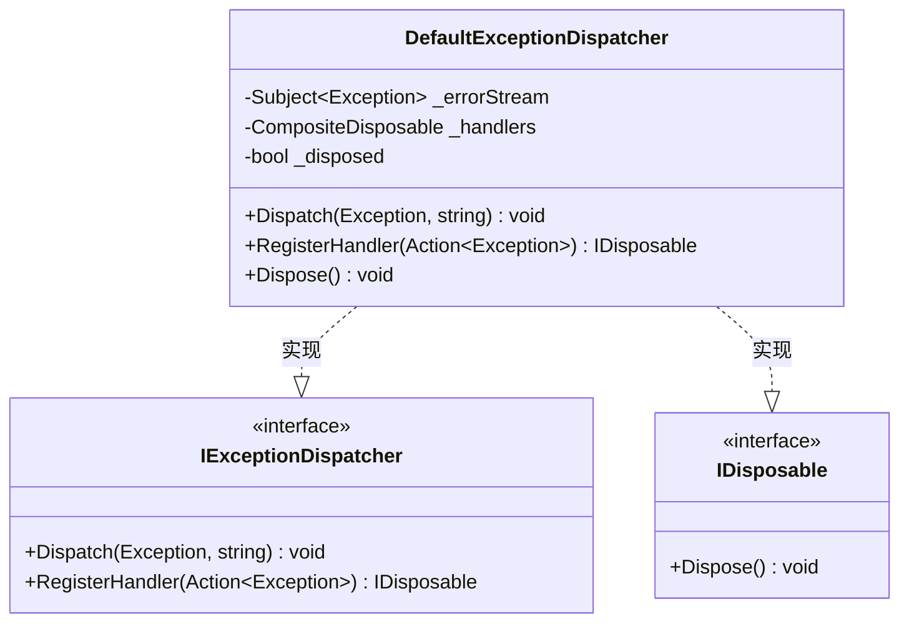
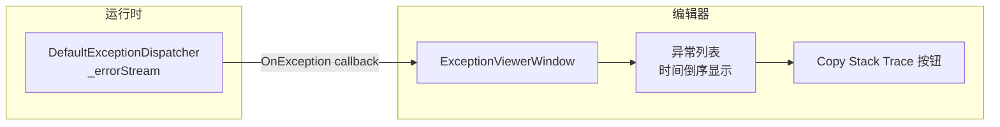

在基于 UniTask 异步流与 R3 响应式编程的 Unity 项目中，异常往往散落在不同的异步回调管道中——忘记 `await` 的 `UniTask.Void`、R3 Observable 的 `OnError` 未被处理、事件总线中某个处理器抛出了意外异常。**IExceptionDispatcher** 提供了一个全局的、基于 R3 Subject 的异常汇聚点：所有未处理异常通过 `Dispatch` 汇入一条统一的数据流，再由任意数量的处理器订阅消费。这套机制将「异常从哪里来」与「异常如何处理」彻底解耦，使得日志记录、错误上报、编辑器可视化等关注点可以独立扩展，互不干扰。

Sources: [IExceptionDispatcher.cs](Runtime/Core/Exception/IExceptionDispatcher.cs#L1-L25), [DefaultExceptionDispatcher.cs](Runtime/Core/Exception/DefaultExceptionDispatcher.cs#L1-L45)

## 设计动机与架构定位

### 问题：异步与响应式场景中的异常黑洞

Unity 的同步调用栈在 `try-catch` 中清晰可追踪，但 UniTask 和 R3 将执行拆散为多个异步帧与 Observable 管道。以下场景中异常极易静默丢失：UniTask 的 `.Forget()` 调用如果未包裹 `try-catch`，异常会被 UniTask 内部静默吞掉；R3 的 Observable 链如果没有 `.Subscribe(onNext, onError)` 中的 `onError` 回调，异常同样无迹可寻。更关键的是，这些异常来源分散在不同的服务和模块中，如果每个模块自行处理，会导致日志格式不统一、错误上报逻辑重复、以及编辑器调试时难以集中查看。

### 解决方案：观察者模式驱动的异常汇聚

CFramework 选择引入一个全局的 **异常分发器**作为中间层。它的核心思路是：异常的生产者只需要调用 `Dispatch`，不需要关心谁来处理；异常的消费者只需要 `RegisterHandler`，不需要关心异常从哪来。两者通过 R3 的 `Subject<Exception>` 连接——这是一个标准的观察者模式实现，但借助 R3 的 `CompositeDisposable` 获得了干净的订阅生命周期管理。

下面的架构图展示了异常分发器在框架中的位置与数据流向：



Sources: [IExceptionDispatcher.cs](Runtime/Core/Exception/IExceptionDispatcher.cs#L1-L25), [DefaultExceptionDispatcher.cs](Runtime/Core/Exception/DefaultExceptionDispatcher.cs#L1-L45), [ExceptionViewerWindow.cs](Editor/Windows/Tools/ExceptionViewerWindow.cs#L1-L92)

## 接口契约：IExceptionDispatcher

`IExceptionDispatcher` 定义了两个成员，构成一个极简但完整的契约：

| 成员 | 签名 | 职责 |
|------|------|------|
| **Dispatch** | `void Dispatch(Exception exception, string context = null)` | 将异常推入分发流，同时输出到 Unity Console |
| **RegisterHandler** | `IDisposable RegisterHandler(Action<Exception> handler)` | 注册异常处理器，返回值用于取消订阅 |

**`Dispatch` 方法的 `context` 参数**是一个可选的上下文字符串，用于标注异常来源。例如传入 `"AssetService.LoadAsync"` 可以在日志中清晰区分该异常来自资源加载模块而非 UI 模块。当 `context` 为空时，日志仅输出异常类型、消息和堆栈；当 `context` 非空时，日志格式为 `[CFramework Exception] Context: {context}`。

**`RegisterHandler` 返回 `IDisposable`** 是一个经过深思熟虑的设计：调用方通过 `using` 或手动 `.Dispose()` 即可取消订阅，无需维护额外的委托引用或 token 对象。这与 R3/UniTask 生态中普遍使用的可释放订阅模式保持一致。

Sources: [IExceptionDispatcher.cs](Runtime/Core/Exception/IExceptionDispatcher.cs#L9-L24)

## 默认实现：DefaultExceptionDispatcher 内部机制

`DefaultExceptionDispatcher` 是框架内置的唯一实现，其内部结构紧凑而清晰：



### Dispatch 方法的执行流程

当 `Dispatch` 被调用时，执行路径如下：

1. **空值与生命周期守卫**：如果传入的 `exception` 为 `null` 或分发器已被 `Dispose`，方法立即返回，不做任何操作
2. **格式化日志消息**：拼接异常类型名、消息内容和堆栈跟踪，附带可选的上下文信息
3. **输出到 Unity Console**：通过 `Debug.LogError` 输出带 `[CFramework Exception]` 前缀的错误日志
4. **推送到 R3 Subject**：调用 `_errorStream.OnNext(exception)`，将异常广播给所有已注册的处理器

值得注意的是，**日志输出发生在 Subject 广播之前**。这保证了即使所有处理器都已取消注册，异常仍然会被记录到控制台——这是一个安全的兜底策略。

Sources: [DefaultExceptionDispatcher.cs](Runtime/Core/Exception/DefaultExceptionDispatcher.cs#L25-L34)

### RegisterHandler 与订阅生命周期

`RegisterHandler` 的实现利用了 R3 的响应式基础设施：

- 每次调用 `RegisterHandler`，都会在 `_errorStream`（R3 Subject）上执行一次 `Subscribe`，得到一个订阅令牌
- 这个订阅令牌同时被添加到 `_handlers`（`CompositeDisposable`）中集中管理
- 返回的 `IDisposable` 就是这个订阅令牌本身——调用方 `Dispose` 它即可取消单个处理器
- 当 `DefaultExceptionDispatcher.Dispose()` 被调用时，`_handlers.Dispose()` 会一次性释放所有订阅，`_errorStream.Dispose()` 会关闭 Subject

Sources: [DefaultExceptionDispatcher.cs](Runtime/Core/Exception/DefaultExceptionDispatcher.cs#L36-L43)

### Dispose 的安全语义

`DefaultExceptionDispatcher` 实现了 `IDisposable`，其 `Dispose` 方法遵循以下语义：

| Dispose 后的行为 | 具体表现 |
|------------------|----------|
| `Dispatch` 调用 | 静默返回，不输出日志、不推送 Subject |
| `RegisterHandler` 调用 | 仍可执行，但 Subject 已关闭，新注册的处理器不会收到任何异常 |
| 已注册的处理器 | 通过 `CompositeDisposable.Dispose()` 全部解除订阅 |

这种「Dispose 后安全降级」的设计确保了在游戏关闭或作用域销毁时不会产生空引用异常或意外回调。

Sources: [DefaultExceptionDispatcher.cs](Runtime/Core/Exception/DefaultExceptionDispatcher.cs#L16-L23)

## DI 注册与全局访问

### 容器注册：CoreServiceInstaller

异常分发器作为框架核心基础设施，在 `CoreServiceInstaller` 中以 **单例生命周期** 注册到 VContainer DI 容器。它是第一个被注册的服务，紧随其后的是事件总线、日志系统和资源加载提供者——这体现了它在框架依赖链中的基础地位：

```csharp
// CoreServiceInstaller.Install 中的注册顺序
builder.Register<IExceptionDispatcher, DefaultExceptionDispatcher>(Lifetime.Singleton);
builder.Register<IEventBus, EventBus>(Lifetime.Singleton);
builder.Register<ILogger, UnityLogger>(Lifetime.Singleton);
builder.Register<IAssetProvider, AddressableAssetProvider>(Lifetime.Singleton);
```

Sources: [CoreServiceInstaller.cs](Runtime/Core/DI/CoreServiceInstaller.cs#L15-L21)

### GameScope 解析与公共属性

`GameScope` 在 `Start` 阶段通过 `Container.Resolve<IExceptionDispatcher>()` 将分发器解析为公共属性 `ExceptionDispatcher`。这意味着任何持有 `GameScope` 引用的代码都可以直接访问分发器：

```csharp
// 通过 GameScope 访问
GameScope.Instance.ExceptionDispatcher.Dispatch(ex, "MyModule");
```

同时，由于分发器注册在 DI 容器中，任何通过构造函数注入 `[Inject] IExceptionDispatcher` 的服务也能自动获得实例——这是两种并行的访问方式。

Sources: [GameScope.cs](Runtime/Core/DI/GameScope.cs#L100-L113)

## 编辑器集成：ExceptionViewerWindow

框架提供了一个编辑器窗口 **Exception Viewer**，它是 `IExceptionDispatcher` 的一个实际消费者。通过菜单 `CFramework > Exception Viewer` 打开后，窗口会在运行时自动订阅异常分发器，将所有经过 `Dispatch` 的异常以时间倒序展示在列表中：



窗口的关键行为包括：

| 特性 | 说明 |
|------|------|
| **自动连接** | `OnEnable` 时检查 `GameScope.Instance` 是否存在，存在则自动订阅分发器 |
| **实时刷新** | 每收到一个异常调用 `Repaint()` 刷新界面 |
| **时间戳标记** | 每条异常记录精确到秒的时间戳，格式 `[HH:mm:ss]` |
| **堆栈复制** | 每条异常提供「Copy Stack Trace」按钮，一键复制到系统剪贴板 |
| **清除功能** | 工具栏提供 Clear 按钮清空已收集的异常列表 |

Sources: [ExceptionViewerWindow.cs](Editor/Windows/Tools/ExceptionViewerWindow.cs#L1-L92)

## 实战指南：如何使用异常分发器

### 场景一：在 UniTask 异步流中捕获异常

在 UniTask 的 `.Forget()` 调用中使用分发器捕获未处理异常，是最常见的使用场景：

```csharp
// 注入异常分发器
[Inject] private IExceptionDispatcher _exceptionDispatcher;

private void Start()
{
    LoadGameDataAsync().Forget();
}

private async UniTaskVoid LoadGameDataAsync()
{
    try
    {
        var data = await _assetService.LoadAsync<GameData>("GameData");
        ProcessData(data);
    }
    catch (Exception ex)
    {
        // 统一分发，而非直接 Debug.LogError
        _exceptionDispatcher.Dispatch(ex, "GameLoader.LoadGameDataAsync");
    }
}
```

### 场景二：注册自定义异常处理器

注册一个将异常上报到远程服务器的处理器：

```csharp
public class CrashReportService : IStartable, IDisposable
{
    private readonly IExceptionDispatcher _dispatcher;
    private IDisposable _subscription;

    public CrashReportService(IExceptionDispatcher dispatcher)
    {
        _dispatcher = dispatcher;
    }

    public void Start()
    {
        _subscription = _dispatcher.RegisterHandler(OnException);
    }

    private void OnException(Exception ex)
    {
        // 上报到 Sentry、Bugsnag 等服务
        CrashReportClient.Send(ex);
    }

    public void Dispose()
    {
        _subscription?.Dispose();
    }
}
```

### 场景三：与 EventBus 的 OnHandlerError 集成

`EventBus` 提供了独立的 `OnHandlerError` 回调用于捕获事件处理器中的异常。可以将它与异常分发器桥接，实现全链路异常汇聚：

```csharp
public class EventBusErrorBridge : IStartable
{
    private readonly IEventBus _eventBus;
    private readonly IExceptionDispatcher _exceptionDispatcher;

    public EventBusErrorBridge(IEventBus eventBus, IExceptionDispatcher exceptionDispatcher)
    {
        _eventBus = eventBus;
        _exceptionDispatcher = exceptionDispatcher;
    }

    public void Start()
    {
        _eventBus.OnHandlerError = (ex, evt, handler) =>
        {
            _exceptionDispatcher.Dispatch(ex, $"EventBus.{evt.GetType().Name}");
        };
    }
}
```

Sources: [IEventBus.cs](Runtime/Core/Event/IEventBus.cs#L14-L16), [EventBus.cs](Runtime/Core/Event/EventBus.cs#L36)

## 设计决策与边界说明

### 为什么使用 Subject 而非 C# event？

C# 的 `event Action<Exception>` 也能实现类似的发布-订阅功能，但 `DefaultExceptionDispatcher` 选择 R3 的 `Subject<Exception>` 有三个原因：

| 维度 | C# event | R3 Subject |
|------|----------|------------|
| **取消订阅** | 需要 `-=` 运算符和原始委托引用 | 返回 `IDisposable`，支持 `using` 模式 |
| **生命周期管理** | 手动追踪每个委托 | `CompositeDisposable` 统一释放 |
| **与 R3 生态兼容** | 需要适配层 | 直接参与 R3 的 LINQ 管道，支持 `.Where`、`.Buffer` 等操作 |

Sources: [DefaultExceptionDispatcher.cs](Runtime/Core/Exception/DefaultExceptionDispatcher.cs#L12-L13)

### 为什么 Dispatch 同时写日志和推送 Subject？

这是一个「双重输出」的设计：`Debug.LogError` 确保即使没有任何处理器注册，异常也不会完全静默；`Subject.OnNext` 确保处理器仍然可以执行自定义逻辑（如上报、弹窗提示）。两者职责不同——日志面向开发者即时调试，处理器面向系统级响应。

Sources: [DefaultExceptionDispatcher.cs](Runtime/Core/Exception/DefaultExceptionDispatcher.cs#L25-L34)

### 接口与实现分离的意义

将 `IExceptionDispatcher` 定义为接口而非具体类，允许项目通过 VContainer 注册自定义实现替换默认行为。例如，一个测试专用的实现可以不输出日志、只记录异常到列表中供断言使用。测试用例中直接 `new DefaultExceptionDispatcher()` 验证行为，无需启动 DI 容器。

Sources: [ExceptionDispatcherTests.cs](Tests/Runtime/Core/ExceptionDispatcherTests.cs#L14-L17)

## 测试覆盖

`ExceptionDispatcherTests` 验证了分发器的全部核心行为：

| 测试用例 | 验证内容 |
|----------|----------|
| `Dispatch_ExceptionHandled_CallsRegisteredHandlers` | 单个处理器接收异常且上下文传递正确 |
| `Dispatch_MultipleHandlers_AllCalled` | 多个处理器均被调用 |
| `RegisterHandler_ReturnsDisposable_CanUnregister` | `Dispose` 返回值后处理器不再被调用 |
| `Dispatch_NullException_DoesNotThrow` | null 异常安全降级 |
| `RegisterHandler_NullHandler_ReturnsEmptyDisposable` | null 处理器返回空 Disposable |
| `Dispose_DisposesAllHandlers` | 分发器 Dispose 后所有处理器不再触发 |
| `MultipleRegisterAndUnregister_WorksCorrectly` | 交叉注册/取消注册的复杂场景正确工作 |

Sources: [ExceptionDispatcherTests.cs](Tests/Runtime/Core/ExceptionDispatcherTests.cs#L1-L199)

---

**下一步阅读**：了解异常分发器如何与框架的其他核心基础设施协同工作——[事件总线：同步/异步发布订阅与 R3 响应式集成](6-shi-jian-zong-xian-tong-bu-yi-bu-fa-bu-ding-yue-yu-r3-xiang-ying-shi-ji-cheng) 展示了 EventBus 的 `OnHandlerError` 回调如何与异常分发器桥接；[依赖注入体系：GameScope、SceneScope 与动态安装器机制](5-yi-lai-zhu-ru-ti-xi-gamescope-scenescope-yu-dong-tai-an-zhuang-qi-ji-zhi) 解释了 `CoreServiceInstaller` 如何在容器启动阶段完成异常分发器的注册；[编辑器窗口一览：配置创建器、异常查看器与调试工具](19-bian-ji-qi-chuang-kou-lan-pei-zhi-chuang-jian-qi-yi-chang-cha-kan-qi-yu-diao-shi-gong-ju) 提供了 Exception Viewer 窗口的完整使用说明。