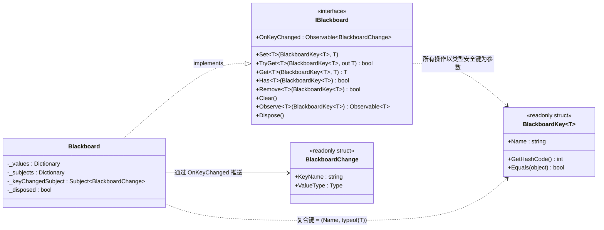
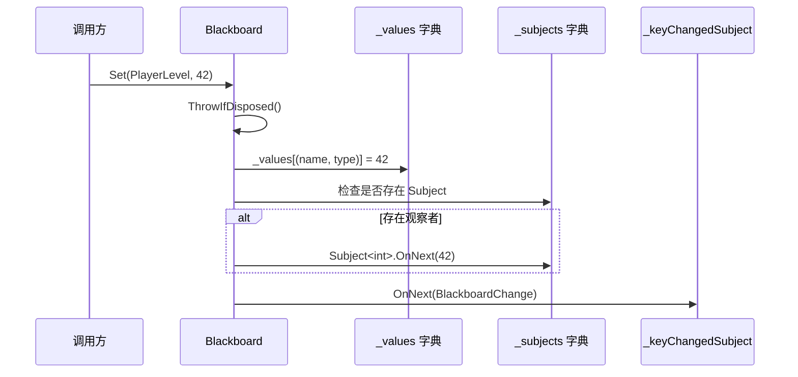

黑板（Blackboard）是 CFramework 提供的一套轻量级数据共享机制，专为游戏运行时的**跨模块状态传递**而设计。与通用的 `Dictionary<string, object>` 不同，黑板系统通过泛型键 `BlackboardKey<T>` 在编译期绑定值类型，从根本上杜绝了类型不匹配的运行时错误。同时，它深度集成了 R3 响应式框架，任何键值的变化都会通过 `Subject` 推送给订阅者，使"数据驱动"模式在游戏开发中变得自然且高效。

Sources: [IBlackboard.cs](Runtime/Core/Blackboard/IBlackboard.cs#L1-L93), [BlackboardKey.cs](Runtime/Core/Blackboard/BlackboardKey.cs#L1-L48), [Blackboard.cs](Runtime/Core/Blackboard/Blackboard.cs#L1-L170)

## 设计动机与核心概念

在游戏开发中，多个系统经常需要共享和响应某些公共状态——例如玩家的生命值、当前关卡编号、背包是否已满等。传统做法是让各系统直接引用彼此，但这样做会产生紧耦合，并且随着系统数量增长，依赖关系会迅速恶化。黑板模式通过引入一个**中立的共享数据空间**来解耦生产者和消费者：写入方只需要 `Set`，读取方只需要 `Get` 或 `Observe`，双方无需知道彼此的存在。

CFramework 的黑板系统在此基础上做了两个关键设计决策：**类型安全**和**响应式观察**。前者通过泛型键确保编译期类型检查，后者通过 R3 的 `Observable` 模式让消费者自动响应数据变化，无需轮询。

Sources: [BlackboardKey.cs](Runtime/Core/Blackboard/BlackboardKey.cs#L1-L48), [IBlackboard.cs](Runtime/Core/Blackboard/IBlackboard.cs#L28-L92)

## 架构总览

下面的 Mermaid 图展示了黑板系统的核心类关系与数据流方向。在阅读此图之前，需要了解三个前置概念：**复合键**（由键名称和值类型组成的元组）、**Subject**（R3 响应式框架中的数据推送通道）和 **BlackboardChange**（记录哪個键发生变化的轻量通知结构体）。



**数据流路径**：当调用 `Set(key, value)` 时，数据同时流向两个方向——值被写入 `_values` 字典供后续读取，同时通过 `_subjects` 中的 `Subject<T>` 推送给特定键的观察者，并通过 `_keyChangedSubject` 广播全局变化通知。

Sources: [IBlackboard.cs](Runtime/Core/Blackboard/IBlackboard.cs#L1-L93), [Blackboard.cs](Runtime/Core/Blackboard/Blackboard.cs#L1-L170), [BlackboardKey.cs](Runtime/Core/Blackboard/BlackboardKey.cs#L1-L48)

## BlackboardKey\<T\>：编译期类型安全的键

`BlackboardKey<T>` 是整个类型安全体系的基础。它是一个 `readonly struct`，通过泛型参数 `T` 将键与值类型在编译期绑定。

```csharp
// 声明强类型键——编译器将确保该键只能与 int 值搭配使用
public static readonly BlackboardKey<int> PlayerLevel = new("PlayerLevel");
public static readonly BlackboardKey<float> PlayerHealth = new("PlayerHealth");
public static readonly BlackboardKey<string> CurrentScene = new("CurrentScene");
```

其类型安全的核心在于**复合键**的设计。内部存储使用 `(string name, Type type)` 元组作为字典键，这意味着即使两个 `BlackboardKey` 拥有相同的 `Name`，只要泛型类型不同，它们在黑板中就是完全独立的条目。同时，`GetHashCode()` 的实现将 `Name` 与 `typeof(T)` 联合参与哈希计算，保证了不同类型同名键不会发生哈希冲突。

| 成员 | 说明 |
|------|------|
| `Name` | 键的字符串标识，用于复合键计算和调试输出 |
| `GetHashCode()` | 基于 `(Name, typeof(T))` 联合计算，避免跨类型碰撞 |
| `Equals()` | 同时比较 `Name` 和运行时类型 |
| `operator ==` / `!=` | 仅比较 `Name`（同类型场景下的快速比较） |
| `ToString()` | 输出格式：`BlackboardKey<Int32>(PlayerLevel)` |

**推荐实践**：将黑板键声明为 `static readonly` 字段，集中在某个静态类中统一管理，避免到处创建字符串字面量。

```csharp
public static class GameKeys
{
    public static readonly BlackboardKey<int> PlayerLevel = new("PlayerLevel");
    public static readonly BlackboardKey<float> PlayerHealth = new("PlayerHealth");
    public static readonly BlackboardKey<bool> IsPaused = new("IsPaused");
}
```

Sources: [BlackboardKey.cs](Runtime/Core/Blackboard/BlackboardKey.cs#L1-L48)

## IBlackboard 接口与 API 全景

`IBlackboard` 接口定义了黑板的完整操作契约。它继承自 `IDisposable`，意味着黑板实例拥有明确的生命周期边界。

### 读写操作

| API | 行为 | 返回值 |
|-----|------|--------|
| `Set<T>(key, value)` | 写入或覆盖指定键的值 | `void` |
| `Get<T>(key, defaultValue)` | 读取值，不存在时返回 `defaultValue` | `T` |
| `TryGet<T>(key, out value)` | 尝试读取值 | `bool`（是否成功） |
| `Has<T>(key)` | 检查键是否存在 | `bool` |
| `Remove<T>(key)` | 移除键并触发通知 | `bool`（是否移除成功） |
| `Clear()` | 清空所有键值 | `void` |

### 响应式观察

| API | 行为 | 返回值 |
|-----|------|--------|
| `Observe<T>(key)` | 观察指定键的值变化流 | `Observable<T>` |
| `OnKeyChanged` | 监听任意键的变化事件 | `Observable<BlackboardChange>` |

`Observe` 和 `OnKeyChanged` 的核心区别在于**观察粒度**：前者只关注某个特定键的值变化，后者捕获黑板中所有写操作的统览事件。这种双层通知机制允许开发者根据场景选择合适的观察策略。

Sources: [IBlackboard.cs](Runtime/Core/Blackboard/IBlackboard.cs#L28-L92)

## Blackboard 实现细节

`Blackboard` 类是 `IBlackboard` 的唯一实现，内部采用**三层数据结构**协同工作。

### 存储层：复合键字典

```csharp
private readonly Dictionary<(string name, Type type), object> _values = new();
private readonly Dictionary<(string name, Type type), object> _subjects = new();
```

两个字典使用相同的复合键格式 `(name, type)`。`_values` 存储实际的业务数据，`_subjects` 存储为该键创建的 `Subject<T>` 实例。`_subjects` 采用**延迟创建**策略——只有在首次调用 `Observe<T>()` 时才会创建对应的 `Subject`，这避免了为无人观察的键分配不必要的响应式资源。

Sources: [Blackboard.cs](Runtime/Core/Blackboard/Blackboard.cs#L18-L26)

### 写入流程：Set 操作的双通道通知



`Set` 操作是整个黑板的核心写入路径。它首先将值写入 `_values` 字典，然后检查是否有人通过 `Observe` 订阅了该键，如果有则推送新值；最后无论是否有特定观察者，都会通过 `_keyChangedSubject` 广播全局变化通知。这种设计确保了 **"先写后通知"** 的语义——通知触发时，数据已经持久化到字典中，观察者可以安全地通过 `Get` 读到最新值。

Sources: [Blackboard.cs](Runtime/Core/Blackboard/Blackboard.cs#L38-L52)

### 移除流程：Remove 的优雅通知

`Remove` 操作在成功移除键后，会向已存在的 `Subject` 推送 `default(T)` 值。这是一种**约定优于配置**的设计——观察者收到 `default` 值即表示该键已从黑板中消失，无需额外的"移除事件"类型。对于值类型（如 `int`），`default` 为 `0`；对于引用类型，`default` 为 `null`。

Sources: [Blackboard.cs](Runtime/Core/Blackboard/Blackboard.cs#L89-L109)

### 响应式观察：Observe 的延迟创建机制

```csharp
public Observable<T> Observe<T>(BlackboardKey<T> key)
{
    ThrowIfDisposed();
    var compositeKey = (key.Name, typeof(T));
    if (!_subjects.TryGetValue(compositeKey, out var subject))
    {
        subject = new Subject<T>();
        _subjects[compositeKey] = subject;
    }
    return (Subject<T>)subject;
}
```

`Observe` 方法采用了**懒初始化**模式：仅在首次被调用时创建 `Subject<T>`，后续调用直接返回已创建的实例。这意味着如果你只使用 `Get/Set` 而从不调用 `Observe`，黑板的内存开销仅限于一个 `Dictionary` 的条目，而不会产生任何 R3 对象。

**重要提示**：`Observe` 返回的 `Subject<T>` 在黑板 `Dispose` 时会被统一释放。如果在 `Dispose` 后尝试订阅，将收到 `ObjectDisposedException`。

Sources: [Blackboard.cs](Runtime/Core/Blackboard/Blackboard.cs#L127-L143)

### 生命周期管理：Dispose 模式

`Blackboard` 实现了标准的 `Dispose` 模式。调用 `Dispose()` 后，所有内部 `Subject` 和 `_keyChangedSubject` 被逐一释放，两个字典被清空，此后任何操作都会抛出 `ObjectDisposedException`。这种严格的释放语义确保了黑板实例在场景切换或游戏退出时不会产生资源泄漏。

Sources: [Blackboard.cs](Runtime/Core/Blackboard/Blackboard.cs#L145-L169)

## 实战用法

### 基础读写

```csharp
// 定义键
public static class GameKeys
{
    public static readonly BlackboardKey<int> PlayerLevel = new("PlayerLevel");
    public static readonly BlackboardKey<float> Health = new("Health");
}

// 创建黑板实例
var board = new Blackboard();

// 写入
board.Set(GameKeys.PlayerLevel, 10);
board.Set(GameKeys.Health, 85.5f);

// 读取
int level = board.Get(GameKeys.PlayerLevel);        // 10
bool found = board.TryGet(GameKeys.Health, out float hp); // found = true, hp = 85.5f

// 安全读取不存在的键（返回默认值）
int unknown = board.Get(GameKeys.PlayerLevel, -1);   // 返回实际值 10
```

### 响应式订阅

```csharp
// 观察特定键的值变化
board.Observe(GameKeys.Health)
    .Subscribe(hp => Debug.Log($"血量变化: {hp}"))
    .AddTo(gameObject);  // 绑定到 GameObject 生命周期

// 监听黑板中任意键的变化
board.OnKeyChanged
    .Subscribe(change => Debug.Log($"键 {change.KeyName}({change.ValueType.Name}) 已变化"))
    .AddTo(gameObject);

// 写入触发通知
board.Set(GameKeys.Health, 60f);  // 输出: "血量变化: 60" 和 "键 Health(Single) 已变化"
```

### 在 DI 容器中注册

黑板默认不被框架自动注册。你可以通过 VContainer 的安装器机制将其纳入依赖注入体系：

```csharp
public class GameBlackboardInstaller : IInstaller
{
    public void Install(IContainerBuilder builder)
    {
        builder.Register<IBlackboard, Blackboard>(Lifetime.Singleton);
    }
}

// 在游戏启动时注册
GameScope.AddInstaller(new GameBlackboardInstaller());
```

注册后，任何通过 VContainer 注入的服务都可以直接使用黑板：

```csharp
public class PlayerService
{
    private readonly IBlackboard _board;

    public PlayerService(IBlackboard board)
    {
        _board = board;
    }

    public void TakeDamage(float amount)
    {
        var currentHp = _board.Get(GameKeys.Health, 100f);
        _board.Set(GameKeys.Health, Mathf.Max(0, currentHp - amount));
    }
}
```

### 与 UI 面板联动

黑板的响应式特性使其特别适合驱动 UI 更新。配合 R3 的 `AddTo` 机制，订阅可以自动随面板销毁而清理：

```csharp
public class HUDPanel : IUI
{
    private readonly IBlackboard _board;
    private readonly Text _healthText;

    public void OnOpen()
    {
        _board.Observe(GameKeys.Health)
            .Subscribe(UpdateHealthDisplay)
            .AddTo(_disposable);
    }

    private void UpdateHealthDisplay(float hp)
    {
        _healthText.text = $"HP: {hp:F0}";
    }
}
```

Sources: [IBlackboard.cs](Runtime/Core/Blackboard/IBlackboard.cs#L28-L92), [Blackboard.cs](Runtime/Core/Blackboard/Blackboard.cs#L1-L170)

## 设计决策与模式分析

| 设计决策 | 优势 | 权衡 |
|----------|------|------|
| 泛型键 `BlackboardKey<T>` | 编译期类型检查，消除类型转换异常 | 每种值类型需定义独立键 |
| 复合键 `(name, Type)` | 同名不同类型的键互不干扰 | 轻微的装箱开销（`Type` 作为字典键） |
| Subject 延迟创建 | 无人观察的键不分配响应式资源 | 首次 `Observe` 有微小分配开销 |
| 全局 `OnKeyChanged` | 支持统一的数据变更监控 | 无法区分"新增"与"修改" |
| `Remove` 推送 `default` | 观察者无需处理额外事件类型 | 值类型的 `default` 可能与合法业务值冲突 |
| 继承 `IDisposable` | 明确的生命周期边界，防止资源泄漏 | 需要调用方负责 `Dispose` |

### 黑板 vs 事件总线：何时选择哪个？

黑板和 [事件总线](6-shi-jian-zong-xian-tong-bu-yi-bu-fa-bu-ding-yue-yu-r3-xiang-ying-shi-ji-cheng) 都是基于发布-订阅模式的数据传递机制，但适用场景有本质区别：

| 维度 | 黑板系统 | 事件总线 |
|------|----------|----------|
| 数据模型 | **状态驱动**：存储当前值，可随时查询 | **事件驱动**：流式传递，不存储历史 |
| 消费时机 | 新订阅者只能收到**变更后的**通知 | 错过的事件**不会重播** |
| 类型约束 | 键绑定了单一值类型 | 每种事件是独立类型 |
| 生命周期 | 数据持久存在直到被 `Remove` 或 `Clear` | 事件即发即忘 |
| 典型场景 | 玩家属性、游戏状态、开关标志 | 一次性通知、跨系统触发、异步命令 |

**简单原则**：如果你需要**存储并可查询**某个状态的当前值，用黑板；如果你只需要**通知**某件事发生了，用事件总线。

Sources: [BlackboardKey.cs](Runtime/Core/Blackboard/BlackboardKey.cs#L28-L31), [Blackboard.cs](Runtime/Core/Blackboard/Blackboard.cs#L127-L143), [IBlackboard.cs](Runtime/Core/Blackboard/IBlackboard.cs#L1-L26)

## 下一步阅读

- **[事件总线：同步/异步发布订阅与 R3 响应式集成](6-shi-jian-zong-xian-tong-bu-yi-bu-fa-bu-ding-yue-yu-r3-xiang-ying-shi-ji-cheng)** — 理解黑板与事件总线的互补关系，掌握两种数据传递模式的最佳适用场景
- **[依赖注入体系：GameScope、SceneScope 与动态安装器机制](5-yi-lai-zhu-ru-ti-xi-gamescope-scenescope-yu-dong-tai-an-zhuang-qi-ji-zhi)** — 了解如何通过自定义 `IInstaller` 将黑板注册为全局单例服务
- **[有限状态机：标准 FSM 与栈状态机的设计与使用](18-you-xian-zhuang-tai-ji-biao-zhun-fsm-yu-zhan-zhuang-tai-ji-de-she-ji-yu-shi-yong)** — 黑板的响应式特性可与状态机配合，实现状态变更的自动 UI 更新