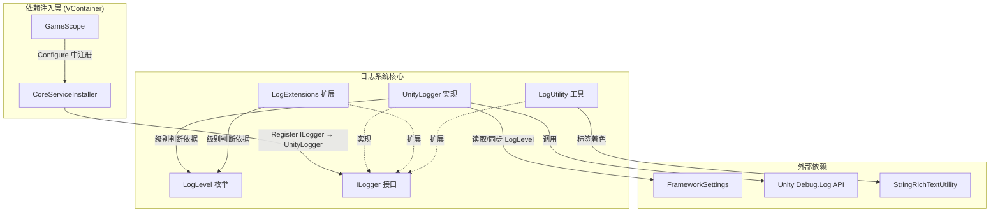

你有没有遇到过这样的场景——在开发阶段希望看到每一条调试信息，但到了发布版本时又希望把这些"噪音"全部关掉？CFramework 的日志系统正是为解决这个问题而设计的。它通过一套清晰的**分级过滤机制**，让你用一行配置就能控制哪些日志该输出、哪些该静默，同时以**接口+实现**的架构确保日志行为可测试、可替换。

---

## 整体架构一览

日志系统由四个核心文件和一个辅助工具类组成，它们各司其职、层层协作：

| 组件 | 文件 | 职责 |
|------|------|------|
| **LogLevel** | `Runtime/Core/Log/LogLevel.cs` | 定义日志级别枚举，作为过滤的"标尺" |
| **ILogger** | `Runtime/Core/Log/ILogger.cs` | 日志服务抽象接口，定义全部日志操作契约 |
| **UnityLogger** | `Runtime/Core/Log/UnityLogger.cs` | ILogger 的 Unity 引擎实现，桥接 `Debug.Log` 系列 API |
| **LogExtensions** | `Runtime/Core/Log/LogExtensions.cs` | 扩展方法，为 ILogger 增加格式化字符串支持 |
| **LogUtility** | `Runtime/Utility/LogUtility.cs` | 工具类，提供带颜色标签的富文本日志输出 |

下面的关系图展示了这些组件如何协作，以及它们在整个框架依赖注入体系中的位置：



Sources: [CoreServiceInstaller.cs](Runtime/Core/DI/CoreServiceInstaller.cs#L1-L23), [LogLevel.cs](Runtime/Core/Log/LogLevel.cs#L1-L38), [ILogger.cs](Runtime/Core/Log/ILogger.cs#L1-L70), [UnityLogger.cs](Runtime/Core/Log/UnityLogger.cs#L1-L143)

---

## LogLevel：日志级别的"门槛"

`LogLevel` 是一个枚举类型，定义了六个级别，每个级别对应一个整数值。**数值越大，代表严重程度越高**。这个数值不是随便定的——它直接参与过滤逻辑的比较运算。

| 枚举成员 | 数值 | 含义 | 典型使用场景 |
|----------|------|------|-------------|
| `Debug` | 0 | 调试信息 | 变量值检查、方法进入/退出追踪 |
| `Info` | 1 | 一般信息 | 系统初始化完成、服务启动通知 |
| `Warning` | 2 | 警告信息 | 使用了缺失配置、降级处理提醒 |
| `Error` | 3 | 错误信息 | 操作失败但不会导致崩溃 |
| `Exception` | 4 | 异常信息 | 未捕获的异常堆栈 |
| `None` | 100 | 禁用所有日志 | 发布版本中完全关闭日志输出 |

过滤规则很简单：**当一条日志的级别数值 ≥ 当前设置的 LogLevel 数值时，这条日志才会被输出**。举个例子：

- 设置为 `Debug`（0）→ 所有日志都会输出（因为任何级别 ≥ 0）
- 设置为 `Warning`（2）→ 只有 Warning、Error、Exception 会输出
- 设置为 `None`（100）→ 完全静默

```
当前级别 = Warning (2)

  Debug (0)    ── 0 < 2 ── ✗ 不输出
  Info  (1)    ── 1 < 2 ── ✗ 不输出
  Warning (2)  ── 2 ≥ 2 ── ✓ 输出
  Error (3)    ── 3 ≥ 2 ── ✓ 输出
  Exception (4)── 4 ≥ 2 ── ✓ 输出
```

这个设计意味着你只需调高一个设置值，就能让低级别的调试信息自动消失，而严重问题始终能被捕获。

Sources: [LogLevel.cs](Runtime/Core/Log/LogLevel.cs#L1-L38), [UnityLogger.cs](Runtime/Core/Log/UnityLogger.cs#L36-L39)

---

## ILogger 接口：日志操作契约

`ILogger` 是日志服务的抽象接口，它定义了框架中所有日志操作的标准签名。面向接口编程的好处是——你的业务代码只依赖 `ILogger`，不绑定任何具体的日志实现。未来如果你想要替换成自定义的日志系统（比如写入文件、发送到远程服务器），只需提供一个新的实现类即可。

接口提供了三个维度的 API：

**级别判断**：`IsEnabled(LogLevel level)` —— 在执行耗时的日志格式化之前先检查级别，避免无谓的性能开销。

**基础日志方法**（每个级别提供有无标签两个重载）：

| 方法 | 无标签版本 | 带标签版本 |
|------|-----------|-----------|
| 调试 | `LogDebug(string message)` | `LogDebug(string tag, string message)` |
| 信息 | `LogInfo(string message)` | `LogInfo(string tag, string message)` |
| 警告 | `LogWarning(string message)` | `LogWarning(string tag, string message)` |
| 错误 | `LogError(string message)` | `LogError(string tag, string message)` |
| 异常 | `LogException(Exception ex)` | `LogException(string tag, Exception ex)` |

**带标签的版本**会在消息前自动添加 `[Tag]` 前缀，例如传入 tag 为 `"Audio"`、message 为 `"初始化完成"`，最终输出为 `[Audio] 初始化完成`。这在 Console 窗口中一眼就能区分日志来源。

Sources: [ILogger.cs](Runtime/Core/Log/ILogger.cs#L1-L70)

---

## UnityLogger：Unity 引擎的实现

`UnityLogger` 是框架默认提供的 `ILogger` 实现，它做了一件事——**把 CFramework 的日志级别体系桥接到 Unity 原生的 `Debug.Log` 系列 API 上**。

### 构造与初始化

`UnityLogger` 通过构造函数接收 `FrameworkSettings`，并从中读取初始 `LogLevel`。如果 settings 为 null，则默认使用 `Debug` 级别（即全部输出）。在实际运行时，`GameScope` 启动后通过 VContainer 的依赖注入自动完成这一过程：

```csharp
// CoreServiceInstaller 中注册（VContainer 自动注入 FrameworkSettings）
builder.Register<ILogger, UnityLogger>(Lifetime.Singleton);
```

VContainer 发现 `UnityLogger` 的构造函数需要 `FrameworkSettings` 参数，而 `FrameworkSettings` 已经在 `GameScope.Configure` 中被注册为实例，因此整个注入链自动完成，你无需手动创建 `UnityLogger`。

### 双向同步机制

`UnityLogger` 的 `LogLevel` 属性具有一个精巧的双向同步设计：当你修改 `UnityLogger.LogLevel` 时，它会**同时更新内部的 `_logLevel` 字段和 `FrameworkSettings` 上的 `LogLevel`**。这意味着运行时通过代码修改日志级别后，设置资产也会被同步更新，下次启动时自动沿用最新配置。

```csharp
// 修改日志级别时自动同步到 FrameworkSettings
public LogLevel LogLevel
{
    get => _logLevel;
    set
    {
        _logLevel = value;
        if (_settings != null) _settings.LogLevel = value;
    }
}
```

### 消息格式化

标签的格式化逻辑在 `FormatMessage` 方法中——如果 tag 非空，就拼接为 `[Tag] Message` 格式；如果 tag 为空或 null，则直接输出原始消息，不添加任何前缀。

### 各级别与 Unity API 的映射

| CFramework 方法 | 过滤级别 | 调用的 Unity API | Console 图标 |
|-----------------|---------|-----------------|-------------|
| `LogDebug` | `Debug` | `Debug.Log()` | 白色信息图标 |
| `LogInfo` | `Info` | `Debug.Log()` | 白色信息图标 |
| `LogWarning` | `Warning` | `Debug.LogWarning()` | 黄色警告图标 |
| `LogError` | `Error` | `Debug.LogError()` | 红色错误图标 |
| `LogException` | `Exception` | `Debug.LogException()` | 红色错误图标 + 堆栈 |

值得注意的是 `LogException` 的特殊行为：无标签版本直接调用 `Debug.LogException()`（保留完整堆栈追踪）；带标签版本会额外调用一次 `Debug.LogError()` 输出标签消息，然后再输出完整异常堆栈，这样在 Console 中你能同时看到来源标签和异常详情。

Sources: [UnityLogger.cs](Runtime/Core/Log/UnityLogger.cs#L1-L143), [CoreServiceInstaller.cs](Runtime/Core/DI/CoreServiceInstaller.cs#L15-L21), [GameScope.cs](Runtime/Core/DI/GameScope.cs#L97-L113)

---

## LogExtensions：格式化扩展方法

`LogExtensions` 是一个静态扩展方法类，为 `ILogger` 增加了格式化字符串支持。它的核心价值在于**提前短路**——在调用 `string.Format()` 之前先检查日志级别，如果当前级别不允许输出，就直接返回，避免了一次无谓的字符串格式化开销。

```csharp
// 扩展方法中的提前短路模式
public static void LogDebugFormat(this ILogger logger, string format, params object[] args)
{
    if (!logger.IsEnabled(LogLevel.Debug)) return;  // 先检查，再格式化
    logger.LogDebug(string.Format(format, args));
}
```

可用的扩展方法一览：

| 方法签名 | 说明 |
|---------|------|
| `LogDebugFormat(format, args)` | 格式化调试日志 |
| `LogDebugFormat(tag, format, args)` | 带标签的格式化调试日志 |
| `LogInfoFormat(format, args)` | 格式化信息日志 |
| `LogInfoFormat(tag, format, args)` | 带标签的格式化信息日志 |
| `LogWarningFormat(format, args)` | 格式化警告日志 |
| `LogWarningFormat(tag, format, args)` | 带标签的格式化警告日志 |
| `LogErrorFormat(format, args)` | 格式化错误日志 |
| `LogErrorFormat(tag, format, args)` | 带标签的格式化错误日志 |

Sources: [LogExtensions.cs](Runtime/Core/Log/LogExtensions.cs#L1-L80)

---

## LogUtility：带颜色的日志工具

`LogUtility` 提供了两个实用扩展方法，让你的日志标签在 Unity Console 中以**富文本颜色**显示，在信息密集的调试场景下大幅提升可读性。

### LogWithColor —— 自定义颜色

```csharp
// 用法示例：将标签渲染为自定义颜色
logger.LogWithColor("MyModule", "初始化完成", Color.cyan, LogLevel.Info);
// Console 中显示: <color=#00FFFF>MyModule</color> 初始化完成
```

你可以指定任意 `Color` 值作为标签颜色，并通过最后一个参数指定使用哪个日志级别输出。

### LogWithLevelColor —— 自动级别配色

```csharp
// 用法示例：根据日志级别自动选色
logger.LogWithLevelColor("Audio", "播放开始", LogLevel.Debug);   // 绿色标签
logger.LogWithLevelColor("Audio", "初始化完成", LogLevel.Info);  // 白色标签
logger.LogWithLevelColor("Audio", "资源缺失", LogLevel.Warning); // 黄色标签
logger.LogWithLevelColor("Audio", "加载失败", LogLevel.Error);   // 红色标签
```

各级别对应的默认颜色如下：

| 级别 | 颜色 | 视觉含义 |
|------|------|---------|
| `Debug` | 绿色 | 常规调试信息，低视觉优先级 |
| `Info` | 白色 | 一般通知，中性色调 |
| `Warning` | 黄色 | 需要注意，提醒关注 |
| `Error` / `Exception` | 红色 | 严重问题，高优先级警示 |

这两个方法内部通过 [StringRichTextUtility](Runtime/Utility/String/StringRichTextUtility.cs) 的 `Color` 方法将标签包裹在 Unity 富文本标签中，将 `Color` 转换为十六进制字符串后输出 `<color=#RRGGBB>标签</color>` 格式。

Sources: [LogUtility.cs](Runtime/Utility/LogUtility.cs#L1-L73), [StringRichTextUtility.cs](Runtime/Utility/String/StringRichTextUtility.cs#L1-L28)

---

## 如何在你的代码中使用日志

### 方式一：通过依赖注入（推荐）

在需要日志的服务或组件中，通过构造函数注入 `ILogger`。这是框架中的标准模式——VContainer 会自动解析并注入已注册的日志实例：

```csharp
public class MyGameService
{
    private readonly ILogger _logger;

    // VContainer 自动注入 ILogger
    public MyGameService(ILogger logger)
    {
        _logger = logger;
    }

    public void DoSomething()
    {
        _logger.LogDebug("MyGameService", "DoSomething 被调用");
        _logger.LogInfo("MyGameService", "任务处理完成");
    }
}
```

### 方式二：通过 GameScope 全局访问

`GameScope` 在启动时自动解析所有核心服务，其中就包括 `ILogger`，你可以通过 `GameScope.Instance.Logger` 访问：

```csharp
GameScope.Instance.Logger.LogWarning("UI", "面板数量超过推荐上限");
```

### 运行时修改日志级别

你可以在任何时刻修改日志级别，改动会立即生效并同步到 `FrameworkSettings`：

```csharp
// 切换到发布模式：只输出 Error 和 Exception
GameScope.Instance.Logger.LogLevel = LogLevel.Error;

// 或通过依赖注入的实例修改
_logger.LogLevel = LogLevel.None;  // 完全静默
```

Sources: [GameScope.cs](Runtime/Core/DI/GameScope.cs#L97-L113), [FrameworkSettings.cs](Runtime/Core/FrameworkSettings.cs#L43)

---

## 测试保障

框架为日志系统提供了完整的单元测试覆盖（位于 `Tests/Runtime/Log/LoggerTests.cs`），验证了以下关键行为：

| 测试类别 | 验证内容 |
|---------|---------|
| 级别继承 | 默认 LogLevel 来自 FrameworkSettings |
| 级别过滤 | 每个级别正确过滤低于它的日志 |
| 格式化输出 | 带标签的日志正确输出 `[Tag] Message` 格式 |
| 静默行为 | 日志被过滤时不抛异常 |
| 格式化方法 | `LogDebugFormat` 等正确替换占位符 |
| 空值安全 | null/空字符串的 message 或 tag 不导致崩溃 |
| 异常处理 | null 异常对象不导致崩溃 |

其中值得注意的是**空值安全设计**——`UnityLogger.LogException` 在收到 null 异常时直接返回，不会抛出 `NullReferenceException`。同样，`FormatMessage` 对空标签也不会崩溃。这种防御性编程让你在快速迭代时不用担心日志调用本身引发新的错误。

Sources: [LoggerTests.cs](Tests/Runtime/Log/LoggerTests.cs#L1-L244)

---

## 设计总结

CFramework 日志系统的设计遵循了几个核心原则：**接口抽象**（`ILogger`）让日志行为可替换、可测试；**数值枚举**（`LogLevel`）让过滤逻辑只需一次整数比较；**扩展方法**（`LogExtensions`）在不修改接口的前提下增加格式化能力；**双向同步**（`UnityLogger` ↔ `FrameworkSettings`）保证运行时修改持久生效。对于初学者来说，你只需要记住一件事：**注入 `ILogger`，选对级别，写好消息**。

---

**下一步阅读建议**：

- 了解日志系统所在的整体依赖注入架构：[依赖注入体系：GameScope、SceneScope 与动态安装器机制](5-yi-lai-zhu-ru-ti-xi-gamescope-scenescope-yu-dong-tai-an-zhuang-qi-ji-zhi)
- 了解如何配置日志级别等全局参数：[FrameworkSettings 全局配置详解](3-frameworksettings-quan-ju-pei-zhi-xiang-jie)
- 了解异常日志的上游——框架如何统一捕获异常：[全局异常分发器：统一捕获 UniTask 与 R3 未处理异常](7-quan-ju-yi-chang-fen-fa-qi-tong-bu-huo-unitask-yu-r3-wei-chu-li-yi-chang)